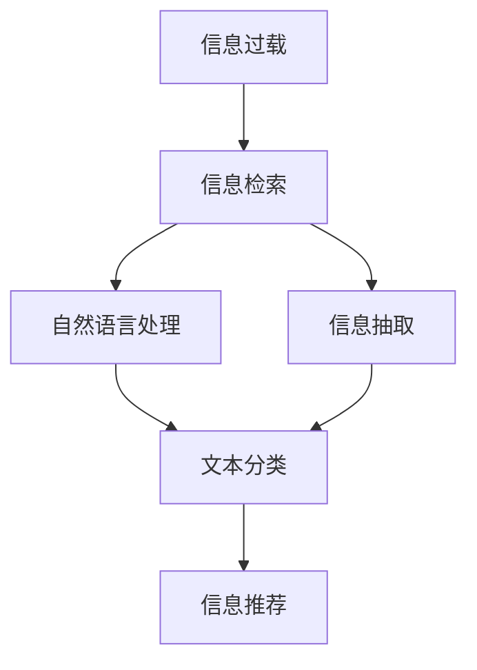

                 

# 信息过载与信息筛选技术：在信息洪流中找到有价值的信息

在信息时代，随着互联网的普及和数字化转型，信息流量的爆炸式增长已成为一个不争的事实。海量的数据不仅为企业带来了巨大的商业机会，同时也对信息筛选和提取技术提出了更高的要求。本文将深入探讨信息过载问题，分析当前信息筛选技术的现状与局限，并展望未来发展的趋势与挑战，帮助读者理解信息筛选技术的核心原理和应用方法。

## 1. 背景介绍

### 1.1 问题由来
信息过载是指在某一时间范围内接收到的信息量超过了个体能够处理的能力范围。如今，智能设备、社交媒体、在线搜索和广告等的应用，使得人们每天接触的信息量成倍增长。这一现象在商业、医疗、金融、教育等多个领域尤为显著，对信息的有效获取、筛选和利用带来了挑战。

### 1.2 问题核心关键点
面对信息过载，企业和个人需要找到一种高效、可靠、可扩展的信息筛选技术。这一技术不仅需要能够识别并过滤掉垃圾信息和噪声，还要提取和组织有价值的信息，并将其呈现给用户。核心的关键点在于：
- 数据量巨大，需要高效处理海量信息。
- 信息的多样性，需具备跨领域知识整合能力。
- 上下文理解，确保筛选结果的相关性和及时性。

## 2. 核心概念与联系

### 2.1 核心概念概述

为了更好地理解信息筛选技术，我们首先介绍几个关键概念：

- **信息过载(Information Overload)**：是指用户面对的信息量超过其处理能力，导致决策困难的问题。
- **信息检索(Information Retrieval, IR)**：通过查询关键词或文本匹配算法，从大量信息中检索出相关文档的技术。
- **自然语言处理(Natural Language Processing, NLP)**：涉及计算机如何理解、解释和生成人类语言的技术，是信息检索和筛选的重要组成部分。
- **信息抽取(Information Extraction, IE)**：从结构化和非结构化数据中提取有用信息的过程。
- **文本分类(Text Classification)**：将文本文档分配到预定义类别或主题中的技术。
- **信息推荐(Information Recommendation)**：根据用户的历史行为和偏好，推荐可能感兴趣的信息资源。

这些核心概念之间相互关联，共同构成了信息筛选技术的基础架构。

### 2.2 核心概念原理和架构的 Mermaid 流程图



这个流程图展示了信息过载问题的处理流程：

1. **信息检索**：从海量的信息中，通过关键词匹配或相关性排序，快速筛选出潜在的相关文档。
2. **自然语言处理**：分析文本内容，提取其含义和结构，为后续的信息抽取和分类做准备。
3. **信息抽取**：从文档或语料中自动提取事实和知识，进行结构化处理。
4. **文本分类**：将文本文档按预定义的类别或主题进行分类。
5. **信息推荐**：结合用户历史行为，推荐相关性高的信息资源。

这些步骤共同协作，旨在高效准确地从海量信息中提取有价值的内容，并为用户提供个性化的信息服务。

## 3. 核心算法原理 & 具体操作步骤

### 3.1 算法原理概述

信息筛选技术的核心在于如何高效地从大规模文本数据中提取出有用的信息，并将其与用户的查询或偏好相匹配。典型的算法包括：

- **信息检索算法**：如向量空间模型、基于TF-IDF的方法、基于神经网络的方法等。
- **文本分类算法**：如朴素贝叶斯、支持向量机、深度神经网络等。
- **信息抽取算法**：如规则抽取、基于规则的抽取、基于机器学习的抽取等。
- **信息推荐算法**：如协同过滤、基于内容的推荐、基于深度学习的推荐等。

这些算法通过不同的策略和方法，针对不同的应用场景，实现了信息的有效筛选和提取。

### 3.2 算法步骤详解

信息筛选技术的详细步骤通常包括：

1. **数据预处理**：对原始文本进行清洗、分词、去除停用词、词干提取等处理，为后续步骤做准备。
2. **特征提取**：将文本转换成机器可读的形式，如TF-IDF、词嵌入等。
3. **模型训练**：基于历史数据和标注信息，训练相关模型。
4. **模型评估**：对训练好的模型进行验证和测试，确保其性能符合要求。
5. **实际应用**：将训练好的模型应用到实际场景中，进行信息检索、分类、抽取或推荐。

### 3.3 算法优缺点

信息筛选技术具有以下优点：

- 高效处理海量数据：能快速从大规模文本中筛选出相关信息。
- 具备跨领域知识整合能力：能够处理不同领域和类型的信息。
- 个性化推荐：根据用户的历史行为和偏好，提供定制化的信息服务。

同时，这些技术也存在一些局限性：

- 数据依赖性强：模型的性能依赖于训练数据的质量和数量。
- 模型复杂度高：一些算法如深度神经网络，需要较大的计算资源和长时间训练。
- 信息提取的准确性：不同算法在不同领域和任务上的表现差异较大。
- 用户隐私和安全问题：需要处理用户个人信息和隐私，存在泄露风险。

### 3.4 算法应用领域

信息筛选技术广泛应用于多个领域，例如：

- **商业智能(Business Intelligence, BI)**：通过分析企业内部和外部的数据，为企业决策提供支持。
- **金融分析**：从大量金融数据中提取有价值的信息，进行市场分析和风险预测。
- **医疗健康**：从医学文献和病历中提取有用信息，辅助医生诊断和治疗。
- **新闻推荐**：根据用户的浏览历史和兴趣，推荐相关的新闻内容。
- **个性化推荐系统**：基于用户的购买、浏览历史，推荐可能感兴趣的商品或内容。

## 4. 数学模型和公式 & 详细讲解 & 举例说明

### 4.1 数学模型构建

信息检索和推荐系统的数学模型通常基于概率论和统计学原理，以最大化相关性和个性化推荐度为目标。

以向量空间模型为例，假设文本集为 $D$，文本表示为 $d \in \mathbb{R}^n$，查询表示为 $q \in \mathbb{R}^n$，文本-查询相似度为 $\cos(q, d)$。则文本检索的公式可以表示为：

$$
\hat{d} = \mathop{\arg\max}_{d \in D} \cos(q, d)
$$

其中 $\cos$ 表示余弦相似度。

### 4.2 公式推导过程

信息推荐模型的推导通常基于协同过滤或深度学习的原理。

假设用户-物品评分矩阵为 $R \in \mathbb{R}^{U \times I}$，用户向量为 $u \in \mathbb{R}^U$，物品向量为 $v \in \mathbb{R}^I$。基于协同过滤的推荐公式为：

$$
\hat{R}_{iu} = \mathop{\arg\max}_{R_{iu}} \langle u, v_{iu} \rangle
$$

其中 $\langle u, v_{iu} \rangle$ 表示用户和物品向量间的点积。

### 4.3 案例分析与讲解

假设我们有一组用户对商品的历史评分数据 $R$，需要将这些评分数据转换成向量表示，并推荐可能感兴趣的商品给用户。

首先，计算用户向量 $u$ 和物品向量 $v_{iu}$：

$$
u = \frac{1}{N} \sum_{i=1}^N R_i
$$

$$
v_{iu} = R_{iu}
$$

然后，使用协同过滤算法计算推荐值：

$$
\hat{R}_{iu} = \frac{\langle u, v_{iu} \rangle}{\|u\|\|v_{iu}\|}
$$

最终，将推荐值按大小排序，输出推荐商品。

## 5. 项目实践：代码实例和详细解释说明

### 5.1 开发环境搭建

在进行信息筛选项目开发前，需要搭建好Python开发环境。以下是搭建环境的详细步骤：

1. 安装Anaconda：从官网下载并安装Anaconda，用于创建独立的Python环境。
2. 创建并激活虚拟环境：
```bash
conda create -n info-screen python=3.8 
conda activate info-screen
```
3. 安装必要的库：
```bash
conda install pandas numpy scikit-learn matplotlib jupyter notebook ipython
```

### 5.2 源代码详细实现

以下是一个基于信息检索的文本分类示例，使用朴素贝叶斯算法实现：

```python
from sklearn.datasets import fetch_20newsgroups
from sklearn.feature_extraction.text import CountVectorizer
from sklearn.naive_bayes import MultinomialNB
from sklearn.pipeline import Pipeline
from sklearn.metrics import accuracy_score

# 加载数据集
newsgroups = fetch_20newsgroups(subset='train')
X_train, y_train = newsgroups.data, newsgroups.target

# 构建文本向量化器
count_vect = CountVectorizer()

# 训练朴素贝叶斯模型
clf = MultinomialNB()

# 构建流水线
pipe = Pipeline([
    ('vect', count_vect),
    ('clf', clf)
])

# 拟合模型
pipe.fit(X_train, y_train)

# 测试模型
X_test = fetch_20newsgroups(subset='test').data
y_test = fetch_20newsgroups(subset='test').target
y_pred = pipe.predict(X_test)
accuracy = accuracy_score(y_test, y_pred)
print(f"Accuracy: {accuracy:.2f}")
```

### 5.3 代码解读与分析

让我们进一步解读上述代码的关键部分：

1. **数据加载**：使用`sklearn.datasets`中的`fetch_20newsgroups`加载20个新组数据集，分为训练集和测试集。
2. **文本向量化**：使用`CountVectorizer`对文本进行分词和向量化处理，转换成特征向量。
3. **模型训练**：使用`MultinomialNB`训练朴素贝叶斯分类器。
4. **流水线构建**：将向量化和分类过程集成到`Pipeline`中，简化了模型构建流程。
5. **模型评估**：在测试集上评估模型准确率，并输出结果。

### 5.4 运行结果展示

运行上述代码，输出模型在测试集上的准确率。可以看到，朴素贝叶斯模型在文本分类任务上取得了不错的效果。

## 6. 实际应用场景

### 6.1 智能推荐系统

信息推荐系统已广泛应用于电商、社交媒体、音乐和视频平台等领域。智能推荐系统通过分析用户的历史行为，预测其可能感兴趣的内容，提升用户体验和满意度。

例如，淘宝和亚马逊的推荐引擎，根据用户的浏览记录、购买历史和搜索关键词，动态推荐相关商品，极大地提高了用户的购买转化率。

### 6.2 新闻推荐系统

新闻推荐系统是信息筛选技术的典型应用之一，通过分析用户的新闻浏览历史和兴趣标签，推荐相关新闻内容，提升用户的获取效率和满意度。

例如，今日头条的推荐算法，根据用户的阅读习惯和点赞、评论等互动行为，推荐可能感兴趣的新闻文章。

### 6.3 医疗信息检索

医疗信息检索技术通过分析医学文献和病历，提取有用的诊断和治疗方法，辅助医生进行决策。

例如，IBM的Watson Health平台，能够从大量医学文献中提取相关知识，提供个性化的治疗建议，帮助医生提高诊疗效率和质量。

### 6.4 未来应用展望

随着深度学习和大数据技术的发展，信息筛选技术将进一步深化和扩展，未来的发展趋势可能包括：

1. **多模态信息融合**：结合图像、语音、视频等多模态信息，提升信息抽取和推荐的准确性。
2. **跨领域知识迁移**：利用领域间的知识关联，提升模型在不同领域间的迁移能力。
3. **自适应学习机制**：引入强化学习、生成对抗网络等技术，实现模型的自适应调整。
4. **动态推荐模型**：基于实时反馈，动态调整推荐模型，提升推荐效果。
5. **个性化用户模型**：结合用户的兴趣、行为和心理特征，构建更加精准的用户模型。

## 7. 工具和资源推荐

### 7.1 学习资源推荐

为了帮助读者深入学习信息筛选技术，推荐以下资源：

1. **《信息检索：基础与前沿》**：由信息检索领域的权威学者陈树森编写，系统介绍了信息检索的基础知识和前沿技术。
2. **《深度学习》**：由Goodfellow等学者编写，涵盖了深度学习的理论基础和实践方法。
3. **《自然语言处理综论》**：由D Jurafsky和J Hirschberg编写，全面介绍了NLP的基本概念和技术。
4. **《Python自然语言处理》**：由J.bird编写，提供了Python实现NLP任务的代码示例。
5. **Kaggle平台**：提供丰富的数据集和比赛，实践NLP任务。

### 7.2 开发工具推荐

以下是信息筛选项目开发中常用的工具：

1. **Python**：简单易学，拥有丰富的科学计算库和数据处理库。
2. **Jupyter Notebook**：支持交互式编程和数据可视化，方便代码调试和实验。
3. **PyTorch**：基于动态计算图，灵活实现深度学习模型。
4. **TensorFlow**：开源的机器学习框架，支持分布式训练和大规模数据处理。
5. **Scikit-learn**：简单易用的机器学习库，包含丰富的算法实现。

### 7.3 相关论文推荐

信息筛选技术的发展离不开学术论文的推动。以下是一些经典的研究论文：

1. **《信息检索中的向量空间模型》**：由Christopher D. Manning等学者编写，介绍了向量空间模型的基本原理和应用。
2. **《基于深度学习的文本分类》**：由Yoshua Bengio等学者编写，介绍了深度神经网络在文本分类中的应用。
3. **《协同过滤推荐算法》**：由Andrew K. Ng等学者编写，介绍了协同过滤算法的原理和实现。
4. **《基于用户画像的推荐系统》**：由Guo Qiang等学者编写，介绍了用户画像在推荐系统中的应用。

## 8. 总结：未来发展趋势与挑战

### 8.1 总结

本文详细介绍了信息筛选技术的原理、方法和应用，帮助读者理解信息过载问题的本质及其解决之道。信息筛选技术通过高效处理海量信息，提取有价值的内容，为多个领域的应用提供了支持。然而，信息筛选技术在实际应用中仍然面临诸多挑战，需要不断优化和改进。

### 8.2 未来发展趋势

展望未来，信息筛选技术将朝着以下方向发展：

1. **多模态融合**：结合视觉、听觉和文本等多种模态信息，提升信息抽取和推荐的准确性。
2. **跨领域迁移**：利用不同领域之间的知识关联，提升模型在不同场景下的迁移能力。
3. **自适应学习**：引入强化学习和生成对抗网络等技术，实现模型的动态调整和优化。
4. **个性化推荐**：结合用户的兴趣、行为和心理特征，构建更加精准的推荐模型。
5. **实时处理**：利用流式处理和实时计算技术，实现信息的实时筛选和推荐。

### 8.3 面临的挑战

尽管信息筛选技术在多个领域得到了广泛应用，但仍面临以下挑战：

1. **数据质量**：数据质量直接影响模型的性能，需要大量的高质量标注数据。
2. **计算资源**：大规模数据处理和深度学习模型的训练需要高性能计算资源。
3. **用户隐私**：需要保护用户的个人信息和隐私，避免泄露和滥用。
4. **模型复杂性**：复杂的模型增加了实现和维护的难度，需要专家团队支持。
5. **鲁棒性**：模型的鲁棒性需要进一步提升，避免过拟合和噪音干扰。

### 8.4 研究展望

面对信息筛选技术面临的挑战，未来的研究方向包括：

1. **无监督学习**：探索无监督和半监督学习方法，减少对标注数据的依赖。
2. **多任务学习**：结合多个任务的目标，提高模型的泛化能力。
3. **深度强化学习**：结合深度学习和强化学习，实现更加智能的推荐系统。
4. **隐私保护**：研究隐私保护技术，确保用户数据的安全性和匿名性。
5. **跨模态融合**：探索多模态信息的深度融合，提升模型的综合性能。

## 9. 附录：常见问题与解答

### Q1: 信息筛选技术与搜索引擎的区别是什么？

A: 信息筛选技术与搜索引擎的核心区别在于处理方式和目标。搜索引擎主要基于关键词匹配，从大量文档中筛选出相关结果，目的是提高信息检索的准确性和效率。而信息筛选技术则更注重内容的深层次理解和提取，旨在从海量的信息中提取有价值的信息，并进行分类、推荐等操作。

### Q2: 如何提高信息筛选模型的准确性？

A: 提高信息筛选模型的准确性可以从以下几个方面入手：
1. 提高数据质量：使用更多高质量的标注数据，训练更加准确的模型。
2. 选择适合的算法：根据任务特点选择合适的算法，如深度神经网络、协同过滤等。
3. 特征工程：设计有效的特征提取方法，提升模型的泛化能力。
4. 模型优化：调整模型结构，使用正则化、dropout等技术减少过拟合。
5. 多任务学习：结合多个任务，提升模型的整体性能。

### Q3: 信息筛选技术在企业中的应用前景如何？

A: 信息筛选技术在企业中具有广泛的应用前景，可以提升企业的决策效率和业务流程的自动化程度。例如，通过分析客户反馈，进行情感分析，提升客户服务质量；通过分析供应链数据，进行需求预测，优化库存管理；通过分析市场数据，进行市场分析，优化营销策略。

### Q4: 信息推荐系统与个性化推荐系统有什么区别？

A: 信息推荐系统与个性化推荐系统的区别在于推荐方式。信息推荐系统通常基于用户的浏览历史和兴趣标签，推荐相关内容，提升用户获取信息的效率。而个性化推荐系统则更注重个性化，通过深度学习等技术，根据用户的个人偏好和行为特征，推荐个性化的内容，提升用户的满意度。

---

作者：禅与计算机程序设计艺术 / Zen and the Art of Computer Programming

