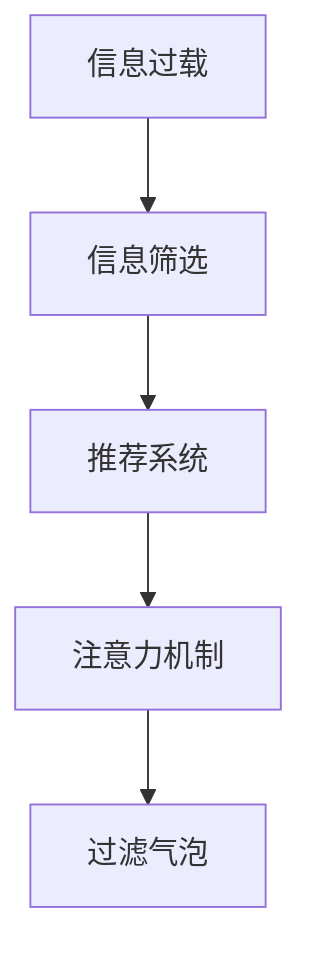
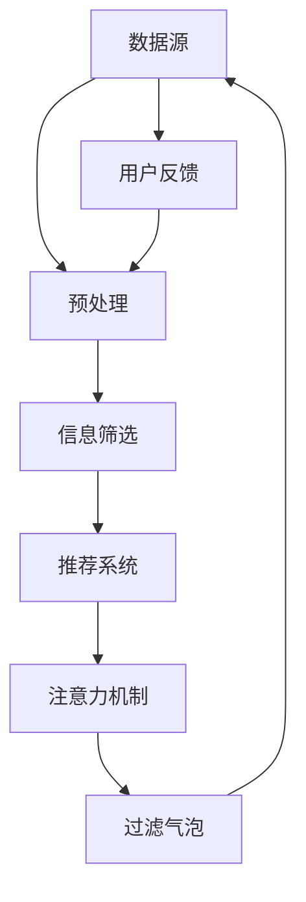

                 

# 信息过载与信息筛选指南：在信息洪流中找到有价值和相关的信息

## 1. 背景介绍

在当今数字化时代，信息量的爆炸式增长已经成为了一个普遍现象。无论是通过搜索引擎，还是社交媒体，亦或是新闻订阅，人们每天都在接收海量的信息。尽管信息技术的进步为获取知识提供了前所未有的便利，但随之而来的信息过载问题也变得越来越显著。信息过载（Information Overload）指的是一个人、组织或系统接收到的信息量超过其处理能力，导致决策困难、认知负担加剧。如何有效地在信息洪流中找到有价值和相关的信息，成为了一个亟需解决的问题。本文将从信息过载的原因、影响和信息筛选技术等方面进行深入探讨，旨在为读者提供一套全面的指南，帮助他们在信息洪流中快速找到有价值的信息。

## 2. 核心概念与联系

### 2.1 核心概念概述

要有效地解决信息过载问题，首先需要明确几个关键概念：

- **信息过载**（Information Overload）：当信息量超过处理能力时，产生的认知负担。
- **信息筛选**（Information Filtering）：从大量信息中挑选出相关且有用的信息。
- **推荐系统**（Recommendation Systems）：基于用户行为和兴趣，自动推荐信息的技术。
- **注意力机制**（Attention Mechanism）：一种模型设计技巧，用于增强模型对重要信息的关注。
- **过滤气泡**（Filter Bubble）：由个性化算法所形成的用户仅接触与其现有观点一致信息的“气泡”。

这些概念通过以下Mermaid流程图展示了它们之间的联系：



这个图表显示了从信息过载到信息筛选的一般路径，以及推荐系统和注意力机制在这个过程中的作用。最终，过滤气泡的产生可能会加剧信息过载，形成一个恶性循环。

### 2.2 核心概念原理和架构的 Mermaid 流程图



在这个流程图中，数据源提供了原始信息，预处理阶段对这些信息进行清洗和标注。信息筛选阶段根据预定义的标准，筛选出与用户相关和有用的信息。推荐系统进一步细化了筛选结果，通过个性化推荐，提高信息的相关性和有用性。注意力机制在推荐系统中起到了关键作用，帮助模型更好地聚焦于重要信息。最后，过滤气泡的产生可能会限制用户接触多样化信息的范围，从而加剧信息过载。用户反馈则是优化上述各个阶段的重要依据。

## 3. 核心算法原理 & 具体操作步骤

### 3.1 算法原理概述

信息筛选的本质是一种基于算法的数据处理技术，旨在从大量数据中提取出最有价值的部分。常见的算法包括过滤式、协同式、混合式等。这些算法通常基于机器学习或深度学习技术，通过分析用户行为和偏好，自动进行信息推荐。

### 3.2 算法步骤详解

信息筛选的算法步骤通常包括以下几个关键步骤：

1. **数据收集与预处理**：从不同数据源收集信息，并进行清洗、标注等预处理工作，确保数据质量。
2. **用户建模**：根据用户的历史行为、兴趣等，构建用户画像，用于后续的信息推荐。
3. **信息表示与处理**：将信息转化为算法能够处理的向量形式，并进行特征提取和选择。
4. **相似性计算**：计算用户与信息之间的相似度，找出最相关的信息。
5. **推荐排序**：根据相似度计算结果，对信息进行排序，并推荐给用户。
6. **反馈与优化**：收集用户对推荐结果的反馈，持续优化模型，提高推荐的准确性和满意度。

### 3.3 算法优缺点

**优点**：
- 自动化程度高，减少了人工筛选的负担。
- 可以根据用户兴趣和行为，提供个性化的信息推荐。
- 能够处理大规模数据，高效筛选有用信息。

**缺点**：
- 推荐结果的准确性可能受到数据质量和用户行为分析的限制。
- 过度个性化可能导致信息过滤气泡，限制用户的认知视野。
- 算法的复杂性可能导致性能瓶颈，需要高性能计算资源。

### 3.4 算法应用领域

信息筛选技术在多个领域都有广泛应用，包括但不限于：

- **电子商务**：个性化推荐商品，提高用户满意度。
- **新闻媒体**：自动筛选新闻，为用户提供相关报道。
- **社交网络**：推荐内容，增加用户黏性。
- **娱乐行业**：推荐电影、音乐，提升用户体验。
- **金融服务**：个性化推荐理财产品，优化用户理财体验。

## 4. 数学模型和公式 & 详细讲解 & 举例说明

### 4.1 数学模型构建

信息筛选的数学模型通常包括用户模型、信息模型和相似性度量模型。

- **用户模型**：通常表示为一个向量，其中每个维度对应一个特征（如浏览历史、购买记录等）。
- **信息模型**：也表示为一个向量，其中每个维度对应一个特征（如文本内容、标签等）。
- **相似性度量**：用于计算用户与信息之间的相似度，常用的度量包括余弦相似度、欧式距离等。

### 4.2 公式推导过程

以余弦相似度为例，计算用户 $u$ 和信息 $i$ 之间的相似度 $sim(u,i)$：

$$
sim(u,i) = \frac{u \cdot i}{\|u\| \cdot \|i\|}
$$

其中 $u \cdot i$ 为向量点积，$\|u\|$ 和 $\|i\|$ 分别为向量 $u$ 和 $i$ 的范数。

### 4.3 案例分析与讲解

假设我们有一个新闻网站，需要为用户推荐新闻文章。用户模型可以使用用户的历史阅读记录和兴趣标签，信息模型可以使用新闻文章的关键词和摘要。通过计算用户模型和信息模型的余弦相似度，我们可以找出最相关的文章，并将其推荐给用户。

## 5. 项目实践：代码实例和详细解释说明

### 5.1 开发环境搭建

要实现一个信息筛选系统，首先需要搭建开发环境。这里建议使用Python语言，并使用TensorFlow或PyTorch框架进行实现。以下是环境搭建的基本步骤：

1. **安装Python**：从官网下载并安装Python，建议选择3.7或更高版本。
2. **安装TensorFlow或PyTorch**：根据官网提供的安装说明进行安装。
3. **安装其他依赖库**：如NumPy、Pandas等。

### 5.2 源代码详细实现

以下是一个基于TensorFlow的信息筛选系统的基本代码实现：

```python
import tensorflow as tf
from tensorflow.keras.layers import Embedding, DotProduct, Dense, Dropout
from tensorflow.keras.models import Sequential

# 构建用户模型
user_input = tf.keras.Input(shape=(N,), name='user')
user_embedding = Embedding(N, D)(user_input)
user_features = Dense(D)(user_embedding)
user_model = tf.keras.Model(inputs=user_input, outputs=user_features)

# 构建信息模型
item_input = tf.keras.Input(shape=(N,), name='item')
item_embedding = Embedding(N, D)(item_input)
item_features = Dense(D)(item_embedding)
item_model = tf.keras.Model(inputs=item_input, outputs=item_features)

# 计算相似度
similarity = DotProduct([user_model.output, item_model.output])
similarity = tf.keras.layers.Lambda(lambda x: x / (tf.reduce_sum(x, axis=1, keepdims=True) * tf.reduce_sum(x, axis=2, keepdims=True)))(similarity)

# 构建推荐模型
recommender = Sequential([
    Dropout(0.1),
    Dense(100, activation='relu'),
    Dense(1, activation='sigmoid')
])
recommender.compile(optimizer='adam', loss='binary_crossentropy', metrics=['accuracy'])

# 训练模型
recommender.fit(user_data, item_data, epochs=10, batch_size=32)
```

### 5.3 代码解读与分析

以上代码实现了一个简单的推荐系统，使用了嵌入层、密集层、点积层和Dropout层。嵌入层将用户和信息模型映射为低维向量，点积层计算相似度，最后使用一个简单的全连接层进行推荐。

### 5.4 运行结果展示

训练完成后，可以使用测试数据评估模型的性能，如准确率和召回率等指标。

## 6. 实际应用场景

### 6.1 电子商务

在电子商务平台上，信息筛选技术用于个性化推荐商品。通过分析用户的历史浏览、购买记录，推荐系统能够为每个用户生成个性化的商品列表，提高用户的购买转化率。

### 6.2 新闻媒体

新闻媒体网站利用信息筛选技术，自动推荐相关的新闻文章，帮助用户快速获取感兴趣的内容，提高用户粘性。

### 6.3 社交网络

社交网络平台使用信息筛选技术，为用户推荐朋友、文章、事件等，增加用户互动和参与度。

### 6.4 金融服务

金融服务领域利用信息筛选技术，为用户提供个性化的理财产品推荐，优化用户理财体验。

### 6.5 未来应用展望

未来，随着技术的进步，信息筛选技术将更加智能化和个性化，能够更好地应对信息过载问题。推荐系统将更加注重多样性和公平性，减少过滤气泡的影响。

## 7. 工具和资源推荐

### 7.1 学习资源推荐

1. **《推荐系统实战》**：一本经典的推荐系统教材，系统介绍了推荐系统的基本原理和实现方法。
2. **Coursera的推荐系统课程**：由斯坦福大学教授提供，涵盖了推荐系统的多个重要方面。
3. **Kaggle竞赛**：参与推荐系统相关的Kaggle竞赛，实战练兵，积累经验。

### 7.2 开发工具推荐

1. **TensorFlow**：一个强大的深度学习框架，提供了丰富的API和工具，支持构建复杂的推荐系统。
2. **PyTorch**：一个灵活的深度学习框架，适合快速原型开发和研究。
3. **Scikit-learn**：一个数据处理和机器学习库，提供了许多经典的机器学习算法。

### 7.3 相关论文推荐

1. **《Adaptive Sampling Based on Web Usage Patterns and User Profiles》**：介绍了一种基于用户行为和偏好的信息筛选方法。
2. **《A Survey on Information Filtering: Survey of Survey》**：综述了信息筛选领域的研究进展和应用。
3. **《Learning to Rank for Information Retrieval with Labeling Evidence》**：介绍了一种基于学习排序的推荐系统。

## 8. 总结：未来发展趋势与挑战

### 8.1 研究成果总结

信息筛选技术在过去几年中取得了显著进展，从最初的过滤式方法，发展到协同式、混合式等更为复杂的方法。推荐系统已经成为许多互联网应用的重要组成部分，极大地提高了用户体验和满意度。

### 8.2 未来发展趋势

未来，信息筛选技术将更加智能化和个性化，能够更好地应对信息过载问题。推荐系统将更加注重多样性和公平性，减少过滤气泡的影响。深度学习技术、强化学习、因果推理等新兴技术将进一步推动信息筛选技术的发展。

### 8.3 面临的挑战

尽管信息筛选技术取得了显著进展，但在实际应用中仍面临一些挑战：

1. **数据质量**：推荐系统的准确性高度依赖于数据的质量和完整性。
2. **用户隐私**：如何在保护用户隐私的前提下，获取准确的用户行为数据。
3. **模型可解释性**：推荐系统的决策过程缺乏可解释性，可能导致用户信任度下降。
4. **系统鲁棒性**：推荐系统需要在面对恶意攻击、数据噪声等情况下保持稳定和可靠。

### 8.4 研究展望

未来的研究将集中在以下几个方面：

1. **多模态信息融合**：结合视觉、音频、文本等多种数据源，提升推荐系统的多样性和准确性。
2. **因果推理**：利用因果推理方法，增强推荐系统的透明性和可解释性。
3. **用户行为建模**：研究新的用户行为建模方法，提高推荐系统的个性化和准确性。
4. **推荐系统评估**：开发新的评估指标，全面衡量推荐系统的性能。

## 9. 附录：常见问题与解答

### Q1: 什么是信息过载？

A: 信息过载指的是当信息量超过处理能力时，产生的认知负担。

### Q2: 信息筛选和推荐系统有什么区别？

A: 信息筛选是从大量信息中挑选出相关且有用的信息，推荐系统则在此基础上，进一步根据用户偏好和行为进行个性化推荐。

### Q3: 推荐系统如何提高个性化？

A: 推荐系统通过分析用户的历史行为和偏好，为用户生成个性化的推荐列表。推荐算法可以使用协同过滤、基于内容的推荐、混合推荐等多种方法。

### Q4: 推荐系统的评估指标有哪些？

A: 推荐系统的评估指标包括准确率、召回率、F1值、用户满意度等。

### Q5: 如何减少过滤气泡的影响？

A: 可以通过多样性约束、随机化推荐、主动学习等方法，减少过滤气泡的影响。

---

作者：禅与计算机程序设计艺术 / Zen and the Art of Computer Programming

