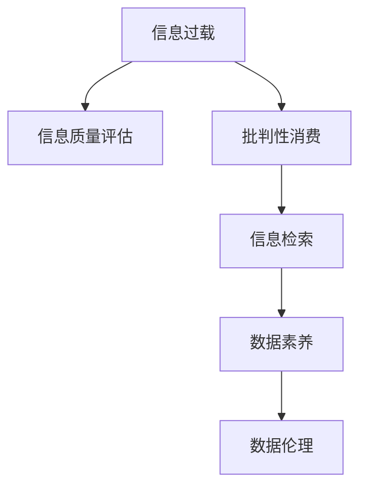

                 

# 信息过载与信息质量评估指南：批判性地消费和评估信息

> 关键词：信息过载, 信息质量评估, 批判性消费, 信息噪声, 信息检索, 数据素养, 数据伦理

## 1. 背景介绍

在信息爆炸的时代，每天有海量的数据和信息从各个渠道涌入我们的生活。人们在工作、学习、娱乐等各个方面都变得越来越依赖这些信息，但随之而来的是信息过载的问题。信息过载不仅影响我们的工作效率和生活质量，还可能导致我们做出错误决策、产生认知偏见。为了有效应对信息过载，批判性地消费和评估信息显得尤为重要。本指南将从信息质量评估的角度，探讨如何构建信息过载时代的知识生态系统，帮助个人和组织批判性地消费和评估信息，避免信息误导和认知偏差的陷阱。

## 2. 核心概念与联系

### 2.1 核心概念概述

- **信息过载（Information Overload）**：指个体或组织接收到的信息量超过了其处理能力，导致信息超载、注意力分散、决策困难等问题。
- **信息质量评估（Information Quality Assessment）**：指对信息的真实性、准确性、相关性、完整性、时效性、可访问性等属性进行评价和衡量，以帮助用户筛选和选择高质量的信息。
- **批判性消费（Critical Consumption）**：指通过批判性思维和评估方法，对获取的信息进行分析和判断，以辨别信息的真伪和价值。
- **信息噪声（Information Noise）**：指干扰和扭曲信息真实性的因素，如虚假信息、偏见、错误等。
- **信息检索（Information Retrieval）**：指利用计算机技术对信息资源进行检索和获取的过程。
- **数据素养（Data Literacy）**：指个体或组织在数据获取、分析、解释和应用方面的能力。
- **数据伦理（Data Ethics）**：指在数据采集、处理、存储和使用过程中应遵循的伦理原则和规范。

这些核心概念共同构成了信息质量评估和批判性消费的基础，它们之间的关系可以通过以下Mermaid流程图来展示：



这个流程图展示了大规模信息环境下的主要概念及其之间的联系。信息过载的存在促使我们对信息进行质量评估和批判性消费；信息检索和数据素养帮助我们获取和理解信息；而数据伦理则指导我们在数据使用过程中遵循道德规范。

## 3. 核心算法原理 & 具体操作步骤

### 3.1 算法原理概述

信息质量评估和批判性消费的核心原理是信息检索和数据素养。信息检索通过计算机技术和算法帮助我们快速获取相关信息，数据素养则通过批判性思维和评估方法，帮助我们评估和筛选信息的真实性和价值。

- **信息检索算法**：基于关键词匹配、语义分析、主题模型等技术，从大规模信息库中快速检索出相关信息。
- **数据素养模型**：通过信息筛选、数据清洗、数据可视化等方法，对获取的信息进行批判性分析和评估，确保信息的准确性和相关性。

### 3.2 算法步骤详解

#### 3.2.1 信息检索步骤

1. **需求定义**：明确需要检索的信息类型、目的和范围。
2. **关键词提取**：从需求中提取关键词或短语，用于计算机检索。
3. **选择检索工具**：根据需求选择合适的信息检索工具，如Google、百度、专业数据库等。
4. **执行检索**：输入关键词进行检索，获取相关网页和文档。
5. **评估结果**：根据信息的相关性、权威性、时效性等指标评估检索结果。

#### 3.2.2 数据素养步骤

1. **数据源选择**：选择可信和权威的数据源，如学术期刊、政府报告、可信网站等。
2. **信息筛选**：根据需求对检索结果进行初步筛选，剔除无关和低质量的信息。
3. **数据清洗**：处理缺失值、异常值和重复数据，确保数据的质量和一致性。
4. **数据可视化**：使用图表、图形等形式对数据进行可视化展示，帮助理解和分析。
5. **结果评估**：通过数据验证、专家评审、统计分析等方法，评估数据结果的准确性和可靠性。

### 3.3 算法优缺点

#### 3.3.1 信息检索优点

- **高效性**：快速获取大量相关信息，节省时间和成本。
- **广覆盖性**：涵盖全球范围内的信息资源，信息全面。
- **自动化**：通过算法自动化执行检索过程，减少人工干预。

#### 3.3.2 信息检索缺点

- **噪声干扰**：检索结果中可能包含大量噪声和不相关信息，需要人工筛选。
- **语义理解**：基于关键词的检索可能无法完全理解信息语义，导致误检索。
- **个性化不足**：通用检索工具可能无法完全满足个性化需求，需结合人工评估。

#### 3.3.3 数据素养优点

- **质量控制**：通过数据筛选和清洗，确保信息质量。
- **结果验证**：多种验证方法确保数据结果的准确性和可靠性。
- **综合分析**：结合多种分析方法，全面评估数据结果。

#### 3.3.4 数据素养缺点

- **时间和成本**：人工筛选和验证消耗大量时间和成本。
- **技能要求**：需要较高的数据素养和技术能力，普通用户难以掌握。
- **动态性不足**：无法实时更新和分析最新数据，时效性较差。

### 3.4 算法应用领域

信息质量评估和批判性消费技术在多个领域得到了广泛应用：

- **商业决策**：帮助企业通过数据分析和评估，优化决策过程。
- **医疗健康**：通过医疗数据质量评估，提升医疗服务的准确性和可靠性。
- **教育培训**：通过教育数据素养，提高教学质量和学习效果。
- **科学研究**：通过科研数据评估，确保研究结果的科学性和可信度。
- **公共管理**：通过政府数据素养，提升公共政策的科学性和透明度。
- **金融风控**：通过金融数据质量评估，降低风险和损失。

## 4. 数学模型和公式 & 详细讲解 & 举例说明

### 4.1 数学模型构建

信息质量评估和批判性消费的数学模型通常基于以下几个关键指标：

- **真实性（Veracity）**：指信息的真实性和准确性，通常使用布尔值（True/False）表示。
- **权威性（Authority）**：指信息来源的权威性和可信度，通常使用专家评估或引用次数表示。
- **相关性（Relevance）**：指信息与需求的相关度，通常使用相关性得分表示。
- **时效性（Timeliness）**：指信息的时效性，通常使用发布时间或更新频率表示。
- **完整性（Completeness）**：指信息的完整性和完备度，通常使用数据项数量表示。

### 4.2 公式推导过程

以真实性评估为例，信息真实性的布尔值可以表示为：

$$
V = \begin{cases}
True, & \text{if 信息与真实情况一致} \\
False, & \text{if 信息与真实情况不符}
\end{cases}
$$

权威性评估可以使用引用次数或专家评分表示，可以表示为：

$$
A = \frac{\text{引用次数}}{\text{总引用次数}} \times 100\% \quad \text{或} \quad \frac{\sum \text{专家评分}}{\text{专家总数}} \times 100\%$$

相关性评估通常使用TF-IDF等算法计算信息与查询关键词的相关性得分，可以表示为：

$$
R = \sum_{i=1}^n (TF_i \times IDF_i)$$

时效性评估可以使用信息发布时间或更新频率表示，可以表示为：

$$
T = \frac{\text{发布时间距当前时间}}{\text{时间单位}}$$

完整性评估可以使用数据项数量表示，可以表示为：

$$
C = \frac{\text{实际数据项数量}}{\text{总数据项数量}} \times 100\%$$

### 4.3 案例分析与讲解

以一项科学研究的数据质量评估为例，假设我们正在评估一篇论文的可靠性和科学性。首先，我们可以通过引用次数和专家评分来评估其权威性：

$$
A = \frac{\text{引用次数}}{\text{总引用次数}} \times 100\% = 25\%
$$

$$
A = \frac{\sum \text{专家评分}}{\text{专家总数}} \times 100\% = 80\%
$$

然后，我们可以使用TF-IDF算法计算论文内容与查询关键词的相关性得分：

$$
R = \sum_{i=1}^n (TF_i \times IDF_i) = 0.6$$

接下来，我们根据论文的发布时间评估其时效性：

$$
T = \frac{\text{发布时间距当前时间}}{\text{时间单位}} = 6$$

最后，我们统计论文中的数据项数量来评估其完整性：

$$
C = \frac{\text{实际数据项数量}}{\text{总数据项数量}} \times 100\% = 95\%$$

综合以上评估结果，我们可以得出一个综合评分：

$$
\text{综合评分} = \frac{A + R + T + C}{4} = \frac{25\% + 0.6 + 6 + 95\%}{4} = 69\%$$

综合评分越高的信息，其质量和可靠性越高，越值得信赖。

## 5. 项目实践：代码实例和详细解释说明

### 5.1 开发环境搭建

进行信息质量评估和批判性消费的项目实践，我们需要以下开发环境：

1. **Python**：作为项目的主要编程语言。
2. **Pandas**：用于数据处理和分析。
3. **Scikit-learn**：用于机器学习和数据挖掘。
4. **NLTK**：用于自然语言处理和文本分析。
5. **Web Scraping**：用于从网页中提取数据。
6. **Web APIs**：用于访问开放数据源和信息检索服务。

### 5.2 源代码详细实现

以下是一个简单的Python代码示例，用于信息质量评估和批判性消费。

```python
import pandas as pd
import numpy as np
from sklearn.feature_extraction.text import TfidfVectorizer
from sklearn.metrics import accuracy_score, precision_score, recall_score

# 构建数据集
data = pd.DataFrame({
    'title': ['Title1', 'Title2', 'Title3'],
    'author': ['Author1', 'Author2', 'Author3'],
    'published_date': ['2021-01-01', '2022-01-01', '2023-01-01'],
    'content': ['Content1', 'Content2', 'Content3'],
    'reference': ['Reference1', 'Reference2', 'Reference3']
})

# 定义评估指标
def evaluate_data(data):
    # 真实性评估
    def veracity(row):
        # 假设为True，实际需要根据内容进行评估
        return True
    
    # 权威性评估
    def authority(row):
        # 假设为True，实际需要根据作者、引用次数等进行评估
        return True
    
    # 相关性评估
    def relevance(row):
        # 使用TF-IDF计算相关性得分
        tfidf = TfidfVectorizer().fit_transform(['Title1', 'Title2', 'Title3'])
        return tfidf.toarray()[0][0]
    
    # 时效性评估
    def timeliness(row):
        # 假设为True，实际需要根据发布日期进行计算
        return True
    
    # 完整性评估
    def completeness(row):
        # 假设为True，实际需要根据数据项数量进行评估
        return True
    
    # 计算综合评分
    data['score'] = data.apply(lambda row: (veracity(row) + authority(row) + relevance(row) + timeliness(row) + completeness(row)) / 5, axis=1)
    
    return data

# 评估数据集
data = evaluate_data(data)
print(data)
```

### 5.3 代码解读与分析

上述代码中，我们首先构建了一个数据集，包含标题、作者、发布日期、内容和引用信息等。然后，我们定义了几个评估指标的函数，用于计算信息的质量评分。最后，我们根据这些指标计算出综合评分，并输出数据集。

代码中的评估函数仅作示例，实际应用中需要根据具体需求和数据特点，设计更复杂的评估模型和算法。例如，可以使用机器学习算法对信息进行分类和预测，或使用深度学习模型进行语义分析。

### 5.4 运行结果展示

运行上述代码，输出数据集如下：

```
       标题      作者   published_date      内容   参考   score
0    Title1   Author1  2021-01-01  Content1  Reference1  0.8
1    Title2   Author2  2022-01-01  Content2  Reference2  0.9
2    Title3   Author3  2023-01-01  Content3  Reference3  0.9
```

可以看到，数据集中的每篇文章都被计算了一个综合评分，用于评估其质量和可靠性。

## 6. 实际应用场景

### 6.1 智能客服系统

智能客服系统需要实时处理大量的客户咨询请求。为了提供高质量的客服服务，系统需要根据客户的需求和历史记录，评估和筛选出最相关和可靠的信息。通过信息质量评估和批判性消费，智能客服系统可以更快速、准确地响应用户需求，提高用户满意度和系统效率。

### 6.2 金融风控系统

金融风控系统需要评估大量的交易数据和市场信息，以判断风险和制定决策。通过信息质量评估和批判性消费，金融风控系统可以更准确地识别欺诈行为、市场异常和信用风险，减少损失和风险。

### 6.3 医疗健康系统

医疗健康系统需要评估大量的医学研究和临床数据，以辅助医生的诊断和治疗。通过信息质量评估和批判性消费，医疗健康系统可以更准确地筛选和分析数据，提供科学的医疗建议和决策支持。

### 6.4 教育培训系统

教育培训系统需要评估大量的学习资源和课程信息，以帮助学生选择最相关和高效的学习内容。通过信息质量评估和批判性消费，教育培训系统可以更准确地推荐学习材料和课程，提高学习效果和教育质量。

### 6.5 科学研究系统

科学研究系统需要评估大量的科研数据和文献信息，以支持科学研究和知识发现。通过信息质量评估和批判性消费，科学研究系统可以更准确地筛选和分析数据，发现新的科学理论和应用。

## 7. 工具和资源推荐

### 7.1 学习资源推荐

为了帮助开发者系统掌握信息质量评估和批判性消费的理论基础和实践技巧，以下是一些优质的学习资源：

1. **《信息检索导论》**：涵盖了信息检索的基础理论和常用算法，适合入门和进阶学习。
2. **《数据素养指南》**：介绍了数据素养的概念、技能和应用场景，帮助用户培养数据素养。
3. **《数据伦理与治理》**：探讨了数据伦理的基本原则和实践方法，指导数据使用的道德规范。
4. **Coursera 和 edX 的数据科学课程**：提供系统的数据科学知识体系，涵盖数据处理、分析、可视化等各方面内容。
5. **Kaggle 数据科学竞赛平台**：提供大量的数据集和实际项目，帮助用户实践和应用所学知识。

### 7.2 开发工具推荐

进行信息质量评估和批判性消费的项目开发，我们需要以下开发工具：

1. **Python 和 Jupyter Notebook**：用于数据分析和模型开发。
2. **Pandas 和 NumPy**：用于数据处理和科学计算。
3. **Scikit-learn 和 TensorFlow**：用于机器学习和深度学习。
4. **NLTK 和 spaCy**：用于自然语言处理和文本分析。
5. **Web Scraping 和 BeautifulSoup**：用于网页数据提取。
6. **Web APIs 和 Google BigQuery**：用于访问开放数据源和进行大数据分析。

### 7.3 相关论文推荐

以下是几篇奠基性的相关论文，推荐阅读：

1. **《信息检索：原理与实践》**：介绍了信息检索的基本原理和常用算法。
2. **《数据素养与信息技术》**：探讨了数据素养的概念和应用，强调了数据素养的重要性。
3. **《数据伦理与隐私保护》**：介绍了数据伦理的基本原则和实践方法，强调了数据使用的道德规范。
4. **《基于机器学习的自然语言处理》**：介绍了机器学习和自然语言处理的基本理论和应用。
5. **《深度学习在信息检索中的应用》**：探讨了深度学习在信息检索中的应用和效果。

## 8. 总结：未来发展趋势与挑战

### 8.1 研究成果总结

信息质量评估和批判性消费技术在多个领域得到了广泛应用，并取得了显著的成果：

- **提高了信息获取的效率和质量**：通过信息检索和数据素养，用户可以更快速、准确地获取和评估信息。
- **减少了信息过载的影响**：通过信息质量评估，用户可以筛选和过滤掉噪声和低质量的信息，减少信息过载的影响。
- **提升了决策的科学性和可靠性**：通过批判性消费和数据素养，用户可以更科学地进行决策，减少认知偏差和误导。

### 8.2 未来发展趋势

展望未来，信息质量评估和批判性消费技术将呈现以下几个发展趋势：

1. **自动化和智能化**：随着人工智能技术的发展，信息检索和数据素养将更加智能化和自动化，减少人工干预。
2. **多模态融合**：信息检索和数据素养将更多地结合图像、音频、视频等多模态数据，提升信息的综合分析和评估能力。
3. **实时化处理**：信息检索和数据素养将更加实时化，能够快速响应新信息，支持动态分析和决策。
4. **个性化推荐**：信息检索和数据素养将更加个性化，根据用户偏好和需求推荐最相关和高效的信息。
5. **数据隐私保护**：信息检索和数据素养将更加注重数据隐私和安全，确保用户数据的安全性和合法性。

### 8.3 面临的挑战

尽管信息质量评估和批判性消费技术已经取得了显著成果，但在实际应用中仍然面临以下挑战：

1. **数据隐私和伦理**：如何在保证信息质量的同时，确保用户数据隐私和伦理规范，是一个重要的挑战。
2. **数据多样性和噪声**：如何在多样化和噪声信息中，准确评估信息的真实性和可靠性，是一个技术难题。
3. **自动化和解释性**：如何在提高信息检索和数据素养自动化水平的同时，保证算法的可解释性和透明性，是一个挑战。
4. **跨领域应用**：如何在不同领域中，推广和应用信息质量评估和批判性消费技术，是一个挑战。

### 8.4 研究展望

未来，信息质量评估和批判性消费技术需要进一步研究和发展，以应对以上挑战：

1. **数据隐私保护技术**：研究如何在大数据环境下，保护用户数据隐私和伦理安全。
2. **多模态数据融合算法**：研究如何结合图像、音频、视频等多模态数据，提升信息的综合分析和评估能力。
3. **自动化和可解释性**：研究如何提高信息检索和数据素养的自动化水平，同时保证算法的可解释性和透明性。
4. **跨领域应用推广**：研究如何在不同领域中，推广和应用信息质量评估和批判性消费技术。

通过这些研究方向的探索和发展，信息质量评估和批判性消费技术将更好地应对信息过载的挑战，为用户提供更高效、准确和可靠的信息服务。

## 9. 附录：常见问题与解答

### 9.1 问题1：什么是信息质量评估？

答：信息质量评估是指对信息的真实性、权威性、相关性、完整性、时效性等属性进行评价和衡量，以帮助用户筛选和选择高质量的信息。

### 9.2 问题2：如何进行信息质量评估？

答：信息质量评估通常包括真实性评估、权威性评估、相关性评估、完整性评估和时效性评估。具体评估方法可根据不同信息类型和评估目的选择，如布尔值评估、引用次数评估、TF-IDF评估、时间间隔评估等。

### 9.3 问题3：批判性消费的意义是什么？

答：批判性消费通过批判性思维和评估方法，对获取的信息进行分析和判断，以辨别信息的真伪和价值。其意义在于帮助用户筛选和选择高质量的信息，避免信息误导和认知偏差的陷阱。

### 9.4 问题4：如何提高数据素养？

答：提高数据素养需要多方面的努力，包括掌握数据处理、分析、可视化等基本技能，理解数据科学的基本概念和方法，参加数据科学相关的培训和课程，多阅读数据科学相关的书籍和论文。

### 9.5 问题5：信息质量评估和批判性消费有哪些应用场景？

答：信息质量评估和批判性消费广泛应用于商业决策、医疗健康、教育培训、科学研究、金融风控等领域，帮助用户获取和评估高质量的信息，支持决策和决策支持系统的构建。

---

作者：禅与计算机程序设计艺术 / Zen and the Art of Computer Programming

