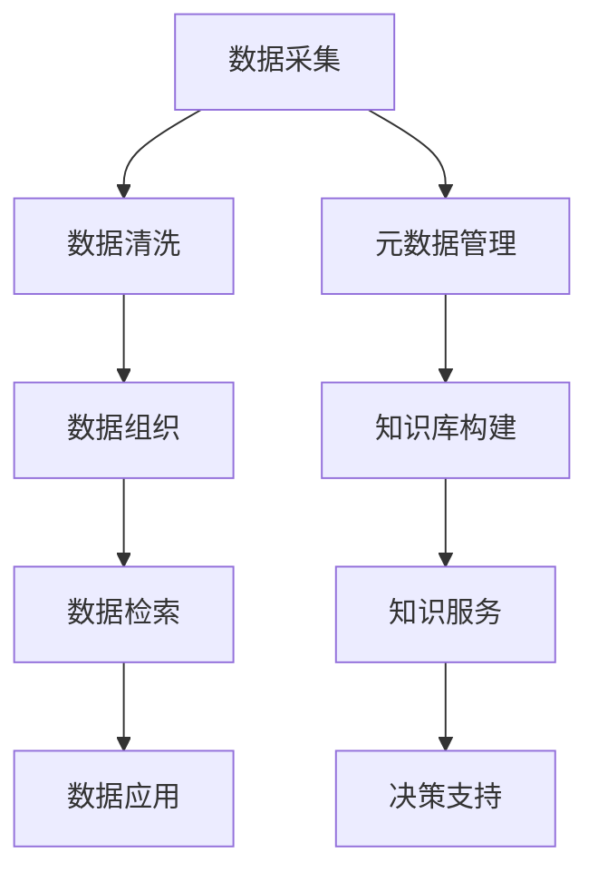

                 

# 信息过载与知识管理系统实施指南：有效组织和检索信息

> 关键词：信息过载, 知识管理, 信息检索, 信息组织, 知识管理系统

## 1. 背景介绍

在现代信息爆炸的时代，知识的无处不在使得我们面临前所未有的信息过载（Information Overload）问题。信息的庞杂和多样性带来了存储和检索的挑战，这不仅增加了企业运营成本，也限制了决策和创新的速度。因此，如何有效地组织和检索信息，构建高效的知识管理系统（Knowledge Management System, KMS），成为提升企业竞争力的关键所在。

### 1.1 问题由来
信息过载主要源于以下几个方面：

- **数据量激增**：互联网、大数据和物联网技术的普及，产生了海量数据。
- **数据类型多样**：文本、图片、视频、音频等不同类型的数据并存，增加了处理难度。
- **数据速度加快**：实时数据和流数据的采集，要求系统具备高效率的处理能力。
- **数据质量参差不齐**：数据来源广泛，数据质量和一致性难以保障。

这些问题在企业的日常运营中尤为明显，特别是对于数据驱动型和知识密集型企业，信息的有效管理和利用直接关系到企业的核心竞争力和发展战略。

### 1.2 问题核心关键点
针对信息过载问题，企业需要构建一个集成化、高效化的知识管理系统。核心关键点包括：

- **数据采集**：将企业内外的信息源整合，统一存储。
- **数据清洗**：对数据进行去重、纠错和标注，保证数据质量。
- **数据组织**：采用合理的分类、标签和元数据，实现信息的逻辑结构化。
- **数据检索**：建立高效的检索机制，满足实时查询需求。
- **数据应用**：通过分析、挖掘和可视化，实现信息价值的最大化。

构建高效的KMS系统，不仅能解决信息过载问题，还能提升企业的知识资产利用效率和决策能力。

## 2. 核心概念与联系

### 2.1 核心概念概述

在构建KMS系统时，需要明确以下几个核心概念：

- **知识管理**：通过计划、控制和利用知识，为企业创造价值的过程。
- **信息检索**：利用计算机系统对信息进行查找和获取的技术。
- **信息组织**：根据一定的规则，对信息进行分类、排序和索引的过程。
- **知识管理系统**：将企业内外的知识进行收集、存储、管理和应用，以提升组织绩效的IT系统。
- **元数据**：描述数据的数据，包括数据的来源、格式、结构和应用领域等。

这些核心概念之间相互联系，共同构成了KMS系统的基础。

### 2.2 核心概念原理和架构的 Mermaid 流程图



此流程图展示了KMS系统从数据采集到知识应用的主要流程，强调了数据清洗、信息组织、信息检索和元数据管理的重要性。

## 3. 核心算法原理 & 具体操作步骤

### 3.1 算法原理概述

KMS系统核心算法原理主要围绕数据采集、清洗、组织、检索和应用展开。

#### 数据采集
主要通过API接口、爬虫、数据同步工具等方式，将企业内外部的数据源整合至KMS系统。

#### 数据清洗
通过数据去重、异常值检测、数据纠正和标注等手段，提高数据质量，保证数据的准确性和一致性。

#### 数据组织
采用分类、标签、索引等手段，对数据进行结构化处理，使其具备逻辑性和可检索性。

#### 数据检索
建立高效的检索引擎，实现对数据的高效查找和获取，支持多种查询方式和高级搜索功能。

#### 数据应用
通过数据分析、挖掘和可视化技术，实现数据的深入利用和知识价值的最大化，辅助决策支持。

### 3.2 算法步骤详解

以下详细介绍每个关键步骤的详细步骤：

#### 数据采集

1. **API接口**：利用企业内部和外部的API接口，自动采集数据。
2. **爬虫工具**：通过爬虫程序抓取网页、数据库等数据源。
3. **数据同步**：通过ETL（Extract, Transform, Load）工具，将数据源同步到KMS系统。

#### 数据清洗

1. **数据去重**：通过唯一标识符匹配，去除重复数据。
2. **异常值检测**：利用统计方法或机器学习算法，检测数据中的异常点。
3. **数据纠正**：利用规则或模型，对数据进行纠错和标准化处理。
4. **数据标注**：通过人工或半自动化方式，为数据打上标签，方便后续组织和检索。

#### 数据组织

1. **分类**：按照业务逻辑或应用场景，将数据分成多个类别。
2. **标签**：为每个数据打上标签，用于索引和检索。
3. **索引**：根据数据属性和标签，建立索引表，提高查询效率。
4. **元数据**：为数据创建元数据，描述数据属性、来源、格式等信息。

#### 数据检索

1. **索引构建**：利用索引表，建立快速的数据查找机制。
2. **搜索引擎**：采用倒排索引、全文索引等技术，实现高效的数据检索。
3. **查询优化**：优化查询算法，支持模糊查询、全文搜索等高级功能。

#### 数据应用

1. **数据分析**：利用统计分析和机器学习技术，挖掘数据中的有价值信息。
2. **数据可视化**：通过图表和仪表盘，展示数据和分析结果，辅助决策。
3. **知识服务**：将数据和分析结果封装为服务，支持用户按需获取。

### 3.3 算法优缺点

#### 优点

1. **集成化管理**：通过KMS系统，集中管理和应用企业内外部的知识资源。
2. **提高效率**：自动化处理大量数据，减少人工干预，提高工作效率。
3. **质量保证**：通过清洗和标注，确保数据质量和一致性。
4. **高效检索**：建立高效的检索机制，快速获取所需信息。
5. **知识应用**：通过分析和可视化，提升决策和创新能力。

#### 缺点

1. **成本高**：初始搭建和维护KMS系统需要较高成本。
2. **复杂度高**：系统设计和实现较为复杂，需要专业知识和技能。
3. **技术门槛**：数据清洗、分类和检索等环节要求较高的技术水平。
4. **更新困难**：企业内部数据和知识的变化，要求系统具备较强的更新和扩展能力。

### 3.4 算法应用领域

KMS系统在多个领域都有广泛的应用：

- **企业运营**：支持企业内部的知识管理、流程优化和业务创新。
- **客户服务**：提供客户互动平台和知识库，提升客户体验。
- **产品研发**：支持产品设计、原型开发和测试，加速产品上市。
- **市场分析**：提供市场趋势分析和预测，辅助市场决策。
- **人力资源**：支持员工培训、绩效评估和招聘管理。

## 4. 数学模型和公式 & 详细讲解 & 举例说明

### 4.1 数学模型构建

在KMS系统中，数学模型的构建主要涉及数据清洗、数据组织和检索三个方面。

#### 数据清洗模型

数据清洗模型主要通过以下公式计算：

$$
\text{Cleaned Data} = \text{Original Data} - \text{Duplicate Records} - \text{Anomalies} + \text{Corrections}
$$

其中，`Original Data`表示原始数据，`Duplicate Records`表示重复记录，`Anomalies`表示异常值，`Corrections`表示数据纠正后的结果。

#### 数据组织模型

数据组织模型主要通过分类、标签和索引来组织数据。假设我们有一组数据集`D`，通过分类算法将其分为`K`个类别，每个类别中包含`N`个样本。每个样本可以通过标签`T`进行标记，每个类别可以通过索引`I`进行快速查找。

$$
D = \{(d_1, t_1, i_1), (d_2, t_2, i_2), ..., (d_K, t_K, i_K)\}
$$

其中，`d`表示数据样本，`t`表示标签，`i`表示索引。

#### 数据检索模型

数据检索模型主要通过索引表`I`和查询条件`Q`进行匹配。假设查询条件为`Q = (q_1, q_2, ..., q_N)`，其中`q`表示查询关键词。

$$
\text{Relevant Results} = \text{Index}(Q) \cap \text{Data}
$$

其中，`Index(Q)`表示根据查询条件`Q`从索引表`I`中检索到的结果，`Data`表示数据集`D`。

### 4.2 公式推导过程

在数据清洗模型中，我们利用唯一标识符`ID`来去除重复记录，计算公式如下：

$$
\text{Cleaned Data} = \text{Original Data} - \{(d | ID(d) = ID(d_i) \text{ for some } i) \text{ for all } d \in \text{Original Data}\}
$$

对于异常值的检测，我们通常采用Z-score或IQR（四分位距）方法，计算公式如下：

$$
Z = \frac{X - \mu}{\sigma}
$$

其中，`X`表示数据点，`μ`表示均值，`σ`表示标准差。如果`Z`的绝对值大于某个阈值（如3），则认为该数据点是异常值。

在数据组织模型中，分类算法可以使用决策树、K-means等，标签可以通过人工标注或半自动化工具生成，索引可以通过哈希表、B树等数据结构实现。

在数据检索模型中，倒排索引（Inverted Index）是一种常见的索引技术，其计算公式如下：

$$
I(w) = \{d | w \in d\} \text{ for all } d \in D
$$

其中，`w`表示关键词，`I(w)`表示包含关键词`w`的数据集。查询时，系统可以通过`I(w)`快速检索出包含关键词`w`的数据。

### 4.3 案例分析与讲解

#### 案例一：企业客户服务系统

某企业利用KMS系统构建了客户服务系统，通过数据采集和清洗，整合了客服记录、用户反馈和市场数据。通过数据组织，系统建立了客户分群、服务问题分类和解决方案标签体系。利用数据检索，系统实现了快速的问题查找和解决方案推荐。最终，该系统大幅提高了客户满意度和问题解决效率。

#### 案例二：产品研发流程

某科技公司利用KMS系统辅助产品研发流程，通过数据采集和清洗，整合了市场调研数据、用户反馈和研发日志。通过数据组织，系统建立了市场趋势、用户需求和技术挑战分类体系。利用数据检索，系统实现了快速的信息查找和知识共享，支持团队协作和敏捷开发。

## 5. 项目实践：代码实例和详细解释说明

### 5.1 开发环境搭建

搭建KMS系统需要以下开发环境：

1. **服务器**：选择高性能的服务器，确保系统的稳定性和扩展性。
2. **数据库**：选择适合的数据库系统，如MySQL、PostgreSQL等，存储和管理数据。
3. **开发工具**：选择适合的开发工具，如Eclipse、PyCharm等，进行系统开发。
4. **中间件**：选择适合的中间件，如Apache Kafka、RabbitMQ等，支持数据同步和消息队列。
5. **搜索引擎**：选择适合的搜索引擎，如Elasticsearch、Solr等，支持高效的数据检索。

### 5.2 源代码详细实现

以下是一个简单的KMS系统源代码实现示例：

```python
from elasticsearch import Elasticsearch
from pandas import DataFrame
from sklearn.cluster import KMeans
from sklearn.preprocessing import LabelEncoder

# 连接Elasticsearch
es = Elasticsearch([{'host': 'localhost', 'port': 9200}])

# 数据采集
def collect_data():
    # 采集原始数据
    original_data = collect_original_data()

    # 去重和纠正
    cleaned_data = remove_duplicates(original_data)
    cleaned_data = correct_data(cleaned_data)

    return cleaned_data

# 数据清洗
def remove_duplicates(data):
    unique_data = []
    seen_ids = set()
    for row in data:
        if row['id'] not in seen_ids:
            seen_ids.add(row['id'])
            unique_data.append(row)
    return unique_data

def correct_data(data):
    # 数据纠正规则
    correction_dict = {
        'error1': 'correct1',
        'error2': 'correct2',
        # 更多规则...
    }

    for row in data:
        if row['value'] in correction_dict:
            row['value'] = correction_dict[row['value']]
    return data

# 数据组织
def organize_data(data):
    # 分类
    X = data[['value', 'label']]
    kmeans = KMeans(n_clusters=3)
    kmeans.fit(X)
    data['category'] = kmeans.predict(X)

    # 标签
    encoder = LabelEncoder()
    data['tag'] = encoder.fit_transform(data['label'])

    # 索引
    data['index'] = encoder.fit_transform(data['tag'])

    return data

# 数据检索
def search_data(query):
    results = es.search(index='data', body={
        'query': {
            'match': {
                'field': query
            }
        }
    })
    return results['hits']['hits']

# 数据应用
def analyze_data(data):
    # 数据分析
    analysis_result = perform_analysis(data)

    # 数据可视化
    visualize_analysis_result(analysis_result)

    # 知识服务
    knowledge_service(data)

# 数据分析
def perform_analysis(data):
    # 统计分析
    summary = data.groupby(['category']).agg({'value': 'mean', 'tag': 'count'})
    return summary

# 数据可视化
def visualize_analysis_result(result):
    # 生成图表
    chart = generate_chart(result)
    return chart

# 知识服务
def knowledge_service(data):
    # 服务封装
    service = Service(data)
    return service

# 服务封装
class Service:
    def __init__(self, data):
        self.data = data

    def get_recommendation(self, query):
        # 根据查询条件，返回推荐结果
        results = self.data[self.data['tag'] == query]
        return results
```

### 5.3 代码解读与分析

在上述代码中，我们主要使用了Elasticsearch进行数据存储和检索，Pandas进行数据处理，Scikit-learn进行分类和标签生成。

- **数据采集**：通过`collect_data`函数采集原始数据，并进行去重和纠正。
- **数据清洗**：利用`remove_duplicates`和`correct_data`函数去除重复记录和数据纠正。
- **数据组织**：通过`organize_data`函数进行分类、标签和索引生成。
- **数据检索**：利用`search_data`函数根据查询条件进行搜索。
- **数据应用**：通过`analyze_data`函数进行数据分析和可视化，并通过`knowledge_service`函数封装为知识服务。

## 6. 实际应用场景

### 6.1 企业运营

在企业运营中，KMS系统可以用于知识库构建、文档管理和文档搜索，提升内部沟通和协作效率。

#### 场景示例

某大型企业通过KMS系统构建了知识库，整合了内部文档、客户信息和市场数据。通过分类和标签，系统实现了高效的文档搜索和信息共享，帮助员工快速获取所需知识，提升工作效率。

### 6.2 客户服务

在客户服务中，KMS系统可以用于客户互动平台和知识库，提升客户体验和问题解决效率。

#### 场景示例

某电商企业利用KMS系统建立了客户互动平台和知识库，整合了客服记录、产品信息和用户反馈。通过分类和标签，系统实现了快速的问题查找和解决方案推荐，显著提高了客户满意度。

### 6.3 产品研发

在产品研发中，KMS系统可以用于市场调研、用户需求分析和技术挑战管理，支持团队协作和敏捷开发。

#### 场景示例

某科技公司利用KMS系统辅助产品研发流程，整合了市场调研数据、用户反馈和研发日志。通过分类和标签，系统实现了快速的信息查找和知识共享，支持团队协作和敏捷开发，加速了产品上市。

## 7. 工具和资源推荐

### 7.1 学习资源推荐

1. **《信息检索与数据管理》课程**：由麻省理工学院开设，全面介绍了信息检索和数据管理的理论和技术。
2. **《知识管理与组织》书籍**：详细阐述了知识管理和组织的基本概念和实践方法。
3. **《Elasticsearch官方文档》**：Elasticsearch的官方文档，提供了丰富的API和样例代码，帮助开发者快速上手。
4. **《机器学习与数据挖掘》书籍**：介绍机器学习在数据清洗和分类中的应用，提升数据处理能力。
5. **《自然语言处理》课程**：由斯坦福大学开设，介绍了自然语言处理的基本概念和应用方法。

### 7.2 开发工具推荐

1. **Elasticsearch**：高效的搜索引擎，支持分布式集群和复杂的查询操作。
2. **Apache Kafka**：消息队列系统，支持高吞吐量的数据采集和同步。
3. **Apache Spark**：大数据处理框架，支持分布式数据处理和分析。
4. **D3.js**：数据可视化库，支持生成各种图表和仪表盘。
5. **Jupyter Notebook**：交互式编程环境，支持代码实现和结果展示。

### 7.3 相关论文推荐

1. **《信息检索理论与方法》论文**：全面介绍了信息检索的原理和技术，提供了丰富的实验和案例。
2. **《知识管理技术综述》论文**：总结了知识管理技术的现状和未来发展方向。
3. **《Elasticsearch高级应用》论文**：介绍了Elasticsearch的高级应用，包括索引构建和查询优化。
4. **《数据清洗与预处理》论文**：详细阐述了数据清洗和预处理的方法和技巧。
5. **《知识服务设计》论文**：讨论了知识服务的设计和实现，提供了实际应用的案例和方法。

## 8. 总结：未来发展趋势与挑战

### 8.1 研究成果总结

本文通过系统介绍KMS系统的构建和应用，展示了信息过载问题解决和知识管理的重要性。通过数据采集、清洗、组织、检索和应用，提出了一个完整的KMS系统构建流程，并通过案例和代码实例进行了详细讲解。

### 8.2 未来发展趋势

1. **自动化和智能化**：未来KMS系统将进一步自动化和智能化，利用机器学习和大数据分析技术，实现知识自动生成和智能化推荐。
2. **跨领域融合**：KMS系统将与其他AI技术如自然语言处理、计算机视觉等进行深度融合，提升系统的综合能力和应用场景。
3. **实时性**：基于流数据处理技术，KMS系统将实现实时数据采集、分析和应用，支持企业快速决策。
4. **交互性**：利用自然语言理解和生成技术，KMS系统将实现智能交互和对话，提升用户体验。

### 8.3 面临的挑战

1. **数据隐私和安全**：KMS系统需要处理大量敏感数据，如何保障数据隐私和安全是一个重要挑战。
2. **数据质量和一致性**：来自不同来源的数据可能存在质量不一致问题，如何保证数据的完整性和一致性是一个难题。
3. **系统复杂性**：KMS系统的设计和实现较为复杂，如何提升系统的可维护性和扩展性是一个挑战。
4. **用户接受度**：KMS系统的复杂性和技术门槛可能影响用户接受度，如何提升用户体验和系统易用性是一个挑战。

### 8.4 研究展望

1. **知识自动生成**：利用生成对抗网络和强化学习，实现知识自动生成和知识库的持续更新。
2. **多模态融合**：利用计算机视觉和自然语言处理技术，实现文本、图片和视频等多种类型数据的融合和分析。
3. **实时流处理**：基于流数据处理技术，实现实时数据采集和分析，支持实时决策和智能交互。
4. **用户界面优化**：提升KMS系统的易用性和用户交互体验，让用户更轻松地获取和应用知识。

未来，KMS系统将在企业运营、客户服务、产品研发等多个领域发挥重要作用，成为企业数字化转型的重要工具。通过持续优化和创新，KMS系统将不断提升数据处理和知识管理能力，助力企业构建更加智能和高效的知识生态系统。

---

作者：禅与计算机程序设计艺术 / Zen and the Art of Computer Programming

