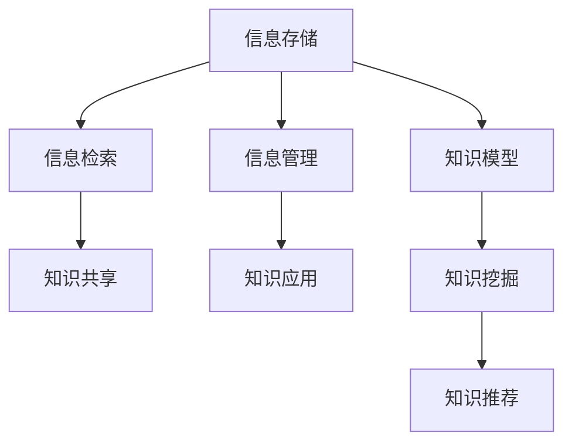

                 

## 1. 背景介绍

### 1.1 问题由来

在当今的信息时代，信息的生成和传播速度前所未有。每天，全球数以亿计的数据产生，涉及社交媒体、新闻报道、科学研究、商业交易、技术文档等各个领域。这些信息的爆炸式增长带来了信息过载的问题，即信息量的急剧增加超出了人们的处理能力，造成了选择困难和效率下降。

信息过载不仅影响个人的工作效率和生活质量，也对企业和组织的知识管理和运营能力提出了挑战。许多企业在处理海量信息时感到力不从心，传统的文档管理系统无法有效组织和检索大量数据，员工往往难以找到所需信息，导致时间浪费和决策失误。

在这样的背景下，知识管理系统的实施成为了一种迫切需求。通过构建一个能够高效组织、检索和共享知识的系统，企业可以降低信息过载的压力，提高员工的工作效率和组织的知识利用率，从而增强竞争力。

### 1.2 问题核心关键点

知识管理系统的核心目标是帮助用户有效地组织、检索、共享和应用知识，从而支持决策和创新。具体来说，关键点包括：

- **信息组织**：将大量的数据和文档进行分类、标签化和结构化，使其易于管理和检索。
- **检索机制**：构建高效的信息检索机制，能够快速响应用户的查询需求，提供准确、相关的结果。
- **知识共享**：促进知识的内部和外部共享，建立知识社区和交流平台，促进知识的交流与创新。
- **智能推荐**：通过算法推荐系统，根据用户的历史行为和偏好，智能推送相关信息和知识。

## 2. 核心概念与联系

### 2.1 核心概念概述

知识管理系统（Knowledge Management System, KMS）是一个集成了信息存储、检索、管理和共享的综合平台。它通过组织和整合企业内部的知识资产，为用户提供高效、便捷的知识服务。

以下是对几个关键概念的简要介绍：

- **信息存储**：指将信息保存在系统中，包括文档、网页、图片、视频等各类数据。
- **信息检索**：指通过搜索引擎、文本匹配等技术，帮助用户快速找到所需的信息。
- **信息管理**：包括分类、标注、版本控制等，确保信息的准确性和一致性。
- **知识共享**：指通过平台提供协作和交流功能，促进知识在企业内部的流通。
- **知识应用**：通过集成业务流程、业务规则，将知识转化为具体的业务行动。

### 2.2 核心概念原理和架构的 Mermaid 流程图



这个流程图展示了知识管理系统的主要流程和模块：

1. **信息存储(A)**：收集和保存各类信息。
2. **信息检索(B)**：快速响应用户的查询请求，提供相关结果。
3. **信息管理(C)**：对信息进行分类、标注和版本控制，确保信息的完整性。
4. **知识共享(D)**：促进知识在企业内部的传播和交流。
5. **知识应用(E)**：将知识转化为实际的业务行动。
6. **知识模型(F)**：构建知识的抽象模型，用于检索、推荐和应用。
7. **知识挖掘(G)**：从原始信息中提取有价值的知识。
8. **知识推荐(H)**：根据用户偏好，推荐相关的知识内容。

## 3. 核心算法原理 & 具体操作步骤

### 3.1 算法原理概述

知识管理系统的核心算法主要包括信息组织、信息检索、信息管理和知识共享等。以下将分别介绍这些核心算法的基本原理。

### 3.2 算法步骤详解

#### 3.2.1 信息组织

信息组织是知识管理的第一步，主要包括分类、标签化和结构化等。其基本步骤包括：

1. **分类**：将信息按主题或领域进行分类，便于管理和检索。
2. **标签化**：为每个文档添加关键词和标签，便于用户快速定位。
3. **结构化**：将信息转化为结构化的数据，如XML、JSON等，便于机器处理和检索。

#### 3.2.2 信息检索

信息检索是知识管理的核心功能，目标是快速响应用户的查询请求，提供准确的相关结果。其基本步骤包括：

1. **索引构建**：对信息进行分词、建立倒排索引等，构建搜索索引。
2. **查询处理**：解析用户的查询语句，转化为查询向量。
3. **相关性计算**：计算查询向量与文档向量的相似度，筛选出相关文档。
4. **排序和显示**：根据相似度排序，展示搜索结果。

#### 3.2.3 信息管理

信息管理确保信息的准确性和一致性，主要包括分类、标注、版本控制等。其基本步骤包括：

1. **分类管理**：提供分类目录树，支持分类创建、修改和删除。
2. **标签管理**：提供标签管理界面，支持标签的创建、修改和删除。
3. **版本控制**：记录文档的历史版本，支持回溯和恢复。

#### 3.2.4 知识共享

知识共享促进知识的内部和外部传播，建立知识社区和交流平台。其基本步骤包括：

1. **知识库建立**：建立知识库，存储和展示各类知识内容。
2. **协作平台**：提供协作工具，支持文档编辑、评论和讨论。
3. **知识社区**：建立知识社区，支持用户分享、交流和合作。

### 3.3 算法优缺点

知识管理系统的算法主要优点包括：

- **高效性**：通过索引和相似度计算，快速响应用户的查询请求。
- **准确性**：通过分类和标签化，提高信息的组织和检索的准确性。
- **灵活性**：支持自定义分类和标签，满足不同用户的个性化需求。

同时，这些算法也存在一些缺点：

- **资源消耗**：索引构建和查询处理需要消耗大量计算资源，特别是在大数据环境下。
- **精度问题**：在处理模糊查询时，相似度计算可能存在误差，导致搜索结果不相关。
- **复杂性**：算法实现复杂，需要考虑分词、索引、排序等多个环节，维护成本高。

### 3.4 算法应用领域

知识管理系统的算法在多个领域得到了广泛应用，包括：

- **企业知识管理**：帮助企业整理和共享内部知识，提升决策和创新能力。
- **科学研究**：构建科研知识库，促进科研人员之间的知识交流和合作。
- **教育培训**：提供教育资源和培训材料，支持教师和学生的学习。
- **政府信息管理**：管理政府公开信息和决策数据，支持政策制定和实施。

## 4. 数学模型和公式 & 详细讲解 & 举例说明

### 4.1 数学模型构建

知识管理系统的数学模型主要涉及信息检索和相似度计算。以下将构建基本的数学模型。

设信息集合为 $I$，文档集合为 $D \subseteq I$，查询向量为 $q$，文档向量为 $d \in D$。信息检索的数学模型可以表示为：

$$
\text{Relevance}(q, d) = \text{Score}(q, d) = \text{Similarity}(q, d)
$$

其中，$\text{Similarity}$ 表示查询向量与文档向量的相似度，可以通过余弦相似度、欧式距离等计算。

### 4.2 公式推导过程

以余弦相似度为例，公式推导如下：

$$
\text{Similarity}(q, d) = \cos(\theta) = \frac{\langle q, d \rangle}{||q|| \times ||d||}
$$

其中，$\langle \cdot, \cdot \rangle$ 表示向量点积，$|| \cdot ||$ 表示向量范数。

### 4.3 案例分析与讲解

以文档分类为例，假设文档集合 $D$ 分为两类 $C_1$ 和 $C_2$。设 $D_1$ 为属于 $C_1$ 的文档集合，$D_2$ 为属于 $C_2$ 的文档集合。分类器的目标是将新文档 $d$ 分类到 $C_1$ 或 $C_2$ 中。

基于最大似然估计，构建分类器的数学模型如下：

$$
P(C_1|d) = \frac{P(d|C_1)P(C_1)}{P(d|C_1)P(C_1) + P(d|C_2)P(C_2)}
$$

其中，$P(d|C_1)$ 表示文档 $d$ 在 $C_1$ 类别下出现的概率，$P(C_1)$ 表示 $C_1$ 类别的先验概率。

## 5. 项目实践：代码实例和详细解释说明

### 5.1 开发环境搭建

开发知识管理系统需要一个完善的开发环境。以下是基于Python和TensorFlow搭建环境的步骤：

1. **安装Anaconda**：从官网下载并安装Anaconda，用于创建独立的Python环境。
2. **创建虚拟环境**：
```bash
conda create -n knowledge-management python=3.8 
conda activate knowledge-management
```
3. **安装依赖包**：
```bash
pip install tensorflow sklearn scikit-learn pandas pyecharts matplotlib
```

### 5.2 源代码详细实现

下面以信息检索模块为例，给出使用TensorFlow进行信息检索的代码实现。

```python
import tensorflow as tf
from tensorflow.keras.layers import Input, Embedding, DotProduct

# 定义查询向量和文档向量
query_input = Input(shape=(1,))
document_input = Input(shape=(1,))

# 构建查询向量和文档向量的嵌入层
query_embedding = Embedding(input_dim=10, output_dim=5)(query_input)
document_embedding = Embedding(input_dim=10, output_dim=5)(document_input)

# 计算查询向量和文档向量的相似度
similarity = DotProduct()([query_embedding, document_embedding])

# 构建模型
model = tf.keras.Model(inputs=[query_input, document_input], outputs=similarity)

# 编译模型
model.compile(optimizer='adam', loss='mse')

# 训练模型
model.fit([train_queries, train_documents], train_labels, epochs=10, batch_size=32)
```

### 5.3 代码解读与分析

上述代码实现了基于TensorFlow的信息检索模型。以下是对关键代码的详细解读：

1. **输入层定义**：
```python
query_input = Input(shape=(1,))
document_input = Input(shape=(1,))
```
定义了查询向量和文档向量的输入层，形状均为(1,)。

2. **嵌入层定义**：
```python
query_embedding = Embedding(input_dim=10, output_dim=5)(query_input)
document_embedding = Embedding(input_dim=10, output_dim=5)(document_input)
```
定义了嵌入层，将查询向量和文档向量映射到5维空间中。

3. **相似度计算**：
```python
similarity = DotProduct()([query_embedding, document_embedding])
```
使用点积操作计算查询向量和文档向量的相似度。

4. **模型构建**：
```python
model = tf.keras.Model(inputs=[query_input, document_input], outputs=similarity)
```
构建了一个模型，输入为查询向量和文档向量，输出为相似度。

5. **模型编译**：
```python
model.compile(optimizer='adam', loss='mse')
```
编译模型，选择Adam优化器和均方误差损失函数。

6. **模型训练**：
```python
model.fit([train_queries, train_documents], train_labels, epochs=10, batch_size=32)
```
使用训练集进行模型训练，训练10个epoch，每次训练32个样本。

### 5.4 运行结果展示

在训练完成后，可以使用测试集评估模型的性能：
```python
test_loss, test_accuracy = model.evaluate([test_queries, test_documents], test_labels)
print('Test loss:', test_loss)
print('Test accuracy:', test_accuracy)
```

## 6. 实际应用场景

### 6.1 智慧办公室

智慧办公室是信息过载问题的高发场景。通过知识管理系统，员工可以快速找到所需的信息，减少时间浪费，提高工作效率。例如，员工可以使用系统检索企业文档、查看培训资料、参考项目文档等。

### 6.2 科研机构

科研机构的信息过载问题尤为严重，研究人员需要大量阅读文献、查找数据和实验结果。通过知识管理系统，研究人员可以迅速找到相关的论文、数据集和实验记录，加速科研进程，提高创新能力。

### 6.3 教育机构

教育机构的信息过载问题同样存在，学生和教师需要大量阅读教材、查找资料和参考资料。通过知识管理系统，学生和教师可以快速访问教育资源，提高学习效率和教学效果。

### 6.4 政府部门

政府部门需要管理大量公开信息和决策数据，通过知识管理系统，政府部门可以迅速检索和访问各类数据，支持政策制定和实施，提升决策透明度和科学性。

### 6.5 金融行业

金融行业的信息过载问题复杂，涉及大量市场数据、财务报表和研究报告。通过知识管理系统，金融机构可以快速检索和分析数据，支持投资决策和风险控制，提升运营效率。

## 7. 工具和资源推荐

### 7.1 学习资源推荐

以下是几本优秀的书籍和课程，推荐阅读和参考：

1. **《知识管理：理论与实践》**：详细介绍了知识管理的理论基础和实践方法，适合初学者入门。
2. **《信息检索》**：系统讲解了信息检索的基本原理和技术，适合深入学习。
3. **Coursera上的《信息检索》课程**：由斯坦福大学开设的公开课，讲解了信息检索的基本概念和技术。
4. **Coursera上的《机器学习》课程**：由斯坦福大学开设的公开课，讲解了机器学习的基本原理和算法。
5. **Kaggle上的知识管理系统竞赛**：通过参与实际项目，实践知识管理系统开发和应用。

### 7.2 开发工具推荐

以下是几个常用的开发工具，推荐使用：

1. **Anaconda**：用于创建独立的Python环境，方便管理依赖包。
2. **TensorFlow**：开源深度学习框架，支持高效的信息检索和相似度计算。
3. **ElasticSearch**：高性能搜索引擎，适合大规模的信息检索和存储。
4. **JIRA**：企业级项目管理工具，支持知识共享和协作。
5. **Git**：版本控制系统，支持文档的版本控制和协作。

### 7.3 相关论文推荐

以下是几篇具有代表性的相关论文，推荐阅读和参考：

1. **《信息检索》**：Tan和Steinbach合著的经典教材，详细介绍了信息检索的原理和技术。
2. **《知识管理：体系结构与实践》**：Pauwels等合著的书籍，详细介绍了知识管理的体系结构和实践方法。
3. **《信息检索与知识管理：理论与技术》**：Heckerman等合著的书籍，详细介绍了信息检索和知识管理的理论和实践。

## 8. 总结：未来发展趋势与挑战

### 8.1 总结

本文详细介绍了信息过载问题和知识管理系统的实施。从核心概念、算法原理到具体操作步骤，全面讲解了知识管理系统的主要组成部分和实现方法。通过案例分析和实际应用场景的展示，展示了知识管理系统在多个领域的应用潜力。

### 8.2 未来发展趋势

知识管理系统的未来发展趋势包括：

1. **智能化**：通过引入人工智能技术，提升知识检索和推荐的能力，支持语义理解和情感分析。
2. **可视化**：通过数据可视化工具，直观展示知识结构和趋势，增强用户的信息理解和应用能力。
3. **社交化**：通过知识社区和协作平台，促进知识的交流和分享，支持团队合作和创新。
4. **移动化**：通过移动应用，随时随地访问和管理知识资源，提升用户体验和便捷性。

### 8.3 面临的挑战

尽管知识管理系统在多个领域得到了广泛应用，但在实施过程中仍面临一些挑战：

1. **数据质量**：知识管理系统的性能高度依赖于数据质量，数据不完整、不准确会影响系统的准确性和可靠性。
2. **资源消耗**：知识管理系统需要大量的计算资源和存储空间，特别是在大规模应用中，资源消耗问题尤为突出。
3. **用户培训**：知识管理系统的使用需要一定的学习成本，用户培训和知识共享的难度较大。
4. **系统复杂性**：知识管理系统的实现复杂，涉及多个模块和技术栈，维护成本高。

### 8.4 研究展望

未来，知识管理系统的研究可以从以下几个方向展开：

1. **多模态知识管理**：结合文本、图像、视频等多模态数据，构建更加全面和丰富的知识模型。
2. **联邦学习**：在分布式系统中，通过联邦学习技术，共享知识模型，提升知识管理的效率和效果。
3. **区块链技术**：通过区块链技术，构建透明和安全的知识管理平台，确保知识共享的可靠性和安全性。
4. **语义计算**：引入语义计算技术，增强知识推理和知识应用的能力，提升系统的智能水平。

## 9. 附录：常见问题与解答

**Q1：知识管理系统如何提升员工的工作效率？**

A: 知识管理系统通过高效的信息组织、检索和共享，帮助员工快速找到所需的信息，减少时间浪费，提高工作效率。通过提供知识推荐和协作功能，促进知识的传播和应用，提升团队协作能力和创新能力。

**Q2：信息检索算法有哪些？**

A: 信息检索算法主要包括以下几种：

1. 余弦相似度：计算查询向量和文档向量的相似度，适合文本数据。
2. 欧式距离：计算查询向量和文档向量之间的距离，适合图像和语音数据。
3. Jaccard相似度：计算查询向量和文档向量之间的交集和并集，适合文本分类任务。
4. BM25：结合TF-IDF和词频模型，适用于大规模数据集。

**Q3：知识管理系统有哪些关键技术？**

A: 知识管理系统涉及多种关键技术，包括：

1. 信息组织：分类、标签化、结构化等。
2. 信息检索：索引构建、查询处理、相似度计算等。
3. 知识共享：协作平台、知识社区、文档编辑等。
4. 知识应用：集成业务流程、规则库等。

**Q4：如何评估知识管理系统的性能？**

A: 知识管理系统的性能评估可以从以下几个方面进行：

1. 准确性：评估信息检索和分类算法的准确性。
2. 响应时间：评估系统响应查询的速度和效率。
3. 用户满意度：通过问卷调查和用户反馈，评估系统的用户体验。
4. 知识应用：评估系统在实际业务中的应用效果和价值。

**Q5：知识管理系统如何支持决策制定？**

A: 知识管理系统通过构建知识库和推荐系统，提供相关的数据、文献和研究报告，支持决策制定。通过数据分析和可视化工具，直观展示数据和趋势，帮助决策者更好地理解和应用知识。此外，系统还可以集成专家系统和规则库，提供决策支持和风险评估。

---

作者：禅与计算机程序设计艺术 / Zen and the Art of Computer Programming

