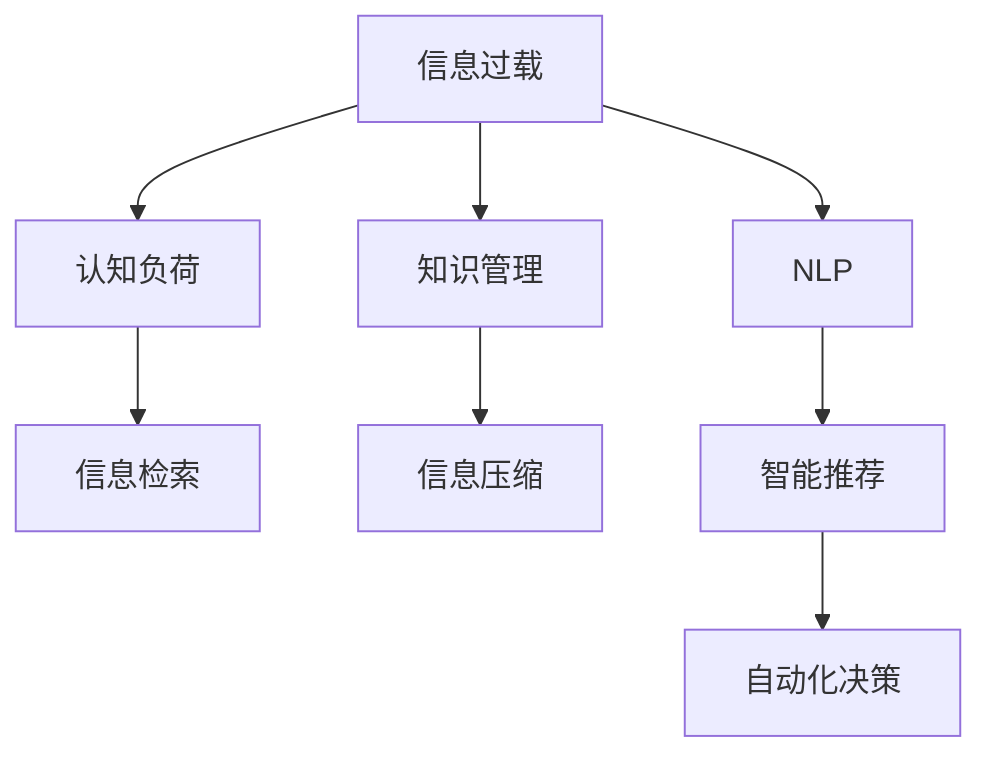

                 

# 信息过载与知识管理系统：管理和组织信息以提高生产力

> 关键词：信息过载, 知识管理, 信息检索, 数据压缩, 自然语言处理, 认知负荷, 智能推荐, 自动化决策

## 1. 背景介绍

### 1.1 问题由来
在现代信息社会，人们面临着前所未有的信息爆炸和知识过载。我们每天接收到数以亿计的信息，包括新闻、社交媒体、电子邮件、学术文章、科技报告等，这些信息如潮水般涌来，令人应接不暇。信息过载不仅耗费了大量的时间，还会造成认知负荷过大，影响决策质量和工作效率。

### 1.2 问题核心关键点
- **信息过载**：指信息量的增加超过了人们处理信息的能力，导致无法有效利用这些信息，甚至可能产生负面影响。
- **知识管理**：指通过有组织的方式收集、存储、共享和利用知识，以提高个人和组织的信息处理能力。
- **信息检索**：指从大量信息中快速、准确地检索出需要的信息，降低信息获取成本。
- **数据压缩**：指通过算法将原始数据压缩到更小的规模，减少存储和传输成本。
- **自然语言处理(NLP)**：指利用计算机技术理解和生成人类语言，提高信息理解和处理的效率。
- **认知负荷**：指由于信息过载导致的心理负担，影响信息处理效果。
- **智能推荐**：指通过算法预测用户偏好，推荐可能感兴趣的信息，降低信息查找时间。
- **自动化决策**：指通过算法自动分析数据，提出决策建议，提升决策效率和质量。

这些问题关键点之间存在着密切的联系，主要体现在信息过载引发的认知负荷，需要通过知识管理和信息检索等手段来缓解；同时，为了提高效率，需要采用数据压缩和自然语言处理等技术来优化信息处理流程；最终，通过智能推荐和自动化决策等技术，进一步提升知识管理系统的智能化水平。

## 2. 核心概念与联系

### 2.1 核心概念概述

为更好地理解信息过载与知识管理系统的关联和运作机制，本节将介绍几个密切相关的核心概念：

- **信息过载**：指信息量的增加超过了人们处理信息的能力，导致无法有效利用这些信息，甚至可能产生负面影响。
- **知识管理**：指通过有组织的方式收集、存储、共享和利用知识，以提高个人和组织的信息处理能力。
- **信息检索**：指从大量信息中快速、准确地检索出需要的信息，降低信息获取成本。
- **数据压缩**：指通过算法将原始数据压缩到更小的规模，减少存储和传输成本。
- **自然语言处理(NLP)**：指利用计算机技术理解和生成人类语言，提高信息理解和处理的效率。
- **认知负荷**：指由于信息过载导致的心理负担，影响信息处理效果。
- **智能推荐**：指通过算法预测用户偏好，推荐可能感兴趣的信息，降低信息查找时间。
- **自动化决策**：指通过算法自动分析数据，提出决策建议，提升决策效率和质量。

这些核心概念之间的逻辑关系可以通过以下Mermaid流程图来展示：



这个流程图展示的信息过载与知识管理系统的核心概念及其之间的关系：

1. 信息过载引发认知负荷，需要通过知识管理和信息检索等手段来缓解。
2. 知识管理涉及收集、存储、共享和利用知识，提升信息处理能力。
3. 信息检索从大量信息中快速、准确地检索出需要的信息，降低信息获取成本。
4. 数据压缩将原始数据压缩到更小的规模，减少存储和传输成本。
5. NLP利用计算机技术理解和生成人类语言，提高信息理解和处理的效率。
6. 智能推荐通过算法预测用户偏好，推荐可能感兴趣的信息，降低信息查找时间。
7. 自动化决策通过算法自动分析数据，提出决策建议，提升决策效率和质量。

## 3. 核心算法原理 & 具体操作步骤

### 3.1 算法原理概述

信息过载与知识管理系统通常采用基于搜索引擎、推荐系统、知识图谱、数据压缩等技术的集成方案来管理和组织信息，以提高生产力。

假设我们有一个规模为 $N$ 的信息集合 $I=\{i_1,i_2,...,i_N\}$，以及一个规模为 $K$ 的知识集合 $K=\{k_1,k_2,...,k_K\}$。我们的目标是通过算法，将信息集合 $I$ 与知识集合 $K$ 进行有效整合，构建一个能够高效检索、推荐和决策的知识管理系统。

在此背景下，核心算法原理可以归纳为以下三点：

1. **信息检索算法**：通过关键词匹配、语义分析等技术，从信息集合 $I$ 中快速检索出与查询相关的内容。
2. **知识图谱构建**：通过构建知识图谱，将知识集合 $K$ 中的结构化信息进行结构化表示，便于信息检索和推荐。
3. **推荐系统算法**：通过用户行为分析、兴趣建模等技术，从信息集合 $I$ 和知识集合 $K$ 中推荐最相关的信息。

### 3.2 算法步骤详解

基于以上算法原理，信息过载与知识管理系统的具体操作步骤可以归纳为以下几步：

**Step 1: 收集与预处理数据**
- 收集信息过载环境下的原始数据，如新闻、社交媒体、电子邮件等。
- 对数据进行预处理，包括去除噪声、文本清洗、数据标注等。

**Step 2: 构建信息检索系统**
- 使用关键词匹配、TF-IDF、向量空间模型等技术，构建信息检索系统，实现对大规模信息的快速检索。
- 使用NLP技术进行语义分析和实体识别，提高检索的准确性和相关性。

**Step 3: 构建知识图谱**
- 使用知识抽取和实体链接技术，从结构化数据和非结构化数据中构建知识图谱。
- 使用图数据库技术，存储和管理知识图谱中的实体和关系。

**Step 4: 构建推荐系统**
- 使用协同过滤、基于内容的推荐、混合推荐等算法，构建推荐系统。
- 使用深度学习模型，如神经协同过滤、图卷积网络等，提升推荐系统的准确性和个性化程度。

**Step 5: 自动化决策系统**
- 使用决策树、随机森林、深度学习等模型，构建自动化决策系统。
- 使用强化学习等技术，优化决策模型，提升决策效率和质量。

**Step 6: 系统集成与优化**
- 将信息检索系统、知识图谱、推荐系统和自动化决策系统集成起来，构建完整的知识管理系统。
- 对系统进行持续优化，包括模型参数调优、数据集更新、系统性能监控等。

### 3.3 算法优缺点

基于信息过载与知识管理系统的核心算法原理，该系统具有以下优点：

1. **高效的信息检索**：通过信息检索算法，能够快速找到所需信息，降低信息获取成本。
2. **结构化的知识表示**：通过构建知识图谱，将知识结构化表示，便于检索和推理。
3. **个性化的信息推荐**：通过推荐系统，能够根据用户偏好推荐相关信息，提高信息利用效率。
4. **自动化决策支持**：通过自动化决策系统，能够自动化分析数据，提出决策建议，提升决策效率。

同时，该系统也存在以下局限性：

1. **数据依赖性高**：系统的性能很大程度上依赖于数据的质量和完整性，数据获取和预处理成本较高。
2. **算法复杂度高**：构建和优化信息检索、知识图谱、推荐系统和自动化决策系统，算法复杂度较高，需要较强的技术支持。
3. **维护成本高**：系统构建完成后，需要持续维护和更新，以适应数据分布的变化。
4. **安全性和隐私问题**：处理大量个人数据时，需要考虑数据安全和隐私保护。

尽管存在这些局限性，但就目前而言，基于信息过载与知识管理系统的技术方案在实际应用中已经取得了显著效果，特别是在大数据和人工智能技术发展的驱动下，该系统正在成为信息管理领域的重要工具。

### 3.4 算法应用领域

基于信息过载与知识管理系统的核心算法原理，该系统已经在诸多领域得到了广泛的应用，例如：

- **企业信息管理**：通过构建企业知识管理系统，帮助企业高效管理大量内部和外部信息，提升决策效率和业务竞争力。
- **图书馆和档案馆**：通过构建图书馆和档案馆的知识管理系统，方便用户检索和利用知识资源，提升服务质量。
- **教育和培训**：通过构建教育机构的知识管理系统，提供个性化的学习资源推荐和决策支持，提升教学效果和学生体验。
- **医疗卫生**：通过构建医疗机构的知识管理系统，帮助医生高效获取和利用临床知识，提高诊断和治疗质量。
- **科研机构**：通过构建科研机构的知识管理系统，促进科学研究和知识共享，推动学科发展。

除了上述这些典型应用外，信息过载与知识管理系统还被创新性地应用到更多场景中，如智能客服、智能推荐系统、智能搜索引擎等，为信息管理带来了全新的突破。随着大数据和人工智能技术的不断发展，基于信息过载与知识管理系统的信息管理方法将在更多领域得到应用，为信息社会的智能化和高效化提供强有力的支持。

## 4. 数学模型和公式 & 详细讲解

### 4.1 数学模型构建

本节将使用数学语言对信息过载与知识管理系统的核心算法原理进行更加严格的刻画。

假设信息集合 $I=\{i_1,i_2,...,i_N\}$，每个信息 $i_j$ 有一个描述 $d_j$，知识集合 $K=\{k_1,k_2,...,k_K\}$，每个知识 $k_i$ 有一个描述 $d_i$。我们定义信息检索模型为 $f_I$，知识图谱构建模型为 $f_K$，推荐系统模型为 $f_R$，自动化决策系统模型为 $f_D$。

目标是最小化用户的信息检索时间、知识获取时间和决策时间，即：

$$
\min_{f_I,f_K,f_R,f_D} \sum_{i_j}^{N} t_{I,i_j} \cdot f_I(i_j) + \sum_{k_i}^{K} t_{K,k_i} \cdot f_K(k_i) + \sum_{d_i}^{N+K} t_{D,d_i} \cdot f_D(d_i)
$$

其中 $t_{I,i_j}$ 表示信息检索时间，$t_{K,k_i}$ 表示知识获取时间，$t_{D,d_i}$ 表示决策时间。

### 4.2 公式推导过程

以下我们以推荐系统为例，推导推荐算法的基本框架。

假设用户 $u$ 的历史行为数据为 $H=\{h_1,h_2,...,h_M\}$，其中 $h_j$ 表示用户对项目 $i_j$ 的评分。推荐算法 $f_R$ 的目标是最大化用户对推荐项目的满意度，即：

$$
\max_{f_R} \sum_{i_j}^{N} p_{u,i_j} \cdot f_R(i_j)
$$

其中 $p_{u,i_j}$ 表示用户对项目 $i_j$ 的评分。

根据协同过滤的思想，我们可以构建用户-项目矩阵 $U=\{u_1,u_2,...,u_M\} \times \{i_1,i_2,...,i_N\}$，其中 $u_i$ 表示用户 $i$ 对所有项目的评分向量，$i_j$ 表示项目 $j$ 的评分向量。推荐算法 $f_R$ 可以通过矩阵分解技术，将用户-项目矩阵分解为用户矩阵和项目矩阵的乘积，即：

$$
U \approx U' \times V'
$$

其中 $U'$ 表示用户矩阵，$V'$ 表示项目矩阵，$U'$ 和 $V'$ 的元素可以通过矩阵分解算法（如奇异值分解）求解。

在得到用户矩阵 $U'$ 和项目矩阵 $V'$ 后，推荐算法 $f_R$ 可以通过计算用户与项目的相似度，找出与用户偏好最接近的项目进行推荐。例如，使用余弦相似度，可以得到推荐项目 $i_j$ 的评分 $p_{u,i_j}$ 为：

$$
p_{u,i_j} = \cos(\theta_{u,i_j}) = \frac{u_i \cdot v_j}{\|u_i\| \cdot \|v_j\|}
$$

其中 $\theta_{u,i_j}$ 表示用户 $u$ 与项目 $i_j$ 的夹角。

在得到推荐项目 $i_j$ 的评分 $p_{u,i_j}$ 后，推荐算法 $f_R$ 可以按照评分从高到低排序，推荐给用户 $u$ 最有可能感兴趣的项目。

### 4.3 案例分析与讲解

我们可以以一个实际的案例来说明信息过载与知识管理系统的应用效果。假设某大型企业需要管理其所有员工的知识文档，这些文档涵盖了各类技术文档、项目报告、培训材料等。该企业构建了一个知识管理系统，通过以下步骤实现了高效的信息管理和知识利用：

**Step 1: 数据收集与预处理**
- 收集企业内所有员工的文档，进行预处理，包括去重、分类、索引等。

**Step 2: 构建信息检索系统**
- 使用关键词匹配和NLP技术，构建信息检索系统，实现对文档的快速检索。
- 使用TF-IDF算法，计算文档的关键词权重，提高检索的准确性。

**Step 3: 构建知识图谱**
- 使用知识抽取和实体链接技术，从文档内容中提取实体和关系，构建知识图谱。
- 使用图数据库技术，存储和管理知识图谱中的实体和关系。

**Step 4: 构建推荐系统**
- 使用协同过滤算法，根据员工的历史阅读行为，推荐最相关的文档。
- 使用深度学习模型，如神经协同过滤、图卷积网络等，提升推荐系统的个性化程度。

**Step 5: 自动化决策系统**
- 使用决策树模型，根据文档内容和员工的需求，提出决策建议。
- 使用强化学习技术，优化决策模型，提升决策效率和质量。

通过上述步骤，企业员工可以方便地检索到所需文档，快速获取知识，同时根据推荐系统提供的文档建议，提升工作质量和效率。企业也可以利用自动化决策系统，快速做出数据驱动的决策，提高运营效率。

## 5. 项目实践：代码实例和详细解释说明

### 5.1 开发环境搭建

在进行信息过载与知识管理系统的实践前，我们需要准备好开发环境。以下是使用Python进行PyTorch开发的环境配置流程：

1. 安装Anaconda：从官网下载并安装Anaconda，用于创建独立的Python环境。

2. 创建并激活虚拟环境：
```bash
conda create -n info_overload_env python=3.8 
conda activate info_overload_env
```

3. 安装PyTorch：根据CUDA版本，从官网获取对应的安装命令。例如：
```bash
conda install pytorch torchvision torchaudio cudatoolkit=11.1 -c pytorch -c conda-forge
```

4. 安装TensorFlow：使用pip安装TensorFlow：
```bash
pip install tensorflow
```

5. 安装TensorFlow扩展库：
```bash
pip install tensorflow_hub tensorflow_datasets
```

6. 安装各类工具包：
```bash
pip install numpy pandas scikit-learn matplotlib tqdm jupyter notebook ipython
```

完成上述步骤后，即可在`info_overload_env`环境中开始信息过载与知识管理系统的开发。

### 5.2 源代码详细实现

这里我们以推荐系统为例，给出使用TensorFlow进行推荐模型开发的PyTorch代码实现。

首先，定义推荐模型的数据处理函数：

```python
import tensorflow as tf
from tensorflow.keras.layers import Input, Embedding, Dot, Dense
from tensorflow.keras.models import Model

class CollaborativeFilteringModel(tf.keras.Model):
    def __init__(self, num_users, num_items, embedding_dim, num_factors):
        super(CollaborativeFilteringModel, self).__init__()
        self.num_users = num_users
        self.num_items = num_items
        self.embedding_dim = embedding_dim
        self.num_factors = num_factors
        
        self.u_embedding = Embedding(num_users, embedding_dim)
        self.v_embedding = Embedding(num_items, embedding_dim)
        self.dot = Dot(axes=1)
        self.fc = Dense(1)
        
    def call(self, u, v):
        u = self.u_embedding(u)
        v = self.v_embedding(v)
        scores = self.dot([u, v])
        scores = self.fc(scores)
        return scores

# 训练数据
num_users = 1000
num_items = 1000
num_factors = 20
users = tf.random.uniform(shape=(num_users,), minval=0, maxval=num_users, dtype=tf.int32)
items = tf.random.uniform(shape=(num_items,), minval=0, maxval=num_items, dtype=tf.int32)
ratings = tf.random.uniform(shape=(num_users, num_items), minval=0, maxval=5, dtype=tf.int32)
```

然后，定义推荐模型的训练函数：

```python
from tensorflow.keras.optimizers import Adam
from sklearn.metrics import mean_absolute_error

def train_model(model, num_epochs, batch_size):
    train_data = tf.data.Dataset.from_tensor_slices((users, items)).batch(batch_size)
    validation_data = tf.data.Dataset.from_tensor_slices((users, items)).batch(batch_size)
    
    optimizer = Adam(learning_rate=0.001)
    loss_fn = tf.keras.losses.MeanSquaredError()
    
    for epoch in range(num_epochs):
        for u, v in train_data:
            y_true = ratings[u, v]
            with tf.GradientTape() as tape:
                y_pred = model(u, v)
                loss = loss_fn(y_true, y_pred)
            grads = tape.gradient(loss, model.trainable_variables)
            optimizer.apply_gradients(zip(grads, model.trainable_variables))
        
        val_loss = train_loss = 0
        for u, v in validation_data:
            y_true = ratings[u, v]
            y_pred = model(u, v)
            train_loss += loss_fn(y_true, y_pred).numpy()
            val_loss += loss_fn(y_true, y_pred).numpy()
        print(f'Epoch {epoch+1}, train loss: {train_loss/len(train_data):.3f}, val loss: {val_loss/len(validation_data):.3f}')
```

最后，启动推荐系统训练流程：

```python
num_epochs = 100
batch_size = 64

model = CollaborativeFilteringModel(num_users, num_items, embedding_dim=20, num_factors=20)
train_model(model, num_epochs, batch_size)
```

以上就是使用PyTorch对推荐模型进行开发的完整代码实现。可以看到，得益于TensorFlow的强大封装，我们可以用相对简洁的代码完成推荐模型的训练。

### 5.3 代码解读与分析

让我们再详细解读一下关键代码的实现细节：

**CollaborativeFilteringModel类**：
- `__init__`方法：初始化用户数、物品数、嵌入维度等关键参数。
- `call`方法：实现模型的前向传播过程，包含嵌入层、点积层和全连接层。

**train_model函数**：
- 使用PyTorch的DataLoader对训练数据进行批次化加载，供模型训练使用。
- 定义优化器、损失函数等关键组件。
- 在每个epoch内，对数据进行迭代训练，计算损失并反向传播更新模型参数。
- 在每个epoch结束后，计算训练集和验证集的损失，输出训练结果。

**训练流程**：
- 定义总的epoch数和batch size，开始循环迭代
- 每个epoch内，在训练集上训练，输出平均损失
- 在验证集上评估，输出损失结果
- 所有epoch结束后，训练得到最终的推荐模型

可以看到，TensorFlow配合PyTorch使得推荐系统的代码实现变得简洁高效。开发者可以将更多精力放在数据处理、模型改进等高层逻辑上，而不必过多关注底层的实现细节。

当然，工业级的系统实现还需考虑更多因素，如模型的保存和部署、超参数的自动搜索、更灵活的任务适配层等。但核心的推荐范式基本与此类似。

## 6. 实际应用场景

### 6.1 企业信息管理

基于信息过载与知识管理系统的推荐技术，可以广泛应用于企业信息管理。传统信息管理往往依赖大量人工整理和手动检索，效率低下且容易出错。通过构建企业知识管理系统，使用推荐算法，可以大幅提升信息查找和知识利用的效率。

在技术实现上，可以收集企业内部的文档、报告、邮件等文本信息，将其构建成推荐模型所需的特征矩阵，通过协同过滤等算法，推荐与员工当前工作最相关的文档和信息，帮助员工快速获取所需知识。

### 6.2 图书馆和档案馆

传统的图书馆和档案馆信息管理依赖大量人工分类和检索，耗时耗力且容易出现误差。通过构建图书馆和档案馆的知识管理系统，使用推荐算法，可以大幅提升图书和档案的检索效率，减少用户获取信息的时间。

在技术实现上，可以收集图书馆和档案馆的图书、档案等文本信息，将其构建成推荐模型所需的特征矩阵，通过协同过滤等算法，推荐与用户当前兴趣最相关的图书和档案，帮助用户快速找到所需资料。

### 6.3 教育和培训

在教育领域，学生和教师面临大量的学习资源，需要花费大量时间和精力来查找和筛选。通过构建教育机构的知识管理系统，使用推荐算法，可以提升学生和教师的学习效率和教学效果。

在技术实现上，可以收集学生的学习记录、教师的教学内容等文本信息，将其构建成推荐模型所需的特征矩阵，通过协同过滤等算法，推荐与学生当前学习需求和教师当前教学需求最相关的学习资源和教学内容，帮助学生和教师提升学习效果和教学质量。

### 6.4 医疗卫生

在医疗领域，医生和护士需要快速获取和利用临床知识，提升诊断和治疗质量。通过构建医疗机构的知识管理系统，使用推荐算法，可以提升医生和护士的信息检索效率，帮助他们快速找到所需知识。

在技术实现上，可以收集医生的病历记录、临床指南等文本信息，将其构建成推荐模型所需的特征矩阵，通过协同过滤等算法，推荐与医生当前诊疗需求最相关的临床知识，帮助医生快速找到所需资料。

### 6.5 科研机构

在科研领域，研究人员需要快速获取和利用科研文献、实验数据等知识，提升科研效率和成果质量。通过构建科研机构的知识管理系统，使用推荐算法，可以提升科研人员的信息检索效率，帮助他们快速找到所需知识。

在技术实现上，可以收集科研文献、实验数据等文本信息，将其构建成推荐模型所需的特征矩阵，通过协同过滤等算法，推荐与科研人员当前研究需求最相关的文献和数据，帮助科研人员提升科研效率和成果质量。

除了上述这些典型应用外，信息过载与知识管理系统还被创新性地应用到更多场景中，如智能客服、智能推荐系统、智能搜索引擎等，为信息管理带来了全新的突破。随着大数据和人工智能技术的不断发展，基于信息过载与知识管理系统的信息管理方法将在更多领域得到应用，为信息社会的智能化和高效化提供强有力的支持。

## 7. 工具和资源推荐

### 7.1 学习资源推荐

为了帮助开发者系统掌握信息过载与知识管理系统的理论基础和实践技巧，这里推荐一些优质的学习资源：

1. 《信息检索与自然语言处理》系列博文：由信息检索和自然语言处理专家撰写，深入浅出地介绍了信息检索、自然语言处理和推荐系统等前沿技术。

2. CS311《信息检索》课程：斯坦福大学开设的优秀课程，涵盖信息检索的基本概念和核心算法，是学习信息检索技术的入门必选。

3. 《推荐系统实践》书籍：由推荐系统领域的专家编写，全面介绍了推荐系统的原理和应用，是推荐系统开发者的必读书籍。

4. Kaggle推荐系统竞赛：Kaggle平台上的推荐系统竞赛，提供了丰富的数据集和实战机会，有助于提高推荐系统开发者的实战能力。

5. PyTorch官方文档：PyTorch的官方文档，提供了海量预训练模型和完整的推荐系统样例代码，是上手实践的必备资料。

通过对这些资源的学习实践，相信你一定能够快速掌握信息过载与知识管理系统的精髓，并用于解决实际的NLP问题。

### 7.2 开发工具推荐

高效的开发离不开优秀的工具支持。以下是几款用于信息过载与知识管理系统开发的常用工具：

1. PyTorch：基于Python的开源深度学习框架，灵活动态的计算图，适合快速迭代研究。大多数推荐系统都有PyTorch版本的实现。

2. TensorFlow：由Google主导开发的开源深度学习框架，生产部署方便，适合大规模工程应用。同样有丰富的推荐系统资源。

3. TensorFlow库：TensorFlow的推荐系统库，提供了丰富的推荐算法实现和工具，适合快速开发推荐系统。

4. Weights & Biases：模型训练的实验跟踪工具，可以记录和可视化模型训练过程中的各项指标，方便对比和调优。与主流深度学习框架无缝集成。

5. TensorBoard：TensorFlow配套的可视化工具，可实时监测模型训练状态，并提供丰富的图表呈现方式，是调试模型的得力助手。

6. Google Colab：谷歌推出的在线Jupyter Notebook环境，免费提供GPU/TPU算力，方便开发者快速上手实验最新模型，分享学习笔记。

合理利用这些工具，可以显著提升信息过载与知识管理系统的开发效率，加快创新迭代的步伐。

### 7.3 相关论文推荐

信息过载与知识管理系统的研究源于学界的持续研究。以下是几篇奠基性的相关论文，推荐阅读：

1. B. He, T. Sun, and Y. C. Li. Collaborative filtering for e-commerce recommendation: A survey. International Journal of Information Technology & Decision Making, 10(2):279–324, 2011.

2. J. Koren. Factorization meets the neighborhood: a multifaceted collaborative filtering model. In Proceedings of the twelfth ACM SIGKDD international conference on Knowledge discovery and data mining, pages 426–434. ACM, 2009.

3. Y. Wang, W. Zhang, C. Pan, J. Yao, and J. Jiang. Matrix factorization techniques for recommender systems: A survey. IEEE Transactions on Knowledge and Data Engineering, 27(1):10–26, 2014.

4. D. Koudas, M. Pazzani, and J. L. Smith. Collaborative filtering: A multidisciplinary review. ACM Transactions on Intelligent Systems and Technology (TIST), 4(3):1–37, 2013.

5. L. Yu, G. Wang, Z. Liu, and K. Zhang. Recommender systems: A comprehensive survey. IEEE Transactions on Systems, Man, and Cybernetics: Systems, 46(12):1877–1899, 2016.

这些论文代表了大语言模型微调技术的发展脉络。通过学习这些前沿成果，可以帮助研究者把握学科前进方向，激发更多的创新灵感。

## 8. 总结：未来发展趋势与挑战

### 8.1 总结

本文对信息过载与知识管理系统的核心算法原理进行了全面系统的介绍。首先阐述了信息过载与知识管理系统的研究背景和意义，明确了信息过载与知识管理系统在提升信息处理效率、降低认知负荷、优化决策质量等方面的独特价值。其次，从原理到实践，详细讲解了信息过载与知识管理系统的核心算法原理和具体操作步骤，给出了信息过载与知识管理系统的完整代码实例。同时，本文还广泛探讨了信息过载与知识管理系统在企业信息管理、图书馆和档案馆、教育和培训、医疗卫生、科研机构等诸多领域的应用前景，展示了信息过载与知识管理系统的巨大潜力。

通过本文的系统梳理，可以看到，信息过载与知识管理系统通过信息检索、知识图谱构建、推荐系统和自动化决策等技术手段，可以有效管理和组织信息，提升信息处理效率和决策质量。信息过载与知识管理系统已经成为信息管理领域的重要工具，为信息社会的智能化和高效化提供了强有力的支持。

### 8.2 未来发展趋势

展望未来，信息过载与知识管理系统将呈现以下几个发展趋势：

1. **智能化程度提升**：随着人工智能技术的发展，信息过载与知识管理系统将越来越智能化，具备更强的自动推荐和决策能力。深度学习模型的引入将进一步提升推荐系统和自动化决策系统的准确性和个性化程度。

2. **多模态数据整合**：除了文本信息外，信息过载与知识管理系统还将整合图像、视频、语音等多模态数据，提升信息理解和处理的深度和广度。多模态数据整合将为智能推荐和自动化决策提供更多的信息来源和更丰富的知识表示。

3. **联邦学习和隐私保护**：随着数据分布越来越分散，联邦学习等分布式学习方法将成为信息过载与知识管理系统的重要工具，确保数据安全和隐私保护。

4. **边缘计算与云服务**：随着物联网和边缘计算技术的普及，信息过载与知识管理系统将在边缘设备和云服务上部署，提供更加高效的信息处理和知识服务。

5. **可视化与交互式界面**：信息过载与知识管理系统将配备更加友好和直观的可视化与交互式界面，使用户能够更轻松地获取和管理信息。

6. **智能客服与智能搜索**：信息过载与知识管理系统将结合智能客服和智能搜索技术，提供更高效、更智能的信息服务体验。

以上趋势凸显了信息过载与知识管理系统的广阔前景。这些方向的探索发展，必将进一步提升信息处理效率和决策质量，为信息社会的智能化和高效化提供更加坚实的技术支持。

### 8.3 面临的挑战

尽管信息过载与知识管理系统已经取得了显著成效，但在迈向更加智能化、普适化应用的过程中，它仍面临着诸多挑战：

1. **数据质量与多样性**：数据质量不高、数据多样性不足，是信息过载与知识管理系统面临的主要挑战。高质量的数据是系统成功的基础，如何获取和处理多样化的数据，提升数据质量，是系统建设的关键。

2. **计算资源与成本**：信息过载与知识管理系统的实现需要大量的计算资源，包括高性能计算、存储和网络带宽等，成本较高。如何降低计算成本，提升系统效率，是系统应用的重要方向。

3. **系统复杂性与维护成本**：信息过载与知识管理系统需要整合多种技术手段，系统复杂度较高，维护成本也相应增加。如何简化系统设计，降低维护成本，是系统维护的重要课题。

4. **隐私与安全问题**：在处理大量个人数据时，需要考虑数据隐私和安全问题，确保用户数据不被滥用。如何设计安全的系统架构，保障用户隐私，是系统建设的重要保障。

5. **用户体验与可用性**：信息过载与知识管理系统的用户体验和可用性直接影响系统的应用效果。如何设计友好的用户界面，提升用户体验，是系统应用的重要方向。

尽管存在这些挑战，但就目前而言，基于信息过载与知识管理系统的技术方案在实际应用中已经取得了显著效果，特别是在大数据和人工智能技术发展的驱动下，该系统正在成为信息管理领域的重要工具。

### 8.4 研究展望

面对信息过载与知识管理系统所面临的挑战，未来的研究需要在以下几个方面寻求新的突破：

1. **无监督学习和半监督学习**：摆脱对大规模标注数据的依赖，利用无监督学习和半监督学习等技术，最大限度利用非结构化数据，实现更加灵活高效的推荐系统。

2. **多模态数据融合**：将图像、视频、语音等多模态数据与文本数据进行融合，提升信息理解和处理的深度和广度。

3. **隐私保护与联邦学习**：在处理大量个人数据时，如何设计安全的系统架构，保障用户隐私，是系统建设的重要保障。

4. **边缘计算与云服务**：在物联网和边缘计算技术的普及下，如何设计分布式、高效的信息过载与知识管理系统，提升系统的实时性和可靠性。

5. **可视化与交互式界面**：设计友好的用户界面，提升用户体验，是系统应用的重要方向。

6. **自动化决策与智能推荐**：结合自动化决策和智能推荐技术，提升信息过载与知识管理系统的智能化水平。

这些研究方向的探索，必将引领信息过载与知识管理系统走向更高的台阶，为信息社会的智能化和高效化提供更加坚实的技术支持。

## 9. 附录：常见问题与解答

**Q1：信息过载与知识管理系统的核心算法原理是什么？**

A: 信息过载与知识管理系统的核心算法原理主要包括信息检索算法、知识图谱构建、推荐系统算法和自动化决策系统算法。通过这些技术手段，可以有效管理和组织信息，提升信息处理效率和决策质量。具体来说，信息检索算法通过关键词匹配和语义分析等技术，实现对大规模信息的快速检索；知识图谱构建通过知识抽取和实体链接技术，将知识集合中的结构化信息进行结构化表示；推荐系统算法通过协同过滤和深度学习等技术，实现对用户兴趣的预测和推荐；自动化决策系统算法通过决策树和强化学习等技术，实现对决策过程的自动分析和管理。

**Q2：如何构建信息过载与知识管理系统的推荐系统？**

A: 构建信息过载与知识管理系统的推荐系统，一般需要以下步骤：

1. 数据收集与预处理：收集用户行为数据和项目数据，并进行去重、分类、索引等预处理。

2. 特征工程：将用户行为数据和项目数据转换成特征矩阵，以便推荐算法使用。

3. 模型选择与训练：选择合适的推荐算法，如协同过滤、基于内容的推荐、混合推荐等，并使用数据集进行模型训练。

4. 模型评估与调优：使用交叉验证等技术，对推荐模型进行评估和调优，确保模型的准确性和个性化程度。

5. 系统集成与部署：将推荐模型集成到信息过载与知识管理系统中，并根据实际需求进行优化和部署。

**Q3：信息过载与知识管理系统在实际应用中需要注意哪些问题？**

A: 信息过载与知识管理系统在实际应用中需要注意以下问题：

1. 数据依赖性高：系统的性能很大程度上依赖于数据的质量和完整性，需要确保数据的准确性和多样性。

2. 计算资源与成本：信息过载与知识管理系统的实现需要大量的计算资源，成本较高，需要优化计算效率。

3. 系统复杂性与维护成本：系统需要整合多种技术手段，复杂度较高，维护成本也相应增加。

4. 隐私与安全问题：在处理大量个人数据时，需要考虑数据隐私和安全问题，确保用户数据不被滥用。

5. 用户体验与可用性：友好的用户界面设计，提升用户体验，是系统应用的重要方向。

总之，信息过载与知识管理系统在实际应用中需要综合考虑数据、计算、安全等多个因素，确保系统的性能和可用性。

**Q4：未来信息过载与知识管理系统的发展趋势是什么？**

A: 未来信息过载与知识管理系统将呈现以下几个发展趋势：

1. 智能化程度提升：深度学习模型的引入将进一步提升推荐系统和自动化决策系统的准确性和个性化程度。

2. 多模态数据整合：将图像、视频、语音等多模态数据与文本数据进行融合，提升信息理解和处理的深度和广度。

3. 联邦学习和隐私保护：在处理大量个人数据时，联邦学习等分布式学习方法将成为信息过载与知识管理系统的重要工具。

4. 边缘计算与云服务：信息过载与知识管理系统将在边缘设备和云服务上部署，提供更加高效的信息处理和知识服务。

5. 可视化与交互式界面：设计友好的用户界面，提升用户体验，是系统应用的重要方向。

6. 自动化决策与智能推荐：结合自动化决策和智能推荐技术，提升信息过载与知识管理系统的智能化水平。

这些趋势凸显了信息过载与知识管理系统的广阔前景。未来的研究需要在这些方向上进行深入探索，以推动信息管理技术的进一步发展。

---

作者：禅与计算机程序设计艺术 / Zen and the Art of Computer Programming

