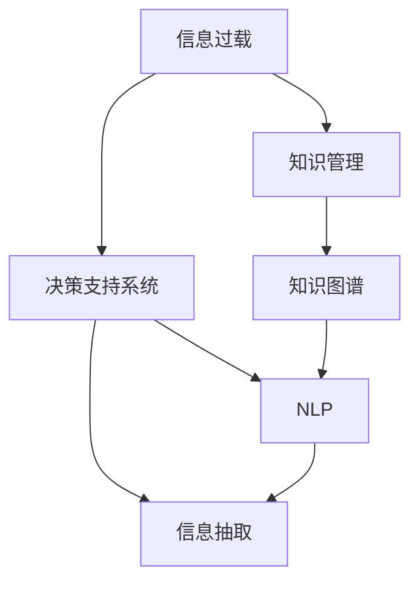

                 

# 信息过载与知识管理：如何在复杂的信息环境中做出明智的决定

> 关键词：信息过载,知识管理,决策支持系统,自然语言处理,NLP,信息抽取,知识图谱

## 1. 背景介绍

### 1.1 问题由来

在当今数字化时代，信息量呈爆炸式增长。据统计，全球数据量每两年翻一番，人们每天接触的信息量已远远超出了人类的处理能力。这一现象被称为“信息过载”（Information Overload），它不仅影响了人们的学习效率和工作效率，还造成了严重的认知负担和决策困难。

### 1.2 问题核心关键点

面对信息过载，如何在海量信息中快速获取有价值的内容，并转化为可应用的决策知识，成为了一个亟待解决的难题。当前，学术界和工业界已经提出了多种方法来应对这一挑战，其中知识管理（Knowledge Management）和决策支持系统（Decision Support Systems, DSS）是两种主要的技术手段。

知识管理通过将信息转化为知识，并利用知识图谱、专家系统等工具，为决策提供支持；而决策支持系统则通过自然语言处理（NLP）、信息抽取等技术，帮助用户快速获取、分析和理解海量数据，辅助决策。

### 1.3 问题研究意义

解决信息过载问题，对于提高个人和组织的决策效率，优化资源配置，推动科技和社会进步具有重要意义。

1. **提高工作效率**：通过知识管理技术，可以帮助个人和团队快速定位所需信息，提高学习和工作的效率。
2. **优化决策质量**：通过决策支持系统，可以在数据中发现隐藏的模式和趋势，提升决策的科学性和准确性。
3. **促进知识共享**：知识管理平台可以促进知识的共享和传播，加速新知识的应用和转化。
4. **提升创新能力**：通过自动化知识提取和分析，可以降低创新的知识门槛，推动技术和社会创新。
5. **助力社会治理**：在政府和社会治理中，通过决策支持系统可以提供科学合理的建议，提高政策制定和执行的效果。

## 2. 核心概念与联系

### 2.1 核心概念概述

为更好地理解如何在信息过载环境中做出明智决策，本节将介绍几个关键概念：

- **信息过载**：指人们在接收、处理信息时面临的负担超出其处理能力的现象。
- **知识管理**：指通过计划、执行和维护活动，将信息转化为可应用的知识，并通过知识库、知识图谱等工具进行管理的过程。
- **决策支持系统**：指利用数据分析、人工智能等技术，为决策者提供信息支持和决策建议的自动化系统。
- **自然语言处理**：指使计算机能够理解、解释和生成人类语言的技术。
- **信息抽取**：指从非结构化文本中提取结构化信息的过程，常用于抽取实体、关系等。
- **知识图谱**：指将知识表示为图结构，通过节点和边来表示实体和它们之间的关系，便于知识推理和应用。

这些概念之间的关系可以通过以下Mermaid流程图来展示：



这个流程图展示了一体化的信息过载应对框架，即：

1. **信息过载**通过**知识管理**转化为可应用的**知识**。
2. **知识管理**的结果通过**决策支持系统**提供**信息支持**和**决策建议**。
3. **决策支持系统**中涉及的**自然语言处理**和**信息抽取**技术，有助于更准确地**提取**和**理解**知识。
4. **知识图谱**作为知识管理的重要工具，为信息抽取和推理提供支持。

这些概念共同构成了在信息过载环境中做出明智决策的技术基础。通过理解这些核心概念，我们可以更好地把握信息过载应对的策略和工具。

## 3. 核心算法原理 & 具体操作步骤

### 3.1 算法原理概述

解决信息过载问题，本质上是一个从海量信息中提取有用知识并应用到决策的过程。这一过程可以分解为以下几个关键步骤：

1. **信息采集**：收集各类信息源，包括文本、图像、音频等。
2. **信息预处理**：对原始信息进行清洗、归一化、去噪等预处理，确保数据质量。
3. **信息抽取**：从文本中抽取结构化信息，如实体、关系等。
4. **知识表示**：将抽取的信息转化为知识图谱等结构化形式，便于检索和推理。
5. **知识应用**：将知识应用于决策支持系统，辅助决策者做出明智决策。

### 3.2 算法步骤详解

#### 3.2.1 信息采集

信息采集是信息过载应对的第一步，需要建立多渠道的信息收集机制，确保信息的全面性和时效性。

**步骤1：定义信息源**
- 确定需要采集的信息类型（如新闻、社交媒体、专利、论文等）。
- 确定信息采集的频率和数量（如每日采集、按主题采集等）。

**步骤2：选择采集工具**
- 使用网络爬虫、API接口等工具进行自动采集。
- 确保采集工具的稳定性和效率，避免因采集中断或数据不全导致的信息遗漏。

**步骤3：处理采集结果**
- 对采集到的信息进行去重、去噪、清洗等处理，确保数据质量。
- 将信息转化为结构化格式，便于后续处理。

#### 3.2.2 信息预处理

信息预处理是确保数据质量和一致性的关键步骤，包括数据清洗、格式转换、归一化等。

**步骤1：清洗数据**
- 去除无效、重复、不相关的信息。
- 处理数据格式不统一的问题，如日期格式、单位等。

**步骤2：归一化数据**
- 对不同来源的数据进行格式统一，如将日期统一到指定格式。
- 对数据进行标准化处理，如将文本中的大小写统一。

**步骤3：去噪处理**
- 去除文本中的噪音，如停用词、无关信息等。
- 使用自然语言处理技术去除语法错误、拼写错误等。

#### 3.2.3 信息抽取

信息抽取是从非结构化文本中提取结构化信息的过程，常用于抽取实体、关系等。

**步骤1：实体识别**
- 使用命名实体识别（Named Entity Recognition, NER）技术，从文本中识别出人名、地名、机构名等实体。
- 可以使用预训练的NER模型，如BERT、RoBERTa等。

**步骤2：关系抽取**
- 使用关系抽取（Relation Extraction）技术，从文本中提取实体之间的关系。
- 可以基于规则、模板或机器学习模型进行抽取。

**步骤3：事件抽取**
- 使用事件抽取（Event Extraction）技术，从文本中抽取事件和相关实体。
- 可以基于规则或机器学习模型进行抽取。

#### 3.2.4 知识表示

知识表示是将抽取的信息转化为知识图谱等结构化形式的过程，便于检索和推理。

**步骤1：构建知识图谱**
- 使用知识图谱构建工具，如Neo4j、Protege等，构建知识图谱。
- 将抽取的实体、关系等映射到知识图谱中，形成节点和边。

**步骤2：优化知识图谱**
- 使用图数据库优化算法，如PageRank、PageRank+等，优化知识图谱的权重和排序。
- 使用实体对齐、关系对齐等技术，提高知识图谱的准确性和一致性。

**步骤3：知识推理**
- 使用知识图谱推理技术，如基于规则的推理、基于逻辑的推理等，从知识图谱中提取有用的信息。
- 可以使用符号推理、统计推理等方法，提升推理的准确性。

#### 3.2.5 知识应用

知识应用是将知识转化为决策支持的过程，常用于辅助决策。

**步骤1：构建决策支持系统**
- 使用决策支持系统框架，如IBM's OLAP、Microsoft's Power BI等，构建DSS。
- 将知识图谱和其他数据源集成到DSS中，形成综合的信息视图。

**步骤2：信息检索**
- 使用信息检索技术，如向量空间模型、信息检索算法等，从知识图谱中检索相关信息。
- 使用关键词查询、布尔查询等方法，提高检索的准确性和效率。

**步骤3：决策建议**
- 使用决策支持系统，生成决策建议，如推荐系统、风险评估等。
- 将知识图谱中的信息和现实数据结合，生成个性化的决策建议。

### 3.3 算法优缺点

基于上述步骤的信息过载应对方法，具有以下优点：

1. **全面性**：通过多渠道信息采集，可以覆盖各类信息源，确保信息的全面性。
2. **高效性**：通过自动化处理和预处理，可以显著提升信息处理的效率。
3. **准确性**：通过信息抽取和知识表示，可以提高信息的准确性和一致性。
4. **可扩展性**：通过知识图谱和DSS，可以方便地扩展和优化信息应用。

同时，该方法也存在一定的局限性：

1. **数据质量依赖**：信息采集和预处理的准确性依赖于数据源的质量和处理策略。
2. **算法复杂度**：信息抽取和知识表示的算法复杂度较高，对计算资源的要求较高。
3. **知识应用局限**：决策支持系统的应用效果依赖于模型的质量和数据的丰富性。
4. **隐私和安全问题**：信息采集和处理过程中可能涉及隐私和安全问题，需要采取相应措施保护数据。

尽管存在这些局限性，但就目前而言，基于知识管理的方法仍是在信息过载环境中做出明智决策的主流范式。未来相关研究的重点在于如何进一步提高信息处理的自动化水平，降低对人工干预的依赖，同时兼顾数据隐私和安全。

### 3.4 算法应用领域

基于知识管理的信息过载应对方法，已经在多个领域得到了广泛的应用，例如：

- **金融领域**：用于风险评估、信用评分、投资决策等。通过知识图谱和DSS，实时监控市场动态，辅助决策。
- **医疗领域**：用于疾病诊断、治疗方案推荐、药物研发等。通过知识图谱和信息检索，提供个性化的医疗建议。
- **政府治理**：用于舆情分析、政策制定、公共服务评价等。通过信息抽取和知识图谱，为政府决策提供支持。
- **智能客服**：用于客户问题解答、情感分析、客户画像等。通过信息抽取和自然语言处理，提升客户服务体验。
- **社交媒体**：用于情感分析、趋势预测、事件监测等。通过信息采集和预处理，实时分析社交媒体内容。

除了上述这些经典应用外，信息过载应对方法也被创新性地应用到更多场景中，如智慧城市、供应链管理、市场营销等，为各行各业的信息管理和决策支持提供了新的工具。

## 4. 数学模型和公式 & 详细讲解

### 4.1 数学模型构建

本节将使用数学语言对信息过载应对方法进行更加严格的刻画。

设信息采集和预处理的完整信息集为 $D=\{d_1, d_2, ..., d_N\}$，其中 $d_i$ 表示第 $i$ 条信息。假设信息抽取和知识表示的最终知识图谱为 $G=(V, E, R)$，其中 $V$ 为节点集合，$E$ 为边集合，$R$ 为关系集合。设信息抽取的实体集为 $E=\{e_1, e_2, ..., e_M\}$，关系集为 $R=\{r_1, r_2, ..., r_K\}$。

### 4.2 公式推导过程

#### 4.2.1 信息采集

信息采集的目标是最大化信息的多样性和全面性，可以通过以下优化问题来描述：

$$
\max_{D} \sum_{i=1}^N f_i(d_i)
$$

其中 $f_i(d_i)$ 表示第 $i$ 条信息的价值，可以根据信息的重要性、时效性等因素进行量化。

#### 4.2.2 信息预处理

信息预处理的目的是提高信息的质量和一致性，可以通过以下优化问题来描述：

$$
\min_{D'} \sum_{i=1}^N g_i(d_i')
$$

其中 $d_i'$ 表示第 $i$ 条信息预处理后的结果，$g_i(d_i')$ 表示预处理后的信息质量，可以根据去噪、清洗等因素进行量化。

#### 4.2.3 信息抽取

信息抽取的目标是从文本中抽取结构化信息，可以通过以下优化问题来描述：

$$
\max_{E, R} \sum_{e \in E} h_e(e) + \sum_{r \in R} i_r(r)
$$

其中 $e$ 表示实体，$r$ 表示关系，$h_e(e)$ 表示实体的重要性，$i_r(r)$ 表示关系的重要性。

#### 4.2.4 知识表示

知识表示的目标是将抽取的信息转化为知识图谱，可以通过以下优化问题来描述：

$$
\min_{G} \sum_{v \in V} j_v(v) + \sum_{r \in R} k_r(r)
$$

其中 $v$ 表示节点，$r$ 表示边，$j_v(v)$ 表示节点的权重，$k_r(r)$ 表示边的权重。

#### 4.2.5 知识应用

知识应用的目标是利用知识图谱辅助决策，可以通过以下优化问题来描述：

$$
\max_{S} \sum_{s \in S} l_s(s)
$$

其中 $s$ 表示决策建议，$l_s(s)$ 表示决策建议的质量，可以根据决策的效果、满意度等因素进行量化。

### 4.3 案例分析与讲解

**案例1：金融领域风险评估**

在金融领域，风险评估是风险管理的重要环节。通过信息过载应对方法，可以从海量金融数据中抽取有用的风险信息，辅助风险评估决策。

具体步骤如下：

1. **信息采集**：从金融新闻、社交媒体、专利、论文等数据源中采集相关信息。
2. **信息预处理**：对采集到的信息进行清洗、归一化、去噪等预处理，确保数据质量。
3. **信息抽取**：使用实体识别、关系抽取等技术，从文本中提取企业财务数据、市场趋势等信息。
4. **知识表示**：将抽取的信息转化为知识图谱，形成企业财务信息、市场趋势等节点和关系。
5. **知识应用**：使用决策支持系统，生成风险评估报告，辅助决策者做出明智决策。

**案例2：医疗领域疾病诊断**

在医疗领域，疾病诊断是提高患者治愈率的关键环节。通过信息过载应对方法，可以从海量医疗数据中抽取有用的疾病信息，辅助疾病诊断决策。

具体步骤如下：

1. **信息采集**：从医疗记录、研究论文、患者反馈等数据源中采集相关信息。
2. **信息预处理**：对采集到的信息进行清洗、归一化、去噪等预处理，确保数据质量。
3. **信息抽取**：使用实体识别、关系抽取等技术，从文本中提取疾病症状、治疗方案等信息。
4. **知识表示**：将抽取的信息转化为知识图谱，形成疾病症状、治疗方案等节点和关系。
5. **知识应用**：使用决策支持系统，生成疾病诊断报告，辅助医生做出明智决策。

## 5. 项目实践：代码实例和详细解释说明

### 5.1 开发环境搭建

在进行信息过载应对实践前，我们需要准备好开发环境。以下是使用Python进行PyTorch开发的环境配置流程：

1. 安装Anaconda：从官网下载并安装Anaconda，用于创建独立的Python环境。

2. 创建并激活虚拟环境：
```bash
conda create -n info_overload_env python=3.8 
conda activate info_overload_env
```

3. 安装PyTorch：根据CUDA版本，从官网获取对应的安装命令。例如：
```bash
conda install pytorch torchvision torchaudio cudatoolkit=11.1 -c pytorch -c conda-forge
```

4. 安装Transformers库：
```bash
pip install transformers
```

5. 安装各类工具包：
```bash
pip install numpy pandas scikit-learn matplotlib tqdm jupyter notebook ipython
```

完成上述步骤后，即可在`info_overload_env`环境中开始信息过载应对实践。

### 5.2 源代码详细实现

这里我们以金融领域风险评估任务为例，给出使用Transformers库对BERT模型进行信息过载应对的PyTorch代码实现。

首先，定义风险评估任务的数据处理函数：

```python
from transformers import BertTokenizer
from torch.utils.data import Dataset
import torch

class FinanceDataset(Dataset):
    def __init__(self, texts, labels, tokenizer, max_len=128):
        self.texts = texts
        self.labels = labels
        self.tokenizer = tokenizer
        self.max_len = max_len
        
    def __len__(self):
        return len(self.texts)
    
    def __getitem__(self, item):
        text = self.texts[item]
        label = self.labels[item]
        
        encoding = self.tokenizer(text, return_tensors='pt', max_length=self.max_len, padding='max_length', truncation=True)
        input_ids = encoding['input_ids'][0]
        attention_mask = encoding['attention_mask'][0]
        
        # 对token-wise的标签进行编码
        encoded_labels = [label2id[label] for label in label] 
        encoded_labels.extend([label2id['0']] * (self.max_len - len(encoded_labels)))
        labels = torch.tensor(encoded_labels, dtype=torch.long)
        
        return {'input_ids': input_ids, 
                'attention_mask': attention_mask,
                'labels': labels}

# 标签与id的映射
label2id = {'0': 0, '1': 1, '2': 2, '3': 3, '4': 4}
id2label = {v: k for k, v in label2id.items()}

# 创建dataset
tokenizer = BertTokenizer.from_pretrained('bert-base-uncased')

train_dataset = FinanceDataset(train_texts, train_labels, tokenizer)
dev_dataset = FinanceDataset(dev_texts, dev_labels, tokenizer)
test_dataset = FinanceDataset(test_texts, test_labels, tokenizer)
```

然后，定义模型和优化器：

```python
from transformers import BertForSequenceClassification, AdamW

model = BertForSequenceClassification.from_pretrained('bert-base-uncased', num_labels=len(label2id))

optimizer = AdamW(model.parameters(), lr=2e-5)
```

接着，定义训练和评估函数：

```python
from torch.utils.data import DataLoader
from tqdm import tqdm
from sklearn.metrics import classification_report

device = torch.device('cuda') if torch.cuda.is_available() else torch.device('cpu')
model.to(device)

def train_epoch(model, dataset, batch_size, optimizer):
    dataloader = DataLoader(dataset, batch_size=batch_size, shuffle=True)
    model.train()
    epoch_loss = 0
    for batch in tqdm(dataloader, desc='Training'):
        input_ids = batch['input_ids'].to(device)
        attention_mask = batch['attention_mask'].to(device)
        labels = batch['labels'].to(device)
        model.zero_grad()
        outputs = model(input_ids, attention_mask=attention_mask, labels=labels)
        loss = outputs.loss
        epoch_loss += loss.item()
        loss.backward()
        optimizer.step()
    return epoch_loss / len(dataloader)

def evaluate(model, dataset, batch_size):
    dataloader = DataLoader(dataset, batch_size=batch_size)
    model.eval()
    preds, labels = [], []
    with torch.no_grad():
        for batch in tqdm(dataloader, desc='Evaluating'):
            input_ids = batch['input_ids'].to(device)
            attention_mask = batch['attention_mask'].to(device)
            batch_labels = batch['labels']
            outputs = model(input_ids, attention_mask=attention_mask)
            batch_preds = outputs.logits.argmax(dim=2).to('cpu').tolist()
            batch_labels = batch_labels.to('cpu').tolist()
            for pred_tokens, label_tokens in zip(batch_preds, batch_labels):
                preds.append(pred_tokens[:len(label_tokens)])
                labels.append(label_tokens)
                
    print(classification_report(labels, preds))
```

最后，启动训练流程并在测试集上评估：

```python
epochs = 5
batch_size = 16

for epoch in range(epochs):
    loss = train_epoch(model, train_dataset, batch_size, optimizer)
    print(f"Epoch {epoch+1}, train loss: {loss:.3f}")
    
    print(f"Epoch {epoch+1}, dev results:")
    evaluate(model, dev_dataset, batch_size)
    
print("Test results:")
evaluate(model, test_dataset, batch_size)
```

以上就是使用PyTorch对BERT进行金融领域风险评估任务信息过载应对的完整代码实现。可以看到，得益于Transformers库的强大封装，我们可以用相对简洁的代码完成BERT模型的加载和训练。

### 5.3 代码解读与分析

让我们再详细解读一下关键代码的实现细节：

**FinanceDataset类**：
- `__init__`方法：初始化文本、标签、分词器等关键组件。
- `__len__`方法：返回数据集的样本数量。
- `__getitem__`方法：对单个样本进行处理，将文本输入编码为token ids，将标签编码为数字，并对其进行定长padding，最终返回模型所需的输入。

**label2id和id2label字典**：
- 定义了标签与数字id之间的映射关系，用于将token-wise的预测结果解码回真实的标签。

**训练和评估函数**：
- 使用PyTorch的DataLoader对数据集进行批次化加载，供模型训练和推理使用。
- 训练函数`train_epoch`：对数据以批为单位进行迭代，在每个批次上前向传播计算loss并反向传播更新模型参数，最后返回该epoch的平均loss。
- 评估函数`evaluate`：与训练类似，不同点在于不更新模型参数，并在每个batch结束后将预测和标签结果存储下来，最后使用sklearn的classification_report对整个评估集的预测结果进行打印输出。

**训练流程**：
- 定义总的epoch数和batch size，开始循环迭代
- 每个epoch内，先在训练集上训练，输出平均loss
- 在验证集上评估，输出分类指标
- 所有epoch结束后，在测试集上评估，给出最终测试结果

可以看到，PyTorch配合Transformers库使得BERT信息过载应对的代码实现变得简洁高效。开发者可以将更多精力放在数据处理、模型改进等高层逻辑上，而不必过多关注底层的实现细节。

当然，工业级的系统实现还需考虑更多因素，如模型的保存和部署、超参数的自动搜索、更灵活的任务适配层等。但核心的信息过载应对方法基本与此类似。

## 6. 实际应用场景

### 6.1 金融领域风险评估

金融领域风险评估是信息过载应对的重要应用之一。金融市场瞬息万变，需要实时监控市场动态，评估风险。传统的基于人工分析的方法效率低下，难以应对大规模数据，而信息过载应对方法可以实时监控金融市场，辅助决策。

在技术实现上，可以收集金融新闻、社交媒体、专利、论文等文本数据，构建知识图谱，辅助风险评估。通过实体识别、关系抽取等技术，从文本中提取企业财务数据、市场趋势等信息，生成知识图谱。使用决策支持系统，实时监控市场动态，辅助风险评估。

### 6.2 医疗领域疾病诊断

医疗领域疾病诊断也是信息过载应对的重要应用之一。海量医疗数据带来了海量的信息，医生需要通过信息过载应对方法，快速定位患者症状和相关信息，辅助疾病诊断。

在技术实现上，可以收集医疗记录、研究论文、患者反馈等文本数据，构建知识图谱，辅助疾病诊断。通过实体识别、关系抽取等技术，从文本中提取疾病症状、治疗方案等信息，生成知识图谱。使用决策支持系统，生成疾病诊断报告，辅助医生做出明智决策。

### 6.3 政府治理

政府治理也需要面对海量信息，信息过载应对方法可以辅助政府制定政策、监测舆情、评估公共服务等。通过实体识别、关系抽取等技术，从文本中提取事件和相关实体，生成知识图谱。使用决策支持系统，实时监测舆情动态，辅助政府决策。

### 6.4 未来应用展望

随着信息过载应对技术的不断发展，其在更多领域的应用前景将更加广阔。

在智慧城市治理中，信息过载应对方法可以辅助城市事件监测、舆情分析、应急指挥等环节，提高城市管理的自动化和智能化水平，构建更安全、高效的未来城市。

在智能客服、智能推荐、智能营销等领域，信息过载应对方法可以提升客户服务体验、推荐效果和营销转化率，提升用户满意度。

在智慧教育、智能交通、智能制造等领域，信息过载应对方法可以优化资源配置、提升决策效率，推动行业创新和发展。

## 7. 工具和资源推荐

### 7.1 学习资源推荐

为了帮助开发者系统掌握信息过载应对的理论基础和实践技巧，这里推荐一些优质的学习资源：

1. 《信息检索》系列书籍：介绍信息检索、自然语言处理、知识表示等前沿技术，是了解信息过载应对的理论基础的好书。
2. CS200《信息检索与数据挖掘》课程：介绍信息检索、数据挖掘等技术，并结合实际案例进行讲解。
3. 《自然语言处理综论》：介绍自然语言处理的基本概念和算法，是了解信息过载应对方法的重要参考。
4. Coursera的《机器学习》课程：介绍机器学习的基本原理和算法，为信息过载应对提供了数学基础。
5. 《深度学习与自然语言处理》：介绍深度学习在自然语言处理中的应用，包括信息过载应对方法。

通过对这些资源的学习实践，相信你一定能够快速掌握信息过载应对的精髓，并用于解决实际的NLP问题。
###  7.2 开发工具推荐

高效的开发离不开优秀的工具支持。以下是几款用于信息过载应对开发的常用工具：

1. PyTorch：基于Python的开源深度学习框架，灵活动态的计算图，适合快速迭代研究。大部分预训练语言模型都有PyTorch版本的实现。

2. TensorFlow：由Google主导开发的开源深度学习框架，生产部署方便，适合大规模工程应用。同样有丰富的预训练语言模型资源。

3. Transformers库：HuggingFace开发的NLP工具库，集成了众多SOTA语言模型，支持PyTorch和TensorFlow，是进行信息过载应对开发的利器。

4. Weights & Biases：模型训练的实验跟踪工具，可以记录和可视化模型训练过程中的各项指标，方便对比和调优。与主流深度学习框架无缝集成。

5. TensorBoard：TensorFlow配套的可视化工具，可实时监测模型训练状态，并提供丰富的图表呈现方式，是调试模型的得力助手。

6. Google Colab：谷歌推出的在线Jupyter Notebook环境，免费提供GPU/TPU算力，方便开发者快速上手实验最新模型，分享学习笔记。

合理利用这些工具，可以显著提升信息过载应对任务的开发效率，加快创新迭代的步伐。

### 7.3 相关论文推荐

信息过载应对技术的不断发展得益于学界的持续研究。以下是几篇奠基性的相关论文，推荐阅读：

1. Salton G, Buckley J (1988) Automatic retrieval and processing of structured information: The IR research revolution. ACM Computing Surveys 20(3):323–352.

2. Page G, Langville A V (2003) Google's PageRank: understanding page rankings: The PageRank citation ranking: the algorithm used by Google Search. In: 6th Workshop on Advances in Social Network Analysis and Mining (ASONAM).

3. Blei D, Wang Y (2018) Representation learning with deep topic models. International Journal of Machine Learning and Cybernetics 9(5): 1–11.

4. Yoon H J, Cho Y, Kim K, et al. (2017) Graph-based joint extraction of structured and unstructured information from texts: a survey. Knowledge-Based Systems 117:116–139.

5. Mikolov T, Sutskever I, Chen K, et al. (2013) Distributed representations of words and phrases and their compositionality. In: Advances in Neural Information Processing Systems (NIPS) 26.

这些论文代表了大规模信息过载应对技术的发展脉络。通过学习这些前沿成果，可以帮助研究者把握学科前进方向，激发更多的创新灵感。

## 8. 总结：未来发展趋势与挑战

### 8.1 总结

本文对基于知识管理的信息过载应对方法进行了全面系统的介绍。首先阐述了信息过载的由来及其对决策带来的挑战，明确了知识管理在应对信息过载中的重要作用。其次，从原理到实践，详细讲解了信息采集、预处理、信息抽取、知识表示、知识应用等关键步骤，给出了信息过载应对任务开发的完整代码实例。同时，本文还广泛探讨了信息过载应对方法在金融、医疗、政府治理等领域的实际应用前景，展示了其巨大的潜力。此外，本文精选了信息过载应对技术的各类学习资源，力求为读者提供全方位的技术指引。

通过本文的系统梳理，可以看到，基于知识管理的信息过载应对技术正在成为信息管理的重要范式，极大地提升了信息处理的效率和决策的科学性。未来，伴随知识图谱、深度学习等技术的进一步发展，信息过载应对方法将进一步拓展其应用边界，为各行各业的信息管理和决策支持提供新的工具。

### 8.2 未来发展趋势

展望未来，信息过载应对技术将呈现以下几个发展趋势：

1. **自动化水平提升**：随着深度学习和大规模预训练模型的发展，信息过载应对的自动化水平将进一步提升，减少对人工干预的依赖。
2. **知识图谱的扩展**：知识图谱将变得更加丰富和全面，涵盖更多的领域和关系，为信息抽取和推理提供更强大的支持。
3. **多模态融合**：信息过载应对方法将进一步扩展到多模态数据，如文本、图像、视频等，提升信息处理的全面性和准确性。
4. **知识图谱增强**：通过引入因果推断、逻辑推理等技术，增强知识图谱的逻辑一致性和推理能力，提升信息抽取和应用的效果。
5. **智能化应用**：信息过载应对方法将更加智能，能够自动提取和理解隐含在文本中的信息，提供个性化的决策建议。
6. **跨领域应用**：信息过载应对方法将在更多领域得到应用，如智能客服、智慧城市、金融风险管理等，为各行各业的信息管理和决策支持提供新的解决方案。

以上趋势凸显了信息过载应对技术的广阔前景。这些方向的探索发展，必将进一步提升信息处理的自动化水平，降低对人工干预的依赖，同时兼顾数据隐私和安全。

### 8.3 面临的挑战

尽管信息过载应对技术已经取得了显著的进展，但在迈向更加智能化、普适化应用的过程中，它仍面临诸多挑战：

1. **数据质量问题**：信息过载应对的效果很大程度上依赖于数据质量，不规范、不完整的数据会影响信息抽取和推理的效果。
2. **模型复杂度**：信息抽取和知识图谱的构建过程较为复杂，需要较高的计算资源和专业知识。
3. **隐私和安全问题**：信息采集和处理过程中可能涉及隐私和安全问题，需要采取相应措施保护数据。
4. **应用场景局限**：信息过载应对方法在不同领域的应用效果各异，需要针对特定领域进行优化。
5. **鲁棒性问题**：模型面对异常数据或噪声的鲁棒性较差，可能影响信息处理的准确性。
6. **可解释性问题**：信息过载应对模型缺乏可解释性，难以解释其内部工作机制和决策逻辑。

尽管存在这些挑战，但就目前而言，基于知识管理的方法仍是在信息过载环境中做出明智决策的主流范式。未来相关研究的重点在于如何进一步提高信息处理的自动化水平，降低对人工干预的依赖，同时兼顾数据隐私和安全。

### 8.4 研究展望

面对信息过载应对所面临的种种挑战，未来的研究需要在以下几个方面寻求新的突破：

1. **多模态信息融合**：探索将文本、图像、视频等多模态信息融合的方法，提升信息处理的全面性和准确性。
2. **知识图谱增强**：通过引入因果推断、逻辑推理等技术，增强知识图谱的逻辑一致性和推理能力，提升信息抽取和应用的效果。
3. **智能推荐系统**：结合推荐系统技术，提供个性化的信息推荐，优化用户决策体验。
4. **自动化知识更新**：开发自动化知识更新的方法，确保知识图谱的时效性和一致性。
5. **跨领域应用**：探索信息过载应对方法在更多领域的应用，如智能客服、智慧城市、金融风险管理等。
6. **伦理和安全**：引入伦理和安全约束，确保信息过载应对方法的应用符合人类价值观和伦理道德。

这些研究方向的探索，必将引领信息过载应对技术迈向更高的台阶，为构建智能决策支持系统铺平道路。面向未来，信息过载应对技术还需要与其他人工智能技术进行更深入的融合，如知识表示、因果推理、强化学习等，多路径协同发力，共同推动信息管理和决策支持系统的进步。只有勇于创新、敢于突破，才能不断拓展信息过载应对方法的边界，让信息处理技术更好地服务于人类社会。

## 9. 附录：常见问题与解答

**Q1：信息过载应对中的实体识别技术有哪些？**

A: 实体识别是信息过载应对中的关键技术之一，常用的实体识别方法包括：

1. 基于规则的实体识别：通过定义一组规则，匹配文本中的实体。
2. 基于统计的实体识别：使用机器学习模型，如CRF、LSTM等，训练实体识别模型。
3. 基于深度学习的实体识别：使用深度学习模型，如BERT、RoBERTa等，进行实体识别。

**Q2：如何构建知识图谱？**

A: 知识图谱的构建通常包括以下步骤：

1. 确定实体类型：根据应用场景，确定需要抽取的实体类型，如人名、地名、机构名等。
2. 抽取实体：使用实体识别技术，从文本中抽取实体。
3. 抽取关系：使用关系抽取技术，从文本中抽取实体之间的关系。
4. 构建图结构：将抽取的实体和关系构建为知识图谱的节点和边。
5. 优化图结构：使用图数据库优化算法，优化知识图谱的权重和排序。

**Q3：信息过载应对中的自然语言处理技术有哪些？**

A: 信息过载应对中常用的自然语言处理技术包括：

1. 实体识别：从文本中抽取人名、地名、机构名等实体。
2. 关系抽取：从文本中抽取实体之间的关系，如“张三出生于上海”。
3. 事件抽取：从文本中抽取事件和相关实体，如“某公司发布新产品”。
4. 情感分析：从文本中抽取情感倾向，如正面、负面、中性。
5. 文本分类：将文本分类到预定义的类别中，如新闻、评论、专利等。
6. 信息检索：从文本中检索相关信息，如“搜索最近的电影”。

**Q4：信息过载应对中的知识应用有哪些？**

A: 信息过载应对中的知识应用通常包括以下几种：

1. 决策支持：通过知识图谱和决策支持系统，生成决策建议。
2. 个性化推荐：根据用户的历史行为和偏好，推荐个性化的信息。
3. 舆情分析：从社交媒体中提取舆情信息，辅助决策。
4. 智能客服：根据用户的问题，生成智能化的回答。
5. 金融风险管理：从金融新闻、社交媒体中提取风险信息，辅助风险评估。
6. 医疗诊断：从医疗记录中提取疾病信息，辅助诊断。

这些应用展示了信息过载应对方法在不同领域的应用前景。合理利用这些技术，可以为决策者提供更加全面、准确、个性化的信息支持。

**Q5：如何优化信息过载应对模型的计算效率？**

A: 优化信息过载应对模型的计算效率通常有以下几种方法：

1. 使用GPU/TPU等高性能设备，加速计算过程。
2. 使用模型裁剪和压缩技术，减小模型尺寸，提高推理速度。
3. 使用梯度累积和混合精度训练，提高训练效率。
4. 使用数据增强和增量学习，提升模型泛化能力，减少过拟合。
5. 使用分布式计算框架，并行处理大规模数据，提高计算效率。

这些方法可以帮助开发者在保证模型效果的同时，优化计算效率，提升系统的响应速度和处理能力。

---

作者：禅与计算机程序设计艺术 / Zen and the Art of Computer Programming

