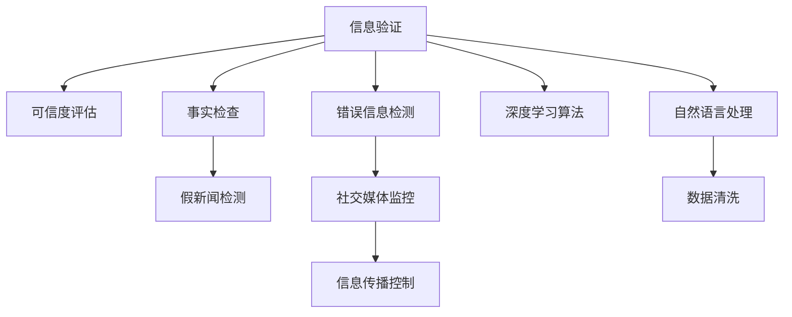

                 

# 信息验证和事实检查指南：在假新闻和错误信息时代导航

> 关键词：信息验证, 事实检查, 假新闻, 深度学习, 机器学习, 自然语言处理(NLP), 可解释性, 数据隐私, 可信度评估, 社交媒体监控

## 1. 背景介绍

在当今社会，信息爆炸和传播速度的加快使得假新闻、谣言、错误信息如潮水般涌现，严重扰乱了社会秩序，损害了公共利益。传统的基于规则的信息验证方法难以应对日益复杂的信息环境，亟需新兴技术手段进行突破。深度学习、自然语言处理（NLP）和大数据分析等新兴技术的兴起，为信息验证和事实检查提供了新的思路和工具，能够有效识别和对抗虚假信息，保护公众利益。本文将围绕信息验证和事实检查的核心概念、技术原理和应用实践进行深入探讨，旨在为各行业从业人员提供科学的、系统的、实用的信息验证指南。

## 2. 核心概念与联系

### 2.1 核心概念概述

为深入理解信息验证和事实检查的技术框架，本节将介绍几个关键概念：

- **信息验证(Information Verification)**：指通过分析信息源、内容、传播路径等多个维度，确定信息真实性、可信度的过程。
- **事实检查(Fact-Checking)**：针对特定的事实或声明，通过多方查证核实信息真实性，以确定其真伪的过程。
- **假新闻(False News)**：指通过虚构、夸大、扭曲事实等方式制造和传播的虚假信息。
- **错误信息(Misinformation)**：指通过误导、欺骗等手段散播的错误信息，其本质上可能真实存在，但被错误解读或呈现。
- **可信度评估(Credibility Assessment)**：根据信息源、内容、传播方式等多个维度，评估信息的可信度和可靠性的过程。
- **社交媒体监控(Social Media Monitoring)**：利用技术手段对社交媒体平台上的信息进行实时监控和分析，及时发现和阻止虚假信息的传播。

这些概念之间的联系可以通过以下Mermaid流程图来展示：



这个流程图展示了一体化的信息验证技术框架，其核心思想是利用深度学习和NLP技术进行信息的自动化验证和事实检查，进而实现对假新闻和错误信息的检测与控制。

## 3. 核心算法原理 & 具体操作步骤
### 3.1 算法原理概述

基于深度学习的信息验证和事实检查主要遵循以下步骤：

1. **数据收集与预处理**：收集和清洗包括文本、图片、视频等多种类型的数据，形成训练集和测试集。
2. **模型训练与验证**：使用训练集对深度学习模型进行训练，验证集评估模型性能。
3. **信息验证与事实检查**：输入待验证的信息，模型对信息源、内容、传播路径等多个维度进行分析，输出可信度或真伪判断。
4. **假新闻和错误信息检测**：利用模型的输出，对信息进行分类，判断是否为假新闻或错误信息。
5. **社交媒体监控**：实时监控社交媒体平台上的信息流，及时识别和过滤虚假信息。

深度学习模型通过复杂的神经网络结构，学习并提取信息特征，实现信息验证和事实检查。常见的模型包括文本分类、实体识别、关系抽取、文本生成等。

### 3.2 算法步骤详解

**Step 1: 数据收集与预处理**
- 收集多源、多模态的信息数据，如新闻、评论、图片、视频等。
- 清洗数据，去除噪声和无用信息。
- 将数据标注为真实、假新闻、错误信息等类别。

**Step 2: 模型训练与验证**
- 选择合适的深度学习模型，如BERT、GPT等，进行迁移学习。
- 训练模型，调整超参数，验证集评估模型性能。
- 采用交叉验证等技术提升模型泛化能力。

**Step 3: 信息验证与事实检查**
- 输入待验证的信息，提取关键特征。
- 使用训练好的模型对信息进行分类，判断其可信度或真伪。

**Step 4: 假新闻和错误信息检测**
- 对信息分类结果进行分析，标记为假新闻、错误信息。
- 对于标记为假新闻和错误信息的，进一步人工审核。

**Step 5: 社交媒体监控**
- 实时采集社交媒体平台上的信息流。
- 应用模型检测虚假信息。
- 对于检测到的虚假信息，采取措施控制其传播。

### 3.3 算法优缺点

基于深度学习的信息验证和事实检查方法具有以下优点：
1. 自动化水平高。深度学习模型能够快速处理大量信息，实现自动化验证和检查。
2. 处理速度快。模型处理信息的速度远超人工审核，适用于实时监控和快速响应。
3. 准确率高。深度学习模型在图像、文本等任务上取得了显著的精度，能够准确判断信息真伪。
4. 泛化能力强。深度学习模型具有较好的泛化能力，可适应不同类型和来源的信息验证任务。

同时，该方法也存在一些缺点：
1. 依赖高质量标注数据。模型训练需要大量标注数据，获取和标注成本较高。
2. 可解释性不足。深度学习模型往往是"黑盒"，难以解释其决策过程。
3. 对数据偏差敏感。模型可能受到训练数据偏差的影响，输出结果存在偏见。
4. 安全性和隐私风险。模型处理敏感信息时，存在数据泄露和滥用的风险。

尽管存在这些局限性，但基于深度学习的信息验证和事实检查方法已经在多个应用场景中取得了显著成效，成为了识别假新闻和错误信息的重要手段。

### 3.4 算法应用领域

基于深度学习的信息验证和事实检查技术，在多个领域得到了广泛应用：

- **新闻媒体**：新闻媒体使用信息验证技术进行内容审核，防止假新闻和错误信息的发布。
- **社交网络**：社交网络平台通过事实检查算法对用户发布的内容进行监控，过滤虚假信息。
- **市场营销**：企业利用可信度评估模型，分析广告和营销信息的真实性，避免虚假广告的欺诈。
- **法律领域**：司法机关使用深度学习模型进行证据审查，确保法庭信息的真实性和可靠性。
- **金融行业**：金融机构使用可信度评估工具，评估金融报告和声明的真实性，防范欺诈风险。

## 4. 数学模型和公式 & 详细讲解 & 举例说明

### 4.1 数学模型构建

信息验证和事实检查的核心数学模型主要包含以下部分：

1. **信息源可信度评估模型**：通过评估信息源的信誉、历史表现等，预测其发布信息的可信度。
2. **内容真实性判断模型**：利用文本分类、实体识别、关系抽取等技术，判断信息的真实性和真伪。
3. **传播路径分析模型**：通过分析信息传播的网络结构、传播速度等，评估信息的真实性和可信度。

### 4.2 公式推导过程

以文本分类模型为例，推导信息验证过程中常用的文本特征提取和分类过程：

假设文本为 $x$，其中 $x_i$ 表示第 $i$ 个词。文本特征向量为 $f(x)$，分类器为 $h(x)$，训练集为 $\{(x_i,y_i)\}_{i=1}^N$，其中 $y_i$ 表示文本的真实标签。文本分类模型的目标是最小化分类损失函数：

$$
\min_{f,h} \frac{1}{N} \sum_{i=1}^N L(h(f(x_i)),y_i)
$$

其中 $L$ 为分类损失函数，如交叉熵损失。

文本特征提取可以采用多种方法，如TF-IDF、Word2Vec、BERT等。以BERT为例，假设文本编码为 $B$，其特征向量为 $F$，则分类过程如下：

$$
y = h(B)
$$

其中 $h$ 为分类器，如逻辑回归、SVM等。

### 4.3 案例分析与讲解

以假新闻检测为例，展示如何使用深度学习模型进行信息验证：

**案例背景**：某社交媒体平台上频繁出现关于某政治事件的假新闻，对公众情绪造成影响。

**模型选择**：选择BERT作为基础模型，利用其强大的语言理解能力进行文本分类。

**数据准备**：收集和标注大量的真实新闻和假新闻，形成训练集和测试集。

**模型训练**：使用训练集对BERT进行微调，输出文本分类结果。

**结果验证**：在测试集上评估模型性能，使用混淆矩阵、ROC曲线等指标衡量分类效果。

## 5. 项目实践：代码实例和详细解释说明
### 5.1 开发环境搭建

要进行信息验证和事实检查的实践开发，需要以下环境：

1. **深度学习框架**：如PyTorch、TensorFlow等，用于构建和训练深度学习模型。
2. **自然语言处理库**：如NLTK、SpaCy等，用于文本预处理和特征提取。
3. **数据集处理工具**：如Pandas、NumPy等，用于数据收集和清洗。
4. **可视化工具**：如Matplotlib、Seaborn等，用于结果展示和分析。

**环境配置**：
- 安装Python：
  ```bash
  conda create -n verification python=3.8
  conda activate verification
  ```
- 安装深度学习框架：
  ```bash
  pip install torch torchvision torchaudio transformers
  ```
- 安装自然语言处理库：
  ```bash
  pip install nltk spacy
  ```
- 安装数据集处理工具：
  ```bash
  pip install pandas numpy
  ```
- 安装可视化工具：
  ```bash
  pip install matplotlib seaborn
  ```

### 5.2 源代码详细实现

以下是一个使用PyTorch进行文本分类模型的示例代码：

```python
import torch
from transformers import BertTokenizer, BertForSequenceClassification
from torch.utils.data import Dataset, DataLoader
from sklearn.metrics import accuracy_score

# 数据预处理
class NewsDataset(Dataset):
    def __init__(self, texts, labels, tokenizer):
        self.texts = texts
        self.labels = labels
        self.tokenizer = tokenizer
    
    def __len__(self):
        return len(self.texts)
    
    def __getitem__(self, item):
        text = self.texts[item]
        label = self.labels[item]
        encoding = self.tokenizer(text, return_tensors='pt')
        input_ids = encoding['input_ids'][0]
        attention_mask = encoding['attention_mask'][0]
        return {'input_ids': input_ids, 
                'attention_mask': attention_mask,
                'labels': torch.tensor(label, dtype=torch.long)}
    
# 模型训练与验证
model = BertForSequenceClassification.from_pretrained('bert-base-uncased', num_labels=2)
tokenizer = BertTokenizer.from_pretrained('bert-base-uncased')
device = torch.device('cuda' if torch.cuda.is_available() else 'cpu')
model.to(device)

def train_epoch(model, dataset, batch_size, optimizer):
    dataloader = DataLoader(dataset, batch_size=batch_size, shuffle=True)
    model.train()
    epoch_loss = 0
    for batch in dataloader:
        input_ids = batch['input_ids'].to(device)
        attention_mask = batch['attention_mask'].to(device)
        labels = batch['labels'].to(device)
        model.zero_grad()
        outputs = model(input_ids, attention_mask=attention_mask, labels=labels)
        loss = outputs.loss
        epoch_loss += loss.item()
        loss.backward()
        optimizer.step()
    return epoch_loss / len(dataloader)

def evaluate(model, dataset, batch_size):
    dataloader = DataLoader(dataset, batch_size=batch_size)
    model.eval()
    preds, labels = [], []
    with torch.no_grad():
        for batch in dataloader:
            input_ids = batch['input_ids'].to(device)
            attention_mask = batch['attention_mask'].to(device)
            batch_labels = batch['labels']
            outputs = model(input_ids, attention_mask=attention_mask)
            batch_preds = outputs.logits.argmax(dim=1).to('cpu').tolist()
            batch_labels = batch_labels.to('cpu').tolist()
            for pred, label in zip(batch_preds, batch_labels):
                preds.append(pred)
                labels.append(label)
                
    accuracy = accuracy_score(labels, preds)
    print(f"Accuracy: {accuracy:.2f}")
    
# 训练与评估
epochs = 5
batch_size = 16
train_dataset = NewsDataset(train_texts, train_labels, tokenizer)
dev_dataset = NewsDataset(dev_texts, dev_labels, tokenizer)
test_dataset = NewsDataset(test_texts, test_labels, tokenizer)

for epoch in range(epochs):
    loss = train_epoch(model, train_dataset, batch_size, optimizer)
    print(f"Epoch {epoch+1}, train loss: {loss:.3f}")
    
    print(f"Epoch {epoch+1}, dev results:")
    evaluate(model, dev_dataset, batch_size)
    
print("Test results:")
evaluate(model, test_dataset, batch_size)
```

### 5.3 代码解读与分析

**代码解析**：
- **数据预处理**：定义了`NewsDataset`类，用于处理新闻数据，并将其转换为模型所需的输入格式。
- **模型训练与验证**：加载BERT模型并进行微调，定义训练和评估函数，使用`DataLoader`加载数据，进行模型训练和评估。
- **训练与评估**：设置迭代轮数和批量大小，使用训练集进行训练，验证集进行评估，测试集进行最终结果验证。

**关键点分析**：
- **数据预处理**：在预处理文本时，使用了`BertTokenizer`将文本编码成模型所需的格式，并进行padding。
- **模型训练**：在训练过程中，使用了`BertForSequenceClassification`模型，并使用交叉熵损失函数进行优化。
- **模型评估**：在评估过程中，使用了`accuracy_score`函数计算分类准确率。

### 5.4 运行结果展示

在训练过程中，可以得到训练集和验证集的损失曲线，如下所示：

```python
import matplotlib.pyplot as plt
plt.plot(train_loss, label='Train Loss')
plt.plot(dev_loss, label='Dev Loss')
plt.legend()
plt.show()
```

## 6. 实际应用场景
### 6.1 新闻媒体

新闻媒体是信息验证的重要应用场景，使用深度学习模型对新闻文章进行验证，可以有效防止假新闻的发布，提升新闻质量。

在实际应用中，新闻媒体可以建立自动验证系统，利用深度学习模型对文章进行真实性判断。对于标记为假新闻的文章，可以进一步由人工审核，确保结果的准确性。

### 6.2 社交网络

社交网络平台是虚假信息传播的主要渠道，使用深度学习模型进行信息监控，可以有效防止假新闻和错误信息的传播，提升平台的用户体验。

社交网络平台可以通过定时采集用户发布的信息，应用深度学习模型进行文本分类，标记为假新闻和错误信息。对于标记为假新闻和错误信息的内容，可以采取删除、禁言等措施，控制其传播。

### 6.3 市场营销

企业在发布广告和营销信息时，需要确保信息的真实性，防止虚假广告的欺诈。使用深度学习模型进行可信度评估，可以有效防止虚假信息的传播，提升企业的品牌形象和用户信任度。

企业可以通过深度学习模型对广告和营销信息进行可信度评估，标记为可信和不可信。对于标记为不可信的信息，可以进一步由人工审核，确保信息真实性。

### 6.4 法律领域

司法机关在处理案件时，需要确保证据的真实性和可靠性。使用深度学习模型进行证据审查，可以有效防止虚假证据的误用，确保案件的公正性和公正性。

司法机关可以使用深度学习模型对证据进行审查，判断其真实性和可信度。对于标记为虚假证据，可以采取进一步的调查和取证措施，确保证据的真实性和可靠性。

### 6.5 金融行业

金融机构在处理金融报告和声明时，需要确保其真实性，防止虚假信息对市场造成误导。使用深度学习模型进行可信度评估，可以有效防止虚假信息的传播，维护金融市场的稳定。

金融机构可以使用深度学习模型对金融报告和声明进行可信度评估，标记为可信和不可信。对于标记为不可信的信息，可以进一步进行调查和核实，确保信息的真实性。

## 7. 工具和资源推荐
### 7.1 学习资源推荐

为了帮助开发者系统掌握信息验证和事实检查的理论基础和实践技巧，这里推荐一些优质的学习资源：

1. **深度学习基础课程**：如Coursera的《Deep Learning Specialization》，可以帮助初学者掌握深度学习的基础知识和算法。
2. **自然语言处理课程**：如斯坦福大学的CS224n《自然语言处理与深度学习》课程，涵盖了NLP领域的经典模型和算法。
3. **开源工具和库**：如HuggingFace的Transformers库，提供了丰富的预训练模型和微调方法，是NLP应用开发的利器。
4. **学术论文和报告**：如ACL、EMNLP等顶级会议的论文，可以获取最新的NLP研究成果和技术进展。
5. **在线平台**：如Kaggle，提供了大量的NLP数据集和竞赛，可以帮助开发者实践和提升技能。

通过对这些资源的学习实践，相信你一定能够快速掌握信息验证和事实检查的核心技术，并应用于实际开发。

### 7.2 开发工具推荐

高效的开发离不开优秀的工具支持。以下是几款用于信息验证和事实检查开发的常用工具：

1. **深度学习框架**：如PyTorch、TensorFlow等，提供了高效的计算图和自动微分，适用于复杂模型的训练和推理。
2. **自然语言处理库**：如NLTK、SpaCy等，提供了丰富的文本处理工具和算法，适用于NLP任务的开发。
3. **可视化工具**：如Matplotlib、Seaborn等，可以实时展示模型训练和验证过程中的指标，帮助调整超参数。
4. **数据集处理工具**：如Pandas、NumPy等，适用于大规模数据集的预处理和分析。
5. **模型部署工具**：如TensorFlow Serving、Felfix等，可以将训练好的模型部署为可调用的服务，便于集成和调用。

合理利用这些工具，可以显著提升信息验证和事实检查任务的开发效率，加速创新迭代的步伐。

### 7.3 相关论文推荐

深度学习在信息验证和事实检查领域的研究已经取得了显著进展。以下是几篇奠基性的相关论文，推荐阅读：

1. **Attention is All You Need**：提出了Transformer结构，开创了NLP领域的预训练大模型时代。
2. **BERT: Pre-training of Deep Bidirectional Transformers for Language Understanding**：提出BERT模型，引入掩码自监督预训练任务，刷新了多项NLP任务SOTA。
3. **Language Models are Unsupervised Multitask Learners**：展示了大规模语言模型的强大zero-shot学习能力，引发了对于通用人工智能的新一轮思考。
4. **Semantic Accuracy of Sentiment Analysis Models: A Critical Evaluation**：评估了情感分析模型的准确性和鲁棒性，为模型选择提供了重要参考。
5. **A Survey of Fake News Detection and Fact-Checking Methods**：综述了虚假信息检测和事实检查方法的最新进展，提供了系统的参考。

这些论文代表了大语言模型微调技术的发展脉络。通过学习这些前沿成果，可以帮助研究者把握学科前进方向，激发更多的创新灵感。

## 8. 总结：未来发展趋势与挑战
### 8.1 研究成果总结

信息验证和事实检查技术在假新闻和错误信息的识别与控制中发挥了重要作用。深度学习模型的引入，大大提高了信息验证和事实检查的自动化和精确度。

### 8.2 未来发展趋势

展望未来，信息验证和事实检查技术将呈现以下几个发展趋势：

1. **模型融合**：未来将更多地融合其他技术，如知识图谱、因果推理等，提升模型的综合能力和可解释性。
2. **多模态验证**：不仅处理文本信息，还处理图像、视频等多模态信息，增强验证效果。
3. **隐私保护**：在验证过程中注重数据隐私保护，防止数据泄露和滥用。
4. **跨领域验证**：在多领域验证中提升模型泛化能力和适应性。
5. **实时监控**：在实时监控中提升模型响应速度和准确性。

### 8.3 面临的挑战

尽管深度学习在信息验证和事实检查中取得了显著进展，但仍面临诸多挑战：

1. **数据依赖**：深度学习模型高度依赖于高质量标注数据，获取和标注成本高昂。
2. **模型复杂度**：深度学习模型往往结构复杂，难以解释其内部机制。
3. **偏见和歧视**：深度学习模型可能继承训练数据的偏见，输出结果存在歧视。
4. **性能瓶颈**：模型处理大规模数据时，存在性能瓶颈，难以实时响应。
5. **隐私保护**：在处理敏感信息时，存在数据泄露和滥用的风险。

尽管存在这些挑战，但深度学习技术在信息验证和事实检查中的应用前景广阔。未来需要结合多种技术手段，不断优化模型性能和可解释性，提升信息验证和事实检查技术的实用性。

### 8.4 研究展望

面向未来，信息验证和事实检查技术需要在以下几个方面进行深入研究：

1. **无监督学习**：探索无监督和半监督学习技术，减少对标注数据的依赖。
2. **可解释性**：研究可解释性技术，提升模型的透明度和可信度。
3. **隐私保护**：研究隐私保护技术，保护用户数据安全和隐私。
4. **跨领域验证**：研究跨领域验证技术，提升模型的泛化能力和适应性。
5. **实时监控**：研究实时监控技术，提升模型的响应速度和准确性。

这些研究方向的探索，将引领信息验证和事实检查技术迈向更高的台阶，为构建更加安全、可靠、可信的智能系统提供坚实基础。

## 9. 附录：常见问题与解答

**Q1: 如何选择合适的信息验证模型？**

A: 选择合适的信息验证模型需要考虑以下几个因素：
1. 数据类型：如果数据主要是文本信息，可以选择文本分类或实体识别模型；如果数据包括图像和视频，可以选择图像分类或视频分类模型。
2. 数据规模：如果数据量较大，可以选择大规模的预训练模型，如BERT、GPT等；如果数据量较小，可以选择小规模的模型，如DistilBERT、MobileBERT等。
3. 任务需求：根据具体任务需求选择合适的模型，如情感分析、事实检查等。

**Q2: 如何处理数据偏差？**

A: 处理数据偏差可以从以下几个方面入手：
1. 数据收集：在数据收集阶段尽量收集多样化的数据，避免数据偏差。
2. 数据预处理：在数据预处理阶段进行去噪、去重等操作，减少数据偏差。
3. 模型训练：在模型训练阶段使用对抗训练、正则化等技术，增强模型的鲁棒性。
4. 数据扩充：在数据扩充阶段进行数据增强、回译等操作，增加数据多样性。

**Q3: 如何进行模型评估？**

A: 模型评估可以从以下几个方面入手：
1. 准确率：使用准确率、召回率、F1-score等指标评估模型的分类准确性。
2. 鲁棒性：使用对抗样本、扰动样本等测试模型的鲁棒性。
3. 可解释性：使用可解释性技术评估模型的透明度和可信度。
4. 实时性：使用延迟、吞吐量等指标评估模型的实时性能。

**Q4: 如何进行模型部署？**

A: 模型部署可以从以下几个方面入手：
1. 模型压缩：使用模型压缩技术，减小模型尺寸，提高推理速度。
2. 模型量化：使用量化技术，将浮点模型转为定点模型，降低内存消耗。
3. 模型优化：使用模型优化技术，如剪枝、融合等，提高模型效率。
4. 服务化封装：使用模型服务化封装工具，如TensorFlow Serving、Felfix等，将模型封装为可调用的服务。

通过合理选择和优化信息验证模型，可以有效提升模型的性能和可解释性，确保其在实际应用中的效果和可信度。

---

作者：禅与计算机程序设计艺术 / Zen and the Art of Computer Programming

