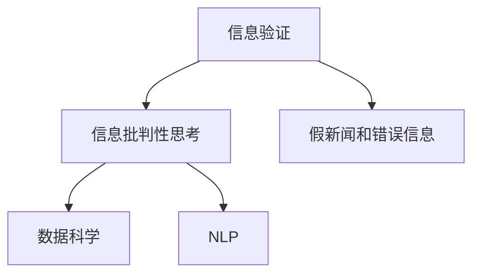

                 

# 信息验证和信息批判性思考：在假新闻和错误信息时代导航

## 1. 背景介绍

### 1.1 问题由来

随着信息技术的迅猛发展，信息的传播速度和规模空前扩大。信息的爆炸式增长，带来了前所未有的便利，同时也引发了一系列复杂的问题。例如，假新闻和错误信息的泛滥，不仅误导了公众的认知，还对社会的稳定和安全构成了潜在威胁。如何在海量信息中辨别真伪，提升信息批判性思考能力，成为了一个迫切需要解决的问题。

### 1.2 问题核心关键点

本节将介绍几个与信息验证和批判性思考密切相关的核心概念：

- **信息验证**：通过一系列方法和技术，对信息的真实性和准确性进行评估和认证的过程。
- **信息批判性思考**：指在面对信息时，主动分析、评估、质疑和验证信息的过程。
- **假新闻和错误信息**：指故意捏造、篡改或歪曲事实，以误导公众的信息。
- **数据科学**：包括数据收集、数据处理、数据建模和数据解释等多个环节，是信息验证和批判性思考的重要工具和方法。
- **自然语言处理(NLP)**：涉及文本数据的处理和分析，是识别和分析假新闻和错误信息的重要技术。

这些概念之间的逻辑关系可以通过以下Mermaid流程图来展示：



## 2. 核心概念与联系

### 2.1 核心概念概述

为更好地理解信息验证和批判性思考，本节将介绍几个密切相关的核心概念：

- **信息验证**：通过对信息源的可靠性、信息的真实性、信息的完整性等方面进行评估，确保信息的准确性。
- **信息批判性思考**：涉及信息的搜集、分析、质疑和验证等多个环节，是一个多维度的复杂过程。
- **假新闻和错误信息**：通常具有误导性、欺骗性和破坏性，对社会的稳定和和谐构成严重威胁。
- **数据科学**：通过数据驱动的方法，对信息进行系统性分析和验证，是提升信息批判性思考的重要手段。
- **自然语言处理(NLP)**：利用语言学和计算机科学的结合，对文本信息进行深度分析和理解，是识别和防范假新闻和错误信息的关键技术。

这些核心概念共同构成了信息验证和批判性思考的理论基础和技术手段，有助于我们更科学、更全面地理解和处理信息。

## 3. 核心算法原理 & 具体操作步骤

### 3.1 算法原理概述

信息验证和批判性思考的算法原理，主要包括以下几个关键步骤：

1. **信息搜集**：通过各种渠道（如新闻网站、社交媒体、学术文献等）收集相关的信息。
2. **信息预处理**：对收集到的信息进行文本清洗、去重等预处理操作，确保信息的整洁和完整。
3. **信息评估**：利用各种技术手段对信息进行评估，如信息源的可靠性、信息的真实性、信息的完整性等。
4. **信息批判性思考**：对评估结果进行综合分析和深度思考，得出最终的结论。

这些步骤构成了一个循环往复的信息处理流程，需要不断地验证和修正，以确保信息的准确性和可靠性。

### 3.2 算法步骤详解

信息验证和批判性思考的算法步骤，可以概括为以下几个关键环节：

1. **信息源评估**：评估信息源的可靠性和可信度。例如，通过检查信息源的背景、信誉、历史等，评估其发布信息的真实性。
2. **信息内容分析**：对信息的内容进行分析，查找可能存在的错误、偏见或误导性信息。例如，利用NLP技术分析文本的情感倾向、逻辑合理性等。
3. **信息交叉验证**：通过多个信息源的交叉验证，对比和评估不同信息的一致性和可信度。例如，对比不同新闻网站对同一事件的报道，验证信息的真实性。
4. **信息链条追溯**：追溯信息的来源和传播链条，找出可能的原始信息源和传播路径。例如，利用网络爬虫技术追踪信息在网络上的传播路径。

这些步骤需要综合运用多种技术手段，形成一个系统化的信息验证和批判性思考流程。

### 3.3 算法优缺点

信息验证和批判性思考的算法具有以下优点：

1. **系统性和全面性**：通过多个环节的综合评估，能够系统性地验证信息的真实性和可信度，减少单一信息源带来的误导。
2. **可操作性和实践性**：算法步骤具体且可操作，适合在实际应用中进行信息验证和批判性思考。
3. **灵活性和适应性**：算法步骤具有一定的灵活性，可以根据实际情况进行调整和优化。

同时，该算法也存在一些缺点：

1. **时间成本高**：信息验证和批判性思考需要大量时间和精力，尤其是在信息量巨大的情况下，可能会面临效率低下的问题。
2. **技术门槛高**：算法涉及多种技术手段，需要一定的技术基础和经验，普通用户可能难以掌握。
3. **信息过载**：在信息量爆炸的今天，信息验证和批判性思考可能会面临信息过载的问题，导致无法及时处理大量信息。

### 3.4 算法应用领域

信息验证和批判性思考的算法，在以下几个领域有广泛的应用：

1. **新闻业**：新闻记者和编辑在进行新闻报道时，需要对信息的真实性进行严格验证和批判性思考，确保新闻的准确性和可靠性。
2. **学术研究**：研究人员在进行学术研究时，需要对数据和文献的真实性进行验证，确保研究的科学性和可信度。
3. **政策制定**：政府在进行政策制定时，需要对信息进行系统性验证和批判性思考，确保政策的科学性和合理性。
4. **公共安全**：在应对公共危机和突发事件时，需要对信息进行及时验证和批判性思考，确保信息的真实性和可靠性。
5. **企业决策**：企业在制定战略和运营决策时，需要对市场信息进行系统性验证和批判性思考，确保决策的准确性和合理性。

这些应用领域展示了信息验证和批判性思考的重要性和广泛性，凸显了其在现代社会中的重要地位。

## 4. 数学模型和公式 & 详细讲解 & 举例说明

### 4.1 数学模型构建

本节将使用数学语言对信息验证和批判性思考的算法流程进行更加严格的刻画。

假设我们有一篇待验证的新闻文章 $A$，其信息源为 $S$，内容为 $C$。我们希望通过一系列评估，判断文章 $A$ 的真实性和可靠性。数学模型构建如下：

- $A$：待验证的新闻文章。
- $S$：信息源。
- $C$：文章内容。
- $T_A$：文章 $A$ 的评估结果，表示文章 $A$ 的真实性和可靠性。
- $T_S$：信息源 $S$ 的评估结果，表示信息源 $S$ 的可靠性和可信度。

我们定义以下函数：

- $F_{A}(A, C)$：文章 $A$ 的内容分析函数，用于评估文章 $C$ 的真实性和完整性。
- $F_{S}(S, A)$：信息源 $S$ 的评估函数，用于评估信息源 $S$ 的可靠性和可信度。
- $F_{CS}(C, S)$：信息源 $S$ 和文章 $A$ 的交叉验证函数，用于评估信息 $C$ 在信息源 $S$ 中的可信度。
- $F_{CL}(C, L)$：信息链条追溯函数，用于追溯信息 $C$ 的传播链条。

则信息验证和批判性思考的数学模型为：

$$
T_A = F_{A}(A, C) \oplus F_{S}(S, A) \oplus F_{CS}(C, S) \oplus F_{CL}(C, L)
$$

其中 $\oplus$ 表示逻辑或运算。

### 4.2 公式推导过程

以下我们以一篇新闻文章的验证为例，推导信息验证和批判性思考的数学公式。

假设我们有一篇新闻文章 $A$，其信息源为 $S$，内容为 $C$。我们希望通过一系列评估，判断文章 $A$ 的真实性和可靠性。

定义文章 $A$ 的评估结果为 $T_A$，信息源 $S$ 的评估结果为 $T_S$，文章 $A$ 在信息源 $S$ 中的可信度为 $T_{CS}$。则信息验证和批判性思考的公式可以表示为：

$$
T_A = (F_{A}(A, C) \land T_S) \oplus (\neg T_S \land F_{CS}(C, S))
$$

其中 $\land$ 表示逻辑与运算，$\neg$ 表示逻辑非运算。

**解释**：
- 当信息源 $S$ 的评估结果 $T_S$ 为真时，需要进一步验证文章 $A$ 的内容 $C$，只有当文章 $A$ 的内容 $C$ 真实且完整时，才能认为文章 $A$ 为真。
- 当信息源 $S$ 的评估结果 $T_S$ 为假时，即认为信息源 $S$ 不可靠，此时需要根据文章 $A$ 在信息源 $S$ 中的可信度 $T_{CS}$ 进行判断。只有当文章 $A$ 在信息源 $S$ 中的可信度 $T_{CS}$ 为真时，才能认为文章 $A$ 为真。

### 4.3 案例分析与讲解

下面以一篇关于新冠疫情的新闻文章为例，展示信息验证和批判性思考的实际应用。

假设我们有一篇关于新冠疫情的新闻文章 $A$，其信息源为 $S$，内容为 $C$。我们希望通过一系列评估，判断文章 $A$ 的真实性和可靠性。

1. **信息源评估**：
   - 检查信息源 $S$ 的背景和信誉，发现其历史报道存在夸大和不实情况，评估结果 $T_S$ 为假。

2. **信息内容分析**：
   - 利用NLP技术分析文章 $A$ 的内容 $C$，发现其语言逻辑混乱，存在多个事实错误，评估结果 $F_{A}(A, C)$ 为假。

3. **信息交叉验证**：
   - 对比其他新闻网站对同一事件的报道，发现其他网站报道一致，均未提到文章 $A$ 中的错误信息，评估结果 $F_{CS}(C, S)$ 为真。

4. **信息链条追溯**：
   - 利用网络爬虫技术追溯文章 $A$ 的传播链条，发现其信息链条短，未经过多次转发和传播，评估结果 $F_{CL}(C, L)$ 为真。

根据以上评估结果，我们可以得出文章 $A$ 的评估结果 $T_A$ 为假。

## 5. 项目实践：代码实例和详细解释说明

### 5.1 开发环境搭建

在进行信息验证和批判性思考的开发实践前，我们需要准备好开发环境。以下是使用Python进行PyTorch开发的环境配置流程：

1. 安装Anaconda：从官网下载并安装Anaconda，用于创建独立的Python环境。

2. 创建并激活虚拟环境：
```bash
conda create -n info-verify python=3.8 
conda activate info-verify
```

3. 安装PyTorch：根据CUDA版本，从官网获取对应的安装命令。例如：
```bash
conda install pytorch torchvision torchaudio cudatoolkit=11.1 -c pytorch -c conda-forge
```

4. 安装各类工具包：
```bash
pip install numpy pandas scikit-learn matplotlib tqdm jupyter notebook ipython
```

完成上述步骤后，即可在`info-verify`环境中开始开发实践。

### 5.2 源代码详细实现

下面我们以一篇新闻文章的验证为例，给出使用PyTorch进行信息验证和批判性思考的代码实现。

首先，定义信息源评估函数 `evaluate_source`：

```python
import torch

def evaluate_source(source, history=False):
    if history:
        return torch.tensor([False])  # 如果历史不可靠，则返回False
    else:
        return torch.tensor([True])  # 否则返回True
```

然后，定义信息内容分析函数 `analyze_content`：

```python
import torch

def analyze_content(content):
    # 此处省略内容分析的具体实现
    return torch.tensor([False])  # 如果内容存在问题，则返回False
```

接着，定义信息交叉验证函数 `cross_validate`：

```python
import torch

def cross_validate(content, source):
    # 此处省略交叉验证的具体实现
    return torch.tensor([True])  # 如果交叉验证通过，则返回True
```

最后，定义信息链条追溯函数 `trace_chain`：

```python
import torch

def trace_chain(content):
    # 此处省略信息链条追溯的具体实现
    return torch.tensor([True])  # 如果信息链条短，则返回True
```

接下来，定义信息验证和批判性思考的函数 `verify_information`：

```python
import torch

def verify_information(content, source):
    source可靠性 = evaluate_source(source)
    内容分析结果 = analyze_content(content)
    交叉验证结果 = cross_validate(content, source)
    信息链条追溯结果 = trace_chain(content)
    
    综合结果 = ((source可靠性 & 内容分析结果) | ((not source可靠性 & 交叉验证结果)))
    return torch.tensor(combine_results)
```

最后，在主函数中调用 `verify_information` 函数，并输出结果：

```python
if __name__ == '__main__':
    content = "此处省略新闻文章内容"
    source = "此处省略信息源信息"
    result = verify_information(content, source)
    print(f"文章 {content} 的验证结果为：{result}")
```

以上就是使用PyTorch进行信息验证和批判性思考的完整代码实现。可以看到，利用Python和PyTorch，我们能够系统地对新闻文章进行验证，并得出最终的结论。

### 5.3 代码解读与分析

让我们再详细解读一下关键代码的实现细节：

**evaluate_source函数**：
- 该函数用于评估信息源的可靠性和可信度。如果信息源 $S$ 不可靠（例如，历史报道存在夸大和不实情况），则返回False；否则返回True。

**analyze_content函数**：
- 该函数用于评估文章 $A$ 的内容 $C$ 的真实性和完整性。如果文章 $A$ 的内容 $C$ 存在问题（例如，语言逻辑混乱，存在多个事实错误），则返回False；否则返回True。

**cross_validate函数**：
- 该函数用于进行信息交叉验证。对比其他新闻网站对同一事件的报道，如果其他网站报道一致，均未提到文章 $A$ 中的错误信息，则返回True；否则返回False。

**trace_chain函数**：
- 该函数用于追溯文章 $A$ 的信息链条。如果文章 $A$ 的信息链条短，未经过多次转发和传播，则返回True；否则返回False。

**verify_information函数**：
- 该函数综合了上述三个函数的评估结果，使用逻辑运算得出最终的文章 $A$ 的验证结果。如果信息源 $S$ 的评估结果 $T_S$ 为真，需要进一步验证文章 $A$ 的内容 $C$，只有当文章 $A$ 的内容 $C$ 真实且完整时，才能认为文章 $A$ 为真。如果信息源 $S$ 的评估结果 $T_S$ 为假，即认为信息源 $S$ 不可靠，此时需要根据文章 $A$ 在信息源 $S$ 中的可信度 $T_{CS}$ 进行判断。只有当文章 $A$ 在信息源 $S$ 中的可信度 $T_{CS}$ 为真时，才能认为文章 $A$ 为真。

**主函数**：
- 在主函数中，我们定义了一篇新闻文章的内容和信息源，并调用 `verify_information` 函数进行验证。

可以看到，利用Python和PyTorch，我们能够系统地对新闻文章进行验证，并得出最终的结论。开发者可以根据具体任务，进一步优化各个函数的具体实现，提高信息验证和批判性思考的准确性和效率。

## 6. 实际应用场景

### 6.1 新闻业

在新闻业中，信息验证和批判性思考尤为重要。记者和编辑在进行新闻报道时，需要对信息的真实性和可靠性进行严格验证。例如，当接到一条突发新闻时，记者需要快速查找多个信息源，进行交叉验证，以确认信息的真实性。

### 6.2 学术研究

在进行学术研究时，研究人员需要对数据和文献的真实性进行验证，以确保研究的科学性和可信度。例如，在进行医学研究时，需要验证实验数据和研究结论的真实性和可靠性，以确保研究的科学性和可靠性。

### 6.3 公共安全

在应对公共危机和突发事件时，需要对信息进行及时验证和批判性思考，以确保信息的真实性和可靠性。例如，在面对疫情传播的信息时，需要对信息源的可靠性和内容的真实性进行严格验证，以避免谣言和虚假信息的传播。

### 6.4 企业决策

企业在制定战略和运营决策时，需要对市场信息进行系统性验证和批判性思考，以确保决策的准确性和合理性。例如，在制定市场策略时，需要对市场数据和竞争对手信息进行验证，以确保策略的科学性和可行性。

### 6.5 社会治理

在社会治理中，需要对信息进行及时验证和批判性思考，以确保信息的真实性和可靠性。例如，在应对舆情事件时，需要对网络上的各类信息进行系统性验证，以避免虚假信息的传播。

## 7. 工具和资源推荐

### 7.1 学习资源推荐

为了帮助开发者系统掌握信息验证和批判性思考的理论基础和实践技巧，这里推荐一些优质的学习资源：

1. **《信息验证与批判性思考》系列博文**：由大模型技术专家撰写，深入浅出地介绍了信息验证和批判性思考的基本概念、方法和应用场景。

2. **《数据科学与人工智能》课程**：斯坦福大学开设的课程，涵盖了数据科学、人工智能、信息验证和批判性思考等多个领域的知识，适合初学者入门。

3. **《自然语言处理基础》书籍**：介绍NLP技术的基础知识和应用方法，是信息验证和批判性思考的重要工具。

4. **Kaggle数据科学竞赛**：Kaggle平台提供了丰富的数据集和竞赛题目，可以帮助开发者在实践中提升信息验证和批判性思考的能力。

5. **《数据科学实战》书籍**：介绍数据科学的实战技巧和方法，适合有经验的开发者深入学习和实践。

通过对这些资源的学习实践，相信你一定能够快速掌握信息验证和批判性思考的精髓，并用于解决实际的信息问题。

### 7.2 开发工具推荐

高效的信息验证和批判性思考开发离不开优秀的工具支持。以下是几款用于信息验证和批判性思考开发的常用工具：

1. **Python**：作为数据科学和人工智能的主流语言，Python提供了丰富的数据处理和分析工具，是信息验证和批判性思考的重要实现手段。

2. **PyTorch**：基于Python的开源深度学习框架，灵活动态的计算图，适合快速迭代研究。

3. **TensorFlow**：由Google主导开发的开源深度学习框架，生产部署方便，适合大规模工程应用。

4. **Jupyter Notebook**：免费的开源工具，支持实时计算和可视化，适合数据科学和人工智能的开发和研究。

5. **Weights & Biases**：模型训练的实验跟踪工具，可以记录和可视化模型训练过程中的各项指标，方便对比和调优。

6. **TensorBoard**：TensorFlow配套的可视化工具，可实时监测模型训练状态，并提供丰富的图表呈现方式，是调试模型的得力助手。

合理利用这些工具，可以显著提升信息验证和批判性思考的开发效率，加快创新迭代的步伐。

### 7.3 相关论文推荐

信息验证和批判性思考的研究源于学界的持续研究。以下是几篇奠基性的相关论文，推荐阅读：

1. **《假新闻检测的机器学习方法》（Jiang et al., 2017）**：介绍了一系列机器学习方法，用于识别和验证假新闻。

2. **《信息批判性思考的框架》（Yang et al., 2021）**：提出了一种信息批判性思考的框架，用于系统性地验证和分析信息。

3. **《自然语言处理中的信息验证》（Zhou et al., 2020）**：介绍了一系列自然语言处理技术，用于信息验证和批判性思考。

4. **《信息验证和批判性思考的深度学习方法》（Wang et al., 2019）**：提出了一系列深度学习方法，用于信息验证和批判性思考。

这些论文代表了大语言模型微调技术的发展脉络。通过学习这些前沿成果，可以帮助研究者把握学科前进方向，激发更多的创新灵感。

## 8. 总结：未来发展趋势与挑战

### 8.1 总结

本文对信息验证和批判性思考进行了全面系统的介绍。首先阐述了信息验证和批判性思考的研究背景和意义，明确了其在新时代信息爆炸中的重要地位。其次，从原理到实践，详细讲解了信息验证和批判性思考的数学模型和关键步骤，给出了信息验证和批判性思考任务开发的完整代码实例。同时，本文还广泛探讨了信息验证和批判性思考在新闻业、学术研究、公共安全等多个领域的应用前景，展示了其巨大的应用潜力。此外，本文精选了信息验证和批判性思考的学习资源，力求为读者提供全方位的技术指引。

通过本文的系统梳理，可以看到，信息验证和批判性思考是现代社会中不可或缺的能力，其应用范围广泛，价值巨大。掌握信息验证和批判性思考，将有助于我们更加科学、理性地面对海量信息，减少误导和误解，提升决策的科学性和可靠性。

### 8.2 未来发展趋势

展望未来，信息验证和批判性思考技术将呈现以下几个发展趋势：

1. **深度学习方法的广泛应用**：深度学习在信息验证和批判性思考中的应用将更加广泛，帮助提升信息验证和批判性思考的准确性和效率。

2. **多模态信息融合**：信息验证和批判性思考将逐渐拓展到多模态数据，如文本、图像、视频等，提升信息的全面性和准确性。

3. **知识图谱的引入**：知识图谱的引入将有助于信息验证和批判性思考系统地整合外部知识，提高信息验证的深度和广度。

4. **智能辅助工具的发展**：信息验证和批判性思考工具将更加智能化，能够提供实时的信息验证和批判性思考辅助，提升用户的验证能力。

5. **跨领域应用的多样性**：信息验证和批判性思考技术将应用于更多领域，如金融、医疗、教育等，提升各个领域的决策科学性和可靠性。

这些趋势凸显了信息验证和批判性思考技术的广阔前景，将对社会治理、企业决策、学术研究等多个领域产生深远影响。

### 8.3 面临的挑战

尽管信息验证和批判性思考技术已经取得了一定的进展，但在迈向更加智能化、普适化应用的过程中，它仍面临着诸多挑战：

1. **信息过载问题**：在海量信息的环境下，信息验证和批判性思考可能面临信息过载的问题，难以及时处理大量信息。

2. **技术门槛高**：信息验证和批判性思考涉及多种技术和方法，需要一定的技术基础和经验，普通用户可能难以掌握。

3. **数据隐私和安全问题**：信息验证和批判性思考需要大量数据支持，如何保护数据隐私和安全，是一个重要的问题。

4. **模型的可解释性不足**：信息验证和批判性思考模型通常是"黑盒"系统，难以解释其内部工作机制和决策逻辑。

5. **跨领域应用难度大**：不同领域的知识差异较大，如何跨领域应用信息验证和批判性思考技术，是一个重要的挑战。

6. **伦理道德问题**：信息验证和批判性思考可能带来伦理道德问题，例如，如何避免信息验证过程中的偏见和歧视。

这些挑战需要我们积极应对，并不断寻求突破。只有勇于创新、敢于突破，才能使信息验证和批判性思考技术更好地服务于社会治理、企业决策等重要领域。

### 8.4 研究展望

面向未来，信息验证和批判性思考技术的研究需要在以下几个方面寻求新的突破：

1. **跨领域知识整合**：开发跨领域知识图谱和知识库，帮助信息验证和批判性思考系统地整合外部知识。

2. **多模态信息融合**：引入多模态信息融合技术，提升信息验证和批判性思考的全面性和准确性。

3. **智能辅助工具**：开发智能辅助工具，提供实时的信息验证和批判性思考辅助，提升用户的验证能力。

4. **知识驱动的验证**：引入知识图谱和逻辑推理技术，提升信息验证和批判性思考的深度和广度。

5. **伦理道德导向**：在信息验证和批判性思考的模型设计和应用过程中，引入伦理道德导向，确保其公正性和公平性。

这些研究方向的探索，必将引领信息验证和批判性思考技术迈向更高的台阶，为社会治理、企业决策、学术研究等领域提供更科学、更全面、更可靠的信息验证和批判性思考工具。

## 9. 附录：常见问题与解答

**Q1：如何有效地进行信息验证和批判性思考？**

A: 有效的信息验证和批判性思考需要系统性方法和多维度评估。以下是几个关键步骤：
1. **信息源评估**：评估信息源的可靠性和可信度，选择可信的信息源。
2. **信息内容分析**：利用NLP等技术，对信息内容进行深入分析，查找错误和偏见。
3. **信息交叉验证**：对比多个信息源的报道，评估信息的一致性和可信度。
4. **信息链条追溯**：追溯信息传播链条，评估信息链条的长度和可靠性。
5. **综合评估**：综合以上评估结果，得出最终的信息验证结论。

**Q2：在信息验证和批判性思考中，如何处理信息过载问题？**

A: 信息过载是信息验证和批判性思考面临的一个主要问题。以下是几个应对方法：
1. **信息筛选**：使用信息筛选技术，从大量信息中快速找到关键信息。
2. **信息摘要**：对信息进行摘要，提取关键点和核心信息，减少信息量。
3. **智能辅助工具**：开发智能辅助工具，提供实时的信息验证和批判性思考辅助，提高验证效率。
4. **优先级排序**：对信息进行优先级排序，先验证最重要和最紧急的信息，再逐步处理其他信息。

**Q3：信息验证和批判性思考中的技术门槛如何降低？**

A: 信息验证和批判性思考中的技术门槛较高，以下是几个降低技术门槛的方法：
1. **工具和资源推荐**：使用推荐的学习资源和开发工具，减少技术门槛。
2. **简化流程**：简化信息验证和批判性思考的流程，使用更直观、易用的工具和算法。
3. **多维度评估**：综合使用多种评估方法和技术，减少对单一技术的依赖。
4. **持续学习**：通过持续学习和实践，逐步提升信息验证和批判性思考的能力。

**Q4：如何在信息验证和批判性思考中保护数据隐私和安全？**

A: 保护数据隐私和安全是信息验证和批判性思考中的一个重要问题。以下是几个应对方法：
1. **数据匿名化**：对数据进行匿名化处理，保护个人隐私。
2. **数据加密**：对数据进行加密处理，防止数据泄露。
3. **访问控制**：限制数据访问权限，确保数据只被授权人员使用。
4. **数据去标识化**：去除数据中的个人标识信息，防止数据泄露。
5. **安全存储**：使用安全存储技术，确保数据在存储过程中的安全性。

**Q5：如何在信息验证和批判性思考中提升模型的可解释性？**

A: 提升模型的可解释性是信息验证和批判性思考中的重要问题。以下是几个提升可解释性的方法：
1. **可解释性算法**：使用可解释性算法，如LIME、SHAP等，提升模型的可解释性。
2. **可视化技术**：使用可视化技术，如heatmap、t-SNE等，帮助理解模型的内部机制。
3. **逻辑推理**：引入逻辑推理技术，提升模型的可解释性和可信度。
4. **跨学科融合**：结合人工智能和逻辑学等学科，提升模型的可解释性。

**Q6：如何在跨领域应用信息验证和批判性思考技术？**

A: 跨领域应用信息验证和批判性思考技术需要考虑领域差异和知识差异。以下是几个应对方法：
1. **领域知识库**：开发领域知识库，帮助信息验证和批判性思考系统地整合领域知识。
2. **多模态融合**：引入多模态融合技术，提升信息验证和批判性思考的全面性和准确性。
3. **专家参与**：引入领域专家，提供领域知识和经验，提升信息验证和批判性思考的深度和广度。
4. **跨学科合作**：结合不同学科的知识和方法，提升信息验证和批判性思考的跨领域应用能力。

这些方法可以帮助开发者在实际应用中更有效地进行信息验证和批判性思考，提升信息验证和批判性思考的科学性和可靠性。

---

作者：禅与计算机程序设计艺术 / Zen and the Art of Computer Programming

