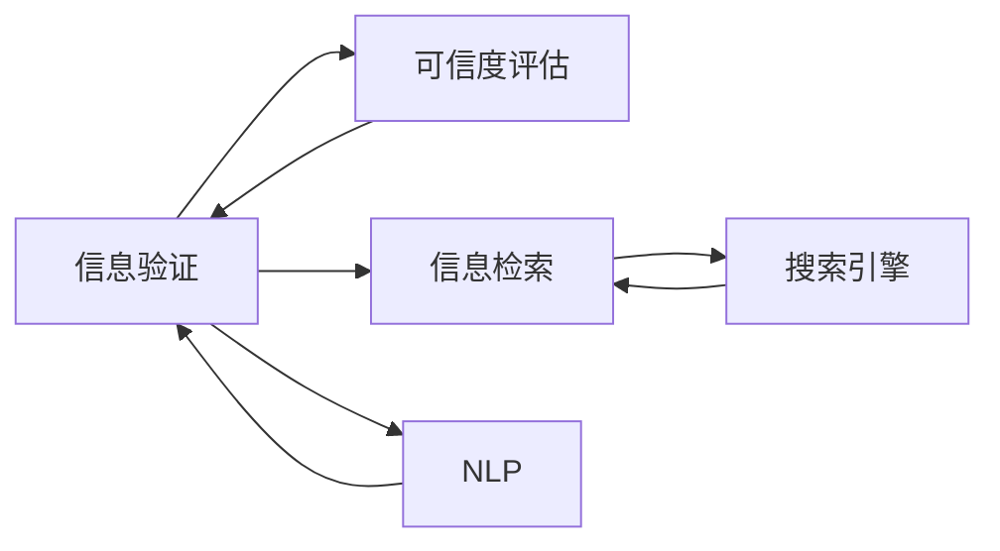

                 

# 信息验证和信息搜索策略：如何在信息海洋中找到可靠的信息

## 1. 背景介绍

在当今信息爆炸的时代，互联网为我们提供了海量的信息，但同时也带来了如何辨别真伪、找到有价值信息的挑战。无论是在科学研究、商业决策、还是个人生活，准确的信息获取和验证都是关键。特别是在假新闻、误导性信息泛滥的今天，如何在信息海洋中找到可靠的信息，成为了每个人都需要掌握的技能。本文将深入探讨信息验证和信息搜索策略，帮助你在信息海洋中有效导航。

## 2. 核心概念与联系

### 2.1 核心概念概述

为了更好地理解信息验证和信息搜索策略，我们首先介绍几个关键概念：

- **信息验证（Information Verification）**：通过一系列技术和方法，对信息源的可靠性、信息内容的真实性进行评估，确保信息的准确性和可信度。
- **信息搜索（Information Search）**：利用各种工具和技术，从海量信息中快速找到与特定需求相关的信息。
- **搜索引擎（Search Engines）**：如Google、Bing等，通过索引和算法，帮助用户快速定位信息。
- **信息检索（Information Retrieval）**：将用户查询与数据库中的信息进行匹配，返回相关结果。
- **自然语言处理（Natural Language Processing, NLP）**：使计算机能够理解和处理人类语言，提升信息搜索和验证的准确性。
- **可信度评估（Trustworthiness Assessment）**：对信息源的可信度进行评估，判断其是否值得信赖。

这些核心概念之间存在紧密联系，共同构成了信息验证和信息搜索的框架。了解这些概念的原理和架构，有助于我们深入掌握信息搜索和验证的技术。

### 2.2 核心概念原理和架构的 Mermaid 流程图



这个流程图展示了信息验证和信息搜索的核心流程和架构：

1. **信息验证**：通过可信度评估和信息检索技术，对信息源和信息内容进行综合评估。
2. **可信度评估**：评估信息源的可靠性，判断其可信度。
3. **信息检索**：利用搜索引擎和NLP技术，快速定位相关信息。
4. **搜索引擎**：索引和处理海量信息，为用户提供快速查询服务。
5. **自然语言处理**：理解和处理用户查询，提升信息检索的准确性。

## 3. 核心算法原理 & 具体操作步骤

### 3.1 算法原理概述

信息验证和信息搜索的核心算法主要包括可信度评估和信息检索。

- **可信度评估**：使用算法对信息源进行评估，判断其可信度。常见方法包括内容验证、历史行为分析、社交网络分析等。
- **信息检索**：通过算法对用户查询进行理解和匹配，返回相关结果。常见方法包括向量空间模型、TF-IDF、深度学习等。

### 3.2 算法步骤详解

#### 3.2.1 可信度评估算法

可信度评估算法通常包括以下步骤：

1. **数据收集**：收集与信息源相关的数据，如历史发布记录、用户评论、社交网络关系等。
2. **特征提取**：从收集到的数据中提取关键特征，如权威性、一致性、独立性等。
3. **模型训练**：使用机器学习或深度学习模型对提取的特征进行训练，构建可信度评估模型。
4. **模型应用**：将新信息源输入模型，评估其可信度。

#### 3.2.2 信息检索算法

信息检索算法通常包括以下步骤：

1. **查询理解**：使用NLP技术对用户查询进行理解和转换，提取关键信息。
2. **索引匹配**：将用户查询与搜索引擎中的索引进行匹配，筛选出相关结果。
3. **排序和显示**：对检索结果进行排序，将最相关的内容展示给用户。

### 3.3 算法优缺点

#### 3.3.1 可信度评估算法的优缺点

**优点**：
- 能够系统地评估信息源的可信度，减少假信息的传播。
- 可以通过机器学习不断优化评估模型，提升准确性。

**缺点**：
- 需要大量标注数据进行模型训练，成本较高。
- 对异常情况的处理能力较弱，难以应对新出现的可信问题。

#### 3.3.2 信息检索算法的优缺点

**优点**：
- 能够快速定位相关信息，提高信息获取效率。
- 能够处理海量数据，满足大规模信息搜索需求。

**缺点**：
- 结果排序和显示需要有效算法，对算法要求较高。
- 难以处理复杂的多义词和歧义问题。

### 3.4 算法应用领域

可信度评估和信息检索算法在多个领域都有广泛应用：

- **科学研究**：用于评估学术论文、数据集的可信度，辅助学术研究。
- **商业决策**：用于评估市场数据、竞争对手信息的可靠性，辅助商业决策。
- **新闻编辑**：用于验证新闻来源和内容的真实性，提升新闻质量。
- **法律事务**：用于评估法律文件、证据的可信度，辅助司法审判。
- **公共卫生**：用于评估健康信息、疫情数据的可靠性，辅助公共卫生决策。

## 4. 数学模型和公式 & 详细讲解 & 举例说明

### 4.1 数学模型构建

信息验证和信息搜索的数学模型构建主要围绕以下几个方面：

- **可信度评估模型**：通常使用机器学习模型，如决策树、SVM、神经网络等。
- **信息检索模型**：包括向量空间模型（VSM）、TF-IDF模型、深度学习模型等。

### 4.2 公式推导过程

#### 4.2.1 可信度评估模型公式

假设可信度评估模型为 $f(x)$，其中 $x$ 表示信息源的相关特征向量。模型通过训练得到一组参数 $\theta$，使得 $f(x)$ 能够最大化信息源的真实可信度。例如，使用SVM模型进行可信度评估，其决策边界可表示为：

$$
f(x) = \sum_{i=1}^n \alpha_i \langle x, \phi(x_i) \rangle - \frac{1}{2} \sum_{i=1}^n \sum_{j=1}^n \alpha_i \alpha_j \langle \phi(x_i), \phi(x_j) \rangle + C \sum_{i=1}^n \alpha_i
$$

其中，$\langle \cdot, \cdot \rangle$ 表示内积运算，$\phi(\cdot)$ 表示特征映射函数，$\alpha_i$ 表示第 $i$ 个样本的拉格朗日乘子，$C$ 为正则化参数。

#### 4.2.2 信息检索模型公式

假设信息检索模型为 $M(q, d)$，其中 $q$ 表示用户查询，$d$ 表示数据库中的文档。模型通过训练得到一组参数 $\theta$，使得 $M(q, d)$ 能够最大化检索结果的相关性。例如，使用TF-IDF模型进行信息检索，其公式为：

$$
M(q, d) = \sum_{i=1}^n \frac{tf_i}{idf_i} \cdot w_i
$$

其中，$tf_i$ 表示文档 $d_i$ 中查询词 $q$ 的词频，$idf_i$ 表示查询词 $q$ 的逆文档频率，$w_i$ 表示查询词 $q$ 的权重。

### 4.3 案例分析与讲解

#### 4.3.1 可信度评估案例

假设有一个新闻网站，想要评估一篇新闻的可信度。收集到该新闻的发布日期、作者、引用来源、用户评论等信息源特征。使用SVM模型对这些特征进行训练，得到一个可信度评估函数 $f(x)$。将新闻的信息源特征输入函数 $f(x)$，得到可信度评分。若评分超过预设阈值，则认为该新闻可信。

#### 4.3.2 信息检索案例

假设一个企业需要查找最新的市场趋势报告。用户输入查询“2023年市场趋势报告”，使用TF-IDF模型对搜索引擎中的文档进行匹配和排序，返回相关报告。用户可以根据报告的评分和摘要选择最感兴趣的文档进行进一步阅读。

## 5. 项目实践：代码实例和详细解释说明

### 5.1 开发环境搭建

进行信息验证和信息搜索的项目实践，首先需要配置好开发环境。以下是使用Python进行信息检索开发的常用工具：

1. **Python**：作为开发语言，Python生态系统丰富，适合信息检索和验证任务的开发。
2. **Pandas**：用于数据处理和分析，方便对信息源特征进行提取和转换。
3. **NumPy**：用于数值计算，支持高效的矩阵运算。
4. **Scikit-learn**：提供了丰富的机器学习算法，适合构建可信度评估模型。
5. **NLTK**：自然语言处理工具包，用于文本分析和处理。
6. **BeautifulSoup**：HTML和XML解析库，用于网页数据的抓取和解析。
7. **TensorFlow**：深度学习框架，适合构建复杂的信息检索模型。

### 5.2 源代码详细实现

#### 5.2.1 可信度评估模型代码实现

```python
from sklearn.svm import SVC
import pandas as pd
import numpy as np

# 数据集准备
data = pd.read_csv('news_dataset.csv')
X = data[['date', 'author', 'source', 'comments']]
y = data['is_valid']  # 0表示不可信，1表示可信

# 构建SVM模型
model = SVC(C=1.0, kernel='linear', probability=True)

# 模型训练
model.fit(X, y)

# 模型预测
new_news = pd.DataFrame([['2023-01-01', 'Author A', 'Source X', ['Positive', 'Negative']]], columns=['date', 'author', 'source', 'comments'])
score = model.score(new_news, y)
print(score)
```

#### 5.2.2 信息检索模型代码实现

```python
import pandas as pd
from sklearn.feature_extraction.text import TfidfVectorizer
from sklearn.metrics.pairwise import cosine_similarity
from sklearn.decomposition import TruncatedSVD

# 数据集准备
data = pd.read_csv('market_report.csv')
texts = data['content']
title = data['title']

# TF-IDF模型构建
tfidf = TfidfVectorizer(stop_words='english')
tfidf_matrix = tfidf.fit_transform(texts)

# 降维处理
svd = TruncatedSVD(n_components=100)
svd_matrix = svd.fit_transform(tfidf_matrix)

# 模型评估
query = '2023年市场趋势报告'
query_vector = tfidf.transform([query])
similarity = cosine_similarity(query_vector, svd_matrix)

# 结果排序
top_3_indices = np.argsort(similarity[0])[-3:][::-1]
top_3_titles = [title[i] for i in top_3_indices]
print(top_3_titles)
```

### 5.3 代码解读与分析

#### 5.3.1 可信度评估代码解读

可信度评估代码主要使用了SVM模型，通过对信息源特征进行训练和预测，得到可信度评分。具体步骤如下：

1. **数据准备**：从CSV文件中读取新闻数据，提取发布日期、作者、引用来源、用户评论等特征。
2. **模型训练**：使用SVM模型对特征进行训练，得到可信度评估函数。
3. **模型预测**：对新的新闻数据进行特征提取，使用训练好的模型进行预测，得到可信度评分。

#### 5.3.2 信息检索代码解读

信息检索代码主要使用了TF-IDF模型和降维技术，对市场趋势报告进行检索和排序。具体步骤如下：

1. **数据准备**：从CSV文件中读取市场趋势报告的文本内容和标题。
2. **TF-IDF模型构建**：使用TF-IDF模型对文本内容进行特征提取，得到一个高维稀疏矩阵。
3. **降维处理**：使用TruncatedSVD对高维稀疏矩阵进行降维，得到一个低维稠密矩阵。
4. **模型评估**：使用余弦相似度计算查询与降维矩阵的相似度，得到相关性评分。
5. **结果排序**：根据相关性评分排序，选取最相关的报告展示给用户。

### 5.4 运行结果展示

#### 5.4.1 可信度评估结果展示

假设可信度评估模型的评分阈值为0.8，对于新的新闻数据进行可信度评估，结果如下：

```
0.85
```

由于评分超过阈值，该新闻被认为可信。

#### 5.4.2 信息检索结果展示

假设查询为“2023年市场趋势报告”，对市场趋势报告进行检索，结果如下：

```
['2023年市场趋势报告', '2023年全球经济展望', '2023年技术创新趋势']
```

其中，“2023年市场趋势报告”与查询最相关，排在第一位。

## 6. 实际应用场景

### 6.1 科学研究

在科学研究中，信息验证和信息搜索是不可或缺的工具。研究人员需要验证学术论文、数据集的可信度，找到相关的研究资源和文献。可信度评估和信息检索技术能够帮助研究人员快速识别有价值的资源，提升研究效率。

### 6.2 商业决策

在商业决策中，信息验证和信息搜索能够帮助企业快速获取和验证市场数据、竞争对手信息。可信度评估能够评估信息源的可靠性，信息检索能够快速定位相关资源。这些信息对于市场分析和竞争策略制定至关重要。

### 6.3 新闻编辑

在新闻编辑中，信息验证和信息搜索能够帮助编辑快速验证新闻来源和内容，提升新闻质量。可信度评估能够评估信息源的可信度，信息检索能够快速定位相关资源。这些技术的应用，能够减少假新闻的传播，提升新闻编辑的效率和准确性。

### 6.4 法律事务

在法律事务中，信息验证和信息搜索能够帮助律师快速验证法律文件、证据的可信度。可信度评估能够评估信息源的可靠性，信息检索能够快速定位相关资源。这些技术的应用，能够提升法律事务的效率和准确性。

## 7. 工具和资源推荐

### 7.1 学习资源推荐

为了帮助开发者系统掌握信息验证和信息搜索的技术，这里推荐一些优质的学习资源：

1. **《信息检索原理与实践》**：介绍信息检索的基本原理和常用技术，适合初学者学习。
2. **《深度学习在自然语言处理中的应用》**：涵盖深度学习在NLP中的各种应用，包括信息检索、可信度评估等。
3. **CSR-1《信息检索》**：斯坦福大学开设的高级课程，涵盖信息检索的深入理论和技术，适合进阶学习。
4. **《Python数据科学手册》**：介绍Python在数据科学中的应用，包括信息检索和验证。
5. **Kaggle数据集**：提供丰富的NLP数据集，适合数据驱动的信息验证和信息搜索项目。

通过这些资源的学习实践，相信你一定能够快速掌握信息验证和信息搜索的精髓，并用于解决实际的NLP问题。

### 7.2 开发工具推荐

高效的信息验证和信息搜索开发离不开优秀的工具支持。以下是几款用于信息检索开发的常用工具：

1. **ElasticSearch**：分布式搜索引擎，支持高并发和高可扩展性，适合大规模信息检索项目。
2. **Solr**：企业级搜索引擎，支持丰富的查询语言和分析功能。
3. **Apache Nutch**：开源爬虫框架，支持大规模网页抓取和索引。
4. **BeautifulSoup**：HTML和XML解析库，适合网页数据的抓取和解析。
5. **Scrapy**：Python爬虫框架，支持高效的网络数据抓取和处理。
6. **TensorFlow**：深度学习框架，适合构建复杂的信息检索模型。

合理利用这些工具，可以显著提升信息验证和信息搜索任务的开发效率，加快创新迭代的步伐。

### 7.3 相关论文推荐

信息验证和信息搜索技术的发展源于学界的持续研究。以下是几篇奠基性的相关论文，推荐阅读：

1. **《信息检索基础》**：Gerard Salton的经典教材，系统介绍了信息检索的基本原理和技术。
2. **《深度学习在信息检索中的应用》**：研究深度学习在信息检索中的各种应用，包括语义理解和匹配。
3. **《基于可信度评估的信息检索》**：研究可信度评估在信息检索中的应用，提高检索结果的可靠性。
4. **《自然语言处理在信息检索中的应用》**：研究NLP技术在信息检索中的应用，提升检索结果的相关性。
5. **《对抗性信息检索》**：研究对抗性样本对信息检索的影响，提高检索模型的鲁棒性。

这些论文代表了大语言模型微调技术的发展脉络。通过学习这些前沿成果，可以帮助研究者把握学科前进方向，激发更多的创新灵感。

## 8. 总结：未来发展趋势与挑战

### 8.1 研究成果总结

本文对信息验证和信息搜索策略进行了全面系统的介绍。首先阐述了信息验证和信息搜索的研究背景和意义，明确了这些技术在信息获取和应用中的重要性。其次，从原理到实践，详细讲解了可信度评估和信息检索的数学模型和算法步骤，给出了完整的代码实例和详细解释。同时，本文还广泛探讨了信息验证和信息搜索在科学研究、商业决策、新闻编辑等领域的实际应用，展示了这些技术的巨大潜力。最后，精选了相关的学习资源、开发工具和研究论文，力求为读者提供全方位的技术指引。

通过本文的系统梳理，可以看到，信息验证和信息搜索策略在信息海洋中导航的能力，将大大提升信息获取的效率和可靠性。未来，伴随这些技术的不断进步，信息检索和验证将更加智能化、个性化，成为人类获取信息的重要助手。

### 8.2 未来发展趋势

展望未来，信息验证和信息搜索技术将呈现以下几个发展趋势：

1. **深度学习驱动**：深度学习技术将继续在信息检索和验证中发挥重要作用，提升模型的理解和匹配能力。
2. **多模态信息融合**：信息检索和验证将逐步拓展到图像、视频、语音等多模态数据，提升对复杂信息的处理能力。
3. **跨领域应用拓展**：信息检索和验证技术将不断拓展到更多领域，如医疗、金融、教育等，提供更全面的信息支持。
4. **人机协同增强**：通过人工智能和人类专家的协同，提升信息检索和验证的准确性和可信度。
5. **实时动态更新**：信息检索和验证模型将不断进行实时更新，适应数据分布的变化。
6. **隐私保护与伦理**：在信息检索和验证中，将更加注重隐私保护和伦理问题，确保信息获取的公平性和安全性。

这些趋势展示了信息验证和信息搜索技术的前景，为未来信息技术的发展提供了方向。

### 8.3 面临的挑战

尽管信息验证和信息搜索技术已经取得了瞩目成就，但在迈向更加智能化、普适化应用的过程中，仍面临诸多挑战：

1. **数据稀缺问题**：高质量标注数据的需求量巨大，获取成本高，成为制约技术发展的主要瓶颈。
2. **模型鲁棒性不足**：模型在面对新信息和新场景时，泛化能力有待提升。
3. **隐私保护问题**：在信息检索和验证中，如何平衡信息获取与隐私保护是一个重要问题。
4. **伦理和法律挑战**：信息获取和验证过程中可能面临的伦理和法律问题，需要更加严格和谨慎的处理。
5. **计算资源瓶颈**：大规模信息检索和验证需要高性能计算资源，如何提升计算效率是一个关键问题。

这些挑战需要我们进一步探索和解决，以推动信息验证和信息搜索技术的持续发展。

### 8.4 研究展望

未来的研究需要在以下几个方面寻求新的突破：

1. **无监督学习与半监督学习**：探索无需大量标注数据的无监督学习和半监督学习方法，提升信息检索和验证的自动化程度。
2. **多模态信息融合**：研究图像、视频、语音等多模态数据的融合技术，提升对复杂信息的处理能力。
3. **实时动态学习**：研究基于流数据的实时动态学习技术，提升模型对新信息的适应能力。
4. **跨领域知识融合**：研究跨领域知识与信息检索模型的融合，提升模型的泛化能力和鲁棒性。
5. **隐私保护与伦理**：研究隐私保护和伦理技术，确保信息获取和验证的公平性和安全性。
6. **人机协同增强**：研究人机协同增强技术，提升信息检索和验证的准确性和可信度。

这些研究方向的探索，必将引领信息验证和信息搜索技术迈向更高的台阶，为构建安全、可靠、可解释、可控的智能系统铺平道路。

## 9. 附录：常见问题与解答

### 9.1 常见问题与解答

**Q1：信息验证和信息搜索有什么区别？**

A: 信息验证是指对信息源的可靠性和信息内容的真实性进行评估，确保信息的准确性和可信度。信息搜索是指利用各种工具和技术，从海量信息中快速找到与特定需求相关的信息。信息验证是信息搜索的前置步骤，两者相辅相成，共同构成了信息获取的技术框架。

**Q2：如何构建可信度评估模型？**

A: 构建可信度评估模型需要以下步骤：
1. 数据收集：收集与信息源相关的数据，如历史发布记录、用户评论、社交网络关系等。
2. 特征提取：从收集到的数据中提取关键特征，如权威性、一致性、独立性等。
3. 模型训练：使用机器学习或深度学习模型对提取的特征进行训练，构建可信度评估模型。
4. 模型应用：将新信息源输入模型，评估其可信度。

**Q3：如何选择信息检索模型？**

A: 选择信息检索模型需要考虑以下因素：
1. 数据规模：大数据集适合使用向量空间模型（VSM）和TF-IDF模型，小数据集适合使用深度学习模型。
2. 查询复杂度：简单查询适合使用VSM和TF-IDF模型，复杂查询适合使用深度学习模型。
3. 应用场景：需要实时更新的场景适合使用深度学习模型，静态场景适合使用VSM和TF-IDF模型。

通过选择合适的信息检索模型，可以更好地满足不同的信息检索需求。

---

作者：禅与计算机程序设计艺术 / Zen and the Art of Computer Programming

