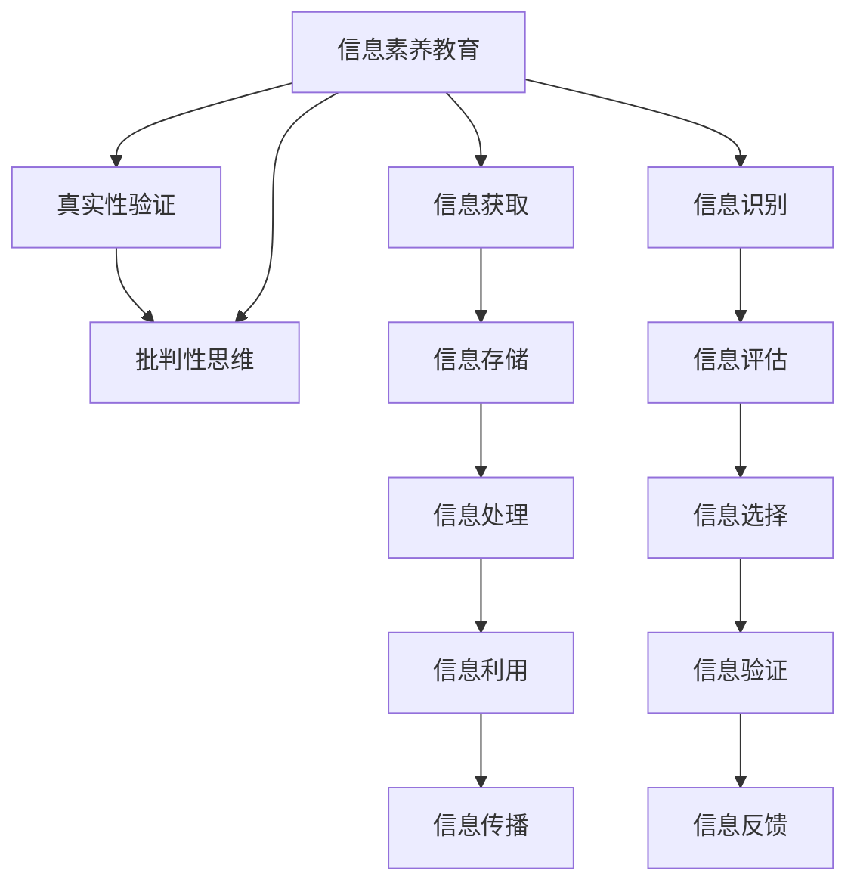

                 

## 1. 背景介绍

在数字化、信息化快速发展的今天，信息爆炸已成为不争的事实。无论是在学术研究、商业决策，还是个人生活，信息都扮演着至关重要的角色。然而，信息的真实性、准确性、可靠性常常受到质疑。因此，如何有效辨别信息真伪、培养信息素养，成为数字时代亟待解决的问题。

### 1.1 问题由来

随着互联网的普及，信息获取的便利性显著提升，但也带来了诸多问题：

1. **假新闻泛滥**：网络平台上充斥着大量虚假信息，政治、经济、社会各个领域均有涉及，严重误导公众。
   
2. **信息过载**：互联网的海量信息使得筛选有效信息变得困难，用户在无序的信息海洋中难以获得有价值的内容。

3. **信息安全**：信息泄露、数据滥用等安全隐患层出不穷，个人信息安全受到严重威胁。

4. **信息偏见**：信息传播过程中的算法偏见、信息源偏见等问题，加剧了社会的撕裂和对立。

5. **信息信任危机**：公众对传统媒体、社交平台的信息真实性产生怀疑，信任危机逐步蔓延。

为了应对这些挑战，培养具有批判性思维和信息素养能力的公民，变得尤为重要。

### 1.2 问题核心关键点

- **信息素养**：指个人对信息的认识、利用和批判能力。信息素养教育的目标是培养用户识别、评估、有效利用信息的能力。
- **批判性思维**：指能够客观、理性地分析问题，辨识信息真伪，从而做出明智决策的思维方式。
- **真实性验证**：通过技术手段和教育方法，增强用户对信息的辨识能力，避免受到虚假信息的影响。

培养这些能力，不仅有助于提升公众的媒介素养，还能促进社会的和谐稳定，为社会进步贡献力量。

### 1.3 问题研究意义

信息素养和批判性思维的教育，对于构建健康、文明的网络环境，提升公众的整体素质，推动社会进步具有深远的意义：

1. **提升公民素质**：培养具有信息素养和批判性思维能力的公民，有助于提升整个社会的信息素养水平。
2. **维护社会稳定**：通过提升信息辨别能力，减少虚假信息的传播，维护社会稳定和谐。
3. **促进经济发展**：提高企业和个人的决策准确性，推动经济的健康发展。
4. **增强文化自信**：通过挖掘和传播真实、准确的信息，增强文化自信，传承和发展优秀文化。
5. **促进科技进步**：信息素养和批判性思维的培养，有助于激发科技创新的活力，推动科技进步。

## 2. 核心概念与联系

### 2.1 核心概念概述

信息素养教育和真实性验证涉及的核心概念包括：

- **信息素养教育**：旨在提升用户对信息的识别、评估和有效利用的能力，使其成为具有批判性思维的消费者和生产者。
- **真实性验证**：通过技术手段，验证信息源的真实性，确保信息可靠性和可信度。
- **批判性思维**：培养用户客观、理性分析信息的能力，避免受到虚假信息的误导。

这些概念之间的关系可以通过以下Mermaid流程图进行展示：



从图中可以看出，信息素养教育不仅包括信息识别、评估和选择等基本技能，还涵盖真实性验证和批判性思维的培养。

### 2.2 核心概念原理和架构

信息素养教育和技术手段相结合，形成了一个完整的验证和反馈机制，其原理和架构可以归纳为以下几个要点：

1. **信息识别**：通过关键词、元数据等方式识别信息来源和作者，初步判断信息的可靠性和真实性。
   
2. **信息评估**：利用技术工具评估信息源的权威性、信息内容的准确性、时效性等，辅助用户判断信息是否可靠。
   
3. **信息选择**：结合信息识别和评估结果，选择最符合用户需求和预期，且可靠的信息。
   
4. **信息验证**：通过交叉验证、对比分析等方式，进一步验证信息内容的真实性。
   
5. **信息反馈**：将信息验证的结果反馈给用户，帮助其更全面地了解信息的多样性和复杂性，避免受到单一来源信息的误导。

### 2.3 核心概念间的联系

这些核心概念间存在紧密的联系，形成一个相互支持的闭环系统：

- **信息识别与信息评估**：两者相辅相成，信息识别为信息评估提供基础，信息评估为信息选择提供依据。
- **信息选择与信息验证**：信息选择是在信息评估的基础上进行的，信息验证则是对信息选择的进一步验证，确保信息准确可靠。
- **信息利用与信息反馈**：信息利用是信息验证的最终目标，信息反馈则是信息利用的补充，帮助用户更全面地了解信息。

## 3. 核心算法原理 & 具体操作步骤

### 3.1 算法原理概述

信息素养教育和真实性验证的核心算法原理可以概括为：

1. **基于规则的算法**：通过制定信息评估规则，利用关键词、元数据、引用等手段，评估信息源的权威性和内容的真实性。
   
2. **基于机器学习的算法**：利用文本挖掘、信息检索、自然语言处理等技术，对信息源和内容进行多维度分析，自动评估信息可靠性。
   
3. **结合社交网络的算法**：利用社交网络分析技术，评估信息传播路径的可靠性和信息源的影响力。

### 3.2 算法步骤详解

信息素养教育和真实性验证的算法步骤可以概括为：

1. **数据采集**：收集信息源、内容、传播路径等相关信息，作为评估的基础数据。
   
2. **数据预处理**：清洗、标注和标准化数据，消除噪音，确保分析的准确性。
   
3. **信息识别与评估**：通过关键词提取、元数据分析等方式，初步识别和评估信息源的可靠性和内容的时效性、准确性。
   
4. **信息选择与验证**：结合信息识别和评估结果，选择最可靠的信息源和内容，进行进一步验证。
   
5. **信息反馈**：将信息验证的结果反馈给用户，帮助其更全面地了解信息的多样性和复杂性。

### 3.3 算法优缺点

信息素养教育和真实性验证算法具有以下优点：

- **高效性**：通过自动化技术，可以快速处理大量信息，提高评估效率。
- **可靠性**：结合多种评估手段，确保评估结果的全面性和准确性。
- **易用性**：系统界面友好，易于用户操作和理解。

同时，算法也存在以下缺点：

- **复杂性**：涉及多种技术和评估手段，实现复杂。
- **依赖数据**：依赖高质量的数据，数据缺失或错误会影响评估结果。
- **人为因素**：算法结果受人为规则和数据标注的影响，存在主观偏差。

### 3.4 算法应用领域

信息素养教育和真实性验证算法在多个领域具有广泛应用：

- **学术研究**：帮助研究人员甄别文献的可靠性，提升研究质量。
- **商业决策**：辅助企业决策者评估市场数据、财务报告等信息的真实性。
- **医疗健康**：提高患者对医疗信息的辨识能力，避免误诊和误治。
- **金融投资**：帮助投资者评估市场信息和财务报告的可靠性，降低投资风险。
- **新闻媒体**：提升新闻媒体的信息素养，确保报道的客观和真实。
- **教育培训**：增强学生的媒介素养，提高其信息辨识能力。

## 4. 数学模型和公式 & 详细讲解 & 举例说明

### 4.1 数学模型构建

信息素养教育和真实性验证的数学模型可以概括为：

1. **信息评估模型**：通过多项式回归、决策树、支持向量机等算法，评估信息源和内容的可靠性。
   
2. **信息选择模型**：利用随机森林、Adaboost等算法，综合信息评估结果，选择最可靠的信息源和内容。
   
3. **信息验证模型**：通过神经网络、逻辑回归等算法，进一步验证信息源和内容的真实性。

### 4.2 公式推导过程

以下以信息评估模型为例，推导评估信息源可靠性的公式：

假设信息源的权威性、内容的时效性、准确性分别用 $A, T, C$ 表示，信息源的权重为 $w$。则信息源的可靠度 $R$ 可以表示为：

$$
R = w_A \cdot A + w_T \cdot T + w_C \cdot C
$$

其中，$w_A, w_T, w_C$ 分别表示权威性、时效性、准确性的权重，可以通过专家调研或经验法确定。

### 4.3 案例分析与讲解

以学术研究中信息评估为例，可以构建一个基于规则的信息评估模型：

1. **信息源评估**：通过评估期刊、作者的背景、论文引用情况等方式，确定信息源的权威性。
   
2. **内容评估**：利用关键词提取、元数据分析等方式，评估论文的时效性和准确性。
   
3. **结果输出**：综合信息源和内容的评估结果，给出论文的可靠度评分。

## 5. 项目实践：代码实例和详细解释说明

### 5.1 开发环境搭建

1. **Python环境**：安装Python 3.x，建议使用Anaconda或Miniconda搭建虚拟环境。

2. **数据准备**：收集论文标题、作者、引用情况、关键词等元数据，构建训练集。

3. **依赖安装**：安装必要的依赖包，如Scikit-learn、NLTK、TensorFlow等。

4. **工具安装**：安装必要的文本处理工具，如NLTK、spaCy等。

5. **环境配置**：配置Python开发环境，包括IDE、版本控制工具等。

### 5.2 源代码详细实现

以下是一个基于Scikit-learn的简单信息评估模型实现，用于评估学术论文的可靠性：

```python
from sklearn.ensemble import RandomForestClassifier
from sklearn.metrics import accuracy_score
from sklearn.model_selection import train_test_split
from sklearn.feature_extraction.text import TfidfVectorizer
from sklearn.preprocessing import LabelEncoder
from sklearn.pipeline import Pipeline

# 数据准备
data = load_data()  # 加载学术论文元数据
X = data['features']
y = data['labels']

# 数据分割
X_train, X_test, y_train, y_test = train_test_split(X, y, test_size=0.2, random_state=42)

# 构建评估模型
model = Pipeline([
    ('tfidf', TfidfVectorizer()),
    ('clf', RandomForestClassifier(n_estimators=100))
])

# 训练模型
model.fit(X_train, y_train)

# 评估模型
y_pred = model.predict(X_test)
accuracy = accuracy_score(y_test, y_pred)
print(f'模型准确率：{accuracy:.2f}')
```

### 5.3 代码解读与分析

**数据准备**：
- `load_data`：加载学术论文元数据，包括论文标题、作者、引用情况、关键词等。
- `X`：特征数据，包含论文元数据。
- `y`：标签数据，用于训练和评估模型的可靠性。

**数据分割**：
- `train_test_split`：将数据集分割为训练集和测试集，比例为80%和20%。

**模型构建**：
- `Pipeline`：用于构建多个步骤的模型流水线，方便管理和优化。
- `TfidfVectorizer`：用于将文本特征转换为TF-IDF向量，以便模型处理。
- `RandomForestClassifier`：用于训练随机森林分类器，评估论文的可靠性。

**模型训练与评估**：
- `fit`：在训练集上训练模型。
- `predict`：在测试集上预测论文的可靠性。
- `accuracy_score`：计算模型在测试集上的准确率。

## 6. 实际应用场景

### 6.1 智慧图书馆

智慧图书馆是信息素养教育和真实性验证的重要应用场景。通过信息素养教育和真实性验证，用户可以更准确地检索和利用图书馆资源，提高学习效率。

1. **信息素养教育**：通过讲座、培训等方式，提升用户的信息识别、评估和选择能力。
2. **真实性验证**：利用信息评估模型，验证电子文献的可靠性，辅助用户选择高质量的资源。
3. **信息利用**：提供智能推荐系统，根据用户需求推荐相关文献，并提供文献的多种格式和版本。

### 6.2 企业知识管理

在企业知识管理中，信息素养教育和真实性验证同样具有重要意义：

1. **信息素养教育**：培训员工的信息识别、评估和选择能力，提升企业知识管理水平。
2. **真实性验证**：验证企业内部和外部信息的可靠性，避免错误信息的传播。
3. **信息利用**：利用知识图谱、智能检索等技术，快速检索和利用相关知识，提高决策效率。

### 6.3 在线教育平台

在线教育平台是信息素养教育和真实性验证的重要应用场景，通过信息素养教育和真实性验证，提升学生的媒介素养和学习效果：

1. **信息素养教育**：通过课程、讲座等方式，提升学生的信息识别、评估和选择能力。
2. **真实性验证**：验证在线学习资源的可靠性，避免虚假信息对学生的误导。
3. **信息利用**：提供智能推荐系统，根据学生需求推荐相关学习资源，提升学习效果。

## 7. 工具和资源推荐

### 7.1 学习资源推荐

为了帮助开发者系统掌握信息素养教育和真实性验证的理论基础和实践技巧，这里推荐一些优质的学习资源：

1. **《信息素养教育指南》**：一本系统介绍信息素养教育的经典书籍，涵盖信息获取、评估、选择、利用等多个方面。
2. **《网络素养：互联时代的知识与技能》**：一本介绍网络素养教育的优秀书籍，涵盖信息识别、评估、选择、利用等多个方面。
3. **Coursera《信息素养与数字素养》课程**：Coursera平台上关于信息素养教育的经典课程，涵盖信息识别、评估、选择、利用等多个方面。
4. **Google 教育《信息素养与数字素养》课程**：Google教育推出的信息素养教育课程，涵盖信息识别、评估、选择、利用等多个方面。
5. **Socratic《信息素养与数字素养》课程**：Socratic平台上关于信息素养教育的优秀课程，涵盖信息识别、评估、选择、利用等多个方面。

### 7.2 开发工具推荐

信息素养教育和真实性验证涉及多种技术和工具，以下推荐一些常用的开发工具：

1. **Python**：广泛用于数据处理、模型构建、算法实现等。
2. **Scikit-learn**：用于构建机器学习模型，支持多种算法和评估方法。
3. **NLTK**：用于自然语言处理，包括文本处理、分类、聚类等。
4. **TensorFlow**：用于深度学习模型构建和训练。
5. **Jupyter Notebook**：用于数据处理、模型构建、算法实现等，支持交互式编程。
6. **Kaggle**：提供丰富的数据集和算法竞赛，支持数据探索、模型构建、算法实现等。

### 7.3 相关论文推荐

信息素养教育和真实性验证涉及多个领域的研究，以下推荐一些经典论文，帮助进一步理解相关理论和技术：

1. **《信息素养教育与数字素养：理论和实践》**：一篇介绍信息素养教育和数字素养教育的经典论文，涵盖理论基础和实践方法。
2. **《基于机器学习的信息评估方法研究》**：一篇介绍基于机器学习的信息评估方法的经典论文，涵盖多种算法和评估方法。
3. **《信息素养教育与真实性验证的研究现状与展望》**：一篇综述性论文，介绍信息素养教育和真实性验证的研究现状和未来发展方向。

## 8. 总结：未来发展趋势与挑战

### 8.1 研究成果总结

信息素养教育和真实性验证在数字化、信息化时代具有重要的意义，近年来得到了广泛的研究和应用：

1. **理论研究**：信息素养教育和真实性验证的理论研究逐步深入，涵盖信息识别、评估、选择、利用等多个方面。
2. **技术研究**：信息素养教育和真实性验证的技术研究日益丰富，涵盖多种算法和工具。
3. **应用研究**：信息素养教育和真实性验证的应用研究逐步拓展，涵盖图书馆、企业、在线教育等多个领域。

### 8.2 未来发展趋势

信息素养教育和真实性验证的未来发展趋势可以概括为：

1. **智能化**：利用人工智能和大数据技术，提升信息素养教育和真实性验证的智能化水平。
2. **个性化**：根据用户需求和兴趣，提供个性化的信息素养教育和真实性验证服务。
3. **普及化**：信息素养教育和真实性验证的普及化将成为趋势，覆盖更多领域和人群。
4. **跨界融合**：信息素养教育和真实性验证与其他技术的融合，如大数据、区块链、人工智能等，将带来更多创新应用。
5. **国际化**：信息素养教育和真实性验证的国际化将成为趋势，适应全球化背景下的信息环境。

### 8.3 面临的挑战

信息素养教育和真实性验证在发展过程中也面临诸多挑战：

1. **数据质量**：信息素养教育和真实性验证依赖高质量的数据，数据缺失或错误会影响评估结果。
2. **算法复杂性**：涉及多种技术和评估手段，实现复杂，需要更多研究和技术积累。
3. **用户体验**：如何设计用户友好的界面和工具，提高用户体验，仍需更多研究和探索。
4. **隐私保护**：在数据收集和处理过程中，如何保护用户隐私，避免信息泄露和滥用。

### 8.4 研究展望

未来，信息素养教育和真实性验证的研究应重点关注以下几个方面：

1. **多模态融合**：将文本、图像、视频等多种信息源进行融合，提升信息素养教育和真实性验证的效果。
2. **模型优化**：优化信息评估模型的算法和参数，提升模型准确率和泛化能力。
3. **用户反馈**：建立用户反馈机制，根据用户反馈不断改进信息素养教育和真实性验证的效果。
4. **跨界应用**：将信息素养教育和真实性验证与其他技术结合，如大数据、区块链、人工智能等，带来更多创新应用。
5. **国际合作**：加强国际合作，推动信息素养教育和真实性验证的国际化进程。

## 9. 附录：常见问题与解答

**Q1：信息素养教育和真实性验证是否适用于所有信息源？**

A: 信息素养教育和真实性验证适用于多种信息源，包括学术文献、网络资源、社交媒体等。但对于某些特殊领域的信息源，如医疗、法律等，仍需结合专业知识和领域特征进行评估。

**Q2：信息素养教育和真实性验证的算法复杂度如何？**

A: 信息素养教育和真实性验证的算法复杂度较高，涉及多种技术和评估手段，实现复杂。但随着技术的发展和算法的优化，其复杂度有望逐步降低。

**Q3：信息素养教育和真实性验证在实际应用中是否存在局限性？**

A: 信息素养教育和真实性验证在实际应用中确实存在局限性，如数据质量、算法复杂度、用户体验等。但通过不断优化算法、提升数据质量、改善用户体验，其局限性将逐步得到缓解。

**Q4：信息素养教育和真实性验证在企业知识管理中有何应用？**

A: 信息素养教育和真实性验证在企业知识管理中的应用包括：培训员工信息素养、验证企业内部和外部信息的可靠性、提供智能推荐系统等。

**Q5：信息素养教育和真实性验证的未来发展方向是什么？**

A: 信息素养教育和真实性验证的未来发展方向包括智能化、个性化、普及化、跨界融合和国际化等。通过技术创新和应用拓展，信息素养教育和真实性验证将更好地服务于数字化、信息化时代。

---

作者：禅与计算机程序设计艺术 / Zen and the Art of Computer Programming

