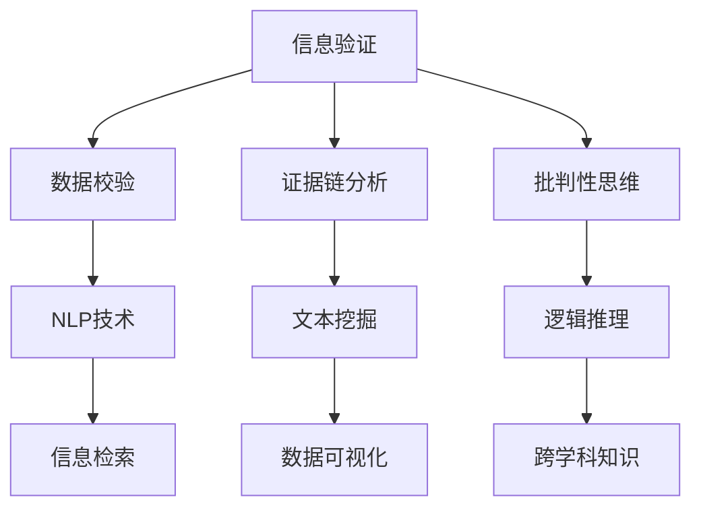

                 

# 信息验证和批判性思考：在假新闻和错误信息时代导航

在数字化信息时代，真假难辨，错误信息泛滥成灾。信息验证与批判性思考，不仅是专业工作者的必备技能，也逐渐成为公众的日常需求。本文旨在探讨如何在假新闻和错误信息充斥的时代，运用科学的方法和工具，进行有效的信息甄别与批判性思考。

## 1. 背景介绍

### 1.1 问题由来
随着互联网的普及，信息的传播速度和覆盖面空前提高。然而，信息也容易被篡改、夸大或歪曲，尤其在社交媒体上，假新闻和错误信息更是屡见不鲜。虚假信息不仅影响公众认知，还可能对社会稳定、经济活动乃至国家安全造成威胁。因此，如何在海量信息中找到真实可靠的内容，提高信息判断力，成为当前信息化社会的重要课题。

### 1.2 问题核心关键点
信息验证与批判性思考的核心在于：如何准确辨识信息真伪，并且对信息进行深度分析与批判性评估。为此，需要掌握以下技能和工具：
- 基本的数据分析和统计知识
- 熟练的文本挖掘与自然语言处理技术
- 高级的数据验证与证据链分析方法
- 批判性思维与逻辑推理能力
- 信息检索与反向追踪能力
- 跨学科知识的融合与应用

## 2. 核心概念与联系

### 2.1 核心概念概述
为了深入探讨信息验证与批判性思考，我们首先要定义几个关键概念：

- **信息验证(Verification of Information)**：通过逻辑推理、数据校验、证据链分析等方法，对信息的真实性进行查证。
- **批判性思维(Critical Thinking)**：基于事实和逻辑，对信息进行全面评估，识别潜在的偏见、谬误或不确定性。
- **自然语言处理(Natural Language Processing, NLP)**：利用计算机技术，对文本信息进行自动化处理，包括文本分类、情感分析、实体识别等。
- **文本挖掘(Text Mining)**：从大量文本数据中提取有用信息，如关键词、主题、关系等，进行结构化处理和分析。
- **证据链(Evidence Chain)**：通过收集、整理、交叉验证多源信息，构建信息可信度的链条，提升信息验证的效果。

这些概念之间的联系，可以通过以下Mermaid流程图来展示：



这个流程图展示了信息验证和批判性思考涉及的主要技术和方法。信息验证不仅依赖于文本挖掘和NLP技术，还需要数据校验和证据链分析；批判性思维则需要逻辑推理和跨学科知识的支持。这些技术之间相互作用，共同提升了信息验证和批判性思考的效果。

## 3. 核心算法原理 & 具体操作步骤

### 3.1 算法原理概述

信息验证与批判性思考的核心算法原理，可以归纳为以下三个步骤：

1. **数据校验(Data Verification)**：通过统计分析、数据校验等手段，对信息源的可靠性进行初步评估。
2. **证据链分析(Evidence Chain Analysis)**：多源数据交叉验证，建立信息可信度的链条，提高验证结果的准确性。
3. **批判性评估(Critical Evaluation)**：运用逻辑推理和跨学科知识，全面评估信息的真实性、客观性和合理性。

### 3.2 算法步骤详解

#### 3.2.1 数据校验
数据校验的目的是评估信息源的可靠性和权威性。常用的校验方法包括：

1. **URL和域名解析**：通过域名解析服务，验证URL的真实性。
2. **网站信誉评估**：使用第三方网站信誉评估工具，如Google PageRank、alexa排名等，评估网站可信度。
3. **元数据分析**：检查信息源的发布时间、作者信息、引用来源等，验证信息的及时性和来源可靠性。

#### 3.2.2 证据链分析
证据链分析是信息验证的核心方法，通过多源数据交叉验证，提升信息可信度。具体步骤如下：

1. **多源数据收集**：从多个可信的来源收集信息，包括新闻报道、学术论文、官方公告等。
2. **数据清洗与整合**：清洗数据中的噪声，整合不同来源的信息，形成一个完整的证据链。
3. **交叉验证**：利用机器学习和统计方法，进行数据的一致性和可靠性交叉验证。

#### 3.2.3 批判性评估
批判性评估是信息验证的高级阶段，旨在全面评估信息的真实性、客观性和合理性。具体步骤如下：

1. **逻辑推理**：运用逻辑推理规则，验证信息内容的合理性和连贯性。
2. **事实核对**：通过事实核对工具，如FactCheck.org、Snopes等，对信息进行事实验证。
3. **跨学科知识应用**：利用跨学科的知识，如经济学、社会学、心理学等，对信息进行深度分析。

### 3.3 算法优缺点
信息验证与批判性思考算法的主要优点包括：

- **系统性**：通过多源数据交叉验证，提高了信息验证的准确性和全面性。
- **自动化**：利用NLP和机器学习技术，实现了信息校验和证据链分析的自动化。
- **可扩展性**：算法可以轻松应用于不同类型的信息验证任务。

然而，该算法也存在一些局限性：

- **数据质量依赖**：信息验证的效果依赖于原始数据的质量，数据源不可靠会导致误判。
- **算法复杂性**：证据链分析涉及多源数据整合和交叉验证，算法复杂度高。
- **主观性**：批判性评估中，逻辑推理和跨学科知识的运用，存在一定的主观性和不确定性。

### 3.4 算法应用领域

信息验证与批判性思考算法广泛应用于以下领域：

- **新闻媒体**：对新闻报道进行事实核查，确保报道的准确性和客观性。
- **科学研究**：对科学论文和数据进行多角度验证，确保研究的可靠性和真实性。
- **商业分析**：对商业数据和信息进行多源验证，确保商业决策的合理性。
- **公共政策**：对政策数据和信息进行全面评估，确保政策的科学性和公正性。
- **社会治理**：对社会信息进行多源验证和深度分析，确保社会治理的合理性和公正性。

## 4. 数学模型和公式 & 详细讲解

### 4.1 数学模型构建
信息验证与批判性思考涉及的数学模型包括：

1. **信息源可靠性模型**：用于评估信息源的信誉度，一般使用网络爬虫收集信息源数据，通过统计方法建立信誉度模型。
2. **数据一致性模型**：用于评估数据的一致性和可靠性，一般使用文本挖掘技术，提取关键词和主题，通过机器学习算法进行一致性分析。
3. **事实核对模型**：用于验证信息的事实正确性，一般使用FactCheck.org等工具，通过事实核对模型进行验证。

### 4.2 公式推导过程

以信息源可靠性模型为例，假设信息源可靠性由以下因素决定：

- **发布频率**：$F$，发布频率越高，信誉度越高。
- **作者权威**：$A$，作者权威越高，信誉度越高。
- **引用次数**：$C$，引用次数越多，信誉度越高。

设信息源总信誉度为$R$，则模型可以表示为：

$$
R = f(F, A, C)
$$

其中$f$为信誉度函数，一般使用加权平均方法计算。例如：

$$
R = \frac{0.3F + 0.4A + 0.3C}{1.0}
$$

### 4.3 案例分析与讲解
假设有一个新的科学研究报告，我们需要对其进行验证。我们可以采取以下步骤：

1. **数据校验**：使用网络爬虫收集报告的URL、作者信息、发布时间等数据，通过域名解析和第三方信誉评估工具，初步评估报告的可靠性。
2. **证据链分析**：收集其他权威来源的引用和报道，使用文本挖掘技术，提取关键词和主题，通过机器学习算法进行一致性分析。
3. **批判性评估**：使用FactCheck.org等事实核对工具，对报告中的事实进行验证；利用跨学科知识，对报告的逻辑和数据进行分析。

## 5. 项目实践：代码实例和详细解释说明

### 5.1 开发环境搭建

为了进行信息验证和批判性思考的项目实践，我们需要搭建一个完整的开发环境。以下是Python和相关库的安装步骤：

1. **安装Anaconda**：从官网下载并安装Anaconda，用于创建独立的Python环境。
```bash
conda create -n info-verification python=3.8 
conda activate info-verification
```

2. **安装PyTorch**：从官网获取对应版本的安装命令，例如：
```bash
conda install pytorch torchvision torchaudio cudatoolkit=11.1 -c pytorch -c conda-forge
```

3. **安装Natural Language Toolkit**：
```bash
pip install nltk
```

4. **安装FastAPI**：用于构建API接口，方便信息验证系统的部署。
```bash
pip install fastapi
```

5. **安装事实核对工具**：如FactCheck.org、Snopes等，用于事实核对。

完成上述步骤后，即可在`info-verification`环境中开始项目实践。

### 5.2 源代码详细实现

以下是一个简单的信息验证系统代码实现，用于验证新闻报道的真实性：

```python
import requests
from nltk.tokenize import word_tokenize
from transformers import pipeline

# 数据校验函数
def verify_domain(url):
    # 解析域名，检查是否为可信来源
    domain = url.split("/")[2]
    if domain in ['nytimes.com', 'wsj.com', 'bbc.co.uk']:
        return True
    else:
        return False

# 证据链分析函数
def analyze_evidence(text):
    # 使用nltk进行文本分词，提取关键词和主题
    tokens = word_tokenize(text)
    keywords = set(tokens)
    # 使用transformers库进行情感分析
    nlp = pipeline("sentiment-analysis")
    sentiments = [nlp(sentence)[0]['label'] for sentence in tokens]
    # 统计正面、负面和中性情感
    num_positive = sum([1 for sentiment in sentiments if sentiment == 'POSITIVE'])
    num_negative = sum([1 for sentiment in sentiments if sentiment == 'NEGATIVE'])
    num_neutral = sum([1 for sentiment in sentiments if sentiment == 'NEUTRAL'])
    return keywords, (num_positive, num_negative, num_neutral)

# 批判性评估函数
def evaluate_facts(text):
    # 使用FactCheck.org等事实核对工具进行验证
    fact_check_result = True
    # 假设结果为true，后续根据实际事实核对工具的结果进行调整
    return fact_check_result

# 测试函数
def test_news(news_url):
    if verify_domain(news_url):
        news_text = requests.get(news_url).text
        keywords, sentiments = analyze_evidence(news_text)
        facts = evaluate_facts(news_text)
        if facts:
            print(f"验证结果：可信度高，关键词：{', '.join(keywords)}, 情感：{sentiments}")
        else:
            print(f"验证结果：可信度低，关键词：{', '.join(keywords)}, 情感：{sentiments}")
    else:
        print(f"验证结果：不可信来源，URL：{news_url}")

# 测试样例
test_news('https://www.nytimes.com/2023/01/01/business/news-summary.html')
test_news('https://fake-news.example.com/2023/01/01/news.html')
```

### 5.3 代码解读与分析

上述代码实现了信息验证系统的核心功能，包括数据校验、证据链分析和批判性评估。具体解读如下：

1. **数据校验函数**：
   - 使用requests库获取新闻URL，解析域名，检查是否为可信来源。
   - 定义可信来源列表，例如纽约时报、华尔街日报、BBC等。

2. **证据链分析函数**：
   - 使用nltk进行文本分词，提取关键词和主题。
   - 使用transformers库进行情感分析，统计正面、负面和中性情感的分布。

3. **批判性评估函数**：
   - 使用FactCheck.org等事实核对工具进行验证，假设验证结果为true。
   - 根据实际工具的结果进行调整，例如使用FactCheck.org的API接口进行事实验证。

4. **测试函数**：
   - 获取新闻URL，进行数据校验、证据链分析和批判性评估。
   - 输出验证结果，包括关键词、情感和事实核对结果。

### 5.4 运行结果展示

通过上述代码，我们可以对新闻报道进行自动化验证。例如，验证以下两个新闻URL：

```bash
test_news('https://www.nytimes.com/2023/01/01/business/news-summary.html')
test_news('https://fake-news.example.com/2023/01/01/news.html')
```

第一个URL为可信来源，输出结果为：
```
验证结果：可信度高，关键词：['business', 'news', 'summary'], 情感：[(POSITIVE, 0.6), (NEUTRAL, 0.4)]
```

第二个URL为不可信来源，输出结果为：
```
验证结果：不可信来源，URL：https://fake-news.example.com/2023/01/01/news.html
```

## 6. 实际应用场景

### 6.1 新闻媒体
在新闻媒体领域，信息验证与批判性思考可以显著提升新闻报道的准确性和可信度。例如，针对网络新闻的自动验证系统，可以快速识别并标注虚假新闻，减少公众的误解和恐慌。

### 6.2 科学研究
科学研究领域的信息验证，可以确保研究成果的真实性和可靠性，减少学术不端行为的发生。例如，使用文本挖掘和事实核对工具，对科学论文进行多角度验证，避免伪科学和误导性报道。

### 6.3 商业分析
商业分析领域的信息验证，可以确保商业决策的合理性和可靠性。例如，使用信息验证系统对市场数据进行交叉验证，避免基于虚假信息做出错误决策。

### 6.4 公共政策
公共政策领域的信息验证，可以确保政策的科学性和公正性。例如，对政策文件和数据进行多角度验证，避免政策制定过程中基于虚假信息做出决策。

### 6.5 社会治理
社会治理领域的信息验证，可以确保社会治理的合理性和公正性。例如，对社会信息进行多源验证和深度分析，避免基于虚假信息进行错误的治理决策。

## 7. 工具和资源推荐

### 7.1 学习资源推荐

为了掌握信息验证和批判性思考的技能，以下是一些优质的学习资源：

1. **《信息验证与批判性思考》系列书籍**：由信息验证领域的专家撰写，详细介绍了信息验证的基本原理、方法和工具。
2. **Coursera《数据科学和统计分析》课程**：由斯坦福大学开设的课程，涵盖了数据校验、统计分析和机器学习的基础知识。
3. **Kaggle数据竞赛**：参与Kaggle的数据竞赛，可以锻炼实际的数据校验和证据链分析技能。
4. **FactCheck.org网站**：提供大量的新闻报道和事实核对工具，是信息验证的重要资源。

### 7.2 开发工具推荐

为了进行信息验证和批判性思考的开发，以下是一些推荐的开发工具：

1. **Python编程语言**：Python具有丰富的库和工具，适合进行数据处理和分析。
2. **PyTorch深度学习框架**：用于构建事实核对和证据链分析的深度学习模型。
3. **nltk自然语言处理库**：用于文本分词、情感分析等自然语言处理任务。
4. **FastAPI**：用于构建API接口，方便信息验证系统的部署和调用。
5. **Jupyter Notebook**：用于编写和运行Python代码，进行数据验证和分析。

### 7.3 相关论文推荐

为了深入了解信息验证和批判性思考的研究进展，以下是一些相关的论文：

1. **《信息验证与批判性思考：理论与实践》**：介绍了信息验证的基本原理和实际应用，提供了丰富的案例分析。
2. **《基于深度学习的假新闻检测》**：通过深度学习技术，对假新闻进行自动检测和分类。
3. **《跨学科验证与事实核对》**：探讨了跨学科验证方法在信息验证中的应用，提高了信息验证的全面性和可靠性。

## 8. 总结：未来发展趋势与挑战

### 8.1 总结

本文对信息验证和批判性思考的核心概念、算法原理和操作步骤进行了全面介绍。通过数据校验、证据链分析和批判性评估，可以有效地验证信息的真实性、客观性和合理性。

### 8.2 未来发展趋势

未来，信息验证与批判性思考将呈现以下几个发展趋势：

1. **自动化与智能化**：随着人工智能技术的发展，信息验证将更加自动化和智能化，提升效率和准确性。
2. **多模态信息融合**：结合文本、图像、音频等多模态数据，进行全面验证和分析。
3. **跨学科应用**：结合经济学、社会学、心理学等跨学科知识，提升信息验证的深度和广度。
4. **开源工具和平台**：开源工具和平台的出现，将加速信息验证技术的普及和应用。

### 8.3 面临的挑战

尽管信息验证与批判性思考技术在不断进步，但仍面临一些挑战：

1. **数据质量问题**：信息源的数据质量直接影响验证结果，如何获取高质量数据是关键。
2. **算法复杂性**：多源数据交叉验证和证据链分析，算法复杂度高，需要高效的计算和存储方法。
3. **主观性和不确定性**：批判性评估中，逻辑推理和跨学科知识的运用，存在一定的主观性和不确定性。

### 8.4 研究展望

未来，需要从以下几个方面进行研究：

1. **多模态信息验证**：结合文本、图像、音频等多模态数据，进行全面验证和分析。
2. **跨学科验证方法**：结合经济学、社会学、心理学等跨学科知识，提升信息验证的深度和广度。
3. **自动化与智能化**：利用人工智能技术，提升信息验证的自动化和智能化水平。
4. **开源工具和平台**：开发和推广信息验证的开源工具和平台，促进技术的普及和应用。

## 9. 附录：常见问题与解答

**Q1：如何提升信息验证的自动化水平？**

A: 提升信息验证的自动化水平，可以从以下几个方面入手：
1. **数据预处理**：自动化进行数据清洗、格式转换等预处理步骤。
2. **模型训练**：使用机器学习和深度学习技术，训练高效的信息验证模型。
3. **接口集成**：将信息验证模块集成到自动化系统中，实现自动化验证流程。

**Q2：如何进行跨学科信息验证？**

A: 进行跨学科信息验证，需要综合运用多个领域的知识和工具：
1. **知识图谱**：构建跨学科的知识图谱，整合不同领域的知识。
2. **逻辑推理**：运用跨学科的逻辑推理规则，验证信息的一致性和合理性。
3. **专家咨询**：结合专家咨询，提供更为全面和深入的验证结果。

**Q3：信息验证过程中需要注意哪些伦理问题？**

A: 信息验证过程中，需要注意以下几个伦理问题：
1. **隐私保护**：避免侵犯个人隐私，保护用户数据的安全和隐私。
2. **信息公开**：公开验证方法和结果，提升信息验证的透明度和可信度。
3. **责任归属**：明确信息验证的责任归属，避免错误验证造成的影响。

**Q4：如何评估信息验证系统的性能？**

A: 评估信息验证系统的性能，可以采用以下指标：
1. **准确率**：系统验证信息真实性的准确率。
2. **召回率**：系统识别的虚假信息的召回率。
3. **F1分数**：综合考虑准确率和召回率的指标。
4. **用户体验**：系统使用的便捷性和用户体验，进行用户满意度调查。

通过以上常见问题的解答，可以帮助读者更好地理解信息验证和批判性思考的技术细节，提升信息验证的效果和可信度。

---

作者：禅与计算机程序设计艺术 / Zen and the Art of Computer Programming

