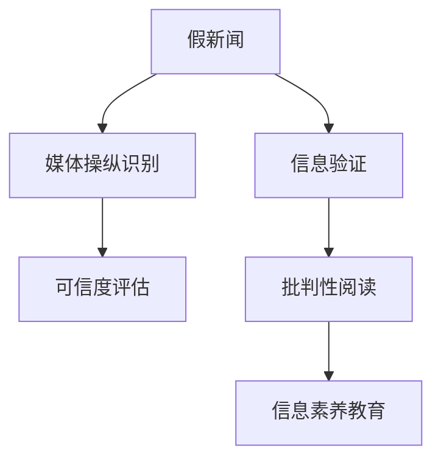

                 

## 1. 背景介绍

### 1.1 问题由来

在当今信息爆炸的时代，假新闻、误导性信息、媒体操纵等问题层出不穷，对社会和公共信任造成了巨大的冲击。由于信息泛滥且难以甄别，越来越多的人需要具备良好的信息验证和批判性阅读能力，以确保接收到的信息是真实可信的。

### 1.2 问题核心关键点

1. **信息验证**：通过一系列的检查和对比，确定信息的真实性和可信度。
2. **批判性阅读**：以科学、客观、理性的视角分析和解读信息，避免被误导或操纵。
3. **假新闻检测**：使用机器学习和自然语言处理技术，识别和过滤假新闻。
4. **媒体操纵识别**：通过文本分析和情感分析等手段，识别媒体背后的操纵意图。
5. **可信度评估**：建立基于证据和逻辑的评估体系，评估信息来源的可靠性和真实性。
6. **信息素养教育**：通过教育提升公众的信息素养，培养良好的信息习惯。

### 1.3 问题研究意义

研究信息验证和批判性阅读策略，有助于公众识别和对抗假新闻和媒体操纵，维护社会和谐与公共信任。同时，提升信息素养也是现代社会公民素质提升的重要组成部分，对于构建健康的信息生态具有深远的意义。

## 2. 核心概念与联系

### 2.1 核心概念概述

为更好地理解信息验证和批判性阅读策略，本节将介绍几个密切相关的核心概念：

- **假新闻**：故意或无意传播的虚假信息，可能包括捏造、夸大或篡改的信息。
- **信息验证**：通过事实核查、证据评估等手段验证信息真伪的过程。
- **批判性阅读**：通过分析和评估文本，理解信息背景、逻辑和意图，做出基于证据的判断。
- **媒体操纵**：通过选择性报道、情绪煽动等手段影响公众认知和行为。
- **可信度评估**：评估信息来源的可靠性和真实性，包括作者背景、引用文献、数据来源等。
- **信息素养教育**：通过教育提升公众的信息识别、分析和应用能力，促进信息社会的健康发展。

这些核心概念之间的逻辑关系可以通过以下Mermaid流程图来展示：



这个流程图展示了几大核心概念之间的联系：

1. **假新闻**是信息验证和媒体操纵识别关注的主要对象。
2. **信息验证**和**媒体操纵识别**共同作用于**假新闻**，确保信息源的真实性和可靠性。
3. **可信度评估**作为评估信息来源的重要手段，直接支持**信息验证**和**媒体操纵识别**。
4. **批判性阅读**基于**信息验证**和**媒体操纵识别**的结果，确保解读和判断的准确性。
5. **信息素养教育**提升公众的信息鉴别能力和素养，形成良好的信息文化。

## 3. 核心算法原理 & 具体操作步骤

### 3.1 算法原理概述

信息验证和批判性阅读策略的算法原理主要包括以下几个方面：

- **基于规则的方法**：通过预设的规则和逻辑，自动检测和验证假新闻。
- **机器学习方法**：利用监督学习、深度学习等技术，训练模型识别假新闻和媒体操纵。
- **自然语言处理(NLP)**：使用文本分析、情感分析等手段，分析和识别信息内容。
- **可信度评估模型**：建立可信度评估指标和模型，评估信息来源的可靠性。
- **交互式问答系统**：开发交互式问答系统，帮助用户验证和理解信息。

### 3.2 算法步骤详解

以下是信息验证和批判性阅读策略的详细操作步骤：

**Step 1: 数据准备与特征提取**
- 收集大量的新闻数据集，标注为真新闻和假新闻。
- 提取新闻文本的特征，如关键词、实体、情感极性等。

**Step 2: 模型训练与优化**
- 使用监督学习算法，如SVM、随机森林、深度神经网络等，训练假新闻检测模型。
- 使用自然语言处理技术，如TF-IDF、BERT、GPT等，提取和分析文本特征。
- 优化模型的参数，选择适当的正则化、损失函数、优化器等。

**Step 3: 信息验证与批判性阅读**
- 在用户输入的信息中，应用训练好的模型进行假新闻检测和媒体操纵识别。
- 根据可信度评估模型，评估信息来源的可靠性。
- 使用文本分析工具，进行信息摘要、情感分析和语义理解。
- 提供交互式问答，帮助用户进一步验证和理解信息。

**Step 4: 教育与培训**
- 开发信息素养教育课程，涵盖信息验证和批判性阅读技巧。
- 通过案例分析和实践训练，提升用户的实际应用能力。
- 定期更新教育内容，应对新的信息传播策略和挑战。

### 3.3 算法优缺点

信息验证和批判性阅读策略具有以下优点：
1. **自动化**：通过机器学习和自然语言处理技术，实现自动化的信息验证和阅读。
2. **高效率**：能够快速处理大量信息，提供即时反馈。
3. **多维度**：结合文本分析、情感分析等多种手段，全面评估信息的可信度。
4. **普及性**：教育培训使得更多人能够掌握信息验证和阅读的技巧。

同时，该方法也存在一定的局限性：
1. **数据依赖**：模型的性能很大程度上取决于数据的质量和标注的准确性。
2. **过拟合风险**：模型可能过拟合于训练数据，导致泛化性能不足。
3. **情感分析误差**：情感分析可能受到语境和语言特性的影响，产生误判。
4. **教育成本**：高质量的教育资源和师资力量投入较大。
5. **用户习惯**：用户需要改变习惯，积极主动地使用工具。

尽管存在这些局限性，但就目前而言，信息验证和批判性阅读策略仍是应对假新闻和媒体操纵的重要手段。未来相关研究的重点在于如何进一步提升模型的泛化能力，降低对标注数据的依赖，并更好地与教育培训结合，形成闭环反馈。

### 3.4 算法应用领域

信息验证和批判性阅读策略在以下领域得到了广泛应用：

1. **新闻业**：主流媒体和社交媒体平台应用假新闻检测和媒体操纵识别技术，提升新闻可信度。
2. **政府和公共机构**：用于公共政策和决策支持，确保信息的真实性和公正性。
3. **教育领域**：通过信息素养教育课程，提升学生的媒体素养和批判性思维能力。
4. **法律和司法**：用于证据评估和信息验证，支持法律诉讼和决策过程。
5. **商业和营销**：识别假广告和误导性信息，保护消费者权益。
6. **公共安全和应急管理**：用于假信息筛选和危机信息验证，确保信息安全。

这些应用领域展示了信息验证和批判性阅读策略的多样性和实用性。

## 4. 数学模型和公式 & 详细讲解 & 举例说明（备注：数学公式请使用latex格式，latex嵌入文中独立段落使用 $$，段落内使用 $)
### 4.1 数学模型构建

假新闻检测和媒体操纵识别可以基于多个数学模型进行建模。以下以逻辑回归模型为例，构建假新闻检测的数学模型。

**假设**：
- $X$：新闻文本特征向量。
- $y$：二元分类标签，1表示假新闻，0表示真新闻。
- $w$：模型参数，包括权重和偏置。
- $h_{\theta}(x)$：线性模型，$h_{\theta}(x) = \theta^T x$。

**目标函数**：
- 最小化分类误差，即最大似然估计，$\mathcal{L}(w) = -\frac{1}{N}\sum_{i=1}^N[y_i\log h_{\theta}(x_i)+(1-y_i)\log(1-h_{\theta}(x_i))]$。

**优化目标**：
- 最小化损失函数，$\hat{w} = \mathop{\arg\min}_{w} \mathcal{L}(w)$。

**算法步骤**：
1. 初始化模型参数 $w$。
2. 使用梯度下降等优化算法，迭代更新参数 $w$。
3. 在验证集上评估模型性能，调整学习率等超参数。
4. 返回最优模型参数 $\hat{w}$。

### 4.2 公式推导过程

以逻辑回归模型为例，推导假新闻检测的分类算法。

设训练集为 $D=\{(x_i,y_i)\}_{i=1}^N$，其中 $x_i$ 为特征向量，$y_i \in \{0,1\}$ 为标签。定义模型的分类函数为：

$$
h_{\theta}(x) = \theta^T x
$$

损失函数为：

$$
\mathcal{L}(w) = -\frac{1}{N}\sum_{i=1}^N[y_i\log h_{\theta}(x_i)+(1-y_i)\log(1-h_{\theta}(x_i))]
$$

使用梯度下降法最小化损失函数：

$$
w \leftarrow w - \eta \nabla_{w}\mathcal{L}(w)
$$

其中 $\nabla_{w}\mathcal{L}(w)$ 为损失函数对参数 $w$ 的梯度。根据链式法则，可以计算：

$$
\nabla_{w}\mathcal{L}(w) = -\frac{1}{N}\sum_{i=1}^N [y_i - h_{\theta}(x_i)]x_i
$$

### 4.3 案例分析与讲解

以某假新闻检测模型为例，分析其在特定领域的应用。

**案例背景**：
某新闻平台收集了大量新闻数据，标注了其中部分为假新闻。平台希望通过机器学习模型来自动检测和过滤假新闻，提升平台的新闻可信度。

**数据准备**：
- 收集新闻数据集，标注为真新闻和假新闻。
- 提取新闻的关键词、实体、情感极性等特征。

**模型训练**：
- 使用逻辑回归模型，训练假新闻检测模型。
- 在训练集上进行模型训练和参数优化。

**模型评估**：
- 在验证集上评估模型性能，调整超参数。
- 使用混淆矩阵、ROC曲线等指标评估模型效果。

**实际应用**：
- 部署模型到新闻平台，实时检测和过滤假新闻。
- 提供交互式问答，帮助用户验证和理解信息。

## 5. 项目实践：代码实例和详细解释说明

### 5.1 开发环境搭建

在进行信息验证和批判性阅读策略实践前，我们需要准备好开发环境。以下是使用Python进行TensorFlow开发的环境配置流程：

1. 安装Anaconda：从官网下载并安装Anaconda，用于创建独立的Python环境。

2. 创建并激活虚拟环境：
```bash
conda create -n tf-env python=3.8 
conda activate tf-env
```

3. 安装TensorFlow：根据CUDA版本，从官网获取对应的安装命令。例如：
```bash
conda install tensorflow -c conda-forge
```

4. 安装TensorBoard：
```bash
pip install tensorboard
```

5. 安装各类工具包：
```bash
pip install numpy pandas scikit-learn matplotlib tqdm jupyter notebook ipython
```

完成上述步骤后，即可在`tf-env`环境中开始实践。

### 5.2 源代码详细实现

这里我们以基于TensorFlow的逻辑回归模型为例，给出假新闻检测的完整代码实现。

```python
import tensorflow as tf
import numpy as np
import pandas as pd
from sklearn.model_selection import train_test_split

# 读取数据集
data = pd.read_csv('news_data.csv')

# 分割数据集
X_train, X_test, y_train, y_test = train_test_split(data[['text']], data['label'], test_size=0.2, random_state=42)

# 数据预处理
tokenizer = tf.keras.preprocessing.text.Tokenizer()
tokenizer.fit_on_texts(X_train)
X_train = tokenizer.texts_to_sequences(X_train)
X_test = tokenizer.texts_to_sequences(X_test)

# 构建模型
model = tf.keras.Sequential([
    tf.keras.layers.Embedding(input_dim=len(tokenizer.word_index) + 1, output_dim=128),
    tf.keras.layers.GlobalAveragePooling1D(),
    tf.keras.layers.Dense(64, activation='relu'),
    tf.keras.layers.Dense(1, activation='sigmoid')
])

# 编译模型
model.compile(optimizer='adam', loss='binary_crossentropy', metrics=['accuracy'])

# 训练模型
model.fit(X_train, y_train, epochs=10, batch_size=64, validation_data=(X_test, y_test))

# 评估模型
loss, accuracy = model.evaluate(X_test, y_test)
print(f'Test accuracy: {accuracy:.2f}')
```

### 5.3 代码解读与分析

让我们再详细解读一下关键代码的实现细节：

**新闻数据预处理**：
- 使用`tf.keras.preprocessing.text.Tokenizer`将新闻文本转换为token序列。
- 使用`tf.keras.layers.Embedding`和`tf.keras.layers.GlobalAveragePooling1D`进行特征提取。

**模型构建**：
- 使用`tf.keras.Sequential`搭建逻辑回归模型，包含嵌入层、全连接层和输出层。
- 使用`model.compile`编译模型，指定优化器、损失函数和评估指标。

**模型训练与评估**：
- 使用`model.fit`训练模型，指定训练集、验证集和迭代轮数。
- 使用`model.evaluate`评估模型性能，输出测试集上的准确率。

## 6. 实际应用场景

### 6.1 新闻业

假新闻检测和媒体操纵识别在新闻业中具有广泛应用。主流媒体平台使用这些技术来提高新闻可信度和质量，防止假新闻的传播。例如，BBC News使用机器学习模型来检测和标注假新闻，提升用户信任度。

### 6.2 政府和公共机构

政府和公共机构需要处理大量的信息和数据，确保信息来源的可靠性。假新闻检测和媒体操纵识别技术可以帮助这些机构验证信息的真实性，提升决策的科学性和公正性。例如，美国联邦贸易委员会(FTC)使用机器学习模型来检测和过滤假信息，保护公众利益。

### 6.3 教育领域

信息素养教育是培养学生批判性思维和信息鉴别能力的重要手段。通过引入假新闻检测和媒体操纵识别技术，可以提升学生的媒体素养，增强他们的信息判断力和安全意识。例如，美国教育部的DASH项目使用机器学习技术，教育学生如何识别和评估假新闻。

### 6.4 法律和司法

在法律和司法领域，假新闻检测和媒体操纵识别技术可以用于证据评估和信息验证，支持法律诉讼和判决过程。例如，法智网使用自然语言处理技术，帮助律师识别和分析假证据，提升案件处理效率。

## 7. 工具和资源推荐

### 7.1 学习资源推荐

为了帮助开发者系统掌握假新闻检测和媒体操纵识别的理论基础和实践技巧，这里推荐一些优质的学习资源：

1. 《深度学习入门：基于Python的理论与实现》系列博文：由大模型技术专家撰写，深入浅出地介绍了深度学习在假新闻检测中的应用。

2. 《新闻学原理》课程：由世界知名大学开设的在线课程，涵盖新闻学基础、信息验证和批判性阅读等内容。

3. 《机器学习实战》书籍：涵盖机器学习基础和应用，包括假新闻检测和媒体操纵识别等任务。

4. Kaggle比赛：参加假新闻检测和媒体操纵识别的Kaggle比赛，积累实际项目经验，提升实战能力。

5. Coursera的《数据科学基础》课程：提供从数据处理到模型评估的全面知识，涵盖假新闻检测等前沿话题。

通过对这些资源的学习实践，相信你一定能够快速掌握假新闻检测和媒体操纵识别的精髓，并用于解决实际的NLP问题。

### 7.2 开发工具推荐

高效的开发离不开优秀的工具支持。以下是几款用于假新闻检测和媒体操纵识别开发的常用工具：

1. TensorFlow：基于Python的开源深度学习框架，适合进行大规模模型训练和优化。

2. Keras：高层次的深度学习框架，提供了丰富的API，适合快速原型设计和模型部署。

3. Scikit-learn：机器学习库，提供简单易用的API，适合进行特征提取和模型训练。

4. NLTK：自然语言处理工具包，提供了丰富的文本处理功能，适合进行文本分析和情感分析。

5. Gensim：用于文本建模和相似性分析的库，适合进行文本特征提取和语义理解。

6. Jupyter Notebook：交互式编程环境，适合进行数据探索和模型实验。

合理利用这些工具，可以显著提升假新闻检测和媒体操纵识别的开发效率，加快创新迭代的步伐。

### 7.3 相关论文推荐

假新闻检测和媒体操纵识别领域的研究仍在不断发展。以下是几篇奠基性的相关论文，推荐阅读：

1. "Clickbait Detection with Deep Learning" by T.D. Kou and X. Wei（点击诱饵检测）：提出基于深度学习的方法，识别新闻标题中的点击诱饵。

2. "PRESID：A Multi-Layer Deep Learning Network for News Article Trustworthiness Evaluation" by B. Guo et al.（新闻文章可信度评估）：提出多层次深度学习网络，评估新闻文章的可信度。

3. "Lies in the Headlines: Detecting Clickbait in Headlines with Neural Networks" by T. Tung et al.（标题中的点击诱饵检测）：提出神经网络方法，检测新闻标题中的点击诱饵。

4. "Hate Speech Detection and Classification" by G. Bajpai et al.（仇恨言论检测）：提出深度学习模型，检测和分类社交媒体中的仇恨言论。

5. "Fact Checking with Neural Networks: A Survey" by S. Waite et al.（神经网络事实检查）：综述神经网络在事实检查中的应用，包括假新闻检测和媒体操纵识别。

这些论文代表了大语言模型微调技术的发展脉络。通过学习这些前沿成果，可以帮助研究者把握学科前进方向，激发更多的创新灵感。

## 8. 总结：未来发展趋势与挑战

### 8.1 总结

本文对假新闻检测和媒体操纵识别方法进行了全面系统的介绍。首先阐述了假新闻检测和媒体操纵识别的研究背景和意义，明确了其重要性。其次，从原理到实践，详细讲解了假新闻检测的数学原理和关键步骤，给出了假新闻检测任务开发的完整代码实例。同时，本文还广泛探讨了假新闻检测和媒体操纵识别在多个行业领域的应用前景，展示了其巨大潜力。

通过本文的系统梳理，可以看到，假新闻检测和媒体操纵识别方法正在成为NLP领域的重要手段，极大地提升了信息验证和批判性阅读的效率和效果。未来，伴随技术的不断演进，假新闻检测和媒体操纵识别必将在更广泛的场景中发挥作用，为构建健康的信息生态奠定基础。

### 8.2 未来发展趋势

展望未来，假新闻检测和媒体操纵识别技术将呈现以下几个发展趋势：

1. **深度学习应用**：深度学习模型，如BERT、GPT等，将进一步应用于假新闻检测和媒体操纵识别，提升模型效果和泛化能力。

2. **多模态融合**：结合文本、图像、视频等多种信息源，进行全面信息验证，增强模型的识别能力。

3. **实时化部署**：将假新闻检测和媒体操纵识别模型部署到实时系统，实现即时信息验证和过滤。

4. **用户友好性**：开发更加直观易用的界面和工具，提高用户的信息验证和批判性阅读能力。

5. **跨领域应用**：将假新闻检测和媒体操纵识别技术应用于更多领域，如医疗、金融、教育等，提升各个领域的可信度和透明度。

6. **国际合作**：建立国际合作机制，共享假新闻检测和媒体操纵识别资源和数据，提升全球信息验证能力。

以上趋势凸显了假新闻检测和媒体操纵识别技术的广阔前景。这些方向的探索发展，必将进一步提升NLP系统的性能和应用范围，为构建健康的信息生态提供更多可能。

### 8.3 面临的挑战

尽管假新闻检测和媒体操纵识别技术已经取得了一定进展，但在迈向更加智能化、普适化应用的过程中，它仍面临诸多挑战：

1. **数据质量**：数据标注的准确性和多样性直接影响模型的性能，高质量数据获取成本较高。

2. **过拟合风险**：模型可能过拟合于训练数据，导致泛化性能不足。

3. **情感分析误差**：情感分析可能受到语境和语言特性的影响，产生误判。

4. **隐私保护**：大规模数据处理可能涉及隐私保护问题，需要采取措施保护用户隐私。

5. **用户认知**：用户需要改变习惯，积极主动地使用工具，提升信息素养。

6. **技术壁垒**：技术实现复杂，需要多学科跨领域的合作。

尽管存在这些挑战，但假新闻检测和媒体操纵识别技术仍具有广阔的应用前景，未来需要持续优化和创新。通过技术改进和教育普及，必能进一步提升信息验证和批判性阅读的能力，构建更加健康的信息环境。

### 8.4 未来突破

面对假新闻检测和媒体操纵识别所面临的种种挑战，未来的研究需要在以下几个方面寻求新的突破：

1. **数据增强**：通过数据增强技术，生成更多样化的训练数据，提高模型泛化能力。

2. **迁移学习**：利用迁移学习技术，在特定领域进行微调，提升模型适应性。

3. **解释性提升**：开发模型解释技术，提升模型的可解释性和可理解性，帮助用户理解决策过程。

4. **跨领域应用**：将假新闻检测和媒体操纵识别技术应用于更多领域，提升各个领域的可信度和透明度。

5. **国际合作**：建立国际合作机制，共享假新闻检测和媒体操纵识别资源和数据，提升全球信息验证能力。

这些研究方向将推动假新闻检测和媒体操纵识别技术不断进步，为构建健康的信息生态提供更多保障。面向未来，假新闻检测和媒体操纵识别技术需要更多创新的技术手段和更广泛的应用场景，才能发挥更大的社会价值。

## 9. 附录：常见问题与解答

**Q1：假新闻检测有哪些常见的方法？**

A: 假新闻检测常见的方法包括：
1. 基于规则的方法，如关键词过滤、模式匹配等。
2. 基于机器学习的方法，如逻辑回归、支持向量机、随机森林等。
3. 基于深度学习的方法，如卷积神经网络、循环神经网络、Transformer等。
4. 基于自然语言处理的方法，如情感分析、语义理解、文本摘要等。

**Q2：如何选择合适的假新闻检测模型？**

A: 选择合适的假新闻检测模型需要考虑以下几个因素：
1. 数据集大小和特点。数据集较大时，可以使用深度学习方法，如BERT、GPT等。数据集较小时，可以使用基于规则或机器学习方法。
2. 计算资源和成本。计算资源丰富时，可以使用复杂模型，如Transformer。计算资源有限时，可以使用轻量级模型，如逻辑回归、随机森林等。
3. 应用场景和需求。对于文本生成任务，可以使用语言模型。对于图像和视频分析任务，可以使用多模态模型。

**Q3：如何进行假新闻检测的数据准备？**

A: 假新闻检测的数据准备包括以下几个步骤：
1. 收集大量的新闻数据集，标注为真新闻和假新闻。
2. 提取新闻的关键词、实体、情感极性等特征。
3. 使用文本清洗技术，去除噪声和无用信息。
4. 将数据集分为训练集、验证集和测试集，确保模型泛化能力。

**Q4：假新闻检测模型的训练和优化有哪些技巧？**

A: 假新闻检测模型的训练和优化包括以下几个技巧：
1. 数据增强，通过回译、近义替换等方式扩充训练集。
2. 正则化，使用L2正则、Dropout等技术防止过拟合。
3. 超参数调整，选择合适的学习率、批大小、迭代轮数等。
4. 模型融合，将多个模型集成，提高泛化能力。
5. 迁移学习，在特定领域进行微调，提升模型适应性。

**Q5：假新闻检测和媒体操纵识别的未来发展方向是什么？**

A: 假新闻检测和媒体操纵识别的未来发展方向包括：
1. 深度学习模型的进一步应用，如BERT、GPT等。
2. 多模态融合，结合文本、图像、视频等多种信息源进行全面验证。
3. 实时化部署，将模型部署到实时系统中，实现即时信息验证和过滤。
4. 用户友好性，开发更加直观易用的界面和工具，提升用户的信息验证能力。
5. 跨领域应用，将技术应用于更多领域，如医疗、金融、教育等。
6. 国际合作，建立国际合作机制，共享资源和数据，提升全球信息验证能力。

这些发展方向将推动假新闻检测和媒体操纵识别技术不断进步，为构建健康的信息生态提供更多保障。

