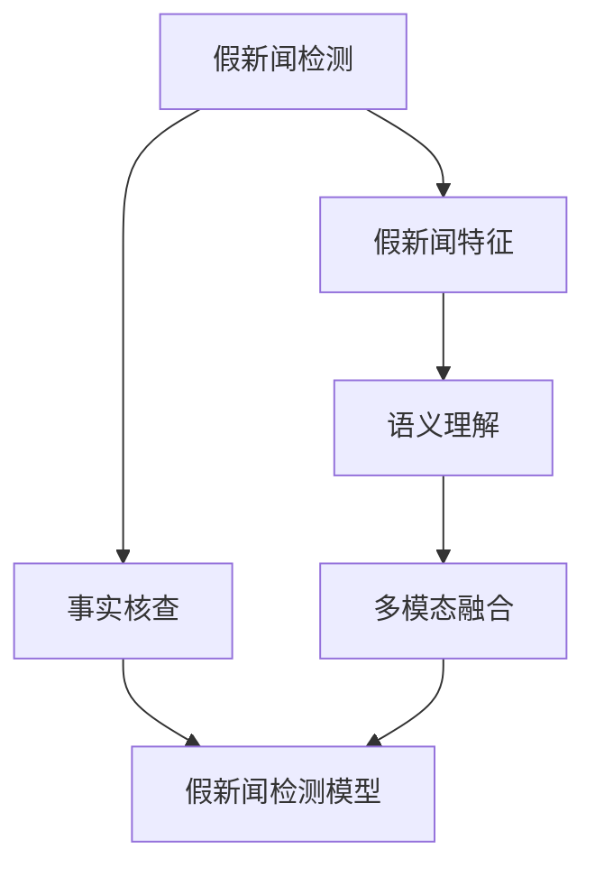

                 

# 假新闻检测：NLP与社会责任

## 1. 背景介绍

### 1.1 问题由来
随着互联网的普及和社交媒体的兴起，假新闻（False News）问题日益严重。假新闻不仅误导公众，损害个人和社会利益，还对民主、公正等社会价值观构成威胁。因此，如何快速、准确地检测假新闻，成为信息时代的重大挑战。

### 1.2 问题核心关键点
假新闻检测是指通过自然语言处理（NLP）技术，自动识别和标注出假新闻文本的过程。假新闻的特征包括但不限于：捏造、夸大、扭曲事实、使用误导性标题和图片、情绪化和偏颇等。如何利用NLP技术，将这些特征有效地转换为模型能够处理的输入，是假新闻检测的核心问题。

### 1.3 问题研究意义
假新闻检测是NLP技术社会责任的具体体现。其研究意义在于：
1. 维护信息真实性：帮助公众甄别假新闻，保护社会免受虚假信息的侵害。
2. 促进公民素养：提高公众对假新闻的识别能力，提升信息素养。
3. 保障社会稳定：防止假新闻对政治、经济、社会稳定造成负面影响。
4. 推动媒体责任：促进媒体平台加强内容审核，提升新闻质量。

## 2. 核心概念与联系

### 2.1 核心概念概述

为更好地理解假新闻检测的NLP方法，本节将介绍几个密切相关的核心概念：

- 假新闻检测（False News Detection）：通过NLP技术自动识别和标注假新闻文本的过程。
- 假新闻特征（False News Features）：假新闻文本中所蕴含的误导性、夸张性、事实扭曲等特征。
- 事实核查（Fact-checking）：人工或半自动地验证假新闻文本的真实性。
- 假新闻检测模型（False News Detector）：利用深度学习、规则等方法构建的自动检测假新闻的模型。
- 语义理解（Semantic Understanding）：理解文本中的含义、情感、背景等，识别其中的误导信息。
- 多模态融合（Multi-modal Fusion）：结合文本、图像、音频等多模态信息，提高假新闻检测的准确性和鲁棒性。

这些核心概念之间的逻辑关系可以通过以下Mermaid流程图来展示：



这个流程图展示了几者的关系：

1. 假新闻检测利用假新闻特征作为输入，构建假新闻检测模型。
2. 事实核查是假新闻检测的辅助手段，通过人工验证提高检测准确性。
3. 语义理解是假新闻特征提取的关键，识别出文本中的误导性信息。
4. 多模态融合有助于更好地理解和识别假新闻，提高检测效果。

## 3. 核心算法原理 & 具体操作步骤
### 3.1 算法原理概述

假新闻检测的算法原理是利用NLP技术，对文本进行特征提取和模型训练，自动识别假新闻。其核心思想是：假新闻文本通常具有特定的语言特征和情感倾向，模型可以学习这些特征，从而进行自动检测。

形式化地，假设训练集为 $D=\{(x_i, y_i)\}_{i=1}^N, x_i$ 为文本，$y_i$ 为标签（真实/假新闻）。假新闻检测模型的目标是最小化损失函数 $\mathcal{L}$，使得模型预测的标签与真实标签尽可能一致。

常见的损失函数包括交叉熵损失（Cross-Entropy Loss）和二分类对数损失（Binary Logistic Loss）。具体公式为：

$$
\mathcal{L}(\theta) = -\frac{1}{N}\sum_{i=1}^N [y_i \log p(y_i|x_i) + (1-y_i) \log (1-p(y_i|x_i))]
$$

其中 $p(y_i|x_i)$ 为模型对 $x_i$ 是假新闻的概率预测，$\theta$ 为模型参数。

### 3.2 算法步骤详解

假新闻检测的算法步骤主要包括：数据准备、特征提取、模型训练、预测与验证等。

**Step 1: 数据准备**
- 收集假新闻数据集，可以包括假新闻和真实新闻。
- 对数据进行清洗和预处理，去除噪声和停用词。
- 标注数据集，为每个文本标注真实/假新闻标签。

**Step 2: 特征提取**
- 利用TF-IDF、word2vec、BERT等方法提取文本特征。
- 根据文本特征构建模型输入。

**Step 3: 模型训练**
- 选择合适的模型（如CNN、RNN、Transformer等）进行训练。
- 设定合适的超参数，如学习率、批大小、迭代轮数等。
- 使用损失函数进行反向传播更新模型参数。

**Step 4: 预测与验证**
- 在测试集上进行预测，获取假新闻检测结果。
- 评估模型的预测准确性，如准确率、召回率、F1值等指标。

### 3.3 算法优缺点

假新闻检测的NLP方法具有以下优点：
1. 自动化程度高：模型可以24小时自动运行，无需人工干预。
2. 处理能力大：能够同时处理大量文本数据，提升检测效率。
3. 识别准确：结合多种特征和技术，具有较高的准确率。

同时，该方法也存在一些局限：
1. 依赖高质量数据：假新闻检测的准确性高度依赖数据的质量和多样性。
2. 难以处理复杂文本：假新闻可能包含复杂的逻辑和背景知识，模型难以识别。
3. 误报和漏报：假新闻检测模型存在一定的误报率和漏报率，需要人工复核。
4. 情感和背景影响：情感色彩和背景知识对检测结果有较大影响，需要综合考虑。

尽管存在这些局限性，但假新闻检测的NLP方法仍是大规模检测假新闻的有效工具。未来相关研究的重点在于如何进一步提高数据质量、提升模型复杂度、降低误报漏报率，以更好地服务于社会。

### 3.4 算法应用领域

假新闻检测的NLP方法在多个领域得到了广泛应用，例如：

- 新闻媒体：通过自动化检测假新闻，提升新闻平台的内容审核能力。
- 政府机构：用于检测网络上的假新闻，维护公共安全和社会稳定。
- 社交平台：在社交媒体上实时监控和打击假新闻，保护用户利益。
- 教育机构：帮助学生识别假新闻，提升信息素养。
- 商业机构：监控广告和营销中的假新闻，保护消费者权益。

除了这些常见领域外，假新闻检测技术还被用于研究假新闻传播规律、评估假新闻的传播效果等，为防范和遏制假新闻提供了有力的支持。

## 4. 数学模型和公式 & 详细讲解  
### 4.1 数学模型构建

本节将使用数学语言对假新闻检测的NLP方法进行更加严格的刻画。

记假新闻检测模型为 $M_{\theta}:\mathcal{X} \rightarrow \{0, 1\}$，其中 $\mathcal{X}$ 为输入空间，即文本。模型输出 $M_{\theta}(x)$ 表示输入文本 $x$ 为假新闻的概率。

定义模型 $M_{\theta}$ 在数据样本 $(x,y)$ 上的损失函数为 $\ell(M_{\theta}(x),y)$，则在数据集 $D$ 上的经验风险为：

$$
\mathcal{L}(\theta) = \frac{1}{N}\sum_{i=1}^N \ell(M_{\theta}(x_i),y_i)
$$

其中 $\ell$ 为二分类对数损失函数，定义为：

$$
\ell(M_{\theta}(x),y) = -(y \log M_{\theta}(x) + (1-y)\log(1-M_{\theta}(x)))
$$

在得到损失函数的梯度后，即可带入参数更新公式，完成模型的迭代优化。

### 4.2 公式推导过程

以下我们以二分类任务为例，推导交叉熵损失函数及其梯度的计算公式。

假设模型 $M_{\theta}$ 在输入 $x$ 上的输出为 $\hat{y}=M_{\theta}(x) \in [0,1]$，表示样本是假新闻的概率。真实标签 $y \in \{0,1\}$。则二分类交叉熵损失函数定义为：

$$
\ell(M_{\theta}(x),y) = -[y\log \hat{y} + (1-y)\log (1-\hat{y})]
$$

将其代入经验风险公式，得：

$$
\mathcal{L}(\theta) = -\frac{1}{N}\sum_{i=1}^N [y_i\log M_{\theta}(x_i)+(1-y_i)\log(1-M_{\theta}(x_i))]
$$

根据链式法则，损失函数对参数 $\theta_k$ 的梯度为：

$$
\frac{\partial \mathcal{L}(\theta)}{\partial \theta_k} = -\frac{1}{N}\sum_{i=1}^N \frac{\partial \ell}{\partial M_{\theta}(x_i)} \frac{\partial M_{\theta}(x_i)}{\partial \theta_k}
$$

其中 $\frac{\partial M_{\theta}(x_i)}{\partial \theta_k}$ 可进一步递归展开，利用自动微分技术完成计算。

在得到损失函数的梯度后，即可带入参数更新公式，完成模型的迭代优化。重复上述过程直至收敛，最终得到适应假新闻检测任务的最优模型参数 $\theta^*$。

## 5. 项目实践：代码实例和详细解释说明
### 5.1 开发环境搭建

在进行假新闻检测的NLP实践前，我们需要准备好开发环境。以下是使用Python进行PyTorch开发的环境配置流程：

1. 安装Anaconda：从官网下载并安装Anaconda，用于创建独立的Python环境。

2. 创建并激活虚拟环境：
```bash
conda create -n pytorch-env python=3.8 
conda activate pytorch-env
```

3. 安装PyTorch：根据CUDA版本，从官网获取对应的安装命令。例如：
```bash
conda install pytorch torchvision torchaudio cudatoolkit=11.1 -c pytorch -c conda-forge
```

4. 安装Transformers库：
```bash
pip install transformers
```

5. 安装各类工具包：
```bash
pip install numpy pandas scikit-learn matplotlib tqdm jupyter notebook ipython
```

完成上述步骤后，即可在`pytorch-env`环境中开始假新闻检测实践。

### 5.2 源代码详细实现

下面我以二分类假新闻检测任务为例，给出使用Transformers库对BERT模型进行假新闻检测的PyTorch代码实现。

首先，定义假新闻检测任务的输入数据处理函数：

```python
from transformers import BertTokenizer
from torch.utils.data import Dataset
import torch

class FalseNewsDataset(Dataset):
    def __init__(self, texts, labels, tokenizer, max_len=128):
        self.texts = texts
        self.labels = labels
        self.tokenizer = tokenizer
        self.max_len = max_len
        
    def __len__(self):
        return len(self.texts)
    
    def __getitem__(self, item):
        text = self.texts[item]
        label = self.labels[item]
        
        encoding = self.tokenizer(text, return_tensors='pt', max_length=self.max_len, padding='max_length', truncation=True)
        input_ids = encoding['input_ids'][0]
        attention_mask = encoding['attention_mask'][0]
        
        # 将标签进行编码
        encoded_label = torch.tensor([label], dtype=torch.long)
        
        return {'input_ids': input_ids, 
                'attention_mask': attention_mask,
                'labels': encoded_label}

# 创建dataset
tokenizer = BertTokenizer.from_pretrained('bert-base-cased')

train_dataset = FalseNewsDataset(train_texts, train_labels, tokenizer)
dev_dataset = FalseNewsDataset(dev_texts, dev_labels, tokenizer)
test_dataset = FalseNewsDataset(test_texts, test_labels, tokenizer)
```

然后，定义模型和优化器：

```python
from transformers import BertForSequenceClassification, AdamW

model = BertForSequenceClassification.from_pretrained('bert-base-cased', num_labels=2)

optimizer = AdamW(model.parameters(), lr=2e-5)
```

接着，定义训练和评估函数：

```python
from torch.utils.data import DataLoader
from tqdm import tqdm
from sklearn.metrics import classification_report

device = torch.device('cuda') if torch.cuda.is_available() else torch.device('cpu')
model.to(device)

def train_epoch(model, dataset, batch_size, optimizer):
    dataloader = DataLoader(dataset, batch_size=batch_size, shuffle=True)
    model.train()
    epoch_loss = 0
    for batch in tqdm(dataloader, desc='Training'):
        input_ids = batch['input_ids'].to(device)
        attention_mask = batch['attention_mask'].to(device)
        labels = batch['labels'].to(device)
        model.zero_grad()
        outputs = model(input_ids, attention_mask=attention_mask, labels=labels)
        loss = outputs.loss
        epoch_loss += loss.item()
        loss.backward()
        optimizer.step()
    return epoch_loss / len(dataloader)

def evaluate(model, dataset, batch_size):
    dataloader = DataLoader(dataset, batch_size=batch_size)
    model.eval()
    preds, labels = [], []
    with torch.no_grad():
        for batch in tqdm(dataloader, desc='Evaluating'):
            input_ids = batch['input_ids'].to(device)
            attention_mask = batch['attention_mask'].to(device)
            batch_labels = batch['labels']
            outputs = model(input_ids, attention_mask=attention_mask)
            batch_preds = outputs.logits.argmax(dim=1).to('cpu').tolist()
            batch_labels = batch_labels.to('cpu').tolist()
            for pred, label in zip(batch_preds, batch_labels):
                preds.append(pred)
                labels.append(label)
                
    print(classification_report(labels, preds))
```

最后，启动训练流程并在测试集上评估：

```python
epochs = 5
batch_size = 16

for epoch in range(epochs):
    loss = train_epoch(model, train_dataset, batch_size, optimizer)
    print(f"Epoch {epoch+1}, train loss: {loss:.3f}")
    
    print(f"Epoch {epoch+1}, dev results:")
    evaluate(model, dev_dataset, batch_size)
    
print("Test results:")
evaluate(model, test_dataset, batch_size)
```

以上就是使用PyTorch对BERT进行二分类假新闻检测任务的完整代码实现。可以看到，得益于Transformers库的强大封装，我们可以用相对简洁的代码完成BERT模型的加载和微调。

### 5.3 代码解读与分析

让我们再详细解读一下关键代码的实现细节：

**FalseNewsDataset类**：
- `__init__`方法：初始化文本、标签、分词器等关键组件。
- `__len__`方法：返回数据集的样本数量。
- `__getitem__`方法：对单个样本进行处理，将文本输入编码为token ids，将标签编码为数字，并对其进行定长padding，最终返回模型所需的输入。

**BertForSequenceClassification类**：
- 提供了二分类任务所需的输出层和损失函数。

**训练和评估函数**：
- 使用PyTorch的DataLoader对数据集进行批次化加载，供模型训练和推理使用。
- 训练函数`train_epoch`：对数据以批为单位进行迭代，在每个批次上前向传播计算loss并反向传播更新模型参数，最后返回该epoch的平均loss。
- 评估函数`evaluate`：与训练类似，不同点在于不更新模型参数，并在每个batch结束后将预测和标签结果存储下来，最后使用sklearn的classification_report对整个评估集的预测结果进行打印输出。

**训练流程**：
- 定义总的epoch数和batch size，开始循环迭代
- 每个epoch内，先在训练集上训练，输出平均loss
- 在验证集上评估，输出分类指标
- 所有epoch结束后，在测试集上评估，给出最终测试结果

可以看到，PyTorch配合Transformers库使得BERT假新闻检测的代码实现变得简洁高效。开发者可以将更多精力放在数据处理、模型改进等高层逻辑上，而不必过多关注底层的实现细节。

当然，工业级的系统实现还需考虑更多因素，如模型的保存和部署、超参数的自动搜索、更灵活的任务适配层等。但核心的假新闻检测范式基本与此类似。

## 6. 实际应用场景
### 6.1 社交媒体平台
社交媒体平台如微博、Twitter等，每天生成海量的用户内容，其中包含大量假新闻。通过假新闻检测技术，社交平台可以自动过滤和屏蔽假新闻，提升平台内容质量，保护用户免受虚假信息侵害。

### 6.2 新闻媒体
新闻媒体是假新闻传播的主要渠道之一，通过假新闻检测技术，媒体平台可以快速识别和删除假新闻，维护媒体公信力和新闻真实性。

### 6.3 政府机构
政府机构需要对网络上的假新闻进行实时监控，以防止虚假信息对公共安全和社会稳定造成影响。假新闻检测技术可以辅助政府机构进行舆论监测和风险预警。

### 6.4 教育机构
教育机构需要培养学生的媒体素养，假新闻检测技术可以作为教育工具，帮助学生识别假新闻，提升信息素养。

### 6.5 商业机构
商业机构需要对广告和营销中的假新闻进行检测，保护消费者权益，提升品牌信誉。

### 6.6 公共安全
假新闻检测技术还可以应用于公共安全领域，如对恐怖组织发布的虚假信息进行识别和防范，保障社会稳定。

## 7. 工具和资源推荐
### 7.1 学习资源推荐

为了帮助开发者系统掌握假新闻检测的理论基础和实践技巧，这里推荐一些优质的学习资源：

1. 《Natural Language Processing with Transformers》书籍：Transformers库的作者所著，全面介绍了如何使用Transformers库进行NLP任务开发，包括假新闻检测在内的诸多范式。

2. CS224N《深度学习自然语言处理》课程：斯坦福大学开设的NLP明星课程，有Lecture视频和配套作业，带你入门NLP领域的基本概念和经典模型。

3. 《Fake News Detection with Deep Learning》论文：详细介绍了利用深度学习技术进行假新闻检测的方法和应用，是假新闻检测领域的经典论文。

4. Kaggle竞赛：Kaggle平台上有多场假新闻检测竞赛，通过参与竞赛可以学习到最新的假新闻检测技术和算法。

5. ACL2017假新闻检测挑战：由ACL主办的假新闻检测挑战，汇聚了全球顶尖的研究团队，展示了最新成果。

通过对这些资源的学习实践，相信你一定能够快速掌握假新闻检测的精髓，并用于解决实际的NLP问题。
###  7.2 开发工具推荐

高效的开发离不开优秀的工具支持。以下是几款用于假新闻检测开发的常用工具：

1. PyTorch：基于Python的开源深度学习框架，灵活动态的计算图，适合快速迭代研究。大部分预训练语言模型都有PyTorch版本的实现。

2. TensorFlow：由Google主导开发的开源深度学习框架，生产部署方便，适合大规模工程应用。同样有丰富的预训练语言模型资源。

3. Transformers库：HuggingFace开发的NLP工具库，集成了众多SOTA语言模型，支持PyTorch和TensorFlow，是进行假新闻检测任务的开发的利器。

4. Weights & Biases：模型训练的实验跟踪工具，可以记录和可视化模型训练过程中的各项指标，方便对比和调优。与主流深度学习框架无缝集成。

5. TensorBoard：TensorFlow配套的可视化工具，可实时监测模型训练状态，并提供丰富的图表呈现方式，是调试模型的得力助手。

6. Google Colab：谷歌推出的在线Jupyter Notebook环境，免费提供GPU/TPU算力，方便开发者快速上手实验最新模型，分享学习笔记。

合理利用这些工具，可以显著提升假新闻检测任务的开发效率，加快创新迭代的步伐。

### 7.3 相关论文推荐

假新闻检测技术的发展源于学界的持续研究。以下是几篇奠基性的相关论文，推荐阅读：

1. Snopes: detecting and verifying information on social media：介绍了使用深度学习技术检测假新闻的方法，通过标签传播和对抗训练提升检测效果。

2. RumorDet: a neural network for early detection of rumor and fake news on Twitter：提出了一种基于CNN的假新闻检测模型，在Twitter数据集上取得了最佳效果。

3. Pseudo-Net: Generative Adversarial Networks for fake news detection：利用生成对抗网络（GAN）生成假新闻作为训练数据，提升假新闻检测模型的性能。

4. Fake News Detection with Multi-class Transfer Learning：提出了一种多任务转移学习的方法，通过联合训练多个任务，提高假新闻检测的准确率。

5. Explainable Fake News Detection：提出了一种可解释的假新闻检测方法，通过可视化的方式帮助理解模型的决策过程。

这些论文代表了大规模假新闻检测的研究进展，通过学习这些前沿成果，可以帮助研究者把握学科前进方向，激发更多的创新灵感。

## 8. 总结：未来发展趋势与挑战
### 8.1 总结

本文对基于NLP的假新闻检测方法进行了全面系统的介绍。首先阐述了假新闻检测的背景和意义，明确了其在NLP和社会责任中的重要地位。其次，从原理到实践，详细讲解了假新闻检测的数学模型和核心算法，给出了假新闻检测任务开发的完整代码实例。同时，本文还广泛探讨了假新闻检测技术在多个领域的应用前景，展示了其广泛的应用价值。此外，本文精选了假新闻检测技术的各类学习资源，力求为读者提供全方位的技术指引。

通过本文的系统梳理，可以看到，基于NLP的假新闻检测方法正在成为NLP技术社会责任的具体体现，极大地维护了信息真实性，提升了社会公共素养。假新闻检测的NLP方法不仅具有广泛的应用前景，而且通过不断的技术创新和优化，将在未来提供更加高效、可靠的假新闻检测解决方案。

### 8.2 未来发展趋势

展望未来，假新闻检测的NLP技术将呈现以下几个发展趋势：

1. 深度学习模型的复杂度提高：未来假新闻检测模型将更加复杂，结合更多的NLP技术，如文本生成、情感分析、语义理解等，提升检测效果。

2. 多模态信息的融合：假新闻检测将结合文本、图像、音频等多模态信息，构建更全面的假新闻检测系统。

3. 可解释性增强：假新闻检测模型将更加注重可解释性，通过可视化技术帮助用户理解模型的决策过程，增强模型的可信度。

4. 自监督学习的应用：通过自监督学习，利用大规模无标签数据进行预训练，提升模型的泛化能力和检测准确性。

5. 实时检测和应急响应：假新闻检测技术将向实时化、应急响应方向发展，及时发现和处理假新闻，保障网络信息安全。

6. 融合社会认知：假新闻检测技术将结合社会学、心理学等知识，构建更加符合社会认知的检测系统，提升检测效果。

以上趋势凸显了假新闻检测NLP技术的广阔前景。这些方向的探索发展，必将进一步提升假新闻检测系统的性能和应用范围，为维护网络信息安全和社会稳定提供强大的技术支持。

### 8.3 面临的挑战

尽管假新闻检测技术已经取得了显著进展，但在迈向更加智能化、普适化应用的过程中，仍面临诸多挑战：

1. 数据多样性：假新闻的形式多样，包含了各种文字、图像、音频等多模态信息，检测难度较大。

2. 低成本标注数据：高质量标注数据获取成本高，难以覆盖所有假新闻类型，需要寻找新的标注数据获取方式。

3. 模型鲁棒性：假新闻检测模型面临对抗样本攻击，容易产生误报和漏报，需要进一步提升模型鲁棒性。

4. 社会认知理解：假新闻检测技术需要理解复杂的社会认知和背景知识，目前还存在一定的局限。

5. 可解释性和可信度：假新闻检测模型需要具备较高的可解释性，才能增强用户信任度，提升模型的应用价值。

6. 法律和伦理问题：假新闻检测技术在应用过程中需要考虑法律和伦理问题，避免滥用。

正视假新闻检测面临的这些挑战，积极应对并寻求突破，将是大规模假新闻检测技术的成熟之路。相信随着学界和产业界的共同努力，这些挑战终将一一被克服，假新闻检测技术必将在构建安全、可靠、可解释、可控的智能系统上发挥更大的作用。

### 8.4 研究展望

面对假新闻检测NLP技术面临的挑战，未来的研究需要在以下几个方面寻求新的突破：

1. 多模态融合和跨模态学习：将文本、图像、音频等多模态信息融合，构建更全面、更准确的假新闻检测系统。

2. 自监督学习和大规模预训练：利用大规模无标签数据进行预训练，提升模型的泛化能力和鲁棒性。

3. 可解释性和知识图谱：构建可解释的假新闻检测模型，并结合知识图谱等外部知识，提高检测准确性和可解释性。

4. 对抗训练和鲁棒性提升：结合对抗训练等技术，提高假新闻检测模型的鲁棒性和抗攻击能力。

5. 社会认知理解与知识融合：结合社会学、心理学等知识，构建更符合社会认知的假新闻检测系统。

6. 实时检测和应急响应：开发实时检测和应急响应系统，及时发现和处理假新闻，保障网络信息安全。

这些研究方向的探索，必将引领假新闻检测NLP技术迈向更高的台阶，为构建安全、可靠、可解释、可控的智能系统铺平道路。面向未来，假新闻检测NLP技术还需要与其他人工智能技术进行更深入的融合，如知识表示、因果推理、强化学习等，多路径协同发力，共同推动假新闻检测技术的进步。只有勇于创新、敢于突破，才能不断拓展假新闻检测的边界，让智能技术更好地造福社会。

## 9. 附录：常见问题与解答

**Q1：假新闻检测的NLP方法如何处理多模态数据？**

A: 假新闻检测的NLP方法可以通过多模态融合技术，结合文本、图像、音频等多模态信息，构建更全面的假新闻检测系统。例如，可以利用计算机视觉技术识别图像中的误导信息，结合文本分析结果，综合判断是否为假新闻。

**Q2：假新闻检测的NLP方法如何处理对抗样本攻击？**

A: 假新闻检测的NLP方法可以通过对抗训练技术，提升模型的鲁棒性。对抗训练是指通过生成对抗样本，训练模型识别和对抗这些样本，提高模型的鲁棒性和泛化能力。

**Q3：假新闻检测的NLP方法如何处理低质量标注数据？**

A: 假新闻检测的NLP方法可以通过半监督学习和自监督学习技术，利用大规模无标签数据进行预训练，提升模型的泛化能力和鲁棒性。同时，可以采用数据增强、迁移学习等技术，提高模型对低质量标注数据的适应能力。

**Q4：假新闻检测的NLP方法如何处理社会认知理解？**

A: 假新闻检测的NLP方法可以通过结合社会学、心理学等知识，构建更符合社会认知的检测系统。例如，可以利用情感分析、常识推理等技术，理解文本中的情感色彩和背景知识，提高检测准确性。

**Q5：假新闻检测的NLP方法如何处理法律和伦理问题？**

A: 假新闻检测的NLP方法需要考虑法律和伦理问题，避免滥用。例如，可以在模型训练过程中加入伦理导向的评估指标，过滤和惩罚有害的输出倾向，同时加强人工干预和审核，保障数据和模型的安全。

通过以上问题与解答，相信你能够更好地理解和掌握假新闻检测的NLP方法，并应用于实际的NLP问题中。

---

作者：禅与计算机程序设计艺术 / Zen and the Art of Computer Programming

