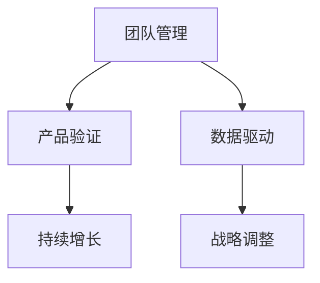

                 

# 健康的增长：贾扬清对团队表现满意，验证产品与战略

## 1. 背景介绍

### 1.1 问题由来

贾扬清，作为OpenAI的联合创始人，一直在推动人工智能领域的创新发展。近日，他在一篇博客中分享了对团队表现的满意以及验证产品与战略的经验，引起了行业内外的广泛关注。本文将深入探讨贾扬清在团队管理和战略验证方面的心得体会，为业内同仁提供宝贵的借鉴。

### 1.2 问题核心关键点

贾扬清强调，健康、持续的增长是团队管理的核心。他通过一系列成功的案例，阐述了如何通过产品验证、数据驱动和战略调整，实现团队的健康增长。其中，有效的团队沟通、明确的目标设定和持续的反馈机制，是推动团队不断前进的关键。

### 1.3 问题研究意义

理解贾扬清在团队管理和战略验证上的经验，对于业内团队的管理者和项目负责人具有重要意义。他的经验不仅适用于人工智能领域，对于任何追求持续发展的团队都具有广泛的适用性。

## 2. 核心概念与联系

### 2.1 核心概念概述

为更好地理解贾扬清在团队管理和战略验证上的心得，本文将介绍几个关键概念及其相互联系：

- **团队管理**：包括团队建设、沟通协调、目标设定、绩效评估等，是团队健康发展的基石。
- **产品验证**：通过数据分析和用户反馈，验证产品是否满足市场需求，指导产品改进和迭代。
- **数据驱动**：利用数据决策，确保决策过程透明、科学，减少主观偏见。
- **战略调整**：根据市场变化和团队表现，灵活调整战略方向，保持团队的前进方向与市场需求一致。
- **持续增长**：通过持续的产品改进、技术创新和管理优化，实现团队的健康、持续增长。

这些概念之间的逻辑关系可以通过以下Mermaid流程图来展示：



这个流程图展示团队管理与产品验证、数据驱动、战略调整、持续增长之间的相互关系：

1. 团队管理是团队健康发展的基石。
2. 产品验证和数据驱动确保决策科学。
3. 战略调整保持团队与市场一致。
4. 持续增长是团队目标和方向。

## 3. 核心算法原理 & 具体操作步骤
### 3.1 算法原理概述

贾扬清提出的团队管理和战略验证方法，本质上是一种科学、系统的决策过程。其核心思想是：通过产品验证、数据驱动和战略调整，实现团队的健康、持续增长。具体算法原理和操作步骤如下：

**Step 1: 定义清晰的目标和KPI**
- 明确团队的长期和短期目标，设定关键绩效指标(KPI)，以衡量团队进展和成果。

**Step 2: 数据驱动的产品验证**
- 利用用户反馈和数据分析，验证产品是否满足市场需求，指导产品改进和迭代。

**Step 3: 建立有效的团队沟通机制**
- 通过定期的项目汇报和团队讨论，确保信息的透明和流通。

**Step 4: 灵活调整战略**
- 根据市场变化和团队表现，灵活调整战略方向，确保团队与市场需求保持一致。

**Step 5: 持续增长**
- 通过持续的产品改进、技术创新和管理优化，实现团队的健康、持续增长。

### 3.2 算法步骤详解

以下将详细介绍每个步骤的具体操作方法：

**Step 1: 定义清晰的目标和KPI**

在定义团队目标时，需要确保目标具有可衡量性、可实现性和可追踪性。具体步骤如下：

1. 确定团队的核心业务目标。例如，提升产品用户增长率、提高技术研发效率等。
2. 设定具体的KPI指标。例如，月度新增用户数、产品功能完成率等。
3. 定期检查KPI指标，评估目标达成情况。

**Step 2: 数据驱动的产品验证**

数据驱动的产品验证，依赖于以下几个关键步骤：

1. 收集用户反馈和行为数据。例如，通过问卷调查、用户行为日志等方式获取数据。
2. 分析数据，识别产品的不足之处。例如，使用A/B测试、用户留存分析等方法。
3. 根据数据反馈，指导产品改进和迭代。例如，优先优化用户体验差的功能，提升用户满意度。

**Step 3: 建立有效的团队沟通机制**

有效的团队沟通机制，是确保团队协作和信息透明的关键。具体步骤如下：

1. 定期项目汇报。例如，每周一次的项目进度汇报，确保全员了解团队进展。
2. 建立反馈机制。例如，使用在线反馈工具，如Slack、JIRA等，鼓励团队成员分享意见和建议。
3. 团队讨论。例如，每月一次的团队头脑风暴，集体讨论问题和解决方案。

**Step 4: 灵活调整战略**

灵活调整战略，需要根据市场变化和团队表现，快速做出决策。具体步骤如下：

1. 定期评估市场变化。例如，每月一次的行业报告分析，了解市场趋势。
2. 分析团队表现。例如，每月一次的项目评估，评估团队绩效和成果。
3. 根据市场和团队表现，调整战略方向。例如，根据市场需求，调整产品开发优先级。

**Step 5: 持续增长**

持续增长，依赖于持续的产品改进、技术创新和管理优化。具体步骤如下：

1. 持续的产品改进。例如，定期收集用户反馈，优化产品功能。
2. 技术创新。例如，定期进行技术研究，探索新技术和解决方案。
3. 管理优化。例如，定期进行流程优化，提升团队效率和协作水平。

### 3.3 算法优缺点

贾扬清提出的团队管理和战略验证方法具有以下优点：

1. 科学决策。通过数据驱动和产品验证，确保决策过程透明、科学。
2. 灵活应变。根据市场变化和团队表现，灵活调整战略方向，保持团队前进。
3. 持续改进。通过持续的产品改进和创新，保持团队健康、持续增长。

同时，该方法也存在一定的局限性：

1. 数据获取难度大。获取高质量的用户反馈和行为数据需要时间和资源投入。
2. 调整成本高。频繁的战略调整可能导致资源浪费和团队不稳定。
3. 团队协作复杂。多团队协作和信息透明需要严格的管理制度和工具支持。

尽管存在这些局限性，但就目前而言，数据驱动和产品验证仍是团队管理和战略验证的主流范式。未来相关研究的重点在于如何进一步降低数据获取成本，提高战略调整的灵活性和效率。

### 3.4 算法应用领域

贾扬清提出的团队管理和战略验证方法，适用于多种应用场景，例如：

- 产品开发：通过产品验证和数据驱动，指导产品改进和迭代。
- 技术研发：通过数据驱动和持续增长，提升技术研发效率和创新能力。
- 项目管理：通过目标设定和团队沟通，确保项目按期交付，达成预期目标。
- 企业战略：通过灵活调整战略，确保企业发展与市场需求一致。

除了上述这些经典应用外，贾扬清的方法也被创新性地应用到更多场景中，如业务拓展、市场营销、客户服务等，为企业的全面发展提供了有力的支持。

## 4. 数学模型和公式 & 详细讲解 & 举例说明

### 4.1 数学模型构建

贾扬清的方法主要依赖于数据驱动和产品验证，不涉及复杂的数学模型构建。然而，为更好地理解其背后的理论基础，本文将简单介绍几种常用的数据分析和验证方法。

**A/B测试（A/B Testing）**

A/B测试是一种常用的产品验证方法，用于比较两个版本的产品，评估哪个版本更优。假设试验组和对照组的用户数分别为$n_1$和$n_2$，试验组的转化率分别为$p_1$和$p_2$。A/B测试的统计量$Z$定义为：

$$
Z = \frac{p_1 - p_2}{\sqrt{\frac{p_1(1-p_1)}{n_1} + \frac{p_2(1-p_2)}{n_2}} 
$$

若$Z$的值为正或负，表示试验组和对照组之间的转化率差异显著，可以做出相应的产品优化决策。

### 4.2 公式推导过程

以下将对A/B测试的统计量$Z$的推导过程进行说明：

假设试验组和对照组的用户数分别为$n_1$和$n_2$，试验组的转化率分别为$p_1$和$p_2$。则试验组和对照组的期望转化率分别为：

$$
E_1 = n_1p_1, \quad E_2 = n_2p_2
$$

试验组和对照组的样本均值分别为：

$$
\hat{p}_1 = \frac{1}{n_1} \sum_{i=1}^{n_1} X_i, \quad \hat{p}_2 = \frac{1}{n_2} \sum_{i=1}^{n_2} Y_i
$$

其中$X_i$和$Y_i$分别表示试验组和对照组的转化次数。根据中心极限定理，可以得出试验组和对照组的样本均值的标准差：

$$
\sigma_1 = \sqrt{\frac{p_1(1-p_1)}{n_1}}, \quad \sigma_2 = \sqrt{\frac{p_2(1-p_2)}{n_2}}
$$

因此，A/B测试的统计量$Z$可以表示为：

$$
Z = \frac{\hat{p}_1 - \hat{p}_2}{\sqrt{\frac{p_1(1-p_1)}{n_1} + \frac{p_2(1-p_2)}{n_2}} 
$$

该统计量用于评估试验组和对照组之间的差异是否显著，当$Z$的值为正或负时，可以做出相应的产品优化决策。

### 4.3 案例分析与讲解

以下将通过一个具体的案例，详细分析如何使用A/B测试方法进行产品验证：

假设某电商网站希望优化其搜索功能的转化率。网站决定对搜索界面进行A/B测试，分别测试两种不同的搜索界面设计。试验组为简化版，对照组为标准版。测试结果如下：

| 用户数 | 试验组转化率 | 对照组转化率 |
|--------|-------------|-------------|
| 1000   | 0.2         | 0.1         |
| 2000   | 0.3         | 0.2         |
| 3000   | 0.35        | 0.25        |

根据上述数据，可以计算出A/B测试的统计量$Z$：

$$
Z = \frac{0.35 - 0.25}{\sqrt{\frac{0.2(1-0.2)}{1000} + \frac{0.25(1-0.25)}{2000}} \approx 2.73
$$

由于$Z$的值为正，且大于1.96，可以得出结论：试验组（简化版）的转化率显著高于对照组（标准版）。因此，电商网站应该推广简化版的搜索界面设计，提升整体转化率。

## 5. 项目实践：代码实例和详细解释说明

### 5.1 开发环境搭建

在进行团队管理和战略验证方法的实践前，我们需要准备好开发环境。以下是使用Python进行数据驱动分析的环境配置流程：

1. 安装Anaconda：从官网下载并安装Anaconda，用于创建独立的Python环境。

2. 创建并激活虚拟环境：
```bash
conda create -n py-env python=3.8 
conda activate py-env
```

3. 安装PyTorch：根据CUDA版本，从官网获取对应的安装命令。例如：
```bash
conda install pytorch torchvision torchaudio cudatoolkit=11.1 -c pytorch -c conda-forge
```

4. 安装Pandas、NumPy等库：
```bash
pip install pandas numpy
```

5. 安装Jupyter Notebook等工具：
```bash
pip install jupyter notebook
```

完成上述步骤后，即可在`py-env`环境中开始数据驱动分析实践。

### 5.2 源代码详细实现

下面我们以A/B测试为例，给出使用Python进行数据驱动分析的代码实现。

首先，导入必要的库：

```python
import pandas as pd
import numpy as np
from scipy.stats import norm
```

然后，定义数据和计算A/B测试统计量$Z$：

```python
# 试验组和对照组的数据
n1 = np.array([1000, 2000, 3000])
p1 = np.array([0.2, 0.3, 0.35])
n2 = np.array([1000, 2000, 3000])
p2 = np.array([0.1, 0.2, 0.25])

# 计算A/B测试的统计量Z
Z = (p1 - p2) / np.sqrt((p1 * (1 - p1) / n1) + (p2 * (1 - p2) / n2))

print("A/B测试的统计量Z为：", Z)
```

最后，判断试验组和对照组之间的差异是否显著：

```python
# 判断Z值的显著性
alpha = 0.05
critical_Z = norm.ppf(1 - alpha / 2)

if Z > critical_Z:
    print("试验组和对照组之间的差异显著，可以做出相应决策。")
else:
    print("试验组和对照组之间的差异不显著，需要进一步测试。")
```

以上就是使用Python进行数据驱动分析的完整代码实现。可以看到，通过简单的统计计算和显著性判断，我们可以快速验证产品改进的效果，指导后续的产品优化和迭代。

### 5.3 代码解读与分析

让我们再详细解读一下关键代码的实现细节：

**试验组和对照组的数据**：
- `n1`和`p1`表示试验组的用户数和转化率。
- `n2`和`p2`表示对照组的用户数和转化率。

**计算A/B测试的统计量Z**：
- 根据A/B测试的统计量公式，计算Z值。

**判断Z值的显著性**：
- 根据显著性水平（alpha）计算出临界Z值。
- 若Z值大于临界Z值，则试验组和对照组之间的差异显著，可以做出相应决策；否则，需要进一步测试。

通过这段代码，我们可以清晰地看到数据驱动分析的实际应用，通过简单的计算和判断，帮助团队快速做出决策，指导产品改进和迭代。

## 6. 实际应用场景

### 6.1 智能客服系统

基于数据驱动的产品验证方法，智能客服系统可以通过A/B测试等方式，验证不同客服策略的效果。例如，某公司希望改进智能客服的响应时间，可以设计两种不同的客服策略，通过A/B测试来评估哪种方法更有效。

在具体实施时，可以收集客服系统的历史数据，设计两种不同的客服策略，并在新客户中随机分配。通过对比不同策略的响应时间和用户满意度，可以得出最优的客服策略，指导后续的系统优化。

### 6.2 金融舆情监测

在金融舆情监测领域，数据驱动的方法可以帮助团队快速验证不同舆情监测策略的效果。例如，某金融公司希望提升舆情监测的准确性和实时性，可以设计两种不同的舆情监测策略，通过A/B测试来评估哪种策略更优。

在具体实施时，可以收集历史舆情数据，设计两种不同的舆情监测策略，并在实时舆情中随机分配。通过对比不同策略的监测准确率和实时性，可以得出最优的舆情监测策略，指导后续的系统优化。

### 6.3 个性化推荐系统

在个性化推荐系统领域，数据驱动的方法可以帮助团队快速验证不同推荐算法的效果。例如，某电商平台希望提升推荐系统的转化率，可以设计两种不同的推荐算法，通过A/B测试来评估哪种算法更优。

在具体实施时，可以收集用户的历史行为数据，设计两种不同的推荐算法，并在用户群体中随机分配。通过对比不同算法的转化率和用户体验，可以得出最优的推荐算法，指导后续的系统优化。

### 6.4 未来应用展望

随着数据驱动和产品验证方法的发展，未来其在更多领域将得到应用，为各行业带来变革性影响。

在智慧医疗领域，基于数据驱动的医疗推荐系统，可以根据患者的历史病历和行为数据，推荐最适合的治疗方案和药品，提升诊疗效果。

在智能教育领域，基于数据驱动的教育推荐系统，可以根据学生的学习行为和成绩，推荐最适合的学习资源和教学方法，提升学习效果。

在智慧城市治理中，基于数据驱动的城市管理推荐系统，可以根据市民的需求和反馈，推荐最合适的公共服务设施，提升城市治理水平。

此外，在企业生产、社会治理、文娱传媒等众多领域，数据驱动的产品验证方法也将不断涌现，为各行业带来新的突破。相信随着数据量的不断积累和算法的不断进步，数据驱动的产品验证方法将发挥更大的作用，推动各行业的数字化转型升级。

## 7. 工具和资源推荐

### 7.1 学习资源推荐

为了帮助开发者系统掌握数据驱动和产品验证的理论基础和实践技巧，这里推荐一些优质的学习资源：

1. 《Python数据分析实战》系列博文：由数据驱动分析专家撰写，深入浅出地介绍了Python数据分析的方法和应用场景。

2. 《数据科学实战》课程：由斯坦福大学开设的在线课程，涵盖数据分析、数据可视化、机器学习等核心内容，适合各层次的学习者。

3. 《数据分析的艺术》书籍：全面介绍了数据驱动分析的理论基础和实践方法，适合深入学习者参考。

4. 《Kaggle竞赛指南》：提供大量数据分析和机器学习的实战案例，帮助学习者提升实战能力。

5. 《数据分析之美》博客：由知名数据分析师撰写，分享了大量数据分析和可视化案例，适合日常学习和参考。

通过对这些资源的学习实践，相信你一定能够快速掌握数据驱动和产品验证的精髓，并用于解决实际的业务问题。

### 7.2 开发工具推荐

高效的数据驱动分析离不开优秀的工具支持。以下是几款用于数据驱动分析开发的常用工具：

1. Jupyter Notebook：开源的交互式编程环境，支持Python、R等语言，适合数据驱动分析的开发和实验。

2. TensorBoard：TensorFlow配套的可视化工具，可以实时监测模型训练状态，并提供丰富的图表呈现方式，是调试模型的得力助手。

3. Weights & Biases：模型训练的实验跟踪工具，可以记录和可视化模型训练过程中的各项指标，方便对比和调优。

4. PyTorch：基于Python的开源深度学习框架，灵活动态的计算图，适合快速迭代研究。

5. scikit-learn：Python机器学习库，提供了丰富的数据预处理、特征工程和模型训练功能，适合数据驱动分析的开发。

6. Pandas：Python数据分析库，提供了高效的数据处理和分析功能，适合数据驱动分析的开发。

合理利用这些工具，可以显著提升数据驱动分析的开发效率，加快创新迭代的步伐。

### 7.3 相关论文推荐

数据驱动和产品验证方法的发展源于学界的持续研究。以下是几篇奠基性的相关论文，推荐阅读：

1. "The Influence of Data Quality on Model Performance"：探讨数据质量对模型性能的影响，强调数据驱动的重要性。

2. "A/B Testing: How to Run an A/B Test on Your Website"：详细介绍A/B测试的方法和步骤，帮助开发者进行产品验证。

3. "Adaptive Control and Adaptive Estimation"：介绍自适应控制和估计的方法，为数据驱动决策提供理论基础。

4. "Data-Driven Decision Making"：探讨数据驱动决策的理论和方法，帮助企业实现科学决策。

5. "The Science of Predictive Analytics"：介绍预测分析的理论和方法，为数据驱动决策提供科学依据。

这些论文代表了大数据驱动分析的发展脉络。通过学习这些前沿成果，可以帮助研究者把握学科前进方向，激发更多的创新灵感。

## 8. 总结：未来发展趋势与挑战

### 8.1 总结

本文对贾扬清在团队管理和战略验证上的心得进行了系统梳理。首先阐述了健康、持续的增长是团队管理的核心，强调了数据驱动和产品验证的重要性。其次，从原理到实践，详细讲解了数据驱动的产品验证方法，并通过代码实例进行了详细说明。同时，本文还广泛探讨了数据驱动方法在智能客服、金融舆情、个性化推荐等多个行业领域的应用前景，展示了数据驱动方法在各个行业中的巨大潜力。

通过本文的系统梳理，可以看到，数据驱动和产品验证方法是推动团队健康增长的重要工具，适用于各种行业和领域。随着数据量的不断积累和算法的不断进步，数据驱动方法将发挥更大的作用，推动各行业的数字化转型升级。

### 8.2 未来发展趋势

展望未来，数据驱动和产品验证方法将呈现以下几个发展趋势：

1. 数据采集自动化。随着物联网、大数据等技术的发展，数据的采集和处理将更加自动化和智能化，数据驱动方法将更加高效。

2. 多源数据融合。未来的数据驱动方法将更多地融合多源数据，提高数据质量和决策准确性。

3. 实时数据处理。未来的数据驱动方法将更多地依赖实时数据处理技术，提高决策的时效性。

4. 自适应决策。未来的数据驱动方法将更多地采用自适应决策技术，提高决策的灵活性和应变能力。

5. 人机协同决策。未来的数据驱动方法将更多地引入人机协同决策技术，提升决策的科学性和可解释性。

这些趋势凸显了数据驱动和产品验证方法的前景。这些方向的探索发展，必将进一步提升各行业的数字化水平，推动数据驱动方法走向更广阔的应用场景。

### 8.3 面临的挑战

尽管数据驱动和产品验证方法已经取得了显著成果，但在迈向更加智能化、普适化应用的过程中，仍面临诸多挑战：

1. 数据质量和隐私问题。数据质量和隐私问题仍是一个重要挑战，数据缺失、噪声和隐私泄露等问题需要进一步解决。

2. 模型复杂度。随着模型规模的增大，模型的训练和推理复杂度也在增加，如何降低模型复杂度，提高计算效率，仍是亟待解决的问题。

3. 人机协同。在数据驱动和产品验证过程中，如何实现人机协同决策，提升决策的科学性和可解释性，仍是重要的研究方向。

4. 标准化和规范。数据驱动方法的应用过程中，缺乏统一的标准和规范，导致不同系统之间的互操作性差，需要进一步推动标准化工作。

5. 数据安全和治理。数据安全和治理问题需要进一步加强，确保数据安全，保护用户隐私。

这些挑战需要各领域的共同努力，积极应对并寻求突破，才能进一步推动数据驱动和产品验证方法的发展。

### 8.4 研究展望

面对数据驱动和产品验证所面临的挑战，未来的研究需要在以下几个方面寻求新的突破：

1. 数据采集和处理自动化。探索更高效的数据采集和处理技术，减少人工干预，提高数据质量和处理效率。

2. 数据融合和预处理技术。研究多源数据融合和预处理技术，提高数据质量和决策准确性。

3. 实时数据处理技术。探索实时数据处理技术，提高决策的时效性。

4. 自适应决策算法。研究自适应决策算法，提高决策的灵活性和应变能力。

5. 人机协同决策技术。研究人机协同决策技术，提升决策的科学性和可解释性。

6. 数据安全和治理机制。研究数据安全和治理机制，确保数据安全，保护用户隐私。

这些研究方向将推动数据驱动和产品验证方法走向更高的台阶，为各行业带来更加智能、高效的决策支持。

## 9. 附录：常见问题与解答

**Q1：数据驱动和产品验证是否适用于所有业务场景？**

A: 数据驱动和产品验证方法适用于大多数业务场景，特别是数据量充足和场景复杂的应用。但对于一些特定领域，如金融、医疗等，由于数据隐私和安全问题，可能需要特殊处理。

**Q2：数据驱动和产品验证是否需要大量的数据？**

A: 数据驱动和产品验证需要一定量的数据，但并不需要海量数据。通过合理的样本设计，使用A/B测试等方法，可以在较少数据的情况下进行有效的产品验证。

**Q3：数据驱动和产品验证是否容易实施？**

A: 数据驱动和产品验证的实施需要一定的技术基础和资源投入。但对于具备数据驱动意识和技术的团队，实施数据驱动和产品验证相对容易。

**Q4：数据驱动和产品验证能否提升团队效率？**

A: 数据驱动和产品验证可以帮助团队快速验证产品效果，减少试错成本，提升决策效率。但需要合理的实施过程和人员配合，才能充分发挥其作用。

**Q5：数据驱动和产品验证是否适用于新兴技术？**

A: 数据驱动和产品验证方法适用于新兴技术的验证和优化，特别是在技术不成熟或市场变化频繁的情况下，可以快速进行技术验证和调整。

通过本文的系统梳理，可以看到，数据驱动和产品验证方法是推动团队健康增长的重要工具，适用于各种行业和领域。随着数据量的不断积累和算法的不断进步，数据驱动方法将发挥更大的作用，推动各行业的数字化转型升级。

