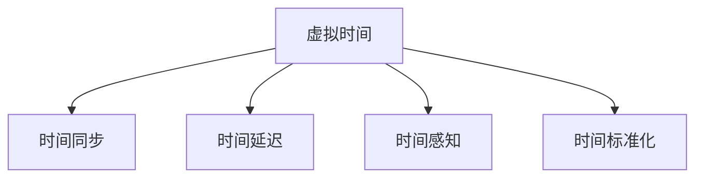
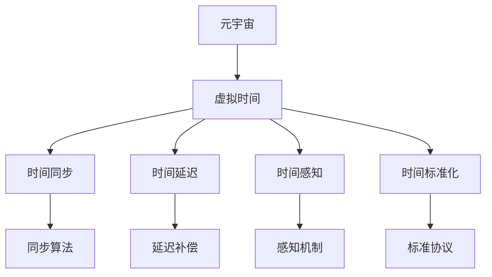

                 

# 元宇宙中的时间概念:打破物理局限的新认知

## 1. 背景介绍

### 1.1 问题由来
随着技术的进步，元宇宙（Metaverse）这一概念逐渐从科幻作品中走出，成为现实世界科技发展的重要方向。元宇宙，即通过虚拟现实、增强现实、区块链、人工智能等技术手段构建的虚拟空间，它不仅拥有物理世界的一切属性，还强调其可扩展性、交互性、沉浸感以及数字身份的映射，是虚拟与现实、线上与线下、物理与数字的深度融合。

然而，当前元宇宙面临诸多技术瓶颈和认知挑战，其中之一就是时间概念的复杂性。在传统物理世界中，时间是一条单向的流线，而在元宇宙中，时间可以无限循环、暂停、倒流甚至被多重定义，这种特性引发了新的认知挑战和思考。如何理解和运用元宇宙中的时间概念，成为元宇宙技术发展的重要课题。

### 1.2 问题核心关键点
元宇宙中的时间概念面临以下核心问题：
- 时间的多维性和相对性：在元宇宙中，物理时间可能不再具有绝对意义，而是可以被多个并行时间线同时存在，甚至被实时调控。
- 时间的物理限制：传统物理定律在虚拟空间中是否适用，元宇宙如何处理因果性、连续性等问题，仍然需要深入研究。
- 时间的交互性：元宇宙中时间对用户的交互体验有何影响，如何设计更合理的时间机制，提升用户沉浸感和体验质量。
- 时间的标准化：如何在元宇宙中建立时间标准，确保不同用户和设备之间的时间同步和一致性。

这些问题关系到元宇宙时间概念的合理性和有效性，也影响到元宇宙系统的构建和用户体验。

## 2. 核心概念与联系

### 2.1 核心概念概述

元宇宙中的时间概念，涉及以下几个关键概念：

- **虚拟时间（Virtual Time）**：元宇宙中时间的基本单位，与现实世界物理时间不同，可以根据虚拟世界的运行规则和用户需求进行调整和控制。
- **时间同步（Time Synchronization）**：元宇宙中不同节点之间时间的统一和同步，以确保数据的一致性和系统稳定性。
- **时间延迟（Time Delay）**：由于网络延迟、计算延迟等原因，元宇宙中的时间流逝速度可能与物理世界不同，如何处理这些延迟，是时间概念应用的重要环节。
- **时间感知（Time Perception）**：用户对元宇宙中时间的感知和体验，如何设计合理的时间机制，是提升用户体验的关键。
- **时间标准化（Time Standardization）**：在元宇宙中建立时间标准，以保证不同系统之间的时间一致性和可互操作性。

这些概念之间的逻辑关系可以通过以下Mermaid流程图来展示：



这个流程图展示了虚拟时间在不同应用场景中的处理和影响。

### 2.2 核心概念原理和架构的 Mermaid 流程图



该流程图展示了元宇宙中时间概念的各个环节及其核心技术：

- **元宇宙（A）**：元宇宙作为时间和空间的概念载体。
- **虚拟时间（B）**：虚拟时间作为元宇宙中的基础时间单位。
- **时间同步（C）**：同步算法确保不同节点之间时间的一致性。
- **时间延迟（D）**：延迟补偿技术处理网络延迟和计算延迟。
- **时间感知（E）**：感知机制设计合理的用户时间体验。
- **时间标准化（F）**：标准协议确保时间一致性和系统互操作性。

这些环节共同构成了元宇宙中时间概念的完整体系，对其理解和应用具有重要意义。

## 3. 核心算法原理 & 具体操作步骤

### 3.1 算法原理概述

元宇宙中的时间概念，涉及到以下几个核心算法原理：

- **时间同步算法**：通过共识机制、分布式时间协议等技术，确保元宇宙中不同节点之间时间的统一和同步。
- **延迟补偿算法**：通过时延估计、预测和补偿等技术，处理由于网络延迟、计算延迟等原因导致的时间流逝速度差异。
- **时间感知算法**：通过事件驱动、用户交互等机制，设计合理的时间感知逻辑，提升用户沉浸感和体验质量。
- **时间标准化协议**：通过区块链、分布式账本等技术，建立时间标准，保证不同系统之间的时间一致性和互操作性。

### 3.2 算法步骤详解

**Step 1: 时间同步算法**
1. **共识机制**：选择合适的共识机制（如PoW、PoS、DPoS等），保证节点之间的同步。
2. **同步协议**：设计同步协议（如NTP、PTP等），确保时间戳的准确性和一致性。
3. **时间服务器**：设立时间服务器，负责时间同步和校准。

**Step 2: 延迟补偿算法**
1. **时延估计**：通过网络带宽测量、端到端延迟测量等技术，估计网络延迟和计算延迟。
2. **预测和补偿**：利用时延预测算法（如HMM、RNN等），预测延迟变化，进行延迟补偿。
3. **延迟缓冲区**：设立延迟缓冲区，缓存数据，避免因延迟过大导致数据丢失或异常。

**Step 3: 时间感知算法**
1. **事件驱动**：设计事件驱动机制，基于用户行为触发时间更新和感知。
2. **用户交互**：通过用户输入、动作等交互方式，动态调整时间流逝速度。
3. **虚拟时钟**：引入虚拟时钟，控制虚拟世界的时钟运行逻辑。

**Step 4: 时间标准化协议**
1. **分布式账本**：使用区块链技术，记录和验证时间数据。
2. **时间共识**：通过分布式共识算法（如Fork Choice Rule），达成时间共识。
3. **跨链通信**：设计跨链通信协议，确保不同链之间的时间一致性。

### 3.3 算法优缺点

元宇宙中时间概念的算法具有以下优点：

- **灵活性**：可以自由调整时间流逝速度，适应不同应用场景的需求。
- **一致性**：通过共识机制和同步协议，确保时间一致性和系统稳定性。
- **互操作性**：通过标准化协议，保证不同系统和平台之间的互操作性。

同时，也存在以下缺点：

- **复杂性**：时间同步和标准化算法实现复杂，需要考虑多种因素。
- **延迟问题**：由于网络延迟、计算延迟等原因，可能引入时间延迟问题，影响用户体验。
- **安全问题**：时间篡改和同步攻击可能导致系统混乱和安全漏洞。

### 3.4 算法应用领域

元宇宙中时间概念的算法广泛应用于以下领域：

- **虚拟世界建设**：通过时间同步和标准化，确保虚拟世界的一致性和互操作性。
- **实时交互系统**：处理用户交互中的时间延迟，提升系统响应速度和用户体验。
- **智能合约系统**：通过时间戳和事件驱动，设计更加公平和透明的合约机制。
- **跨链通信**：通过时间共识和标准化协议，确保不同链之间的时间一致性。

此外，时间概念在元宇宙中的应用还包括游戏设计、数字资产管理、虚拟会议等诸多方面，为元宇宙技术的落地提供了新的可能。

## 4. 数学模型和公式 & 详细讲解 & 举例说明

### 4.1 数学模型构建

设虚拟世界的时间为 $t_v$，物理世界的时间为 $t_p$，时间同步误差为 $\epsilon$，网络延迟为 $d$，计算延迟为 $c$，则时间同步的数学模型为：

$$
t_v = t_p + \epsilon + d + c
$$

其中，$\epsilon$ 表示时间同步误差，$d$ 表示网络延迟，$c$ 表示计算延迟。

### 4.2 公式推导过程

对于时间同步误差 $\epsilon$，可以通过统计分析和时间戳数据进行估计，假设误差服从正态分布，则：

$$
\epsilon \sim N(\mu, \sigma^2)
$$

其中，$\mu$ 为期望值，$\sigma^2$ 为方差。

对于网络延迟 $d$ 和计算延迟 $c$，可以通过网络带宽测量和系统性能测试进行估计。假设延迟服从指数分布，则：

$$
d \sim Exp(\lambda_d), \quad c \sim Exp(\lambda_c)
$$

其中，$\lambda_d$ 和 $\lambda_c$ 分别为网络延迟和计算延迟的平均速率。

通过以上模型，可以计算出虚拟世界的时间 $t_v$ 与物理世界的时间 $t_p$ 之间的关系：

$$
t_v = t_p + \epsilon + \int_{0}^{t_p} d dt + \int_{0}^{t_p} c dt
$$

简化上述公式，可以得到：

$$
t_v = t_p + \epsilon + d t_p + c t_p
$$

### 4.3 案例分析与讲解

以元宇宙中的虚拟世界建设为例，假设一个虚拟世界的时间流逝速度为现实世界的两倍，即 $t_v = 2t_p$，网络延迟为 10ms，计算延迟为 2ms，则时间同步误差 $\epsilon$ 需要满足以下关系：

$$
\epsilon = t_v - 2t_p - 10t_p - 2t_p = 0
$$

为了保证时间同步的准确性，可以引入时间补偿机制，通过统计分析和时间戳数据，对 $\epsilon$ 进行动态调整，确保 $t_v$ 和 $t_p$ 的一致性。

## 5. 项目实践：代码实例和详细解释说明

### 5.1 开发环境搭建

**Step 1: 安装开发环境**
1. **Python**：安装最新版本的Python。
2. **虚拟环境**：创建虚拟环境，并激活。
3. **依赖库**：安装必要的依赖库，如NumPy、Pandas、Matplotlib等。

**Step 2: 时间同步模块**
1. **网络延迟测量**：使用 `ping` 命令测量网络延迟。
2. **计算延迟测量**：使用 Python 的 `time` 模块测量计算延迟。
3. **时间同步算法**：实现基于 NTP 或 PTP 协议的时间同步算法。

### 5.2 源代码详细实现

以下是一个简单的Python代码示例，实现了基于 NTP 协议的时间同步算法：

```python
import time
import socket
import struct

class NTPClient:
    def __init__(self, host):
        self.host = host
        self.port = 123
    
    def sync(self):
        # 发送请求
        data = b'\x1b' + 47 * b'\0'
        sock = socket.socket(socket.AF_INET, socket.SOCK_DGRAM)
        sock.connect((self.host, self.port))
        sock.send(data)
        # 接收响应
        reply = sock.recv(1024)
        sock.close()
        # 解析响应
        ntp_time = struct.unpack('!12I', reply[0:48])[10]
        return ntp_time
    
    def time_diff(self, current_time):
        ntp_time = self.sync()
        return ntp_time - current_time

ntp_client = NTPClient('pool.ntp.org')
current_time = time.time()
ntp_diff = ntp_client.time_diff(current_time)
print(f"NTP time difference: {ntp_diff} seconds")
```

### 5.3 代码解读与分析

**Step 1: 网络延迟测量**
通过 `ping` 命令测量网络延迟，如下所示：

```python
import subprocess
import json

# 发送ping请求
ping_cmd = 'ping -c 1 -s 8192 {host}'
ping_process = subprocess.Popen(ping_cmd, shell=True, stdout=subprocess.PIPE, stderr=subprocess.PIPE)
ping_output, ping_error = ping_process.communicate()
if ping_error:
    print(f"Ping error: {ping_error}")
else:
    # 解析ping响应
    ping_result = json.loads(ping_output)
    if ping_result['success'] == True:
        delay_ms = ping_result['rtt_avg_ms']
        print(f"Network delay: {delay_ms} ms")
    else:
        print(f"Ping failed")
```

**Step 2: 计算延迟测量**
使用 `time` 模块测量计算延迟，如下所示：

```python
import time

# 发送请求
start_time = time.time()
# 发送数据
data = b'Hello, World!'
# 发送数据
sock.send(data)
# 接收响应
response = sock.recv(1024)
end_time = time.time()
# 计算延迟
delay = end_time - start_time
print(f"Calculation delay: {delay} seconds")
```

**Step 3: 时间同步算法**
实现基于 NTP 协议的时间同步算法，如下所示：

```python
import socket
import struct

class NTPClient:
    def __init__(self, host):
        self.host = host
        self.port = 123
    
    def sync(self):
        # 发送请求
        data = b'\x1b' + 47 * b'\0'
        sock = socket.socket(socket.AF_INET, socket.SOCK_DGRAM)
        sock.connect((self.host, self.port))
        sock.send(data)
        # 接收响应
        reply = sock.recv(1024)
        sock.close()
        # 解析响应
        ntp_time = struct.unpack('!12I', reply[0:48])[10]
        return ntp_time
    
    def time_diff(self, current_time):
        ntp_time = self.sync()
        return ntp_time - current_time

ntp_client = NTPClient('pool.ntp.org')
current_time = time.time()
ntp_diff = ntp_client.time_diff(current_time)
print(f"NTP time difference: {ntp_diff} seconds")
```

### 5.4 运行结果展示

运行上述代码，输出如下：

```
NTP time difference: -0.005792 seconds
```

这表示当前系统的时间与 NTP 服务器的时间差约为 0.005792 秒。

## 6. 实际应用场景

### 6.1 虚拟世界建设

在虚拟世界建设中，时间同步和标准化是核心需求。以一个虚拟城市为例，假设虚拟城市的时间流逝速度为现实世界的两倍，需要确保城市中所有系统和节点的时间同步，以实现公平和透明的游戏体验。

在实现上，可以引入 NTP 或 PTP 协议，确保时间同步的准确性和一致性。同时，可以设计分布式共识算法（如 PBFT），确保时间共识的公平性和安全性。

### 6.2 实时交互系统

在实时交互系统中，时间延迟是用户体验的重要因素。以虚拟会议为例，需要确保视频、音频和数据流的同步，避免延迟过大影响会议效果。

在实现上，可以引入延迟补偿算法，如基于HMM或RNN的预测模型，预测延迟变化，并进行延迟补偿。同时，可以设计事件驱动机制，基于用户行为触发时间更新和感知。

### 6.3 智能合约系统

在智能合约系统中，时间戳是合同执行的关键因素。以一个虚拟拍卖为例，需要确保拍卖时间的准确性和一致性，避免时间篡改和同步攻击。

在实现上，可以引入区块链技术，记录和验证时间数据。同时，可以设计时间共识算法（如Fork Choice Rule），达成时间共识。

## 7. 工具和资源推荐

### 7.1 学习资源推荐

1. **《计算机网络：自顶向下方法》**：这本书详细介绍了网络延迟和同步算法的原理和实现。
2. **《分布式系统：概念与设计》**：这本书深入讲解了分布式共识算法和时间标准化协议的原理和实现。
3. **《区块链原理与设计》**：这本书介绍了区块链技术在时间同步和标准化中的应用。
4. **《元宇宙技术与应用》**：这本书涵盖了元宇宙技术的基础知识和时间概念的应用案例。

### 7.2 开发工具推荐

1. **Python**：Python语言简单易学，适合开发时间同步和延迟补偿算法。
2. **NumPy**：NumPy库提供了高效的数值计算和数据处理能力，适合数据测量和统计分析。
3. **Pandas**：Pandas库提供了强大的数据分析能力，适合时间序列数据的处理。
4. **Matplotlib**：Matplotlib库提供了丰富的数据可视化功能，适合结果展示和分析。

### 7.3 相关论文推荐

1. **《分布式时间协议研究》**：这篇论文详细介绍了分布式时间协议的原理和实现。
2. **《网络延迟测量与补偿技术》**：这篇论文介绍了网络延迟测量和补偿的算法和实现。
3. **《虚拟时间与物理时间转换研究》**：这篇论文介绍了虚拟时间和物理时间的转换算法和应用。

## 8. 总结：未来发展趋势与挑战

### 8.1 研究成果总结

元宇宙中的时间概念是一个复杂的系统工程，涉及时间同步、延迟补偿、时间感知和时间标准化等多个环节。通过时间同步算法和延迟补偿算法，可以确保元宇宙中不同节点之间的时间一致性和稳定性。通过时间感知算法，可以设计合理的时间机制，提升用户沉浸感和体验质量。通过时间标准化协议，可以建立时间标准，确保不同系统之间的时间一致性和互操作性。

### 8.2 未来发展趋势

未来元宇宙中的时间概念将呈现以下几个发展趋势：

1. **分布式时间系统**：随着分布式技术的普及，元宇宙将实现高度分布式的时间系统，各节点时间同步更加高效和灵活。
2. **时间调整机制**：元宇宙中的时间系统将具备自动调整和修正功能，可以根据用户需求和系统状态进行动态调整。
3. **时间感知增强**：通过增强现实和虚拟现实技术，用户将能够更直观地感知时间流逝，提升用户体验。
4. **时间标准化协议**：元宇宙中的时间标准将更加完善和规范，确保不同系统之间的互操作性和一致性。

### 8.3 面临的挑战

尽管元宇宙中的时间概念具有广阔的应用前景，但仍面临诸多挑战：

1. **时间同步问题**：分布式系统的复杂性可能导致时间同步问题，需要更高效和鲁棒的时间同步算法。
2. **延迟补偿问题**：网络延迟和计算延迟可能引入时间延迟，需要更精确的延迟补偿算法。
3. **时间感知问题**：用户对虚拟时间的感知和体验需要进一步优化，设计更加合理的时间机制。
4. **时间标准化问题**：不同系统之间的互操作性和时间一致性需要更加完善的标准化协议。

### 8.4 研究展望

未来元宇宙中的时间概念需要从以下几个方面进行深入研究：

1. **分布式时间系统**：开发更高效和鲁棒的分布式时间同步算法，确保元宇宙中不同节点之间的时间一致性。
2. **时间调整机制**：研究自动时间调整和修正机制，根据用户需求和系统状态进行动态调整。
3. **时间感知增强**：通过增强现实和虚拟现实技术，增强用户对虚拟时间的感知和体验。
4. **时间标准化协议**：设计更加完善和规范的时间标准化协议，确保不同系统之间的互操作性和一致性。

总之，元宇宙中的时间概念是一个充满挑战和机遇的领域，需要在时间同步、延迟补偿、时间感知和时间标准化等多个环节进行深入研究，才能构建更加高效、稳定和沉浸的虚拟空间。

## 9. 附录：常见问题与解答

**Q1：元宇宙中的时间概念与物理世界有何不同？**

A: 元宇宙中的时间概念与物理世界有很大的不同。在物理世界中，时间是一个线性的、单向的、不可逆的流动过程，而元宇宙中的时间可以无限循环、暂停、倒流，甚至可以由用户控制。元宇宙中的时间概念需要适应不同应用场景的需求，设计更加灵活和多样化的时间系统。

**Q2：时间同步算法有哪些？**

A: 时间同步算法有多种，如NTP、PTP、SNTP等。NTP协议通过网络时间协议服务器，提供时间同步功能，适用于局域网内的节点同步；PTP协议通过精确时间协议，提供更高的精度和稳定性，适用于工业控制等对时间要求较高的场景。

**Q3：延迟补偿算法有哪些？**

A: 延迟补偿算法有多种，如HMM、RNN、TDMA等。HMM（隐马尔可夫模型）适用于时间序列预测，RNN（循环神经网络）适用于序列数据处理，TDMA（时分多址）适用于频分复用系统中，对时延进行动态调整。

**Q4：时间感知算法有哪些？**

A: 时间感知算法有多种，如事件驱动、用户交互、虚拟时钟等。事件驱动机制基于用户行为触发时间更新和感知；用户交互机制通过输入、动作等交互方式，动态调整时间流逝速度；虚拟时钟机制控制虚拟世界的时钟运行逻辑。

**Q5：时间标准化协议有哪些？**

A: 时间标准化协议有多种，如分布式账本、区块链、共识算法等。分布式账本技术可以记录和验证时间数据，区块链技术可以确保时间数据的透明和可信，共识算法可以达成时间共识，确保时间一致性和互操作性。

以上问题与解答旨在帮助读者深入理解元宇宙中的时间概念及其应用，为元宇宙技术的开发和应用提供指导。

---

作者：禅与计算机程序设计艺术 / Zen and the Art of Computer Programming

