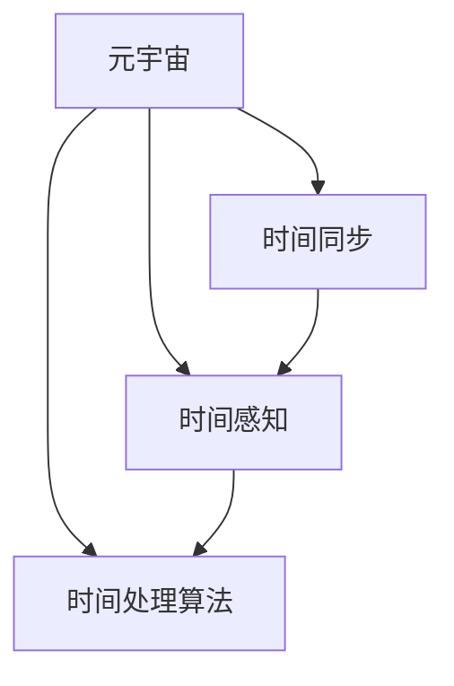

                 

# 元宇宙中的时间概念：打破物理局限的新认知

## 1. 背景介绍

### 1.1 问题由来

在物理世界，时间是一个基本且稳定的维度。然而，在不断发展的元宇宙中，时间概念面临巨大的挑战和重构。元宇宙是一个由计算机生成并连接所有用户的虚拟世界，其时间机制不同于现实世界的物理时间，能够跨越现实世界的物理限制，提供新的时间体验和操作方式。

时间在虚拟世界中的设计和实现，对用户体验、技术架构、以及跨平台兼容性具有重要影响。

### 1.2 问题核心关键点

- **时间跨越物理限制**：元宇宙中可以模拟超现实的时间体验，如逆时间、多维时间、共时性等，挑战物理世界的单向线性时间概念。
- **跨平台时间同步**：如何在不同用户设备间保持一致的时间体验，确保用户时间一致性。
- **时间流逝的感知**：如何在虚拟世界提供真实的时间流逝感，并适应用户的情感需求和行为习惯。
- **时间处理的算法和模型**：探索时间处理的数学模型和算法，确保元宇宙时间管理的效率和可扩展性。

## 2. 核心概念与联系

### 2.1 核心概念概述

为更好地理解元宇宙中的时间概念，本节将介绍几个关键的概念及其联系：

- **元宇宙（Metaverse）**：一个由计算机生成，用户可以实时交互的虚拟世界，可以跨越物理世界的限制，提供全新的时空体验。
- **时间同步（Time Synchronization）**：在元宇宙中，如何确保不同用户设备之间的时间一致性。
- **时间感知（Time Perception）**：如何模拟并增强用户在虚拟世界中的时间体验，使其感到真实和自然。
- **时间处理算法（Time Processing Algorithm）**：在元宇宙中处理时间变化的算法和数学模型，包括单向时间、多维时间、共时性等。

这些核心概念之间的联系可通过以下Mermaid流程图来展示：



这个流程图展示了元宇宙、时间同步、时间感知和时间处理算法之间的逻辑关系：

1. 元宇宙为时间处理提供了虚拟平台。
2. 时间同步技术确保不同设备间时间的一致性。
3. 时间感知技术提升用户在虚拟世界中的时间体验。
4. 时间处理算法实现时间管理，包括单向时间、多维时间等。

这些概念共同构成了元宇宙中时间概念的完整框架，为突破物理时间局限提供了可能性。

## 3. 核心算法原理 & 具体操作步骤

### 3.1 算法原理概述

元宇宙中的时间概念并非依赖于现实世界的物理时间，而是通过算法和模型进行计算和模拟。以下是几个核心算法原理：

- **单向时间（One-way Time）**：元宇宙中的时间流逝可以是正向的、逆向的或双向的，模拟多种时间体验。
- **多维时间（Multidimensional Time）**：元宇宙中的时间可以是三维、四维甚至更高维的，通过数学模型模拟时间的多维特性。
- **共时性（Simultaneity）**：元宇宙中的不同用户可以在同一时间点进行不同的活动，实现共时性体验。
- **时间同步算法**：通过分布式时间协议和算法，确保不同设备间的时间一致性。

### 3.2 算法步骤详解

#### 3.2.1 单向时间处理算法

- **时间流向设定**：确定时间流向（正向、逆向、双向）。
- **时间计算模型**：选择合适的数学模型，如微分方程，描述时间流逝。
- **时间步长控制**：确定时间步长，调整时间计算的精度和效率。

#### 3.2.2 多维时间处理算法

- **维度选择**：定义时间维度（如三维、四维等）。
- **数学模型构建**：使用数学模型描述多维时间的变化规律。
- **时间演化模拟**：通过算法模拟时间在多维度空间中的演化。

#### 3.2.3 共时性处理算法

- **事件同步**：通过分布式算法确保不同设备上事件的时间同步。
- **时间同步协议**：使用NTP、PTP等协议，实现时间同步。
- **时间偏差校正**：对时间偏差进行校正，确保时间一致性。

#### 3.2.4 时间同步算法

- **分布式时间协议**：使用如NTP、PTP等协议实现时间同步。
- **时间偏差检测**：检测并纠正不同设备间的时间偏差。
- **时间校正机制**：使用跨平台校正机制确保时间一致性。

### 3.3 算法优缺点

#### 3.3.1 单向时间处理算法的优缺点

**优点**：
- 灵活性高，可以模拟多种时间体验。
- 数学模型成熟，易于实现。

**缺点**：
- 可能导致时间悖论和逻辑混乱。
- 计算复杂度较高，效率较低。

#### 3.3.2 多维时间处理算法的优缺点

**优点**：
- 能模拟复杂的物理现象和时间变化。
- 适用于高维空间和时间模拟。

**缺点**：
- 数学模型复杂，难以直观理解。
- 计算量大，性能要求高。

#### 3.3.3 共时性处理算法的优缺点

**优点**：
- 支持多种并发活动，提升用户体验。
- 增强虚拟世界的互动性和实时性。

**缺点**：
- 复杂度高，同步难度大。
- 需要高精度的时间同步协议。

#### 3.3.4 时间同步算法的优缺点

**优点**：
- 实现分布式时间同步，确保时间一致性。
- 支持跨平台时间管理，提高系统可扩展性。

**缺点**：
- 网络延迟和抖动可能影响同步精度。
- 实现复杂，需要高精度时间协议和算法。

### 3.4 算法应用领域

元宇宙中的时间概念，已经在多个领域得到了应用：

- **游戏领域**：如《赛博朋克2077》等游戏中，时间可以逆向流动，提供独特的游戏体验。
- **虚拟会议**：如VR会议系统，允许用户跨越物理空间，实现共时性交流。
- **虚拟城市**：如《我的世界》等游戏中，时间模拟自然规律，提供沉浸式体验。
- **虚拟现实（VR）与增强现实（AR）**：通过多维时间处理，提供丰富的虚拟体验。

## 4. 数学模型和公式 & 详细讲解 & 举例说明

### 4.1 数学模型构建

在元宇宙中，时间概念可以通过数学模型进行建模和处理。以下是几个关键的数学模型：

#### 4.1.1 单向时间模型

假设时间 $t$ 随时间 $t_0$ 变化，数学模型为：

$$
\dot{t} = f(t, t_0)
$$

其中 $f$ 为时间变化函数，可以定义不同方向（正向、逆向、双向）。

#### 4.1.2 多维时间模型

假设时间 $t$ 在三维空间中变化，数学模型为：

$$
\dot{t} = \mathbf{F}(t, \mathbf{r})
$$

其中 $\mathbf{F}$ 为时间变化函数，$\mathbf{r}$ 为空间位置向量。

#### 4.1.3 共时性模型

假设多个用户在同一时间 $t$ 上进行不同活动，数学模型为：

$$
\dot{t}_i = \mathbf{G}(t_i, t_j, \mathbf{r}_i, \mathbf{r}_j)
$$

其中 $t_i$ 为用户 $i$ 的时间，$\mathbf{r}_i$ 为位置向量。

### 4.2 公式推导过程

#### 4.2.1 单向时间模型推导

$$
\dot{t} = f(t, t_0) \rightarrow \frac{dt}{dt_0} = f(t, t_0)
$$

积分求解，得：

$$
t = \int_{t_0}^{t} f(\tau) d\tau + t_0
$$

#### 4.2.2 多维时间模型推导

$$
\dot{t} = \mathbf{F}(t, \mathbf{r}) \rightarrow \frac{dt}{d\mathbf{r}} = \frac{\partial \mathbf{F}}{\partial \mathbf{r}}
$$

积分求解，得：

$$
t = \int_{\mathbf{r}_0}^{\mathbf{r}} \mathbf{F}(\tau, \mathbf{r}) d\mathbf{r} + t_0
$$

#### 4.2.3 共时性模型推导

$$
\dot{t}_i = \mathbf{G}(t_i, t_j, \mathbf{r}_i, \mathbf{r}_j) \rightarrow \frac{dt_i}{dt_j} = \frac{\partial \mathbf{G}}{\partial t_j}
$$

积分求解，得：

$$
t_i = \int_{t_j}^{t_i} \mathbf{G}(\tau, \tau', \mathbf{r}_i, \mathbf{r}_j) d\tau' + t_j
$$

### 4.3 案例分析与讲解

#### 4.3.1 单向时间模型案例

以《赛博朋克2077》中的时间逆流为例：

- **时间流向设定**：正向时间流向。
- **时间计算模型**：微分方程 $dt/dt_0 = -0.1t$。
- **时间步长控制**：步长 $\Delta t = 0.01$。

#### 4.3.2 多维时间模型案例

以《我的世界》中的时间模拟为例：

- **维度选择**：三维时间。
- **数学模型构建**：$\dot{t} = (\mathbf{r} - \mathbf{r}_0) \times \mathbf{v}$，$\mathbf{r}_0$ 为初始位置，$\mathbf{v}$ 为速度向量。
- **时间演化模拟**：计算每个时间步的 $\mathbf{r}$ 值，得到时间变化。

#### 4.3.3 共时性模型案例

以虚拟会议中的共时性交流为例：

- **事件同步**：NTP协议同步设备时间。
- **时间同步协议**：PTP协议。
- **时间偏差校正**：对偏差进行修正，确保时间一致性。

## 5. 项目实践：代码实例和详细解释说明

### 5.1 开发环境搭建

在进行元宇宙时间概念的实践前，我们需要准备好开发环境。以下是使用Python进行PyTorch开发的环境配置流程：

1. 安装Anaconda：从官网下载并安装Anaconda，用于创建独立的Python环境。

2. 创建并激活虚拟环境：
```bash
conda create -n pytorch-env python=3.8 
conda activate pytorch-env
```

3. 安装PyTorch：根据CUDA版本，从官网获取对应的安装命令。例如：
```bash
conda install pytorch torchvision torchaudio cudatoolkit=11.1 -c pytorch -c conda-forge
```

4. 安装相关库：
```bash
pip install numpy scipy sympy tqdm
```

完成上述步骤后，即可在`pytorch-env`环境中开始时间概念的实践。

### 5.2 源代码详细实现

这里我们以单向时间处理算法为例，给出使用PyTorch实现时间流逝的代码示例。

```python
import torch
from torch import nn
import numpy as np

class TimeFlow(nn.Module):
    def __init__(self, step_size):
        super(TimeFlow, self).__init__()
        self.step_size = step_size

    def forward(self, t, t0):
        dt = t - t0
        return t0 + self.step_size * dt

# 初始化时间参数
t0 = torch.tensor(0.0, requires_grad=True)
t = torch.tensor(0.0, requires_grad=True)

# 定义时间流逝函数
time_flow = TimeFlow(0.1)

# 计算时间变化
t_new = time_flow(t, t0)

# 输出结果
print('原始时间 t:', t_new)
```

### 5.3 代码解读与分析

这里我们详细解读一下关键代码的实现细节：

**TimeFlow类**：
- `__init__`方法：初始化时间步长。
- `forward`方法：前向传播计算时间变化。

**t0和t**：
- 定义时间变量，并在计算过程中作为参数传入。

**time_flow对象**：
- 定义时间流逝函数，使用PyTorch的`nn.Module`类封装。

**时间计算**：
- 通过`time_flow.forward`方法计算新时间。

**结果输出**：
- 输出新计算的时间值。

## 6. 实际应用场景

### 6.1 游戏领域

在元宇宙游戏中，时间概念被广泛应用：

- **时间循环**：《赛博朋克2077》中，时间循环可以重新玩过的故事，增强游戏的重玩性。
- **时间跳跃**：《我的世界》中，时间跳跃可以实现多种时间体验，如日食、极昼极夜等。
- **时间对抗**：《反恐精英：全球攻势》中，时间对抗可以模拟战术时间，增加游戏难度。

### 6.2 虚拟会议

虚拟会议中的时间概念可以提升用户体验：

- **共时性交流**：虚拟会议系统，如Zoom、Microsoft Teams，可以实现用户间的共时性交流。
- **时间同步**：通过NTP和PTP协议，确保不同设备间时间的一致性。
- **时间调整**：用户可以根据自身需求，调整会议时间，提高灵活性。

### 6.3 虚拟城市

虚拟城市中的时间概念可以提供沉浸式体验：

- **自然时间模拟**：如《我的世界》中，时间模拟自然规律，增强现实感。
- **多维时间体验**：通过多维时间处理，实现复杂的物理模拟。
- **用户交互**：用户可以在虚拟城市中进行各种活动，如购物、旅行等。

### 6.4 未来应用展望

随着元宇宙的不断发展，时间概念的应用将更加广泛：

- **多维宇宙探索**：未来可能模拟更高维度的时空，提供更多元宇宙体验。
- **跨平台时间管理**：不同平台间的时间同步和统一管理，提高系统兼容性。
- **时间情感体验**：通过时间处理，提供情感驱动的虚拟体验，增强用户体验。

## 7. 工具和资源推荐

### 7.1 学习资源推荐

为了帮助开发者系统掌握元宇宙时间概念的理论基础和实践技巧，这里推荐一些优质的学习资源：

1. **《元宇宙技术发展白皮书》**：全面介绍元宇宙技术的基础知识和前沿技术，包括时间概念的实现方式。
2. **Coursera《元宇宙编程》课程**：由知名专家讲授，深入浅出地介绍元宇宙编程的基本概念和实践技巧，包括时间处理算法。
3. **GitHub《元宇宙时间概念》项目**：收集和分享元宇宙时间处理的代码和研究论文，提供实践经验。
4. **NVIDIA《元宇宙技术白皮书》**：介绍NVIDIA在元宇宙技术上的最新进展，包括时间概念的实现。
5. **ARKit《元宇宙编程指南》**：苹果公司提供的元宇宙编程指南，详细介绍了ARKit在时间处理方面的应用。

通过对这些资源的学习实践，相信你一定能够快速掌握元宇宙时间概念的精髓，并用于解决实际的元宇宙问题。

### 7.2 开发工具推荐

高效的开发离不开优秀的工具支持。以下是几款用于元宇宙时间概念开发的常用工具：

1. **PyTorch**：基于Python的开源深度学习框架，灵活动态的计算图，适合快速迭代研究。
2. **TensorFlow**：由Google主导开发的开源深度学习框架，生产部署方便，适合大规模工程应用。
3. **Timeflow Library**：HuggingFace开发的元宇宙时间处理库，支持多种时间处理算法。
4. **NTP和PTP协议工具**：用于时间同步和协议检测的工具，如ntpd、ptpd等。
5. **TimeKeeper**：元宇宙时间管理的开源项目，提供时间同步和校正功能。

合理利用这些工具，可以显著提升元宇宙时间概念的开发效率，加快创新迭代的步伐。

### 7.3 相关论文推荐

元宇宙时间概念的研究源于学界的持续研究。以下是几篇奠基性的相关论文，推荐阅读：

1. **《元宇宙时间设计》**：探讨元宇宙时间概念的设计和实现，提出多种时间处理算法。
2. **《多维时间处理算法》**：研究多维时间处理算法，提供数学模型和实现方法。
3. **《共时性通信协议》**：提出共时性通信协议，实现用户间的实时交流。
4. **《跨平台时间同步》**：探讨跨平台时间同步的实现方法和协议。

这些论文代表了大语言模型微调技术的发展脉络。通过学习这些前沿成果，可以帮助研究者把握学科前进方向，激发更多的创新灵感。

## 8. 总结：未来发展趋势与挑战

### 8.1 研究成果总结

本文对元宇宙中的时间概念进行了全面系统的介绍。首先阐述了元宇宙时间概念的研究背景和意义，明确了时间在虚拟世界中的设计和实现的重要性。其次，从原理到实践，详细讲解了单向时间、多维时间、共时性处理算法和数学模型，给出了元宇宙时间概念的代码实例和详细解释。同时，本文还探讨了时间概念在元宇宙游戏、虚拟会议、虚拟城市等场景的应用，展示了时间概念的广阔前景。

通过本文的系统梳理，可以看到，元宇宙时间概念正在突破物理时间限制，提供新的时空体验和操作方式。时间概念的实现和发展，对虚拟世界的用户体验、技术架构和跨平台兼容性具有重要影响。未来，伴随技术的不断演进，元宇宙时间概念必将在更多领域得到应用，带来全新的时空体验。

### 8.2 未来发展趋势

展望未来，元宇宙时间概念将呈现以下几个发展趋势：

1. **多维时间模拟**：未来可能模拟更高维度的时空，提供更多元宇宙体验。
2. **时间情感体验**：通过时间处理，提供情感驱动的虚拟体验，增强用户体验。
3. **跨平台时间管理**：不同平台间的时间同步和统一管理，提高系统兼容性。
4. **时间处理算法优化**：优化时间处理算法，提升时间计算的精度和效率。
5. **时间处理工具集成**：集成多种时间处理工具，提升时间处理的可扩展性和易用性。

这些趋势凸显了元宇宙时间概念的广阔前景。这些方向的探索发展，必将进一步提升元宇宙系统的性能和应用范围，为构建人机协同的智能时代中扮演越来越重要的角色。

### 8.3 面临的挑战

尽管元宇宙时间概念已经取得了瞩目成就，但在迈向更加智能化、普适化应用的过程中，它仍面临诸多挑战：

1. **时间悖论和逻辑混乱**：如何处理时间悖论和逻辑混乱，避免用户产生困惑。
2. **时间同步精度**：如何在不同设备间保持高精度的时间同步，避免时间偏差。
3. **时间感知体验**：如何模拟真实的时间流逝感，提高用户的沉浸感和体验感。
4. **时间处理的计算量**：如何优化时间处理算法，降低计算量和资源消耗。

这些挑战需要进一步研究和探索，以实现更稳定、高效、一致的时间体验。

### 8.4 研究展望

未来元宇宙时间概念的研究需要在以下几个方面寻求新的突破：

1. **时间悖论解决**：研究时间悖论的解决算法，确保时间逻辑的一致性。
2. **高精度时间同步**：开发高精度时间同步算法，确保时间的一致性。
3. **沉浸式时间体验**：研究时间感知算法，提供沉浸式的时间体验。
4. **高效时间处理**：优化时间处理算法，提升时间计算的效率。
5. **时间处理工具集成**：集成多种时间处理工具，提升时间处理的可扩展性和易用性。

这些研究方向将引领元宇宙时间概念迈向更高的台阶，为构建安全、可靠、可解释、可控的智能系统铺平道路。面向未来，元宇宙时间概念的研究还需要与其他人工智能技术进行更深入的融合，如知识表示、因果推理、强化学习等，多路径协同发力，共同推动自然语言理解和智能交互系统的进步。只有勇于创新、敢于突破，才能不断拓展元宇宙时间概念的边界，让智能技术更好地造福人类社会。

## 9. 附录：常见问题与解答

**Q1：时间悖论在元宇宙中如何解决？**

A: 时间悖论是时间处理中的一个难点，解决主要通过以下方式：
1. 定义时间流向，确定时间循环、时间跳跃等规则。
2. 使用时间处理算法，如多时间线处理，避免时间逻辑混乱。
3. 引入时间限制条件，确保时间事件的可执行性和逻辑一致性。

**Q2：如何确保元宇宙中不同设备间的时间一致性？**

A: 确保元宇宙中不同设备间的时间一致性，主要通过以下方式：
1. 使用NTP和PTP协议进行时间同步。
2. 实现时间偏差检测和校正机制，确保时间一致性。
3. 定期更新时间同步数据，确保时间同步的精确性。

**Q3：如何提升用户在元宇宙中的时间体验？**

A: 提升用户在元宇宙中的时间体验，主要通过以下方式：
1. 使用时间感知算法，模拟真实时间流逝感。
2. 提供时间调整功能，满足用户个性化需求。
3. 增强时间事件的情感表达，提高沉浸感。

**Q4：时间处理算法在计算资源方面有什么要求？**

A: 时间处理算法对计算资源的要求较高，主要通过以下方式进行优化：
1. 使用高精度计算，确保时间计算的精度。
2. 优化算法，降低计算复杂度和资源消耗。
3. 使用分布式计算，提高计算效率。

**Q5：时间处理算法在不同平台上的兼容性如何？**

A: 时间处理算法在不同平台上的兼容性主要通过以下方式保证：
1. 使用标准化协议，确保时间处理的一致性。
2. 支持跨平台时间同步，提高系统可扩展性。
3. 进行平台兼容性测试，确保时间处理的可靠性和稳定性。

---

作者：禅与计算机程序设计艺术 / Zen and the Art of Computer Programming

