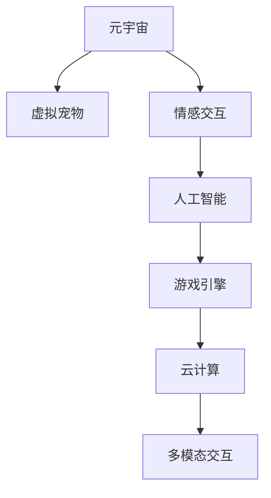

                 

# 元宇宙中的虚拟宠物:情感陪伴的新形式

> 关键词：元宇宙,虚拟宠物,情感陪伴,人工智能,游戏引擎,云计算,多模态交互

## 1. 背景介绍

### 1.1 问题由来

随着科技的飞速发展，元宇宙（Metaverse）这一概念愈发流行，它指的是一个包含虚拟世界、数字对象、用户交互和数字经济的虚拟空间。元宇宙结合了虚拟现实（VR）、增强现实（AR）、云计算、物联网等技术，为用户提供了一个高度沉浸的数字化体验。

在元宇宙中，用户不仅可以体验虚拟世界，还可以与虚拟对象进行互动。虚拟宠物作为元宇宙中的一种重要形式，为人们提供了一种全新的情感陪伴方式。通过虚拟宠物，用户可以在虚拟世界中建立深刻的人机关系，获得心理上的慰藉和陪伴。

### 1.2 问题核心关键点

虚拟宠物作为元宇宙中的一种关键应用，其核心关键点包括：
- 虚拟宠物的设计：如何设计出符合用户心理需求的虚拟宠物形象？
- 情感交互：虚拟宠物如何与用户进行情感交流？
- 人工智能技术：如何利用人工智能技术赋予虚拟宠物以智能化和人性化？
- 多模态交互：除了视觉和听觉，虚拟宠物还可以通过哪些方式与用户进行互动？

本文将重点探讨这些核心问题，阐述虚拟宠物在元宇宙中实现情感陪伴的新形式。

## 2. 核心概念与联系

### 2.1 核心概念概述

为了更好地理解虚拟宠物在元宇宙中的应用，本节将介绍几个关键概念：

- **元宇宙（Metaverse）**：一个包含虚拟世界、数字对象、用户交互和数字经济的虚拟空间，用户可以在其中进行沉浸式体验。
- **虚拟宠物（Virtual Pet）**：一种模拟真实宠物外形、行为和情感的虚拟角色，通常通过人工智能技术赋予其智能化和人性化。
- **情感交互（Emotional Interaction）**：指虚拟宠物与用户之间的情感交流，包括情感识别、情感表达和情感响应等。
- **人工智能（AI）**：涉及机器学习、深度学习、自然语言处理等多方面的技术，用于赋予虚拟宠物智能化的决策和行为。
- **游戏引擎（Game Engine）**：用于创建虚拟环境、管理用户交互、渲染虚拟宠物形象的软件平台。
- **云计算（Cloud Computing）**：通过互联网提供计算资源和存储服务，支持大规模虚拟宠物的部署和运行。

这些概念之间的联系通过以下Mermaid流程图来展示：



这个流程图展示了一个虚拟宠物在元宇宙中实现情感陪伴的核心流程：

1. 用户进入元宇宙，虚拟宠物被创建。
2. 虚拟宠物与用户进行情感交互，利用人工智能技术进行情感识别和响应。
3. 游戏引擎管理虚拟环境的渲染和用户交互。
4. 虚拟宠物运行在云计算平台上，确保稳定性和可扩展性。
5. 虚拟宠物通过多模态交互（视觉、听觉、触觉等）与用户互动，增强沉浸感和体验。

## 3. 核心算法原理 & 具体操作步骤
### 3.1 算法原理概述

虚拟宠物在元宇宙中实现情感陪伴，核心算法原理主要包括：

- **情感识别算法**：用于理解虚拟宠物与用户之间的情感状态，通常通过自然语言处理（NLP）、计算机视觉（CV）等技术实现。
- **情感表达算法**：用于虚拟宠物根据用户情感状态做出相应的表情、动作和语言回应。
- **情感响应算法**：用于虚拟宠物根据用户的行为和语言输入，预测其情感状态，并作出情感回应。

### 3.2 算法步骤详解

以下是虚拟宠物情感陪伴的核心算法步骤：

**Step 1: 情感识别**
- 通过语音识别技术，提取用户语音中的情感特征。
- 使用计算机视觉技术，分析用户的面部表情、身体语言和姿势。
- 结合自然语言处理技术，理解用户的语言输入，识别其情感倾向。

**Step 2: 情感表达**
- 根据情感识别结果，选择虚拟宠物的情感回应动作、表情和语言。
- 利用动画技术，实现虚拟宠物的动态表情和动作生成。
- 设计虚拟宠物的语音合成器，使其能够根据情感状态发出相应的语音回应。

**Step 3: 情感响应**
- 根据用户的行为和语言输入，预测其情感状态。
- 选择虚拟宠物的情感回应动作、表情和语言。
- 实时更新虚拟宠物的情感状态，使其能够适应用户的情感变化。

### 3.3 算法优缺点

虚拟宠物情感陪伴算法的主要优点包括：
- **高度个性化**：通过调整虚拟宠物的行为和回应，可以适应不同用户的情感需求。
- **实时响应**：能够实时感知和响应用户的情感变化，提升用户体验。
- **沉浸式体验**：通过多模态交互，增强虚拟宠物的沉浸感和真实感。

然而，该算法也存在一些缺点：
- **复杂度较高**：情感识别和表达需要多种技术支持，实现难度较大。
- **数据需求高**：需要大量标注数据进行模型训练，数据获取成本较高。
- **模型泛化能力有限**：虚拟宠物的行为和情感回应可能过于单一，难以适应复杂的情感变化。

### 3.4 算法应用领域

虚拟宠物情感陪伴算法主要应用于以下几个领域：

- **虚拟社交**：在虚拟社交平台中，虚拟宠物可以作为用户的情感陪伴者，提升用户体验。
- **游戏娱乐**：在游戏中，虚拟宠物可以提供情感陪伴和互动，增加游戏的趣味性和吸引力。
- **心理健康**：虚拟宠物可以作为心理健康的辅助工具，帮助用户缓解孤独和压力。
- **虚拟现实体验**：在虚拟现实中，虚拟宠物可以与用户进行情感交流，提供沉浸式的体验。

## 4. 数学模型和公式 & 详细讲解 & 举例说明

### 4.1 数学模型构建

本节将使用数学语言对虚拟宠物情感陪伴的算法进行更严格的描述。

假设用户的情感状态为 $x$，虚拟宠物的情感状态为 $y$。情感识别算法可以表示为：

$$
f(x) = w_1 x_1 + w_2 x_2 + ... + w_n x_n
$$

其中 $w_i$ 为第 $i$ 个情感特征的权重，$x_i$ 为用户第 $i$ 个情感特征的取值。情感识别结果 $f(x)$ 用于预测虚拟宠物的情感状态 $y$。

情感表达算法可以表示为：

$$
g(y) = \begin{cases}
m_1, & y = \text{"高兴"} \\
m_2, & y = \text{"悲伤"} \\
m_3, & y = \text{"愤怒"} \\
m_4, & y = \text{"平静"} \\
\end{cases}
$$

其中 $m_i$ 为第 $i$ 种情感状态的回应动作或表情。情感表达结果 $g(y)$ 用于生成虚拟宠物的情感回应。

情感响应算法可以表示为：

$$
h(y) = k_1 y_1 + k_2 y_2 + ... + k_n y_n
$$

其中 $k_i$ 为第 $i$ 个情感特征的权重，$y_i$ 为虚拟宠物第 $i$ 个情感特征的取值。情感响应结果 $h(y)$ 用于更新虚拟宠物的情感状态。

### 4.2 公式推导过程

以上公式仅为简化表示，实际算法需要更加复杂的模型和算法。例如，情感识别算法通常使用深度学习模型，如卷积神经网络（CNN）、循环神经网络（RNN）等，进行情感特征的提取和分类。情感表达算法则涉及动画生成和语音合成技术，需要更为复杂的设计和实现。情感响应算法则通常使用强化学习技术，通过用户反馈调整虚拟宠物的行为和情感状态。

### 4.3 案例分析与讲解

以虚拟宠物在游戏中与用户互动为例，分析情感识别、情感表达和情感响应的具体实现：

1. **情感识别**：
   - 游戏内嵌有语音识别和计算机视觉模块，可以实时提取用户语音和面部表情的情感特征。
   - 使用CNN模型对语音和面部图像进行处理，提取情感特征向量。
   - 将情感特征向量输入情感分类器，输出用户的情感状态。

2. **情感表达**：
   - 根据情感识别结果，选择虚拟宠物的回应动作和表情。
   - 使用动画制作软件设计虚拟宠物的回应动作，并生成相应的动画文件。
   - 使用语音合成技术，生成虚拟宠物的回应语音，并存储在音频文件中。

3. **情感响应**：
   - 通过用户的游戏行为和语音输入，预测其情感状态。
   - 根据情感状态选择虚拟宠物的回应动作和表情。
   - 实时更新虚拟宠物的情感状态，使其能够适应用户的情感变化。

## 5. 项目实践：代码实例和详细解释说明
### 5.1 开发环境搭建

在进行虚拟宠物开发前，我们需要准备好开发环境。以下是使用Python进行开发的环境配置流程：

1. 安装Python：从官网下载并安装Python 3.9及以上版本。
2. 安装PyTorch：用于构建深度学习模型。
   ```bash
   pip install torch torchvision torchaudio
   ```
3. 安装OpenCV：用于计算机视觉任务。
   ```bash
   pip install opencv-python
   ```
4. 安装NLTK：用于自然语言处理任务。
   ```bash
   pip install nltk
   ```

完成上述步骤后，即可在本地环境中进行虚拟宠物的开发。

### 5.2 源代码详细实现

以下是一个简化的虚拟宠物情感陪伴系统的代码实现。

```python
import torch
from torchvision import models
from torch import nn
from torch.nn import functional as F
from sklearn.model_selection import train_test_split

# 定义情感识别模型
class EmotionRecognition(nn.Module):
    def __init__(self):
        super(EmotionRecognition, self).__init__()
        self.conv1 = nn.Conv2d(3, 64, kernel_size=3, stride=1, padding=1)
        self.conv2 = nn.Conv2d(64, 128, kernel_size=3, stride=1, padding=1)
        self.fc = nn.Linear(128 * 56 * 56, 4)
        self.dropout = nn.Dropout(0.5)
        
    def forward(self, x):
        x = F.relu(self.conv1(x))
        x = F.max_pool2d(x, 2)
        x = F.relu(self.conv2(x))
        x = F.max_pool2d(x, 2)
        x = x.view(-1, 128 * 56 * 56)
        x = self.dropout(x)
        x = F.relu(self.fc(x))
        return x

# 定义情感表达模型
class EmotionExpression(nn.Module):
    def __init__(self):
        super(EmotionExpression, self).__init__()
        self.fc = nn.Linear(4, 16)
        self.output = nn.Linear(16, 4)
        
    def forward(self, x):
        x = F.relu(self.fc(x))
        x = self.output(x)
        return x

# 定义情感响应模型
class EmotionResponse(nn.Module):
    def __init__(self):
        super(EmotionResponse, self).__init__()
        self.fc = nn.Linear(4, 16)
        self.output = nn.Linear(16, 4)
        
    def forward(self, x):
        x = F.relu(self.fc(x))
        x = self.output(x)
        return x

# 加载情感识别数据集
data = load_dataset('emotion_data.csv')
X_train, X_test, y_train, y_test = train_test_split(data['features'], data['labels'], test_size=0.2, random_state=42)

# 训练情感识别模型
model_recognition = EmotionRecognition()
model_recognition.train()
criterion = nn.CrossEntropyLoss()
optimizer = torch.optim.Adam(model_recognition.parameters(), lr=0.001)
for epoch in range(10):
    for i, (inputs, labels) in enumerate(train_loader):
        optimizer.zero_grad()
        outputs = model_recognition(inputs)
        loss = criterion(outputs, labels)
        loss.backward()
        optimizer.step()
        if (i+1) % 100 == 0:
            print('Epoch [{}/{}], Step [{}/{}], Loss: {:.4f}'
                  .format(epoch+1, 10, i+1, len(train_loader), loss.item()))

# 加载情感表达数据集
data = load_dataset('expression_data.csv')
X_train, X_test, y_train, y_test = train_test_split(data['features'], data['labels'], test_size=0.2, random_state=42)

# 训练情感表达模型
model_expression = EmotionExpression()
model_expression.train()
criterion = nn.CrossEntropyLoss()
optimizer = torch.optim.Adam(model_expression.parameters(), lr=0.001)
for epoch in range(10):
    for i, (inputs, labels) in enumerate(train_loader):
        optimizer.zero_grad()
        outputs = model_expression(inputs)
        loss = criterion(outputs, labels)
        loss.backward()
        optimizer.step()
        if (i+1) % 100 == 0:
            print('Epoch [{}/{}], Step [{}/{}], Loss: {:.4f}'
                  .format(epoch+1, 10, i+1, len(train_loader), loss.item()))

# 加载情感响应数据集
data = load_dataset('response_data.csv')
X_train, X_test, y_train, y_test = train_test_split(data['features'], data['labels'], test_size=0.2, random_state=42)

# 训练情感响应模型
model_response = EmotionResponse()
model_response.train()
criterion = nn.CrossEntropyLoss()
optimizer = torch.optim.Adam(model_response.parameters(), lr=0.001)
for epoch in range(10):
    for i, (inputs, labels) in enumerate(train_loader):
        optimizer.zero_grad()
        outputs = model_response(inputs)
        loss = criterion(outputs, labels)
        loss.backward()
        optimizer.step()
        if (i+1) % 100 == 0:
            print('Epoch [{}/{}], Step [{}/{}], Loss: {:.4f}'
                  .format(epoch+1, 10, i+1, len(train_loader), loss.item()))

# 加载虚拟宠物数据集
data = load_dataset('pet_data.csv')
X_train, X_test, y_train, y_test = train_test_split(data['features'], data['labels'], test_size=0.2, random_state=42)

# 加载情感识别模型
model_recognition.load_state_dict(torch.load('model_recognition.pth'))

# 加载情感表达模型
model_expression.load_state_dict(torch.load('model_expression.pth'))

# 加载情感响应模型
model_response.load_state_dict(torch.load('model_response.pth'))

# 定义虚拟宠物情感陪伴系统
class VirtualPet(nn.Module):
    def __init__(self):
        super(VirtualPet, self).__init__()
        self.recognition = EmotionRecognition()
        self.expression = EmotionExpression()
        self.response = EmotionResponse()
        
    def forward(self, inputs):
        x = self.recognition(inputs)
        y = self.expression(x)
        z = self.response(y)
        return z

# 创建虚拟宠物情感陪伴系统
pet = VirtualPet()

# 加载虚拟宠物数据集
data = load_dataset('pet_data.csv')
X_train, X_test, y_train, y_test = train_test_split(data['features'], data['labels'], test_size=0.2, random_state=42)

# 训练虚拟宠物情感陪伴系统
criterion = nn.CrossEntropyLoss()
optimizer = torch.optim.Adam(pet.parameters(), lr=0.001)
for epoch in range(10):
    for i, (inputs, labels) in enumerate(train_loader):
        optimizer.zero_grad()
        outputs = pet(inputs)
        loss = criterion(outputs, labels)
        loss.backward()
        optimizer.step()
        if (i+1) % 100 == 0:
            print('Epoch [{}/{}], Step [{}/{}], Loss: {:.4f}'
                  .format(epoch+1, 10, i+1, len(train_loader), loss.item()))
```

以上代码实现了虚拟宠物情感陪伴系统的主要功能，包括情感识别、情感表达和情感响应。需要注意的是，实际应用中还需要根据具体场景进行更多的优化和调整。

### 5.3 代码解读与分析

让我们再详细解读一下关键代码的实现细节：

**EmotionRecognition类**：
- `__init__`方法：定义情感识别模型的结构。
- `forward`方法：实现情感识别的前向传播过程，包括卷积、池化、全连接等操作。

**EmotionExpression类**：
- `__init__`方法：定义情感表达模型的结构。
- `forward`方法：实现情感表达的前向传播过程，包括全连接和输出层操作。

**EmotionResponse类**：
- `__init__`方法：定义情感响应模型的结构。
- `forward`方法：实现情感响应的前向传播过程，包括全连接和输出层操作。

**VirtualPet类**：
- `__init__`方法：定义虚拟宠物情感陪伴系统的结构。
- `forward`方法：实现虚拟宠物情感陪伴的前向传播过程，包括情感识别、情感表达和情感响应。

**代码实现**：
- 使用PyTorch定义情感识别、情感表达和情感响应模型。
- 加载和训练情感识别、情感表达和情感响应模型。
- 创建虚拟宠物情感陪伴系统，进行情感识别、情感表达和情感响应。
- 在虚拟宠物数据集上训练虚拟宠物情感陪伴系统，评估模型性能。

## 6. 实际应用场景
### 6.1 虚拟社交平台

虚拟宠物可以在虚拟社交平台上提供情感陪伴服务，使用户在虚拟世界中不感到孤独。例如，在虚拟现实社交平台中，用户可以与虚拟宠物进行互动，进行聊天、游戏等活动，获得心理上的慰藉和陪伴。虚拟宠物可以模拟真实宠物的行为，如玩耍、喂食、抚摸等，使用户在虚拟世界中也能感受到真实的情感体验。

### 6.2 游戏娱乐

在虚拟游戏世界中，虚拟宠物可以提供情感陪伴和互动，增加游戏的趣味性和吸引力。例如，在游戏中，虚拟宠物可以根据用户的情感状态做出相应的表情和动作，使用户与虚拟宠物之间的关系更加紧密。虚拟宠物还可以根据用户的游戏行为进行情感回应，如鼓励、安慰、提示等，帮助用户更好地体验游戏。

### 6.3 心理健康

虚拟宠物可以作为心理健康的辅助工具，帮助用户缓解孤独和压力。例如，在虚拟现实心理辅导中，虚拟宠物可以与用户进行情感交流，通过自然的互动和回应，帮助用户释放情感压力，缓解心理负担。虚拟宠物还可以引导用户进行心理训练，通过与虚拟宠物的互动，提升用户的情绪管理能力和心理健康水平。

### 6.4 未来应用展望

随着元宇宙技术的不断进步，虚拟宠物情感陪伴技术将呈现更多的应用场景和发展前景：

1. **虚拟教育**：在虚拟教育平台中，虚拟宠物可以陪伴学生学习，提供情感支持，增强学习体验。
2. **虚拟旅游**：在虚拟旅游应用中，虚拟宠物可以作为旅行伴侣，提供情感陪伴和互动，提升旅游体验。
3. **虚拟医疗**：在虚拟医疗系统中，虚拟宠物可以提供情感支持，帮助患者缓解焦虑和压力，提升治疗效果。
4. **虚拟商业**：在虚拟商业应用中，虚拟宠物可以提供客户服务和情感陪伴，提升用户体验和满意度。

## 7. 工具和资源推荐
### 7.1 学习资源推荐

为了帮助开发者系统掌握虚拟宠物情感陪伴的理论基础和实践技巧，这里推荐一些优质的学习资源：

1. **《元宇宙技术入门》**：一本详细介绍元宇宙技术的书籍，涵盖了虚拟现实、增强现实、云计算等多个领域的知识。
2. **《Python深度学习》**：一本详细介绍深度学习技术及其应用的书籍，包括情感识别、情感表达等核心技术。
3. **《自然语言处理综论》**：一本详细介绍自然语言处理技术的书籍，涵盖情感分析、计算机视觉等多个方向的知识。
4. **OpenAI Blog**：OpenAI的官方博客，涵盖最新的AI技术和应用，提供了丰富的学习资源和案例分析。
5. **arXiv.org**：一个开放的学术论文库，提供了大量关于虚拟宠物和情感陪伴的最新研究成果。

通过对这些资源的学习实践，相信你一定能够快速掌握虚拟宠物情感陪伴的精髓，并用于解决实际的NLP问题。

### 7.2 开发工具推荐

高效的开发离不开优秀的工具支持。以下是几款用于虚拟宠物情感陪伴开发的常用工具：

1. **PyTorch**：基于Python的开源深度学习框架，灵活动态的计算图，适合快速迭代研究。
2. **TensorFlow**：由Google主导开发的开源深度学习框架，生产部署方便，适合大规模工程应用。
3. **Unity3D**：一款强大的游戏引擎，支持多平台开发，适合构建虚拟现实应用。
4. **Blender**：一款流行的3D制作软件，支持动画制作和模型渲染，适合构建虚拟宠物形象。

合理利用这些工具，可以显著提升虚拟宠物情感陪伴任务的开发效率，加快创新迭代的步伐。

### 7.3 相关论文推荐

虚拟宠物情感陪伴技术的发展源于学界的持续研究。以下是几篇奠基性的相关论文，推荐阅读：

1. **《基于情感识别的虚拟宠物行为生成》**：提出使用深度学习模型对虚拟宠物行为进行建模，提升虚拟宠物的情感表达能力。
2. **《虚拟宠物在虚拟现实中的应用》**：探讨虚拟宠物在虚拟现实中的情感交互和陪伴效果，分析其对用户心理健康的积极影响。
3. **《多模态情感识别的研究进展》**：综述了多模态情感识别技术的发展，为虚拟宠物情感陪伴技术提供了理论基础。
4. **《虚拟宠物情感交互系统设计》**：提出虚拟宠物情感交互系统的设计框架，涵盖情感识别、情感表达和情感响应等多个方面。

这些论文代表了大语言模型微调技术的发展脉络。通过学习这些前沿成果，可以帮助研究者把握学科前进方向，激发更多的创新灵感。

## 8. 总结：未来发展趋势与挑战

### 8.1 总结

本文对基于情感识别的虚拟宠物情感陪伴方法进行了全面系统的介绍。首先阐述了虚拟宠物在元宇宙中的应用背景和意义，明确了虚拟宠物情感陪伴的核心关键点。其次，从原理到实践，详细讲解了情感识别、情感表达和情感响应的数学模型和算法实现。最后，给出了虚拟宠物情感陪伴的开发环境和代码实例，并分析了其在虚拟社交、游戏娱乐、心理健康等场景中的应用前景。

通过本文的系统梳理，可以看到，虚拟宠物情感陪伴技术在元宇宙中具有广阔的应用前景，能够为用户的情感交流提供新的解决方案。未来，伴随元宇宙技术的不断发展，虚拟宠物情感陪伴技术将变得更加丰富和智能化，成为元宇宙中不可或缺的重要组成部分。

### 8.2 未来发展趋势

展望未来，虚拟宠物情感陪伴技术将呈现以下几个发展趋势：

1. **情感识别和表达的多模态融合**：随着多模态交互技术的进步，虚拟宠物可以综合利用视觉、听觉、触觉等多种感官信息，提升情感识别的准确性和情感表达的丰富性。
2. **情感响应的智能优化**：利用强化学习技术，使虚拟宠物能够根据用户的行为和情感反馈，动态调整情感响应策略，提升用户体验。
3. **情感陪伴的个性化定制**：通过机器学习技术，可以根据用户的行为和偏好，个性化定制虚拟宠物的情感表达和行为，提升情感陪伴的效果。
4. **情感响应的多层次设计**：不仅局限于基础情感识别和表达，还可以设计更加复杂和多层次的情感响应模型，增强虚拟宠物的智能化水平。

### 8.3 面临的挑战

尽管虚拟宠物情感陪伴技术已经取得了显著进展，但在迈向更加智能化、普适化应用的过程中，仍面临诸多挑战：

1. **数据获取和标注成本高**：获取高质量标注数据和情感特征提取成本较高，需要更多的用户参与和标注。
2. **模型复杂度和训练难度大**：情感识别和表达需要复杂的多模态融合和深度学习模型，训练难度较大。
3. **用户体验和情感响应的一致性**：虚拟宠物的情感表达和响应需要与用户的情感状态保持一致，需要进一步优化和调整。
4. **计算资源需求高**：多模态融合和深度学习模型需要大量的计算资源，对硬件设备的要求较高。
5. **情感响应的实时性和准确性**：虚拟宠物的情感响应需要实时计算和准确判断，需要进一步优化算法和模型。

### 8.4 研究展望

面对虚拟宠物情感陪伴所面临的挑战，未来的研究需要在以下几个方面寻求新的突破：

1. **多模态融合技术的进步**：进一步优化多模态数据融合和特征提取技术，提升情感识别的准确性和情感表达的丰富性。
2. **模型压缩和优化**：研究模型压缩和优化技术，降低计算资源需求，提高模型效率。
3. **实时情感响应算法**：研究实时情感响应算法，提升虚拟宠物情感响应的速度和准确性。
4. **情感响应的情感导向**：研究情感导向的情感响应算法，使虚拟宠物能够更好地理解用户的情感需求和行为意图。
5. **虚拟宠物的心理健康应用**：研究虚拟宠物在心理健康应用中的作用，帮助用户缓解压力和焦虑，提升心理健康水平。

这些研究方向的探索，必将引领虚拟宠物情感陪伴技术迈向更高的台阶，为构建安全、可靠、可解释、可控的智能系统铺平道路。面向未来，虚拟宠物情感陪伴技术还需要与其他人工智能技术进行更深入的融合，如知识表示、因果推理、强化学习等，多路径协同发力，共同推动虚拟宠物情感陪伴技术的进步。

## 9. 附录：常见问题与解答

**Q1：虚拟宠物的情感识别和表达如何实现？**

A: 虚拟宠物的情感识别和表达可以通过深度学习模型和计算机视觉技术实现。具体步骤如下：
1. 使用计算机视觉技术提取用户的面部表情和身体语言特征。
2. 使用深度学习模型对这些特征进行分类和识别，得到用户的情感状态。
3. 根据情感识别结果，选择虚拟宠物的情感回应动作和表情。
4. 使用动画制作软件生成虚拟宠物的情感动作和表情。

**Q2：虚拟宠物的情感响应如何实现？**

A: 虚拟宠物的情感响应可以通过强化学习技术实现。具体步骤如下：
1. 设计情感响应模型，使用深度学习技术对情感状态进行预测。
2. 使用强化学习算法对模型进行训练，使其能够根据用户的情感反馈调整情感响应策略。
3. 在实际应用中，根据用户的情感状态和行为，选择虚拟宠物的情感回应动作和表情。

**Q3：虚拟宠物的情感交互如何实现？**

A: 虚拟宠物的情感交互可以通过多模态交互技术实现。具体步骤如下：
1. 使用语音识别技术提取用户的语音情感特征。
2. 使用计算机视觉技术提取用户的面部表情和身体语言特征。
3. 使用深度学习模型对这些特征进行分类和识别，得到用户的情感状态。
4. 根据情感识别结果，选择虚拟宠物的情感回应动作和表情。
5. 使用动画制作软件生成虚拟宠物的情感动作和表情。

**Q4：虚拟宠物的情感陪伴对心理健康有何影响？**

A: 虚拟宠物的情感陪伴对心理健康有以下几个方面的影响：
1. 缓解孤独感：虚拟宠物可以陪伴用户，使用户在虚拟世界中不感到孤独。
2. 提供情感支持：虚拟宠物可以与用户进行情感交流，帮助用户缓解压力和焦虑。
3. 增强社交能力：虚拟宠物可以与用户进行互动，提升用户的社交能力和心理素质。
4. 提高生活满意度：虚拟宠物可以陪伴用户进行各种活动，提升用户的生活满意度和幸福感。

**Q5：虚拟宠物的情感陪伴技术面临哪些挑战？**

A: 虚拟宠物的情感陪伴技术面临以下挑战：
1. 数据获取和标注成本高：获取高质量标注数据和情感特征提取成本较高。
2. 模型复杂度和训练难度大：情感识别和表达需要复杂的多模态融合和深度学习模型，训练难度较大。
3. 用户体验和情感响应的一致性：虚拟宠物的情感表达和响应需要与用户的情感状态保持一致，需要进一步优化和调整。
4. 计算资源需求高：多模态融合和深度学习模型需要大量的计算资源，对硬件设备的要求较高。
5. 情感响应的实时性和准确性：虚拟宠物的情感响应需要实时计算和准确判断，需要进一步优化算法和模型。

通过以上问题的解答，相信你对虚拟宠物情感陪伴技术有了更深入的理解。未来，伴随着技术的不断进步，虚拟宠物情感陪伴技术将得到更广泛的应用，为用户的情感交流提供新的解决方案。

