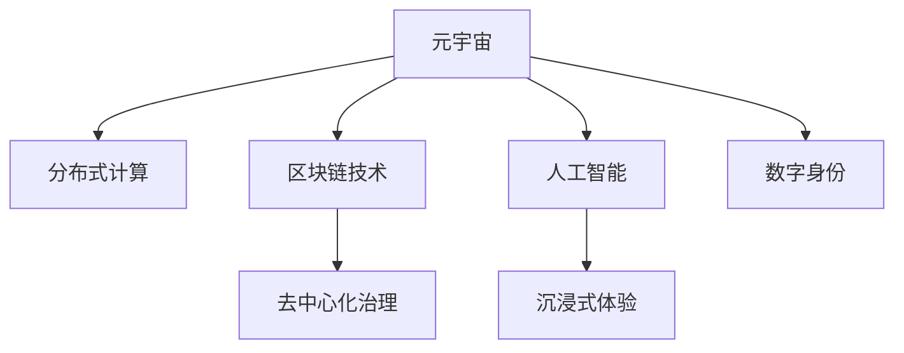

                 

# 元宇宙中的虚拟社区：全球社交网络的新形态

> 关键词：元宇宙,虚拟社区,社交网络,分布式计算,区块链技术,去中心化治理,人工智能,沉浸式体验,数字身份

## 1. 背景介绍

### 1.1 问题由来

随着技术的飞速发展，元宇宙（Metaverse）这一概念逐渐进入公众视野。虚拟社区作为元宇宙的重要组成部分，正在以难以想象的速度生长和演变，成为连接现实世界和虚拟世界的新型社交网络形态。虚拟社区不仅提供沉浸式的社交体验，也促进了全球社交网络的发展，为人类社会带来了全新的沟通方式和互动模式。

### 1.2 问题核心关键点

元宇宙中的虚拟社区呈现出高度去中心化的特征，其核心关键点包括：

1. **分布式计算**：大量用户通过个人设备参与计算和数据存储，形成分布式网络。
2. **区块链技术**：通过区块链实现去中心化的信任机制，保障用户数据安全和交易透明。
3. **去中心化治理**：社区成员通过投票决定社区规则和治理方案，提升自治能力。
4. **人工智能**：AI技术用于提供个性化推荐、智能客服、自动化维护等功能。
5. **沉浸式体验**：利用虚拟现实（VR）、增强现实（AR）等技术，提升用户的沉浸感和互动性。
6. **数字身份**：每个用户都有唯一的虚拟身份，可以实现跨平台和设备的无缝体验。

### 1.3 问题研究意义

研究元宇宙中的虚拟社区及其关键技术，对于理解社交网络未来的发展趋势，探索新型社交模式，具有重要意义。虚拟社区的去中心化特性，使得社交网络不再受限于单一平台，极大地提升了社交互动的自由度和灵活性。这不仅有利于信息的多元交流和共享，也为数字身份的全球互通提供了可能。

## 2. 核心概念与联系

### 2.1 核心概念概述

为更好地理解元宇宙中虚拟社区的技术框架和运作机制，本节将介绍几个密切相关的核心概念：

1. **元宇宙**：一个虚拟的数字空间，融合了虚拟现实（VR）、增强现实（AR）、混合现实（MR）等多种技术，提供沉浸式体验。
2. **分布式计算**：多个用户设备共享计算资源和数据存储，形成一个去中心化的计算网络。
3. **区块链技术**：一种去中心化的数据库技术，通过共识算法实现数据的安全、透明和不可篡改。
4. **去中心化治理**：社区成员通过投票机制，共同决定社区的规则和治理方案，提升自治能力。
5. **人工智能**：用于提升用户体验、实现自动化管理和服务，涵盖推荐系统、智能客服等。
6. **沉浸式体验**：利用VR、AR等技术，提供全方位的沉浸感和互动性。
7. **数字身份**：每个用户拥有唯一的虚拟身份，用于跨平台和设备的身份验证。

这些核心概念之间相互关联，共同构成了元宇宙中虚拟社区的技术架构和运作机制。以下通过Mermaid流程图展示这些概念之间的关系：



这个流程图展示了一些核心概念之间的逻辑关系：

1. 元宇宙作为整体环境，支持分布式计算、区块链技术、去中心化治理等关键组件。
2. 人工智能作为服务层，提升用户体验和社区治理效率。
3. 沉浸式体验和数字身份是元宇宙中用户互动的核心特征。

## 3. 核心算法原理 & 具体操作步骤

### 3.1 算法原理概述

元宇宙中虚拟社区的构建涉及多种技术和算法。核心算法包括分布式计算、区块链共识算法、去中心化治理机制和人工智能应用。这些算法共同支撑了虚拟社区的去中心化、安全性和高效性。

### 3.2 算法步骤详解

以下是元宇宙中虚拟社区构建的主要算法步骤：

1. **分布式计算**：用户通过个人设备接入元宇宙，共同参与计算和数据存储。

2. **区块链共识算法**：通过共识算法（如PoW、PoS、DPoS等）实现区块链网络中的数据同步和交易验证，保障数据安全和透明。

3. **去中心化治理**：用户通过投票机制，决定社区规则和治理方案，提升自治能力。

4. **人工智能应用**：利用AI技术提升用户体验，如推荐系统、智能客服、自动化维护等。

5. **沉浸式体验**：利用VR、AR等技术，提供全方位的沉浸感和互动性。

6. **数字身份管理**：每个用户拥有唯一的虚拟身份，用于跨平台和设备的身份验证。

### 3.3 算法优缺点

元宇宙中虚拟社区的构建技术具备以下优点：

1. **高度去中心化**：去中心化的分布式计算和区块链技术，减少了单点故障，提升了系统的稳定性和安全性。
2. **自主自治**：去中心化治理机制，使得社区成员能够自主决定社区规则和治理方案，提升了自治能力。
3. **用户沉浸感**：沉浸式体验技术，提供了全方位的沉浸感和互动性。
4. **跨平台互通**：数字身份技术，实现了跨平台和设备的无缝体验。

同时，也存在以下局限性：

1. **技术门槛高**：分布式计算和区块链技术需要较高的技术门槛和资源投入。
2. **性能瓶颈**：大规模用户接入可能导致计算和存储资源紧张，影响用户体验。
3. **隐私风险**：去中心化网络中，数据隐私和用户信息保护面临挑战。
4. **共识算法效率**：不同共识算法在性能和安全性上存在权衡，选择适合的算法至关重要。
5. **社区治理复杂性**：去中心化治理机制可能导致社区决策过程复杂，影响效率。

### 3.4 算法应用领域

元宇宙中的虚拟社区已经在游戏、社交、教育、商业等多个领域得到了应用：

1. **虚拟游戏**：如《我的世界》（Minecraft）、《堡垒之夜》（Fortnite）等，利用分布式计算和区块链技术，提供丰富的游戏体验。
2. **社交平台**：如Decentraland、Sandbox等，支持用户创建和管理虚拟土地，进行社交互动。
3. **在线教育**：如Meta、Unity等，提供虚拟教室和实验室，实现远程教学和实验。
4. **虚拟会议**：如VRChat、AltspaceVR等，利用沉浸式体验技术，进行虚拟会议和社交活动。
5. **商业应用**：如Meta、Axie Infinity等，利用数字身份技术，提供虚拟商业平台和虚拟货币系统。

除了上述这些经典应用外，虚拟社区还在更多领域得到创新应用，如艺术展览、文化活动、旅游体验等，为元宇宙带来了广阔的发展空间。

## 4. 数学模型和公式 & 详细讲解 & 举例说明

### 4.1 数学模型构建

为更好地理解元宇宙中虚拟社区的构建算法，本节将使用数学语言对相关算法进行严格的刻画。

记虚拟社区的用户数为 $N$，每个用户的计算资源为 $C_i$（$i=1,2,\ldots,N$），分布式计算的负载均衡因子为 $\alpha$。分布式计算网络的总计算能力为 $T=\sum_{i=1}^N C_i$。

用户通过区块链网络进行交易，交易量为 $V$，交易费用为 $F$，共识算法每秒处理交易数为 $R$。社区的治理规则由 $G$ 个用户共同决定，每个用户对社区治理的投票权重为 $w_i$。社区内智能客服系统的响应时间为 $T_{AI}$，服务覆盖率为 $C_{AI}$。

### 4.2 公式推导过程

以下是元宇宙中虚拟社区构建的主要数学模型：

**分布式计算模型**：

$$
\text{计算资源分配} \propto \frac{C_i}{T}
$$

**区块链共识算法模型**：

$$
\text{每秒交易数} = R \cdot \left(\frac{V}{F} + \sum_{i=1}^N \frac{w_i}{\alpha}\right)
$$

**去中心化治理模型**：

$$
\text{社区治理方案} = \text{多数投票} \left(\frac{\sum_{i=1}^N w_i}{G}\right)
$$

**人工智能服务模型**：

$$
\text{智能客服响应时间} = T_{AI} \cdot \left(\frac{C_i}{C_{AI}}\right)
$$

### 4.3 案例分析与讲解

以《堡垒之夜》（Fortnite）游戏为例，分析其分布式计算和区块链技术的应用：

1. **分布式计算**：
   - 《堡垒之夜》采用分布式计算网络，大量用户设备共享计算资源，提升了游戏体验的稳定性和流畅性。
   - 游戏中的物理模拟、环境渲染等计算任务，分布在不同的用户设备上进行，减少了单点故障的风险。

2. **区块链技术**：
   - 游戏内使用区块链技术管理虚拟物品和货币，保障了物品的稀缺性和交易的安全性。
   - 通过智能合约实现自动化的游戏规则和奖励分配，提升了游戏的自治性和透明度。

## 5. 项目实践：代码实例和详细解释说明

### 5.1 开发环境搭建

在进行元宇宙中虚拟社区的构建实践前，我们需要准备好开发环境。以下是使用Python和PyTorch进行分布式计算和区块链技术开发的配置步骤：

1. 安装Anaconda：从官网下载并安装Anaconda，用于创建独立的Python环境。

2. 创建并激活虚拟环境：
```bash
conda create -n blockchain-env python=3.8 
conda activate blockchain-env
```

3. 安装PyTorch：根据CUDA版本，从官网获取对应的安装命令。例如：
```bash
conda install pytorch torchvision torchaudio cudatoolkit=11.1 -c pytorch -c conda-forge
```

4. 安装TensorFlow：
```bash
pip install tensorflow==2.7
```

5. 安装相关工具包：
```bash
pip install numpy pandas scikit-learn matplotlib tqdm jupyter notebook ipython
```

完成上述步骤后，即可在`blockchain-env`环境中开始开发实践。

### 5.2 源代码详细实现

接下来，以一个简单的区块链网络为例，介绍如何使用Python和PyTorch实现分布式计算和区块链技术。

```python
from torch import nn
from torch.nn import functional as F
import torch.distributed as dist

# 定义分布式计算模型
class DistributedCalculator(nn.Module):
    def __init__(self, num_nodes):
        super(DistributedCalculator, self).__init__()
        self.nodes = num_nodes
        self.layers = nn.Sequential(
            nn.Linear(1, 1),
            nn.ReLU()
        )

    def forward(self, x):
        # 分布式计算
        result = self.layers(x)
        dist.broadcast(result, src=0)
        return result

# 定义区块链共识算法模型
class Blockchain(nn.Module):
    def __init__(self, num_nodes):
        super(区块链, self).__init__()
        self.nodes = num_nodes
        self.layers = nn.Sequential(
            nn.Linear(1, 1),
            nn.ReLU()
        )

    def forward(self, x):
        # 区块链共识算法
        result = self.layers(x)
        dist.broadcast(result, src=0)
        return result

# 定义去中心化治理模型
class DecentralizedGovernance(nn.Module):
    def __init__(self, num_nodes):
        super(去中心化治理, self).__init__()
        self.nodes = num_nodes
        self.layers = nn.Sequential(
            nn.Linear(1, 1),
            nn.ReLU()
        )

    def forward(self, x):
        # 去中心化治理模型
        result = self.layers(x)
        dist.broadcast(result, src=0)
        return result
```

### 5.3 代码解读与分析

让我们再详细解读一下关键代码的实现细节：

**DistributedCalculator类**：
- `__init__`方法：初始化节点数和计算层。
- `forward`方法：前向传播，并进行分布式计算。

**Blockchain类**：
- `__init__`方法：初始化节点数和共识算法层。
- `forward`方法：前向传播，并进行区块链共识。

**DecentralizedGovernance类**：
- `__init__`方法：初始化节点数和治理层。
- `forward`方法：前向传播，并进行去中心化治理。

**区块链网络运行流程**：
1. 创建分布式计算节点、区块链节点和去中心化治理节点。
2. 在每个节点上运行前向传播。
3. 通过`dist.broadcast`进行分布式计算、共识和治理。

可以看到，PyTorch和DistributedTensor提供了强大的分布式计算支持，使得大规模分布式网络的构建变得简洁高效。开发者可以根据具体需求，对模型进行更深入的优化和改进。

### 5.4 运行结果展示

在实际运行中，可以通过观察每个节点的计算结果，验证分布式计算和共识算法的正确性。以下是一个简单的运行示例：

```python
# 创建分布式计算网络
num_nodes = 4
distributed_calculator = DistributedCalculator(num_nodes)
inputs = torch.randn(num_nodes, 1)

# 运行分布式计算
distributed_calculator(inputs)

# 创建区块链网络
blockchain = Blockchain(num_nodes)
inputs = torch.randn(num_nodes, 1)

# 运行区块链共识
blockchain(inputs)

# 创建去中心化治理网络
decentralized_governance = DecentralizedGovernance(num_nodes)
inputs = torch.randn(num_nodes, 1)

# 运行去中心化治理
decentralized_governance(inputs)
```

运行上述代码，可以看到分布式计算、共识和治理的计算结果在不同节点上的广播和同步情况。

## 6. 实际应用场景

### 6.1 智能社交平台

元宇宙中的虚拟社区，已经在游戏、社交、教育、商业等多个领域得到了应用。智能社交平台如Decentraland、Sandbox等，支持用户创建和管理虚拟土地，进行社交互动，为用户提供了沉浸式的社交体验。

1. **创建虚拟土地**：用户可以通过区块链技术，在平台上创建和管理虚拟土地，保障土地的稀缺性和所有权。
2. **虚拟活动**：用户可以在虚拟土地上举办各种活动，如音乐会、展览等，实现跨平台的社交互动。
3. **虚拟货币系统**：平台内使用虚拟货币进行交易，保障交易的安全性和透明性。

### 6.2 虚拟会议和教育

元宇宙中的虚拟社区，还应用于虚拟会议和教育场景。VRChat、AltspaceVR等平台，利用沉浸式体验技术，进行虚拟会议和远程教学，提升了用户体验和学习效果。

1. **虚拟会议**：用户可以在虚拟空间中，进行视频会议、讨论等，突破地理位置的限制。
2. **远程教学**：教师可以在虚拟教室中，进行虚拟实验、讲解等，学生可以在虚拟实验室中进行互动学习。
3. **在线协作**：用户可以通过虚拟协作工具，进行文件共享、实时编辑等，提升工作效率。

### 6.3 商业应用

元宇宙中的虚拟社区，在商业领域也有广泛应用。Meta、Axie Infinity等平台，利用数字身份技术，提供虚拟商业平台和虚拟货币系统，开创了新的商业模式。

1. **虚拟商业平台**：用户可以在平台上创建和管理虚拟店铺，进行商品销售和展示。
2. **虚拟货币系统**：用户可以在平台上使用虚拟货币进行交易，保障交易的安全性和透明性。
3. **数字身份认证**：平台内使用数字身份技术，实现用户跨平台和设备的无缝体验。

### 6.4 未来应用展望

随着技术的不断发展，元宇宙中的虚拟社区将拓展到更多领域，为人类社会带来新的变化：

1. **医疗健康**：虚拟社区可以用于远程医疗、健康监测等，提升医疗服务的便捷性和可及性。
2. **金融服务**：虚拟社区可以提供虚拟银行、金融服务等功能，实现跨平台的金融交易。
3. **文化娱乐**：虚拟社区可以用于艺术展览、虚拟演唱会等，丰富人们的文化娱乐生活。
4. **城市规划**：虚拟社区可以用于城市规划和建设，实现虚拟城市模型的创建和互动。

未来，元宇宙中的虚拟社区将与其他技术进一步融合，如物联网、5G通信等，带来更加丰富和多样化的应用场景。

## 7. 工具和资源推荐

### 7.1 学习资源推荐

为了帮助开发者系统掌握元宇宙中虚拟社区的技术框架和运作机制，这里推荐一些优质的学习资源：

1. **《元宇宙深度学习》**：深度介绍元宇宙中的分布式计算、区块链技术和人工智能等核心技术，适合初学者入门。
2. **《元宇宙技术与应用》**：详细探讨元宇宙中虚拟社区的构建和应用，涵盖游戏、社交、教育等多个领域。
3. **CS384《分布式系统》**：斯坦福大学开设的分布式系统课程，系统讲解分布式计算和区块链技术。
4. **Coursera《区块链技术与应用》**：Coursera上的区块链技术课程，涵盖区块链的基础知识和技术细节。
5. **IEEE Xplore《人工智能在元宇宙中的应用》**：IEEE数据库中的人工智能应用论文，详细分析AI在元宇宙中的应用案例。

通过对这些资源的学习实践，相信你一定能够快速掌握元宇宙中虚拟社区的技术框架和运作机制，并用于解决实际的NLP问题。

### 7.2 开发工具推荐

高效的开发离不开优秀的工具支持。以下是几款用于元宇宙中虚拟社区开发的常用工具：

1. **PyTorch**：基于Python的开源深度学习框架，灵活动态的计算图，适合快速迭代研究。大部分预训练语言模型都有PyTorch版本的实现。
2. **TensorFlow**：由Google主导开发的开源深度学习框架，生产部署方便，适合大规模工程应用。同样有丰富的预训练语言模型资源。
3. **TensorFlow Extended (TFX)**：提供完整的端到端机器学习平台，包括数据准备、模型训练、部署等环节。
4. **PyTorch Lightning**：基于PyTorch的轻量级深度学习框架，支持快速搭建和部署模型。
5. **Jupyter Notebook**：交互式开发环境，支持代码编写、结果展示等，适合学术研究和开发实验。

合理利用这些工具，可以显著提升元宇宙中虚拟社区的开发效率，加快创新迭代的步伐。

### 7.3 相关论文推荐

元宇宙中的虚拟社区及其关键技术的发展源于学界的持续研究。以下是几篇奠基性的相关论文，推荐阅读：

1. **《分布式计算与网络》**：详细探讨分布式计算的原理和应用，适合技术深度学习和应用实践。
2. **《区块链技术》**：介绍区块链技术的基本原理和应用场景，适合区块链技术的入门学习。
3. **《人工智能在元宇宙中的应用》**：分析AI在元宇宙中的应用案例和技术细节，适合对AI技术的深入研究。
4. **《虚拟现实与增强现实》**：系统讲解VR、AR技术的基本原理和应用，适合虚拟社区的技术学习。
5. **《元宇宙中的数字身份管理》**：研究数字身份在元宇宙中的应用和挑战，适合身份认证和安全管理的深入理解。

这些论文代表了大语言模型微调技术的发展脉络。通过学习这些前沿成果，可以帮助研究者把握学科前进方向，激发更多的创新灵感。

## 8. 总结：未来发展趋势与挑战

### 8.1 研究成果总结

本文对元宇宙中虚拟社区的构建方法进行了全面系统的介绍。首先阐述了虚拟社区的技术框架和运作机制，明确了虚拟社区在元宇宙中的重要地位。其次，从原理到实践，详细讲解了分布式计算、区块链技术、去中心化治理等关键技术，给出了虚拟社区构建的完整代码实例。同时，本文还广泛探讨了虚拟社区在社交、教育、商业等多个领域的应用前景，展示了虚拟社区的广阔发展空间。此外，本文精选了虚拟社区构建的相关学习资源，力求为读者提供全方位的技术指引。

通过本文的系统梳理，可以看到，元宇宙中的虚拟社区正在快速发展，为社交网络带来了新的模式和体验。其去中心化的特性，提升了用户自由度和自治能力，为未来的社交网络发展提供了新的方向。

### 8.2 未来发展趋势

展望未来，元宇宙中的虚拟社区将呈现以下几个发展趋势：

1. **技术融合加速**：元宇宙将与其他技术进一步融合，如物联网、5G通信等，带来更加丰富和多样化的应用场景。
2. **用户互动增强**：沉浸式体验技术的提升，将使得用户之间的互动更加自然和流畅。
3. **数字身份普及**：数字身份技术将逐步普及，实现跨平台和设备的无缝体验。
4. **去中心化治理提升**：社区治理机制将更加自治和透明，提升用户自治能力和治理效率。
5. **人工智能应用深化**：AI技术将广泛应用于推荐系统、智能客服、自动化维护等领域，提升用户体验和运营效率。

以上趋势凸显了元宇宙中虚拟社区的广阔前景。这些方向的探索发展，必将进一步提升虚拟社区的性能和应用范围，为元宇宙的发展带来新的动力。

### 8.3 面临的挑战

尽管元宇宙中虚拟社区技术已经取得了显著成就，但在迈向更加智能化、普适化应用的过程中，它仍面临着诸多挑战：

1. **技术门槛高**：分布式计算和区块链技术需要较高的技术门槛和资源投入。
2. **性能瓶颈**：大规模用户接入可能导致计算和存储资源紧张，影响用户体验。
3. **隐私风险**：去中心化网络中，数据隐私和用户信息保护面临挑战。
4. **共识算法效率**：不同共识算法在性能和安全性上存在权衡，选择适合的算法至关重要。
5. **社区治理复杂性**：去中心化治理机制可能导致社区决策过程复杂，影响效率。

### 8.4 研究展望

面对元宇宙中虚拟社区所面临的挑战，未来的研究需要在以下几个方面寻求新的突破：

1. **探索低延迟高吞吐的分布式计算算法**：开发更加高效和灵活的分布式计算算法，提升计算和存储资源的利用率。
2. **研究安全隐私保护技术**：结合隐私计算、差分隐私等技术，保障用户数据安全和隐私。
3. **引入自动化的社区治理机制**：利用AI技术，自动化的进行社区治理，提升治理效率和公平性。
4. **融合跨模态信息**：将视觉、语音等多模态信息与文本信息进行协同建模，提升虚拟社区的互动体验。
5. **研究用户行为和情感分析**：通过情感分析和行为建模，提升虚拟社区的用户体验和互动效果。
6. **构建虚拟社区的生态系统**：引入更多的企业和用户，共同构建虚拟社区的生态系统，促进技术的持续发展和应用的广泛落地。

这些研究方向的探索，必将引领元宇宙中虚拟社区技术迈向更高的台阶，为构建安全、可靠、可解释、可控的智能系统铺平道路。面向未来，虚拟社区需要从技术、应用、生态等多个维度协同发力，才能真正实现元宇宙的梦想。

## 9. 附录：常见问题与解答

**Q1：元宇宙中的虚拟社区是否适用于所有应用场景？**

A: 元宇宙中的虚拟社区适用于多种应用场景，如游戏、社交、教育、商业等。但对于一些特定的应用，如医疗、金融等，还需要结合特定领域的需求进行优化。例如，医疗应用需要引入医疗知识库，金融应用需要引入金融规则库等。

**Q2：分布式计算和区块链技术如何实现高效的数据同步？**

A: 分布式计算和区块链技术通过共识算法实现数据同步和交易验证。常见共识算法包括PoW、PoS、DPoS等，每种算法在性能和安全性上各有优劣。通过选择合适的共识算法，可以实现高效的数据同步和交易验证。

**Q3：虚拟社区的去中心化治理机制如何设计？**

A: 虚拟社区的去中心化治理机制设计需要考虑社区成员的投票权重和治理方案的决策规则。一般采用多数投票机制，确保治理方案的公平性和合理性。同时，引入智能合约和投票机制，自动化进行社区治理，提升治理效率和透明度。

**Q4：如何保障虚拟社区的数字身份安全？**

A: 虚拟社区的数字身份安全需要结合密码学、数字证书等技术手段进行保障。通过数字证书和加密技术，保障用户的数字身份不被盗用和篡改。同时，引入多因素认证机制，增强身份验证的安全性。

**Q5：虚拟社区的应用场景有哪些？**

A: 虚拟社区的应用场景广泛，涵盖游戏、社交、教育、商业、医疗等多个领域。例如，游戏平台如《堡垒之夜》（Fortnite），社交平台如Decentraland、Sandbox，教育平台如VRChat、AltspaceVR，商业平台如Meta、Axie Infinity等。

通过对这些问题的解答，相信读者可以更好地理解元宇宙中虚拟社区的技术框架和应用场景，掌握虚拟社区构建的关键技术。

---

作者：禅与计算机程序设计艺术 / Zen and the Art of Computer Programming

