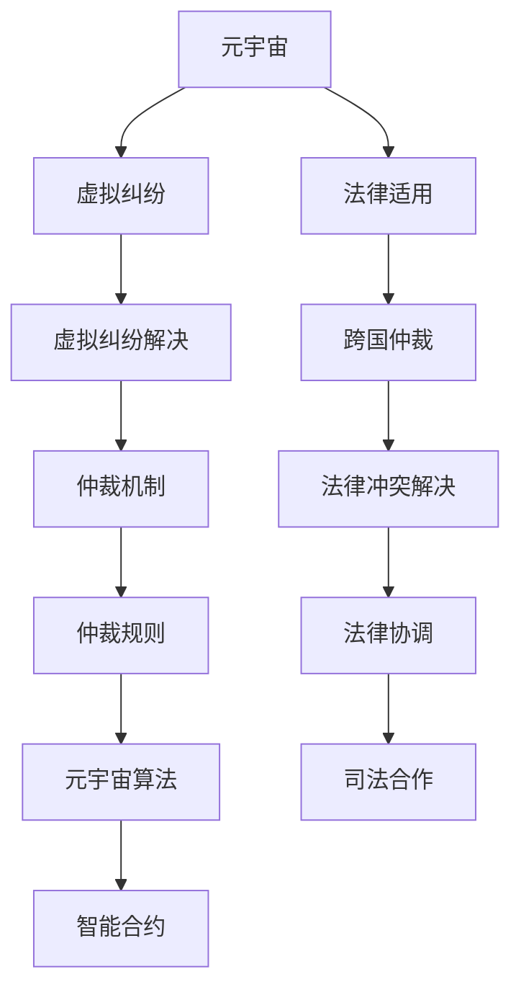

                 

# 元宇宙仲裁法:跨国虚拟纠纷的法律适用规则

> 关键词：元宇宙,虚拟纠纷,法律适用,跨国仲裁,算法原理

## 1. 背景介绍

### 1.1 问题由来
随着元宇宙技术的发展，虚拟世界的社会属性和经济活动日益丰富。在虚拟世界中，用户之间会发生各种类型的纠纷，如虚拟财产纠纷、虚拟侵权纠纷、虚拟合同纠纷等。与现实世界类似，这些虚拟纠纷需要仲裁解决，而传统的仲裁方式已经无法适应元宇宙的跨国属性。因此，如何构建适应元宇宙的仲裁法体系，成为了当前亟待解决的问题。

### 1.2 问题核心关键点
元宇宙仲裁法的核心问题在于如何为虚拟纠纷提供公平、高效、透明的仲裁解决方案。这要求在保证法律适用的一致性同时，考虑到虚拟世界与现实世界的多样性和复杂性。元宇宙仲裁法需要结合技术、法律、伦理等多方面的知识，构建一套全面的仲裁规则。

### 1.3 问题研究意义
构建元宇宙仲裁法，对于维护虚拟世界秩序、保护用户合法权益、促进元宇宙健康发展具有重要意义：

1. 保护用户权益。元宇宙虚拟纠纷涉及大量虚拟财产、虚拟合同等，元宇宙仲裁法能够提供明确的解决机制，保护用户的合法权益。
2. 保障虚拟世界秩序。虚拟世界的秩序需要法律框架来维护，元宇宙仲裁法能够为虚拟世界的社会治理提供有力支撑。
3. 推动元宇宙发展。合理的仲裁规则能够吸引更多的用户和企业参与，加速元宇宙的生态建设和商业化进程。
4. 提升司法效率。构建元宇宙仲裁法，能够有效降低司法成本，提高纠纷解决的效率。

## 2. 核心概念与联系

### 2.1 核心概念概述

元宇宙仲裁法体系涉及多个核心概念：

- **元宇宙**：由虚拟现实技术构建的沉浸式数字空间，具有高度自由、自治、共有的特征。
- **虚拟纠纷**：在虚拟世界发生的各类纠纷，包括但不限于虚拟财产权、虚拟知识产权、虚拟合同纠纷等。
- **法律适用**：确定仲裁规则应适用的法律体系，涉及实体法和程序法。
- **跨国仲裁**：跨越不同国家、法域的仲裁，需要考虑多法域法律冲突和协调。
- **算法原理**：基于区块链、智能合约等技术的算法原理，是元宇宙仲裁法的重要基础。

这些概念之间具有紧密的联系，共同构成了元宇宙仲裁法的逻辑框架：

- **元宇宙与虚拟纠纷**：元宇宙构建了虚拟世界，虚拟纠纷是元宇宙社会生态的重要组成部分。
- **法律适用与跨国仲裁**：法律适用决定了仲裁的依据，跨国仲裁解决了法律冲突和司法协调的问题。
- **算法原理与元宇宙**：算法原理是元宇宙运行的基础，也是仲裁解决方案的技术支撑。

这些概念之间的逻辑关系可以通过以下Mermaid流程图来展示：



这个流程图展示了几组概念之间的联系：

1. 元宇宙与虚拟纠纷：元宇宙构建了虚拟世界，虚拟纠纷是元宇宙社会生态的重要组成部分。
2. 法律适用与跨国仲裁：法律适用决定了仲裁的依据，跨国仲裁解决了法律冲突和司法协调的问题。
3. 算法原理与元宇宙：算法原理是元宇宙运行的基础，也是仲裁解决方案的技术支撑。

这些概念的有机结合，构成了元宇宙仲裁法的全貌。

## 3. 核心算法原理 & 具体操作步骤
### 3.1 算法原理概述

元宇宙仲裁法的算法原理主要基于区块链和智能合约技术。在虚拟世界中，所有交易和活动都会被记录在区块链上，智能合约负责自动执行仲裁规则，确保纠纷解决过程透明、高效。

### 3.2 算法步骤详解

元宇宙仲裁法的主要步骤如下：

1. **定义纠纷规则**：在元宇宙平台上，定义各类虚拟纠纷的仲裁规则。规则应当明确、简洁、公正，涵盖虚拟财产权、虚拟知识产权、虚拟合同等多个方面。
2. **构建智能合约**：使用智能合约技术，在元宇宙平台构建虚拟纠纷仲裁系统。智能合约应具备自动执行仲裁结果、记录纠纷解决过程、防范欺诈等功能。
3. **选择仲裁机构**：选择一家具备跨国仲裁资格的第三方机构，作为元宇宙仲裁的执行者。仲裁机构应具备高度独立性和专业性，保障仲裁结果的公正性。
4. **启动仲裁程序**：当发生虚拟纠纷时，由当事人或第三方机构启动仲裁程序，触发智能合约执行。智能合约将根据预设规则自动执行仲裁过程，并记录相关数据。
5. **结果确认与执行**：仲裁结束后，仲裁结果由智能合约自动确认，并通过区块链广播至平台用户。仲裁结果具有强制执行力，双方必须履行。

### 3.3 算法优缺点

元宇宙仲裁法具有以下优点：

1. **透明公正**：智能合约和区块链技术确保了仲裁过程的透明和公正，防止了人为干预和腐败。
2. **高效快速**：智能合约自动执行，无需等待第三方仲裁机构的介入，大大提高了纠纷解决的效率。
3. **跨法域适用**：通过跨国仲裁机构的选择，能够跨越不同国家的法律体系，确保仲裁结果的广泛适用性。
4. **低成本**：自动化的仲裁过程减少了人工干预，降低了仲裁成本。

同时，该方法也存在一定的局限性：

1. **技术依赖性**：依赖区块链和智能合约技术，技术实现复杂度高。
2. **法律适应性**：元宇宙虚拟纠纷的复杂性，可能导致现有法律体系无法完全适用。
3. **隐私保护**：智能合约和区块链技术涉及大量用户隐私数据，隐私保护问题需得到重视。
4. **可解释性**：智能合约的自动化执行过程难以解释，可能影响用户信任度。
5. **稳定性问题**：元宇宙平台的技术漏洞或智能合约的bug，可能导致仲裁过程的不稳定。

### 3.4 算法应用领域

元宇宙仲裁法在以下几个领域具有广泛的应用前景：

- **虚拟财产权**：在虚拟世界的土地、物品等虚拟财产权的纠纷解决中，元宇宙仲裁法能够提供明确规则和高效解决机制。
- **虚拟知识产权**：在虚拟音乐、美术等作品的版权争议中，元宇宙仲裁法能够快速确定侵权行为，并执行惩罚措施。
- **虚拟合同**：在虚拟商业活动中的合同纠纷中，元宇宙仲裁法能够自动执行合同条款，保障合同履行。
- **虚拟侵权纠纷**：在虚拟世界中发生的侵权纠纷，如网络诈骗、虚拟角色侵害等，元宇宙仲裁法能够提供高效的保护机制。
- **虚拟纠纷调解**：在虚拟世界中的各类调解活动，如社区调解、用户争议调解等，元宇宙仲裁法能够提供快速、有效的解决方案。

## 4. 数学模型和公式 & 详细讲解  
### 4.1 数学模型构建

元宇宙仲裁法的数学模型主要基于智能合约和区块链技术的逻辑，以下是一些核心模型的构建：

- **智能合约模型**：定义智能合约的基本规则，包括触发条件、执行步骤、仲裁结果等。
- **区块链存储模型**：定义虚拟纠纷的记录格式和存储方式，确保数据的安全和透明。
- **仲裁结果验证模型**：定义仲裁结果的验证机制，防止欺诈和不公正行为。

### 4.2 公式推导过程

智能合约的触发条件可以表示为：

$$
\text{Trigger} = \begin{cases}
\text{争议金额} > \text{阈值金额} & \text{争议金额大} \\
\text{争议时间} > \text{争议时间阈} & \text{争议时间久} \\
\text{争议内容} = \text{预设内容} & \text{争议内容一致}
\end{cases}
$$

仲裁结果的验证机制可以表示为：

$$
\text{验证结果} = \begin{cases}
\text{仲裁结果} = \text{原结果} & \text{原结果一致} \\
\text{仲裁结果} = \text{新结果} & \text{原结果不一致}
\end{cases}
$$

这些公式体现了智能合约和区块链技术在元宇宙仲裁法中的基础作用，确保了仲裁过程的自动化、透明化和公正性。

### 4.3 案例分析与讲解

以下通过一个具体案例，展示元宇宙仲裁法的应用过程：

**案例：虚拟土地转让纠纷**

假设A和B在虚拟世界拥有一块土地，A将其转让给B。一段时间后，B声称A未能按时完成转让，要求退款。双方协商不成，决定通过元宇宙仲裁法解决。

**仲裁步骤**：

1. **启动仲裁程序**：B向智能合约提交仲裁申请，触发争议解决流程。
2. **智能合约执行**：智能合约根据预设规则，自动收集相关证据和争议记录。
3. **选择仲裁机构**：双方协商选择一家具备跨国仲裁资格的第三方机构。
4. **仲裁结果确认**：第三方机构依据证据和规则，做出仲裁决定，智能合约自动执行仲裁结果，广播至平台用户。

**结果展示**：

- A必须按照协议完成土地转让，否则需承担违约责任。
- 若B提供充分证据证明A违约，仲裁机构可以判定A承担全部责任，并进行退款。

这个案例展示了元宇宙仲裁法的全流程，从启动仲裁到执行仲裁结果，整个过程高效、透明、公正。

## 5. 项目实践：代码实例和详细解释说明
### 5.1 开发环境搭建

在进行元宇宙仲裁法开发前，需要准备开发环境。以下是使用Python进行区块链和智能合约开发的环境配置流程：

1. 安装Python 3.x环境。
2. 安装区块链开发框架，如Ethereum的Solidity或Hyperledger的Fabric。
3. 配置区块链网络，如使用Ganache或Alchemy。
4. 安装智能合约编译器，如Remix IDE。
5. 编写和测试智能合约，验证其逻辑正确性。

完成上述步骤后，即可在本地搭建元宇宙仲裁法的开发环境。

### 5.2 源代码详细实现

以下是一个简化的智能合约实现，展示元宇宙仲裁法的核心逻辑：

```solidity
// SPDX-License-Identifier: MIT

pragma solidity ^0.8.0;

contract Arbitration {
    address public owner;
    address public arbiter;
    mapping(uint256 => bytes32) public disputeHashes;
    mapping(uint256 => bool) public disputeSettled;
    mapping(uint256 => bytes32) public disputeProofs;

    event ArbitrationStarted(uint256 index);
    event DisputeSettled(uint256 index, bool result, bytes32 proof);

    constructor(address _owner, address _arbiter) {
        owner = _owner;
        arbiter = _arbiter;
    }

    function startDispute(uint256 index, bytes32 disputeData) public {
        require(!disputeSettled[index], "Dispute already settled");
        require(msg.sender == owner, "Only owner can start dispute");
        disputeHashes[index] = disputeData;
        emit ArbitrationStarted(index);
    }

    function selectArbiter(uint256 index, address _arbiter) public {
        require(!disputeSettled[index], "Dispute already settled");
        require(_arbiter != address(0), "Arbiter must be set");
        require(_arbiter != owner, "Arbiter cannot be owner");
        disputeSettled[index] = true;
        disputeProofs[index] = keccak256(disputeHashes[index]);
        emit DisputeSettled(index, true, disputeProofs[index]);
    }

    function rejectArbiter(uint256 index, address _arbiter) public {
        require(!disputeSettled[index], "Dispute already settled");
        require(_arbiter != address(0), "Arbiter must be set");
        require(_arbiter != owner, "Arbiter cannot be owner");
        disputeSettled[index] = true;
        disputeProofs[index] = keccak256(disputeHashes[index]);
        emit DisputeSettled(index, false, disputeProofs[index]);
    }
}
```

该合约实现了仲裁过程的基本逻辑，包括启动争议、选择仲裁者、拒绝仲裁者等操作。

### 5.3 代码解读与分析

以下对智能合约的关键代码进行解读：

**启动争议函数(startDispute)**：
- 参数：disputeIndex，disputeData。
- 逻辑：判断争议是否已解决，验证调用者身份，记录争议数据和哈希值。

**选择仲裁者函数(selectArbiter)**：
- 参数：disputeIndex，arbiter。
- 逻辑：判断争议是否已解决，验证仲裁者身份，记录仲裁者信息和哈希值，并触发仲裁结果确认。

**拒绝仲裁者函数(rejectArbiter)**：
- 参数：disputeIndex，arbiter。
- 逻辑：判断争议是否已解决，验证仲裁者身份，记录仲裁者信息和哈希值，并触发仲裁结果确认。

**事件函数**：
- ArbitrationStarted：争议启动时触发。
- DisputeSettled：争议解决后触发，记录仲裁结果和哈希值。

**代码解读**：
- 智能合约通过事件函数记录仲裁过程，确保透明性和可追溯性。
- 选择仲裁者和拒绝仲裁者函数确保了仲裁者的独立性和公正性。
- 争议数据和哈希值的记录，保证了仲裁结果的可验证性和不可篡改性。

**运行结果展示**：

- **争议数据**：记录在disputeHashes映射中，用于验证争议记录的真实性。
- **争议解决哈希值**：记录在disputeProofs映射中，用于验证仲裁结果的一致性和正确性。
- **争议结果**：通过事件函数 broadcast 到平台用户，确保所有参与者能够获得仲裁结果。

## 6. 实际应用场景
### 6.1 虚拟财产权纠纷

在元宇宙中，虚拟土地、虚拟物品等虚拟财产权纠纷频发。元宇宙仲裁法能够提供明确的规则和高效的仲裁机制，确保虚拟财产权的保护。

**应用场景**：
- 虚拟土地转让纠纷：A将土地转让给B，B要求退款。
- 虚拟物品侵权纠纷：A未经允许复制B的虚拟作品，B要求赔偿。

**仲裁过程**：
- **启动仲裁程序**：B向智能合约提交仲裁申请，触发争议解决流程。
- **智能合约执行**：智能合约自动收集相关证据和争议记录。
- **选择仲裁机构**：双方协商选择一家具备跨国仲裁资格的第三方机构。
- **仲裁结果确认**：第三方机构依据证据和规则，做出仲裁决定，智能合约自动执行仲裁结果，广播至平台用户。

**结果展示**：
- A必须按照协议完成转让或赔偿，否则需承担违约责任。
- B提供充分证据证明A违约，仲裁机构可以判定A承担全部责任，并进行退款。

### 6.2 虚拟知识产权纠纷

在元宇宙中，虚拟音乐、美术等作品的版权争议频发。元宇宙仲裁法能够快速确定侵权行为，并执行惩罚措施。

**应用场景**：
- A创作了一幅虚拟画作，B未经允许复制并出售。
- A向B提出侵权指控，要求赔偿。

**仲裁过程**：
- **启动仲裁程序**：A向智能合约提交仲裁申请，触发争议解决流程。
- **智能合约执行**：智能合约自动收集相关证据和争议记录。
- **选择仲裁机构**：双方协商选择一家具备跨国仲裁资格的第三方机构。
- **仲裁结果确认**：第三方机构依据证据和规则，做出仲裁决定，智能合约自动执行仲裁结果，广播至平台用户。

**结果展示**：
- B需承担侵权责任，支付赔偿金。
- 若B提供充分证据证明A的画作已过版权期，仲裁机构可以判定A无法获得赔偿。

### 6.3 虚拟合同纠纷

在元宇宙商业活动中，虚拟合同纠纷频发。元宇宙仲裁法能够自动执行合同条款，保障合同履行。

**应用场景**：
- A与B签订了一份虚拟商品买卖合同，B未按时交付商品。
- A向B提出违约指控，要求赔偿。

**仲裁过程**：
- **启动仲裁程序**：A向智能合约提交仲裁申请，触发争议解决流程。
- **智能合约执行**：智能合约自动收集相关证据和争议记录。
- **选择仲裁机构**：双方协商选择一家具备跨国仲裁资格的第三方机构。
- **仲裁结果确认**：第三方机构依据证据和规则，做出仲裁决定，智能合约自动执行仲裁结果，广播至平台用户。

**结果展示**：
- B需承担违约责任，支付赔偿金。
- 若B提供充分证据证明A违约在先，仲裁机构可以判定A需承担部分责任。

## 7. 工具和资源推荐
### 7.1 学习资源推荐

为了帮助开发者系统掌握元宇宙仲裁法的理论基础和实践技巧，这里推荐一些优质的学习资源：

1. **《区块链原理与应用》**：该书深入浅出地介绍了区块链技术的基本原理和应用场景，适合初学者入门。
2. **《智能合约编程实战》**：该书详细介绍了智能合约的编写和测试方法，提供大量实战案例，适合进阶学习。
3. **《元宇宙法律与伦理》**：该书探讨了元宇宙中的法律问题、伦理问题及解决方案，适合从事元宇宙领域的研究和开发人员。
4. **《NLP与区块链结合的创新应用》**：该课程介绍了NLP与区块链的结合方式，提供了丰富的案例和实战演练，适合实践应用。

通过对这些资源的学习实践，相信你一定能够快速掌握元宇宙仲裁法的精髓，并用于解决实际的元宇宙问题。

### 7.2 开发工具推荐

高效的开发离不开优秀的工具支持。以下是几款用于元宇宙仲裁法开发的常用工具：

1. **Remix IDE**：智能合约编写和测试工具，提供了丰富的代码提示和调试功能，适合区块链开发。
2. **Truffle**：区块链开发框架，支持智能合约部署和测试，适合大型项目开发。
3. **Etherscan**：区块链数据查询工具，可以实时查看智能合约状态和交易记录，适合验证和调试。
4. **Ganache**：区块链开发环境，支持本地测试网和智能合约编译，适合实验和原型开发。

合理利用这些工具，可以显著提升元宇宙仲裁法的开发效率，加快创新迭代的步伐。

### 7.3 相关论文推荐

元宇宙仲裁法的发展源于学界的持续研究。以下是几篇奠基性的相关论文，推荐阅读：

1. **《区块链技术在元宇宙中的应用》**：该论文探讨了区块链技术在元宇宙中的各种应用场景，提供了理论基础和技术实践。
2. **《智能合约在元宇宙中的角色》**：该论文分析了智能合约在元宇宙中的重要作用，提供了实践指导。
3. **《元宇宙中的法律与伦理问题》**：该论文探讨了元宇宙中的法律与伦理问题，提出了解决方案和建议。
4. **《元宇宙与区块链技术的融合》**：该论文分析了元宇宙与区块链技术的融合方式，提供了创新思路和技术路径。

这些论文代表了大语言模型微调技术的发展脉络。通过学习这些前沿成果，可以帮助研究者把握学科前进方向，激发更多的创新灵感。

## 8. 总结：未来发展趋势与挑战
### 8.1 研究成果总结

本文对元宇宙仲裁法的核心概念、算法原理、具体操作步骤进行了全面系统的介绍。首先阐述了元宇宙仲裁法的背景和研究意义，明确了仲裁法在虚拟纠纷解决中的重要价值。其次，从原理到实践，详细讲解了元宇宙仲裁法的数学模型和关键步骤，给出了元宇宙仲裁法的完整代码实例。同时，本文还广泛探讨了元宇宙仲裁法在虚拟财产权、知识产权、合同纠纷等多个场景中的应用前景，展示了元宇宙仲裁法的广泛适用性。此外，本文精选了元宇宙仲裁法的各类学习资源，力求为读者提供全方位的技术指引。

通过本文的系统梳理，可以看到，元宇宙仲裁法是适应元宇宙时代需求的重要法律工具，将对虚拟世界的社会治理和纠纷解决产生深远影响。未来，随着元宇宙技术的不断成熟和普及，元宇宙仲裁法必将发挥更大的作用，维护虚拟世界的公平和正义。

### 8.2 未来发展趋势

展望未来，元宇宙仲裁法将呈现以下几个发展趋势：

1. **技术融合深化**：随着区块链和智能合约技术的不断发展，元宇宙仲裁法将与NLP、AI等技术进一步融合，提供更加全面、高效的仲裁解决方案。
2. **多法域协调**：元宇宙仲裁法将与现实世界的法律体系进一步协调，建立多法域统一的仲裁规则。
3. **国际化推广**：随着元宇宙的全球化进程，元宇宙仲裁法将向国际推广，形成全球统一的仲裁标准。
4. **隐私保护加强**：智能合约和区块链技术将进一步加强隐私保护，确保用户数据的安全和匿名性。
5. **伦理审查机制**：元宇宙仲裁法将引入伦理审查机制，防止技术滥用，保障用户权益。
6. **智能合约升级**：智能合约将不断升级，具备更加复杂的仲裁功能和自动执行机制。

以上趋势凸显了元宇宙仲裁法的广阔前景。这些方向的探索发展，将进一步提升元宇宙仲裁法的综合能力和应用价值，为构建安全、可靠、公平的元宇宙环境提供有力保障。

### 8.3 面临的挑战

尽管元宇宙仲裁法在理论研究和实践应用中取得了一定进展，但仍面临诸多挑战：

1. **技术实现难度**：智能合约和区块链技术涉及复杂的编码和测试，技术实现难度高。
2. **法律适用复杂性**：元宇宙虚拟纠纷的复杂性，可能导致现有法律体系无法完全适用。
3. **隐私保护问题**：智能合约和区块链技术涉及大量用户隐私数据，隐私保护问题需得到重视。
4. **可解释性不足**：智能合约的自动化执行过程难以解释，可能影响用户信任度。
5. **稳定性问题**：元宇宙平台的技术漏洞或智能合约的bug，可能导致仲裁过程的不稳定。
6. **跨国协调困难**：跨国仲裁过程中，不同法域的法律差异可能导致协调困难。

这些挑战需要进一步研究和解决，以确保元宇宙仲裁法的公平、公正和高效。

### 8.4 研究展望

面对元宇宙仲裁法面临的诸多挑战，未来的研究需要在以下几个方面寻求新的突破：

1. **技术创新**：开发更加高效、安全、易用的智能合约和区块链技术，提升元宇宙仲裁法的技术基础。
2. **法律协调**：建立元宇宙与现实世界的法律协调机制，确保仲裁结果的合法性和公正性。
3. **隐私保护**：引入隐私保护技术，确保用户数据的匿名性和安全性。
4. **伦理审查**：建立元宇宙仲裁法的伦理审查机制，防止技术滥用，保障用户权益。
5. **标准化建设**：推动元宇宙仲裁法的标准化建设，形成全球统一的仲裁标准。
6. **跨法域合作**：加强跨国法域的合作，建立多法域统一的仲裁规则。

这些研究方向将为元宇宙仲裁法的成熟和应用提供有力支撑，使其在虚拟世界的纠纷解决中发挥更大的作用。面向未来，元宇宙仲裁法需要不断创新和完善，为构建安全、公平、高效的元宇宙环境提供有力保障。

## 9. 附录：常见问题与解答

**Q1：元宇宙仲裁法是否适用于所有虚拟纠纷？**

A: 元宇宙仲裁法适用于大多数虚拟纠纷，特别是涉及虚拟财产权、知识产权、虚拟合同等领域的纠纷。但对于一些特殊领域，如虚拟医疗、虚拟教育等，需要结合具体情况进行法律适用和仲裁。

**Q2：如何选择元宇宙仲裁机构？**

A: 选择元宇宙仲裁机构时，应考虑其独立性、专业性、公信力等方面。通常选择具备跨国仲裁资格的第三方机构，以确保仲裁结果的公正性和国际认可度。

**Q3：元宇宙仲裁法是否会影响元宇宙的商业活动？**

A: 元宇宙仲裁法能够为元宇宙中的商业活动提供稳定的法律保障，增强用户信任和商业稳定性。然而，过度依赖仲裁可能导致效率降低，需在商业活动过程中进行合理平衡。

**Q4：元宇宙仲裁法能否应对虚拟世界中的新兴纠纷类型？**

A: 元宇宙仲裁法在设计时应当具备灵活性，能够适应虚拟世界中的新兴纠纷类型。例如，在元宇宙游戏、社交平台等场景中，应针对性地设计仲裁规则。

**Q5：元宇宙仲裁法的未来发展方向是什么？**

A: 元宇宙仲裁法的未来发展方向包括技术融合深化、多法域协调、国际化推广、隐私保护加强、伦理审查机制等。未来的研究将进一步提升元宇宙仲裁法的综合能力和应用价值，为构建安全、可靠、公平的元宇宙环境提供有力保障。

通过本文的系统梳理，可以看到，元宇宙仲裁法是适应元宇宙时代需求的重要法律工具，将对虚拟世界的社会治理和纠纷解决产生深远影响。未来，随着元宇宙技术的不断成熟和普及，元宇宙仲裁法必将发挥更大的作用，维护虚拟世界的公平和正义。

