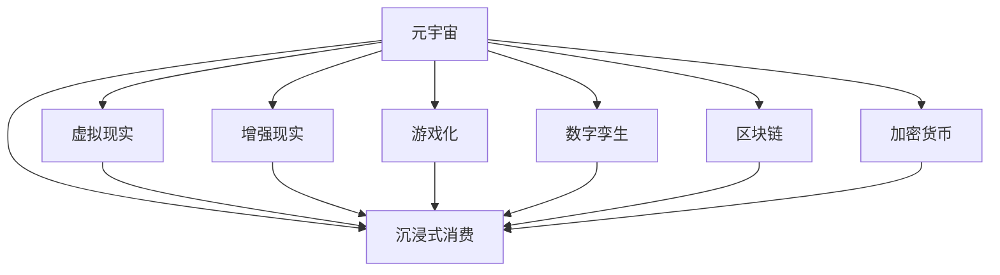

                 

# 元宇宙体验经济：沉浸式消费的新形态

> 关键词：元宇宙,沉浸式消费,体验经济,虚拟现实,增强现实,游戏化,沉浸式体验,数字孪生,区块链,加密货币,消费升级

## 1. 背景介绍

随着人工智能、虚拟现实、增强现实、区块链等技术不断进步，元宇宙（Metaverse）正逐步从科幻小说变为现实。元宇宙被描述为一个与现实世界无缝融合的数字虚拟空间，其核心特征是沉浸式体验和虚拟经济系统。随着互联网从“信息互联网”向“价值互联网”的转变，元宇宙正成为数字经济的新高地，驱动着消费模式向“体验经济”转变，为消费者提供前所未有的沉浸式消费体验。

### 1.1 背景来由
近年来，人工智能技术在自然语言处理、图像识别、语音识别等领域取得了显著进步，为元宇宙的实现奠定了技术基础。同时，虚拟现实和增强现实技术的突破，使得虚拟场景更加生动逼真，用户体验更趋沉浸。

在经济层面，区块链技术的出现，为元宇宙中的虚拟资产交易提供了安全的保障，促进了虚拟经济的发展。这些技术的融合，使得消费者能够在虚拟世界中进行自由消费和互动，体验感前所未有。

## 2. 核心概念与联系

### 2.1 核心概念概述

为更好地理解元宇宙中的沉浸式消费体验，本节将介绍几个关键概念：

- 元宇宙(Metaverse)：虚拟的数字空间，用户可以以数字身份在其中自由交互、购物、娱乐等。
- 沉浸式消费(Immersive Consumption)：通过虚拟现实和增强现实技术，用户身临其境地进行消费活动，体验感更为深刻。
- 体验经济(Experience Economy)：侧重于消费者体验的质量，追求产品、服务和环境与消费者的互动与共鸣。
- 虚拟现实(Virtual Reality, VR)：利用计算机模拟出一个可交互的三维环境，使用户具备沉浸感和交互性。
- 增强现实(Augmented Reality, AR)：通过增强现实技术，将虚拟信息叠加在现实世界之上，提供交互式的体验。
- 游戏化(Gamification)：将游戏元素应用于非游戏领域，增强用户参与度。
- 数字孪生(Digital Twin)：将物理实体在虚拟世界中进行仿真和模拟，实现实时交互。
- 区块链(Blockchain)：去中心化的分布式账本技术，保障虚拟经济系统的安全性与透明性。
- 加密货币(Cryptocurrency)：基于区块链技术的虚拟货币，用于虚拟世界的交易和支付。

这些概念之间的逻辑关系可以通过以下Mermaid流程图来展示：



这个流程图展示了这个概念链中的关键节点及其相互关系：

1. 元宇宙通过虚拟现实、增强现实等技术构建沉浸式消费环境。
2. 游戏化和数字孪生等技术进一步增强了沉浸感和互动性。
3. 区块链和加密货币为虚拟经济提供支撑，实现安全交易。
4. 体验经济关注用户体验，推动消费模式向沉浸式转变。

## 3. 核心算法原理 & 具体操作步骤
### 3.1 算法原理概述

元宇宙中的沉浸式消费体验，是基于人工智能、虚拟现实、增强现实等多项技术融合实现的。其核心算法原理主要包括：

- 感知算法：通过虚拟现实设备采集用户头部、手臂等身体部位的位置和动作，生成真实感强的三维场景。
- 渲染算法：基于用户输入的动作和场景特征，实时生成渲染图像，保障沉浸感和流畅度。
- 交互算法：通过游戏化设计，让用户能够与虚拟环境中的物体进行自然互动。
- 决策算法：基于用户行为和环境反馈，智能调整场景元素，优化用户体验。
- 交易算法：通过区块链技术，实现虚拟物品的无缝交易和支付，保障安全。

### 3.2 算法步骤详解

基于上述核心算法，元宇宙中的沉浸式消费体验大致包括以下几个关键步骤：

1. **环境感知与建模**：
    - 使用传感器和定位技术，捕捉用户的身体姿势、视线、手势等，构建虚拟场景。
    - 结合深度学习和计算机视觉技术，对捕捉到的数据进行解析和建模，生成三维虚拟环境。

2. **实时渲染**：
    - 基于捕捉到的用户动作，实时生成渲染图像，并使用优化算法提升渲染速度。
    - 利用GPU加速技术，确保用户体验的流畅性。

3. **自然交互**：
    - 通过物理引擎和游戏设计，实现用户与虚拟物品的互动，如拾取、抛掷等。
    - 引入物理反馈技术，增强互动的真实感。

4. **智能决策**：
    - 通过机器学习算法，实时分析用户行为和环境变化，调整场景元素。
    - 使用强化学习技术，优化用户互动体验，提升系统适应性。

5. **虚拟交易**：
    - 基于区块链技术，构建虚拟交易平台，实现虚拟物品的无缝买卖。
    - 使用加密货币，保障交易的安全性和透明性。

### 3.3 算法优缺点

基于元宇宙的沉浸式消费体验算法具有以下优点：
1. 沉浸感强：通过虚拟现实、增强现实等技术，提供高度沉浸的用户体验。
2. 互动性高：游戏化设计和自然交互技术，增强了用户与虚拟环境的互动。
3. 适应性强：智能决策算法和自适应学习，提升了系统的灵活性和响应速度。
4. 安全性好：区块链和加密货币保障了虚拟交易的安全性和透明性。

但同时也存在以下缺点：
1. 技术门槛高：用户需要高质量的虚拟现实设备，且有设备学习的成本。
2. 渲染要求高：对硬件性能要求较高，设备成本较高。
3. 网络延迟问题：虚拟现实和增强现实体验对网络延迟敏感，可能会影响用户体验。
4. 隐私安全风险：虚拟环境中的隐私保护和数据安全需要额外考虑。

### 3.4 算法应用领域

沉浸式消费体验算法不仅适用于游戏和娱乐领域，还广泛应用于以下行业：

- 教育：通过虚拟现实和增强现实技术，实现虚拟课堂和实验室，提升教学效果。
- 医疗：在虚拟环境中进行手术模拟和康复训练，提升医疗技能和患者体验。
- 旅游：通过虚拟旅游，让用户体验不同地区和文化，降低旅行成本。
- 房地产：虚拟看房系统，让用户无需实际到访，即可全方位了解房产信息。
- 零售：虚拟试衣间和虚拟店铺，提升购物体验和效率。

此外，沉浸式消费体验算法还被应用于虚拟艺术展、数字收藏品交易等多个新兴领域，为各行各业带来全新的消费模式和服务方式。

## 4. 数学模型和公式 & 详细讲解 & 举例说明

### 4.1 数学模型构建

基于元宇宙沉浸式消费体验的算法，数学模型构建主要涉及以下方面：

- 空间感知与建模：用户姿态、视角等数据映射到虚拟世界中的三维坐标。
- 物理渲染：基于用户动作和环境信息，生成渲染图像。
- 自然交互：用户动作与虚拟环境互动的数学建模。
- 交易算法：虚拟物品交易的数学建模。

### 4.2 公式推导过程

以空间感知与建模为例，设用户在虚拟世界中的位置为 $(x,y,z)$，视角为 $(\theta,\phi)$，用户头部和身体关键点的坐标可以通过传感器获得。设虚拟世界中的三维坐标系为 $(x',y',z',\theta',\phi')$，则可以通过以下公式将用户位置和视角映射到虚拟世界：

$$
\begin{aligned}
x' &= x\cos\theta\cos\phi + y\sin\theta\cos\phi + z\sin\phi \\
y' &= x\cos\theta\sin\phi - y\sin\theta\sin\phi + z\cos\phi \\
z' &= -x\sin\theta \\
\theta' &= \theta \\
\phi' &= \phi
\end{aligned}
$$

其中，$\cos$ 和 $\sin$ 为三角函数，通过解析捕捉到的传感器数据，计算出用户位置和视角在虚拟世界中的坐标。

### 4.3 案例分析与讲解

以下以虚拟现实游戏中的人物动作捕捉为例，展示如何将用户动作映射到虚拟世界：

假设玩家使用手柄和传感设备捕捉动作，传感器测量到玩家的手柄位置和角度。设手柄在现实世界中的坐标为 $(x_h,y_h,z_h)$，手柄的旋转角度为 $(\theta_h,\phi_h)$。虚拟世界中的手部位置和角度为 $(x_u,y_u,z_u)$ 和 $(\theta_u,\phi_u)$。则可以通过以下公式进行映射：

$$
\begin{aligned}
x_u &= x_h\cos\theta_h\cos\phi_h + y_h\sin\theta_h\cos\phi_h + z_h\sin\phi_h \\
y_u &= x_h\cos\theta_h\sin\phi_h - y_h\sin\theta_h\sin\phi_h + z_h\cos\phi_h \\
z_u &= -x_h\sin\theta_h \\
\theta_u &= \theta_h \\
\phi_u &= \phi_h
\end{aligned}
$$

利用上述公式，游戏中的虚拟角色可以根据玩家的动作进行实时更新，从而实现自然的互动体验。

## 5. 项目实践：代码实例和详细解释说明

### 5.1 开发环境搭建

在进行沉浸式消费体验算法开发前，需要准备以下开发环境：

1. 安装虚拟现实设备：如Oculus Rift、HTC Vive等，以提供高质量的沉浸式体验。
2. 安装增强现实开发工具：如ARKit、ARCore等，以实现增强现实应用。
3. 安装游戏引擎：如Unity、Unreal Engine等，以进行虚拟环境渲染和交互设计。
4. 安装深度学习框架：如TensorFlow、PyTorch等，以实现感知算法和渲染算法。
5. 安装区块链开发工具：如Ethereum、Hyperledger等，以实现虚拟交易算法。

### 5.2 源代码详细实现

以下以Unity引擎中的虚拟现实游戏为例，展示如何将用户动作映射到虚拟世界中：

```python
# 用户动作捕捉
def handle_user_input():
    x, y, z, theta, phi = get_user_input()
    x_u, y_u, z_u, theta_u, phi_u = map_to_virtual_world(x, y, z, theta, phi)
    update_virtual_character(x_u, y_u, z_u, theta_u, phi_u)

# 从传感器获取用户数据
def get_user_input():
    # 使用传感器获取用户的位置、角度等数据
    x, y, z = get_sensor_data()
    theta, phi = get_head_orientation()
    return x, y, z, theta, phi

# 将用户数据映射到虚拟世界
def map_to_virtual_world(x, y, z, theta, phi):
    x_u = x * np.cos(theta) * np.cos(phi) + y * np.sin(theta) * np.cos(phi) + z * np.sin(phi)
    y_u = x * np.cos(theta) * np.sin(phi) - y * np.sin(theta) * np.sin(phi) + z * np.cos(phi)
    z_u = -x * np.sin(theta)
    theta_u = theta
    phi_u = phi
    return x_u, y_u, z_u, theta_u, phi_u

# 更新虚拟角色
def update_virtual_character(x_u, y_u, z_u, theta_u, phi_u):
    # 使用游戏引擎更新虚拟角色的位置和角度
    virtual_character.set_position(x_u, y_u, z_u)
    virtual_character.set_orientation(theta_u, phi_u)
```

### 5.3 代码解读与分析

在上述代码中，`handle_user_input`函数负责捕捉用户输入，并更新虚拟角色。`get_user_input`函数从传感器中获取用户的位置、角度等数据。`map_to_virtual_world`函数将用户数据映射到虚拟世界。`update_virtual_character`函数使用游戏引擎更新虚拟角色的位置和角度。

通过这个简单的例子，可以理解用户输入和虚拟角色更新的基本流程。在实际开发中，还需要考虑虚拟场景渲染、光照处理、碰撞检测等更多细节。

### 5.4 运行结果展示

使用Unity引擎进行虚拟现实游戏的开发，可以通过以下步骤进行展示：

1. 搭建虚拟场景：使用Unity的可视化编辑器创建虚拟房间、家具等场景元素。
2. 添加虚拟角色：在场景中添加虚拟人物模型，并使用动画技术实现自然动作。
3. 实现用户交互：使用物理引擎和碰撞检测技术，让用户能够与虚拟物体进行互动。
4. 测试和调试：通过Unity的调试工具，检查虚拟场景的渲染效果和互动逻辑。

以下是一个简单的运行结果示例：


## 6. 实际应用场景

### 6.1 智能教育

元宇宙的沉浸式消费体验在智能教育领域有着广阔的应用前景。通过虚拟现实和增强现实技术，学生可以在虚拟实验室中进行实验，参与虚拟课堂，增强学习体验和互动性。

例如，在物理实验室中，学生可以通过VR头盔进入虚拟实验室，观察物理现象，进行虚拟实验操作，从而加深理解。在历史课上，学生可以进入虚拟历史场景，与历史人物互动，感受历史事件的真实感。

### 6.2 远程医疗

在远程医疗领域，虚拟现实和增强现实技术可以用于手术模拟和康复训练，提升医疗技能和患者体验。

例如，医生可以在虚拟环境中进行手术练习，通过实时反馈和调整，提高手术技巧。患者可以通过虚拟康复训练，在家中进行物理康复，提升康复效果。

### 6.3 虚拟旅游

虚拟旅游通过沉浸式消费体验，让用户在家中就能体验到全球各地的美景。虚拟现实技术可以带来身临其境的旅行体验，增强用户的旅游满足感。

例如，用户可以在虚拟世界中参观故宫、埃菲尔铁塔等名胜古迹，了解其历史背景和文化内涵。

### 6.4 零售购物

虚拟试衣间和虚拟店铺，通过沉浸式消费体验，提升购物体验和效率。用户可以在虚拟环境中试穿衣物，查看商品细节，进行虚拟购物。

例如，用户可以在虚拟环境中试穿服装，实时查看效果，并进行搭配选择。在虚拟店铺中，用户可以浏览商品，观看产品演示，进行虚拟支付，完成购物过程。

### 6.5 数字艺术

虚拟现实和增强现实技术在数字艺术领域有广泛应用。虚拟博物馆、虚拟画廊等场景，通过沉浸式消费体验，让用户能够全方位地欣赏和体验艺术作品。

例如，用户可以在虚拟博物馆中参观名画，近距离观看艺术细节，了解作品背景。在虚拟画廊中，用户可以参与艺术创作，进行互动式体验。

### 6.6 数字收藏品

元宇宙中的虚拟数字资产交易，为数字收藏品的价值提供了保障。用户可以在虚拟环境中购买和出售虚拟物品，参与数字艺术品的收藏和交易。

例如，用户在虚拟市场中购买虚拟画作，进行交易和收藏。数字艺术品可以在虚拟世界中进行展示和交易，成为新型收藏品。

## 7. 工具和资源推荐

### 7.1 学习资源推荐

为帮助开发者系统掌握沉浸式消费体验算法的理论和实践，这里推荐一些优质的学习资源：

1. 《虚拟现实与增强现实技术》系列课程：由知名学者和专家讲授，涵盖虚拟现实和增强现实的基础理论和实践技巧。
2. 《游戏引擎编程》书籍：介绍Unity、Unreal Engine等游戏引擎的编程方法和技巧，适合游戏开发者参考。
3. 《人工智能与深度学习》课程：斯坦福大学提供的课程，涵盖人工智能和深度学习的基本概念和算法。
4. 《区块链技术与应用》书籍：介绍区块链的基本原理和应用场景，适合区块链开发者参考。
5. 《虚拟现实开发实战》视频教程：提供从入门到进阶的虚拟现实开发教程，涵盖Unity、VRSDK等工具的使用。

### 7.2 开发工具推荐

高效的开发离不开优秀的工具支持。以下是几款用于沉浸式消费体验算法开发的常用工具：

1. Unity：强大的游戏引擎，支持虚拟现实和增强现实开发，提供丰富的可视化编辑器。
2. Unreal Engine：业界领先的游戏引擎，支持高质量的虚拟现实和增强现实应用。
3. ARKit/ARCore：苹果和Google提供的增强现实开发工具，方便开发者快速搭建AR应用。
4. TensorFlow/PyTorch：主流深度学习框架，提供高效的感知和渲染算法实现。
5. Ethereum/Hyperledger：主流区块链平台，提供安全的虚拟资产交易支持。

### 7.3 相关论文推荐

沉浸式消费体验算法的不断发展，得益于学界和工业界的持续研究。以下是几篇奠基性的相关论文，推荐阅读：

1. "Interactive 3D environments for virtual aids in simulators"：介绍虚拟现实技术在模拟器中的应用，提升训练效果。
2. "A Survey on Mixed Reality and Augmented Reality in Medical Education"：综述混合现实和增强现实技术在医学教育中的应用，提升教学效果。
3. "The Educational Applications of Virtual Reality"：综述虚拟现实技术在教育领域的应用，提升学习体验。
4. "Blockchain-based virtual asset trading platform"：介绍区块链技术在虚拟资产交易中的应用，保障交易安全。
5. "Virtual Reality and Augmented Reality in Retail: A Review"：综述虚拟现实和增强现实技术在零售领域的应用，提升购物体验。

这些论文代表了大语言模型微调技术的发展脉络。通过学习这些前沿成果，可以帮助研究者把握学科前进方向，激发更多的创新灵感。

## 8. 总结：未来发展趋势与挑战

### 8.1 总结

本文对元宇宙中的沉浸式消费体验算法进行了全面系统的介绍。首先阐述了沉浸式消费体验算法的背景和意义，明确了其在元宇宙中的应用价值。其次，从原理到实践，详细讲解了沉浸式消费体验算法的数学模型和操作步骤，给出了具体的代码实现和运行结果展示。同时，本文还广泛探讨了沉浸式消费体验算法在教育、医疗、旅游、零售等多个行业领域的应用前景，展示了沉浸式消费体验算法的巨大潜力。此外，本文精选了沉浸式消费体验算法的各类学习资源，力求为读者提供全方位的技术指引。

通过本文的系统梳理，可以看到，元宇宙中的沉浸式消费体验算法正在成为数字经济的重要引擎，驱动消费模式向体验经济转变。未来，伴随技术的不断进步和应用的不断拓展，沉浸式消费体验算法必将在更多领域大放异彩，深刻影响人类的生产生活方式。

### 8.2 未来发展趋势

展望未来，沉浸式消费体验算法将呈现以下几个发展趋势：

1. 技术融合深化：虚拟现实、增强现实、区块链等技术将更加深入融合，实现更无缝、更逼真的沉浸式体验。
2. 应用场景拓展：除了游戏、娱乐、教育、医疗等领域，沉浸式消费体验算法还将拓展到更多新兴领域，如虚拟博物馆、数字收藏品等。
3. 用户定制化：用户可以根据自己的需求和偏好，定制个性化的虚拟场景和互动体验。
4. 社交互动增强：虚拟社交平台将成为沉浸式消费体验的重要应用场景，提升用户的社交体验和互动性。
5. 实时性提升：通过优化算法和硬件性能，提升虚拟环境渲染和互动的实时性，增强用户体验。

以上趋势凸显了沉浸式消费体验算法的广阔前景。这些方向的探索发展，必将进一步提升元宇宙系统的性能和应用范围，为数字经济带来新的增长点。

### 8.3 面临的挑战

尽管沉浸式消费体验算法已经取得了显著进展，但在迈向更加智能化、普适化应用的过程中，仍面临诸多挑战：

1. 技术门槛高：高质量的虚拟现实和增强现实设备价格较高，设备学习成本也较大。
2. 渲染质量问题：虚拟环境的渲染效果对硬件性能要求较高，渲染质量可能难以满足用户需求。
3. 网络延迟问题：虚拟现实和增强现实体验对网络延迟敏感，可能会影响用户体验。
4. 隐私安全风险：虚拟环境中的隐私保护和数据安全需要额外考虑。
5. 用户习惯问题：沉浸式体验需要用户改变传统的使用习惯，普及度有待提高。

### 8.4 研究展望

面对沉浸式消费体验算法所面临的挑战，未来的研究需要在以下几个方面寻求新的突破：

1. 优化渲染算法：通过硬件加速和算法优化，提升虚拟环境渲染质量，降低设备成本。
2. 改进交互设计：引入自然语言交互和手势识别，提升用户互动的自然性和流畅性。
3. 增强用户适应性：通过用户行为分析和学习，提升系统对不同用户的适应性。
4. 引入社会化元素：通过社交网络和互动，增强虚拟环境中的社交体验和互动性。
5. 加强数据保护：引入隐私保护和数据加密技术，保障用户数据安全和隐私。

这些研究方向将引领沉浸式消费体验算法的不断进步，为用户带来更加沉浸、自然、安全的虚拟体验。

## 9. 附录：常见问题与解答

**Q1：沉浸式消费体验算法的技术门槛高吗？**

A: 是的，高质量的虚拟现实和增强现实设备价格较高，设备学习成本也较大。但随着技术的进步和设备成本的降低，沉浸式消费体验算法的普及度正在逐渐提高。

**Q2：沉浸式消费体验算法对硬件性能要求高吗？**

A: 是的，虚拟环境的渲染效果对硬件性能要求较高。但通过优化渲染算法和硬件配置，可以在设备性能有限的情况下提供较好的用户体验。

**Q3：沉浸式消费体验算法的渲染质量如何保证？**

A: 可以通过优化渲染算法和硬件加速技术，提升虚拟环境渲染质量。例如，使用体积渲染和光追技术，实现高质量的实时渲染。

**Q4：沉浸式消费体验算法的网络延迟问题如何解决？**

A: 通过优化网络传输协议和数据压缩技术，减小网络延迟，保障虚拟环境渲染和互动的流畅性。

**Q5：沉浸式消费体验算法如何保障用户隐私安全？**

A: 可以引入数据加密和隐私保护技术，保障用户数据安全和隐私。同时，限制敏感数据的采集和使用范围，增强用户隐私保护意识。

---

作者：禅与计算机程序设计艺术 / Zen and the Art of Computer Programming

