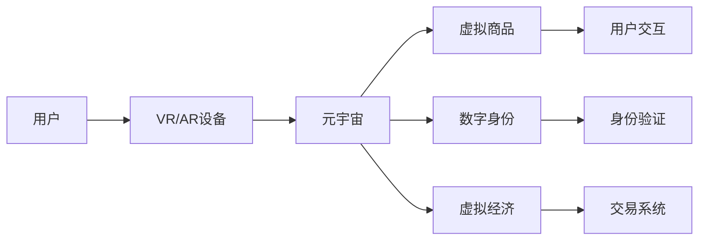

                 

# 元宇宙体验设计:沉浸式消费的新型态

> 关键词：元宇宙，沉浸式体验，消费模式，虚拟现实（VR），增强现实（AR），沉浸式游戏，社交互动，虚拟经济，数字身份，3D模型

## 1. 背景介绍

随着虚拟现实（VR）和增强现实（AR）技术的日渐成熟，元宇宙（Metaverse）的概念逐渐进入公众视野。元宇宙是一个由多个虚拟世界组成的大规模、分布式、可交互的虚拟空间，用户可以通过VR/AR头盔、手柄等设备，进入一个高度沉浸和互动的数字世界。

元宇宙不仅在技术上带来了革新，更在文化和经济上带来深刻变革。在元宇宙中，沉浸式消费体验将成为新型的消费模式。这种体验让用户在虚拟世界中与商品进行更深入的互动和感知，从而改变传统的购物方式和消费习惯。

本文将详细探讨元宇宙体验设计的核心概念和实现步骤，分析其优缺点，并探讨其在沉浸式消费中的应用场景和未来发展趋势。

## 2. 核心概念与联系

### 2.1 核心概念概述

- **元宇宙（Metaverse）**：一个由多个虚拟世界组成的大规模、分布式、可交互的虚拟空间。用户可以通过VR/AR设备进入其中，实现沉浸式互动体验。
- **沉浸式体验（Immersive Experience）**：通过VR/AR技术，让用户感觉仿佛置身于现实世界一样，实现高度沉浸和互动的体验。
- **虚拟现实（Virtual Reality, VR）**：通过模拟仿真，使用户沉浸在一个完全虚拟的三维环境中。
- **增强现实（Augmented Reality, AR）**：通过在现实世界中添加虚拟信息，增强用户的感官体验。
- **虚拟商品（Virtual Goods）**：元宇宙中可交易的数字商品，如3D模型、虚拟土地、数字货币等。
- **数字身份（Digital Identity）**：用户在元宇宙中的唯一标识，具备身份验证和权益管理功能。

这些核心概念共同构成了元宇宙沉浸式消费的基础框架。通过VR/AR技术，用户可以在虚拟世界中进行互动和消费，体验到前所未有的沉浸式购物体验。

### 2.2 核心概念原理和架构的 Mermaid 流程图



## 3. 核心算法原理 & 具体操作步骤

### 3.1 算法原理概述

元宇宙体验设计的核心算法原理，可以概括为以下几个方面：

- **虚拟商品生成与渲染**：通过3D建模软件生成虚拟商品，再利用图形处理单元（GPU）对其进行渲染，以实现高度逼真的视觉效果。
- **用户交互与反馈**：通过VR/AR技术，让用户能够与虚拟商品进行互动，并通过触觉、视觉等感官反馈，增强沉浸感。
- **虚拟经济与交易**：在元宇宙中构建虚拟货币、商品市场等经济体系，实现虚拟商品的交易和流通。
- **数字身份认证**：利用区块链技术，为元宇宙中的用户身份进行认证和授权，确保数据安全和隐私保护。

### 3.2 算法步骤详解

元宇宙体验设计的具体步骤包括：

1. **场景搭建与模拟**：根据目标用户群体的特点，设计合适的虚拟场景，并使用3D建模软件进行场景搭建。

2. **商品生成与渲染**：通过3D建模软件生成虚拟商品，并利用GPU对其进行渲染，确保视觉效果逼真。

3. **用户交互设计**：设计用户与虚拟商品的互动方式，如点击、拖动、触摸等，并利用传感器采集用户的反馈数据。

4. **经济体系构建**：设计虚拟货币、商品市场等经济体系，并实现虚拟商品的定价、交易等功能。

5. **身份认证与授权**：利用区块链技术，实现用户身份的认证和授权，确保数据安全和隐私保护。

### 3.3 算法优缺点

#### 优点：

1. **沉浸式体验**：VR/AR技术让用户在虚拟世界中能够身临其境，感受到真实的购物体验。
2. **多样化商品**：虚拟商品可以无限复制和定制，用户可以在虚拟世界中体验到各种商品。
3. **低成本与便捷**：用户无需实体前往，只需通过VR/AR设备即可随时随地购物。
4. **经济与社交融合**：元宇宙中的虚拟经济与社交互动相结合，可以创造出新的商业模式和社交形式。

#### 缺点：

1. **技术门槛高**：目前VR/AR设备价格高昂，技术门槛较高，普及率有待提高。
2. **数据隐私问题**：用户的数据和隐私保护需要特别重视，防止被滥用和泄露。
3. **虚拟与现实的脱节**：过度沉浸于虚拟世界，可能影响用户的现实生活和社会关系。
4. **技术迭代快**：随着技术的不断进步，元宇宙的体验和商业模式需要不断更新和调整。

### 3.4 算法应用领域

元宇宙体验设计在多个领域都有广泛的应用：

1. **游戏与娱乐**：如《堡垒之夜》等多人在线游戏，通过虚拟商品和社交互动，创造了全新的游戏体验。
2. **商业与营销**：如Zara等品牌在元宇宙中开设虚拟商店，利用沉浸式体验提升品牌影响力和用户粘性。
3. **教育与培训**：通过虚拟现实技术，创建沉浸式教育场景，提升学生的学习效果和参与度。
4. **旅游与文化**：如文化遗产数字化保护项目，让用户能够“云游”世界各地的博物馆和古迹。
5. **医疗与健康**：通过虚拟现实技术，帮助患者进行心理治疗和康复训练，提升医疗服务的个性化和精准化。

## 4. 数学模型和公式 & 详细讲解 & 举例说明

### 4.1 数学模型构建

在元宇宙体验设计中，数学模型主要用于虚拟商品的生成、渲染和用户交互的设计。

- **3D建模**：通过数学建模软件，生成三维几何模型，并进行纹理映射和光照计算。
- **物理引擎**：利用物理学原理，实现虚拟商品的动态模拟和物理反应。
- **用户交互**：通过传感器采集用户动作数据，利用运动学原理，实现虚拟商品与用户之间的互动。

### 4.2 公式推导过程

以虚拟商品的光照计算为例，其公式推导过程如下：

- **光通量公式**：

  $$
  I(\mathbf{p}) = \int_{\mathbf{h}} \frac{\partial F(\mathbf{p}, \mathbf{h})}{\partial \mathbf{h}} \cdot \frac{\partial \mathbf{h}}{\partial \mathbf{p}}
  $$

  其中 $\mathbf{p}$ 为点光源位置，$\mathbf{h}$ 为光线方向。

- **漫反射公式**：

  $$
  \mathbf{R} = \frac{\mathbf{n} \cdot \mathbf{v}}{|\mathbf{n} \cdot \mathbf{v}|} (\mathbf{v} - (\mathbf{n} \cdot \mathbf{v}) \mathbf{n})
  $$

  其中 $\mathbf{v}$ 为视线方向，$\mathbf{n}$ 为表面法线方向。

- **镜面反射公式**：

  $$
  \mathbf{R} = \frac{2(\mathbf{n} \cdot \mathbf{v}) \mathbf{n} - \mathbf{v}}{|\mathbf{n} \cdot \mathbf{v}|}
  $$

  其中 $\mathbf{v}$ 为视线方向，$\mathbf{n}$ 为表面法线方向。

### 4.3 案例分析与讲解

以《堡垒之夜》为例，分析其元宇宙体验设计的数学模型和实现过程。

1. **场景搭建**：使用Unity引擎，根据游戏场景进行3D建模，并设置地形、光照、纹理等参数。
2. **商品生成**：利用Blender等软件，创建虚拟商品的三维模型，并进行纹理贴图和着色处理。
3. **光照计算**：使用物理引擎，实现光通量、漫反射、镜面反射等计算，确保商品的逼真效果。
4. **用户交互**：通过手柄和头显设备，实现用户与虚拟商品的互动，并利用传感器采集用户动作数据，进行动态模拟和碰撞检测。

## 5. 项目实践：代码实例和详细解释说明

### 5.1 开发环境搭建

为了实现元宇宙体验设计，需要搭建一个完整的开发环境，包括3D建模软件、游戏引擎、VR/AR设备等。

1. **3D建模软件**：如Blender、Maya等，用于创建虚拟商品和场景模型。
2. **游戏引擎**：如Unity、Unreal Engine等，用于实现游戏场景和用户交互。
3. **VR/AR设备**：如Oculus Rift、HTC Vive等，用于提供沉浸式体验。

### 5.2 源代码详细实现

以Unity引擎为例，实现一个虚拟商品展示的示例代码。

```csharp
using UnityEngine;
using UnityEngine.UI;

public class VirtualGoodController : MonoBehaviour
{
    public GameObject product;
    public Camera cam;
    
    private void Start()
    {
        // 初始化相机
        camortho = cam ortho;
        cam.fieldOfView = 60;
        cam.nearClipDistance = 0.1f;
        cam.farClipDistance = 100f;
        cam.worldToClip = cam.worldToClip;
        cam投影矩阵 = cam.worldToClip;
    }
    
    private void Update()
    {
        // 摄像机移动
        float moveX = Input.GetAxis("Horizontal");
        float moveY = Input.GetAxis("Vertical");
        float moveZ = Input.GetAxis("Forward");
        cam.Translate(new Vector3(moveX, moveY, moveZ));
        
        // 商品旋转
        product.transform.Rotate(Vector3.up, 100f * Time.deltaTime);
        
        // 商品移动
        product.transform.Translate(Vector3.forward * Time.deltaTime * 10);
    }
}
```

### 5.3 代码解读与分析

上述代码实现了虚拟商品在场景中的动态展示和交互。具体如下：

1. **相机设置**：在Start函数中，设置相机参数，包括视口、视场角、近平面和远平面等。
2. **相机移动**：在Update函数中，根据用户的输入，移动相机的位置和方向。
3. **商品旋转**：商品根据时间进行旋转，模拟其动态变化。
4. **商品移动**：商品沿视线方向进行平移，模拟其动态移动。

### 5.4 运行结果展示

运行上述代码，即可在虚拟场景中实现商品的动态展示和交互。用户可以通过手柄和头显设备，移动相机并观察商品的效果。


## 6. 实际应用场景

### 6.1 游戏与娱乐

元宇宙在游戏与娱乐领域的应用最为广泛。例如《堡垒之夜》通过虚拟商品和社交互动，创造了独特的游戏体验，吸引了大量用户。

### 6.2 商业与营销

许多品牌在元宇宙中开设虚拟商店，利用沉浸式体验提升品牌影响力和用户粘性。例如Zara在元宇宙中推出虚拟试衣间，用户可以试穿虚拟衣物并进行购买。

### 6.3 教育与培训

通过虚拟现实技术，创建沉浸式教育场景，提升学生的学习效果和参与度。例如VR技术在医学教育中的应用，学生可以通过虚拟手术操作，学习手术技巧和步骤。

### 6.4 旅游与文化

文化遗产数字化保护项目，让用户能够“云游”世界各地的博物馆和古迹。例如Google Earth通过VR技术，让用户可以在虚拟世界中进行文化遗产的探索和保护。

### 6.5 医疗与健康

利用虚拟现实技术，帮助患者进行心理治疗和康复训练，提升医疗服务的个性化和精准化。例如VR技术在焦虑症治疗中的应用，患者通过虚拟场景进行放松训练，减轻心理压力。

## 7. 工具和资源推荐

### 7.1 学习资源推荐

1. **《Unity游戏开发实战》**：一本详细介绍Unity引擎开发的书籍，涵盖游戏设计、引擎架构、脚本编写等各个方面。
2. **《VR/AR开发实战》**：一本详细介绍VR/AR技术开发的书籍，涵盖硬件设备、交互设计、渲染技术等各个方面。
3. **《Unity VR与AR游戏开发实战》**：一本详细介绍Unity引擎在VR/AR项目中的应用，涵盖项目设计、引擎操作、优化技巧等各个方面。
4. **《Unity游戏编程模式》**：一本详细介绍Unity引擎编程模式的书籍，涵盖引擎架构、编程模式、开发实践等各个方面。
5. **《VR/AR开发教程》**：一系列详细介绍VR/AR开发教程的视频和文档，涵盖硬件设备、交互设计、渲染技术等各个方面。

### 7.2 开发工具推荐

1. **Unity引擎**：一款强大的游戏引擎，支持3D建模、物理引擎、VR/AR开发等各个方面。
2. **Blender**：一款功能强大的3D建模软件，支持多平台、多格式，可用于创建虚拟商品和场景模型。
3. **Oculus Rift**：一款流行的VR设备，支持多种应用场景，提供沉浸式体验。
4. **HTC Vive**：一款流行的VR设备，支持多种应用场景，提供沉浸式体验。
5. **Google Cardboard**：一款开源的VR设备，支持多种应用场景，适用于移动设备。

### 7.3 相关论文推荐

1. **《元宇宙：未来的互联网》**：一篇探讨元宇宙概念和未来发展的论文，涵盖技术、经济、社会等多个方面。
2. **《虚拟商品在元宇宙中的应用》**：一篇探讨虚拟商品在元宇宙中的生成、渲染和交易的论文，涵盖3D建模、物理引擎、虚拟经济等多个方面。
3. **《元宇宙中的社交互动》**：一篇探讨元宇宙中社交互动机制的论文，涵盖用户行为分析、社交网络构建等多个方面。
4. **《虚拟现实技术的发展与趋势》**：一篇探讨虚拟现实技术的发展与未来趋势的论文，涵盖硬件设备、交互设计、渲染技术等多个方面。
5. **《虚拟现实在教育中的应用》**：一篇探讨虚拟现实技术在教育中的应用，涵盖医学教育、虚拟手术等多个方面的论文。

## 8. 总结：未来发展趋势与挑战

### 8.1 研究成果总结

元宇宙体验设计在多个领域已展现出巨大的潜力和应用前景。通过虚拟现实和增强现实技术，用户能够在虚拟世界中享受沉浸式体验，改变传统的购物方式和消费习惯。

### 8.2 未来发展趋势

未来，元宇宙体验设计将呈现以下几个发展趋势：

1. **硬件设备的普及**：随着VR/AR设备的技术进步和价格下降，元宇宙体验将逐渐普及到普通用户。
2. **内容的丰富与多样**：虚拟商品和场景的生成将更加丰富和多样化，用户可以选择更多样的商品和场景进行互动。
3. **社交互动的增强**：元宇宙将构建更加完善的社会互动机制，让用户能够与虚拟商品和其他用户进行更深入的互动。
4. **虚拟经济的兴起**：元宇宙中的虚拟商品和货币将形成新的经济体系，带来新的商业模式和价值创造。
5. **技术的融合与创新**：元宇宙体验设计将与其他技术进行融合，如区块链、人工智能、大数据等，实现更智能、更高效的体验。

### 8.3 面临的挑战

尽管元宇宙体验设计前景广阔，但在实现过程中仍面临诸多挑战：

1. **技术门槛高**：目前VR/AR设备价格高昂，技术门槛较高，普及率有待提高。
2. **数据隐私问题**：用户的数据和隐私保护需要特别重视，防止被滥用和泄露。
3. **虚拟与现实的脱节**：过度沉浸于虚拟世界，可能影响用户的现实生活和社会关系。
4. **技术迭代快**：随着技术的不断进步，元宇宙的体验和商业模式需要不断更新和调整。
5. **法律法规问题**：元宇宙中的虚拟商品和交易等行为需要合法合规，法规框架需要进一步完善。

### 8.4 研究展望

未来，元宇宙体验设计的研究将侧重于以下几个方面：

1. **技术的不断进步**：持续提升硬件设备的性能和用户体验，降低技术门槛，提高普及率。
2. **数据隐私和安全**：建立更加完善的数据隐私保护机制，确保用户数据的安全和隐私。
3. **虚拟与现实的平衡**：研究虚拟世界与现实世界的平衡，防止过度沉浸对用户的现实生活产生负面影响。
4. **经济与社会的融合**：推动虚拟商品和货币的合法合规，构建公平公正的虚拟经济体系。
5. **技术的创新与应用**：结合其他技术的创新应用，提升元宇宙体验设计的智能化和高效性。

## 9. 附录：常见问题与解答

### 问题1：什么是元宇宙？

**回答**：元宇宙是一个由多个虚拟世界组成的大规模、分布式、可交互的虚拟空间，用户可以通过VR/AR设备进入其中，实现沉浸式互动体验。

### 问题2：如何实现元宇宙中的虚拟商品生成与渲染？

**回答**：通过3D建模软件生成虚拟商品，并利用图形处理单元（GPU）对其进行渲染，以实现高度逼真的视觉效果。

### 问题3：元宇宙中的用户体验与传统的消费方式有何不同？

**回答**：元宇宙中的用户体验更加沉浸和互动，用户能够在虚拟世界中与商品进行深度互动，提升购物体验和满意度。

### 问题4：元宇宙中的虚拟商品交易需要注意哪些问题？

**回答**：元宇宙中的虚拟商品交易需要考虑数据安全和隐私保护，建立健全的法律框架，确保交易的合法合规。

### 问题5：元宇宙体验设计的前景如何？

**回答**：元宇宙体验设计前景广阔，将在游戏、商业、教育、旅游、医疗等多个领域产生深远影响，带来新的商业模式和价值创造。

---

作者：禅与计算机程序设计艺术 / Zen and the Art of Computer Programming

