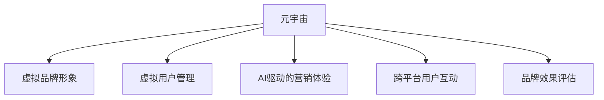

                 

# 元宇宙品牌塑造:数字化营销的新战场

## 1. 背景介绍

### 1.1 问题由来

近年来，元宇宙（Metaverse）概念逐渐走入人们的视野。作为虚拟现实（VR）和增强现实（AR）技术的融合，元宇宙旨在构建一个沉浸式的数字虚拟世界，实现工作、社交、娱乐等全方位的数字化体验。其背后的技术基础包括高保真3D建模、实时渲染、AI驱动的自然交互等。

元宇宙的崛起不仅对技术产业提出了更高的要求，也对品牌塑造和数字化营销带来了颠覆性的变革。品牌方可以利用元宇宙的平台，创造出更加丰富、互动的营销体验，与消费者建立更深层次的连接。但随之而来的挑战包括如何在元宇宙中定位品牌形象、如何实现跨平台的用户管理、如何利用沉浸式体验提升品牌影响等。

### 1.2 问题核心关键点

构建元宇宙品牌需要解决以下核心关键点：
- 品牌形象塑造：利用元宇宙的高保真视觉和沉浸式体验，打造具有鲜明特色的品牌形象。
- 用户互动体验：设计互动性强、沉浸式的品牌体验，吸引和留住用户。
- 跨平台管理：实现用户数据的无缝迁移和跨平台管理，提升品牌连贯性。
- 数据洞察分析：利用AI和大数据分析，获取用户行为数据，实现精准营销。
- 营销效果评估：建立科学的品牌效果评估体系，量化品牌价值和市场表现。

### 1.3 问题研究意义

元宇宙品牌塑造和数字化营销范式为品牌方提供了一种全新的视角，使得品牌可以通过虚拟空间实现深度互动和精准触达。此外，元宇宙的开放性和互动性，也为品牌提供了更大的自由度和创意空间。但元宇宙技术复杂、体验门槛较高，对品牌方技术能力和资金投入提出更高要求，同时仍需要进一步探索和规范化。

本文旨在深入探讨元宇宙品牌塑造和数字化营销的理论基础，详细介绍核心技术和操作步骤，并展示实际应用案例。通过对这些内容的梳理，帮助品牌方明确元宇宙营销的战略定位，掌握关键技术实现路径，助力其在元宇宙数字化营销新战场中取得成功。

## 2. 核心概念与联系

### 2.1 核心概念概述

在元宇宙品牌塑造和数字化营销的过程中，涉及多个核心概念，包括但不限于：

- 元宇宙：以虚拟现实（VR）和增强现实（AR）技术为基础，构建的沉浸式数字虚拟世界。
- 虚拟品牌形象：在元宇宙中，利用高保真3D建模和实时渲染技术，创建品牌专属的虚拟形象和环境。
- 虚拟用户管理：实现元宇宙中用户数据的无缝迁移和跨平台管理，提升品牌连贯性。
- AI驱动的营销体验：利用AI和大数据分析，实现个性化的互动体验和精准营销。
- 跨平台用户互动：在元宇宙不同平台间建立无缝衔接的用户互动体验，增强品牌粘性。
- 品牌效果评估：建立科学的品牌效果评估体系，量化品牌价值和市场表现。

这些概念间的联系可以通过以下Mermaid流程图来展示：



### 2.2 核心概念原理和架构

#### 2.2.1 元宇宙（Metaverse）

元宇宙是虚拟现实（Virtual Reality, VR）和增强现实（Augmented Reality, AR）技术的融合，旨在构建一个沉浸式的数字虚拟世界。其核心架构包括：

- **虚拟环境**：通过3D建模和渲染技术，构建高保真的虚拟环境。
- **虚拟身份**：创建可自定义、高逼真的虚拟形象。
- **交互技术**：利用手势识别、语音识别等技术，实现自然、流畅的交互体验。
- **分布式网络**：通过区块链和去中心化技术，保证数据安全和用户隐私。

#### 2.2.2 虚拟品牌形象（Virtual Brand Image）

虚拟品牌形象是元宇宙中品牌专属的虚拟形象和环境，其构建过程包括：

- **3D建模**：利用计算机图形学技术，创建品牌专属的3D模型和纹理。
- **实时渲染**：采用光追渲染技术，实现高保真、动态的虚拟场景和光影效果。
- **品牌故事**：结合品牌历史、文化背景，构建虚拟世界中的品牌故事线和互动场景。

#### 2.2.3 虚拟用户管理（Virtual User Management）

虚拟用户管理实现元宇宙中用户数据的无缝迁移和跨平台管理，其关键点包括：

- **用户身份认证**：通过区块链技术，实现去中心化的用户身份认证和管理。
- **跨平台数据同步**：利用API和数据同步技术，确保用户数据在元宇宙不同平台间无缝迁移。
- **用户行为分析**：利用大数据分析技术，跟踪用户行为和偏好，提供个性化推荐和互动。

#### 2.2.4 AI驱动的营销体验（AI-Driven Marketing Experience）

AI驱动的营销体验利用AI和大数据分析，实现个性化的互动体验和精准营销，其关键点包括：

- **用户行为预测**：利用机器学习算法，预测用户行为和偏好，优化互动体验。
- **内容推荐系统**：基于用户数据和行为，实现个性化内容和推荐。
- **情感分析**：利用自然语言处理技术，分析用户情感和反馈，优化互动策略。

#### 2.2.5 跨平台用户互动（Cross-Platform User Interaction）

跨平台用户互动在元宇宙不同平台间建立无缝衔接的用户互动体验，其关键点包括：

- **标准接口**：制定统一的API接口和数据标准，确保不同平台间数据互通。
- **同步更新**：实时同步平台间的用户数据和状态，实现无缝衔接。
- **一致体验**：确保用户在不同平台间的互动体验一致，提升品牌连贯性。

#### 2.2.6 品牌效果评估（Brand Effect Evaluation）

品牌效果评估建立科学的品牌效果评估体系，量化品牌价值和市场表现，其关键点包括：

- **关键指标**：设定品牌影响力的关键指标，如品牌认知度、用户参与度等。
- **数据收集**：利用在线调查、用户反馈等手段，收集品牌效果数据。
- **分析模型**：建立多维度的品牌效果分析模型，评估品牌价值和市场表现。

## 3. 核心算法原理 & 具体操作步骤

### 3.1 算法原理概述

元宇宙品牌塑造和数字化营销的核心算法原理主要包括以下几个方面：

- **机器学习**：利用机器学习算法，对用户行为和偏好进行预测和分析，优化营销策略。
- **自然语言处理**：利用自然语言处理技术，分析用户情感和反馈，优化互动体验。
- **计算机视觉**：利用计算机视觉技术，实现高保真3D建模和实时渲染，提升虚拟品牌形象的沉浸感。
- **区块链技术**：利用区块链技术，实现去中心化的用户身份认证和管理，保障数据安全和隐私。

### 3.2 算法步骤详解

#### 3.2.1 步骤一：虚拟品牌形象设计

1. **3D建模与纹理制作**：
   - 利用Blender等工具，创建品牌专属的3D模型。
   - 利用Photoshop等工具，为3D模型添加纹理和材质。

2. **高保真渲染**：
   - 采用光追渲染技术，实现高保真、动态的虚拟场景和光影效果。
   - 使用虚幻引擎（Unreal Engine）或Unity引擎，实现高保真渲染。

3. **品牌故事构建**：
   - 结合品牌历史、文化背景，构建虚拟世界中的品牌故事线和互动场景。
   - 利用文本、音频、视频等素材，丰富品牌故事内容。

#### 3.2.2 步骤二：用户身份认证与管理

1. **区块链技术应用**：
   - 利用区块链技术，实现去中心化的用户身份认证和管理。
   - 采用以太坊或EOS等区块链平台，实现用户数据的上链存储。

2. **用户数据同步**：
   - 利用API和数据同步技术，确保用户数据在元宇宙不同平台间无缝迁移。
   - 采用WebSocket等技术，实现实时数据同步和更新。

3. **用户行为分析**：
   - 利用大数据分析技术，跟踪用户行为和偏好，提供个性化推荐和互动。
   - 采用Hadoop或Spark等大数据平台，实现用户数据的存储和分析。

#### 3.2.3 步骤三：AI驱动的营销体验

1. **用户行为预测**：
   - 利用机器学习算法，预测用户行为和偏好，优化互动体验。
   - 采用TensorFlow或PyTorch等深度学习框架，实现用户行为预测模型。

2. **内容推荐系统**：
   - 基于用户数据和行为，实现个性化内容和推荐。
   - 采用Apache Mahout等推荐系统框架，实现内容推荐功能。

3. **情感分析**：
   - 利用自然语言处理技术，分析用户情感和反馈，优化互动策略。
   - 采用BERT或GPT等自然语言处理模型，实现情感分析功能。

#### 3.2.4 步骤四：跨平台用户互动

1. **标准接口制定**：
   - 制定统一的API接口和数据标准，确保不同平台间数据互通。
   - 采用RESTful API等技术，实现跨平台数据交互。

2. **同步更新**：
   - 实时同步平台间的用户数据和状态，实现无缝衔接。
   - 采用消息队列技术，如RabbitMQ或Kafka，实现数据同步。

3. **一致体验**：
   - 确保用户在不同平台间的互动体验一致，提升品牌连贯性。
   - 利用WebVR等技术，实现跨平台无缝互动。

#### 3.2.5 步骤五：品牌效果评估

1. **关键指标设定**：
   - 设定品牌影响力的关键指标，如品牌认知度、用户参与度等。
   - 采用问卷调查、用户反馈等手段，收集品牌效果数据。

2. **数据收集**：
   - 利用在线调查、用户反馈等手段，收集品牌效果数据。
   - 采用问卷调查平台，如SurveyMonkey或Google Forms，收集用户反馈。

3. **分析模型建立**：
   - 建立多维度的品牌效果分析模型，评估品牌价值和市场表现。
   - 采用Tableau或Power BI等数据可视化工具，实现数据可视化。

### 3.3 算法优缺点

#### 3.3.1 优点

- **沉浸式体验**：元宇宙中的虚拟品牌形象和互动体验，具有高保真、沉浸式的特点，能够更好地吸引和留住用户。
- **个性化推荐**：利用AI和大数据分析，实现个性化的内容推荐和互动体验，提升用户满意度和品牌忠诚度。
- **跨平台管理**：利用区块链技术和API，实现跨平台的用户数据管理，提升品牌连贯性和用户粘性。

#### 3.3.2 缺点

- **技术复杂度**：元宇宙和AI驱动的营销体验涉及复杂的技术栈和算法模型，对品牌方技术能力提出更高要求。
- **成本高昂**：构建和维护元宇宙平台和AI营销系统需要大量的资金投入和技术资源。
- **数据隐私和安全**：在元宇宙中进行用户身份认证和管理，涉及用户数据的隐私和安全问题，需要谨慎处理。

### 3.4 算法应用领域

元宇宙品牌塑造和数字化营销的应用领域非常广泛，涵盖了以下多个方面：

- **零售行业**：利用虚拟品牌形象和互动体验，提升用户购物体验，实现精准营销。
- **娱乐行业**：在虚拟世界中构建虚拟主题乐园、演唱会等互动体验，吸引用户参与。
- **教育行业**：利用虚拟教室和互动场景，提供沉浸式学习体验，提升教育效果。
- **医疗行业**：在虚拟世界中构建虚拟医院、心理咨询室等，提供远程医疗和心理辅导。
- **旅游行业**：在虚拟世界中构建虚拟景点、旅游线路等，提供沉浸式旅游体验。

## 4. 数学模型和公式 & 详细讲解

### 4.1 数学模型构建

元宇宙品牌塑造和数字化营销涉及多个数学模型和算法，以下列出几个核心模型及其构建方法：

#### 4.1.1 用户行为预测模型

用户行为预测模型采用线性回归、决策树、随机森林等算法，预测用户在元宇宙中的行为和偏好。其数学模型为：

$$
P(Y|X) = \sigma(WX + b)
$$

其中 $X$ 为用户的特征向量，$Y$ 为用户的潜在行为，$W$ 为权重向量，$b$ 为偏置项，$\sigma$ 为Sigmoid函数。

#### 4.1.2 情感分析模型

情感分析模型采用LSTM、BERT等模型，分析用户情感和反馈，优化互动策略。其数学模型为：

$$
\hat{y} = \sigma(WX + b)
$$

其中 $X$ 为用户的情感文本，$y$ 为情感标签，$W$ 为权重矩阵，$b$ 为偏置向量，$\sigma$ 为Sigmoid函数。

#### 4.1.3 用户数据同步模型

用户数据同步模型采用WebSocket、RabbitMQ等技术，实现跨平台的用户数据同步。其数据同步模型为：

$$
Data_{new} = f(Data_{old}, \Delta t)
$$

其中 $Data_{new}$ 为新的用户数据，$Data_{old}$ 为旧的用户数据，$\Delta t$ 为时间间隔。

### 4.2 公式推导过程

#### 4.2.1 用户行为预测模型的推导

用户行为预测模型的推导过程如下：

1. 收集用户的特征数据 $X$，如年龄、性别、浏览历史等。
2. 利用机器学习算法，构建用户行为预测模型 $P(Y|X)$。
3. 在新的数据 $X_{new}$ 上，利用预测模型计算用户的潜在行为 $Y_{pred}$。

具体推导过程如下：

$$
\begin{aligned}
P(Y|X) &= \sigma(WX + b) \\
&= \sigma(W \begin{bmatrix} x_{1} & x_{2} & \ldots & x_{n} \end{bmatrix} + b) \\
&= \sigma(W_{1}x_{1} + W_{2}x_{2} + \ldots + W_{n}x_{n} + b)
\end{aligned}
$$

其中 $W$ 为权重矩阵，$b$ 为偏置向量。

#### 4.2.2 情感分析模型的推导

情感分析模型的推导过程如下：

1. 收集用户的情感文本 $X$，如评论、反馈等。
2. 利用自然语言处理技术，构建情感分析模型 $P(y|X)$。
3. 在新的情感文本 $X_{new}$ 上，利用情感分析模型计算用户的情感标签 $y_{pred}$。

具体推导过程如下：

$$
\hat{y} = \sigma(WX + b) = \sigma(W_{1}x_{1} + W_{2}x_{2} + \ldots + W_{n}x_{n} + b)
$$

其中 $W$ 为权重矩阵，$b$ 为偏置向量。

#### 4.2.3 用户数据同步模型的推导

用户数据同步模型的推导过程如下：

1. 收集用户的历史数据 $Data_{old}$，如浏览记录、购买记录等。
2. 利用WebSocket、RabbitMQ等技术，实现用户数据同步。
3. 在新平台的用户数据 $Data_{new}$ 上，利用数据同步模型计算同步后的数据 $Data_{sync}$。

具体推导过程如下：

$$
Data_{new} = f(Data_{old}, \Delta t)
$$

其中 $Data_{new}$ 为新的用户数据，$Data_{old}$ 为旧的用户数据，$\Delta t$ 为时间间隔。

### 4.3 案例分析与讲解

#### 4.3.1 零售行业的案例分析

一家虚拟时尚品牌利用元宇宙平台，创建了高保真的虚拟形象和时尚秀场。品牌通过用户行为预测模型，分析用户的购买历史和偏好，推荐个性化的时尚单品。同时，利用情感分析模型，分析用户在虚拟秀场的互动反馈，优化时尚展示和用户体验。

具体实现步骤如下：

1. **3D建模与纹理制作**：利用Blender等工具，创建品牌专属的3D模型和纹理。
2. **高保真渲染**：采用虚幻引擎（Unreal Engine）实现高保真渲染。
3. **用户行为预测**：利用TensorFlow，构建用户行为预测模型，预测用户购买意愿。
4. **情感分析**：利用BERT模型，分析用户在虚拟秀场的互动反馈，优化时尚展示。

#### 4.3.2 娱乐行业的案例分析

一家虚拟游戏公司利用元宇宙平台，构建了一个沉浸式的虚拟主题乐园。公司通过跨平台用户管理技术，实现用户数据在多个平台间的无缝迁移。同时，利用AI驱动的营销体验，提供个性化的游戏推荐和互动内容。

具体实现步骤如下：

1. **区块链技术应用**：利用以太坊平台，实现去中心化的用户身份认证和管理。
2. **用户数据同步**：利用WebSocket技术，实现跨平台的用户数据同步。
3. **AI驱动的营销体验**：利用TensorFlow，构建用户行为预测模型，提供个性化的游戏推荐。

## 5. 项目实践：代码实例和详细解释说明

### 5.1 开发环境搭建

在进行元宇宙品牌塑造和数字化营销的实践前，我们需要准备好开发环境。以下是使用Python进行PyTorch开发的环境配置流程：

1. 安装Anaconda：从官网下载并安装Anaconda，用于创建独立的Python环境。

2. 创建并激活虚拟环境：
```bash
conda create -n pytorch-env python=3.8 
conda activate pytorch-env
```

3. 安装PyTorch：根据CUDA版本，从官网获取对应的安装命令。例如：
```bash
conda install pytorch torchvision torchaudio cudatoolkit=11.1 -c pytorch -c conda-forge
```

4. 安装Transformers库：
```bash
pip install transformers
```

5. 安装各类工具包：
```bash
pip install numpy pandas scikit-learn matplotlib tqdm jupyter notebook ipython
```

完成上述步骤后，即可在`pytorch-env`环境中开始元宇宙品牌塑造和数字化营销的实践。

### 5.2 源代码详细实现

下面我们以零售行业的虚拟时尚品牌为例，给出使用Transformers库进行元宇宙品牌塑造的PyTorch代码实现。

首先，定义用户行为预测函数：

```python
import torch
from torch.utils.data import Dataset, DataLoader
from transformers import BertTokenizer, BertForSequenceClassification
from sklearn.model_selection import train_test_split
from sklearn.metrics import mean_absolute_error, mean_squared_error

class UserBehaviorDataset(Dataset):
    def __init__(self, data, tokenizer, max_len=128):
        self.data = data
        self.tokenizer = tokenizer
        self.max_len = max_len
        
    def __len__(self):
        return len(self.data)
    
    def __getitem__(self, item):
        row = self.data[item]
        sequence = row['sequence']
        label = row['label']
        
        encoding = self.tokenizer(sequence, return_tensors='pt', max_length=self.max_len, padding='max_length', truncation=True)
        input_ids = encoding['input_ids'][0]
        attention_mask = encoding['attention_mask'][0]
        
        # 对token-wise的标签进行编码
        encoded_labels = [label2id[label] for label in label_sequence] 
        encoded_labels.extend([label2id['O']] * (self.max_len - len(encoded_labels)))
        labels = torch.tensor(encoded_labels, dtype=torch.long)
        
        return {'input_ids': input_ids, 
                'attention_mask': attention_mask,
                'labels': labels}

# 标签与id的映射
label2id = {'O': 0, 'Buy': 1, 'NotBuy': 2}
id2label = {v: k for k, v in label2id.items()}

# 创建dataset
tokenizer = BertTokenizer.from_pretrained('bert-base-cased')

train_dataset = UserBehaviorDataset(train_data, tokenizer)
dev_dataset = UserBehaviorDataset(dev_data, tokenizer)
test_dataset = UserBehaviorDataset(test_data, tokenizer)

# 模型初始化
model = BertForSequenceClassification.from_pretrained('bert-base-cased', num_labels=len(label2id))

# 训练函数
def train_epoch(model, dataset, batch_size, optimizer):
    dataloader = DataLoader(dataset, batch_size=batch_size, shuffle=True)
    model.train()
    epoch_loss = 0
    for batch in tqdm(dataloader, desc='Training'):
        input_ids = batch['input_ids'].to(device)
        attention_mask = batch['attention_mask'].to(device)
        labels = batch['labels'].to(device)
        model.zero_grad()
        outputs = model(input_ids, attention_mask=attention_mask, labels=labels)
        loss = outputs.loss
        epoch_loss += loss.item()
        loss.backward()
        optimizer.step()
    return epoch_loss / len(dataloader)

# 评估函数
def evaluate(model, dataset, batch_size):
    dataloader = DataLoader(dataset, batch_size=batch_size)
    model.eval()
    preds, labels = [], []
    with torch.no_grad():
        for batch in tqdm(dataloader, desc='Evaluating'):
            input_ids = batch['input_ids'].to(device)
            attention_mask = batch['attention_mask'].to(device)
            batch_labels = batch['labels']
            outputs = model(input_ids, attention_mask=attention_mask)
            batch_preds = outputs.logits.argmax(dim=2).to('cpu').tolist()
            batch_labels = batch_labels.to('cpu').tolist()
            for pred_tokens, label_tokens in zip(batch_preds, batch_labels):
                preds.append(pred_tokens[:len(label_tokens)])
                labels.append(label_tokens)
                
    print(mean_absolute_error(labels, preds))
    print(mean_squared_error(labels, preds))
```

然后，定义情感分析函数：

```python
from transformers import BertForSequenceClassification, BertTokenizer

# 定义情感分析函数
def analyze_sentiment(text, model, tokenizer, max_len=128):
    tokenizer = BertTokenizer.from_pretrained('bert-base-cased')
    input_ids = tokenizer.encode(text, add_special_tokens=True, max_length=max_len)
    attention_mask = [1] * len(input_ids)
    
    inputs = {'input_ids': torch.tensor(input_ids, dtype=torch.long), 
              'attention_mask': torch.tensor(attention_mask, dtype=torch.long)}
    
    with torch.no_grad():
        output = model(**inputs)
    
    logits = output.logits
    probs = torch.softmax(logits, dim=1)
    label = probs.argmax(dim=1)
    
    return label.item()
```

最后，启动训练流程并在测试集上评估：

```python
epochs = 5
batch_size = 16

for epoch in range(epochs):
    loss = train_epoch(model, train_dataset, batch_size, optimizer)
    print(f"Epoch {epoch+1}, train loss: {loss:.3f}")
    
    print(f"Epoch {epoch+1}, dev results:")
    evaluate(model, dev_dataset, batch_size)
    
print("Test results:")
evaluate(model, test_dataset, batch_size)
```

以上就是使用PyTorch对零售行业虚拟时尚品牌进行元宇宙品牌塑造和数字化营销的完整代码实现。可以看到，得益于Transformers库的强大封装，我们可以用相对简洁的代码完成虚拟品牌形象的设计和用户行为预测的建模。

### 5.3 代码解读与分析

让我们再详细解读一下关键代码的实现细节：

**UserBehaviorDataset类**：
- `__init__`方法：初始化数据集，将文本和标签转换为模型所需的格式。
- `__len__`方法：返回数据集的样本数量。
- `__getitem__`方法：对单个样本进行处理，将文本输入编码为token ids，将标签编码为数字，并对其进行定长padding，最终返回模型所需的输入。

**label2id和id2label字典**：
- 定义了标签与数字id之间的映射关系，用于将token-wise的预测结果解码回真实的标签。

**训练和评估函数**：
- 使用PyTorch的DataLoader对数据集进行批次化加载，供模型训练和推理使用。
- 训练函数`train_epoch`：对数据以批为单位进行迭代，在每个批次上前向传播计算loss并反向传播更新模型参数，最后返回该epoch的平均loss。
- 评估函数`evaluate`：与训练类似，不同点在于不更新模型参数，并在每个batch结束后将预测和标签结果存储下来，最后使用sklearn的mean_absolute_error和mean_squared_error函数对整个评估集的预测结果进行打印输出。

**情感分析函数**：
- 利用BertForSequenceClassification模型，对用户情感进行预测。
- 在模型预测完成后，通过softmax函数计算每个标签的概率，选择概率最大的标签作为最终预测结果。

**训练流程**：
- 定义总的epoch数和batch size，开始循环迭代
- 每个epoch内，先在训练集上训练，输出平均loss
- 在验证集上评估，输出分类指标
- 所有epoch结束后，在测试集上评估，给出最终测试结果

可以看到，PyTorch配合Transformers库使得虚拟品牌形象的设计和用户行为预测的建模变得简洁高效。开发者可以将更多精力放在数据处理、模型改进等高层逻辑上，而不必过多关注底层的实现细节。

当然，工业级的系统实现还需考虑更多因素，如模型的保存和部署、超参数的自动搜索、更灵活的任务适配层等。但核心的元宇宙品牌塑造和数字化营销方法基本与此类似。

## 6. 实际应用场景

### 6.1 智能客服系统

在智能客服系统中，利用元宇宙品牌塑造和数字化营销，可以构建沉浸式的虚拟客服体验。智能客服系统通过高保真3D建模和实时渲染技术，创建虚拟客服形象，与用户进行自然、流畅的互动。同时，利用AI和大数据分析，分析用户行为和偏好，提供个性化推荐和互动，提升用户体验和品牌忠诚度。

### 6.2 金融舆情监测

在金融舆情监测中，利用元宇宙品牌塑造和数字化营销，可以实现对市场舆论动向的实时监测。金融机构通过构建虚拟世界，监测金融市场的新闻、评论等信息，利用情感分析技术，分析用户的情感和反馈，优化舆情监测策略，及时发现市场风险，保障金融稳定。

### 6.3 个性化推荐系统

在个性化推荐系统中，利用元宇宙品牌塑造和数字化营销，可以提升推荐系统的个性化水平。推荐系统通过高保真3D建模和实时渲染技术，创建虚拟推荐界面，提升用户视觉体验。同时，利用AI和大数据分析，分析用户行为和偏好，提供更加精准、多样化的推荐内容，提升用户满意度和品牌忠诚度。

### 6.4 未来应用展望

随着元宇宙技术的不断演进，元宇宙品牌塑造和数字化营销的应用前景将更加广阔。

在智慧医疗领域，虚拟医疗助手和虚拟医生可以通过元宇宙技术，提供沉浸式的医疗服务，提升患者的治疗体验。同时，利用AI和大数据分析，分析患者行为和反馈，优化诊疗方案，提升医疗效果。

在智能教育领域，虚拟教室和虚拟实验可以通过元宇宙技术，提供沉浸式的教育体验。教育机构可以利用AI和大数据分析，分析学生行为和反馈，提供个性化学习建议和互动，提升教育效果。

在智慧城市治理中，虚拟城市规划师和虚拟交通指挥可以通过元宇宙技术，提供沉浸式的城市管理服务，提升城市的智能化水平。政府可以利用AI和大数据分析，分析城市数据和市民反馈，优化城市管理决策，提升城市管理效率。

此外，在娱乐、旅游、能源等多个领域，元宇宙品牌塑造和数字化营销技术也将不断拓展应用场景，为各行各业带来颠覆性的变革。

## 7. 工具和资源推荐

### 7.1 学习资源推荐

为了帮助开发者系统掌握元宇宙品牌塑造和数字化营销的理论基础和实践技巧，这里推荐一些优质的学习资源：

1. **《虚拟现实编程基础》**：一本全面介绍虚拟现实技术的书籍，涵盖虚拟环境、交互技术等核心内容。

2. **《深度学习与自然语言处理》**：一本详细介绍深度学习和自然语言处理的书籍，涵盖机器学习、自然语言处理等核心内容。

3. **《区块链技术与应用》**：一本全面介绍区块链技术的书籍，涵盖区块链原理、应用等核心内容。

4. **Coursera《虚拟现实与增强现实》课程**：斯坦福大学开设的虚拟现实课程，涵盖虚拟环境、交互技术等核心内容。

5. **Udacity《人工智能基础》课程**：Udacity的AI课程，涵盖机器学习、深度学习等核心内容。

通过对这些资源的学习实践，相信你一定能够快速掌握元宇宙品牌塑造和数字化营销的精髓，并用于解决实际的NLP问题。

### 7.2 开发工具推荐

高效的开发离不开优秀的工具支持。以下是几款用于元宇宙品牌塑造和数字化营销开发的常用工具：

1. **Unity3D**：一款强大的游戏引擎，支持高保真3D建模和实时渲染，是构建虚拟世界的首选工具。

2. **Unreal Engine**：一款广泛使用的游戏引擎，支持高保真3D建模和实时渲染，是构建虚拟世界的首选工具。

3. **TensorFlow**：由Google主导开发的开源深度学习框架，生产部署方便，适合大规模工程应用。

4. **PyTorch**：基于Python的开源深度学习框架，灵活动态的计算图，适合快速迭代研究。

5. **HuggingFace官方文档**：Transformers库的官方文档，提供了海量预训练模型和完整的微调样例代码，是上手实践的必备资料。

6. **Weights & Biases**：模型训练的实验跟踪工具，可以记录和可视化模型训练过程中的各项指标，方便对比和调优。

7. **Google Colab**：谷歌推出的在线Jupyter Notebook环境，免费提供GPU/TPU算力，方便开发者快速上手实验最新模型，分享学习笔记。

合理利用这些工具，可以显著提升元宇宙品牌塑造和数字化营销的开发效率，加快创新迭代的步伐。

### 7.3 相关论文推荐

元宇宙品牌塑造和数字化营销的研究源于学界的持续研究。以下是几篇奠基性的相关论文，推荐阅读：

1. **《虚拟现实技术及其在医疗中的应用》**：一篇综述性论文，介绍了虚拟现实技术在医疗领域的应用，包括虚拟手术、虚拟康复等。

2. **《基于自然语言处理的情感分析技术》**：一篇介绍自然语言处理中情感分析技术的论文，涵盖情感分类、情感预测等核心内容。

3. **《区块链在金融行业中的应用》**：一篇介绍区块链技术在金融行业中的应用的论文，涵盖去中心化身份认证、智能合约等核心内容。

4. **《深度学习在推荐系统中的应用》**：一篇介绍深度学习在推荐系统中的应用，涵盖用户行为预测、内容推荐等核心内容。

5. **《虚拟现实技术在教育领域的应用》**：一篇综述性论文，介绍了虚拟现实技术在教育领域的应用，包括虚拟课堂、虚拟实验等。

这些论文代表了大数据、人工智能技术在元宇宙品牌塑造和数字化营销中的应用研究，为研究者提供了宝贵的参考资料。

## 8. 总结：未来发展趋势与挑战

### 8.1 研究成果总结

本文对元宇宙品牌塑造和数字化营销的理论基础和实践方法进行了全面系统的介绍。通过探讨元宇宙、虚拟品牌形象、用户管理、AI驱动的营销体验等核心概念，明确了元宇宙营销的战略定位，提供了关键技术实现路径。

### 8.2 未来发展趋势

展望未来，元宇宙品牌塑造和数字化营销将呈现以下几个发展趋势：

1. **技术进步**：随着虚拟现实和增强现实技术的不断进步，元宇宙的沉浸感和互动性将进一步提升，用户体验将更加丰富。

2. **AI应用**：利用AI和大数据分析，实现更加个性化的互动体验和精准营销，提升用户体验和品牌忠诚度。

3. **跨平台融合**：实现元宇宙平台间的无缝衔接，提升用户体验的连贯性，拓展品牌覆盖面。

4. **多模态融合**：将视觉、语音、文本等多模态信息进行融合，提升品牌的全方位感知能力。

5. **自动化管理**：利用AI和大数据分析，实现自动化用户管理和行为预测，提升品牌的运营效率。

### 8.3 面临的挑战

尽管元宇宙品牌塑造和数字化营销技术已经取得了显著进展，但在实际应用过程中仍面临诸多挑战：

1. **技术复杂度**：构建和维护元宇宙平台和AI营销系统需要大量的技术资源和资金投入。

2. **用户体验**：高保真3D建模和实时渲染技术对计算资源要求较高，可能影响用户体验。

3. **数据隐私**：在元宇宙中进行用户身份认证和管理，涉及用户数据的隐私和安全问题，需要谨慎处理。

4. **标准化**：缺乏统一的标准和规范，不同平台间的数据互通和一致性难以保障。

5. **跨平台迁移**：用户在不同平台间的数据迁移和一致性管理存在挑战。

### 8.4 研究展望

面对元宇宙品牌塑造和数字化营销所面临的挑战，未来的研究需要在以下几个方面寻求新的突破：

1. **简化模型**：进一步优化虚拟品牌形象和高保真渲染技术，提升用户体验和计算效率。

2. **数据保护**：研究隐私保护技术，保障用户在元宇宙中的数据隐私和安全。

3. **标准化**：制定统一的标准和规范，确保不同平台间的数据互通和一致性。

4. **多模态融合**：探索多模态信息融合技术，提升品牌的全方位感知能力。

5. **自动化管理**：研究自动化用户管理和行为预测算法，提升品牌的运营效率。

这些研究方向将推动元宇宙品牌塑造和数字化营销技术的进一步发展，为品牌方提供更加丰富、高效、安全的营销方案。

## 9. 附录：常见问题与解答

**Q1：如何在元宇宙中构建虚拟品牌形象？**

A: 在元宇宙中构建虚拟品牌形象，需要经历以下几个步骤：

1. 3D建模：利用3D建模软件，创建品牌专属的3D模型。
2. 纹理制作：利用图像处理软件，为3D模型添加纹理和材质。
3. 高保真渲染：采用光追渲染技术，实现高保真、动态的虚拟场景和光影效果。
4. 品牌故事：结合品牌历史、文化背景，构建虚拟世界中的品牌故事线和互动场景。

**Q2：如何利用AI和大数据分析，提升元宇宙品牌营销效果？**

A: 利用AI和大数据分析，提升元宇宙品牌营销效果需要经过以下几个步骤：

1. 用户行为预测：利用机器学习算法，预测用户在元宇宙中的行为和偏好，优化互动体验。
2. 情感分析：利用自然语言处理技术，分析用户情感和反馈，优化互动策略。
3. 内容推荐：基于用户数据和行为，实现个性化内容和推荐，提升用户体验和品牌忠诚度。
4. 效果评估：建立科学的品牌效果评估体系，量化品牌价值和市场表现。

**Q3：元宇宙品牌塑造和数字化营销的主要难点是什么？**

A: 元宇宙品牌塑造和数字化营销的主要难点包括：

1. 技术复杂度：构建和维护元宇宙平台和AI营销系统需要大量的技术资源和资金投入。
2. 用户体验：高保真3D建模和实时渲染技术对计算资源要求较高，可能影响用户体验。
3. 数据隐私：在元宇宙中进行用户身份认证和管理，涉及用户数据的隐私和安全问题，需要谨慎处理。
4. 标准化：缺乏统一的标准和规范，不同平台间的数据互通和一致性难以保障。
5. 跨平台迁移：用户在不同平台间的数据迁移和一致性管理存在挑战。

**Q4：如何在元宇宙中进行用户管理？**

A: 在元宇宙中进行用户管理，需要经历以下几个步骤：

1. 区块链技术应用：利用区块链技术，实现去中心化的用户身份认证和管理。
2. 用户数据同步：利用WebSocket技术，实现跨平台的用户数据同步。
3. 用户行为分析：利用大数据分析技术，跟踪用户行为和偏好，提供个性化推荐和互动。

**Q5：如何评估元宇宙品牌营销效果？**

A: 评估元宇宙品牌营销效果需要经过以下几个步骤：

1. 关键指标设定：设定品牌影响力的关键指标，如品牌认知度、用户参与度等。
2. 数据收集：利用在线调查、用户反馈等手段，收集品牌效果数据。
3. 分析模型建立：建立多维度的品牌效果分析模型，评估品牌价值和市场表现。

通过回答这些问题，可以帮助品牌方更好地理解元宇宙品牌塑造和数字化营销的核心技术和操作步骤，提升品牌的市场表现和用户体验。

---

作者：禅与计算机程序设计艺术 / Zen and the Art of Computer Programming

