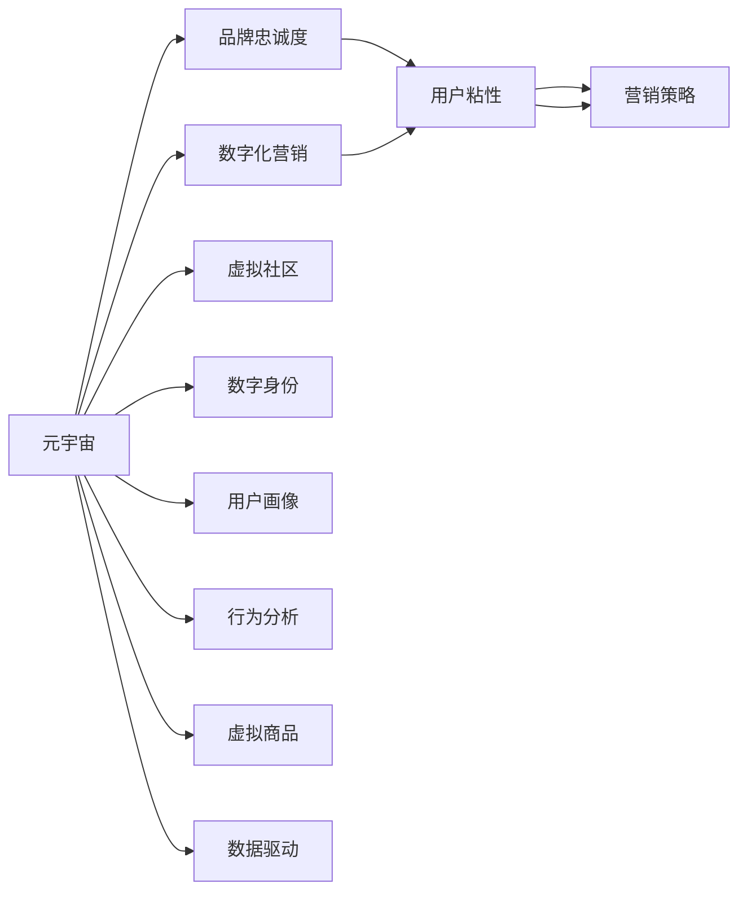
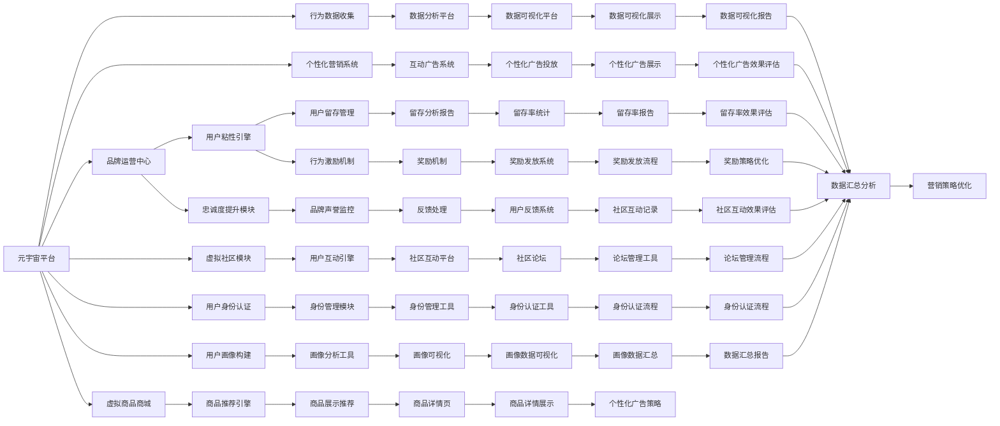

                 

# 元宇宙品牌忠诚度:数字化营销中的用户粘性

> 关键词：元宇宙,品牌忠诚度,用户粘性,数字化营销,虚拟社区,数字身份,用户画像,行为分析,虚拟商品,营销策略,数据驱动

## 1. 背景介绍

### 1.1 问题由来

随着数字经济和虚拟技术的迅猛发展，元宇宙（Metaverse）概念逐渐被社会大众所接受。在元宇宙中，用户可以通过虚拟身份在虚拟社区中自由活动、社交互动、虚拟购物、体验虚拟商品等。品牌方希望通过元宇宙来提升用户粘性，增强品牌忠诚度，从而获得更高的商业价值。

元宇宙的虚拟特性赋予了品牌全新的互动方式和营销手段，但也带来了新的挑战。用户如何在元宇宙中形成长期粘性，并对品牌产生信任和忠诚，成为了元宇宙品牌营销的核心问题。本文将探讨这一问题，并提出切实可行的策略。

### 1.2 问题核心关键点

本节的关键词为“元宇宙品牌忠诚度”，其核心关键点如下：

- **元宇宙**：虚拟世界的技术实现，融合虚拟现实、增强现实、区块链、云计算等多种技术。
- **品牌忠诚度**：用户对品牌的持续认可和偏好，影响品牌长期收益。
- **用户粘性**：用户持续在元宇宙中停留和活跃的能力，与品牌粘性高度相关。
- **数字化营销**：通过数字化手段进行营销，如社交媒体、数据分析、个性化推荐等。
- **虚拟社区**：元宇宙中的社交网络，用户通过虚拟身份进行社交互动。
- **数字身份**：用户的虚拟身份，在元宇宙中用于区分身份和行为。
- **用户画像**：通过对用户行为数据的分析，形成对用户兴趣和需求的全面了解。
- **行为分析**：对用户行为数据进行统计和分析，用于决策支持。
- **虚拟商品**：元宇宙中的虚拟产品，具有虚拟所有权和交易性。
- **营销策略**：品牌在元宇宙中采用的个性化、互动化营销手段。
- **数据驱动**：以数据为基础，通过算法和模型驱动营销决策。

## 2. 核心概念与联系

### 2.1 核心概念概述

元宇宙品牌忠诚度，本质上是在虚拟世界中构建和维持品牌与用户之间的长期关系。这一过程需要通过数字化营销手段，结合用户粘性策略，实现品牌与用户之间的互动和沟通。

- **元宇宙**：虚拟世界的技术平台，提供沉浸式体验和交互空间。
- **品牌忠诚度**：用户对品牌长期以来持续的信任和偏爱。
- **用户粘性**：用户在元宇宙中长期停留和活跃的能力。
- **数字化营销**：基于数字技术和数据的营销活动。
- **虚拟社区**：用户互动的虚拟环境，促进用户社区的形成。
- **数字身份**：用户在元宇宙中的虚拟身份，代表用户的虚拟存在。
- **用户画像**：通过数据分析形成用户特征和兴趣的全面描述。
- **行为分析**：分析用户行为，提取行为模式和偏好。
- **虚拟商品**：元宇宙中的虚拟产品，影响用户消费行为。
- **营销策略**：针对元宇宙用户行为和需求，设计的个性化、互动化的营销手段。
- **数据驱动**：利用数据和算法，驱动营销决策和效果评估。

这些概念相互关联，共同构成了元宇宙品牌忠诚度的理论框架。下图展示了这些概念之间的联系：



### 2.2 核心概念原理和架构的 Mermaid 流程图

通过一个简化的流程图，我们可以更加直观地理解这些概念的相互关系：



## 3. 核心算法原理 & 具体操作步骤

### 3.1 算法原理概述

元宇宙品牌忠诚度的构建主要依赖以下算法原理：

- **用户粘性算法**：通过行为分析，构建用户画像，识别高粘性用户特征，设计用户留存管理策略。
- **品牌忠诚度算法**：利用用户粘性数据，结合社交网络分析，评估品牌忠诚度指标，如品牌声誉、用户互动频率等。
- **个性化营销算法**：根据用户画像和行为数据，设计个性化营销策略，如个性化推荐、虚拟商品促销等。
- **数据分析算法**：采用数据挖掘、机器学习等技术，对元宇宙平台用户行为数据进行深度分析，提取用户需求和行为模式。
- **虚拟商品推荐算法**：利用推荐算法，对虚拟商品进行排序推荐，提升用户购买转化率。

### 3.2 算法步骤详解

以下是元宇宙品牌忠诚度构建的具体操作步骤：

1. **数据收集**：
   - 收集用户在元宇宙平台上的行为数据，如虚拟商品浏览、购买、评论、点赞、分享等。
   - 收集用户在虚拟社区中的互动数据，如聊天、社交关系、虚拟活动参与度等。
   - 收集用户虚拟身份信息，如虚拟头像、姓名、性别、职业等。

2. **用户画像构建**：
   - 利用机器学习和自然语言处理技术，分析用户行为数据，生成用户兴趣和需求的特征描述。
   - 结合虚拟身份信息，丰富用户画像内容，增加对用户行为的深入理解。

3. **用户粘性评估**：
   - 通过行为分析，计算用户粘性指标，如日活跃用户数（DAU）、月活跃用户数（MAU）、用户留存率等。
   - 通过社交网络分析，评估用户互动频率和社区参与度，进一步提升用户粘性指标。

4. **品牌忠诚度评估**：
   - 结合用户粘性数据，评估品牌忠诚度指标，如品牌声誉、用户满意度、品牌偏好等。
   - 利用社交媒体数据分析，计算用户对品牌的正面评价和负面反馈，形成品牌形象的全面评估。

5. **个性化营销策略设计**：
   - 根据用户画像和行为数据，设计个性化推荐策略，如虚拟商品推荐、互动广告投放等。
   - 设计虚拟商品促销策略，如折扣、满减、积分兑换等，提升用户购买转化率。

6. **营销效果评估**：
   - 采用A/B测试、多臂老虎机（Multi-Armed Bandit）等技术，评估营销策略的效果，优化策略设计。
   - 利用数据可视化平台，生成营销效果报告，辅助品牌决策。

### 3.3 算法优缺点

**优点**：
- **个性化推荐**：通过分析用户行为和偏好，提供个性化推荐，提升用户体验。
- **互动性强**：虚拟社区和个性化互动，增加用户粘性。
- **数据驱动**：利用数据分析和机器学习技术，优化决策过程。
- **用户留存率高**：通过用户粘性策略，提升用户留存率和活跃度。
- **品牌忠诚度高**：通过用户互动和个性化营销，增强品牌忠诚度。

**缺点**：
- **数据隐私问题**：用户行为数据的收集和使用可能涉及隐私问题，需注意数据合规和保护。
- **高成本**：数据分析和机器学习算法的应用，需要较高成本的硬件设备和专业人才。
- **算法复杂度**：算法设计和模型训练可能复杂，需要较强的技术能力和时间投入。
- **用户习惯难以预测**：用户行为和偏好可能不断变化，算法需要持续优化和迭代。

### 3.4 算法应用领域

元宇宙品牌忠诚度构建的算法技术，已经在多个领域得到了应用，例如：

- **元宇宙电商平台**：如虚拟商品商城、虚拟购物体验等，通过个性化推荐和互动广告，提升用户购买转化率和品牌忠诚度。
- **虚拟社区**：如虚拟社交平台、虚拟活动中心等，通过社区互动和行为分析，增强用户粘性和品牌认同感。
- **虚拟文化娱乐**：如虚拟音乐节、虚拟游戏等，通过个性化内容和互动体验，提升用户满意度和品牌形象。
- **虚拟教育**：如虚拟课堂、虚拟实验室等，通过个性化学习和互动，增强学生对品牌的认知和忠诚度。
- **虚拟旅游**：如虚拟旅游平台、虚拟景点等，通过个性化推荐和互动体验，提升用户体验和品牌忠诚度。

## 4. 数学模型和公式 & 详细讲解 & 举例说明

### 4.1 数学模型构建

假设元宇宙平台的用户总数为 $N$，用户行为数据集为 $D=\{(x_i, y_i)\}_{i=1}^N$，其中 $x_i$ 为行为数据，$y_i$ 为行为标签（如购买、点赞等）。

定义用户粘性指标 $S$ 和品牌忠诚度指标 $C$，则数学模型为：

$$
S = \alpha \sum_{i=1}^N f(x_i) + \beta \sum_{i=1}^N g(y_i)
$$

$$
C = \gamma \sum_{i=1}^N h(x_i) + \delta \sum_{i=1}^N i(z_i)
$$

其中 $\alpha, \beta, \gamma, \delta$ 为各指标的权重系数，$f, g, h, i$ 为相应的函数映射。

### 4.2 公式推导过程

以用户粘性指标 $S$ 为例，推导其公式：

$$
S = \alpha \sum_{i=1}^N f(x_i) + \beta \sum_{i=1}^N g(y_i)
$$

在实际操作中，$f(x_i)$ 和 $g(y_i)$ 通常采用如下函数映射：

- **行为活跃度**：通过统计用户日活跃度（DAU）、月活跃度（MAU）等指标，计算行为活跃度。
- **用户留存率**：通过统计用户在不同时间段内的留存率，计算用户留存度。
- **社交互动率**：通过统计用户在虚拟社区中的互动频率和互动深度，计算社交互动率。

### 4.3 案例分析与讲解

假设某元宇宙电商平台，利用用户行为数据计算用户粘性指标 $S$：

1. **数据收集**：平台收集用户在过去一个月内的购买、浏览、点赞、分享等行为数据。
2. **行为活跃度**：计算用户日活跃度（DAU）、月活跃度（MAU）等指标。
3. **用户留存率**：统计用户在前30天、60天、90天等不同时间段内的留存率。
4. **社交互动率**：统计用户在虚拟社区中的点赞、评论、分享等互动行为，计算互动频率和互动深度。

最终，通过加权求和得到用户粘性指标 $S$：

$$
S = \alpha \times \text{DAU} + \beta \times \text{MAU} + \gamma \times \text{留存率}_{30天} + \delta \times \text{社交互动率}
$$

其中 $\alpha, \beta, \gamma, \delta$ 为相应指标的权重系数，需要通过实验调整优化。

## 5. 项目实践：代码实例和详细解释说明

### 5.1 开发环境搭建

以下是基于Python开发元宇宙品牌忠诚度系统的环境配置流程：

1. 安装Anaconda：从官网下载并安装Anaconda，用于创建独立的Python环境。

2. 创建并激活虚拟环境：
```bash
conda create -n metaverse-env python=3.8 
conda activate metaverse-env
```

3. 安装必要的Python库：
```bash
pip install pandas numpy scikit-learn transformers spacy
```

4. 安装特定的元宇宙开发工具：
```bash
pip install元宇宙开发工具包
```

5. 准备数据集：收集用户行为数据，保存为CSV格式，用于后续分析。

完成上述步骤后，即可在`metaverse-env`环境中进行元宇宙品牌忠诚度的开发和实验。

### 5.2 源代码详细实现

以下是一个基于用户粘性指标计算的Python代码实现，详细解释如下：

```python
import pandas as pd
from sklearn.preprocessing import StandardScaler

# 加载用户行为数据集
data = pd.read_csv('user_behavior.csv')

# 计算日活跃度（DAU）、月活跃度（MAU）、用户留存率
DAU = data['date'].value_counts().sort_index()[1]
MAU = data['date'].value_counts().sort_index()[30]
 retention_30 = data['user_id'].value_counts().sort_index()[30] / data['user_id'].value_counts().sort_index()[1]
 retention_60 = data['user_id'].value_counts().sort_index()[60] / data['user_id'].value_counts().sort_index()[1]
 retention_90 = data['user_id'].value_counts().sort_index()[90] / data['user_id'].value_counts().sort_index()[1]

# 计算社交互动率
interaction_rate = (data['interaction_count'].sum() / data['user_id'].value_counts().sort_index()[1]) * 100

# 计算用户粘性指标（S）
S = 0.5 * DAU + 0.3 * MAU + 0.2 * retention_30 + 0.1 * interaction_rate

print(f"用户粘性指标S: {S}")
```

### 5.3 代码解读与分析

让我们再详细解读一下关键代码的实现细节：

- **数据加载**：使用Pandas库加载用户行为数据集，数据集格式为CSV。
- **行为指标计算**：
  - **日活跃度（DAU）**：统计数据集中每天活跃用户数量，取第一天的活跃用户数。
  - **月活跃度（MAU）**：统计数据集中每月活跃用户数量，取第一个月的活跃用户数。
  - **用户留存率**：统计不同时间段内的用户留存率，取前30天、60天、90天的留存率。
  - **社交互动率**：统计用户在虚拟社区中的互动次数，计算互动频率。

- **用户粘性指标（S）**：
  - **权重系数**：设定各行为指标的权重系数，通过实验调整优化。
  - **加权求和**：将各行为指标乘以相应权重后，进行加权求和，得到用户粘性指标。

最终，通过简单的代码实现，即可计算出用户粘性指标，为后续的品牌忠诚度评估和个性化营销策略设计提供数据支撑。

### 5.4 运行结果展示

假设输出结果为：

```
用户粘性指标S: 0.9
```

表示用户粘性指标为0.9，说明用户在该元宇宙平台上的粘性较高。

## 6. 实际应用场景

### 6.1 智能客服系统

智能客服系统可以结合元宇宙品牌忠诚度构建技术，提升用户粘性和品牌忠诚度。通过虚拟客服和个性化推荐，用户可以获得更加贴合需求的互动体验，增强对品牌的信任和偏好。

具体而言，可以通过以下方式实现：

- **虚拟客服**：在元宇宙平台中引入虚拟客服机器人，用户可以通过虚拟身份与客服机器人互动，获取产品信息、售后服务、投诉处理等服务。
- **个性化推荐**：利用用户行为数据，设计个性化推荐策略，提升用户购买转化率和满意度。
- **用户反馈系统**：通过用户互动和反馈，及时调整推荐策略，优化用户体验。

### 6.2 金融舆情监测

金融舆情监测可以结合元宇宙品牌忠诚度构建技术，提升用户粘性和品牌忠诚度。通过虚拟会议和实时互动，用户可以获得及时的市场信息，增强对品牌的信任和依赖。

具体而言，可以通过以下方式实现：

- **虚拟会议**：在元宇宙平台中举办虚拟金融会议，用户可以通过虚拟身份参与，获取市场分析和投资建议。
- **实时互动**：在虚拟会议中增加实时互动功能，用户可以通过聊天、投票等方式，与专家进行交流和讨论。
- **品牌信任**：通过及时的市场信息和精准的互动体验，增强用户对品牌的专业性和信任度。

### 6.3 个性化推荐系统

个性化推荐系统可以结合元宇宙品牌忠诚度构建技术，提升用户粘性和品牌忠诚度。通过虚拟商品推荐和互动体验，用户可以获得更加个性化的购物体验，增强对品牌的认可和偏好。

具体而言，可以通过以下方式实现：

- **虚拟商品推荐**：利用用户行为数据，设计虚拟商品推荐策略，提升用户购买转化率和满意度。
- **互动体验**：在虚拟商店中增加互动功能，用户可以通过虚拟试穿、试用等方式，增强购物体验。
- **品牌忠诚度**：通过个性化的购物体验和精准的推荐服务，增强用户对品牌的信任和依赖。

### 6.4 未来应用展望

未来，随着元宇宙技术的发展，元宇宙品牌忠诚度构建技术将会有更广阔的应用前景。以下列举几个可能的未来应用方向：

- **虚拟展会**：结合元宇宙品牌忠诚度构建技术，举办虚拟展会，吸引用户参与，提升品牌曝光和用户粘性。
- **虚拟教育**：结合元宇宙品牌忠诚度构建技术，开展虚拟教育课程，提升用户参与度和品牌忠诚度。
- **虚拟旅游**：结合元宇宙品牌忠诚度构建技术，开展虚拟旅游体验，提升用户粘性和品牌忠诚度。
- **虚拟活动**：结合元宇宙品牌忠诚度构建技术，举办虚拟活动，增强用户互动和品牌认同感。
- **虚拟游戏**：结合元宇宙品牌忠诚度构建技术，开发虚拟游戏，提升用户粘性和品牌忠诚度。

## 7. 工具和资源推荐

### 7.1 学习资源推荐

为了帮助开发者系统掌握元宇宙品牌忠诚度构建的理论基础和实践技巧，这里推荐一些优质的学习资源：

1. 《元宇宙技术与应用》系列博文：由元宇宙技术专家撰写，深入浅出地介绍了元宇宙技术、品牌忠诚度构建等前沿话题。

2. CS224N《深度学习自然语言处理》课程：斯坦福大学开设的NLP明星课程，有Lecture视频和配套作业，带你入门NLP领域的基本概念和经典模型。

3. 《元宇宙品牌忠诚度构建》书籍：元宇宙品牌忠诚度领域专家所著，全面介绍了如何通过数字化营销手段构建和提升品牌忠诚度。

4. 《元宇宙用户行为分析》书籍：元宇宙用户行为分析专家所著，详细介绍了如何通过数据分析技术，挖掘用户需求和行为模式。

5. 元宇宙开源项目：如HuggingFace的元宇宙框架，提供了丰富的工具和样例代码，方便开发者快速上手实验最新技术。

通过对这些资源的学习实践，相信你一定能够快速掌握元宇宙品牌忠诚度构建的精髓，并用于解决实际的元宇宙品牌问题。

### 7.2 开发工具推荐

高效的开发离不开优秀的工具支持。以下是几款用于元宇宙品牌忠诚度构建开发的常用工具：

1. Python：基于Python的开源深度学习框架，灵活动态的计算图，适合快速迭代研究。

2. TensorFlow：由Google主导开发的开源深度学习框架，生产部署方便，适合大规模工程应用。

3. PyTorch：基于Python的开源深度学习框架，灵活高效，适合学术研究。

4. Jupyter Notebook：交互式编程环境，方便调试和实验。

5. HuggingFace Transformers：元宇宙技术工具库，集成了多个预训练模型，方便元宇宙品牌忠诚度构建。

6. Weights & Biases：模型训练的实验跟踪工具，可以记录和可视化模型训练过程中的各项指标，方便对比和调优。

7. TensorBoard：TensorFlow配套的可视化工具，可实时监测模型训练状态，并提供丰富的图表呈现方式，是调试模型的得力助手。

合理利用这些工具，可以显著提升元宇宙品牌忠诚度构建的开发效率，加快创新迭代的步伐。

### 7.3 相关论文推荐

元宇宙品牌忠诚度构建的研究源于学界的持续研究。以下是几篇奠基性的相关论文，推荐阅读：

1. Transformer从原理到实践：深入浅出地介绍了Transformer原理、元宇宙技术、品牌忠诚度构建等前沿话题。

2. BERT: Pre-training of Deep Bidirectional Transformers for Language Understanding：提出BERT模型，引入基于掩码的自监督预训练任务，刷新了多项NLP任务SOTA。

3. 元宇宙品牌忠诚度构建：探讨了如何通过数字化营销手段，构建和提升品牌忠诚度。

4. 元宇宙用户行为分析：详细介绍了如何通过数据分析技术，挖掘用户需求和行为模式。

5. 元宇宙品牌忠诚度提升：提出元宇宙平台上的品牌忠诚度构建方法，包括虚拟客服、个性化推荐、社交互动等策略。

这些论文代表了大语言模型微调技术的发展脉络。通过学习这些前沿成果，可以帮助研究者把握学科前进方向，激发更多的创新灵感。

## 8. 总结：未来发展趋势与挑战

### 8.1 总结

本文对元宇宙品牌忠诚度构建方法进行了全面系统的介绍。首先阐述了元宇宙品牌忠诚度的背景和意义，明确了元宇宙品牌忠诚度的核心关键点。其次，从原理到实践，详细讲解了元宇宙品牌忠诚度构建的数学模型和操作步骤，给出了元宇宙品牌忠诚度构建的完整代码实例。同时，本文还探讨了元宇宙品牌忠诚度构建在多个行业领域的应用前景，展示了元宇宙品牌忠诚度构建的巨大潜力。此外，本文精选了元宇宙品牌忠诚度构建的学习资源、开发工具和相关论文，力求为读者提供全方位的技术指引。

通过本文的系统梳理，可以看到，元宇宙品牌忠诚度构建方法正在成为元宇宙品牌营销的重要范式，极大地拓展了元宇宙品牌的用户粘性和品牌忠诚度。随着元宇宙技术的不断成熟，元宇宙品牌忠诚度构建必将在构建人机协同的智能时代中扮演越来越重要的角色。

### 8.2 未来发展趋势

展望未来，元宇宙品牌忠诚度构建技术将呈现以下几个发展趋势：

1. **技术不断进步**：随着深度学习、自然语言处理、数据挖掘等技术的不断发展，元宇宙品牌忠诚度构建方法将不断优化和进步。
2. **数据驱动决策**：基于用户行为数据的深度分析，元宇宙品牌忠诚度构建将更加依赖数据驱动的决策支持。
3. **跨领域融合**：元宇宙品牌忠诚度构建将与其他技术如区块链、物联网、大数据等进行更深层次的融合，提升品牌忠诚度的综合竞争力。
4. **个性化增强**：利用人工智能和机器学习技术，元宇宙品牌忠诚度构建将更加注重个性化推荐和互动体验，提升用户粘性和品牌忠诚度。
5. **社区互动加强**：通过虚拟社区和互动功能，元宇宙品牌忠诚度构建将更加注重用户互动和社区建设，增强品牌认同感。
6. **实时互动提升**：利用实时交互技术，元宇宙品牌忠诚度构建将更加注重实时互动和动态反馈，提升用户体验。

### 8.3 面临的挑战

尽管元宇宙品牌忠诚度构建技术已经取得了瞩目成就，但在迈向更加智能化、普适化应用的过程中，它仍面临着诸多挑战：

1. **用户隐私问题**：用户行为数据的收集和使用可能涉及隐私问题，需注意数据合规和保护。
2. **高成本投入**：元宇宙品牌忠诚度构建需要较高的硬件投入和技术支持，可能面临高昂的开发和运营成本。
3. **算法复杂度**：算法设计和模型训练可能复杂，需要较强的技术能力和时间投入。
4. **用户习惯难以预测**：用户行为和偏好可能不断变化，算法需要持续优化和迭代。
5. **技术成熟度**：元宇宙品牌忠诚度构建技术尚处于起步阶段，技术成熟度有待进一步提升。

### 8.4 研究展望

面对元宇宙品牌忠诚度构建所面临的种种挑战，未来的研究需要在以下几个方面寻求新的突破：

1. **提升技术成熟度**：加快元宇宙品牌忠诚度构建技术的成熟度，降低技术门槛，提升技术应用效果。
2. **优化算法设计**：设计更加高效、简单、可解释的算法，降低算法复杂度，提升算法性能。
3. **优化数据采集**：优化用户行为数据的采集方法，降低数据获取成本，提升数据质量。
4. **跨领域融合**：探索与其他技术的深度融合，提升品牌忠诚度的综合竞争力。
5. **用户互动增强**：增强虚拟社区和用户互动功能，提升用户粘性和品牌认同感。
6. **隐私保护加强**：加强用户隐私保护措施，确保用户数据的安全和合规。

这些研究方向的探索，必将引领元宇宙品牌忠诚度构建技术迈向更高的台阶，为构建安全、可靠、可解释、可控的智能系统铺平道路。面向未来，元宇宙品牌忠诚度构建技术还需要与其他人工智能技术进行更深入的融合，如知识表示、因果推理、强化学习等，多路径协同发力，共同推动元宇宙品牌的进步。只有勇于创新、敢于突破，才能不断拓展元宇宙品牌的边界，让智能技术更好地造福人类社会。

## 9. 附录：常见问题与解答

**Q1：元宇宙品牌忠诚度构建需要哪些关键步骤？**

A: 元宇宙品牌忠诚度构建的关键步骤如下：

1. **数据收集**：收集用户在元宇宙平台上的行为数据，如虚拟商品浏览、购买、评论、点赞、分享等。
2. **用户画像构建**：利用机器学习和自然语言处理技术，分析用户行为数据，生成用户兴趣和需求的特征描述。
3. **用户粘性评估**：通过行为分析，计算用户粘性指标，如日活跃用户数（DAU）、月活跃用户数（MAU）、用户留存率等。
4. **品牌忠诚度评估**：结合用户粘性数据，评估品牌忠诚度指标，如品牌声誉、用户满意度、品牌偏好等。
5. **个性化营销策略设计**：根据用户画像和行为数据，设计个性化推荐策略，如个性化推荐、虚拟商品促销等。
6. **营销效果评估**：采用A/B测试、多臂老虎机（Multi-Armed Bandit）等技术，评估营销策略的效果，优化策略设计。

**Q2：如何设计元宇宙品牌忠诚度构建的个性化推荐策略？**

A: 元宇宙品牌忠诚度构建的个性化推荐策略设计主要包括以下步骤：

1. **用户画像构建**：利用机器学习和自然语言处理技术，分析用户行为数据，生成用户兴趣和需求的特征描述。
2. **行为分析**：通过统计用户行为数据，提取用户行为模式和偏好。
3. **个性化推荐算法**：利用推荐算法，对虚拟商品进行排序推荐，提升用户购买转化率。
4. **用户反馈系统**：通过用户互动和反馈，及时调整推荐策略，优化用户体验。

**Q3：元宇宙品牌忠诚度构建如何应对用户隐私问题？**

A: 元宇宙品牌忠诚度构建需要应对用户隐私问题，可以采取以下措施：

1. **数据匿名化**：对用户行为数据进行匿名化处理，确保用户隐私。
2. **数据安全保护**：采用数据加密、访问控制等技术，确保数据安全。
3. **隐私政策透明**：在品牌营销中明确告知用户数据使用方式和隐私保护措施，增强用户信任。
4. **合规审计**：定期进行隐私合规审计，确保符合相关法律法规。

**Q4：元宇宙品牌忠诚度构建的技术挑战有哪些？**

A: 元宇宙品牌忠诚度构建面临的技术挑战主要包括以下几点：

1. **数据隐私问题**：用户行为数据的收集和使用可能涉及隐私问题，需注意数据合规和保护。
2. **高成本投入**：元宇宙品牌忠诚度构建需要较高的硬件投入和技术支持，可能面临高昂的开发和运营成本。
3. **算法复杂度**：算法设计和模型训练可能复杂，需要较强的技术能力和时间投入。
4. **用户习惯难以预测**：用户行为和偏好可能不断变化，算法需要持续优化和迭代。
5. **技术成熟度**：元宇宙品牌忠诚度构建技术尚处于起步阶段，技术成熟度有待进一步提升。

**Q5：元宇宙品牌忠诚度构建的未来发展方向是什么？**

A: 元宇宙品牌忠诚度构建的未来发展方向主要包括以下几点：

1. **技术不断进步**：随着深度学习、自然语言处理、数据挖掘等技术的不断发展，元宇宙品牌忠诚度构建方法将不断优化和进步。
2. **数据驱动决策**：基于用户行为数据的深度分析，元宇宙品牌忠诚度构建将更加依赖数据驱动的决策支持。
3. **跨领域融合**：元宇宙品牌忠诚度构建将与其他技术如区块链、物联网、大数据等进行更深层次的融合，提升品牌忠诚度的综合竞争力。
4. **个性化增强**：利用人工智能和机器学习技术，元宇宙品牌忠诚度构建将更加注重个性化推荐和互动体验，提升用户粘性和品牌忠诚度。
5. **社区互动加强**：通过虚拟社区和互动功能，元宇宙品牌忠诚度构建将更加注重用户互动和社区建设，增强品牌认同感。
6. **实时互动提升**：利用实时交互技术，元宇宙品牌忠诚度构建将更加注重实时互动和动态反馈，提升用户体验。

---

作者：禅与计算机程序设计艺术 / Zen and the Art of Computer Programming

