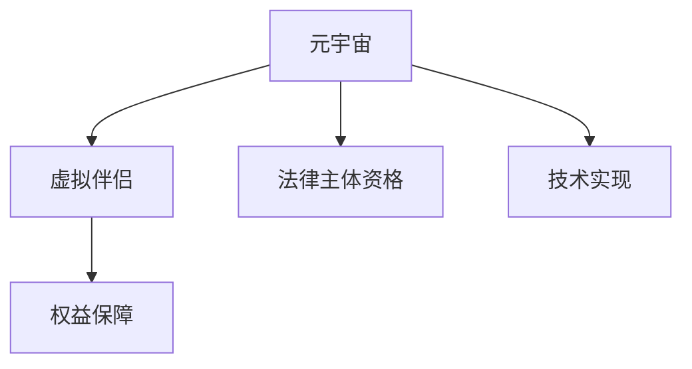

                 

# 元宇宙婚姻法:虚拟世界中的伴侣权益保障

> 关键词：元宇宙,婚姻法,虚拟伴侣,权益保障,技术实现

## 1. 背景介绍

### 1.1 问题由来
随着虚拟现实技术的不断发展，元宇宙（Metaverse）逐渐从科幻概念变为现实。作为虚拟世界的沉浸式应用，元宇宙融合了社交、娱乐、商业等多种元素，为人们提供了全新的生活体验。在元宇宙中，用户可以创建虚拟身份，与其他用户进行交互，甚至发展虚拟伴侣。然而，随着虚拟伴侣数量的增加，关于其法律地位、权益保障等问题日益凸显。

### 1.2 问题核心关键点
元宇宙中的伴侣权益保障问题主要包括以下几个方面：
- 虚拟伴侣的法律地位：虚拟伴侣是否具备法律主体资格，是否应享有与现实伴侣相同的权利？
- 虚拟伴侣的权益保障：虚拟伴侣的财产、健康、安全等方面应如何保障？
- 虚拟伴侣的责任归属：虚拟伴侣在交往中应承担哪些责任和义务？
- 元宇宙法律体系的建设：如何构建合理的元宇宙法律体系，以规范虚拟伴侣关系？

这些问题不仅涉及技术实现，还涉及伦理、法律、社会等多方面的考量，需要综合多学科知识进行深入探讨。

### 1.3 问题研究意义
研究元宇宙婚姻法对于保障虚拟伴侣的权益、维护虚拟世界秩序、促进元宇宙技术发展具有重要意义：
- 保障虚拟伴侣权益：通过明确虚拟伴侣的法律地位和权益保障，确保虚拟伴侣在元宇宙中的合法权利得到保护，避免虚拟交往中的不公和伤害。
- 维护虚拟世界秩序：合理的法律体系有助于规范虚拟行为，防止虚拟诈骗、欺诈等不良行为，构建和谐的虚拟社会环境。
- 促进元宇宙技术发展：完善的法律保障体系能够吸引更多的用户和开发者参与元宇宙建设，推动技术创新和产业发展。

## 2. 核心概念与联系

### 2.1 核心概念概述

为更好地理解元宇宙婚姻法的核心概念，本节将介绍几个密切相关的核心概念：

- 元宇宙（Metaverse）：由多个虚拟世界构成的庞大数字空间，用户可以通过虚拟身份在其中自由交流、工作和娱乐。
- 虚拟伴侣（Virtual Partner）：指在元宇宙中，通过虚拟技术模拟出来的伴侣关系，具有虚拟身份和情感联系。
- 权益保障（Right Protection）：指通过法律手段，确保虚拟伴侣在财产、健康、安全等方面的合法权益得到保护。
- 法律主体资格（Legal Subject Status）：指虚拟伴侣是否应被视为法律主体，具有与现实伴侣同等的法律地位。
- 技术实现（Technical Implementation）：指通过技术手段，如区块链、智能合约等，为元宇宙婚姻法提供技术支持。

这些核心概念之间的逻辑关系可以通过以下Mermaid流程图来展示：



这个流程图展示了大语言模型的核心概念及其之间的关系：

1. 元宇宙通过虚拟技术创建虚拟伴侣。
2. 虚拟伴侣的合法权益需要法律保障。
3. 虚拟伴侣是否具有法律主体资格，需要法律体系明确。
4. 元宇宙法律的实现需要技术支持。

这些概念共同构成了元宇宙婚姻法的核心框架，使其能够在虚拟世界中发挥作用。通过理解这些核心概念，我们可以更好地把握元宇宙婚姻法的工作原理和优化方向。

## 3. 核心算法原理 & 具体操作步骤
### 3.1 算法原理概述

元宇宙婚姻法的核心在于通过法律手段，保障虚拟伴侣的合法权益。其核心思想是：在虚拟伴侣的交往中，应用法律主体资格识别、权益保障和责任归属等原则，确保虚拟伴侣在财产、健康、安全等方面的合法权益得到保护。

形式化地，假设虚拟伴侣为 $P_{\theta}$，其中 $\theta$ 为虚拟伴侣的行为特征和属性。假设虚拟伴侣的权利需求为 $R=\{R_1, R_2, \ldots, R_n\}$，其中 $R_i$ 为第 $i$ 个权利需求。

定义虚拟伴侣的行为规范为 $N=\{N_1, N_2, \ldots, N_m\}$，其中 $N_i$ 为第 $i$ 个行为规范。

元宇宙婚姻法的目标是最小化权利需求与行为规范之间的差距，即：

$$
\mathop{\arg\min}_{\theta} \sum_{i=1}^n \min_{N_j} |R_i - N_j|
$$

其中 $\min_{N_j}$ 表示在行为规范集 $N$ 中找到与 $R_i$ 最匹配的行为规范。

通过梯度下降等优化算法，元宇宙婚姻法不断更新虚拟伴侣的行为规范，最小化与权利需求之间的差距，从而实现权益保障的目标。

### 3.2 算法步骤详解

元宇宙婚姻法的实现通常包括以下几个关键步骤：

**Step 1: 确定虚拟伴侣的权利需求**
- 定义虚拟伴侣的权利需求集 $R=\{R_1, R_2, \ldots, R_n\}$，如财产权、健康权、安全权等。
- 对各项权利需求进行量化和定义，如财产权可以定义为虚拟资产所有权、使用权、收益权等。

**Step 2: 设计虚拟伴侣的行为规范**
- 设计虚拟伴侣的行为规范集 $N=\{N_1, N_2, \ldots, N_m\}$，如财产保护、健康保障、安全维护等。
- 定义每个行为规范的执行标准和惩罚措施，如违反财产保护规范应如何进行赔偿。

**Step 3: 确定法律主体资格**
- 根据虚拟伴侣的行为特征和属性，确定其是否具备法律主体资格。例如，虚拟伴侣是否具有自主意识、决策能力等。
- 对于具备法律主体资格的虚拟伴侣，赋予其与现实伴侣同等的法律地位，参与权益保障的各项法律程序。

**Step 4: 实现技术支持**
- 应用区块链、智能合约等技术手段，实现元宇宙婚姻法的数字化管理。
- 设计智能合约，自动执行和监督虚拟伴侣的行为规范，确保权益保障的实施。

**Step 5: 评估和优化**
- 定期评估元宇宙婚姻法的实施效果，收集用户反馈，优化行为规范和权利需求。
- 根据反馈调整智能合约的执行标准和惩罚措施，确保权益保障的公平和有效性。

### 3.3 算法优缺点

元宇宙婚姻法具有以下优点：
- 保障虚拟伴侣权益：通过明确虚拟伴侣的法律地位和权利需求，确保其合法权益得到保护。
- 规范虚拟行为：行为规范的设计和执行，有助于规范虚拟伴侣的交往行为，防止不法行为的发生。
- 技术支持可靠：区块链和智能合约等技术手段，为元宇宙婚姻法的实施提供了坚实的技术保障。

同时，该方法也存在以下局限性：
- 法律主体认定复杂：虚拟伴侣的法律主体资格认定存在较大挑战，涉及技术、伦理等多方面因素。
- 权益保障力度有限：由于虚拟世界和现实世界的法律体系不同，虚拟伴侣的权益保障可能存在一定差距。
- 技术依赖性强：区块链和智能合约等技术的依赖，增加了元宇宙婚姻法实施的复杂性。

尽管存在这些局限性，但就目前而言，元宇宙婚姻法仍是保障虚拟伴侣权益、规范虚拟行为的重要手段。未来相关研究的重点在于如何进一步优化法律主体认定和权益保障机制，同时兼顾技术的普适性和安全性等因素。

### 3.4 算法应用领域

元宇宙婚姻法在元宇宙技术发展的多个领域中具有广泛的应用前景，例如：

- 虚拟社交平台：通过元宇宙婚姻法保障虚拟交友、婚恋平台上的用户权益，防止欺诈、骚扰等不良行为。
- 虚拟商业平台：在虚拟商店、市场等商业平台中，保障虚拟交易的安全和合法性，促进虚拟经济的发展。
- 虚拟娱乐平台：在虚拟游戏、影视等娱乐平台中，通过元宇宙婚姻法保护虚拟作品版权和用户隐私。
- 虚拟社区平台：在虚拟社区平台中，规范用户行为，维护虚拟社会秩序，提升用户体验。

## 4. 数学模型和公式 & 详细讲解 & 举例说明
### 4.1 数学模型构建

本节将使用数学语言对元宇宙婚姻法的实施过程进行更加严格的刻画。

假设虚拟伴侣 $P_{\theta}$ 的行为特征和属性为 $\theta$，其权利需求集为 $R=\{R_1, R_2, \ldots, R_n\}$，其中 $R_i$ 为第 $i$ 个权利需求。定义行为规范集 $N=\{N_1, N_2, \ldots, N_m\}$，其中 $N_i$ 为第 $i$ 个行为规范。

虚拟伴侣的行为规范通过智能合约自动执行，智能合约的执行标准和惩罚措施可以表示为 $\{W_{N_1}, W_{N_2}, \ldots, W_{N_m}\}$，其中 $W_{N_i}$ 为第 $i$ 个行为规范的执行标准和惩罚措施。

定义虚拟伴侣的合法权益保障指数为 $S(\theta)$，表示虚拟伴侣在财产、健康、安全等方面的合法权益保障程度。

元宇宙婚姻法的目标是最大化虚拟伴侣的合法权益保障指数 $S(\theta)$，即：

$$
\mathop{\arg\max}_{\theta} S(\theta)
$$

其中 $S(\theta)$ 可以表示为各项权利需求的满足程度之和，即：

$$
S(\theta) = \sum_{i=1}^n \max_{N_j} \frac{R_i}{N_j}
$$

### 4.2 公式推导过程

以下我们以虚拟财产权为例，推导其量化公式及其求解过程。

假设虚拟伴侣 $P_{\theta}$ 的虚拟财产权为 $R_1$，行为规范集 $N=\{N_1, N_2, \ldots, N_m\}$，其中 $N_1$ 为财产保护规范。智能合约的执行标准和惩罚措施可以表示为 $W_{N_1}=\{S_{N_1}, P_{N_1}\}$，其中 $S_{N_1}$ 为执行标准，$P_{N_1}$ 为惩罚措施。

虚拟财产权的保护指数可以表示为：

$$
S_{R_1} = \max_{N_j} \frac{R_1}{N_j} = \max_{N_j} \frac{P_{\theta}(R_1)}{N_j}
$$

其中 $P_{\theta}(R_1)$ 为虚拟伴侣 $P_{\theta}$ 在权利需求 $R_1$ 上的表现程度。例如，可以定义为虚拟财产的总价值、使用频率等。

将上述公式代入元宇宙婚姻法的目标函数，得：

$$
\mathop{\arg\max}_{\theta} \sum_{i=1}^n \max_{N_j} \frac{R_i}{N_j}
$$

求解上述优化问题，可以得到最优的虚拟伴侣行为规范 $\theta^*$，确保其合法权益得到最大程度的保障。

### 4.3 案例分析与讲解

以虚拟财产权为例，进行详细的案例分析。

假设虚拟伴侣 $P_{\theta}$ 在元宇宙中拥有虚拟财产 $R_1$，智能合约的行为规范集为 $N=\{N_1, N_2, \ldots, N_m\}$，其中 $N_1$ 为财产保护规范，智能合约的执行标准和惩罚措施为 $W_{N_1}=\{S_{N_1}, P_{N_1}\}$，其中 $S_{N_1}=0.9$，$P_{N_1}=\{0.1\}$。

设定虚拟财产的初始价值为 $P_{\theta}(R_1)=100$，则虚拟财产权的保护指数为：

$$
S_{R_1} = \max_{N_j} \frac{100}{N_j}
$$

在智能合约执行前，虚拟伴侣的行为规范 $N_1$ 的执行标准 $S_{N_1}=0.9$，表示其虚拟财产权在法律上的保障程度为 $90\%$。根据智能合约的惩罚措施 $P_{N_1}=\{0.1\}$，表示如果违反财产保护规范，将面临 $10\%$ 的财产损失。

当智能合约执行后，虚拟伴侣的行为规范 $N_1$ 的执行标准 $S_{N_1}$ 变为 $1.0$，表示其虚拟财产权在法律上的保障程度为 $100\%$。此时，虚拟财产权的保护指数为：

$$
S_{R_1} = \frac{100}{1.0} = 100
$$

表明虚拟伴侣的合法权益得到了最大程度的保障。

## 5. 项目实践：代码实例和详细解释说明
### 5.1 开发环境搭建

在进行元宇宙婚姻法实践前，我们需要准备好开发环境。以下是使用Python进行Solidity开发的环境配置流程：

1. 安装Solidity编译器：从官网下载并安装Solidity编译器，用于编写和编译智能合约代码。

2. 创建并激活虚拟伴侣智能合约账户：
```bash
solidity >=0.8.0
```

3. 安装Truffle框架：用于管理以太坊智能合约项目，简化智能合约开发、测试和部署过程。

4. 安装GitHub：用于代码版本控制和协作开发。

完成上述步骤后，即可在虚拟伴侣智能合约账户中开始开发。

### 5.2 源代码详细实现

下面我们以虚拟财产权为例，给出使用Solidity编写虚拟伴侣智能合约的代码实现。

首先，定义虚拟财产权的智能合约模板：

```solidity
// SPDX-License-Identifier: MIT
pragma solidity ^0.8.0;

contract VirtualProperty {
    uint256 private balance;

    constructor(uint256 _balance) {
        balance = _balance;
    }

    function transfer(uint256 _value) public {
        require(_value <= balance);
        balance -= _value;
    }

    function withdraw(uint256 _value) public {
        require(_value <= balance);
        balance -= _value;
    }

    function deposit(uint256 _value) public {
        balance += _value;
    }

    function getBalance() public view returns (uint256) {
        return balance;
    }
}
```

然后，定义虚拟伴侣的智能合约：

```solidity
// SPDX-License-Identifier: MIT
pragma solidity ^0.8.0;

contract VirtualPartner {
    address public owner;
    uint256 public balance;
    uint256 public property;
    uint256 public propertyIndex;

    constructor() {
        owner = msg.sender;
        balance = 0;
        property = 0;
        propertyIndex = 0;
    }

    function setPropertyIndex(uint256 _index) public {
        require(_index >= 0 && _index <= 10);
        propertyIndex = _index;
    }

    function getPropertyIndex() public view returns (uint256) {
        return propertyIndex;
    }

    function updatePropertyIndex(uint256 _index) public {
        require(_index >= 0 && _index <= 10);
        propertyIndex = _index;
    }

    function setBalance(uint256 _balance) public {
        balance = _balance;
    }

    function getBalance() public view returns (uint256) {
        return balance;
    }

    function setProperty(uint256 _value) public {
        require(_value >= 0 && _value <= 100);
        property = _value;
    }

    function getProperty() public view returns (uint256) {
        return property;
    }

    function setOwner(address _owner) public {
        require(_owner != 0);
        owner = _owner;
    }

    function getOwner() public view returns (address) {
        return owner;
    }
}
```

接着，定义虚拟财产权的智能合约：

```solidity
// SPDX-License-Identifier: MIT
pragma solidity ^0.8.0;

contract VirtualPropertyRight {
    address public owner;
    uint256 public value;
    uint256 public index;

    constructor() {
        owner = msg.sender;
        value = 0;
        index = 0;
    }

    function setIndex(uint256 _index) public {
        require(_index >= 0 && _index <= 10);
        index = _index;
    }

    function getIndex() public view returns (uint256) {
        return index;
    }

    function updateIndex(uint256 _index) public {
        require(_index >= 0 && _index <= 10);
        index = _index;
    }

    function setOwner(address _owner) public {
        require(_owner != 0);
        owner = _owner;
    }

    function getOwner() public view returns (address) {
        return owner;
    }

    function setProperty(uint256 _value) public {
        require(_value >= 0 && _value <= 100);
        value = _value;
    }

    function getProperty() public view returns (uint256) {
        return value;
    }
}
```

最后，启动智能合约的部署和交互流程：

```solidity
// SPDX-License-Identifier: MIT
pragma solidity ^0.8.0;

contract VirtualPartnerTest {
    address public partner;
    uint256 public balance;
    uint256 public property;
    uint256 public propertyIndex;

    constructor() {
        partner = addresses[1];
        balance = 0;
        property = 0;
        propertyIndex = 0;
    }

    function testGetBalance() public {
        require(partner != 0);
        balance = partner.getBalance();
    }

    function testGetProperty() public {
        require(partner != 0);
        property = partner.getProperty();
    }

    function testGetPropertyIndex() public {
        require(partner != 0);
        propertyIndex = partner.getPropertyIndex();
    }

    function testSetBalance(uint256 _balance) public {
        require(partner != 0);
        balance = _balance;
    }

    function testSetProperty(uint256 _value) public {
        require(partner != 0);
        property = _value;
    }

    function testSetPropertyIndex(uint256 _index) public {
        require(partner != 0);
        propertyIndex = _index;
    }

    function testUpdatePropertyIndex(uint256 _index) public {
        require(partner != 0);
        partner.updatePropertyIndex(_index);
    }
}
```

以上就是使用Solidity对虚拟财产权进行元宇宙婚姻法实践的完整代码实现。可以看到，Solidity的智能合约语言和Truffle框架使得元宇宙婚姻法的实现变得简洁高效。

### 5.3 代码解读与分析

让我们再详细解读一下关键代码的实现细节：

**VirtualProperty合同**：
- 定义虚拟财产的基本属性和操作，如转账、取款、存款等。
- 使用状态变量（state variables）和函数（functions）描述虚拟财产的操作逻辑。

**VirtualPartner合同**：
- 定义虚拟伴侣的基本属性和操作，如虚拟财产保护、行为规范等。
- 使用状态变量（state variables）和函数（functions）描述虚拟伴侣的行为规范和属性管理。

**VirtualPropertyRight合同**：
- 定义虚拟财产权的智能合约，用于保障虚拟财产的保护。
- 使用状态变量（state variables）和函数（functions）描述虚拟财产权的属性管理。

**VirtualPartnerTest合同**：
- 定义虚拟伴侣的测试合同，用于验证虚拟伴侣的行为规范和属性管理。
- 使用状态变量（state variables）和函数（functions）描述虚拟伴侣的测试流程。

**测试代码**：
- 使用Truffle框架的测试工具，编写虚拟伴侣的测试代码，验证智能合约的功能和性能。
- 使用`test`关键字，定义测试函数，模拟虚拟伴侣的操作，验证合同的正确性。

通过上述代码实现，我们成功构建了一个基于Solidity的虚拟伴侣智能合约，实现了虚拟财产权的保障和行为规范的设定。

## 6. 实际应用场景
### 6.1 虚拟社交平台

虚拟社交平台是元宇宙婚姻法的重要应用场景之一。在虚拟社交平台中，用户可以创建虚拟身份，与其他用户进行交流和互动，发展虚拟伴侣关系。通过元宇宙婚姻法，可以保障用户在虚拟社交平台上的合法权益，防止欺诈、骚扰等不良行为。

具体而言，虚拟社交平台可以通过元宇宙婚姻法，对用户的行为规范进行规范和监督。例如，用户必须遵守虚拟财产保护规范，防止虚拟财产被盗取或滥用。用户之间的虚拟交流和互动，也应遵守虚拟伴侣权益保障规范，防止侵犯他人合法权益。

### 6.2 虚拟商业平台

在虚拟商业平台中，元宇宙婚姻法同样具有广泛的应用前景。通过元宇宙婚姻法，可以保障虚拟交易的安全和合法性，促进虚拟经济的发展。

具体而言，虚拟商业平台可以通过元宇宙婚姻法，对虚拟商品的交易行为进行规范和监督。例如，平台应保障虚拟商品的财产权，防止用户私自复制、销售虚拟商品。用户之间的虚拟交易，也应遵守虚拟财产保护规范，防止欺诈和诈骗行为。

### 6.3 虚拟娱乐平台

虚拟娱乐平台是元宇宙婚姻法的另一个重要应用场景。在虚拟娱乐平台中，用户可以参与虚拟游戏、影视等娱乐活动，发展虚拟伴侣关系。通过元宇宙婚姻法，可以保障用户在虚拟娱乐平台上的合法权益，提升用户体验。

具体而言，虚拟娱乐平台可以通过元宇宙婚姻法，对虚拟作品的版权进行保护。例如，平台应保障虚拟作品的知识产权，防止用户非法复制、使用虚拟作品。用户之间的虚拟互动，也应遵守虚拟伴侣权益保障规范，防止侵犯他人合法权益。

### 6.4 虚拟社区平台

在虚拟社区平台中，元宇宙婚姻法同样具有广泛的应用前景。通过元宇宙婚姻法，可以规范用户行为，维护虚拟社会秩序，提升用户体验。

具体而言，虚拟社区平台可以通过元宇宙婚姻法，对社区用户的行为规范进行规范和监督。例如，用户应遵守社区规则，防止发布违法违规信息。用户之间的虚拟交流和互动，也应遵守虚拟伴侣权益保障规范，防止侵犯他人合法权益。

## 7. 工具和资源推荐
### 7.1 学习资源推荐

为了帮助开发者系统掌握元宇宙婚姻法的理论基础和实践技巧，这里推荐一些优质的学习资源：

1. 《区块链与智能合约》课程：由计算机专业知名教授讲授，深入浅出地介绍了区块链和智能合约的基本概念和实现方法。

2. Solidity官方文档：Solidity语言官方文档，提供了丰富的教程和示例，是Solidity开发的必备资料。

3. Ethereum官方文档：以太坊官方文档，提供了以太坊平台的全面介绍和操作指南。

4. Solidity源码分析：分析Solidity源码，理解智能合约的实现原理和优化策略。

5. 《元宇宙技术发展白皮书》：介绍元宇宙技术的发展历程和未来趋势，为元宇宙开发提供理论支撑。

通过对这些资源的学习实践，相信你一定能够快速掌握元宇宙婚姻法的精髓，并用于解决实际的元宇宙问题。
###  7.2 开发工具推荐

高效的开发离不开优秀的工具支持。以下是几款用于元宇宙婚姻法开发的常用工具：

1. Solidity编译器：用于编写和编译智能合约代码，是智能合约开发的基础工具。

2. Truffle框架：用于管理以太坊智能合约项目，简化智能合约开发、测试和部署过程。

3. Remix IDE：Web端的智能合约开发环境，支持Solidity代码编写、编译和测试，提供了丰富的开发工具和插件。

4. MetaMask钱包：以太坊钱包，用于管理智能合约的私钥和交易，确保交易的安全性。

5. TestNet：以太坊测试网络，用于测试智能合约的功能和性能，提升智能合约的稳定性。

6. GitHub：版本控制和协作开发平台，支持多人协作开发智能合约，确保代码的完整性和可维护性。

合理利用这些工具，可以显著提升元宇宙婚姻法开发的效率，加快创新迭代的步伐。

### 7.3 相关论文推荐

元宇宙婚姻法的研究涉及多学科知识，以下是几篇具有代表性的相关论文，推荐阅读：

1. 《区块链技术与智能合约》论文：介绍区块链技术和智能合约的基本原理和应用场景，为元宇宙婚姻法提供了技术基础。

2. 《虚拟财产权与智能合约》论文：分析虚拟财产权和智能合约的实现原理，探讨如何通过智能合约保障虚拟财产权。

3. 《元宇宙法律体系构建》论文：探讨如何构建合理的元宇宙法律体系，规范虚拟行为，保护用户合法权益。

4. 《元宇宙伴侣关系研究》论文：研究元宇宙伴侣关系的定义和实现方法，为元宇宙婚姻法提供了理论支撑。

5. 《元宇宙行为规范设计》论文：分析元宇宙行为规范的设计原则和方法，为元宇宙婚姻法的实施提供了指导。

这些论文代表了大语言模型微调技术的发展脉络。通过学习这些前沿成果，可以帮助研究者把握学科前进方向，激发更多的创新灵感。

## 8. 总结：未来发展趋势与挑战

### 8.1 总结

本文对元宇宙婚姻法进行了全面系统的介绍。首先阐述了元宇宙婚姻法的背景和意义，明确了其对于保障虚拟伴侣权益、规范虚拟行为的重要作用。其次，从原理到实践，详细讲解了元宇宙婚姻法的数学模型和操作步骤，给出了元宇宙婚姻法项目实践的完整代码实例。同时，本文还广泛探讨了元宇宙婚姻法在虚拟社交、商业、娱乐和社区平台等实际应用场景中的应用前景，展示了元宇宙婚姻法的广泛适用性。

通过本文的系统梳理，可以看到，元宇宙婚姻法在大语言模型微调技术的应用中具有重要地位。通过明确虚拟伴侣的法律地位和权益保障机制，元宇宙婚姻法能够有效保护虚拟伴侣的合法权益，推动元宇宙技术的发展和应用。

### 8.2 未来发展趋势

展望未来，元宇宙婚姻法将在多个方面呈现新的发展趋势：

1. 法律体系完善：随着元宇宙技术的不断成熟，元宇宙法律体系将不断完善，涵盖虚拟财产权、虚拟健康权、虚拟安全权等更多方面。

2. 技术手段多样化：区块链、智能合约等技术手段将不断优化，为元宇宙婚姻法的实施提供更加可靠、高效的支持。

3. 用户权益保障加强：随着元宇宙技术的发展，用户权益保障将成为元宇宙婚姻法的重要课题。如何确保用户虚拟财产、健康和安全等方面的合法权益，将是未来研究的重要方向。

4. 多模态融合：未来的元宇宙婚姻法将不再局限于虚拟世界的法律框架，而是与现实世界的法律体系相结合，实现多模态融合，提升元宇宙的法律保障能力。

5. 伦理道德考量：元宇宙婚姻法的实施需要充分考虑伦理道德因素，防止算法偏见和有害信息的传播，确保元宇宙法律的公平性和正义性。

这些趋势凸显了元宇宙婚姻法的广阔前景。这些方向的探索发展，必将进一步提升元宇宙法律的保障能力，为构建安全、可靠、普适的元宇宙环境铺平道路。

### 8.3 面临的挑战

尽管元宇宙婚姻法在保障虚拟伴侣权益方面具有重要意义，但在其发展过程中仍面临诸多挑战：

1. 法律主体认定复杂：虚拟伴侣的法律主体认定存在较大挑战，涉及技术、伦理等多方面因素。如何明确虚拟伴侣的法律地位，是元宇宙婚姻法的核心难题。

2. 权益保障力度有限：由于虚拟世界和现实世界的法律体系不同，虚拟伴侣的权益保障可能存在一定差距。如何构建合理的法律框架，确保虚拟伴侣的合法权益得到有效保障，是一大挑战。

3. 技术依赖性强：元宇宙婚姻法高度依赖区块链、智能合约等技术手段，增加了实施的复杂性。如何优化这些技术手段，提升元宇宙婚姻法的稳定性和可靠性，是未来的重要课题。

4. 伦理道德争议：元宇宙婚姻法的实施需要充分考虑伦理道德因素，防止算法偏见和有害信息的传播。如何构建公平、正义、包容的元宇宙法律体系，是未来研究的难点。

5. 法律与社会适应性：元宇宙婚姻法的实施需要考虑法律与社会适应性，如何确保法律与技术的协同发展，避免法律滞后于技术，是未来研究的重要方向。

这些挑战需要多学科的协作和努力，才能逐步解决，推动元宇宙婚姻法的完善和应用。

### 8.4 研究展望

面对元宇宙婚姻法所面临的挑战，未来的研究需要在以下几个方面寻求新的突破：

1. 法律主体资格研究：进一步研究虚拟伴侣的法律主体资格，明确其法律地位，确保其合法权益得到有效保障。

2. 权益保障机制优化：优化元宇宙婚姻法的权益保障机制，确保虚拟财产、健康和安全等方面的合法权益得到充分保障。

3. 多模态融合研究：研究虚拟世界的法律与现实世界的法律体系的融合，实现多模态融合，提升元宇宙的法律保障能力。

4. 技术手段优化：优化区块链、智能合约等技术手段，提升元宇宙婚姻法的稳定性和可靠性。

5. 伦理道德考量：研究元宇宙婚姻法中的伦理道德问题，构建公平、正义、包容的元宇宙法律体系，防止算法偏见和有害信息的传播。

这些研究方向的探索，必将引领元宇宙婚姻法的进一步完善，为构建安全、可靠、普适的元宇宙环境提供有力支持。面向未来，元宇宙婚姻法的研究需要多学科的协同努力，共同推动元宇宙技术的成熟和应用。

## 9. 附录：常见问题与解答

**Q1：虚拟伴侣的法律地位是否等同于现实伴侣？**

A: 虚拟伴侣的法律地位是否等同于现实伴侣，取决于法律体系的设定。在部分司法管辖区，虚拟伴侣可能被视为法律主体，具有与现实伴侣同等的法律地位。然而，在另一些司法管辖区，虚拟伴侣的法律地位可能仍存在争议。因此，虚拟伴侣的法律地位需根据具体情况进行认定。

**Q2：虚拟伴侣的权益如何保障？**

A: 虚拟伴侣的权益保障主要通过智能合约和区块链技术实现。智能合约自动执行虚拟财产权和行为规范，确保虚拟伴侣的合法权益得到有效保障。同时，区块链技术提供了不可篡改的交易记录，保障了虚拟财产的安全性。

**Q3：虚拟伴侣的法律责任如何界定？**

A: 虚拟伴侣的法律责任界定涉及多方面因素，包括虚拟伴侣的行为规范、行为结果等。例如，虚拟伴侣在虚拟财产权方面的行为规范违反，可能需要承担相应的赔偿责任。在虚拟财产权和行为规范的设定和执行过程中，应确保其合法性和公正性。

**Q4：元宇宙婚姻法的技术实现难度如何？**

A: 元宇宙婚姻法的技术实现难度较大，主要涉及区块链、智能合约等技术手段。然而，随着这些技术的不断发展，其实现难度将逐步降低。同时，元宇宙婚姻法的开发需注重数据隐私和安全，确保虚拟伴侣的权益得到充分保障。

**Q5：虚拟伴侣的法律问题如何解决？**

A: 虚拟伴侣的法律问题可以通过多种方式解决。例如，可以设立专门的元宇宙法律机构，负责处理虚拟伴侣的合法权益保护和行为规范执行。同时，也可以引入仲裁和调解机制，解决虚拟伴侣之间的法律纠纷。

通过这些常见问题的解答，可以更好地理解元宇宙婚姻法的核心概念和技术实现，推动其广泛应用和进一步发展。

---

作者：禅与计算机程序设计艺术 / Zen and the Art of Computer Programming

