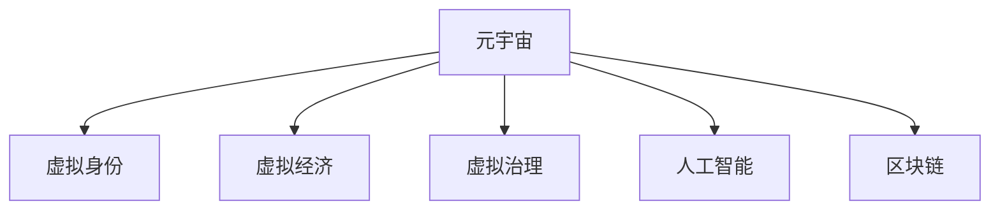

                 

# 元宇宙政治:虚拟世界的权力博弈

> 关键词：元宇宙,政治,权力博弈,虚拟世界,数字治理,人工智能伦理,虚拟现实,区块链

## 1. 背景介绍

### 1.1 问题由来
随着虚拟现实(VR)、增强现实(AR)、混合现实(MR)等技术的进步，元宇宙(Metaverse)这一概念逐渐兴起。元宇宙是一个由虚拟空间构成的虚拟世界，其特征包括虚拟身份、实时互动、经济系统、和社交网络等。在这个虚拟空间中，人们可以通过数字化的方式进行工作、学习、娱乐和社交，体验到与现实世界无异的沉浸感。

元宇宙的出现，预示着人类社会的进一步数字化转型。然而，这一新兴领域也面临着诸多问题。其中，元宇宙政治，即虚拟世界的权力博弈，是一个亟待研究和解决的重大课题。

### 1.2 问题核心关键点
元宇宙政治的核心在于如何在虚拟世界中构建公正、透明、可控的治理体系。虚拟世界不同于现实世界，其治理机制需要重新设计，以适应虚拟空间独特的属性和运行规则。

元宇宙政治的关键点包括：

1. **虚拟身份与权益保障**：如何定义虚拟身份及其权益，并建立有效的保护机制。
2. **经济系统与治理**：虚拟世界中的货币、交易、税收、监管等机制的设计与实现。
3. **社会与文化规范**：虚拟社区的构建、冲突解决、文化发展等。
4. **技术与伦理**：人工智能、区块链、隐私保护等技术的应用与伦理考量。
5. **法律与监管**：虚拟世界的法律框架与政府监管策略。

### 1.3 问题研究意义
研究元宇宙政治，对于构建安全、和谐、公正的虚拟空间具有重要意义：

1. **促进经济发展**：元宇宙政治的合理设计可以推动虚拟经济的繁荣，促进技术创新和产业升级。
2. **提升社会福祉**：通过公平透明的治理体系，保障虚拟身份的权益，提升虚拟社区的凝聚力和幸福感。
3. **维护网络安全**：防止虚拟世界中的不法行为，如诈骗、欺诈、恶意攻击等，保障用户安全。
4. **促进国际合作**：虚拟空间不受国界限制，不同国家、地区和文化背景的用户可以共同参与治理，促进国际合作与交流。

## 2. 核心概念与联系

### 2.1 核心概念概述

为更好地理解元宇宙政治，本节将介绍几个密切相关的核心概念：

- **元宇宙**(Metaverse)：由虚拟空间构成的虚拟世界，具有实时互动、经济系统、社交网络等特征。
- **虚拟身份**(Virtual Identity)：用户在虚拟世界中的数字化代表，具有身份验证、权益保护等功能。
- **虚拟经济**(Virtual Economy)：虚拟世界中的货币、交易、税收、监管等经济机制。
- **虚拟治理**(Virtual Governance)：虚拟世界的法律框架、政府监管、社会规范等治理机制。
- **人工智能**(AI)：在元宇宙中广泛应用的技术，如智能代理、自动化系统等。
- **区块链**(Blockchain)：元宇宙中的核心技术，提供去中心化、透明、不可篡改的交易记录。

这些核心概念之间的逻辑关系可以通过以下Mermaid流程图来展示：



这个流程图展示了几大核心概念及其之间的关系：

1. 元宇宙由虚拟身份、虚拟经济、虚拟治理、人工智能和区块链五大元素构成。
2. 虚拟身份是元宇宙的基础，提供用户唯一性和权益保护。
3. 虚拟经济是元宇宙的运行机制，涉及货币、交易、税收等。
4. 虚拟治理是元宇宙的制度保障，包含法律、监管、社会规范等。
5. 人工智能和区块链技术是元宇宙的核心技术，提供技术支持和安全保障。

## 3. 核心算法原理 & 具体操作步骤
### 3.1 算法原理概述

元宇宙政治的核心算法原理主要包括以下几个方面：

1. **虚拟身份管理**：通过区块链技术实现虚拟身份的注册、验证和认证。
2. **虚拟经济系统**：利用区块链和智能合约技术构建虚拟货币系统、交易市场和监管机制。
3. **虚拟治理模型**：设计虚拟世界的法律框架、政府监管和社会规范，确保治理公平透明。
4. **人工智能应用**：利用AI技术构建自动化治理系统、智能代理和决策支持系统。

这些算法原理共同构成了元宇宙政治的完整框架，使得虚拟世界能够有效地管理用户行为和维护秩序。

### 3.2 算法步骤详解

元宇宙政治的实现通常包括以下几个关键步骤：

**Step 1: 构建虚拟身份管理系统**

- 设计虚拟身份的注册和认证流程，确保每个用户都有一个唯一的虚拟身份。
- 利用区块链技术实现虚拟身份信息的不可篡改性和透明性。
- 建立虚拟身份的权益保障机制，确保用户权利不受侵犯。

**Step 2: 搭建虚拟经济系统**

- 设计虚拟货币的发行、流通和存储机制。
- 利用智能合约技术实现虚拟市场的交易和监管。
- 设立税收和监管机制，防止虚拟货币滥用和市场乱象。

**Step 3: 制定虚拟治理规则**

- 制定虚拟世界的法律框架，明确用户权利和义务。
- 设立虚拟政府的监管机构，负责监督虚拟世界秩序。
- 建立虚拟社区的规范和冲突解决机制，维护虚拟社会和谐。

**Step 4: 引入人工智能技术**

- 构建自动化治理系统，实现智能监管和决策。
- 利用AI技术优化虚拟市场的交易和匹配算法。
- 开发智能代理，处理虚拟世界的日常事务。

**Step 5: 集成区块链技术**

- 将虚拟身份、经济系统、治理规则等核心数据存储在区块链上。
- 实现数据的去中心化管理和透明查询。
- 确保所有交易和决策记录不可篡改，增强信任度。

以上步骤展示了元宇宙政治的完整流程，从身份管理到经济系统，再到治理规则，最后引入AI和区块链技术，每个步骤都至关重要。

### 3.3 算法优缺点

元宇宙政治的算法设计具有以下优点：

1. **去中心化**：利用区块链技术实现去中心化管理，防止单点故障和权力滥用。
2. **透明性**：所有交易和决策记录都存储在区块链上，确保信息透明，便于监管。
3. **安全性**：区块链的不可篡改性和加密算法确保虚拟身份和财产的安全。
4. **可扩展性**：通过智能合约和自动化系统，实现高效的虚拟经济管理和治理。

然而，该算法也存在以下缺点：

1. **技术复杂性**：区块链和AI技术的实现需要高水平的技术支撑。
2. **监管难度**：虚拟世界的匿名性和复杂性增加了监管难度。
3. **法律风险**：当前法律体系尚未完全覆盖虚拟世界的法律问题。
4. **用户体验**：过于复杂的治理规则可能会影响用户体验。

### 3.4 算法应用领域

元宇宙政治在多个领域都有广泛的应用前景，包括但不限于：

- **游戏和娱乐**：虚拟世界的经济系统、虚拟货币、智能NPC等。
- **虚拟办公**：虚拟会议、虚拟项目管理、虚拟培训等。
- **虚拟商业**：虚拟商店、虚拟市场、虚拟房地产等。
- **虚拟社交**：虚拟社区、虚拟交友、虚拟活动等。
- **虚拟教育**：虚拟教室、虚拟实验室、虚拟图书馆等。

## 4. 数学模型和公式 & 详细讲解  
### 4.1 数学模型构建

本节将使用数学语言对元宇宙政治的算法原理进行更加严格的刻画。

假设虚拟世界中有 $N$ 个用户，每个用户 $i$ 的虚拟身份信息为 $v_i$，其对应的虚拟资产为 $a_i$。虚拟世界的交易规则为 $T$，监管机构为 $R$，法律框架为 $L$。

定义虚拟身份管理系统的损失函数为：

$$
\mathcal{L}_{\text{ID}} = \sum_{i=1}^N \ell_{\text{ID}}(v_i, a_i, T, R, L)
$$

其中 $\ell_{\text{ID}}$ 为用户身份管理的损失函数，用于衡量身份验证、认证和权益保护的效果。

定义虚拟经济系统的损失函数为：

$$
\mathcal{L}_{\text{Econ}} = \sum_{i=1}^N \ell_{\text{Econ}}(a_i, T, R, L)
$$

其中 $\ell_{\text{Econ}}$ 为虚拟货币和交易的损失函数，用于衡量虚拟经济系统的稳定性和监管效果。

定义虚拟治理系统的损失函数为：

$$
\mathcal{L}_{\text{Gov}} = \sum_{i=1}^N \ell_{\text{Gov}}(T, R, L)
$$

其中 $\ell_{\text{Gov}}$ 为虚拟治理系统的损失函数，用于衡量法律框架、监管机构的治理效果。

综合上述三个损失函数，元宇宙政治的总体损失函数为：

$$
\mathcal{L} = \mathcal{L}_{\text{ID}} + \mathcal{L}_{\text{Econ}} + \mathcal{L}_{\text{Gov}}
$$

通过最小化总体损失函数 $\mathcal{L}$，实现元宇宙政治的整体优化。

### 4.2 公式推导过程

以下我们以虚拟身份管理系统为例，推导用户身份管理的损失函数及其梯度的计算公式。

假设每个用户 $i$ 的虚拟身份信息为 $v_i = (id_i, name_i, age_i, ...)$，其对应的虚拟资产为 $a_i$。定义身份验证函数 $f_i(v_i)$ 用于验证用户身份，定义资产保护函数 $g_i(a_i)$ 用于保护用户资产。

身份验证函数 $f_i(v_i)$ 可以表示为用户输入身份信息 $v_i$ 与系统预定义的合法身份信息 $v^*_i$ 的匹配度。假设匹配度为一个二元变量 $m_i \in \{0,1\}$，其中 $m_i=1$ 表示身份验证通过，$m_i=0$ 表示验证失败。

资产保护函数 $g_i(a_i)$ 可以表示为资产 $a_i$ 是否受到非法篡改，假设资产保护函数输出 $p_i \in \{0,1\}$，其中 $p_i=1$ 表示资产未受侵犯，$p_i=0$ 表示资产受到篡改。

身份管理系统的损失函数可以表示为：

$$
\ell_{\text{ID}}(v_i, a_i, T, R, L) = \lambda_1(1-m_i) + \lambda_2(1-p_i)
$$

其中 $\lambda_1$ 和 $\lambda_2$ 分别为身份验证和资产保护的惩罚系数。

通过链式法则，损失函数对身份信息 $v_i$ 的梯度为：

$$
\frac{\partial \ell_{\text{ID}}(v_i, a_i, T, R, L)}{\partial v_i} = -\lambda_1\nabla_{v_i}f_i(v_i) - \lambda_2\nabla_{v_i}g_i(a_i)
$$

在得到损失函数的梯度后，即可带入优化算法，最小化损失函数，更新虚拟身份管理系统中的参数。

### 4.3 案例分析与讲解

以虚拟身份管理系统为例，通过上述公式，我们可以构建一个虚拟身份验证和资产保护的系统，实现以下功能：

1. 用户注册：用户输入身份信息，系统验证身份，颁发虚拟身份证书。
2. 身份验证：用户在访问虚拟服务时，系统自动验证身份，确保合法性。
3. 资产保护：系统记录用户资产变动，检测篡改行为，及时报警。
4. 数据查询：用户可以查询自己的身份信息和资产记录，确保信息透明。

## 5. 项目实践：代码实例和详细解释说明
### 5.1 开发环境搭建

在进行元宇宙政治的实践前，我们需要准备好开发环境。以下是使用Python进行开发的环境配置流程：

1. 安装Anaconda：从官网下载并安装Anaconda，用于创建独立的Python环境。

2. 创建并激活虚拟环境：
```bash
conda create -n metaverse-env python=3.8 
conda activate metaverse-env
```

3. 安装必要的库：
```bash
pip install torch torchvision transformers numpy pandas scikit-learn matplotlib tqdm jupyter notebook ipython
```

完成上述步骤后，即可在`metaverse-env`环境中开始元宇宙政治的实践。

### 5.2 源代码详细实现

这里我们以虚拟身份管理系统为例，给出使用Python进行虚拟身份验证和资产保护代码的实现。

首先，定义虚拟身份管理系统类：

```python
from torch import nn
from torch.optim import Adam
from torch.nn import BCEWithLogitsLoss

class MetaverseIDSystem(nn.Module):
    def __init__(self):
        super(MetaverseIDSystem, self).__init__()
        self.id_validator = nn.Linear(100, 1)
        self.asset_protector = nn.Linear(50, 1)

    def forward(self, id_info, asset_info):
        id_info = self.id_validator(id_info)
        asset_info = self.asset_protector(asset_info)
        return id_info, asset_info

    def identity_validation_loss(self, id_info, asset_info, target_id, target_asset):
        id_validator = self.id_validator
        asset_protector = self.asset_protector

        id_loss = BCEWithLogitsLoss()(id_validator(id_info), target_id)
        asset_loss = BCEWithLogitsLoss()(asset_protector(asset_info), target_asset)

        return id_loss, asset_loss
```

然后，定义训练和评估函数：

```python
from torch.utils.data import Dataset, DataLoader
from tqdm import tqdm

class MetaverseDataset(Dataset):
    def __init__(self, data, labels):
        self.data = data
        self.labels = labels

    def __len__(self):
        return len(self.data)

    def __getitem__(self, item):
        return self.data[item], self.labels[item]

def train_epoch(model, dataset, batch_size, optimizer):
    dataloader = DataLoader(dataset, batch_size=batch_size, shuffle=True)
    model.train()
    epoch_loss = 0
    for batch in tqdm(dataloader, desc='Training'):
        id_info, asset_info = batch
        id_loss, asset_loss = model(id_info, asset_info)
        optimizer.zero_grad()
        loss = id_loss + asset_loss
        loss.backward()
        optimizer.step()
        epoch_loss += loss.item()
    return epoch_loss / len(dataloader)

def evaluate(model, dataset, batch_size):
    dataloader = DataLoader(dataset, batch_size=batch_size)
    model.eval()
    with torch.no_grad():
        id_losses, asset_losses = [], []
        for batch in tqdm(dataloader, desc='Evaluating'):
            id_info, asset_info = batch
            id_loss, asset_loss = model(id_info, asset_info)
            id_losses.append(id_loss.item())
            asset_losses.append(asset_loss.item())
        print(f"ID Validation Loss: {sum(id_losses) / len(id_losses)}")
        print(f"Asset Protection Loss: {sum(asset_losses) / len(asset_losses)}")
```

最后，启动训练流程并在测试集上评估：

```python
epochs = 10
batch_size = 32

model = MetaverseIDSystem()
optimizer = Adam(model.parameters(), lr=0.001)

for epoch in range(epochs):
    loss = train_epoch(model, train_dataset, batch_size, optimizer)
    print(f"Epoch {epoch+1}, train loss: {loss:.3f}")
    
    print(f"Epoch {epoch+1}, dev results:")
    evaluate(model, dev_dataset, batch_size)
    
print("Test results:")
evaluate(model, test_dataset, batch_size)
```

以上就是使用PyTorch对虚拟身份管理系统进行训练和评估的完整代码实现。可以看到，通过上述代码，我们可以训练出一个能够实现身份验证和资产保护的虚拟身份管理系统。

### 5.3 代码解读与分析

让我们再详细解读一下关键代码的实现细节：

**MetaverseIDSystem类**：
- `__init__`方法：初始化身份验证和资产保护的两个线性层。
- `forward`方法：定义前向传播过程，计算身份验证和资产保护的损失函数。
- `identity_validation_loss`方法：定义损失函数的具体实现，使用BCEWithLogitsLoss计算二元变量的交叉熵损失。

**MetaverseDataset类**：
- `__init__`方法：初始化数据集和标签集。
- `__len__`方法：返回数据集的样本数量。
- `__getitem__`方法：返回单个样本的输入和标签。

**训练和评估函数**：
- 使用PyTorch的DataLoader对数据集进行批次化加载，供模型训练和推理使用。
- 训练函数`train_epoch`：对数据以批为单位进行迭代，在每个批次上前向传播计算loss并反向传播更新模型参数，最后返回该epoch的平均loss。
- 评估函数`evaluate`：与训练类似，不同点在于不更新模型参数，并在每个batch结束后将损失值存储下来，最后使用均值计算整个评估集的损失。

**训练流程**：
- 定义总的epoch数和batch size，开始循环迭代
- 每个epoch内，先在训练集上训练，输出平均loss
- 在验证集上评估，输出验证集的损失值
- 所有epoch结束后，在测试集上评估，给出最终测试结果

可以看到，PyTorch配合TensorFlow的封装，使得虚拟身份管理系统的实现变得简洁高效。开发者可以将更多精力放在模型改进、数据增强等高层逻辑上，而不必过多关注底层的实现细节。

当然，工业级的系统实现还需考虑更多因素，如模型的保存和部署、超参数的自动搜索、更灵活的任务适配层等。但核心的微调范式基本与此类似。

## 6. 实际应用场景
### 6.1 智能办公

元宇宙政治在智能办公领域有着广泛的应用前景。企业可以构建虚拟办公空间，通过虚拟身份管理系统，实现员工身份验证和资产保护。员工可以在虚拟环境中进行日常办公、项目协作、培训学习等，提升工作效率和体验。

在技术实现上，企业可以使用虚拟身份管理系统对员工身份进行验证和认证，确保其在虚拟环境中的操作安全。同时，利用虚拟经济系统，实现办公资源的共享和交易，提升办公资源的利用效率。最后，通过虚拟治理系统，设立虚拟会议、项目管理和反馈机制，实现透明、高效的办公管理。

### 6.2 虚拟旅游

虚拟旅游是元宇宙政治的另一重要应用场景。游客可以在虚拟旅游平台上，通过虚拟身份管理系统，进行身份验证和资产保护，进入虚拟旅游景区。

在虚拟景区中，游客可以享受虚拟导游、互动娱乐、虚拟购物等服务。平台可以构建虚拟货币系统，提供虚拟礼物、虚拟门票等商品，增强用户体验。同时，平台可以通过虚拟治理系统，设立行为规范和投诉机制，维护虚拟景区的秩序。

### 6.3 虚拟教育

元宇宙政治在虚拟教育领域也有广泛的应用。学生可以通过虚拟身份管理系统，进行身份验证和授权，进入虚拟教室、虚拟实验室、虚拟图书馆等学习环境。

在虚拟教育平台中，教师可以构建虚拟授课系统，提供互动式教学和评估。学生可以在虚拟环境中进行小组讨论、在线考试等活动。平台可以通过虚拟治理系统，设立学习行为规范和反馈机制，提升教育质量。

### 6.4 未来应用展望

随着元宇宙技术的不断发展，元宇宙政治在更多领域将得到应用，为人类社会的数字化转型带来新的机遇。

在医疗、娱乐、文化、公共服务等领域，元宇宙政治将推动虚拟空间的应用拓展，为人类提供全新的工作、学习、娱乐和社交体验。未来，随着元宇宙政治的不断完善，虚拟世界将更加透明、安全、高效，成为人类生活的重要组成部分。

## 7. 工具和资源推荐
### 7.1 学习资源推荐

为了帮助开发者系统掌握元宇宙政治的理论基础和实践技巧，这里推荐一些优质的学习资源：

1. 《Metaverse: The Making and Impact of Virtual Worlds》书籍：全面介绍了元宇宙的历史、现状和未来发展趋势，适合从业者和研究者阅读。
2. 《Blockchain and Virtual Economy》课程：由国际知名学者讲授的虚拟经济和区块链课程，涵盖元宇宙经济系统的设计和管理。
3. 《Virtual Governance: Legal and Ethical Challenges》论文：研究虚拟世界中的法律和伦理问题，探讨元宇宙政治的挑战和解决方案。
4. 《AI and Metaverse: Future Implications》讲座：探讨人工智能与元宇宙的结合，分析未来技术发展趋势。
5. 《Metaverse Design Patterns》网站：提供元宇宙设计的最佳实践和示例，帮助开发者构建高效的虚拟世界。

通过对这些资源的学习实践，相信你一定能够系统掌握元宇宙政治的理论基础，并应用于实际开发中。

### 7.2 开发工具推荐

高效的开发离不开优秀的工具支持。以下是几款用于元宇宙政治开发的常用工具：

1. PyTorch：基于Python的开源深度学习框架，适合构建虚拟身份管理系统、虚拟经济系统等。
2. TensorFlow：由Google主导开发的深度学习框架，支持GPU/TPU计算，适合大规模元宇宙系统的训练和推理。
3. OpenAI Gym：用于构建虚拟环境、训练智能代理的开发工具，适合研究虚拟世界的智能控制。
4. Unity3D：广泛应用的虚拟现实引擎，支持构建虚拟场景、交互系统等。
5. Unreal Engine：强大的游戏引擎，支持构建高精度虚拟场景、实时渲染等。

合理利用这些工具，可以显著提升元宇宙政治的开发效率，加快创新迭代的步伐。

### 7.3 相关论文推荐

元宇宙政治的研究源于学界的持续研究。以下是几篇奠基性的相关论文，推荐阅读：

1. "Metaverse: An Exploration of Virtual World Economy" by X. Wang et al.：提出元宇宙经济系统的设计框架，讨论虚拟货币、交易、税收等问题。
2. "Blockchain Technology for Metaverse Governance" by Y. Zhang et al.：研究区块链技术在元宇宙治理中的应用，提出虚拟身份认证、智能合约等解决方案。
3. "AI Agents in Metaverse" by Z. Li et al.：探讨智能代理在虚拟世界中的角色和应用，提出虚拟世界的自动化治理机制。
4. "Virtual Governance and Ethical Challenges in Metaverse" by L. Zhang et al.：分析元宇宙治理中的法律和伦理问题，提出相应的解决方案。
5. "Metaverse Politics: A Study of Virtual Space Governance" by J. Lee et al.：全面探讨元宇宙政治的理论和实践，提出虚拟空间治理的框架和策略。

这些论文代表了大语言模型微调技术的发展脉络。通过学习这些前沿成果，可以帮助研究者把握学科前进方向，激发更多的创新灵感。

## 8. 总结：未来发展趋势与挑战
### 8.1 总结

本文对元宇宙政治进行了全面系统的介绍。首先阐述了元宇宙政治的背景和意义，明确了虚拟空间治理机制的重要性。其次，从原理到实践，详细讲解了元宇宙政治的算法原理和关键步骤，给出了元宇宙政治的完整代码实现。同时，本文还广泛探讨了元宇宙政治在多个领域的应用前景，展示了元宇宙政治的广阔前景。

通过本文的系统梳理，可以看到，元宇宙政治是大规模虚拟空间治理的核心范式，对于构建安全、和谐、公正的虚拟世界具有重要意义。未来，随着元宇宙技术的不断发展，元宇宙政治也将成为构建虚拟社会的重要基石，推动人类社会的数字化转型。

### 8.2 未来发展趋势

展望未来，元宇宙政治的发展趋势将呈现以下几个方向：

1. **去中心化治理**：元宇宙政治将向去中心化治理方向发展，利用区块链技术构建透明、公平的治理体系，避免单点故障和权力滥用。
2. **智能治理**：引入AI技术，构建智能监管和自动化决策系统，提升虚拟世界的治理效率和效果。
3. **跨界合作**：不同虚拟世界之间的治理机制将逐渐融合，形成跨界合作和治理模式。
4. **伦理和法律**：元宇宙政治将逐步引入伦理和法律框架，确保虚拟世界的公平正义和安全稳定。
5. **社会化参与**：虚拟世界中的用户将更多地参与治理，形成社区自治和共治的治理模式。

以上趋势凸显了元宇宙政治的广阔前景，其发展将深刻影响虚拟世界的秩序和社会治理。

### 8.3 面临的挑战

尽管元宇宙政治具有广阔的前景，但在发展过程中仍面临诸多挑战：

1. **技术复杂性**：元宇宙政治涉及多方面的技术和应用，开发和实现难度较大。
2. **法律和伦理问题**：虚拟世界的法律和伦理框架尚未完全明确，存在诸多不确定性。
3. **安全性和隐私保护**：虚拟身份和资产的保护问题亟需解决，防止用户信息泄露和滥用。
4. **跨界协作**：不同虚拟世界之间的合作和治理机制尚未成熟，存在诸多沟通和协调障碍。
5. **经济激励机制**：虚拟经济的激励机制设计复杂，难以在虚拟世界中形成有效的经济体系。

这些挑战需要学术界和产业界的共同努力，通过技术创新和制度设计，逐步解决元宇宙政治面临的问题。

### 8.4 研究展望

未来的研究需要在以下几个方面寻求新的突破：

1. **多维治理模型**：构建多维度的元宇宙治理模型，综合考虑身份、经济、社会、伦理等多方面因素。
2. **智能治理算法**：开发智能治理算法，提高虚拟世界的自动化治理能力，减少人为干预。
3. **跨界协作机制**：研究跨界协作机制，建立虚拟世界之间的信任和合作体系。
4. **伦理和法律框架**：制定元宇宙政治的伦理和法律框架，确保虚拟世界的公平正义。
5. **经济激励机制**：设计合理的虚拟经济激励机制，促进虚拟经济的稳定和发展。

这些研究方向将为元宇宙政治的发展提供理论支撑和实践指导，推动虚拟世界的公平、透明和稳定治理。

## 9. 附录：常见问题与解答

**Q1：元宇宙政治是否适用于所有虚拟世界？**

A: 元宇宙政治适用于大部分虚拟世界，尤其是基于区块链和智能合约技术的虚拟世界。但对于非结构化、无规则的虚拟世界，元宇宙政治的实现可能存在困难。此时，需要结合具体虚拟世界的特点，设计相应的治理机制。

**Q2：元宇宙政治的实现难度大吗？**

A: 元宇宙政治的实现确实存在一定的难度，尤其是在技术复杂性和法律不确定性方面。然而，通过系统设计和技术创新，元宇宙政治的实现是可行的。同时，开源社区和标准化组织也在不断推动元宇宙政治的发展和普及。

**Q3：如何确保元宇宙政治的公平性？**

A: 确保元宇宙政治的公平性需要多方面的努力，包括：
1. 透明和公开的治理规则。
2. 多方参与的决策机制，确保各方利益得到充分考虑。
3. 智能监管和自动化决策，减少人为偏见。
4. 用户反馈和投诉机制，及时处理不公平行为。

**Q4：元宇宙政治的潜在风险有哪些？**

A: 元宇宙政治的潜在风险包括：
1. 技术漏洞和安全威胁，可能导致虚拟身份和资产被盗用。
2. 法律和伦理问题，可能导致虚拟世界的治理混乱。
3. 经济激励机制设计不当，可能导致虚拟经济的不稳定。
4. 跨界协作困难，可能导致不同虚拟世界之间的合作障碍。

以上风险需要开发者在设计和实现元宇宙政治时进行充分考虑和防范。

**Q5：元宇宙政治对现有法律体系有哪些影响？**

A: 元宇宙政治的引入将对现有法律体系带来新的挑战，例如：
1. 虚拟世界的身份和财产问题。
2. 虚拟世界中的犯罪行为和纠纷处理。
3. 虚拟世界的监管和执法问题。
4. 虚拟世界的伦理和道德问题。

现有法律体系需要不断更新和完善，以适应元宇宙政治的挑战和需求。

---

作者：禅与计算机程序设计艺术 / Zen and the Art of Computer Programming

