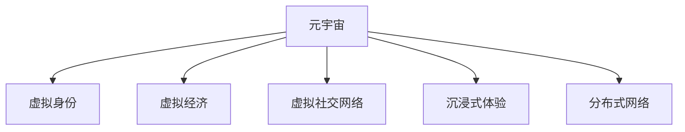

                 

# 元宇宙：人类集体意识的数字化映射

## 1. 背景介绍

### 1.1 问题由来
随着虚拟现实(VR)、增强现实(AR)、混合现实(MR)技术的飞速发展，以及区块链、物联网等新一代信息技术的不断突破，人类社会正步入一个全新的发展阶段——元宇宙。元宇宙是一种基于数字技术构建的虚拟世界，它融合了物理世界与虚拟世界的边界，为人类提供了一个全新的生存与发展空间。

元宇宙的概念最早由科幻作家尼尔斯·蒂芙林(Niles Teiffler)在1992年提出，其核心思想是通过数字化技术，实现人类意识和行为的虚拟化映射。经过几十年的探索和发展，当前元宇宙已经在多个领域取得了显著进展，包括虚拟社交、远程协作、虚拟资产交易、沉浸式娱乐等。

### 1.2 问题核心关键点
元宇宙的核心目标是通过数字化技术，将人类意识和行为全面映射到虚拟世界中，从而在虚拟与现实之间建立更加紧密的联系。这一过程中，涉及以下几个关键问题：

- 如何通过数字技术实现人类意识的映射？
- 如何构建一个可以自我演化的虚拟生态系统？
- 如何确保元宇宙的安全性、隐私保护和公平性？
- 如何保障用户的体验和参与度？

这些问题不仅涉及技术实现，还触及了哲学、社会学、经济学等多个领域的边界，是元宇宙研究的核心。

## 2. 核心概念与联系

### 2.1 核心概念概述

为更好地理解元宇宙的概念，本节将介绍几个关键概念：

- **元宇宙(Metaverse)**：一种基于数字技术构建的虚拟世界，用户可以在其中进行各种活动，如社交、工作、娱乐等，是当前信息技术的终极目标。

- **虚拟身份(Virtual Identity)**：用户在元宇宙中的数字身份，通常由头像、个性、权限等组成，是元宇宙中最重要的交互单元。

- **虚拟经济(Virtual Economy)**：元宇宙内的经济系统，包括虚拟货币、资产交易、市场监管等，是元宇宙价值生态的重要组成部分。

- **虚拟社交网络(Virtual Social Network)**：元宇宙内的社交平台，支持用户之间的连接、互动和协作，是元宇宙的核心功能。

- **沉浸式体验(Immersive Experience)**：通过虚拟现实、增强现实等技术，创造一个与现实世界高度相似的虚拟体验，是元宇宙的核心目标。

- **分布式网络(Distributed Network)**：元宇宙内的网络架构，支持大量的用户和设备同时在线，是元宇宙技术的基础。

这些核心概念之间存在紧密的联系，共同构成了元宇宙的基本框架。通过这些概念的相互配合，元宇宙可以为用户提供一种全新的交互方式和生活体验。

### 2.2 核心概念原理和架构的 Mermaid 流程图



这个流程图展示了元宇宙的核心概念及其联系：

1. **元宇宙**：作为整体，包含了虚拟身份、虚拟经济、虚拟社交网络、沉浸式体验和分布式网络等子系统。
2. **虚拟身份**：是元宇宙中的基本单位，通过虚拟身份，用户可以在元宇宙中进行各种活动。
3. **虚拟经济**：提供了元宇宙内的价值交换机制，支持虚拟货币和资产交易。
4. **虚拟社交网络**：实现了元宇宙内的社交功能，支持用户之间的连接和互动。
5. **沉浸式体验**：通过虚拟现实、增强现实等技术，创造出与现实世界高度相似的虚拟体验。
6. **分布式网络**：提供了元宇宙内的通信和数据传输机制，支持大规模用户在线。

这些核心概念共同构成了元宇宙的技术框架，为元宇宙的实现提供了坚实的基础。

## 3. 核心算法原理 & 具体操作步骤
### 3.1 算法原理概述

元宇宙的构建是一个复杂的过程，涉及多个子系统。本文重点介绍元宇宙的核心算法原理和具体操作步骤。

### 3.2 算法步骤详解

**Step 1: 设计虚拟身份系统**
- 设计虚拟身份的基本框架，包括头像、性格、权限等属性。
- 实现身份认证和授权机制，确保虚拟身份的安全性和隐私保护。
- 提供虚拟身份编辑工具，支持用户自定义和个性化设置。

**Step 2: 建立虚拟经济系统**
- 设计虚拟货币和资产的基本单位，如虚拟货币单位、NFT等。
- 实现虚拟交易市场，支持虚拟货币和资产的买卖。
- 设计市场监管机制，保障虚拟经济的健康发展和公平性。

**Step 3: 构建虚拟社交网络**
- 设计虚拟社交平台的基本框架，包括好友关系、社交群组、即时通讯等。
- 实现用户间的连接和互动，支持文本、语音、视频等多种交流方式。
- 提供社交功能插件，如游戏、教育、办公等，丰富用户社交体验。

**Step 4: 实现沉浸式体验**
- 利用虚拟现实、增强现实等技术，创造高度逼真的虚拟环境。
- 设计沉浸式应用场景，如虚拟教室、虚拟会议、虚拟游戏等。
- 提供互动式体验工具，如虚拟键盘、鼠标、手势识别等，增强用户沉浸感。

**Step 5: 构建分布式网络**
- 设计分布式网络架构，支持大规模用户在线。
- 实现数据传输和存储优化，保障网络的高效性和可靠性。
- 提供云服务支持，支持用户随时随地访问元宇宙。

### 3.3 算法优缺点

元宇宙构建的算法具有以下优点：

- 实现复杂，但功能全面。元宇宙包含多个子系统，可以提供丰富的功能和体验。
- 技术前沿，但成本较高。需要利用虚拟现实、增强现实、区块链等前沿技术，实现难度大，成本高。
- 用户体验良好，但需要不断迭代优化。用户需求多样，元宇宙需要持续升级和完善。

同时，元宇宙构建的算法也存在一些缺点：

- 数据隐私和安全问题。用户数据和虚拟资产在元宇宙中的安全保障，需要高度注重。
- 系统复杂性高。元宇宙的构建涉及多个子系统，系统集成难度大。
- 内容质量不一。元宇宙内的内容质量参差不齐，需要持续维护和更新。

尽管存在这些缺点，但元宇宙作为未来互联网的发展方向，其潜力和价值不可忽视。未来研究的方向在于如何更好地平衡技术复杂性和用户体验，以及如何提升元宇宙的安全性和隐私保护。

### 3.4 算法应用领域

元宇宙技术已经在多个领域得到了应用，包括：

- **虚拟社交**：如VR社交平台，用户可以进行虚拟社交、在线会议等。
- **虚拟游戏**：如虚拟现实游戏，支持用户在虚拟世界中互动和竞争。
- **远程协作**：如虚拟办公室，支持用户远程办公和协作。
- **虚拟房地产**：如虚拟房产交易，支持用户在虚拟世界中购买、租赁和出售房产。
- **虚拟娱乐**：如虚拟演唱会、虚拟旅游等，提供沉浸式娱乐体验。

除了上述这些典型应用外，元宇宙还被创新性地应用到更多场景中，如虚拟教育、虚拟医疗、虚拟展览等，为各行各业带来了新的发展机遇。

## 4. 数学模型和公式 & 详细讲解 & 举例说明

### 4.1 数学模型构建

本节将使用数学语言对元宇宙的构建过程进行更加严格的刻画。

设元宇宙中的虚拟身份为 $I$，虚拟货币为 $M$，虚拟社交网络为 $S$，沉浸式体验为 $E$，分布式网络为 $N$。元宇宙的价值生态系统可以用数学模型来表示：

$$
V = I + M + S + E + N
$$

其中 $V$ 表示元宇宙的总价值。

### 4.2 公式推导过程

假设用户 $U$ 在元宇宙中拥有虚拟身份 $I_U$，持有虚拟货币 $M_U$，活跃于虚拟社交网络 $S_U$，体验沉浸式应用 $E_U$，使用分布式网络 $N_U$。则元宇宙总价值 $V$ 可以表示为：

$$
V = V_{I_U} + V_{M_U} + V_{S_U} + V_{E_U} + V_{N_U}
$$

其中 $V_{I_U}$ 表示用户 $U$ 在虚拟身份系统中的价值，$V_{M_U}$ 表示用户 $U$ 在虚拟经济系统中的价值，$V_{S_U}$ 表示用户 $U$ 在虚拟社交网络中的价值，$V_{E_U}$ 表示用户 $U$ 在沉浸式体验中的价值，$V_{N_U}$ 表示用户 $U$ 在分布式网络中的价值。

### 4.3 案例分析与讲解

以虚拟游戏为例，分析元宇宙价值生态系统中的各个组成部分。

**虚拟身份系统**：玩家在游戏中创建角色，通过角色与其他玩家互动。系统对角色进行属性设定，如职业、技能、装备等。玩家在游戏中的价值取决于角色属性和游戏任务。

**虚拟经济系统**：游戏内存在虚拟货币，玩家可以通过完成任务、交易物品等方式获得虚拟货币。系统对虚拟货币的发行、流通和存储进行管理，确保经济稳定。

**虚拟社交网络**：玩家可以在游戏中加入不同的社交群组，如工会、公会、家族等，与其他玩家进行交流和协作。系统对社交群组进行管理，确保秩序和安全。

**沉浸式体验**：游戏提供高度逼真的虚拟场景和互动体验，如虚拟现实、增强现实等技术的应用，使得玩家有身临其境的感觉。系统对游戏场景进行优化，提升玩家体验。

**分布式网络**：游戏服务器采用分布式架构，支持大规模玩家同时在线。系统对数据传输和存储进行优化，保障网络的高效性和可靠性。

通过分析这些案例，可以看到元宇宙的价值生态系统是一个复杂的体系，各部分相互依存，共同构建了元宇宙的完整功能。

## 5. 项目实践：代码实例和详细解释说明
### 5.1 开发环境搭建

在进行元宇宙项目开发前，我们需要准备好开发环境。以下是使用Python进行Web3.js开发的环境配置流程：

1. 安装Node.js：从官网下载并安装Node.js，安装后配置环境变量。

2. 安装Truffle：在命令行中执行 `npm install -g truffle` 安装Truffle，Truffle是一个开发以太坊智能合约的框架。

3. 安装Web3.js：在项目中执行 `npm install web3` 安装Web3.js，Web3.js是一个用于与以太坊进行交互的JavaScript库。

4. 安装Ganache：在命令行中执行 `npm install ganache-cli` 安装Ganache，Ganache是一个本地以太坊测试网络。

完成上述步骤后，即可在本地搭建元宇宙项目的开发环境。

### 5.2 源代码详细实现

这里我们以一个简单的元宇宙游戏为例，使用Web3.js实现游戏内货币的发行和流通。

首先，创建一个以太坊智能合约，定义货币的发行和交易规则：

```javascript
// solidity游戏货币智能合约
contract GameToken {
    uint256 public totalSupply;
    mapping(address => uint256) balances;

    event Transfer(address indexed from, address indexed to, uint256 value);

    constructor() public {
        totalSupply = 1000000; // 总供给
        balances[msg.sender] = totalSupply; // 初始化余额
    }

    function createToken(uint256 amount) public {
        balances[msg.sender] += amount;
        emit Transfer(0, msg.sender, amount);
    }

    function transfer(address receiver, uint256 amount) public {
        require(balances[msg.sender] >= amount);
        balances[msg.sender] -= amount;
        balances[receiver] += amount;
        emit Transfer(msg.sender, receiver, amount);
    }
}
```

然后，使用Web3.js在JavaScript中实现对智能合约的调用：

```javascript
// JavaScript游戏货币操作
const contractAddress = '0x1234567890abcdef';
const web3 = new Web3(new Web3.providers.HttpProvider('http://localhost:8545'));

async function createToken(web3, contractAddress, amount) {
    const contract = new web3.eth.Contract(GameToken.abi, contractAddress);
    await contract.methods.createToken(amount).send({ from: '0x9876543210fedcba', gas: 1000000 });
}

async function transfer(web3, contractAddress, from, to, amount) {
    const contract = new web3.eth.Contract(GameToken.abi, contractAddress);
    await contract.methods.transfer(to, amount).send({ from: from, gas: 1000000 });
}

// 示例使用
createToken(web3, contractAddress, 100);
transfer(web3, contractAddress, '0x9876543210fedcba', '0x987654321abcd', 50);
```

最后，运行Ganache启动本地以太坊测试网络，测试智能合约的发行和交易功能：

```bash
ganache-cli start --network_id 3 --port 8545
```

通过这个简单的示例，可以看到使用Web3.js和Truffle框架，可以快速实现以太坊智能合约的开发和测试。

### 5.3 代码解读与分析

**Web3.js**：Web3.js是用于与以太坊进行交互的JavaScript库，提供了丰富的以太坊操作接口，如账户管理、合约调用、交易处理等。

**Truffle**：Truffle是一个开发以太坊智能合约的框架，提供了自动化测试、部署和发布等工具，简化了合约开发流程。

**Ganache**：Ganache是一个本地以太坊测试网络，提供了快速搭建测试网络的环境，支持智能合约的本地测试和调试。

**Solidity**：Solidity是用于编写以太坊智能合约的编程语言，支持函数、事件、映射等高级特性。

这些工具和技术在元宇宙项目中得到了广泛应用，是实现元宇宙功能的关键。

## 6. 实际应用场景
### 6.1 虚拟社交

元宇宙的虚拟社交平台可以为人们提供全新的社交体验。用户可以创建虚拟身份，在虚拟世界中与他人互动，参与各种社交活动。

**虚拟会议**：支持用户进行虚拟会议，可以通过虚拟现实技术实现多人同时在线，增强互动体验。

**虚拟社交群组**：用户可以加入不同的虚拟社交群组，如虚拟学校、虚拟俱乐部、虚拟办公室等，与其他用户进行交流和协作。

**虚拟社区**：用户可以创建和管理虚拟社区，组织各种活动，如虚拟音乐会、虚拟展览、虚拟赛事等。

**虚拟礼物**：用户可以在虚拟世界中进行虚拟礼物交换，增强互动和社交体验。

### 6.2 虚拟游戏

元宇宙的虚拟游戏为玩家提供了一个高度逼真的虚拟世界，支持玩家进行各种互动和竞争。

**多人在线**：支持大规模玩家同时在线，提供高度逼真的虚拟场景和互动体验。

**虚拟任务**：设计各种虚拟任务和挑战，增强游戏的趣味性和挑战性。

**虚拟经济**：支持虚拟货币和资产的交易，增加游戏的经济性。

**虚拟角色**：提供丰富的虚拟角色和装备，增强游戏的个性和多样性。

**虚拟交互**：支持玩家之间的互动和协作，增强游戏的社交性。

### 6.3 虚拟教育

元宇宙的虚拟教育为学生提供了全新的学习方式，支持沉浸式学习和互动式教学。

**虚拟教室**：支持学生和教师在虚拟教室中进行互动和交流，提供高度逼真的学习环境。

**虚拟实验**：支持学生进行虚拟实验，增强实验的可操作性和安全性。

**虚拟课件**：提供丰富的虚拟课件和教学资源，增强教学的多样性和趣味性。

**虚拟考试**：支持学生进行虚拟考试，增强考试的公平性和安全性。

### 6.4 未来应用展望

随着元宇宙技术的不断发展，未来元宇宙将在更多领域得到应用，为社会带来深远影响。

**虚拟医疗**：元宇宙的虚拟医疗平台可以为患者提供虚拟诊疗、虚拟手术等医疗服务，增强医疗的可及性和效率。

**虚拟城市**：元宇宙的虚拟城市可以为城市管理提供全新的解决方案，支持城市的数字化和智能化。

**虚拟旅游**：元宇宙的虚拟旅游平台可以为游客提供全新的旅游体验，支持全球范围内的虚拟旅游。

**虚拟会议**：元宇宙的虚拟会议平台可以为各类会议提供全新的解决方案，支持大规模、高效率的会议组织和参与。

**虚拟展览**：元宇宙的虚拟展览平台可以为博物馆、艺术馆等提供全新的展示方式，支持全球范围内的虚拟展览。

总之，元宇宙作为未来互联网的发展方向，其应用前景广阔，将为各行各业带来新的发展机遇。

## 7. 工具和资源推荐
### 7.1 学习资源推荐

为了帮助开发者系统掌握元宇宙的相关知识，这里推荐一些优质的学习资源：

1. **《Web3.0：万维网3.0的崛起》**：详细介绍了Web3.0技术的基本概念和应用场景，适合入门学习。

2. **《以太坊智能合约开发实战》**：通过实际项目案例，介绍了以太坊智能合约的开发和测试流程，适合进阶学习。

3. **《Blockchain Revolution》**：讲解了区块链技术的起源和发展，以及其在金融、物流、医疗等多个领域的应用，适合深入理解区块链技术。

4. **《Metaverse：人类社会的数字化未来》**：介绍了元宇宙的基本概念和未来发展方向，适合理解元宇宙的核心思想。

5. **《元宇宙：虚拟世界的崛起》**：通过实际项目案例，介绍了元宇宙的技术实现和应用场景，适合动手实践。

通过对这些资源的学习实践，相信你一定能够快速掌握元宇宙的核心技术和应用方向，并用于解决实际的开发问题。

### 7.2 开发工具推荐

元宇宙开发离不开工具的支持，以下是几款常用的开发工具：

1. **Web3.js**：用于与以太坊进行交互的JavaScript库，提供了丰富的以太坊操作接口。

2. **Truffle**：开发以太坊智能合约的框架，提供了自动化测试、部署和发布等工具。

3. **Ganache**：本地以太坊测试网络，支持智能合约的本地测试和调试。

4. **Unity**：虚拟现实和增强现实开发引擎，支持创建高度逼真的虚拟环境。

5. **Unreal Engine**：游戏开发引擎，支持创建复杂的虚拟场景和互动体验。

6. **Web3 Studio**：Web3.js开发工具，提供了代码编辑、调试和测试等功能，支持快速开发元宇宙应用。

合理利用这些工具，可以显著提升元宇宙应用的开发效率，加快创新迭代的步伐。

### 7.3 相关论文推荐

元宇宙研究涉及多个学科，以下是几篇奠基性的相关论文，推荐阅读：

1. **《Web3.0：万维网3.0的崛起》**：详细介绍了Web3.0技术的基本概念和应用场景，适合入门学习。

2. **《以太坊智能合约开发实战》**：通过实际项目案例，介绍了以太坊智能合约的开发和测试流程，适合进阶学习。

3. **《Blockchain Revolution》**：讲解了区块链技术的起源和发展，以及其在金融、物流、医疗等多个领域的应用，适合深入理解区块链技术。

4. **《Metaverse：人类社会的数字化未来》**：介绍了元宇宙的基本概念和未来发展方向，适合理解元宇宙的核心思想。

5. **《元宇宙：虚拟世界的崛起》**：通过实际项目案例，介绍了元宇宙的技术实现和应用场景，适合动手实践。

这些论文代表了大数据和人工智能领域的前沿研究，通过学习这些前沿成果，可以帮助研究者把握学科前进方向，激发更多的创新灵感。

## 8. 总结：未来发展趋势与挑战
### 8.1 总结

本文对元宇宙的构建原理和操作步骤进行了全面系统的介绍。首先阐述了元宇宙的核心概念和构建方法，明确了元宇宙在虚拟社交、虚拟游戏、虚拟教育等多个领域的应用前景。其次，从原理到实践，详细讲解了元宇宙的数学模型和核心算法，给出了元宇宙项目开发的完整代码实例。同时，本文还广泛探讨了元宇宙在未来各个领域的应用前景，展示了元宇宙技术的广阔前景。

通过本文的系统梳理，可以看到，元宇宙作为未来互联网的发展方向，其应用前景广阔，将为各行各业带来新的发展机遇。未来，伴随元宇宙技术的不断演进，元宇宙必将在虚拟社交、虚拟游戏、虚拟教育等多个领域大放异彩，深刻影响人类的生产生活方式。

### 8.2 未来发展趋势

展望未来，元宇宙技术将呈现以下几个发展趋势：

1. **技术普及化**：元宇宙技术将从学术界逐步走向产业化，成为未来互联网发展的重要方向。

2. **应用多样化**：元宇宙的应用领域将不断拓展，涵盖虚拟社交、虚拟游戏、虚拟教育、虚拟医疗等多个领域。

3. **经济智能化**：元宇宙内的虚拟经济将不断完善，形成更加智能化的价值生态系统。

4. **交互自然化**：元宇宙内的交互方式将更加自然和流畅，增强用户的沉浸感和体验感。

5. **内容丰富化**：元宇宙内的内容将更加丰富和多样，满足用户的多样化需求。

6. **系统安全化**：元宇宙的系统安全将不断加强，保障用户的隐私和权益。

这些趋势凸显了元宇宙技术的广阔前景，需要学界和产业界的共同努力，才能逐步实现元宇宙的全面落地。

### 8.3 面临的挑战

尽管元宇宙技术已经取得了显著进展，但在迈向更加智能化、普适化应用的过程中，它仍面临诸多挑战：

1. **技术复杂度**：元宇宙的构建涉及多个子系统，系统集成难度大，技术复杂度较高。

2. **资源消耗大**：元宇宙的应用需要大量的计算资源和网络带宽，成本较高。

3. **内容质量不一**：元宇宙内的内容质量参差不齐，需要持续维护和更新。

4. **安全性和隐私保护**：元宇宙内的数据和虚拟资产安全保障问题，需要高度注重。

5. **用户接受度**：元宇宙的应用场景和体验需要得到用户的广泛接受和认可，需要持续优化和推广。

6. **技术标准和规范**：元宇宙的技术标准和规范需要不断完善，确保系统互通和协同工作。

这些挑战凸显了元宇宙技术的应用难度，需要学界和产业界的共同努力，才能逐步克服这些难题，实现元宇宙的全面落地。

### 8.4 研究展望

面对元宇宙技术所面临的挑战，未来的研究需要在以下几个方面寻求新的突破：

1. **多学科融合**：元宇宙的构建涉及多个学科，需要跨学科合作，融合计算机科学、人工智能、心理学、社会学等多个领域的研究成果。

2. **技术标准化**：制定元宇宙的技术标准和规范，确保系统互通和协同工作。

3. **内容多样化**：丰富元宇宙内的内容，满足用户的多样化需求，提升用户黏性。

4. **安全性和隐私保护**：提升元宇宙的系统安全性和隐私保护能力，保障用户的权益。

5. **经济生态建设**：构建元宇宙内的虚拟经济生态，增强系统的稳定性和公平性。

6. **用户体验优化**：优化元宇宙的交互方式和体验，增强用户的沉浸感和参与度。

这些研究方向将推动元宇宙技术的发展，逐步实现元宇宙的全面落地，构建一个更加智能化、普适化的未来世界。

## 9. 附录：常见问题与解答

**Q1：什么是元宇宙？**

A: 元宇宙是一种基于数字技术构建的虚拟世界，用户可以在其中进行各种活动，如社交、工作、娱乐等。

**Q2：元宇宙的核心技术有哪些？**

A: 元宇宙的核心技术包括虚拟现实(VR)、增强现实(AR)、混合现实(MR)、区块链、物联网等。

**Q3：元宇宙的构建难点有哪些？**

A: 元宇宙的构建涉及多个子系统，系统集成难度大。此外，元宇宙的应用需要大量的计算资源和网络带宽，成本较高。

**Q4：元宇宙的应用前景有哪些？**

A: 元宇宙的应用前景包括虚拟社交、虚拟游戏、虚拟教育、虚拟医疗、虚拟城市等多个领域。

**Q5：如何确保元宇宙的安全性？**

A: 元宇宙的安全性需要从数据安全、系统安全、隐私保护等多个方面进行保障，确保用户的权益。

**Q6：元宇宙的未来发展方向有哪些？**

A: 元宇宙的未来发展方向包括技术普及化、应用多样化、经济智能化、交互自然化、内容丰富化、系统安全化等多个方面。

总之，元宇宙作为未来互联网的发展方向，其应用前景广阔，将为各行各业带来新的发展机遇。通过技术创新和跨学科合作，我们可以逐步实现元宇宙的全面落地，构建一个更加智能化、普适化的未来世界。

