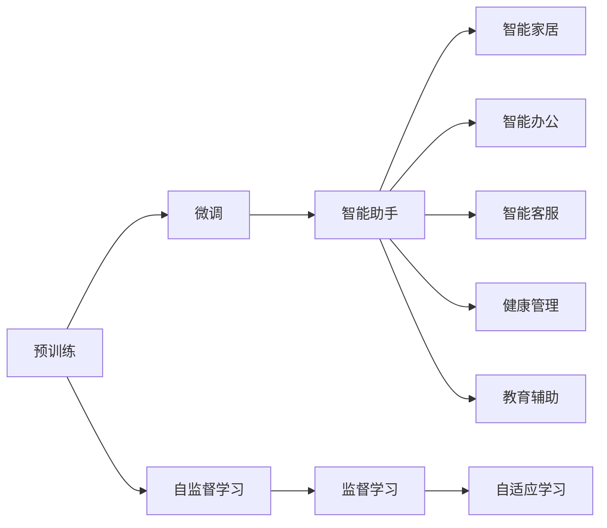

                 

# 全方位AI助手：LLM在日常生活中的渗透

> 关键词：人工智能(AI)、语言模型、大语言模型(Large Language Model, LLM)、自然语言处理(NLP)、个人助手、智能家居、智能办公、智能客服、健康管理、教育辅助

## 1. 背景介绍

### 1.1 问题由来

近年来，随着人工智能技术的迅速发展，尤其是语言模型（Language Models, LM）的突飞猛进，语言模型在自然语言处理（Natural Language Processing, NLP）领域取得了巨大突破。特别是大语言模型（LLM）如GPT-3、BERT等，凭借其海量的预训练数据和复杂的神经网络结构，在多种NLP任务上均取得了SOTA（State Of The Art）性能。

然而，大语言模型的应用不仅仅局限于学术和实验室研究，它们在现实生活中也有着广泛的应用场景。例如，智能助手、智能家居、智能办公、智能客服、健康管理、教育辅助等领域，LLM都能提供智能解决方案，极大地提升人类的生产生活效率和体验。

### 1.2 问题核心关键点

本节将从几个关键角度出发，探讨大语言模型在各个应用场景中的具体表现和实际效果。

- **智能助手：** 从日常聊天到复杂任务解答，LLM都能提供即时响应和高度个性化的帮助。
- **智能家居：** 通过语音助手、智能设备等实现家居自动化，提供安全舒适的生活环境。
- **智能办公：** 在文档撰写、会议记录、项目计划等方面提供高效辅助，提高办公效率。
- **智能客服：** 通过多轮对话理解和响应，实现24小时全天候服务，提高客户满意度。
- **健康管理：** 提供健康监测、疾病预防、在线咨询等服务，帮助人们管理健康。
- **教育辅助：** 提供个性化辅导、自动批改作业、智能推荐课程等服务，辅助教师和学生。

## 2. 核心概念与联系

### 2.1 核心概念概述

大语言模型（LLM）是一种能够处理自然语言任务的深度学习模型，能够理解、生成和推理自然语言。它通常使用Transformer等架构进行训练，并基于大规模语料库进行预训练，以学习语言的通用知识。

LLM的核心概念包括：
- **预训练（Pre-training）：** 使用大规模无标注数据进行训练，学习语言的一般规律。
- **微调（Fine-tuning）：** 使用小规模有标注数据进行训练，使模型适应特定任务。
- **自监督学习（Self-supervised Learning）：** 利用未标注数据进行预训练，学习语言的知识。
- **监督学习（Supervised Learning）：** 使用标注数据进行微调，使模型适应特定任务。
- **自适应学习（Adaptive Learning）：** 根据用户行为动态调整模型参数，提供个性化服务。

### 2.2 核心概念原理和架构的 Mermaid 流程图



这个流程图展示了预训练、微调和自适应学习在大语言模型应用中的联系：

- 预训练阶段通过自监督学习获取通用语言知识。
- 微调阶段通过监督学习将模型适应特定任务。
- 自适应学习阶段根据用户行为动态调整模型参数，提供个性化服务。

## 3. 核心算法原理 & 具体操作步骤

### 3.1 算法原理概述

大语言模型在应用中的主要原理是利用预训练和微调技术，将通用语言知识应用到特定任务中。具体流程包括：

1. **预训练**：在大规模无标注数据上使用自监督学习任务进行预训练，如语言模型（LM）、掩码语言模型（MLM）、下句预测（NSP）等。
2. **微调**：在特定任务上有标注数据上使用监督学习任务进行微调，如分类、匹配、生成等任务。
3. **自适应学习**：根据用户行为动态调整模型参数，提供个性化服务。

### 3.2 算法步骤详解

大语言模型的具体应用流程通常包括以下步骤：

1. **数据准备**：收集和处理用于预训练和微调的数据。预训练数据通常是大规模的未标注文本数据，而微调数据是有标注的任务数据。
2. **模型选择和初始化**：选择合适的模型架构和预训练模型，将其作为初始化参数。
3. **预训练**：在预训练数据上进行自监督学习，训练模型获取通用语言知识。
4. **微调**：在特定任务上有标注数据上进行监督学习，训练模型适应特定任务。
5. **自适应学习**：根据用户行为动态调整模型参数，提供个性化服务。

### 3.3 算法优缺点

大语言模型具有以下优点：
- **通用性**：可以应用于多种NLP任务，如分类、匹配、生成等。
- **高效性**：利用预训练模型可以大大减少标注数据的数量和标注成本。
- **个性化**：根据用户行为动态调整模型参数，提供个性化服务。

同时，大语言模型也存在一些缺点：
- **数据依赖性**：模型性能很大程度上依赖于标注数据的质量和数量。
- **模型复杂性**：大模型参数量庞大，对计算资源和存储资源的要求较高。
- **可解释性不足**：模型的决策过程难以解释，缺乏透明度。

### 3.4 算法应用领域

大语言模型在多个领域都有广泛的应用，以下是其中几个典型的应用领域：

- **智能助手**：如GPT-3、ChatGPT等，可以提供聊天、问答、翻译等服务。
- **智能家居**：如Amazon Alexa、Google Assistant等，通过语音助手实现家居自动化。
- **智能办公**：如Notion、Microsoft 365等，提供智能文档处理、会议记录等服务。
- **智能客服**：如Dialogflow、IBM Watson等，提供多轮对话理解和响应服务。
- **健康管理**：如IBM Watson Health等，提供健康监测、疾病预防、在线咨询等服务。
- **教育辅助**：如Khan Academy、Coursera等，提供个性化辅导、自动批改作业等服务。

## 4. 数学模型和公式 & 详细讲解 & 举例说明

### 4.1 数学模型构建

大语言模型通常基于Transformer架构进行构建。Transformer由自注意力机制和前馈神经网络组成，能够有效处理长序列数据。其数学模型可以表示为：

$$
y = T^{\text{MLP}}\left(T^{\text{Attention}}(x)\right)
$$

其中，$T^{\text{MLP}}$ 表示多层感知机（MLP），$T^{\text{Attention}}$ 表示自注意力机制，$x$ 表示输入序列，$y$ 表示输出序列。

### 4.2 公式推导过程

Transformer的自注意力机制可以表示为：

$$
A_{i,j} = \frac{\exp\left(\frac{w_k \cdot \left(x_i K_j\right)}{\sqrt{d_k}}\right)}{\sum_{i=1}^N \exp\left(\frac{w_k \cdot \left(x_i K_j\right)}{\sqrt{d_k}}\right)}
$$

其中，$w_k$ 是可学习参数，$d_k$ 是注意力层的维度。

在微调过程中，一般使用交叉熵损失函数（Cross-Entropy Loss）进行训练。其公式可以表示为：

$$
L(x,y) = -\frac{1}{N} \sum_{i=1}^N \sum_{j=1}^C y_{i,j} \log \hat{y}_{i,j}
$$

其中，$N$ 表示样本数，$C$ 表示类别数，$y_{i,j}$ 表示真实标签，$\hat{y}_{i,j}$ 表示模型预测值。

### 4.3 案例分析与讲解

以智能客服为例，我们可以使用预训练模型进行微调，使其能够处理多轮对话和意图识别。首先，需要准备对话数据集，包括问题和最佳答案。然后，利用该数据集进行微调，训练模型学习如何从用户输入中提取意图并生成回复。具体步骤包括：

1. **数据预处理**：对对话数据进行预处理，去除无用信息，标注意图。
2. **模型微调**：选择合适的预训练模型，如BERT、GPT等，使用对话数据进行微调，调整其意图识别和生成回复的能力。
3. **模型评估**：在测试集上评估模型性能，如BLEU、ROUGE等指标。
4. **模型部署**：将微调后的模型部署到实际系统中，与自然语言处理引擎结合，实现智能客服功能。

## 5. 项目实践：代码实例和详细解释说明

### 5.1 开发环境搭建

在进行实际开发前，需要先搭建好开发环境。以下是Python环境中PyTorch和Transformers库的安装步骤：

1. 安装Anaconda：从官网下载并安装Anaconda，用于创建独立的Python环境。
2. 创建并激活虚拟环境：
   ```bash
   conda create -n pytorch-env python=3.8 
   conda activate pytorch-env
   ```
3. 安装PyTorch：根据CUDA版本，从官网获取对应的安装命令。例如：
   ```bash
   conda install pytorch torchvision torchaudio cudatoolkit=11.1 -c pytorch -c conda-forge
   ```
4. 安装Transformers库：
   ```bash
   pip install transformers
   ```
5. 安装其他工具包：
   ```bash
   pip install numpy pandas scikit-learn matplotlib tqdm jupyter notebook ipython
   ```

完成上述步骤后，即可在`pytorch-env`环境中开始微调实践。

### 5.2 源代码详细实现

以下是使用PyTorch和Transformers库对智能客服模型进行微调的代码实现。

首先，定义智能客服模型类：

```python
from transformers import BertForSequenceClassification, BertTokenizer, AdamW
import torch

class ChatBotModel:
    def __init__(self, model_name='bert-base-cased'):
        self.tokenizer = BertTokenizer.from_pretrained(model_name)
        self.model = BertForSequenceClassification.from_pretrained(model_name, num_labels=2)
        self.model.train()
        self.optimizer = AdamW(self.model.parameters(), lr=2e-5)
        
    def forward(self, text):
        input_ids = self.tokenizer.encode(text, return_tensors='pt')
        outputs = self.model(input_ids)
        logits = outputs.logits
        return logits
```

然后，定义智能客服对话类：

```python
class ChatBotDialogue:
    def __init__(self, model, max_length=128):
        self.model = model
        self.max_length = max_length
        self.hypothesis = []
        self.history = []
        
    def process_input(self, text):
        input_ids = self.tokenizer.encode(text, return_tensors='pt', max_length=self.max_length, padding='max_length', truncation=True)
        logits = self.model(input_ids)
        hypothesis = logits.argmax(dim=2)[:, :len(input_ids)].tolist()
        self.history.append(input_ids)
        self.hypothesis.append(hypothesis)
        return hypothesis
        
    def generate_response(self, hypothesis):
        input_ids = torch.tensor(self.history[-1]).unsqueeze(0)
        logits = self.model(input_ids)
        response = logits.argmax(dim=2)[:, :len(input_ids)].tolist()
        return response
```

最后，启动智能客服对话过程：

```python
model = ChatBotModel()
chat_bot = ChatBotDialogue(model)

while True:
    text = input("User: ")
    hypothesis = chat_bot.process_input(text)
    print("ChatBot:", chat_bot.generate_response(hypothesis))
```

### 5.3 代码解读与分析

让我们再详细解读一下关键代码的实现细节：

**ChatBotModel类**：
- `__init__`方法：初始化分词器和模型，将模型设置为训练模式，并设置优化器。
- `forward`方法：接收用户输入，将输入序列转换为token ids，输入模型，输出模型预测的概率分布。

**ChatBotDialogue类**：
- `__init__`方法：初始化智能客服模型和对话参数。
- `process_input`方法：接收用户输入，将输入序列转换为token ids，输入模型，输出模型预测的假设。
- `generate_response`方法：接收假设，将假设输入模型，生成模型预测的回复。

**智能客服对话过程**：
- 定义智能客服模型和对话类，并设置初始化参数。
- 循环接收用户输入，将输入序列转换为token ids，输入模型，输出模型预测的假设。
- 将假设作为回复输入模型，生成模型预测的回复，并输出。

可以看到，使用PyTorch和Transformers库使得智能客服模型的开发变得简洁高效。开发者可以将更多精力放在数据处理、模型改进等高层逻辑上，而不必过多关注底层的实现细节。

当然，工业级的系统实现还需考虑更多因素，如模型的保存和部署、超参数的自动搜索、更灵活的任务适配层等。但核心的微调范式基本与此类似。

## 6. 实际应用场景

### 6.1 智能助手

智能助手如GPT-3、ChatGPT等，可以提供多种自然语言处理服务，如聊天、问答、翻译等。在实际应用中，智能助手通常部署在云端或移动端，通过API接口提供服务。

智能助手的使用场景包括：
- **个人助手**：如Siri、Google Assistant等，提供语音识别和语音合成功能。
- **企业助手**：如Microsoft Cortana等，提供日程管理、邮件处理、会议记录等服务。

### 6.2 智能家居

智能家居通过语音助手和智能设备实现家居自动化，提供安全舒适的生活环境。常见的智能家居设备包括：

- **智能音箱**：如Amazon Echo、Google Nest等，提供语音识别和智能音箱功能。
- **智能灯光**：如Philips Hue等，通过语音控制灯光亮度和颜色。
- **智能温控**：如Nest等，通过语音控制室内温度和湿度。

### 6.3 智能办公

智能办公通过自然语言处理技术，提供智能文档处理、会议记录等服务，提高办公效率。常见的智能办公应用包括：

- **智能文档处理**：如Notion、Google Docs等，提供智能排版、自动纠错、智能推荐等功能。
- **会议记录**：如Microsoft Outlook等，提供自动记录会议内容，生成会议纪要。
- **项目计划**：如Trello、Asana等，提供智能任务分配和进度跟踪功能。

### 6.4 智能客服

智能客服通过多轮对话理解和响应，实现24小时全天候服务，提高客户满意度。常见的智能客服应用包括：

- **客户咨询**：如IBM Watson等，提供客户问题解答和投诉处理。
- **销售支持**：如Salesforce等，提供销售线索跟进和客户服务支持。
- **服务请求**：如Zendesk等，提供服务请求处理和问题反馈。

### 6.5 健康管理

健康管理通过自然语言处理技术，提供健康监测、疾病预防、在线咨询等服务，帮助人们管理健康。常见的健康管理应用包括：

- **健康监测**：如Fitbit、Apple Watch等，提供健康数据监测和分析。
- **在线咨询**：如Teladoc等，提供在线医疗咨询和诊断。
- **疾病预防**：如Watson Health等，提供疾病风险评估和预防建议。

### 6.6 教育辅助

教育辅助通过自然语言处理技术，提供个性化辅导、自动批改作业、智能推荐课程等服务，辅助教师和学生。常见的教育辅助应用包括：

- **个性化辅导**：如Khan Academy等，提供个性化学习路径和课程推荐。
- **自动批改作业**：如Grammarly等，提供自动批改作业和语法纠正功能。
- **智能推荐课程**：如Coursera等，提供智能推荐课程和学习路径规划。

## 7. 工具和资源推荐

### 7.1 学习资源推荐

为了帮助开发者系统掌握大语言模型微调的理论基础和实践技巧，这里推荐一些优质的学习资源：

1. **《Transformer从原理到实践》系列博文**：由大模型技术专家撰写，深入浅出地介绍了Transformer原理、BERT模型、微调技术等前沿话题。
2. **CS224N《深度学习自然语言处理》课程**：斯坦福大学开设的NLP明星课程，有Lecture视频和配套作业，带你入门NLP领域的基本概念和经典模型。
3. **《Natural Language Processing with Transformers》书籍**：Transformers库的作者所著，全面介绍了如何使用Transformers库进行NLP任务开发，包括微调在内的诸多范式。
4. **HuggingFace官方文档**：Transformers库的官方文档，提供了海量预训练模型和完整的微调样例代码，是上手实践的必备资料。
5. **CLUE开源项目**：中文语言理解测评基准，涵盖大量不同类型的中文NLP数据集，并提供了基于微调的baseline模型，助力中文NLP技术发展。

通过对这些资源的学习实践，相信你一定能够快速掌握大语言模型微调的精髓，并用于解决实际的NLP问题。

### 7.2 开发工具推荐

高效的开发离不开优秀的工具支持。以下是几款用于大语言模型微调开发的常用工具：

1. **PyTorch**：基于Python的开源深度学习框架，灵活动态的计算图，适合快速迭代研究。大部分预训练语言模型都有PyTorch版本的实现。
2. **TensorFlow**：由Google主导开发的开源深度学习框架，生产部署方便，适合大规模工程应用。同样有丰富的预训练语言模型资源。
3. **Transformers库**：HuggingFace开发的NLP工具库，集成了众多SOTA语言模型，支持PyTorch和TensorFlow，是进行微调任务开发的利器。
4. **Weights & Biases**：模型训练的实验跟踪工具，可以记录和可视化模型训练过程中的各项指标，方便对比和调优。与主流深度学习框架无缝集成。
5. **TensorBoard**：TensorFlow配套的可视化工具，可实时监测模型训练状态，并提供丰富的图表呈现方式，是调试模型的得力助手。
6. **Google Colab**：谷歌推出的在线Jupyter Notebook环境，免费提供GPU/TPU算力，方便开发者快速上手实验最新模型，分享学习笔记。

合理利用这些工具，可以显著提升大语言模型微调任务的开发效率，加快创新迭代的步伐。

### 7.3 相关论文推荐

大语言模型和微调技术的发展源于学界的持续研究。以下是几篇奠基性的相关论文，推荐阅读：

1. **Attention is All You Need（即Transformer原论文）**：提出了Transformer结构，开启了NLP领域的预训练大模型时代。
2. **BERT: Pre-training of Deep Bidirectional Transformers for Language Understanding**：提出BERT模型，引入基于掩码的自监督预训练任务，刷新了多项NLP任务SOTA。
3. **Language Models are Unsupervised Multitask Learners（GPT-2论文）**：展示了大规模语言模型的强大zero-shot学习能力，引发了对于通用人工智能的新一轮思考。
4. **Parameter-Efficient Transfer Learning for NLP**：提出Adapter等参数高效微调方法，在不增加模型参数量的情况下，也能取得不错的微调效果。
5. **Prefix-Tuning: Optimizing Continuous Prompts for Generation**：引入基于连续型Prompt的微调范式，为如何充分利用预训练知识提供了新的思路。
6. **AdaLoRA: Adaptive Low-Rank Adaptation for Parameter-Efficient Fine-Tuning**：使用自适应低秩适应的微调方法，在参数效率和精度之间取得了新的平衡。

这些论文代表了大语言模型微调技术的发展脉络。通过学习这些前沿成果，可以帮助研究者把握学科前进方向，激发更多的创新灵感。

## 8. 总结：未来发展趋势与挑战

### 8.1 总结

本文对大语言模型在各个应用场景中的具体实现进行了全面系统的介绍。首先阐述了大语言模型和微调技术的研究背景和意义，明确了微调在拓展预训练模型应用、提升下游任务性能方面的独特价值。其次，从原理到实践，详细讲解了监督微调的数学原理和关键步骤，给出了微调任务开发的完整代码实例。同时，本文还广泛探讨了微调方法在智能助手、智能家居、智能办公、智能客服、健康管理、教育辅助等多个行业领域的应用前景，展示了微调范式的巨大潜力。

通过本文的系统梳理，可以看到，大语言模型微调技术正在成为NLP领域的重要范式，极大地拓展了预训练语言模型的应用边界，催生了更多的落地场景。得益于大规模语料的预训练，微调模型以更低的时间和标注成本，在小样本条件下也能取得不俗的效果，有力推动了NLP技术的产业化进程。未来，伴随预训练语言模型和微调方法的持续演进，相信NLP技术将在更广阔的应用领域大放异彩，深刻影响人类的生产生活方式。

### 8.2 未来发展趋势

展望未来，大语言模型微调技术将呈现以下几个发展趋势：

1. **模型规模持续增大**：随着算力成本的下降和数据规模的扩张，预训练语言模型的参数量还将持续增长。超大规模语言模型蕴含的丰富语言知识，有望支撑更加复杂多变的下游任务微调。
2. **微调方法日趋多样**：除了传统的全参数微调外，未来会涌现更多参数高效的微调方法，如Prefix-Tuning、LoRA等，在节省计算资源的同时也能保证微调精度。
3. **持续学习成为常态**：随着数据分布的不断变化，微调模型也需要持续学习新知识以保持性能。如何在不遗忘原有知识的同时，高效吸收新样本信息，将成为重要的研究课题。
4. **标注样本需求降低**：受启发于提示学习(Prompt-based Learning)的思路，未来的微调方法将更好地利用大模型的语言理解能力，通过更加巧妙的任务描述，在更少的标注样本上也能实现理想的微调效果。
5. **多模态微调崛起**：当前的微调主要聚焦于纯文本数据，未来会进一步拓展到图像、视频、语音等多模态数据微调。多模态信息的融合，将显著提升语言模型对现实世界的理解和建模能力。
6. **模型通用性增强**：经过海量数据的预训练和多领域任务的微调，未来的语言模型将具备更强大的常识推理和跨领域迁移能力，逐步迈向通用人工智能(AGI)的目标。

以上趋势凸显了大语言模型微调技术的广阔前景。这些方向的探索发展，必将进一步提升NLP系统的性能和应用范围，为人类认知智能的进化带来深远影响。

### 8.3 面临的挑战

尽管大语言模型微调技术已经取得了瞩目成就，但在迈向更加智能化、普适化应用的过程中，它仍面临着诸多挑战：

1. **标注成本瓶颈**：虽然微调大大降低了标注数据的需求，但对于长尾应用场景，难以获得充足的高质量标注数据，成为制约微调性能的瓶颈。如何进一步降低微调对标注样本的依赖，将是一大难题。
2. **模型鲁棒性不足**：当前微调模型面对域外数据时，泛化性能往往大打折扣。对于测试样本的微小扰动，微调模型的预测也容易发生波动。如何提高微调模型的鲁棒性，避免灾难性遗忘，还需要更多理论和实践的积累。
3. **推理效率有待提高**：大规模语言模型虽然精度高，但在实际部署时往往面临推理速度慢、内存占用大等效率问题。如何在保证性能的同时，简化模型结构，提升推理速度，优化资源占用，将是重要的优化方向。
4. **可解释性亟需加强**：当前微调模型更像是"黑盒"系统，难以解释其内部工作机制和决策逻辑。对于医疗、金融等高风险应用，算法的可解释性和可审计性尤为重要。如何赋予微调模型更强的可解释性，将是亟待攻克的难题。
5. **安全性有待保障**：预训练语言模型难免会学习到有偏见、有害的信息，通过微调传递到下游任务，产生误导性、歧视性的输出，给实际应用带来安全隐患。如何从数据和算法层面消除模型偏见，避免恶意用途，确保输出的安全性，也将是重要的研究课题。
6. **知识整合能力不足**：现有的微调模型往往局限于任务内数据，难以灵活吸收和运用更广泛的先验知识。如何让微调过程更好地与外部知识库、规则库等专家知识结合，形成更加全面、准确的信息整合能力，还有很大的想象空间。

正视微调面临的这些挑战，积极应对并寻求突破，将是大语言模型微调走向成熟的必由之路。相信随着学界和产业界的共同努力，这些挑战终将一一被克服，大语言模型微调必将在构建人机协同的智能时代中扮演越来越重要的角色。

### 8.4 研究展望

面对大语言模型微调所面临的种种挑战，未来的研究需要在以下几个方面寻求新的突破：

1. **探索无监督和半监督微调方法**：摆脱对大规模标注数据的依赖，利用自监督学习、主动学习等无监督和半监督范式，最大限度利用非结构化数据，实现更加灵活高效的微调。
2. **研究参数高效和计算高效的微调范式**：开发更加参数高效的微调方法，在固定大部分预训练参数的同时，只更新极少量的任务相关参数。同时优化微调模型的计算图，减少前向传播和反向传播的资源消耗，实现更加轻量级、实时性的部署。
3. **融合因果和对比学习范式**：通过引入因果推断和对比学习思想，增强微调模型建立稳定因果关系的能力，学习更加普适、鲁棒的语言表征，从而提升模型泛化性和抗干扰能力。
4. **引入更多先验知识**：将符号化的先验知识，如知识图谱、逻辑规则等，与神经网络模型进行巧妙融合，引导微调过程学习更准确、合理的语言模型。同时加强不同模态数据的整合，实现视觉、语音等多模态信息与文本信息的协同建模。
5. **结合因果分析和博弈论工具**：将因果分析方法引入微调模型，识别出模型决策的关键特征，增强输出解释的因果性和逻辑性。借助博弈论工具刻画人机交互过程，主动探索并规避模型的脆弱点，提高系统稳定性。
6. **纳入伦理道德约束**：在模型训练目标中引入伦理导向的评估指标，过滤和惩罚有偏见、有害的输出倾向。同时加强人工干预和审核，建立模型行为的监管机制，确保输出符合人类价值观和伦理道德。

这些研究方向的探索，必将引领大语言模型微调技术迈向更高的台阶，为构建安全、可靠、可解释、可控的智能系统铺平道路。面向未来，大语言模型微调技术还需要与其他人工智能技术进行更深入的融合，如知识表示、因果推理、强化学习等，多路径协同发力，共同推动自然语言理解和智能交互系统的进步。只有勇于创新、敢于突破，才能不断拓展语言模型的边界，让智能技术更好地造福人类社会。

## 9. 附录：常见问题与解答

**Q1：大语言模型微调是否适用于所有NLP任务？**

A: 大语言模型微调在大多数NLP任务上都能取得不错的效果，特别是对于数据量较小的任务。但对于一些特定领域的任务，如医学、法律等，仅仅依靠通用语料预训练的模型可能难以很好地适应。此时需要在特定领域语料上进一步预训练，再进行微调，才能获得理想效果。此外，对于一些需要时效性、个性化很强的任务，如对话、推荐等，微调方法也需要针对性的改进优化。

**Q2：微调过程中如何选择合适的学习率？**

A: 微调的学习率一般要比预训练时小1-2个数量级，如果使用过大的学习率，容易破坏预训练权重，导致过拟合。一般建议从1e-5开始调参，逐步减小学习率，直至收敛。也可以使用warmup策略，在开始阶段使用较小的学习率，再逐渐过渡到预设值。需要注意的是，不同的优化器(如AdamW、Adafactor等)以及不同的学习率调度策略，可能需要设置不同的学习率阈值。

**Q3：采用大模型微调时会面临哪些资源瓶颈？**

A: 目前主流的预训练大模型动辄以亿计的参数规模，对算力、内存、存储资源的要求较高。GPU/TPU等高性能设备是必不可少的，但即便如此，超大批次的训练和推理也可能遇到显存不足的问题。因此需要采用一些资源优化技术，如梯度积累、混合精度训练、模型并行等，来突破硬件瓶颈。同时，模型的存储和读取也可能占用大量时间和空间，需要采用模型压缩、稀疏化存储等方法进行优化。

**Q4：如何缓解微调过程中的过拟合问题？**

A: 过拟合是微调面临的主要挑战，尤其是在标注数据不足的情况下。常见的缓解策略包括：
1. 数据增强：通过回译、近义替换等方式扩充训练集
2. 正则化：使用L2正则、Dropout、Early Stopping等避免过拟合
3. 对抗训练：引入对抗样本，提高模型鲁棒性
4. 参数高效微调：只调整少量参数(如Adapter、Prefix等)，减小过拟合风险
5. 多模型集成：训练多个微调模型，取平均输出，抑制过拟合

这些策略往往需要根据具体任务和数据特点进行灵活组合。只有在数据、模型、训练、推理等各环节进行全面优化，才能最大限度地发挥大模型微调的威力。

**Q5：微调模型在落地部署时需要注意哪些问题？**

A: 将微调模型转化为实际应用，还需要考虑以下因素：
1. 模型裁剪：去除不必要的层和参数，减小模型尺寸，加快推理速度
2. 量化加速：将浮点模型转为定点模型，压缩存储空间，提高计算效率
3. 服务化封装：将模型封装为标准化服务接口，便于集成调用
4. 弹性伸缩：根据请求流量动态调整资源配置，平衡服务质量和成本
5. 监控告警：实时采集系统指标，设置异常告警阈值，确保服务稳定性
6. 安全防护：采用访问鉴权、数据脱敏等措施，保障数据和模型安全

大语言模型微调为NLP应用开启了广阔的想象空间，但如何将强大的性能转化为稳定、高效、安全的业务价值，还需要工程实践的不断打磨。唯有从数据、算法、工程、业务等多个维度协同发力，才能真正实现人工智能技术在垂直行业的规模化落地。总之，微调需要开发者根据具体任务，不断迭代和优化模型、数据和算法，方能得到理想的效果。

---

作者：禅与计算机程序设计艺术 / Zen and the Art of Computer Programming

