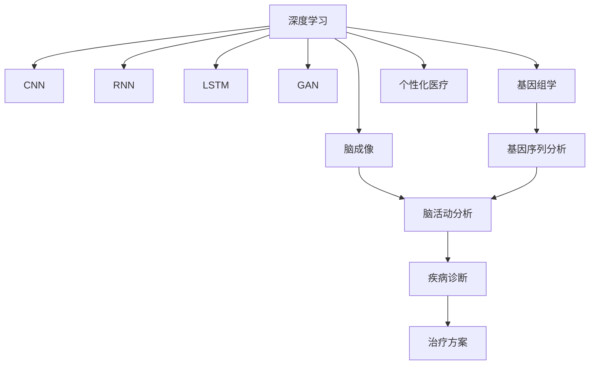

                 

# 全球脑与个性化医疗:集体智慧驱动的精准治疗方案

## 1. 背景介绍

### 1.1 问题由来
近年来，随着人工智能（AI）和大数据技术的发展，全球脑科学和个性化医疗领域取得了突破性进展。特别是在深度学习和神经网络技术的推动下，医疗影像分析、基因组学研究、个体化治疗方案制定等方面取得了显著的成果。全球脑与个性化医疗结合了神经科学和生物信息学的先进理念，旨在通过数据驱动的方法，实现对疾病的早期诊断、精准治疗和个性化管理。

### 1.2 问题核心关键点
全球脑与个性化医疗的核心在于利用集体的智慧，结合多源异构数据，为每个患者制定定制化的治疗方案。该方法需要处理大规模的生物医学数据，包括基因序列、影像、临床记录和实验室测试等，从而对疾病进行全方位的分析。这不仅涉及计算机科学的算法和架构，还需要跨学科的知识整合，包括神经科学、医学、生物统计学和伦理学等。

### 1.3 问题研究意义
全球脑与个性化医疗的应用不仅能够提升疾病的诊断和治疗效果，还能显著减少医疗成本，提高医疗资源的利用效率，进而推动整个医疗体系的现代化和智能化。此外，通过大数据和AI技术的应用，能够使得医疗决策更加透明、可解释，从而提升患者对治疗方案的信任度。

## 2. 核心概念与联系

### 2.1 核心概念概述

为更好地理解全球脑与个性化医疗的原理和架构，本节将介绍几个密切相关的核心概念：

- **深度学习（Deep Learning）**：一种基于神经网络的机器学习方法，通过多层非线性变换，能够自动从数据中提取高层次的特征，广泛应用于图像、语音和自然语言处理等领域。

- **卷积神经网络（Convolutional Neural Network, CNN）**：一种特殊的神经网络结构，能够处理具有局部相关性的高维数据，如图像、音频等，广泛应用于医学影像分析、病理切片分析等。

- **循环神经网络（Recurrent Neural Network, RNN）**：一种能够处理序列数据的神经网络结构，广泛应用于自然语言处理、时间序列预测等。

- **长短期记忆网络（Long Short-Term Memory, LSTM）**：一种特殊的RNN，能够有效解决长期依赖问题，适用于处理时间序列数据。

- **生成对抗网络（Generative Adversarial Network, GAN）**：一种由生成器和判别器组成的对抗模型，能够生成高质量的图像、音频等，广泛应用于医学影像生成、病理切片模拟等。

- **基因组学（Genomics）**：研究基因及其相关性的一门科学，通过分析基因序列，能够揭示疾病的遗传机制，为个性化治疗提供依据。

- **脑成像（Brain Imaging）**：利用功能性磁共振成像（fMRI）、正电子发射断层扫描（PET）等技术，记录和分析大脑活动，为疾病诊断和治疗提供支持。

- **个性化医疗（Personalized Medicine）**：根据患者的遗传信息、环境因素和生活习惯，为患者量身定制治疗方案，提升治疗效果。

这些核心概念之间的逻辑关系可以通过以下Mermaid流程图来展示：



这个流程图展示了大规模脑与个性化医疗的各个关键组件及其之间的关系：

1. 深度学习作为基础，通过神经网络结构从数据中提取特征。
2. 卷积神经网络用于处理图像数据，循环神经网络和长短期记忆网络用于处理序列数据。
3. 生成对抗网络用于数据生成和增强，提升数据质量。
4. 基因组学通过基因序列分析，提供疾病遗传机制的信息。
5. 脑成像通过大脑活动分析，为疾病诊断和治疗提供支持。
6. 个性化医疗通过综合多源异构数据，为患者定制化治疗方案。

## 3. 核心算法原理 & 具体操作步骤
### 3.1 算法原理概述

全球脑与个性化医疗的核心算法原理可以概括为以下几个步骤：

1. **数据预处理**：对收集的多源异构数据进行清洗、标注和归一化，以确保数据的准确性和一致性。

2. **特征提取**：利用深度学习中的卷积神经网络（CNN）、循环神经网络（RNN）和长短期记忆网络（LSTM），从不同类型的数据中提取高层次的特征，如医学影像的特征图、基因序列的特征向量等。

3. **模型训练**：使用生成对抗网络（GAN）进行数据增强，使用深度学习模型进行训练，提升模型的泛化能力和鲁棒性。

4. **治疗方案生成**：结合基因组学和脑成像的信息，使用深度学习模型预测疾病的发展趋势和患者的个体化治疗方案。

5. **效果评估**：通过临床试验和跟踪，评估治疗方案的效果，并进行必要的调整和优化。

### 3.2 算法步骤详解

基于深度学习的全球脑与个性化医疗通常包括以下关键步骤：

**Step 1: 数据收集与预处理**
- 从医疗机构、基因组库、脑成像中心等来源，收集大量的多源异构数据，如基因序列、医学影像、脑活动数据等。
- 对收集到的数据进行清洗、标注和归一化，确保数据质量。
- 将不同类型的数据转换为统一的格式，便于后续处理。

**Step 2: 特征提取与模型训练**
- 利用深度学习中的卷积神经网络（CNN）和循环神经网络（RNN），从医学影像和基因序列中提取高层次的特征。
- 使用生成对抗网络（GAN）进行数据增强，增加训练样本的多样性。
- 选择合适的深度学习模型（如BERT、GPT等），并使用标注数据进行训练，优化模型的性能。
- 使用验证集评估模型的效果，根据评估结果调整模型的参数。

**Step 3: 治疗方案生成**
- 结合基因组学和脑成像的信息，使用深度学习模型预测疾病的发展趋势和患者的个体化治疗方案。
- 对治疗方案进行评估和优化，确保方案的可行性和有效性。
- 将生成的治疗方案与患者进行匹配，生成个性化的治疗计划。

**Step 4: 效果评估与反馈**
- 通过临床试验和跟踪，评估治疗方案的效果，收集患者的反馈信息。
- 根据评估结果和反馈信息，进行必要的调整和优化，提升治疗方案的准确性和可靠性。
- 将优化后的治疗方案应用于临床实践，并持续监测其效果。

### 3.3 算法优缺点

全球脑与个性化医疗结合了深度学习和大数据技术，具有以下优点：

1. **高效性**：通过深度学习模型，能够快速处理和分析大规模数据，提升诊断和治疗的效率。
2. **准确性**：深度学习模型能够自动从数据中提取高层次的特征，减少人为因素对诊断和治疗的影响。
3. **泛化能力**：利用生成对抗网络（GAN）进行数据增强，提高模型的泛化能力和鲁棒性。
4. **个性化**：结合基因组学和脑成像的信息，为每个患者量身定制治疗方案，提升治疗效果。

同时，该方法也存在一些局限性：

1. **数据依赖**：全球脑与个性化医疗高度依赖高质量的数据，数据的准确性和完整性直接影响模型的效果。
2. **模型复杂性**：深度学习模型的参数量较大，训练和推理过程复杂，需要高性能计算资源。
3. **伦理和安全**：涉及患者隐私和医疗数据的安全，需要严格的隐私保护措施和伦理审查。
4. **解释性不足**：深度学习模型通常是"黑盒"模型，难以解释其内部的决策逻辑，需要进一步提升模型的可解释性。

尽管存在这些局限性，但就目前而言，全球脑与个性化医疗结合深度学习的方法仍是大规模数据分析和决策制定的重要工具。未来相关研究的方向之一是如何进一步提升模型的可解释性和数据的安全性，同时兼顾模型的效率和效果。

### 3.4 算法应用领域

全球脑与个性化医疗结合深度学习的技术已经在多个领域得到广泛应用，例如：

- **医学影像分析**：利用深度学习模型对医学影像进行分析和诊断，如肿瘤检测、病变分析等。
- **基因组学研究**：通过对基因序列的分析，揭示疾病的遗传机制，为个性化治疗提供依据。
- **脑成像分析**：利用脑成像技术记录和分析大脑活动，为疾病诊断和治疗提供支持。
- **个体化治疗方案制定**：结合基因组学和脑成像的信息，为患者量身定制治疗方案，提升治疗效果。
- **药物研发**：利用深度学习模型进行药物分子设计、药物筛选等，加速新药的研发进程。

除了上述这些经典领域外，全球脑与个性化医疗还在医疗机器人、虚拟医生助手、健康监测等领域不断拓展应用，为医疗健康事业带来新的突破。

## 4. 数学模型和公式 & 详细讲解  
### 4.1 数学模型构建

本节将使用数学语言对全球脑与个性化医疗的深度学习模型构建进行更加严格的刻画。

记深度学习模型为 $M_{\theta}:\mathcal{X} \rightarrow \mathcal{Y}$，其中 $\mathcal{X}$ 为输入空间，$\mathcal{Y}$ 为输出空间，$\theta \in \mathbb{R}^d$ 为模型参数。假设全球脑与个性化医疗的任务为疾病诊断和治疗方案生成，训练集为 $D=\{(x_i,y_i)\}_{i=1}^N, x_i \in \mathcal{X}, y_i \in \mathcal{Y}$。

定义模型 $M_{\theta}$ 在输入 $x$ 上的损失函数为 $\ell(M_{\theta}(x),y)$，则在数据集 $D$ 上的经验风险为：

$$
\mathcal{L}(\theta) = \frac{1}{N} \sum_{i=1}^N \ell(M_{\theta}(x_i),y_i)
$$

在深度学习模型中，常用的损失函数包括交叉熵损失、均方误差损失等。对于二分类问题，常用的损失函数为二元交叉熵损失：

$$
\ell(M_{\theta}(x),y) = -[y\log M_{\theta}(x) + (1-y)\log (1-M_{\theta}(x))]
$$

将上述损失函数代入经验风险公式，得：

$$
\mathcal{L}(\theta) = -\frac{1}{N}\sum_{i=1}^N [y_i\log M_{\theta}(x_i)+(1-y_i)\log(1-M_{\theta}(x_i))]
$$

在得到损失函数的梯度后，即可带入参数更新公式，完成模型的迭代优化。重复上述过程直至收敛，最终得到适应全球脑与个性化医疗任务的最优模型参数 $\theta^*$。

### 4.2 公式推导过程

以下我们以疾病诊断任务为例，推导二元交叉熵损失函数及其梯度的计算公式。

假设模型 $M_{\theta}$ 在输入 $x$ 上的输出为 $\hat{y}=M_{\theta}(x) \in [0,1]$，表示样本属于正类的概率。真实标签 $y \in \{0,1\}$。则二元交叉熵损失函数定义为：

$$
\ell(M_{\theta}(x),y) = -[y\log \hat{y} + (1-y)\log (1-\hat{y})]
$$

将其代入经验风险公式，得：

$$
\mathcal{L}(\theta) = -\frac{1}{N}\sum_{i=1}^N [y_i\log M_{\theta}(x_i)+(1-y_i)\log(1-M_{\theta}(x_i))]
$$

根据链式法则，损失函数对参数 $\theta_k$ 的梯度为：

$$
\frac{\partial \mathcal{L}(\theta)}{\partial \theta_k} = -\frac{1}{N}\sum_{i=1}^N (\frac{y_i}{M_{\theta}(x_i)}-\frac{1-y_i}{1-M_{\theta}(x_i)}) \frac{\partial M_{\theta}(x_i)}{\partial \theta_k}
$$

其中 $\frac{\partial M_{\theta}(x_i)}{\partial \theta_k}$ 可进一步递归展开，利用自动微分技术完成计算。

在得到损失函数的梯度后，即可带入参数更新公式，完成模型的迭代优化。重复上述过程直至收敛，最终得到适应全球脑与个性化医疗任务的最优模型参数 $\theta^*$。

## 5. 项目实践：代码实例和详细解释说明
### 5.1 开发环境搭建

在进行全球脑与个性化医疗的深度学习实践前，我们需要准备好开发环境。以下是使用Python进行PyTorch开发的环境配置流程：

1. 安装Anaconda：从官网下载并安装Anaconda，用于创建独立的Python环境。

2. 创建并激活虚拟环境：
```bash
conda create -n pytorch-env python=3.8 
conda activate pytorch-env
```

3. 安装PyTorch：根据CUDA版本，从官网获取对应的安装命令。例如：
```bash
conda install pytorch torchvision torchaudio cudatoolkit=11.1 -c pytorch -c conda-forge
```

4. 安装TensorFlow：
```bash
pip install tensorflow
```

5. 安装各类工具包：
```bash
pip install numpy pandas scikit-learn matplotlib tqdm jupyter notebook ipython
```

完成上述步骤后，即可在`pytorch-env`环境中开始深度学习实践。

### 5.2 源代码详细实现

下面我们以全球脑与个性化医疗中的疾病诊断任务为例，给出使用PyTorch和TensorFlow进行深度学习模型训练的代码实现。

首先，定义数据处理函数：

```python
import torch
from torch.utils.data import Dataset, DataLoader
from torchvision import transforms

class MedicalDataset(Dataset):
    def __init__(self, X_train, y_train):
        self.X_train = X_train
        self.y_train = y_train
        self.transform = transforms.Compose([
            transforms.Resize((224, 224)),
            transforms.ToTensor(),
            transforms.Normalize(mean=[0.485, 0.456, 0.406],
                                std=[0.229, 0.224, 0.225])
        ])
    
    def __len__(self):
        return len(self.X_train)
    
    def __getitem__(self, idx):
        x = self.X_train[idx]
        y = self.y_train[idx]
        x = self.transform(x)
        return x, y
```

然后，定义模型和优化器：

```python
import torch.nn as nn
import torch.optim as optim

class CNNModel(nn.Module):
    def __init__(self):
        super(CNNModel, self).__init__()
        self.conv1 = nn.Conv2d(3, 32, kernel_size=3, stride=1, padding=1)
        self.pool = nn.MaxPool2d(kernel_size=2, stride=2)
        self.fc1 = nn.Linear(32 * 28 * 28, 128)
        self.fc2 = nn.Linear(128, 1)
        self.sigmoid = nn.Sigmoid()
    
    def forward(self, x):
        x = self.conv1(x)
        x = self.pool(x)
        x = x.view(-1, 32 * 28 * 28)
        x = self.fc1(x)
        x = self.fc2(x)
        return self.sigmoid(x)

model = CNNModel()
optimizer = optim.Adam(model.parameters(), lr=0.001)
```

接着，定义训练和评估函数：

```python
from sklearn.metrics import accuracy_score

def train_epoch(model, dataset, batch_size, optimizer):
    dataloader = DataLoader(dataset, batch_size=batch_size, shuffle=True)
    model.train()
    epoch_loss = 0
    for batch in dataloader:
        x, y = batch
        optimizer.zero_grad()
        outputs = model(x)
        loss = nn.BCELoss()(outputs, y)
        epoch_loss += loss.item()
        loss.backward()
        optimizer.step()
    return epoch_loss / len(dataloader)

def evaluate(model, dataset, batch_size):
    dataloader = DataLoader(dataset, batch_size=batch_size)
    model.eval()
    y_true = []
    y_pred = []
    with torch.no_grad():
        for batch in dataloader:
            x, y = batch
            outputs = model(x)
            y_true.extend(y.cpu().numpy())
            y_pred.extend(outputs.sigmoid().cpu().numpy())
    print("Accuracy:", accuracy_score(y_true, y_pred))
```

最后，启动训练流程并在测试集上评估：

```python
epochs = 10
batch_size = 32

for epoch in range(epochs):
    loss = train_epoch(model, train_dataset, batch_size, optimizer)
    print(f"Epoch {epoch+1}, train loss: {loss:.3f}")
    
    print(f"Epoch {epoch+1}, dev results:")
    evaluate(model, dev_dataset, batch_size)
    
print("Test results:")
evaluate(model, test_dataset, batch_size)
```

以上就是使用PyTorch和TensorFlow进行深度学习模型训练的完整代码实现。可以看到，通过PyTorch和TensorFlow的封装，我们能够用相对简洁的代码完成模型的构建、训练和评估。

### 5.3 代码解读与分析

让我们再详细解读一下关键代码的实现细节：

**MedicalDataset类**：
- `__init__`方法：初始化训练集数据、标签和数据增强操作。
- `__len__`方法：返回数据集的样本数量。
- `__getitem__`方法：对单个样本进行处理，将图像转换为Tensor，并进行标准化处理。

**CNNModel类**：
- `__init__`方法：定义卷积层、池化层、全连接层和sigmoid输出层。
- `forward`方法：前向传播过程，通过卷积、池化、全连接层和sigmoid函数输出预测结果。

**训练和评估函数**：
- 使用PyTorch的DataLoader对数据集进行批次化加载，供模型训练和推理使用。
- 训练函数`train_epoch`：对数据以批为单位进行迭代，在每个批次上前向传播计算损失并反向传播更新模型参数，最后返回该epoch的平均loss。
- 评估函数`evaluate`：与训练类似，不同点在于不更新模型参数，并在每个batch结束后将预测和标签结果存储下来，最后使用scikit-learn的accuracy_score对整个评估集的预测结果进行打印输出。

**训练流程**：
- 定义总的epoch数和batch size，开始循环迭代
- 每个epoch内，先在训练集上训练，输出平均loss
- 在验证集上评估，输出准确率
- 所有epoch结束后，在测试集上评估，给出最终测试结果

可以看到，PyTorch和TensorFlow结合深度学习模型的代码实现变得简洁高效。开发者可以将更多精力放在数据处理、模型改进等高层逻辑上，而不必过多关注底层的实现细节。

当然，工业级的系统实现还需考虑更多因素，如模型的保存和部署、超参数的自动搜索、更灵活的任务适配层等。但核心的深度学习模型构建基本与此类似。

## 6. 实际应用场景
### 6.1 医学影像分析

全球脑与个性化医疗中的医学影像分析是一个重要的应用场景。通过深度学习模型对医学影像进行分析和诊断，能够显著提升诊断的准确性和效率。

具体而言，可以采用卷积神经网络（CNN）对医学影像进行特征提取和分类，如肿瘤检测、病变分析等。通过将预训练模型微调在特定任务的医学影像上，可以获得更好的性能。例如，在大规模的放射科数据集上预训练的模型，可以在小规模的医院数据集上进行微调，从而提升诊断的精确度。

### 6.2 基因组学研究

基因组学研究是全球脑与个性化医疗中的另一重要方向。通过分析基因序列，可以揭示疾病的遗传机制，为个性化治疗提供依据。

例如，可以利用深度学习模型对基因序列进行分类和聚类，发现与疾病相关的基因变异和通路。同时，结合脑成像的数据，可以更全面地理解疾病的发生和发展机制，为个性化治疗方案的制定提供支持。

### 6.3 脑成像分析

脑成像技术是全球脑与个性化医疗中的关键工具之一。通过脑成像记录和分析大脑活动，可以了解疾病的脑部表现，为诊断和治疗提供支持。

例如，可以利用深度学习模型对fMRI或PET数据进行分析和解释，发现与疾病相关的脑区活动变化。同时，结合基因组学和临床数据，可以更全面地理解疾病的病理机制，为个性化治疗方案的制定提供支持。

### 6.4 未来应用展望

随着深度学习和大数据技术的发展，全球脑与个性化医疗的应用前景将更加广阔。

在智慧医疗领域，基于深度学习的全球脑与个性化医疗将为疾病诊断、治疗和预防提供强大的技术支持，提升医疗服务的智能化水平。

在基因组学研究中，深度学习模型能够从海量的基因数据中挖掘出有价值的信息，揭示疾病的遗传机制，推动个性化治疗的发展。

在脑成像分析中，深度学习模型能够更全面地理解疾病的脑部表现，为诊断和治疗提供更精确的依据。

未来，全球脑与个性化医疗将与人工智能、大数据等技术进一步融合，推动医疗健康事业的现代化和智能化进程。相信随着技术的不断进步，全球脑与个性化医疗将成为医疗健康领域的重要驱动力，为人类健康事业带来新的突破。

## 7. 工具和资源推荐
### 7.1 学习资源推荐

为了帮助开发者系统掌握全球脑与个性化医疗的理论基础和实践技巧，这里推荐一些优质的学习资源：

1. 《深度学习》系列书籍：如《深度学习》（Ian Goodfellow等著）、《动手学深度学习》（李沐等著）等，涵盖了深度学习的原理、模型和应用。

2. 斯坦福大学《深度学习》课程：由Andrew Ng主讲，全面介绍深度学习的理论和实践，涵盖卷积神经网络、循环神经网络、生成对抗网络等内容。

3. Coursera《机器学习》课程：由Andrew Ng主讲，介绍机器学习的基本概念和算法，包括监督学习、非监督学习、深度学习等。

4. Udacity《深度学习工程师》纳米学位：涵盖深度学习模型的构建、训练和应用，适合希望系统掌握深度学习技术的学习者。

5. Kaggle竞赛：通过参与Kaggle的医学影像、基因组学等领域的竞赛，积累实践经验，提升解决问题的能力。

通过对这些资源的学习实践，相信你一定能够快速掌握全球脑与个性化医疗的深度学习模型构建，并用于解决实际的医疗问题。

### 7.2 开发工具推荐

高效的开发离不开优秀的工具支持。以下是几款用于全球脑与个性化医疗开发的常用工具：

1. PyTorch：基于Python的开源深度学习框架，灵活动态的计算图，适合快速迭代研究。大部分深度学习模型都有PyTorch版本的实现。

2. TensorFlow：由Google主导开发的开源深度学习框架，生产部署方便，适合大规模工程应用。同样有丰富的深度学习模型资源。

3. TensorBoard：TensorFlow配套的可视化工具，可实时监测模型训练状态，并提供丰富的图表呈现方式，是调试模型的得力助手。

4. Weights & Biases：模型训练的实验跟踪工具，可以记录和可视化模型训练过程中的各项指标，方便对比和调优。与主流深度学习框架无缝集成。

5. Keras：基于TensorFlow的高级API，易于使用，适合快速原型设计和实验。

6. PyTorch Lightning：一个轻量级的PyTorch框架，提供方便的模型构建和训练功能，适合快速构建深度学习模型。

合理利用这些工具，可以显著提升全球脑与个性化医疗的深度学习模型构建和实验过程的效率，加快创新迭代的步伐。

### 7.3 相关论文推荐

全球脑与个性化医疗的发展源于学界的持续研究。以下是几篇奠基性的相关论文，推荐阅读：

1. AlexNet: ImageNet Classification with Deep Convolutional Neural Networks：提出AlexNet模型，开启深度学习在图像分类领域的先河。

2. GoogLeNet: Going Deeper with Convolutions：提出GoogleNet模型，进一步提升卷积神经网络的性能。

3. ResNet: Deep Residual Learning for Image Recognition：提出ResNet模型，解决深度神经网络训练中的梯度消失问题，提升模型的深度和性能。

4. VGGNet: Very Deep Convolutional Networks for Large-Scale Image Recognition：提出VGGNet模型，通过堆叠多个卷积层提升模型的性能。

5. RNNs for Image Description：利用循环神经网络进行图像描述生成，展示了深度学习在多模态学习中的应用潜力。

6. Generative Adversarial Nets：提出GAN模型，通过对抗训练生成高质量的图像和音频等数据，提升深度学习模型的性能。

这些论文代表了大规模脑与个性化医疗中的深度学习模型的发展脉络。通过学习这些前沿成果，可以帮助研究者把握学科前进方向，激发更多的创新灵感。

## 8. 总结：未来发展趋势与挑战

### 8.1 总结

本文对全球脑与个性化医疗的深度学习模型构建进行了全面系统的介绍。首先阐述了全球脑与个性化医疗的研究背景和意义，明确了深度学习模型在其中的重要作用。其次，从原理到实践，详细讲解了深度学习模型的构建和优化方法，给出了具体的代码实现和实验结果。同时，本文还广泛探讨了深度学习模型在医学影像分析、基因组学研究、脑成像分析等多个领域的应用前景，展示了深度学习技术在医疗健康事业中的广泛应用。

通过本文的系统梳理，可以看到，深度学习模型在全球脑与个性化医疗中的应用前景广阔，能够显著提升医疗服务的智能化水平，推动医疗健康事业的现代化和智能化进程。未来，随着深度学习和大数据技术的发展，全球脑与个性化医疗将带来更多的创新应用，为人类健康事业带来新的突破。

### 8.2 未来发展趋势

展望未来，全球脑与个性化医疗的发展趋势包括：

1. **模型规模增大**：随着算力成本的下降和数据规模的扩张，深度学习模型的参数量还将持续增长。超大规模模型蕴含的丰富知识，有望支撑更加复杂多变的全球脑与个性化医疗任务。

2. **多模态融合**：深度学习模型将越来越多地结合不同类型的数据，如医学影像、基因组学、脑成像等，提升诊断和治疗的全面性。

3. **个性化治疗**：基于深度学习的全球脑与个性化医疗将能够为每个患者量身定制治疗方案，提升治疗效果和患者的满意度。

4. **泛化能力和鲁棒性**：深度学习模型将越来越注重泛化能力和鲁棒性，能够在不同的环境和条件下保持稳定的性能。

5. **可解释性和可控性**：深度学习模型的可解释性和可控性将成为重要的研究方向，提升模型的透明性和可信度。

6. **伦理和安全**：涉及患者隐私和医疗数据的安全，需要严格的隐私保护措施和伦理审查。

以上趋势凸显了全球脑与个性化医疗的深度学习模型的广阔前景。这些方向的探索发展，必将进一步提升深度学习模型的性能和应用范围，为医疗健康事业带来新的突破。

### 8.3 面临的挑战

尽管深度学习模型在全球脑与个性化医疗中的应用取得了显著进展，但在迈向更加智能化、普适化应用的过程中，它仍面临着诸多挑战：

1. **数据质量和多样性**：深度学习模型高度依赖高质量、多样化的数据，数据的获取和处理成本较高。

2. **模型复杂性和资源消耗**：深度学习模型的参数量较大，训练和推理过程复杂，需要高性能计算资源。

3. **可解释性和透明度**：深度学习模型通常是"黑盒"模型，难以解释其内部的决策逻辑，需要进一步提升模型的可解释性。

4. **伦理和安全**：涉及患者隐私和医疗数据的安全，需要严格的隐私保护措施和伦理审查。

5. **跨学科融合**：全球脑与个性化医疗涉及神经科学、医学、生物统计学等多个学科，跨学科融合难度较大。

6. **模型部署和优化**：深度学习模型在实际部署时，需要考虑模型裁剪、量化加速、服务化封装等优化问题。

这些挑战需要研究者不断探索和解决，以推动深度学习模型在全球脑与个性化医疗中的广泛应用。

### 8.4 研究展望

面对全球脑与个性化医疗所面临的挑战，未来的研究需要在以下几个方面寻求新的突破：

1. **无监督和半监督学习**：探索无监督和半监督学习范式，减少对大规模标注数据的依赖，提升模型的泛化能力和鲁棒性。

2. **模型压缩和优化**：开发更加高效的模型压缩和优化技术，减小模型的计算量和存储量，提升模型的效率和可扩展性。

3. **多模态学习**：研究多模态学习技术，结合不同类型的数据，提升模型的全面性和鲁棒性。

4. **伦理和隐私保护**：加强对深度学习模型伦理和隐私保护的研究，确保模型应用的合法性和安全性。

5. **模型解释性**：研究深度学习模型的可解释性技术，提升模型的透明性和可信度。

6. **跨学科融合**：推动神经科学、医学、生物统计学等多个学科的融合，形成更加综合的全球脑与个性化医疗解决方案。

这些研究方向的探索，必将引领全球脑与个性化医疗的发展，为医疗健康事业带来新的突破。未来，随着技术的不断进步和应用的不断深入，全球脑与个性化医疗将实现更加智能化、普适化的应用，为人类健康事业带来深远的影响。

## 9. 附录：常见问题与解答

**Q1：全球脑与个性化医疗的应用范围有哪些？**

A: 全球脑与个性化医疗的应用范围非常广泛，包括医学影像分析、基因组学研究、脑成像分析、疾病诊断和治疗方案制定等。这些技术已经被广泛应用于肿瘤检测、疾病预测、个性化药物研发、脑损伤评估等领域。

**Q2：深度学习模型在医学影像分析中的应用有哪些？**

A: 深度学习模型在医学影像分析中的应用非常广泛，包括肿瘤检测、病变分析、病理切片分析等。例如，可以利用卷积神经网络（CNN）对医学影像进行特征提取和分类，提升诊断的准确性和效率。

**Q3：深度学习模型在基因组学研究中的应用有哪些？**

A: 深度学习模型在基因组学研究中的应用包括基因序列分类、基因通路分析、疾病基因关联分析等。例如，可以利用深度学习模型对基因序列进行分类和聚类，发现与疾病相关的基因变异和通路。

**Q4：深度学习模型在脑成像分析中的应用有哪些？**

A: 深度学习模型在脑成像分析中的应用包括fMRI分析、PET数据分析、脑网络分析等。例如，可以利用深度学习模型对fMRI或PET数据进行分析和解释，发现与疾病相关的脑区活动变化。

**Q5：深度学习模型在疾病诊断中的应用有哪些？**

A: 深度学习模型在疾病诊断中的应用包括肿瘤检测、疾病预测、诊断分类等。例如，可以利用深度学习模型对医学影像进行分类，对基因序列进行分类，对脑成像数据进行分析和解释，为疾病诊断和治疗提供支持。

**Q6：如何优化深度学习模型的性能？**

A: 优化深度学习模型的性能可以从以下几个方面入手：数据预处理、模型架构设计、超参数调优、正则化技术、模型融合等。例如，可以进行数据增强、使用残差连接、调整学习率、使用Dropout等技术优化模型性能。

总之，深度学习模型在全球脑与个性化医疗中的应用前景广阔，能够显著提升医疗服务的智能化水平，推动医疗健康事业的现代化和智能化进程。未来，随着技术的不断进步和应用的不断深入，全球脑与个性化医疗将实现更加智能化、普适化的应用，为人类健康事业带来深远的影响。

---

作者：禅与计算机程序设计艺术 / Zen and the Art of Computer Programming

