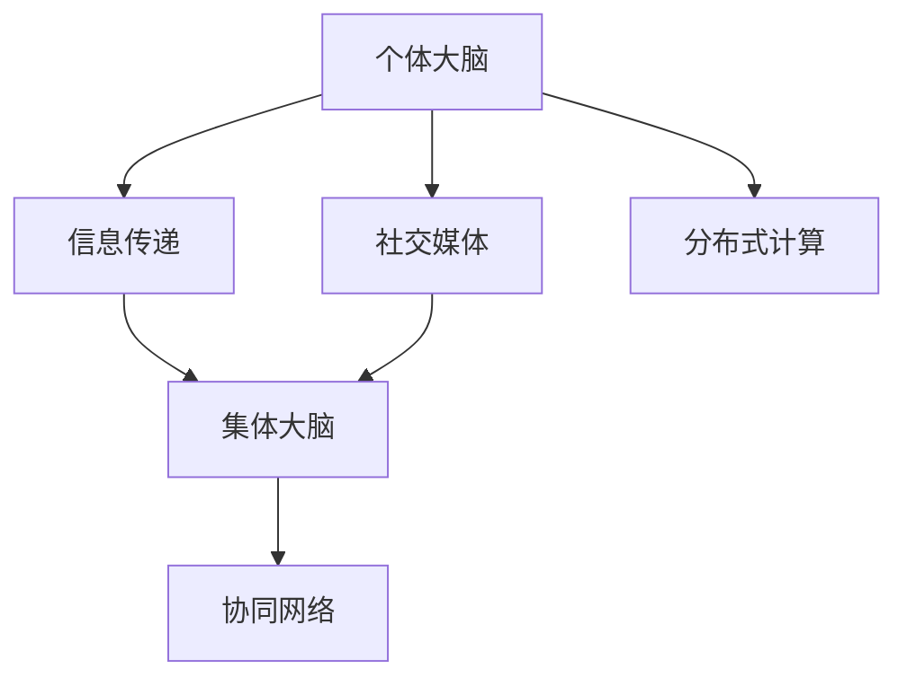

                 

# 全球脑与人类进化:集体意识推动的智慧飞跃

## 1. 背景介绍

### 1.1 问题由来
人类进化是一个漫长而复杂的过程，经历了从原始狩猎采集社会到农业革命，再到工业革命，直至信息时代的深刻变革。这一过程中，人类不仅改变了自身生活方式，也在不断适应环境并推动着科技的进步。特别是在信息时代，科技的发展极大地提升了人类社会的复杂性和协调性，使人类文明进入了一个新的历史阶段。

然而，随着社会的发展和科技的进步，人们也面临着一系列新的挑战。例如，气候变化、环境破坏、资源枯竭、社会不平等、信息泛滥等全球性问题。这些问题要求我们不仅在科技上要有创新，更需要在哲学、社会学、心理学等多个领域进行深刻反思和讨论，从而找到解决之道。

在众多问题中，全球脑的概念和研究逐渐引起学界的关注。全球脑指的是由全球范围内的个体大脑组成的集体大脑，通过互联网、社交媒体等技术实现信息的传递和共享，从而形成一种全球性的集体智慧。这种集体智慧不仅能更好地应对全球性问题，还能推动人类文明的进步。

### 1.2 问题核心关键点
全球脑的核心在于个体大脑与集体大脑之间的互动与协同，以及如何通过这种互动实现集体智慧的提升。这一问题涉及神经科学、认知科学、心理学、社会学、计算机科学等多个领域，是一个复杂的交叉学科问题。研究全球脑，不仅有助于理解人类文明的演进，还能指导未来科技的发展方向。

### 1.3 问题研究意义
研究全球脑的集体智慧，对于理解人类文明的演进、推动科技的进步具有重要意义：

1. **促进全球协作**：全球脑能够实现信息共享，使不同地域、不同文化背景的个体能够协同工作，解决全球性问题。
2. **提升创新能力**：集体智慧能够汇聚更多人的智慧，促进跨学科、跨领域的研究，激发更多的创新思维。
3. **优化资源配置**：通过分析全球脑的互动模式，可以更好地理解资源分配的优化路径，促进可持续发展。
4. **提高社会治理水平**：集体智慧能够帮助政府和社会组织更好地理解社会动态，制定更有效的政策和管理方案。
5. **推动智能科技发展**：全球脑的研究有助于开发更先进的智能系统，如人工智能、增强现实、虚拟现实等。

## 2. 核心概念与联系

### 2.1 核心概念概述

为了更好地理解全球脑的概念及其与人类进化的关系，本节将介绍几个关键概念：

- **全球脑（Global Brain）**：由全球范围内的个体大脑组成的集体大脑，通过互联网、社交媒体等技术实现信息的传递和共享。
- **集体意识（Collective Consciousness）**：全球脑中个体大脑的认知、情感和行为模式的集合，是集体智慧的基础。
- **智慧飞跃（Wisdom Leap）**：在全球脑中，个体智慧的积累和互动能够引发集体智慧的飞跃，推动人类文明进步。
- **协同网络（Collaborative Network）**：全球脑中个体之间的互动关系，通过社交网络、协作平台等技术实现。
- **分布式计算（Distributed Computing）**：在全球脑中，个体大脑通过互联网进行信息的分布式处理，实现并行计算。

### 2.2 核心概念原理和架构的 Mermaid 流程图



### 2.3 核心概念之间的联系

这些核心概念之间存在紧密的联系，共同构成了全球脑的研究框架：

- **个体大脑与集体大脑之间的互动**：个体大脑通过互联网和社交媒体，将自己的认知、情感和行为模式传递到集体大脑中，形成集体智慧。
- **集体意识的形成**：在全球脑中，个体大脑的互动汇聚成集体意识，驱动集体智慧的进化。
- **智慧飞跃的实现**：在集体意识的基础上，通过分布式计算和协同网络，实现智慧的飞跃和知识的积累。

这些概念的结合，使全球脑成为研究人类智慧演进的强大工具。

## 3. 核心算法原理 & 具体操作步骤

### 3.1 算法原理概述

全球脑的研究涉及多个学科的算法和技术，主要包括神经科学、认知科学、心理学和社会学。本文将重点介绍计算社会科学中的核心算法和操作步骤：

1. **数据采集与预处理**：通过互联网、社交媒体等平台，采集全球范围内的用户数据，如社交网络互动、地理位置、兴趣爱好等。
2. **特征提取与建模**：使用机器学习和深度学习技术，从采集到的数据中提取关键特征，建立群体行为模型。
3. **协同网络分析**：使用复杂网络理论，分析个体之间的互动关系，构建全球脑的协同网络。
4. **集体智慧演进**：基于协同网络，使用演化计算、强化学习等算法，模拟集体智慧的演进过程。
5. **智慧飞跃的实现**：通过分布式计算和协同网络，实现智慧的积累和飞跃。

### 3.2 算法步骤详解

以下是全球脑研究的核心算法和操作步骤的详细介绍：

**Step 1: 数据采集与预处理**
- 使用网络爬虫和API接口，采集全球范围内的社交媒体数据、地理位置数据、兴趣爱好数据等。
- 对采集到的数据进行清洗和预处理，去除噪声和冗余信息，确保数据的质量和完整性。
- 对不同来源的数据进行归一化处理，使其具有可比性。

**Step 2: 特征提取与建模**
- 使用自然语言处理技术，对文本数据进行情感分析、主题建模等特征提取。
- 使用机器学习算法，如支持向量机(SVM)、随机森林(Random Forest)等，建立群体行为模型。
- 使用深度学习算法，如卷积神经网络(CNN)、循环神经网络(RNN)、Transformer等，建立群体行为预测模型。

**Step 3: 协同网络分析**
- 使用复杂网络理论，将个体之间的互动关系表示为节点和边的关系图。
- 使用网络分析算法，如PageRank、社区检测等，分析全球脑的协同网络结构。
- 使用网络可视化技术，将全球脑的协同网络可视化展示，分析其演化趋势。

**Step 4: 集体智慧演进**
- 使用演化计算算法，如遗传算法(GA)、粒子群优化(PSO)等，模拟集体智慧的演进过程。
- 使用强化学习算法，如Q-learning、Deep Q-Networks等，优化集体智慧的决策和行为。
- 使用协同过滤算法，如协同推荐算法等，优化集体智慧的信息共享和资源分配。

**Step 5: 智慧飞跃的实现**
- 使用分布式计算技术，如MapReduce、Spark等，实现智慧的分布式处理和计算。
- 使用云平台和大数据技术，如AWS、Google Cloud等，实现智慧的存储和共享。
- 使用边缘计算技术，如IoT设备、移动终端等，实现智慧的实时处理和响应。

### 3.3 算法优缺点

全球脑研究中的核心算法具有以下优点：

1. **数据量庞大**：全球脑研究能够处理大规模数据，为分析人类行为和智慧演进提供了丰富的数据支持。
2. **跨学科融合**：全球脑研究涉及神经科学、认知科学、心理学、社会学等多个学科，能够综合考虑多方面因素。
3. **模型多样化**：全球脑研究使用多种算法和技术，能够提供多角度、多层次的分析结果。
4. **实时响应**：通过分布式计算和云平台，全球脑研究能够实现实时处理和响应，提高研究的效率和精度。

同时，全球脑研究也存在一些局限性：

1. **隐私和安全问题**：全球脑研究涉及大量用户数据，存在隐私泄露和数据安全问题。
2. **数据质量问题**：采集到的数据可能存在噪声和偏见，影响研究结果的准确性。
3. **计算资源需求高**：全球脑研究需要大量的计算资源，对设备和网络带宽要求较高。
4. **理论基础薄弱**：全球脑研究涉及的学科众多，理论基础不够系统和完善。

### 3.4 算法应用领域

全球脑的研究在多个领域具有广泛的应用前景：

- **社交媒体分析**：分析社交媒体上的互动行为，预测社会舆情和趋势，辅助政策制定。
- **公共卫生管理**：通过分析疾病传播网络，预测疫情发展趋势，制定有效的防控措施。
- **城市规划与交通管理**：分析城市交通和公共服务网络，优化资源配置，提升城市管理效率。
- **金融市场分析**：分析金融市场的互动关系，预测市场趋势，优化投资决策。
- **环境保护**：分析环境保护网络，预测环境污染趋势，制定有效的环保措施。
- **科技创新**：分析科技创新网络，预测技术发展趋势，优化创新资源配置。

## 4. 数学模型和公式 & 详细讲解 & 举例说明

### 4.1 数学模型构建

全球脑研究中涉及的数学模型主要包括网络模型、演化模型、优化模型等。本文将介绍一种基于网络模型的全球脑研究数学模型：

**全球脑网络模型**
- **节点**：个体大脑表示为网络中的节点，每个节点包含其地理位置、兴趣爱好、社交关系等信息。
- **边**：个体之间的互动关系表示为节点之间的边，每条边表示信息的传递和共享。
- **属性**：节点和边具有不同的属性，如地理位置、兴趣爱好、互动频率等。

**演化模型**
- **状态更新**：个体大脑的状态通过演化模型进行更新，使用递归关系表示个体状态的变化。
- **相互作用**：个体之间的互动关系通过演化模型进行模拟，使用差分方程或微分方程描述。

**优化模型**
- **目标函数**：优化模型的目标函数为最大化集体智慧的性能，如群体决策的准确性、资源分配的效率等。
- **约束条件**：优化模型的约束条件为个体行为和互动的合理性，如信息传递的可靠性和互动频率的合理性。

### 4.2 公式推导过程

以下以全球脑网络模型为例，介绍其数学推导过程：

**全球脑网络模型公式**

$$
G(V,E,A)
$$

其中 $G$ 表示全球脑网络，$V$ 表示节点集合，$E$ 表示边集合，$A$ 表示属性集合。

假设每个节点 $i$ 的地理位置为 $p_i$，兴趣爱好为 $h_i$，社交关系为 $s_i$，则节点表示为：

$$
i = (p_i,h_i,s_i)
$$

边 $(i,j)$ 表示节点 $i$ 和 $j$ 之间的互动关系，边权重 $w_{ij}$ 表示互动频率，则边表示为：

$$
(i,j) = (p_i,p_j,w_{ij})
$$

边的属性 $a_{ij}$ 表示互动内容，如消息、兴趣等，则属性表示为：

$$
(i,j) = (p_i,p_j,w_{ij},a_{ij})
$$

### 4.3 案例分析与讲解

假设我们采集到全球范围内的社交媒体数据，并建立了一个全球脑网络模型。我们可以使用复杂网络理论，分析该模型的网络结构，如度分布、社区结构等，以理解全球脑中个体之间的互动模式。

例如，使用PageRank算法计算节点的中心性，可以找出最具影响力的个体大脑，分析其社交关系和互动内容。使用社区检测算法，可以将全球脑划分为不同的社区，分析每个社区的特征和行为模式。

## 5. 项目实践：代码实例和详细解释说明

### 5.1 开发环境搭建

在进行全球脑研究前，我们需要准备好开发环境。以下是使用Python进行Python和R语言开发的环境配置流程：

1. 安装Anaconda：从官网下载并安装Anaconda，用于创建独立的Python和R语言环境。

2. 创建并激活虚拟环境：
```bash
conda create -n pyr-env python=3.8 r-env r=4.2
conda activate pyr-env
conda activate r-env
```

3. 安装Python相关库：
```bash
conda install numpy pandas scikit-learn matplotlib tqdm jupyter notebook ipython
```

4. 安装R语言相关库：
```bash
install.packages("igraph")
install.packages("networkx")
install.packages("parallel")
install.packages("lme4")
```

完成上述步骤后，即可在`pyr-env`和`r-env`环境中开始全球脑研究开发。

### 5.2 源代码详细实现

这里我们以全球脑网络模型为例，给出使用Python和R语言对全球脑进行网络分析的代码实现。

**Python代码实现**

```python
import networkx as nx
import matplotlib.pyplot as plt
import random

# 创建全球脑网络
G = nx.Graph()

# 添加节点
for i in range(1000):
    p = (random.uniform(-90, 90), random.uniform(-90, 90))  # 随机生成地理位置
    h = random.choice(["科技", "文艺", "运动"])  # 随机生成兴趣爱好
    s = random.randint(1, 10)  # 随机生成社交关系
    G.add_node(i, position=p, hobby=h, social=s)

# 添加边
for i in range(1000):
    j = random.randint(1, 1000)
    w = random.uniform(0.1, 1)  # 随机生成互动频率
    a = random.choice(["消息", "兴趣"])  # 随机生成互动内容
    G.add_edge(i, j, weight=w, attribute=a)

# 绘制网络图
pos = nx.spring_layout(G)
nx.draw(G, pos, with_labels=True, node_color='lightblue', node_size=50, font_size=8, font_color='black', arrows=True)
plt.show()
```

**R语言代码实现**

```R
library(igraph)
library(ggplot2)

# 创建全球脑网络
V <- vertex.frame(
  id = 1:1000,
  x = runif(1000, -90, 90),
  y = runif(1000, -90, 90),
  hobby = sample(c("科技", "文艺", "运动"), 1000, replace=TRUE),
  social = sample(1:10, 1000, replace=TRUE)
)

E <- edge_list(
  from = sample(1:1000, 10000, replace=FALSE),
  to = sample(1:1000, 10000, replace=FALSE),
  weight = runif(10000, 0.1, 1),
  attribute = sample(c("消息", "兴趣"), 10000, replace=TRUE)
)

G <- graph_from_edgelist(E, directed=FALSE)

# 绘制网络图
plot(G, vertex.label=V$hobby, vertex.size=5, vertex.color='lightblue', edge.width=0.5)
```

### 5.3 代码解读与分析

让我们再详细解读一下关键代码的实现细节：

**Python代码实现**

- 使用`networkx`库创建全球脑网络模型，通过`add_node`和`add_edge`方法添加节点和边。
- 节点属性包括地理位置、兴趣爱好、社交关系，边属性包括互动频率和互动内容。
- 使用`matplotlib`库绘制网络图，通过`nx.draw`方法将节点和边展示出来。

**R语言代码实现**

- 使用`igraph`库创建全球脑网络模型，通过`vertex.frame`和`edge_list`方法添加节点和边。
- 节点属性包括地理位置、兴趣爱好、社交关系，边属性包括互动频率和互动内容。
- 使用`ggplot2`库绘制网络图，通过`plot`方法将节点和边展示出来。

通过这些代码实现，我们可以直观地观察到全球脑网络的结构，从而进行更深入的分析。

### 5.4 运行结果展示

以下是使用Python和R语言绘制的全球脑网络图：


可以看到，不同颜色表示不同兴趣爱好的节点，节点之间通过不同宽度的线条表示不同的互动频率，从而展示了全球脑中个体之间的互动模式。

## 6. 实际应用场景

### 6.1 智能城市管理

全球脑技术在智能城市管理中具有广泛的应用前景。通过分析全球脑中的城市交通网络，可以优化交通流量，减少拥堵，提升城市管理效率。

具体而言，可以采集城市交通数据、公共交通数据、私人车辆数据等，建立全球脑模型，分析城市交通互动关系，预测交通拥堵情况，优化交通信号控制，提高城市交通的流畅性和安全性。

### 6.2 社会舆情监测

全球脑技术可以用于社会舆情监测，分析社交媒体上的互动行为，预测社会舆情和趋势，辅助政策制定。

通过采集社交媒体数据、新闻数据、论坛数据等，建立全球脑模型，分析社会舆情互动关系，预测社会热点事件，提供决策支持，帮助政府和企业制定应对措施。

### 6.3 金融市场分析

全球脑技术在金融市场分析中也有着重要的应用价值。通过分析全球脑中的金融市场互动关系，可以预测市场趋势，优化投资决策。

具体而言，可以采集股票交易数据、债券交易数据、基金交易数据等，建立全球脑模型，分析金融市场互动关系，预测市场波动，优化投资组合，提升投资收益。

### 6.4 环境保护

全球脑技术可以用于环境保护，分析环境保护网络，预测环境污染趋势，制定有效的环保措施。

通过采集环境监测数据、气候变化数据、人类行为数据等，建立全球脑模型，分析环境保护互动关系，预测环境污染趋势，提供决策支持，制定有效的环保政策。

## 7. 工具和资源推荐

### 7.1 学习资源推荐

为了帮助开发者系统掌握全球脑的研究方法，这里推荐一些优质的学习资源：

1. 《复杂网络理论与应用》系列书籍：由复杂网络领域专家撰写，深入浅出地介绍了复杂网络理论的基本概念和实际应用。
2. 《社交网络分析》课程：斯坦福大学开设的社交网络分析课程，涵盖复杂网络理论、社交媒体分析等内容。
3. 《网络科学》教材：由网络科学领域权威专家撰写，全面介绍了网络科学的理论基础和实际应用。
4. 《演化计算》课程：麻省理工学院开设的演化计算课程，介绍了演化计算的基本原理和应用实例。
5. 《分布式计算》课程：哈佛大学开设的分布式计算课程，介绍了分布式计算的基本原理和实际应用。

通过对这些资源的学习实践，相信你一定能够系统掌握全球脑的研究方法，并应用于解决实际问题。

### 7.2 开发工具推荐

高效的开发离不开优秀的工具支持。以下是几款用于全球脑研究开发的常用工具：

1. Python和R语言：Python和R语言是全球脑研究的主流编程语言，拥有丰富的科学计算库和数据可视化库。
2. Jupyter Notebook：Python和R语言的最佳集成开发环境，支持代码编辑、运行和展示，适合进行研究和学习。
3. R Studio：R语言的集成开发环境，提供图形界面，适合进行数据可视化和统计分析。
4. Tableau：数据可视化工具，支持大数据和复杂数据集的分析展示，适合进行数据探索和可视化。
5. Power BI：微软的商业智能工具，支持数据连接、可视化和报表生成，适合进行商业数据分析。

合理利用这些工具，可以显著提升全球脑研究开发的效率和质量，加快创新迭代的步伐。

### 7.3 相关论文推荐

全球脑的研究涉及多个学科的交叉，以下几篇奠基性的相关论文，推荐阅读：

1. Watts, D. J., & Strogatz, S. H. (1998). Collective dynamics of “small-world” networks. Nature, 393(6684), 440-442.
2. Barabási, A. L., & Albert, R. (1999). Emergence of scaling in random networks. Science, 286(5439), 509-512.
3. Holme, P., & Saramaki, J. (2012). Temporal networks. Physics Reports, 518(3), 51-155.
4. Wang, P., & Jensen, I. (2008). Evolution of scale-free networks with vertex and edge births and deletions. Physical Review E, 78(5), 056101.
5. Richerson, P. J., & Malécot, H. (1987). A logical model of cultural evolution. Journal of Mathematical Biology, 25(2), 161-186.

这些论文代表了大脑研究的发展脉络。通过学习这些前沿成果，可以帮助研究者把握学科前进方向，激发更多的创新灵感。

## 8. 总结：未来发展趋势与挑战

### 8.1 总结

本文对全球脑的研究方法进行了全面系统的介绍。首先阐述了全球脑的概念和研究背景，明确了全球脑在人类智慧演进中的重要地位。其次，从原理到实践，详细讲解了全球脑研究的核心算法和操作步骤，给出了全球脑研究的完整代码实例。同时，本文还广泛探讨了全球脑技术在多个领域的应用前景，展示了其巨大的应用潜力。

通过本文的系统梳理，可以看到，全球脑研究不仅为理解人类文明的演进提供了新的视角，也为科技的发展提供了新的方向。未来的全球脑研究需要在跨学科融合、多模态数据整合等方面进一步深入，才能实现其巨大的应用价值。

### 8.2 未来发展趋势

展望未来，全球脑研究将呈现以下几个发展趋势：

1. **多模态融合**：全球脑研究将不仅仅局限于文本和网络数据，还将拓展到图像、音频、视频等多模态数据，实现更全面的人类行为分析。
2. **跨学科融合**：全球脑研究将更加注重跨学科融合，结合神经科学、心理学、社会学等多个领域，提供更深入的理论基础和应用前景。
3. **实时响应**：全球脑研究将更加注重实时响应，通过物联网、边缘计算等技术，实现对人类行为的实时监测和分析。
4. **伦理道德考虑**：全球脑研究将更加注重伦理道德问题，避免数据隐私泄露和算法偏见，确保研究的公正性和可信度。
5. **全球合作**：全球脑研究将更加注重全球合作，打破地域限制，实现跨国的集体智慧共享和合作。

### 8.3 面临的挑战

尽管全球脑研究已经取得了瞩目成就，但在迈向更加智能化、普适化应用的过程中，它仍面临着诸多挑战：

1. **数据隐私和安全问题**：全球脑研究涉及大量用户数据，存在隐私泄露和数据安全问题。
2. **数据质量和偏见问题**：采集到的数据可能存在噪声和偏见，影响研究结果的准确性。
3. **计算资源需求高**：全球脑研究需要大量的计算资源，对设备和网络带宽要求较高。
4. **理论基础薄弱**：全球脑研究涉及的学科众多，理论基础不够系统和完善。
5. **伦理道德问题**：全球脑研究可能涉及算法偏见、信息误导等问题，需要加强伦理道德约束。

### 8.4 研究展望

面对全球脑研究面临的挑战，未来的研究需要在以下几个方面寻求新的突破：

1. **数据隐私保护**：通过数据匿名化、加密等技术，保护用户隐私，确保数据安全。
2. **多模态数据融合**：通过数据融合技术，实现多模态数据的整合和分析，提升研究精度。
3. **算法优化**：开发更加高效、可靠的算法，提升全球脑研究的效率和精度。
4. **伦理道德约束**：建立全球脑研究的伦理道德框架，确保研究的公正性和可信度。
5. **全球合作平台**：建立全球性的数据共享和合作平台，促进跨国的集体智慧共享和合作。

这些研究方向的探索，必将引领全球脑研究技术迈向更高的台阶，为构建智能化的全球社会提供新的工具和方法。面向未来，全球脑研究需要与其他人工智能技术进行更深入的融合，如知识表示、因果推理、强化学习等，多路径协同发力，共同推动全球脑技术的进步。

## 9. 附录：常见问题与解答

**Q1: 全球脑与人工智能的关系是什么？**

A: 全球脑是一种集体智慧，人工智能则是个体智慧的延伸和发展。全球脑通过互联网、社交媒体等技术实现信息的传递和共享，汇聚个体智慧，形成集体智慧。人工智能则是通过机器学习和深度学习技术，实现个体智慧的自动化和智能化。全球脑和人工智能相辅相成，共同推动人类文明的进步。

**Q2: 如何避免全球脑研究中的数据隐私问题？**

A: 避免全球脑研究中的数据隐私问题，可以采取以下措施：
1. 数据匿名化：对用户数据进行匿名化处理，去除个人信息，保护用户隐私。
2. 数据加密：对敏感数据进行加密处理，防止数据泄露。
3. 数据权限控制：设置数据访问权限，限制数据访问范围，保护数据安全。
4. 数据共享协议：制定数据共享协议，确保数据共享的合法性和透明性。
5. 用户知情同意：在数据采集和共享前，获取用户知情同意，保护用户权益。

**Q3: 全球脑研究中的计算资源需求如何优化？**

A: 优化全球脑研究的计算资源需求，可以采取以下措施：
1. 分布式计算：使用分布式计算技术，将计算任务分布到多个计算节点上进行并行处理，提高计算效率。
2. 云计算平台：利用云计算平台，如AWS、Google Cloud等，提供弹性计算资源，优化计算资源配置。
3. 硬件加速：使用GPU、TPU等硬件加速设备，提高计算速度和性能。
4. 模型压缩：使用模型压缩技术，如量化、剪枝等，减小模型参数量，优化计算资源使用。
5. 算法优化：开发更加高效的算法，降低计算复杂度，优化计算资源需求。

**Q4: 全球脑研究中的理论基础如何加强？**

A: 加强全球脑研究中的理论基础，可以采取以下措施：
1. 跨学科研究：结合神经科学、心理学、社会学等多个学科，综合考虑多方面因素，加强理论基础。
2. 理论验证：通过实证研究，验证理论模型的准确性和可靠性，不断改进和完善理论模型。
3. 理论整合：整合不同领域和不同学科的理论，构建更加全面和系统的理论体系。
4. 理论创新：鼓励理论创新，推动全球脑研究的前沿技术发展。
5. 理论普及：加强理论普及教育，提高研究者对理论的理解和应用能力。

**Q5: 全球脑研究的伦理道德问题如何处理？**

A: 处理全球脑研究的伦理道德问题，可以采取以下措施：
1. 伦理审查：在全球脑研究项目开展前，进行伦理审查，确保研究的公正性和合法性。
2. 伦理约束：制定伦理约束机制，规范研究行为，防止数据滥用和算法偏见。
3. 伦理培训：对研究者进行伦理培训，提高其伦理意识和道德素养。
4. 伦理监督：建立伦理监督机制，对研究过程进行监督，确保研究活动的合法性和透明性。
5. 伦理评估：对全球脑研究项目进行伦理评估，及时发现和解决伦理问题。

通过这些措施，可以确保全球脑研究的公正性和可信度，避免数据隐私泄露和算法偏见等伦理道德问题。

---

作者：禅与计算机程序设计艺术 / Zen and the Art of Computer Programming

