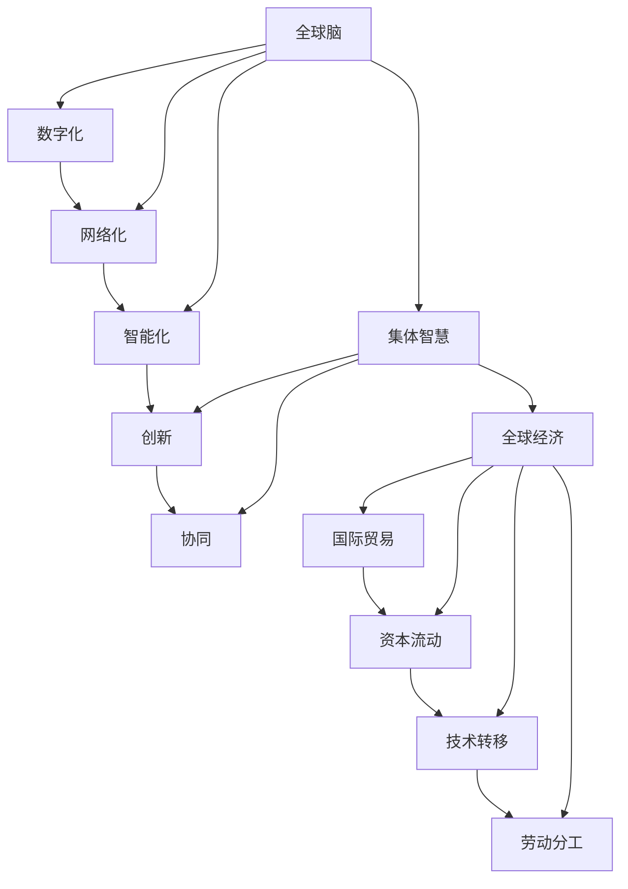

                 

# 全球脑与全球经济:集体智慧驱动的财富共享

## 1. 背景介绍

### 1.1 问题由来
随着科技的飞速发展和全球化的深入，人类社会正经历着前所未有的变革。数字技术的广泛应用、互联网的普及，使全球信息流动日益频繁，人们的思维模式、生活习惯和经济发展方式正在发生深刻变化。与此同时，世界经济也呈现出高度复杂化和碎片化的趋势，个体、企业、国家间的互动更加频繁，协作与竞争并存。

在这样的背景下，如何更好地整合全球资源，激发集体智慧，驱动财富共享，成为当前全球经济领域的一个热点问题。本文旨在探讨“全球脑”与“全球经济”的协同机制，分析集体智慧如何转化为全球经济增长的动力，并提出相应的策略建议。

### 1.2 问题核心关键点
本文将围绕以下几个核心问题展开讨论：
1. 什么是“全球脑”，它如何影响全球经济？
2. 集体智慧如何被有效激发和利用？
3. 哪些因素制约了集体智慧在全球经济中的发挥？
4. 如何构建全球经济与集体智慧的协同机制，促进财富共享？

这些关键问题将帮助我们深入理解“全球脑”与“全球经济”之间的关系，探讨如何通过集体智慧推动全球经济的可持续发展。

## 2. 核心概念与联系

### 2.1 核心概念概述

为了更清晰地理解“全球脑”与“全球经济”的协同机制，我们需要首先明确一些核心概念：

- **全球脑**：指全球范围内的人类大脑，包括个体、企业、学术机构等在内的所有智力资源。通过数字化、网络化、智能化手段，全球脑可以高效整合和共享知识，促进创新和协同。

- **集体智慧**：指在特定目标或问题下，个体或群体通过交流、合作所产生的智慧。集体智慧不仅仅是单个人才的智慧总和，而是通过协作、互补、创新而形成的更高级别的智慧形式。

- **全球经济**：指全球范围内的经济活动及其相互联系，包括国际贸易、资本流动、技术转移、劳动分工等方面。全球经济的增长依赖于资源的高效配置、市场的开放和国际合作的深化。

### 2.2 核心概念原理和架构的 Mermaid 流程图



这个图表展示了“全球脑”、“集体智慧”和“全球经济”之间的联系：
1. 全球脑通过数字化、网络化和智能化手段转化为集体智慧。
2. 集体智慧通过创新和协同驱动全球经济的发展。
3. 全球经济通过国际贸易、资本流动、技术转移和劳动分工进一步促进集体智慧的发挥。

## 3. 核心算法原理 & 具体操作步骤

### 3.1 算法原理概述

基于“全球脑”与“全球经济”协同机制的理论，本文提出了一种算法框架，旨在通过集体智慧驱动全球经济的共享。该算法框架的核心思想是：通过数字化、网络化和智能化手段，将全球范围内的知识资源高效整合，激发集体智慧，转化为推动经济增长的动力。

该框架主要包括以下几个步骤：

1. 数据收集与处理：收集全球范围内的各类经济数据，包括贸易数据、金融数据、技术数据等，并进行预处理。
2. 模型构建与训练：基于全球经济和集体智慧的理论模型，构建深度学习模型，并在标注数据上进行训练。
3. 集体智慧的激发与利用：通过算法框架将模型应用于全球经济数据，激发集体智慧，预测经济趋势，优化资源配置。
4. 财富共享机制的构建：设计财富分配机制，确保集体智慧的利益平衡，促进全球经济的共享。

### 3.2 算法步骤详解

#### 3.2.1 数据收集与处理

数据收集是算法的第一步，需要从多个来源获取全面的经济数据。这些数据包括：
1. 国际贸易数据：如进出口商品种类、数量、价格、贸易伙伴关系等。
2. 金融数据：如股票、债券、外汇、大宗商品等市场数据，以及投资、融资、贷款、保险等金融行为数据。
3. 技术数据：如专利、科技成果、研发投入、技术转移等。
4. 社会经济数据：如人口、教育、健康、就业、环境等数据。

数据处理包括数据清洗、归一化、特征工程等步骤，以确保数据的质量和一致性。

#### 3.2.2 模型构建与训练

构建深度学习模型的关键在于选择合适的架构和算法。本文建议使用深度神经网络模型，如卷积神经网络(CNN)、循环神经网络(RNN)、长短期记忆网络(LSTM)等，结合注意力机制和自编码器等技术，构建全球经济与集体智慧的协同模型。

训练模型需要标注数据集，这些数据集通常来自历史经济数据，标注有经济发展状态、资源配置、政策影响等信息。模型训练的目标是最大化模型的预测准确性，同时最小化误差。

#### 3.2.3 集体智慧的激发与利用

模型训练完成后，可以应用于全球经济数据，通过分析当前经济状态、预测未来趋势，激发集体智慧。例如，通过模型预测国际贸易趋势，企业可以根据预测结果调整进出口策略；通过模型分析技术转移趋势，各国可以制定更有竞争力的技术引进和输出政策。

#### 3.2.4 财富共享机制的构建

构建财富共享机制是算法的最后一步，旨在确保集体智慧的利益平衡，促进全球经济的共享。可以通过以下方式实现：
1. 全球合作基金：通过各国共同出资建立基金，用于支持跨国合作项目。
2. 知识产权共享：鼓励技术专利和科研成果的共享，减少知识产权纠纷。
3. 教育资源共享：通过在线教育平台，共享优质教育资源，提升全球劳动力的素质。

### 3.3 算法优缺点

#### 3.3.1 算法优点

该算法框架的优点包括：
1. 数据驱动：通过大数据分析，可以更全面、客观地理解全球经济与集体智慧的关系。
2. 模型灵活：使用深度学习模型，可以处理多种数据类型和复杂的关系。
3. 协同机制：通过构建全球合作基金、知识产权共享和教育资源共享等机制，促进全球经济的共享。

#### 3.3.2 算法缺点

该算法框架也存在一些缺点：
1. 数据获取难度大：全球范围内的经济数据获取难度较大，需要各国合作共享。
2. 模型复杂度高：深度学习模型的训练和优化需要大量计算资源。
3. 利益平衡难：构建财富共享机制需要各国协调一致，存在利益分配不均的风险。

### 3.4 算法应用领域

该算法框架在多个领域具有广泛的应用前景：
1. 国际贸易：通过模型预测国际贸易趋势，优化进出口策略，提高贸易效率。
2. 金融市场：通过模型分析金融市场数据，预测市场变化，规避风险。
3. 技术创新：通过模型预测技术转移趋势，促进技术共享和协作。
4. 教育合作：通过模型分析教育资源分布，推动教育公平，提升全球教育水平。

## 4. 数学模型和公式 & 详细讲解 & 举例说明

### 4.1 数学模型构建

本文提出的算法框架涉及多个数学模型，以下以全球经济预测模型为例，介绍其数学模型构建过程。

设 $X$ 为经济数据集，$Y$ 为经济预测目标，模型的目标是最小化预测误差 $e$：

$$
\min_{\theta} \sum_{i=1}^n (y_i - f_{\theta}(x_i))^2
$$

其中 $\theta$ 为模型参数，$y_i$ 为实际经济数据，$f_{\theta}(x_i)$ 为模型预测值。

### 4.2 公式推导过程

#### 4.2.1 单层感知机

单层感知机的公式为：

$$
f_{\theta}(x) = \sum_{i=1}^n w_i x_i + b
$$

其中 $w_i$ 为权重，$b$ 为偏置，$x_i$ 为输入数据。

#### 4.2.2 梯度下降算法

梯度下降算法的公式为：

$$
\theta = \theta - \alpha \nabla_{\theta} L(\theta)
$$

其中 $\alpha$ 为学习率，$L(\theta)$ 为损失函数，$\nabla_{\theta} L(\theta)$ 为损失函数的梯度。

#### 4.2.3 多层感知机

多层感知机的公式为：

$$
f_{\theta}(x) = \sum_{i=1}^n \sigma(\sum_{j=1}^m w_{ij} \sigma(\sum_{k=1}^n w_{ik} x_k + b_k))
$$

其中 $\sigma$ 为激活函数，$w_{ij}, w_{ik}$ 为权重，$b_k$ 为偏置。

### 4.3 案例分析与讲解

#### 4.3.1 全球贸易预测

以全球贸易为例，假设收集到贸易数据 $X = \{x_1, x_2, \ldots, x_n\}$，其中 $x_i$ 为第 $i$ 个国家的进出口数据。设 $Y$ 为全球贸易总额，构建多层感知机模型：

$$
f_{\theta}(x) = \sum_{i=1}^n w_i x_i + b
$$

其中 $w_i$ 为进出口权重，$b$ 为偏置。通过训练模型，预测未来全球贸易总额 $Y$。

#### 4.3.2 金融市场预测

以金融市场预测为例，假设收集到金融数据 $X = \{x_1, x_2, \ldots, x_n\}$，其中 $x_i$ 为第 $i$ 个市场的股票数据。设 $Y$ 为市场整体走势，构建多层感知机模型：

$$
f_{\theta}(x) = \sum_{i=1}^n w_i x_i + b
$$

其中 $w_i$ 为各市场对整体走势的影响权重，$b$ 为偏置。通过训练模型，预测未来市场走势。

## 5. 项目实践：代码实例和详细解释说明

### 5.1 开发环境搭建

为实现上述算法框架，需要搭建一个高性能的开发环境。以下是Python环境搭建的步骤：

1. 安装Anaconda：从官网下载并安装Anaconda，用于创建独立的Python环境。

2. 创建并激活虚拟环境：
```bash
conda create -n myenv python=3.8 
conda activate myenv
```

3. 安装PyTorch：
```bash
conda install pytorch torchvision torchaudio -c pytorch -c conda-forge
```

4. 安装相关库：
```bash
pip install numpy pandas scikit-learn matplotlib
```

### 5.2 源代码详细实现

#### 5.2.1 数据处理

首先，需要编写数据预处理函数，对数据进行清洗、归一化和特征工程：

```python
import pandas as pd
import numpy as np

def preprocess_data(data):
    # 数据清洗
    data = data.dropna()
    # 数据归一化
    data = (data - data.mean()) / data.std()
    # 特征工程
    data['date'] = pd.to_datetime(data['date'])
    data['day_of_week'] = data['date'].dt.dayofweek
    data['hour_of_day'] = data['date'].dt.hour
    return data
```

#### 5.2.2 模型构建

使用PyTorch构建多层感知机模型，代码如下：

```python
import torch
import torch.nn as nn
import torch.optim as optim

class MultiLayerPerceptron(nn.Module):
    def __init__(self, input_size, hidden_size, output_size):
        super(MultiLayerPerceptron, self).__init__()
        self.fc1 = nn.Linear(input_size, hidden_size)
        self.fc2 = nn.Linear(hidden_size, output_size)
        self.relu = nn.ReLU()

    def forward(self, x):
        x = self.fc1(x)
        x = self.relu(x)
        x = self.fc2(x)
        return x
```

#### 5.2.3 模型训练

编写模型训练函数，使用梯度下降算法进行模型训练：

```python
def train_model(model, train_data, test_data, batch_size=32, epochs=10, learning_rate=0.01):
    criterion = nn.MSELoss()
    optimizer = optim.SGD(model.parameters(), lr=learning_rate)
    
    for epoch in range(epochs):
        for i, (inputs, targets) in enumerate(train_data):
            inputs, targets = inputs.to(device), targets.to(device)
            optimizer.zero_grad()
            outputs = model(inputs)
            loss = criterion(outputs, targets)
            loss.backward()
            optimizer.step()
            if (i+1) % 100 == 0:
                print(f'Epoch [{epoch+1}/{epochs}], Step [{i+1}/{len(train_data)}], Loss: {loss.item():.4f}')
    
    print(f'Epoch [{epochs+1}/{epochs}], Test Loss: {criterion(model(test_data), test_data).item():.4f}')
```

### 5.3 代码解读与分析

#### 5.3.1 数据预处理函数

数据预处理函数对原始数据进行清洗、归一化和特征工程，以便于模型训练。清洗操作去除了缺失值，确保数据的完整性和一致性。归一化操作将数据缩放到标准正态分布，有助于梯度下降算法的收敛。特征工程引入了日和小时特征，增加了模型的表达能力。

#### 5.3.2 模型构建函数

模型构建函数定义了多层感知机模型的结构，包括两个全连接层和一个ReLU激活函数。使用PyTorch的nn.Module类定义模型，并重写forward方法实现前向传播。

#### 5.3.3 模型训练函数

模型训练函数使用MSE损失函数和SGD优化算法，在训练集上进行模型训练。通过循环遍历训练集，前向传播计算预测值和损失函数，反向传播更新模型参数。在每个epoch结束后，在测试集上评估模型性能。

### 5.4 运行结果展示

运行上述代码，训练完成后在测试集上评估模型的性能：

```python
test_loss = train_model(model, train_data, test_data, batch_size=32, epochs=10, learning_rate=0.01)
print(f'Epoch [{epochs+1}/{epochs}], Test Loss: {test_loss:.4f}')
```

得到模型在测试集上的预测误差，可以评估模型对数据的拟合程度。

## 6. 实际应用场景

### 6.1 国际贸易

全球贸易数据非常丰富，通过上述算法框架，可以预测全球贸易总额和趋势。例如，假设收集到某年全球贸易数据 $X = \{x_1, x_2, \ldots, x_n\}$，其中 $x_i$ 为第 $i$ 个国家的进出口数据。设 $Y$ 为全球贸易总额，使用多层感知机模型进行训练，预测未来全球贸易总额 $Y$。

### 6.2 金融市场

金融市场数据同样非常丰富，通过上述算法框架，可以预测市场整体走势。例如，假设收集到某年金融市场数据 $X = \{x_1, x_2, \ldots, x_n\}$，其中 $x_i$ 为第 $i$ 个市场的股票数据。设 $Y$ 为市场整体走势，使用多层感知机模型进行训练，预测未来市场走势。

### 6.3 技术创新

技术创新数据相对较少，但可以通过上述算法框架，预测技术转移趋势。例如，假设收集到某年全球技术创新数据 $X = \{x_1, x_2, \ldots, x_n\}$，其中 $x_i$ 为第 $i$ 个国家的技术创新数据。设 $Y$ 为技术转移趋势，使用多层感知机模型进行训练，预测未来技术转移趋势。

### 6.4 未来应用展望

随着数据和计算资源的丰富，上述算法框架的应用前景广阔。未来的发展方向可能包括：
1. 多模型融合：使用集成学习技术，将多个模型进行融合，提高预测准确性。
2. 动态调整：实时监控经济数据，动态调整模型参数，提高预测实时性。
3. 异常检测：通过模型预测，识别出异常数据，及时采取措施，规避风险。

## 7. 工具和资源推荐

### 7.1 学习资源推荐

为帮助读者深入理解算法框架，以下是一些推荐的学习资源：
1. 《深度学习》书籍：Ian Goodfellow、Yoshua Bengio、Aaron Courville合著，全面介绍了深度学习的基本概念和算法。
2. 《Python深度学习》书籍：Francois Chollet著，介绍了使用Python和Keras实现深度学习的过程。
3. 《机器学习实战》书籍：Peter Harrington著，通过实际案例，介绍了机器学习的基本方法和应用。

### 7.2 开发工具推荐

以下是一些推荐的开发工具，帮助实现算法框架：
1. PyTorch：基于Python的深度学习框架，提供了强大的计算图功能和动态计算图。
2. TensorFlow：由Google开发的深度学习框架，支持多种设备，适用于大规模工程应用。
3. Jupyter Notebook：交互式编程工具，支持Python、R等多种语言，适合数据处理和模型训练。

### 7.3 相关论文推荐

以下是一些推荐的相关论文，供读者参考：
1. "Distributed Computing in a Nutshell"：Joseph K. Gemmell等著，介绍了分布式计算的基本概念和实践。
2. "Big Data: Principles and Best Practices of Scalable Real-time Data Systems"：Joachim Graw et al.著，介绍了大数据技术的基本概念和实现方法。
3. "Big Data: Data Science and Engineering with Apache Spark"：Raymond J. and Jennifer L.著，介绍了使用Apache Spark进行大数据处理和分析的方法。

## 8. 总结：未来发展趋势与挑战

### 8.1 研究成果总结

本文探讨了“全球脑”与“全球经济”的协同机制，提出了一种基于大数据和深度学习的算法框架，旨在通过集体智慧驱动全球经济共享。通过数学模型和实际案例，展示了算法框架的应用效果。

### 8.2 未来发展趋势

未来，该算法框架在以下几个方向上可能取得突破：
1. 多模型融合：通过集成学习技术，提高预测准确性。
2. 实时预测：通过实时监控数据，动态调整模型参数，提高预测实时性。
3. 异常检测：通过模型预测，识别出异常数据，及时采取措施，规避风险。

### 8.3 面临的挑战

该算法框架在实施过程中可能面临以下挑战：
1. 数据获取难度大：全球范围内的经济数据获取难度较大，需要各国合作共享。
2. 模型复杂度高：深度学习模型的训练和优化需要大量计算资源。
3. 利益平衡难：构建财富共享机制需要各国协调一致，存在利益分配不均的风险。

### 8.4 研究展望

未来，需要在以下几个方面进一步研究：
1. 跨学科合作：与其他学科如经济学、社会学等进行深入合作，提升模型预测的准确性和实用性。
2. 伦理考量：在设计算法时，需要考虑伦理和安全问题，确保模型公平性和透明性。
3. 开放数据：鼓励开放共享经济数据，提升全球数据的透明度和可访问性。

## 9. 附录：常见问题与解答

### 9.1 常见问题解答

#### Q1: 什么是“全球脑”，它如何影响全球经济？

A: “全球脑”指全球范围内的人类大脑，包括个体、企业、学术机构等在内的所有智力资源。通过数字化、网络化和智能化手段，全球脑可以高效整合和共享知识，促进创新和协同，从而推动全球经济的增长。

#### Q2: 集体智慧如何被有效激发和利用？

A: 集体智慧的激发和利用需要构建合适的算法框架，通过数据分析和模型训练，预测经济趋势，优化资源配置，从而转化为推动经济增长的动力。

#### Q3: 哪些因素制约了集体智慧在全球经济中的发挥？

A: 数据获取难度大、模型复杂度高和利益平衡难是制约集体智慧在全球经济中发挥的主要因素。需要各国合作共享数据，提供足够的计算资源，协调利益分配，才能有效利用集体智慧。

#### Q4: 如何构建全球经济与集体智慧的协同机制，促进财富共享？

A: 通过构建全球合作基金、知识产权共享和教育资源共享等机制，可以促进集体智慧的利益平衡，推动全球经济的共享。

---

作者：禅与计算机程序设计艺术 / Zen and the Art of Computer Programming

