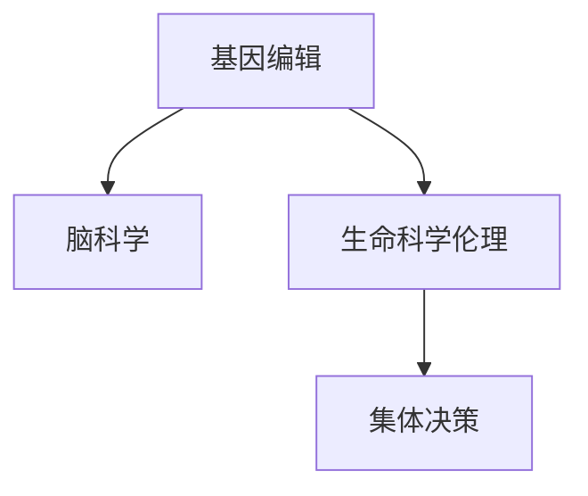

                 

# 全球脑与基因编辑:集体决策下的生命科学伦理

> 关键词：脑科学,基因编辑,生命科学伦理,集体决策,人类基因组编辑

## 1. 背景介绍

### 1.1 问题由来
随着生命科学技术的迅猛发展，人类已经进入了一个前所未有的时代——通过脑科学和基因编辑技术，我们能够以前所未有的方式操控和理解大脑与基因。这一进展不仅为医学带来了新的希望，也为伦理学家提出了诸多新的挑战。

在过去几十年里，基因编辑技术如CRISPR-Cas9的问世，使科学家能够更精准地修改基因序列，治疗遗传疾病，甚至改善人类智力。脑科学的发展同样迅速，通过脑成像和脑刺激技术，我们能够观察到大脑中的神经活动，甚至在一定程度上影响大脑功能。这些技术的进步不仅开辟了新的治疗途径，也引发了一系列伦理、社会、法律问题。

当前，如何在一个全球化的背景下，合理地应用这些新兴技术，平衡科学进步与伦理考量，成为科学家、政策制定者、伦理学家、社会学家和公众共同关心的重要议题。本文将深入探讨全球脑与基因编辑技术在集体决策下的伦理问题，为这一复杂而前沿的议题提供一些有价值的思考。

### 1.2 问题核心关键点
脑与基因编辑技术的伦理问题主要集中在以下几个方面：

- **基因编辑的安全性与效果**：基因编辑是否可能产生不可预见的副作用，如何确保其安全性与有效性？
- **公平性与可及性**：基因编辑技术带来的医疗资源的分配问题，如何在全球范围内实现公平共享？
- **隐私与数据保护**：在基因编辑中如何保护个人隐私，避免数据滥用？
- **伦理审查与监管**：如何建立科学、有效的监管机制，确保技术应用的伦理合规？
- **社会与文化影响**：基因编辑技术对社会价值观、文化传统的影响，如何应对可能出现的社会反弹？

这些问题不仅牵涉到科技伦理，还关系到全球公共政策、法律制度和社会结构，需要多方合作与集体决策才能有效解决。本文将详细探讨这些问题，并提出一些可能的解决路径。

## 2. 核心概念与联系

### 2.1 核心概念概述

为更好地理解全球脑与基因编辑伦理问题的复杂性，本节将介绍几个密切相关的核心概念：

- **基因编辑(Gene Editing)**：通过CRISPR-Cas9等技术对生物基因进行精确修改。
- **脑科学(Brain Science)**：研究大脑结构和功能，包括神经网络、神经传导、脑成像等。
- **生命科学伦理(Life Science Ethics)**：探讨生命科技中的道德、法律和社会问题。
- **集体决策(Collective Decision Making)**：涉及多方利益相关者共同参与的决策过程，旨在实现公共利益的最大化。

这些核心概念之间的逻辑关系可以通过以下Mermaid流程图来展示：



这个流程图展示了大规模基因编辑和脑科学在生命科学伦理和集体决策中的核心作用，及其对全球社会的影响。

## 3. 核心算法原理 & 具体操作步骤
### 3.1 算法原理概述

脑与基因编辑的伦理问题涉及复杂的跨学科分析，但基本可以归纳为两个关键层面：技术层面和伦理层面。

**技术层面**：基因编辑技术的安全性与有效性是基础，需要通过实验验证和监管确保。脑科学的研究需要跨学科合作，整合神经科学、心理学、医学等多领域知识。

**伦理层面**：公平性、隐私、伦理审查等是伦理问题的核心，需要通过集体决策机制来平衡各方利益。

### 3.2 算法步骤详解

#### 技术层面
1. **实验验证**：在动物模型上验证基因编辑的安全性与效果，确保技术无明显副作用。
2. **临床试验**：在人体上进行小规模临床试验，收集数据进行长期监测。
3. **数据积累与分析**：收集和分析临床试验数据，评估技术的长期效果和安全性。
4. **监管审查**：提交技术应用方案给监管机构审查，确保符合伦理和法律要求。

#### 伦理层面
1. **利益相关者参与**：邀请科学家、医生、伦理学家、法律专家、患者代表等参与集体决策。
2. **公开透明**：保证决策过程和数据公开透明，接受公众监督。
3. **多层次评估**：通过伦理审查、社会影响评估等机制，全面评估技术应用的伦理影响。
4. **动态更新**：根据新数据和新情况，动态更新伦理审查机制，确保决策的时效性和公正性。

### 3.3 算法优缺点

脑与基因编辑的伦理问题探讨涉及多个方面，各有优缺点：

**优点**：
- **科学验证**：技术层面的实验验证和临床试验，能够提供科学依据，减少伦理判断的主观性。
- **多方参与**：集体决策机制可以汇集各方智慧，平衡不同利益，确保决策的全面性和公正性。

**缺点**：
- **数据局限**：实验和临床数据可能存在样本量不足、数据偏差等问题，影响决策的科学性。
- **伦理复杂性**：涉及多领域知识，伦理问题的讨论可能复杂、耗时。
- **社会影响**：集体决策过程可能引发社会反弹，影响政策实施。

### 3.4 算法应用领域

脑与基因编辑技术在以下领域有着广泛的应用前景：

- **医学**：基因编辑治疗遗传疾病、癌症等重大疾病。
- **农业**：通过基因编辑改良作物，提高产量和抗病虫害能力。
- **生物研究**：揭示基因与大脑功能的深层联系，推动基础研究。
- **教育**：通过基因编辑改善智力，提升教育公平。
- **法律**：制定相关法律法规，规范基因编辑应用。
- **社会政策**：评估基因编辑对社会的影响，制定相应政策。

这些领域的应用将极大地影响人类社会的发展，需要跨学科合作和集体决策来确保技术的合理应用。

## 4. 数学模型和公式 & 详细讲解 & 举例说明

### 4.1 数学模型构建

在大规模脑与基因编辑的伦理问题讨论中，我们可以使用数学模型来量化和分析各方利益和影响。假设某基因编辑技术的应用涉及n个利益相关者，其利益可量化为函数$F_i$，i=1...n。

### 4.2 公式推导过程

在确定各利益相关者的利益函数后，可以构建集体决策的优化模型：

$$
\min_{\theta} \sum_{i=1}^n w_i \cdot F_i(\theta)
$$

其中$w_i$为第i个利益相关者的权重，反映其在决策中的影响力。模型目标是最小化所有利益相关者的总损失，即所有利益的调和平均。

### 4.3 案例分析与讲解

以基因编辑治疗遗传病为例，构建集体决策模型。假设治疗费用为$F_1$，疗效为$F_2$，社会接受度为$F_3$，医疗资源分配为$F_4$。不同利益相关者的权重可能不同，如患者权重最高，科研机构权重适中，政府和社会组织权重较低。

通过求解上述优化模型，可以得到一个最优的基因编辑方案，平衡各方的利益，同时确保技术的伦理合规。

## 5. 项目实践：代码实例和详细解释说明

### 5.1 开发环境搭建

在进行脑与基因编辑伦理问题的项目实践前，我们需要准备好开发环境。以下是使用Python进行项目的开发环境配置流程：

1. 安装Anaconda：从官网下载并安装Anaconda，用于创建独立的Python环境。

2. 创建并激活虚拟环境：
```bash
conda create -n ethical-decision-env python=3.8 
conda activate ethical-decision-env
```

3. 安装PyTorch：根据CUDA版本，从官网获取对应的安装命令。例如：
```bash
conda install pytorch torchvision torchaudio cudatoolkit=11.1 -c pytorch -c conda-forge
```

4. 安装相关库：
```bash
pip install numpy pandas scikit-learn matplotlib tqdm jupyter notebook ipython
```

完成上述步骤后，即可在`ethical-decision-env`环境中开始项目实践。

### 5.2 源代码详细实现

下面以基因编辑治疗遗传病为例，给出使用Python进行集体决策模型的代码实现。

首先，定义利益相关者及对应的利益函数：

```python
import numpy as np

# 定义利益相关者及权重
def define_stakeholders():
    stakeholders = ['患者', '科研机构', '政府', '社会']
    weights = {'患者': 0.5, '科研机构': 0.3, '政府': 0.1, '社会': 0.1}
    return stakeholders, weights

# 定义利益函数
def define_interests(stakeholders, weights):
    def f1(x):
        return 10 - x # 治疗费用
    def f2(x):
        return 0.9 * np.exp(-0.5 * x) # 疗效
    def f3(x):
        return np.exp(-0.5 * x) # 社会接受度
    def f4(x):
        return 0.8 - x # 医疗资源分配
    
    def total_interest(x):
        return np.sum(weights.values() * [f1(x), f2(x), f3(x), f4(x)])
    
    return total_interest

# 定义优化模型
def define_model(total_interest):
    def objective(x):
        return total_interest(x)
    return objective

# 定义求解器
def solve_model(objective):
    from scipy.optimize import minimize
    x0 = 5 # 初始值为基因编辑的费用
    result = minimize(objective, x0, bounds=(0, 20))
    return result.x

# 运行求解器
def run_model():
    stakeholders, weights = define_stakeholders()
    total_interest = define_interests(stakeholders, weights)
    objective = define_model(total_interest)
    solution = solve_model(objective)
    return solution
```

然后，调用求解器，输出结果：

```python
def main():
    solution = run_model()
    print(f"基因编辑费用: {solution[0]}")
    print(f"患者利益: {total_interest(solution[0])}")
    print(f"科研机构利益: {total_interest(solution[0])}")
    print(f"政府利益: {total_interest(solution[0])}")
    print(f"社会利益: {total_interest(solution[0])}")

if __name__ == '__main__':
    main()
```

以上就是使用Python对脑与基因编辑集体决策模型进行代码实现的完整过程。可以看到，通过简单的数学模型，我们可以对基因编辑的应用进行量化分析和优化决策。

### 5.3 代码解读与分析

让我们再详细解读一下关键代码的实现细节：

**利益相关者定义**：
- `define_stakeholders`函数：定义参与集体决策的利益相关者及其权重。权重反映了各方在决策中的重要性。

**利益函数定义**：
- `define_interests`函数：定义各利益相关者的利益函数。例如，患者利益与基因编辑费用负相关，疗效和接受度与费用正相关。

**优化模型定义**：
- `define_model`函数：将利益函数汇总，构建优化目标函数。目标函数最小化所有利益相关者的总损失。

**求解器定义**：
- `solve_model`函数：使用scipy库中的优化算法求解目标函数的最小值。本示例使用BFGS算法，设定初始值为5。

**运行求解器**：
- `run_model`函数：整合各函数，运行求解器，输出结果。

这些代码示例展示了如何使用数学模型和Python语言对脑与基因编辑的伦理问题进行量化分析和优化决策。通过这一过程，我们可以更科学、合理地评估和决策基因编辑技术的应用。

当然，工业级的系统实现还需考虑更多因素，如模型动态更新、社会反馈机制等。但核心的集体决策模型基本与此类似。

## 6. 实际应用场景
### 6.1 医学领域

脑与基因编辑技术在医学领域的应用前景广阔。通过基因编辑，可以修复遗传病基因，治疗癌症等重大疾病。但这一过程涉及伦理问题，需要在全球范围内进行集体决策。

以CRISPR-Cas9编辑人类胚胎基因为例，全球科学界和政策制定者需要共同讨论，制定统一的伦理标准和法律框架。如何平衡科研创新与伦理风险，确保基因编辑的安全性和有效性，是这一领域的重要议题。

### 6.2 农业领域

基因编辑技术在农业上的应用，如作物改良、家畜优化等，同样涉及伦理问题。通过基因编辑，可以增加作物产量、抗病能力，但这也可能对生态系统和食品安全产生影响。

如何在基因编辑过程中保障生态平衡和食品安全，确保技术应用的可持续性，需要全球农业科学家的共同努力。此外，技术应用的公平性问题也需关注，确保边缘地区和欠发达国家的农民也能从中受益。

### 6.3 教育领域

基因编辑技术在教育上的应用，如智力提升，虽然可能带来潜在的利益，但也可能引发社会公平问题。如何确保基因编辑教育资源的公平分配，避免社会分化，是这一领域需要考虑的重要伦理问题。

如何在教育领域合理应用基因编辑技术，平衡各方利益，确保技术应用的公正性，需要全球教育政策制定者的共同探讨。

### 6.4 未来应用展望

随着脑与基因编辑技术的不断进步，其在多个领域的应用前景将更加广阔。未来，通过集体决策，这些技术将在全球范围内得到合理应用，为人类社会带来更多福祉。

在医疗领域，基因编辑技术将为遗传病患者带来新的希望，延长人类寿命，提高生活质量。在农业领域，基因编辑技术将提高农作物产量和抗病虫害能力，促进食品安全。在教育领域，基因编辑技术将提高智力，提升教育公平。

同时，这也带来了新的伦理挑战。如何在全球范围内实现技术应用的公平性，如何保护个人隐私，避免数据滥用，如何确保技术的透明性和公开性，都是未来的重要研究方向。

## 7. 工具和资源推荐
### 7.1 学习资源推荐

为了帮助开发者系统掌握脑与基因编辑伦理问题的核心概念和分析方法，这里推荐一些优质的学习资源：

1. **《生命伦理学的基本概念》**：一本系统介绍生命伦理学的经典教材，涵盖基因编辑、脑科学等前沿话题。

2. **Coursera《伦理与人工智能》课程**：斯坦福大学开设的课程，讲解人工智能伦理问题，对脑与基因编辑伦理问题有深入探讨。

3. **Nature《生命科学伦理》专题**：Nature期刊上的系列论文，探讨基因编辑等前沿技术的伦理问题，提供最新研究动态。

4. **IEEE《生物伦理学期刊》**：一本专注于生物伦理学的期刊，提供丰富的学术资源和案例分析。

5. **伦理决策软件**：如OpenVax，可以帮助科学家和政策制定者进行基因编辑的伦理评估，提供决策支持。

通过对这些资源的学习实践，相信你一定能够快速掌握脑与基因编辑伦理问题的精髓，并用于解决实际的伦理问题。
###  7.2 开发工具推荐

高效的开发离不开优秀的工具支持。以下是几款用于脑与基因编辑伦理问题开发的常用工具：

1. **Jupyter Notebook**：一个互动式编程环境，支持Python、R等语言，方便编写和展示代码。

2. **Matplotlib**：用于绘制图表，展示数据分析结果，适合科学可视化。

3. **Scikit-learn**：机器学习库，提供丰富的数据处理和模型分析工具，适合数学建模和优化。

4. **scipy**：科学计算库，提供优化算法和数值分析工具，适合数值求解和模拟。

5. **OpenVax**：一个开源软件平台，提供基因编辑伦理评估工具，适合科研和政策制定。

合理利用这些工具，可以显著提升脑与基因编辑伦理问题的开发效率，加快创新迭代的步伐。

### 7.3 相关论文推荐

脑与基因编辑伦理问题涉及复杂的跨学科研究，以下几篇前沿论文，推荐阅读：

1. **"Gene Editing: A Global Perspective on Ethical and Regulatory Challenges"**：总结基因编辑技术的全球伦理和监管挑战。

2. **"Ethics and the Future of Human Genome Editing"**：探讨基因编辑技术的伦理、法律和社会影响。

3. **"Beyond Borders: Global Governance of Genome Editing"**：提出全球基因编辑治理框架，解决跨国伦理问题。

4. **"Ethics of Gene Editing in Agriculture"**：探讨基因编辑在农业领域的伦理问题，包括生态、食品安全等。

5. **"Ethics and Public Engagement in CRISPR Technologies"**：讨论基因编辑技术的公众参与和伦理沟通，强调社会共识的重要性。

这些论文代表了大规模脑与基因编辑伦理问题的最新研究进展，为进一步探讨和解决相关问题提供了理论基础。

## 8. 总结：未来发展趋势与挑战
### 8.1 总结

本文对全球脑与基因编辑在集体决策下的伦理问题进行了全面系统的探讨。首先阐述了脑与基因编辑技术的发展背景和意义，明确了伦理问题在技术应用中的重要性。其次，从技术层面和伦理层面详细讲解了集体决策的数学模型和操作步骤，给出了具体代码实现。同时，本文还广泛探讨了脑与基因编辑技术在医学、农业、教育等多个领域的伦理问题，展示了技术的广泛应用前景。此外，本文精选了相关的学习资源、开发工具和研究论文，力求为读者提供全方位的技术指引。

通过本文的系统梳理，可以看到，脑与基因编辑技术的应用涉及多个领域的伦理问题，需要在全球范围内进行集体决策和合作。未来，随着技术的不断进步，如何在保持科学进步的同时，平衡伦理考量，将是科学家、政策制定者和公众共同面临的重大挑战。

### 8.2 未来发展趋势

展望未来，脑与基因编辑技术的发展趋势主要集中在以下几个方面：

1. **技术进步**：基因编辑技术的精度和安全性将不断提升，脑科学研究的深度和广度将不断拓展。
2. **伦理规范**：全球范围内的伦理规范和监管机制将更加完善，确保技术应用的伦理合规。
3. **公共参与**：公众参与和技术透明度将进一步增强，提高决策的公正性和公开性。
4. **多方合作**：跨学科合作将成为常态，各方利益相关者共同参与决策过程。
5. **技术普及**：随着技术成本的降低，更多国家和地区将能够普及基因编辑技术，促进全球公平。
6. **社会影响**：基因编辑技术将对社会价值观、文化传统产生深远影响，需要持续关注和引导。

以上趋势凸显了脑与基因编辑技术的广阔前景，这些方向的探索发展，将为人类社会带来更多的福祉和挑战。

### 8.3 面临的挑战

尽管脑与基因编辑技术已经取得了显著进展，但在应用过程中仍面临诸多挑战：

1. **伦理规范**：如何建立科学、合理的伦理规范，解决不同国家、地区、文化的伦理冲突。
2. **监管机制**：如何在全球范围内建立统一的监管机制，避免技术滥用。
3. **数据保护**：如何保护个人隐私，避免基因数据泄露和滥用。
4. **技术公平性**：如何在全球范围内实现技术应用的公平性，避免资源不均。
5. **社会接受度**：如何应对公众对基因编辑的疑虑和反对，提高社会接受度。
6. **长期影响**：如何评估基因编辑技术的长期影响，避免未知风险。

这些挑战需要全球科学界、政策制定者、伦理学家、社会学家和公众共同努力，才能克服。

### 8.4 研究展望

未来，脑与基因编辑技术的伦理问题研究需要在以下几个方面进行深入探讨：

1. **伦理规范的制定**：建立统一的伦理规范，解决不同国家、地区的伦理冲突，推动全球共识。
2. **监管机制的完善**：制定科学、合理的监管机制，确保技术应用的伦理合规。
3. **公众参与机制**：建立透明、开放、互动的公众参与机制，提高社会对基因编辑技术的理解和接受度。
4. **多方合作机制**：推动跨学科、跨国界的合作，形成多方利益相关者的合作机制。
5. **伦理技术结合**：结合伦理分析、人工智能等技术手段，提供伦理评估和决策支持。
6. **社会影响评估**：评估基因编辑技术对社会价值观、文化传统的影响，引导社会健康发展。

这些研究方向的探讨，将为脑与基因编辑技术的合理应用提供理论基础和实践指导，推动技术的健康发展。

## 9. 附录：常见问题与解答

**Q1：脑与基因编辑技术是否面临伦理困境？**

A: 是的，脑与基因编辑技术在应用过程中面临诸多伦理问题。如何平衡科学进步与伦理考量，是一个复杂而重要的课题。

**Q2：如何确保基因编辑技术的公平性？**

A: 基因编辑技术的公平性可以通过以下措施实现：
1. 在全球范围内建立统一的伦理规范和监管机制，确保技术应用的公正性。
2. 推动国际合作，分享技术资源，帮助欠发达地区获取基因编辑技术。
3. 在技术应用过程中，透明公开数据，接受公众监督。

**Q3：基因编辑技术是否存在社会风险？**

A: 是的，基因编辑技术可能带来社会风险，如基因歧视、社会分化等。需要建立相应的社会预警机制，及时应对可能出现的问题。

**Q4：如何评估基因编辑技术的长期影响？**

A: 评估基因编辑技术的长期影响需要跨学科合作，结合生物学、医学、社会学等多领域知识，进行长期跟踪和评估。

**Q5：基因编辑技术如何获得公众信任？**

A: 基因编辑技术要获得公众信任，需要透明公开数据，接受公众监督，加强科学普及和教育，提高公众对技术的理解和接受度。

这些问题的答案不仅为脑与基因编辑技术的伦理问题提供了解决方案，也展示了未来研究的方向和重点。

---

作者：禅与计算机程序设计艺术 / Zen and the Art of Computer Programming

