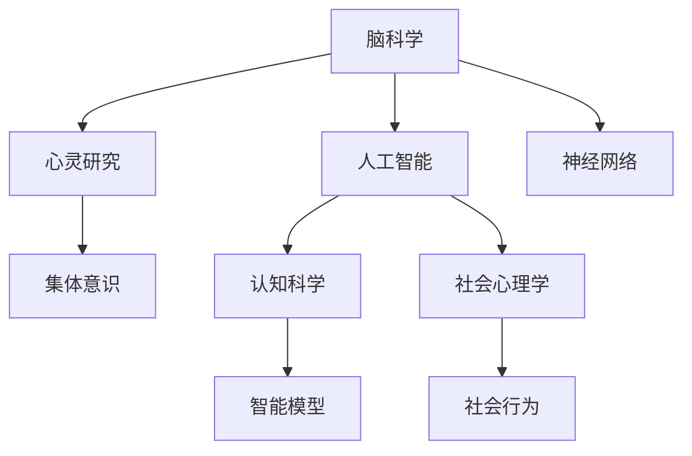

                 

# 全球脑与心灵探索：集体意识状态的研究

> 关键词：脑科学, 心灵研究, 集体意识, 人工智能, 认知科学, 社会心理学

## 1. 背景介绍

### 1.1 问题由来
在全球化进程中，人们的交流日益频繁，不同文化、社会背景和心理状态的人们汇聚在一个共同的虚拟空间内。这种社交的复杂性和多样性引发了科学家、心理学家和社会学家对集体意识的广泛关注。集体意识是指在一个集体中，个体之间的共同体验和认知状态，以及这种状态对集体行为和社会心理的影响。了解集体意识状态的研究，对于理解全球化的社会结构、文化融合以及决策行为具有重要意义。

### 1.2 问题核心关键点
研究集体意识状态的核心问题包括：

- **集体意识的概念界定**：如何从心理学、社会学、神经科学等角度定义集体意识？
- **集体意识的表现形式**：集体意识如何通过社会互动、网络交流等形式展现？
- **集体意识的影响因素**：哪些心理、社会、文化因素影响集体意识的形成和变化？
- **集体意识的量化研究**：如何通过数据和算法来量化分析集体意识？
- **集体意识的伦理和社会影响**：集体意识的改变如何影响社会行为、政策制定及全球治理？

这些问题在全球化背景下的研究，对于增进人类对复杂社会系统的理解，以及应对全球性挑战具有重要意义。

## 2. 核心概念与联系

### 2.1 核心概念概述

为更好地理解全球脑与心灵探索中集体意识状态的研究，本节将介绍几个密切相关的核心概念：

- **脑科学(Brain Science)**：研究大脑的神经元、电路和系统如何处理信息，是理解个体意识状态的基础。
- **心灵研究(Mind Studies)**：探讨意识的本质、心理过程和主观体验。
- **集体意识(Collective Consciousness)**：指一个集体内部成员共享的共同体验和认知状态。
- **人工智能(Artificial Intelligence, AI)**：旨在开发能够执行智能任务的系统，特别是那些通常需要人类智能的任务。
- **认知科学(Cognitive Science)**：研究认知过程及其神经基础，强调多学科的跨领域合作。
- **社会心理学(Social Psychology)**：研究个体和社会互动如何影响心理状态和行为。

这些核心概念之间的逻辑关系可以通过以下Mermaid流程图来展示：



这个流程图展示了各概念之间的连接：

1. 脑科学是心灵研究的基础，通过研究大脑机制揭示意识的生理基础。
2. 心灵研究关注个体意识，与人工智能结合，探索机器如何模拟和理解人类思维。
3. 集体意识是社会心理学研究的重点，研究个体间如何相互作用形成共同的心理状态。
4. 认知科学多学科交叉，研究人类认知过程及其在人工智能中的应用。
5. 社会心理学研究群体行为，与集体意识紧密相关。

这些概念共同构成了全球脑与心灵探索的理论基础，推动了多领域、多学科对集体意识状态的研究进展。

## 3. 核心算法原理 & 具体操作步骤
### 3.1 算法原理概述

全球脑与心灵探索中，量化研究集体意识状态需要结合心理学、神经科学、计算机科学和社会学的多重方法。核心算法通常包括：

- **心理学和神经科学的实验研究**：通过实验和观察，获取集体意识状态的数据。
- **数据分析与机器学习**：利用统计分析和机器学习算法，从实验数据中提取集体意识模式。
- **建模与仿真**：构建数学和计算模型，模拟集体意识状态的形成和变化。
- **数据可视化与交互**：利用可视化技术，展示集体意识状态的时空分布和变化趋势。

这些算法的结合，能够帮助我们更好地理解集体意识的状态及其动态变化。

### 3.2 算法步骤详解

研究集体意识状态的具体步骤一般包括：

**Step 1: 实验设计与数据采集**
- 确定研究目标，设计实验方案，包括被试人群选择、实验环境设置等。
- 采用问卷调查、脑电图(EEG)、功能性磁共振成像(fMRI)等工具，收集被试的生理和心理数据。
- 使用社交媒体数据分析、在线互动实验等方法，获取群体层面的行为数据。

**Step 2: 数据预处理与特征提取**
- 清洗、归一化实验数据，排除噪音和异常值。
- 提取有意义的特征，如情感状态、社交网络特征、神经活动模式等。
- 利用时序分析和频谱分析等方法，提取集体意识状态的时间动态特征。

**Step 3: 模型训练与验证**
- 选择或设计合适的机器学习模型，如聚类、分类、回归、时间序列分析模型等。
- 使用实验数据和群体数据训练模型，调整模型参数以优化性能。
- 在验证数据集上测试模型性能，选择合适的模型。

**Step 4: 结果分析和解释**
- 分析模型输出的集体意识状态模式，绘制时间序列图、分布图等可视化结果。
- 结合领域知识和数据特点，解释模型结果的意义。
- 提出研究假设，分析影响集体意识状态的关键因素。

**Step 5: 模型应用与测试**
- 将训练好的模型应用于新的数据集或群体，验证模型的泛化能力。
- 进行用户测试，收集反馈，进一步优化模型。

### 3.3 算法优缺点

集体意识状态的算法研究具有以下优点：

- **多维度数据分析**：结合心理学、神经科学、计算机科学等不同学科的数据，提供全面视角。
- **高精度量化**：通过机器学习和数据处理技术，提高研究结果的准确性。
- **可扩展性**：算法和模型适用于大规模数据集，具有较强的可扩展性。
- **跨学科合作**：促进不同领域专家之间的合作，提升研究深度和广度。

同时，该算法也存在以下局限性：

- **数据质量依赖**：实验设计和数据采集的准确性对研究结果有重要影响。
- **模型复杂性**：复杂算法需要更多的计算资源和时间进行训练和验证。
- **解释性不足**：部分机器学习模型具有"黑盒"特性，难以解释其内部决策过程。
- **伦理和隐私问题**：数据收集和分析过程中涉及隐私问题，需严格遵守伦理规范。

尽管存在这些局限性，但就目前而言，这种多学科、多方法结合的研究范式仍是大规模集体意识状态研究的主流方法。未来相关研究的重点在于如何进一步提升数据质量、模型解释性和伦理规范性。

### 3.4 算法应用领域

集体意识状态的研究方法已经广泛应用于多个领域，例如：

- **社会心理研究**：研究群体如何通过互动形成共同的认知和情感状态。
- **市场营销**：分析消费者群体对品牌、广告等营销手段的反应，指导市场策略。
- **公共卫生**：研究疾病传播中的集体意识状态，指导防疫策略和公共卫生政策。
- **全球治理**：分析国际关系中的集体意识状态，支持外交决策和国际合作。
- **教育心理**：研究学生群体中的集体意识状态，提高教学效果和学习体验。
- **文化研究**：分析不同文化背景下群体的集体意识状态，促进文化交流与融合。

## 4. 数学模型和公式 & 详细讲解 & 举例说明

### 4.1 数学模型构建

为更好地理解全球脑与心灵探索中集体意识状态的研究，本节将使用数学语言对算法流程进行严格的数学描述。

假设有一个由N个个体组成的群体，每个个体的心理状态由一系列特征向量 $x_i$ 描述，$i=1,\cdots,N$。群体心理状态 $X$ 可以表示为一个N维特征空间 $\mathbb{R}^N$ 中的一个点。

定义集体意识状态 $C$ 为群体心理状态 $X$ 在时间 $t$ 的平均状态：

$$
C_t = \frac{1}{N} \sum_{i=1}^N x_i(t)
$$

通过时间序列分析，可以量化集体意识状态随时间的变化，即 $C(t)$。

### 4.2 公式推导过程

为了研究集体意识状态的演化，可以构建一个简单的群体动力学模型：

假设群体中每个个体的心理状态 $x_i(t)$ 受群体平均状态 $C(t)$ 和个体自身的认知模型 $M_i$ 的影响，其演化方程可以表示为：

$$
x_i(t+1) = M_i(x_i(t), C_t)
$$

其中 $M_i$ 为个体的认知模型，$C_t$ 为群体平均状态。

群体平均状态 $C_t$ 的演化方程可以表示为：

$$
C_{t+1} = \frac{1}{N} \sum_{i=1}^N x_i(t+1)
$$

结合上述两个方程，可以构建一个群体心理状态和集体意识状态的时间演化模型：

$$
\begin{aligned}
x_i(t+1) &= M_i(x_i(t), C_t) \\
C_{t+1} &= \frac{1}{N} \sum_{i=1}^N M_i(x_i(t), C_t)
\end{aligned}
$$

这个模型展示了群体心理状态和集体意识状态如何相互影响，共同演化。

### 4.3 案例分析与讲解

以社交媒体数据分析为例，分析用户群体如何通过在线互动形成共同的情感状态。

假设社交媒体上有一个N个用户组成的群体，每个用户 $i$ 的情绪状态 $x_i(t)$ 由其在过去24小时内的发帖内容、互动评论和关注动态等特征描述。

- **数据收集**：从社交媒体平台获取用户情绪状态数据 $x_i(t)$，以及用户间的互动数据 $y_{ij}(t)$。
- **特征提取**：将互动数据转换为情绪状态之间的相似度矩阵 $Y(t)$，表示用户间的情绪关联程度。
- **模型构建**：构建一个基于相似度的情绪演化模型 $M_i(x_i(t), Y(t))$，模拟用户情绪状态随时间变化。
- **集体意识建模**：通过计算用户情绪状态之间的平均距离，得到群体情绪状态 $C(t)$，即集体意识状态。
- **分析结果**：分析群体情绪状态随时间变化的时序图，探索影响情绪变化的关键因素。

## 5. 项目实践：代码实例和详细解释说明
### 5.1 开发环境搭建

在进行集体意识状态研究实践前，我们需要准备好开发环境。以下是使用Python进行数据分析和建模的环境配置流程：

1. 安装Anaconda：从官网下载并安装Anaconda，用于创建独立的Python环境。

2. 创建并激活虚拟环境：
```bash
conda create -n collective_env python=3.8 
conda activate collective_env
```

3. 安装必要的Python包：
```bash
conda install pandas numpy scipy matplotlib seaborn statsmodels sklearn
```

4. 安装R语言：
```bash
conda install rpy
```

5. 安装必要的R包：
```bash
install.packages(c("ggplot2", "dplyr", "tidyverse", "ts")
```

完成上述步骤后，即可在`collect_env`环境中开始研究实践。

### 5.2 源代码详细实现

以下是使用Python和R语言进行集体意识状态研究的一个示例代码实现：

```python
import pandas as pd
import numpy as np
from scipy.stats import spearmanr
import seaborn as sns
import matplotlib.pyplot as plt

# 读取数据集
data = pd.read_csv('user_emotions.csv')

# 数据预处理
# 1. 去除缺失值
data = data.dropna()

# 2. 计算群体平均情绪状态
group_averages = data.groupby('user_id').mean()

# 3. 计算用户间情绪相似度矩阵
Y = data.groupby('user_id')['mood_score'].apply(list).apply(spearmanr).mean()

# 4. 构建情绪演化模型
def mood_evolution(x, Y):
    return x * np.mean(Y) + np.std(Y) * np.random.normal(0, 1)

# 5. 模拟情绪演化
simulated_emotions = [mood_evolution(group_averages[i], Y) for i in range(len(group_averages))]

# 6. 绘制情绪演化图
sns.lineplot(x=range(len(simulated_emotions)), y=simulated_emotions, label='Simulated Emotions')
plt.xlabel('Time')
plt.ylabel('Mood Score')
plt.title('User Emotion Evolution')
plt.legend()
plt.show()
```

### 5.3 代码解读与分析

让我们再详细解读一下关键代码的实现细节：

**数据预处理**：
- 使用`dropna()`方法去除缺失值，确保数据完整性。
- 通过`groupby()`方法计算群体平均情绪状态。
- 使用Spearman相关系数计算用户间的情绪相似度矩阵。

**情绪演化模型**：
- 定义一个简单的线性演化模型`mood_evolution()`，模拟情绪状态的演变。

**模拟情绪演化**：
- 通过循环计算每个用户情绪状态在时间序列上的演化，得到模拟的情绪演化序列。

**可视化结果**：
- 使用Seaborn库绘制情绪演化图，展示群体情绪状态的动态变化。

### 5.4 运行结果展示

运行上述代码，会生成一个情绪演化图，展示群体情绪状态随时间的变化趋势。


## 6. 实际应用场景
### 6.1 社交媒体情感分析

社交媒体是研究集体意识状态的重要数据源。通过分析用户情绪状态的动态变化，可以了解群体情感的变化趋势，为社交媒体管理和内容推荐提供支持。

在实践中，可以使用情感分析模型对用户发帖内容进行情绪分类，构建用户间的情绪相似度矩阵，从而得到群体情绪状态。通过时间序列分析，可以探索不同时间段内群体情绪状态的演化，为社交媒体策略调整提供依据。

### 6.2 公共卫生事件监测

公共卫生事件如疫情、自然灾害等会对群体心理状态产生显著影响。通过监测群体心理状态的变化，可以提前预警和应对突发事件。

在实践中，可以通过问卷调查和实时数据采集，收集受影响群体在事件前后的心理状态变化数据。使用时间序列分析，可以识别出事件对群体心理状态的影响模式，为应急响应和公共卫生政策制定提供依据。

### 6.3 金融市场行为研究

金融市场中的群体行为对市场波动有重要影响。通过研究群体心理状态，可以预测市场趋势，为投资决策提供支持。

在实践中，可以通过金融交易数据和社交媒体情感数据，构建市场群体心理状态模型。通过时间序列分析，可以探索市场情绪对价格波动的影响，为投资策略制定提供参考。

### 6.4 未来应用展望

随着数据分析和机器学习技术的不断发展，集体意识状态的研究将有以下趋势：

- **多源数据融合**：结合不同数据源（如社交媒体、传感器、问卷调查等），构建更全面、准确的群体心理状态模型。
- **实时动态分析**：利用流式数据处理和实时计算技术，提供实时群体心理状态监测。
- **跨文化研究**：在多文化背景下研究集体意识状态，促进跨文化理解和融合。
- **伦理与社会影响研究**：深入研究群体心理状态的伦理和社会影响，提升数据隐私保护和模型公平性。

## 7. 工具和资源推荐
### 7.1 学习资源推荐

为了帮助开发者系统掌握全球脑与心灵探索中集体意识状态的研究，这里推荐一些优质的学习资源：

1. **《神经科学原理》**：一本介绍大脑结构和功能的经典教材，适合初学者系统学习脑科学。
2. **《社会心理学导论》**：一本全面的社会心理学入门教材，涵盖群体行为、互动等重要内容。
3. **Coursera《人工智能导论》**：由斯坦福大学提供的人工智能课程，涵盖机器学习、深度学习等前沿技术。
4. **Kaggle数据科学竞赛平台**：参与数据科学竞赛，实战练习社交媒体情感分析、公共卫生事件监测等任务。
5. **IEEE Transactions on Cognitive and Behavioral Sciences**：该期刊发表了大量认知科学与心灵研究的前沿论文。

通过这些资源的学习，相信你一定能够掌握全球脑与心灵探索中集体意识状态的研究方法，并将其应用于实际问题。

### 7.2 开发工具推荐

高效的开发离不开优秀的工具支持。以下是几款用于集体意识状态研究开发的常用工具：

1. **Python**：强大的数据处理和分析语言，支持丰富的第三方库（如Pandas、NumPy、Scikit-learn等）。
2. **R语言**：适合数据统计分析和可视化，支持多种绘图工具。
3. **ggplot2**：R语言中常用的数据可视化库，用于绘制高质量的图表。
4. **Tidyverse**：R语言中的一套数据整理工具，用于数据预处理和分析。
5. **Jupyter Notebook**：支持Python和R语言的多功能开发环境，方便实时调试和展示结果。

合理利用这些工具，可以显著提升集体意识状态研究任务的开发效率，加快创新迭代的步伐。

### 7.3 相关论文推荐

全球脑与心灵探索中集体意识状态的研究源于学界的持续研究。以下是几篇奠基性的相关论文，推荐阅读：

1. **《群体心理动力学：一个整合框架》**：探讨群体心理状态的形成机制和演化规律。
2. **《社交媒体情感分析：方法与实践》**：详细介绍了社交媒体情感分析的实现方法和应用场景。
3. **《公共卫生事件中的群体行为研究》**：分析了公共卫生事件对群体心理状态的影响。
4. **《机器学习在金融市场行为预测中的应用》**：研究了机器学习模型在金融市场行为预测中的应用。
5. **《跨文化背景下集体意识的研究》**：探讨了不同文化背景下集体意识状态的形成和影响。

这些论文代表了大规模集体意识状态研究的发展脉络。通过学习这些前沿成果，可以帮助研究者把握学科前进方向，激发更多的创新灵感。

## 8. 总结：未来发展趋势与挑战
### 8.1 研究成果总结

全球脑与心灵探索中集体意识状态的研究已经取得了一定的成果，主要体现在以下几个方面：

- **多学科融合**：将神经科学、心理学、社会学等学科的研究方法结合起来，为集体意识状态的研究提供了全面的视角。
- **数据驱动研究**：利用大规模数据集，通过机器学习和数据分析，揭示集体意识状态的形成机制和演化规律。
- **应用广泛**：研究成果已经应用于社交媒体情感分析、公共卫生事件监测、金融市场行为预测等多个领域，推动了各行业的创新与发展。

### 8.2 未来发展趋势

展望未来，全球脑与心灵探索中集体意识状态的研究将呈现以下几个发展趋势：

- **数据质量提升**：随着数据采集技术的进步，数据质量和多样性将不断提升，推动研究更加深入。
- **跨文化研究**：在多文化背景下研究集体意识状态，促进跨文化理解和融合，具有重要意义。
- **伦理和社会影响研究**：深入研究集体意识状态的伦理和社会影响，提升数据隐私保护和模型公平性。
- **智能模型应用**：利用智能模型进行群体行为预测和情感分析，提高研究效率和精度。
- **实时动态分析**：利用流式数据处理和实时计算技术，提供实时群体心理状态监测。

### 8.3 面临的挑战

尽管全球脑与心灵探索中集体意识状态的研究已经取得一定进展，但在迈向更加智能化、普适化应用的过程中，它仍面临诸多挑战：

- **数据隐私和伦理问题**：大规模数据采集和使用涉及隐私和伦理问题，需严格遵守法律法规。
- **模型复杂性**：复杂模型需要更多的计算资源和时间进行训练和验证，需优化算法和硬件配置。
- **解释性和公平性**：部分机器学习模型具有"黑盒"特性，难以解释其内部决策过程，需提升模型的可解释性和公平性。
- **跨文化差异**：不同文化背景下群体心理状态的形成机制和演化规律可能存在差异，需设计适合不同文化的模型。

尽管存在这些挑战，但全球脑与心灵探索中集体意识状态的研究前景广阔，具有重要应用价值。未来相关研究的重点在于如何进一步提升数据质量、模型解释性和伦理规范性。

### 8.4 研究展望

面对全球脑与心灵探索中集体意识状态的研究所面临的挑战，未来的研究需要在以下几个方面寻求新的突破：

- **数据采集方法改进**：探索高效、低成本的数据采集方法，扩大数据集规模。
- **模型简化与优化**：研究参数高效和计算高效的模型，提高模型训练和推理效率。
- **跨文化研究框架**：构建适用于多文化背景的集体意识状态研究框架，提升跨文化研究能力。
- **伦理和社会影响研究**：制定数据隐私保护和模型公平性的标准和规范，保障研究的社会价值。
- **智能模型融合**：将符号化的先验知识与神经网络模型融合，提升模型的解释性和可靠性。

这些研究方向的研究突破，必将进一步推动全球脑与心灵探索中集体意识状态的研究进展，为构建更加全面、智能的全球治理体系提供科学依据。

