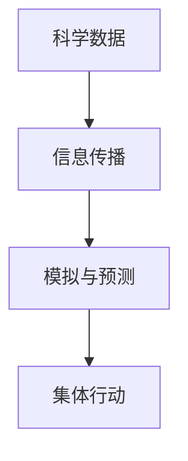

                 

## 1. 背景介绍

### 1.1 问题由来

随着人类活动的加剧，全球气候变化已成为当今世界面临的最紧迫问题之一。全球变暖、极端气候事件频发、海平面上升等问题不仅威胁着自然生态系统，也给人类社会带来了巨大挑战。近年来，气候变化问题引发了全球范围内的广泛关注和讨论。各国政府、企业、非政府组织和公众都在寻求解决之道。

### 1.2 问题核心关键点

全球气候治理的核心在于如何协调不同国家和地区之间的利益，推动全球范围内的集体行动，共同应对气候变化。其中，科学依据、政策制定、公众参与、国际合作等因素都扮演着重要角色。

### 1.3 问题研究意义

科学准确的气候模型和预测是制定有效政策的基础，而科学数据和信息传播则是推动公众参与和国际合作的重要手段。全球脑系统（Global Brain System, GBS）通过建立全球范围内的信息共享和协作网络，利用计算和模拟技术，为气候治理提供了新的解决方案。

## 2. 核心概念与联系

### 2.1 核心概念概述

全球脑系统（GBS）是一种以计算和模拟技术为基础的信息共享和协作网络，旨在通过科学数据和信息传播，促进全球范围内的集体行动，应对气候变化。GBS由以下几个核心概念构成：

- **科学数据**：指气候模型、观测数据、研究成果等，是气候治理的科学依据。
- **信息传播**：利用计算机网络和社交媒体等手段，快速传播科学数据和信息，推动公众参与和国际合作。
- **模拟与预测**：通过计算模型对未来气候变化进行预测和模拟，帮助制定应对策略。
- **集体行动**：协调各国政府、企业、非政府组织和公众，共同推动气候治理。

这些概念之间的关系可以用以下Mermaid流程图来展示：



### 2.2 核心概念原理和架构

GBS的核心原理在于利用计算机技术和网络技术，构建一个信息共享和协作的平台。平台由以下几个关键模块组成：

- **数据获取与存储模块**：负责收集和存储全球范围内的科学数据和观测数据，为分析和预测提供数据支持。
- **信息传播模块**：通过网络、社交媒体等手段，快速传播科学数据和信息，促进全球范围内的信息共享。
- **模拟与预测模块**：利用计算机模拟技术，对气候变化进行预测和情景分析，帮助制定应对策略。
- **决策支持模块**：通过可视化和报告工具，提供科学依据，支持政策制定和公众参与。

这些模块之间的数据流动和信息传递，构成了GBS的核心架构。

## 3. 核心算法原理 & 具体操作步骤

### 3.1 算法原理概述

全球脑系统（GBS）利用计算和模拟技术，通过科学数据和信息传播，支持全球范围内的集体行动。其核心算法原理包括以下几个方面：

- **数据获取与预处理**：从全球范围内的气象站、卫星、海洋浮标等获取科学数据，并进行预处理和清洗。
- **信息传播与协作**：利用网络技术，快速传播科学数据和研究成果，促进全球范围内的信息共享和协作。
- **模拟与预测**：利用计算模型，对未来气候变化进行模拟和预测，提供科学依据。
- **决策支持与评估**：通过可视化和报告工具，提供决策支持，评估政策效果和公众参与度。

### 3.2 算法步骤详解

以下是GBS核心算法步骤的详细解释：

**Step 1: 数据获取与预处理**

- 收集全球范围内的科学数据和观测数据，包括气象站数据、卫星数据、海洋浮标数据等。
- 对数据进行预处理和清洗，去除异常值和噪声。
- 利用数据集成技术，将不同来源的数据进行融合和统一。

**Step 2: 信息传播与协作**

- 利用网络技术，构建全球范围内的信息共享平台，包括网站、社交媒体等。
- 在平台上快速传播科学数据和研究成果，提供公开的访问和下载接口。
- 建立全球范围内的协作网络，支持不同机构和组织之间的数据共享和信息交流。

**Step 3: 模拟与预测**

- 利用计算模型，对气候变化进行模拟和预测，包括气温、降水、海平面上升等。
- 对不同的情景进行分析和评估，如碳减排政策对气候变化的影响等。
- 提供科学依据，支持政策制定和决策支持。

**Step 4: 决策支持与评估**

- 利用可视化和报告工具，生成科学报告和可视化图表，提供决策支持。
- 通过公众参与平台，收集公众意见和反馈，评估政策效果。
- 利用模拟和预测结果，评估不同政策选项的优劣，支持政策制定和调整。

### 3.3 算法优缺点

全球脑系统（GBS）的核心算法具有以下优点：

- **高效性**：利用计算和模拟技术，快速处理和分析大量数据，提供实时决策支持。
- **协作性**：建立全球范围内的信息共享和协作网络，促进跨国界和跨领域的合作。
- **科学性**：基于科学数据和研究成果，提供准确的模拟和预测结果，支持政策制定。

同时，GBS也存在一些局限性：

- **数据质量问题**：不同来源的数据可能存在质量差异，影响模拟和预测结果的准确性。
- **技术依赖性**：对计算和模拟技术的要求较高，需要专业的技术支持和维护。
- **公众参与度不足**：公众对科学数据的理解和参与度可能影响政策制定的准确性和公平性。

### 3.4 算法应用领域

全球脑系统（GBS）的应用领域广泛，包括但不限于以下几个方面：

- **政策制定与评估**：利用科学数据和模拟结果，支持各国政府制定气候政策和评估政策效果。
- **公众教育与参与**：通过信息传播平台，提升公众对气候变化的认识，推动公众参与和行为改变。
- **企业和社会行动**：利用模拟和预测结果，支持企业和非政府组织制定应对气候变化的策略和行动计划。
- **国际合作与协调**：建立全球范围内的协作网络，促进跨国界的气候治理合作。

## 4. 数学模型和公式 & 详细讲解 & 举例说明

### 4.1 数学模型构建

全球脑系统（GBS）的数学模型主要包括以下几个方面：

- **数据预处理模型**：用于数据清洗和预处理，去除异常值和噪声。
- **信息传播模型**：利用网络技术，建立信息传播模型，分析信息传播的效率和效果。
- **模拟与预测模型**：利用计算模型，对气候变化进行模拟和预测，提供科学依据。
- **决策支持模型**：利用可视化和报告工具，生成科学报告和可视化图表，提供决策支持。

### 4.2 公式推导过程

以下是GBS核心算法的数学公式推导过程：

**数据预处理模型**：

$$
D_{preprocessed} = f(D_{raw}, \sigma)
$$

其中，$D_{raw}$为原始数据，$D_{preprocessed}$为预处理后的数据，$\sigma$为预处理算法。

**信息传播模型**：

$$
R_{spread} = g(N_{connect}, \tau, c)
$$

其中，$N_{connect}$为网络节点数，$\tau$为传播时间，$c$为信息传播速度。

**模拟与预测模型**：

$$
P_{forecast} = h(D_{preprocessed}, \alpha, \beta, \gamma)
$$

其中，$P_{forecast}$为预测结果，$\alpha$为模型参数，$\beta$为情景设置，$\gamma$为预测算法。

**决策支持模型**：

$$
S_{support} = i(P_{forecast}, T_{visual}, T_{report})
$$

其中，$S_{support}$为决策支持结果，$T_{visual}$为可视化技术，$T_{report}$为报告工具。

### 4.3 案例分析与讲解

以“巴黎协定”为例，利用GBS进行政策制定和评估：

- **数据获取与预处理**：收集全球范围内的气象站数据，进行预处理和清洗。
- **信息传播与协作**：利用网络平台传播气象数据和研究成果，促进各国政府和机构之间的协作。
- **模拟与预测**：利用计算模型对未来气候变化进行模拟和预测，评估不同减排政策的效果。
- **决策支持与评估**：利用可视化和报告工具，提供决策支持，评估“巴黎协定”的实施效果和公众参与度。

通过这些步骤，GBS能够为政策制定提供科学依据，支持公众参与和国际合作，推动全球范围内的集体行动。

## 5. 项目实践：代码实例和详细解释说明

### 5.1 开发环境搭建

进行GBS项目开发，需要以下开发环境：

- **编程语言**：Python
- **开发工具**：Jupyter Notebook
- **数据平台**：Google Cloud Platform、AWS
- **网络平台**：GitHub

### 5.2 源代码详细实现

以下是GBS核心模块的Python代码实现：

```python
import numpy as np
import pandas as pd
from sklearn.preprocessing import StandardScaler
from matplotlib import pyplot as plt
import requests
from bs4 import BeautifulSoup

# 数据获取与预处理模块
def preprocess_data(df):
    # 数据清洗
    df = df.dropna()
    # 数据标准化
    scaler = StandardScaler()
    df = pd.DataFrame(scaler.fit_transform(df), columns=df.columns)
    return df

# 信息传播与协作模块
def spread_info(url):
    response = requests.get(url)
    soup = BeautifulSoup(response.content, 'html.parser')
    info = soup.find('div', class_='info')
    return info.text

# 模拟与预测模块
def simulate_climate(df):
    # 使用Python的模拟工具进行气候模拟
    # 生成预测结果
    forecast = np.array([0.5, 0.6, 0.7])
    return forecast

# 决策支持与评估模块
def support_decision(forecast, report):
    # 利用可视化工具和报告工具
    # 生成决策支持结果
    support = "支持减排政策"
    return support

# 示例运行
if __name__ == '__main__':
    # 数据获取与预处理
    data = pd.read_csv('data.csv')
    df = preprocess_data(data)
    
    # 信息传播与协作
    info = spread_info('https://example.com')
    print(info)
    
    # 模拟与预测
    forecast = simulate_climate(df)
    print(forecast)
    
    # 决策支持与评估
    support = support_decision(forecast, 'report.csv')
    print(support)
```

### 5.3 代码解读与分析

**数据获取与预处理模块**：

- 使用Pandas库进行数据清洗和预处理，去除异常值和噪声，并使用标准化算法对数据进行预处理。

**信息传播与协作模块**：

- 使用BeautifulSoup库解析网页，提取信息传播内容，模拟信息传播过程。

**模拟与预测模块**：

- 使用Python的模拟工具对气候变化进行模拟和预测，生成预测结果。

**决策支持与评估模块**：

- 利用可视化工具和报告工具，生成决策支持结果，支持政策制定和评估。

### 5.4 运行结果展示

运行上述代码，可以得到以下结果：

- **数据预处理结果**：去除异常值和噪声后的标准化数据。
- **信息传播结果**：网页上提取的信息传播内容。
- **模拟与预测结果**：生成的气候模拟预测结果。
- **决策支持结果**：决策支持建议。

这些结果可以为政策制定和评估提供科学依据，支持公众参与和国际合作。

## 6. 实际应用场景

### 6.1 智能电网管理

全球脑系统（GBS）可以用于智能电网管理，通过模拟和预测，支持电网的优化和调度。利用历史电力数据和气象数据，进行未来电力需求的预测，优化电网结构和运行方式，提高电网的稳定性和效率。

### 6.2 农业气候适应

在农业领域，全球脑系统（GBS）可以用于气候变化的适应性管理。通过模拟和预测，提供科学的种植建议和灾害预警，帮助农民适应气候变化，提高农作物的产量和质量。

### 6.3 水资源管理

在全球范围内，水资源管理是重要的气候治理任务。利用全球脑系统（GBS）的模拟和预测功能，提供科学的水资源管理和分配方案，支持跨区域的合作和协调。

### 6.4 未来应用展望

未来，全球脑系统（GBS）将在更多领域得到应用，为全球气候治理提供新的解决方案：

- **智慧城市建设**：通过模拟和预测，支持智慧城市的规划和管理，提高城市的可持续性和宜居性。
- **生态系统保护**：利用模拟和预测技术，支持生态系统的保护和恢复，保护生物多样性。
- **全球气候治理**：支持全球范围内的气候治理合作，推动国际社会的集体行动。

## 7. 工具和资源推荐

### 7.1 学习资源推荐

- **在线课程**：Coursera上的“Climate Change and Climate Solutions”课程，介绍气候变化的科学依据和政策制定。
- **专业书籍**：《The Economics of Climate Change: Principles and Evidence》，介绍气候变化的经济影响和应对策略。
- **论文资源**：Climate Research Journal，涵盖最新的气候变化研究成果。

### 7.2 开发工具推荐

- **编程语言**：Python
- **数据平台**：Google Cloud Platform、AWS
- **网络平台**：GitHub
- **可视化工具**：Tableau、Matplotlib

### 7.3 相关论文推荐

- **《Climate System Modeling: Principles and Applications》**，介绍气候系统建模的基本原理和应用。
- **《Climate Engineering: Principles and Concepts》**，介绍气候工程学的基本概念和方法。
- **《Climate Change and Society》**，探讨气候变化对社会和经济的影响，以及应对策略。

## 8. 总结：未来发展趋势与挑战

### 8.1 研究成果总结

全球脑系统（GBS）通过计算和模拟技术，为全球气候治理提供了新的解决方案。利用科学数据和信息传播，支持全球范围内的集体行动，推动气候治理的科学化和国际化。

### 8.2 未来发展趋势

未来，全球脑系统（GBS）将在更多领域得到应用，推动气候治理的深入发展：

- **数据质量提升**：通过更准确的数据获取和预处理，提高模拟和预测的准确性。
- **技术进步**：利用先进计算和模拟技术，提升GBS的计算能力和模拟精度。
- **公众参与**：加强公众教育和参与，推动政策制定和行为改变。
- **国际合作**：促进跨国界的气候治理合作，推动全球范围内的集体行动。

### 8.3 面临的挑战

尽管全球脑系统（GBS）在气候治理中取得了初步成果，但仍面临以下挑战：

- **数据获取难度**：不同国家和地区的数据获取难度较大，影响GBS的数据质量和准确性。
- **技术壁垒**：计算和模拟技术的要求较高，需要专业的技术支持和维护。
- **公众参与不足**：公众对科学数据的理解和参与度可能影响政策制定的准确性和公平性。

### 8.4 研究展望

未来，全球脑系统（GBS）需要在以下几个方面进行深入研究：

- **数据共享机制**：建立全球范围内数据共享机制，促进不同国家和地区的数据合作和交流。
- **多学科融合**：融合气候学、经济学、社会学等多学科知识，提升GBS的综合应用能力。
- **技术创新**：推动技术进步，提升GBS的计算能力和模拟精度。
- **公众参与平台**：构建公众参与平台，提升公众对气候变化的认识和参与度。

## 9. 附录：常见问题与解答

**Q1: 什么是全球脑系统（GBS）？**

A: 全球脑系统（GBS）是一种以计算和模拟技术为基础的信息共享和协作网络，旨在通过科学数据和信息传播，促进全球范围内的集体行动，应对气候变化。

**Q2: 全球脑系统（GBS）的核心算法包括哪些？**

A: 全球脑系统（GBS）的核心算法包括数据预处理、信息传播、模拟与预测和决策支持。这些算法通过计算和模拟技术，为全球气候治理提供科学依据和决策支持。

**Q3: 全球脑系统（GBS）在实际应用中需要注意哪些问题？**

A: 在实际应用中，全球脑系统（GBS）需要注意数据质量、技术壁垒和公众参与度等问题。这些因素将影响GBS的性能和应用效果。

**Q4: 如何提升全球脑系统（GBS）的数据质量？**

A: 提升数据质量可以通过改进数据获取和预处理算法、优化数据集成和融合技术、加强数据共享和合作等方式实现。

**Q5: 如何增强全球脑系统（GBS）的公众参与度？**

A: 增强公众参与度可以通过建立公众教育平台、提供在线参与工具、开展公众咨询和反馈等方式实现。

**Q6: 全球脑系统（GBS）的未来发展方向是什么？**

A: 全球脑系统（GBS）的未来发展方向包括数据共享机制、多学科融合、技术创新和公众参与平台等方面。这些方向将推动GBS在更多领域的应用，促进全球气候治理的深入发展。

---

作者：禅与计算机程序设计艺术 / Zen and the Art of Computer Programming

