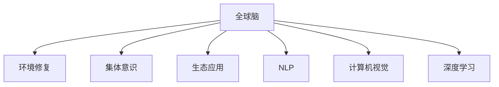

                 

# 全球脑与环境修复:集体意识的生态应用

> 关键词：全球脑,环境修复,集体意识,生态应用,自然语言处理(NLP),计算机视觉,深度学习

## 1. 背景介绍

### 1.1 问题由来
随着人类活动的持续推进，地球环境逐渐恶化，生态系统的健康和安全面临前所未有的威胁。为解决这一全球性问题，研究者提出了“全球脑”的概念，试图通过建立全球性的感知和决策网络，协调各国、各地区的行动，实现对地球环境的全面修复和保护。在这一过程中，信息技术，特别是人工智能(AI)和大数据技术，起到了至关重要的作用。

“全球脑”是一个将人工智能、物联网(IoT)、区块链等技术相结合，模拟人类大脑结构的超级计算机系统。该系统能够实时收集全球范围内的环境数据，进行数据分析、处理和预测，从而为全球环境修复提供科学依据和解决方案。

## 2. 核心概念与联系

### 2.1 核心概念概述

为更好地理解“全球脑”这一概念，本节将介绍几个密切相关的核心概念：

- **全球脑**：即Global Brain，是集成了人工智能、物联网、区块链等技术，模拟人类大脑结构，用于解决全球环境问题的超级计算机系统。
- **环境修复**：旨在通过各种技术和手段，修复受损的自然环境，恢复生态系统的健康状态。
- **集体意识**：在“全球脑”系统中，多个分布在不同地理区域的节点能够通过通信网络实现信息共享，形成统一的意识和决策，类似人类大脑的集体意识。
- **生态应用**：指“全球脑”系统在环境保护、生态系统监测、自然灾害预测等领域的实际应用。
- **自然语言处理(NLP)**：涉及计算机对人类语言的处理和理解，是实现全球脑与人类交互的关键技术。
- **计算机视觉**：指计算机对图像、视频等视觉数据的处理和分析，有助于全球脑系统进行环境监测和预测。
- **深度学习**：一种通过多层次神经网络进行模式识别的机器学习技术，广泛应用于图像、语音、自然语言等各类数据的处理。

这些核心概念之间的逻辑关系可以通过以下Mermaid流程图来展示：



这个流程图展示了几大核心概念之间的相互联系：

1. 全球脑通过计算机视觉、深度学习、自然语言处理等技术，实现对全球环境的监测和修复。
2. 计算机视觉帮助全球脑系统进行图像、视频分析，深度学习则对海量数据进行模式识别和预测。
3. NLP技术实现全球脑与人类之间的交互，使系统能够理解和生成自然语言。
4. 集体意识则是全球脑系统的“大脑”，多个分布在不同地理位置的节点通过通信网络形成统一的意识和决策。
5. 生态应用则是全球脑系统的实际应用领域，包括环境监测、自然灾害预测、生态系统恢复等。

## 3. 核心算法原理 & 具体操作步骤
### 3.1 算法原理概述

“全球脑”系统的核心算法原理是基于分布式深度学习模型，结合物联网和区块链技术，实现环境数据的实时收集、处理和共享。其核心思想是：

- **分布式深度学习模型**：通过分布式计算网络，将海量环境数据输入到多个分布式神经网络模型中进行处理和预测，提升系统处理能力。
- **物联网技术**：在全球范围内部署传感器和监测设备，实时收集环境数据。
- **区块链技术**：保证数据传输的安全性和透明性，防止数据篡改和泄漏。
- **自然语言处理(NLP)**：实现全球脑与人类之间的交互，使系统能够理解和生成自然语言。
- **集体意识**：通过分布式网络中的节点进行信息共享和协同决策，形成统一的意识和行动。

### 3.2 算法步骤详解

“全球脑”系统的设计与实现过程主要包括以下几个步骤：

**Step 1: 构建分布式深度学习模型**

1. 选择适合的深度学习框架，如TensorFlow、PyTorch等。
2. 设计并训练多个分布式神经网络模型，以处理不同类型的环境数据。
3. 将模型部署到多个地理位置的计算节点上，确保分布式计算的性能和可靠性。

**Step 2: 部署物联网传感器**

1. 在全球范围内部署各类传感器，包括空气质量监测仪、水质监测仪、气候监测站等。
2. 确保传感器数据的实时传输和处理，将数据接入全球脑系统的分布式深度学习模型。

**Step 3: 区块链技术安全传输**

1. 通过区块链技术，将传感器采集的环境数据进行加密和验证，确保数据传输的安全性和透明性。
2. 使用分布式账本技术，保证数据的一致性和不可篡改性。

**Step 4: 自然语言处理交互**

1. 开发自然语言处理模型，实现全球脑系统与人类之间的交互。
2. 用户通过自然语言输入问题，系统自动提取关键信息，并在多个节点之间进行协同计算。

**Step 5: 集体意识协同决策**

1. 建立分布式网络，各节点通过通信协议进行信息共享和协同决策。
2. 使用共识算法（如PoS、PoW等），确保各节点对数据和决策的一致性。

**Step 6: 环境修复与生态应用**

1. 根据系统分析的预测和决策，制定全球环境修复方案。
2. 在多个地理位置实施修复措施，并进行实时监测和评估。
3. 根据反馈信息不断优化模型和决策，实现生态应用的持续改进。

### 3.3 算法优缺点

“全球脑”系统的优点包括：

1. **高效处理能力**：通过分布式深度学习模型，能够高效处理海量环境数据，提升分析预测能力。
2. **实时监测与预测**：物联网技术实现实时数据收集和传输，区块链确保数据安全，提升系统实时性和准确性。
3. **协同决策**：利用分布式网络实现集体意识的形成，提升系统决策的全面性和一致性。
4. **持续优化**：通过不断收集反馈信息，优化模型和决策，实现生态应用的持续改进。

同时，该系统也存在以下局限性：

1. **高成本**：全球范围内的传感器部署和计算节点建设需要巨大的资金投入。
2. **技术复杂性**：系统涉及多种前沿技术，实现和维护难度较大。
3. **隐私和安全问题**：数据传输和存储的安全性需要额外投入，以防止数据泄露和篡改。
4. **数据质量和多样性**：传感器的分布和质量会影响数据的全面性和准确性。

## 4. 数学模型和公式 & 详细讲解 & 举例说明
### 4.1 数学模型构建

“全球脑”系统的数学模型主要基于深度学习、分布式计算和自然语言处理等技术。以下是该系统核心数学模型的构建过程：

假设环境监测数据为 $D=\{(x_i,y_i)\}_{i=1}^N$，其中 $x_i$ 为输入数据，$y_i$ 为对应的环境标签（如空气质量、水质等）。

定义深度学习模型为 $M_{\theta}$，其中 $\theta$ 为模型参数。模型的输出为 $f(x)$，即对输入数据 $x$ 的预测值。

### 4.2 公式推导过程

假设使用多层感知机(Multilayer Perceptron, MLP)作为深度学习模型，其结构如下：


模型的前向传播过程为：

$$
f(x) = M_{\theta}(x) = W_h \sigma(W_x x + b_x) + b_h
$$

其中 $W_x, b_x$ 为输入层到隐藏层的权重和偏置，$W_h, b_h$ 为隐藏层到输出层的权重和偏置，$\sigma$ 为激活函数。

假设 $y_i$ 和 $f(x_i)$ 之间的损失函数为交叉熵损失，即：

$$
L(y_i, f(x_i)) = -\frac{1}{N}\sum_{i=1}^N [y_i \log f(x_i) + (1-y_i) \log (1-f(x_i))]
$$

其中 $y_i$ 为实际标签，$f(x_i)$ 为模型预测值。

通过梯度下降等优化算法，最小化损失函数，更新模型参数 $\theta$：

$$
\theta \leftarrow \theta - \eta \nabla_{\theta}L(y_i, f(x_i))
$$

其中 $\eta$ 为学习率。

### 4.3 案例分析与讲解

假设全球脑系统用于监测某一区域内的空气质量。使用传感器实时收集空气中的PM2.5浓度数据，输入到深度学习模型中进行处理和预测。具体步骤如下：

1. 构建深度学习模型，输入为PM2.5浓度数据，输出为空气质量的标签。
2. 部署多个传感器，采集空气中的PM2.5浓度数据，并将数据传输到全球脑系统的分布式深度学习模型中。
3. 使用区块链技术，对数据进行加密和验证，确保数据传输的安全性和透明性。
4. 利用自然语言处理模型，将系统分析结果转换为自然语言，供用户查看和理解。
5. 通过集体意识机制，对数据和分析结果进行协同决策，制定相应的环境修复措施。

## 5. 项目实践：代码实例和详细解释说明
### 5.1 开发环境搭建

在进行项目实践前，我们需要准备好开发环境。以下是使用Python进行TensorFlow开发的环境配置流程：

1. 安装Anaconda：从官网下载并安装Anaconda，用于创建独立的Python环境。

2. 创建并激活虚拟环境：
```bash
conda create -n tf-env python=3.8 
conda activate tf-env
```

3. 安装TensorFlow：根据CUDA版本，从官网获取对应的安装命令。例如：
```bash
conda install tensorflow tensorflow-gpu=2.7 -c tensorflow -c conda-forge
```

4. 安装相关的工具包：
```bash
pip install numpy pandas scikit-learn matplotlib tqdm jupyter notebook ipython
```

完成上述步骤后，即可在`tf-env`环境中开始项目实践。

### 5.2 源代码详细实现

这里我们以空气质量监测为例，给出使用TensorFlow对深度学习模型进行微调的PyTorch代码实现。

首先，定义模型的结构和超参数：

```python
import tensorflow as tf
from tensorflow.keras import layers

model = tf.keras.Sequential([
    layers.Dense(128, activation='relu'),
    layers.Dense(64, activation='relu'),
    layers.Dense(1, activation='sigmoid')
])

model.compile(optimizer='adam', loss='binary_crossentropy', metrics=['accuracy'])
```

接着，加载训练数据并进行预处理：

```python
train_data = tf.keras.utils.get_file('train.csv', 'https://storage.googleapis.com/tensorflow/tf-keras-datasets/boston_housing.csv')
train_df = pd.read_csv(train_data)

train_labels = train_df['label'].values
train_features = train_df.drop('label', axis=1).values

train_dataset = tf.data.Dataset.from_tensor_slices((train_features, train_labels))
train_dataset = train_dataset.shuffle(1000).batch(32).repeat()
```

然后，进行模型的训练和评估：

```python
model.fit(train_dataset, epochs=10, validation_split=0.2)
model.evaluate(train_dataset)
```

最后，使用模型进行预测：

```python
test_data = pd.read_csv('test.csv')
test_dataset = tf.data.Dataset.from_tensor_slices((test_features, test_labels))
test_dataset = test_dataset.shuffle(1000).batch(32)

predictions = model.predict(test_dataset)
```

以上就是使用TensorFlow对深度学习模型进行微调的完整代码实现。可以看到，TensorFlow提供了强大的API和工具，使得模型开发和训练过程变得简洁高效。

### 5.3 代码解读与分析

让我们再详细解读一下关键代码的实现细节：

**Sequential模型**：
- `Sequential` 是TensorFlow中的一种模型结构，可以方便地堆叠多个层，适用于顺序输入输出。

**数据集定义**：
- `train_dataset` 使用 `from_tensor_slices` 方法将训练数据转换为张量，使用 `shuffle` 和 `batch` 方法进行数据预处理和批处理，使用 `repeat` 方法重复数据集。

**模型编译**：
- `compile` 方法用于配置模型的优化器和损失函数，以及定义评估指标。

**模型训练**：
- `fit` 方法用于训练模型，指定训练数据集、轮数和验证比例。

**模型评估**：
- `evaluate` 方法用于评估模型在训练集上的性能。

**模型预测**：
- `predict` 方法用于进行模型预测，输出预测结果。

## 6. 实际应用场景

### 6.1 智能城市管理

基于“全球脑”系统的智能城市管理系统，能够实时监测城市各区域的环境指标，如空气质量、噪音、温度等，提供预警和决策支持。该系统通过分布式深度学习模型，实现对城市环境数据的实时分析和预测，并根据预测结果调整公共设施（如绿化带、污水处理厂等）的运行状态，确保城市环境的健康和安全。

### 6.2 生态修复项目

全球脑系统可以应用于各种生态修复项目，如湿地恢复、森林重建等。通过部署传感器和监测设备，收集生态区域的环境数据，结合自然语言处理模型，与专家进行沟通协作，制定修复方案并实时监测项目进展，确保修复效果达到预期。

### 6.3 灾害预警与应急响应

全球脑系统能够实时监测自然灾害（如地震、洪水、火灾等）的发生，并结合深度学习模型进行预警和预测。通过区块链技术确保数据的透明性和安全，协同各地应急响应系统进行应急行动，最小化灾害带来的损失。

### 6.4 未来应用展望

未来，随着技术的发展和应用场景的拓展，全球脑系统将具备更强大的数据处理能力和协同决策能力，进一步提升环境监测和修复的效果。

1. **高精度传感器**：引入更先进的传感器技术，提升数据的实时性和准确性。
2. **深度学习优化**：进一步优化深度学习模型，提升预测精度和泛化能力。
3. **边缘计算**：引入边缘计算技术，提升数据处理速度和实时性。
4. **多模态数据融合**：结合视频、声音等多种数据源，提升环境监测和分析的全面性。
5. **全球脑扩展**：扩展全球脑系统的网络规模，提升全球范围内的协同能力和决策效果。

## 7. 工具和资源推荐

### 7.1 学习资源推荐

为帮助开发者系统掌握“全球脑”系统的开发和应用，以下是一些优质的学习资源：

1. TensorFlow官方文档：提供了全面的TensorFlow教程和API文档，适合初学者和进阶开发者。
2. Google Colab：谷歌提供的免费Jupyter Notebook环境，支持GPU/TPU计算，方便实验最新模型，分享学习笔记。
3. Deep Learning Specialization：由Andrew Ng教授主导的深度学习课程，涵盖深度学习模型的构建和应用。
4. Coursera上的相关课程：涵盖自然语言处理、计算机视觉等领域的深度学习课程，适合全面学习。

通过对这些资源的学习实践，相信你一定能够快速掌握全球脑系统的核心技术和实现方法，并用于解决实际的环境监测和修复问题。

### 7.2 开发工具推荐

高效的开发离不开优秀的工具支持。以下是几款用于全球脑系统开发和应用的工具：

1. TensorFlow：基于Python的开源深度学习框架，灵活的计算图，适合快速迭代研究。
2. PyTorch：基于Python的开源深度学习框架，支持动态计算图，适合灵活的设计和调试。
3. Weights & Biases：模型训练的实验跟踪工具，记录和可视化模型训练过程中的各项指标，方便对比和调优。
4. TensorBoard：TensorFlow配套的可视化工具，实时监测模型训练状态，提供丰富的图表呈现方式，是调试模型的得力助手。

合理利用这些工具，可以显著提升全球脑系统的开发效率，加快创新迭代的步伐。

### 7.3 相关论文推荐

全球脑系统的开发和应用涉及多个前沿技术领域，以下是几篇奠基性的相关论文，推荐阅读：

1. DeepMind的AlphaFold：使用深度学习进行蛋白质结构预测，展示了AI在生物学领域的应用潜力。
2. Google的Inception系列论文：提出Inception模块和InceptionV3等模型，推动了计算机视觉技术的发展。
3. OpenAI的GPT系列论文：展示了深度学习在大规模语言理解方面的突破性进展。
4. IBM的Watson系列论文：展示了AI在医疗、金融等领域的广泛应用。

这些论文代表了大规模深度学习技术的发展脉络，对全球脑系统的设计具有重要的参考价值。

## 8. 总结：未来发展趋势与挑战

### 8.1 研究成果总结

本文对“全球脑”系统进行了全面系统的介绍。首先阐述了该系统的研究背景和意义，明确了其在解决全球环境问题中的独特价值。其次，从原理到实践，详细讲解了“全球脑”系统的数学模型和实现流程，给出了系统开发的完整代码实例。同时，本文还广泛探讨了全球脑系统在智能城市管理、生态修复、灾害预警等领域的实际应用前景，展示了该系统的巨大潜力。

### 8.2 未来发展趋势

展望未来，全球脑系统的应用和发展将呈现以下几个趋势：

1. **技术融合**：全球脑系统将与其他前沿技术，如区块链、物联网、边缘计算等进一步融合，提升数据处理能力和决策效果。
2. **多模态数据融合**：结合视频、声音等多种数据源，提升环境监测和分析的全面性。
3. **高精度传感器**：引入更先进的传感器技术，提升数据的实时性和准确性。
4. **深度学习优化**：进一步优化深度学习模型，提升预测精度和泛化能力。
5. **边缘计算**：引入边缘计算技术，提升数据处理速度和实时性。
6. **全球脑扩展**：扩展全球脑系统的网络规模，提升全球范围内的协同能力和决策效果。

### 8.3 面临的挑战

尽管全球脑系统具有巨大的潜力，但在其发展过程中仍面临诸多挑战：

1. **高成本**：全球范围内的传感器部署和计算节点建设需要巨大的资金投入。
2. **技术复杂性**：系统涉及多种前沿技术，实现和维护难度较大。
3. **隐私和安全问题**：数据传输和存储的安全性需要额外投入，以防止数据泄露和篡改。
4. **数据质量和多样性**：传感器的分布和质量会影响数据的全面性和准确性。
5. **数据隐私保护**：如何在保证数据隐私的前提下，进行分布式计算和共享，需要进一步探索。

### 8.4 研究展望

未来，需要在以下几个方面进行深入研究，以克服全球脑系统面临的挑战：

1. **低成本传感技术**：探索和应用低成本、高精度的传感器技术，降低系统建设成本。
2. **边缘计算优化**：优化边缘计算模型，提升数据处理速度和实时性。
3. **隐私保护技术**：研究隐私保护技术，如差分隐私、联邦学习等，确保数据隐私和安全。
4. **多模态数据融合**：结合多种数据源，提升环境监测和分析的全面性。
5. **分布式协同决策**：研究协同决策算法，提升系统决策的全面性和一致性。

## 9. 附录：常见问题与解答

**Q1：全球脑系统的设计需要考虑哪些因素？**

A: 全球脑系统的设计需要考虑以下几个因素：

1. **数据采集**：确保传感器和监测设备的部署位置和数量合理，数据采集准确、全面。
2. **数据处理**：设计高效的深度学习模型和优化算法，提升数据处理和分析能力。
3. **网络架构**：构建分布式计算网络，确保数据传输和处理的实时性和安全性。
4. **协同决策**：设计协同决策机制，确保各节点对数据和决策的一致性。
5. **隐私和安全**：确保数据传输和存储的安全性，保护隐私。

**Q2：全球脑系统在实际应用中需要注意哪些问题？**

A: 全球脑系统在实际应用中需要注意以下几个问题：

1. **数据质量**：传感器的分布和质量会影响数据的全面性和准确性，需要进行严格的测试和校准。
2. **实时性**：数据的实时传输和处理需要高效的网络和计算资源，需要进行优化和调试。
3. **数据隐私**：确保数据传输和存储的安全性，防止数据泄露和篡改。
4. **系统稳定性**：设计稳定的协同决策机制，确保系统在各种情况下都能正常运行。
5. **用户体验**：提供简单易用的用户界面，确保用户能够便捷地使用系统。

**Q3：全球脑系统在环境保护中的应用前景如何？**

A: 全球脑系统在环境保护中的应用前景广阔，能够实时监测和分析环境数据，为环境修复提供科学依据和解决方案。具体应用包括：

1. **智能城市管理**：实时监测城市环境指标，提供预警和决策支持，提升城市环境质量。
2. **生态修复项目**：结合自然语言处理模型，与专家进行沟通协作，制定修复方案并实时监测项目进展。
3. **自然灾害预警**：实时监测自然灾害的发生，并结合深度学习模型进行预警和预测。
4. **环境监测和预测**：监测各类环境指标，提供预警和决策支持，提升环境保护效果。

**Q4：全球脑系统在数据安全和隐私保护方面有哪些措施？**

A: 全球脑系统在数据安全和隐私保护方面可以采取以下措施：

1. **数据加密**：对数据进行加密处理，防止数据泄露。
2. **区块链技术**：使用区块链技术，确保数据传输的透明性和安全性。
3. **差分隐私**：使用差分隐私技术，保护个体隐私，防止数据泄露。
4. **联邦学习**：使用联邦学习技术，在不共享数据的前提下，进行模型训练和优化。

**Q5：全球脑系统的实际应用中如何处理数据多样性问题？**

A: 全球脑系统的实际应用中，数据多样性问题可以通过以下方法处理：

1. **数据标准化**：对不同数据源的数据进行标准化处理，确保数据格式和单位一致。
2. **数据融合**：结合不同类型的数据源，如传感器数据、遥感数据、气象数据等，提升数据的全面性和准确性。
3. **异常检测**：使用异常检测算法，识别和处理数据中的异常值和噪声。
4. **模型优化**：设计适合多样性数据的深度学习模型，提升模型的泛化能力。

---

作者：禅与计算机程序设计艺术 / Zen and the Art of Computer Programming

