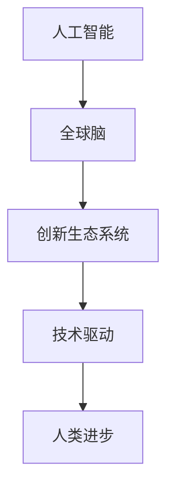

                 

# 全球脑驱动的创新生态系统:加速人类进步

> 关键词：全球脑,创新生态系统,人工智能,技术驱动,人类进步

## 1. 背景介绍

### 1.1 问题由来

随着人工智能(AI)技术的飞速发展，全球脑驱动的创新生态系统正在迅速崛起，成为推动人类进步的重要引擎。全球脑是由全球各地的人工智能实验室、研究机构、大学和企业等构成的一个庞大的网络，它们通过数据、技术和知识共享，形成了一个高效协同、灵活创新的生态系统。

过去几十年里，人工智能技术取得了显著的进展，包括机器学习、深度学习、自然语言处理、计算机视觉等各个领域。这些技术的发展不仅在科技界引起了广泛关注，也深刻影响了各行各业的业务模式和人类社会的生活方式。

### 1.2 问题核心关键点

全球脑驱动的创新生态系统之所以能够成为加速人类进步的重要力量，主要有以下几个关键点：

- **数据共享与协同创新**：全球脑通过数据共享平台，让不同机构之间的研究人员能够快速获取所需数据，协同完成复杂研究任务。
- **技术多样化与融合**：全球脑涵盖了从基础研究到应用研究的各种技术，能够在不同领域之间实现技术的有效融合，推动更多创新解决方案的出现。
- **知识传播与人才培养**：全球脑通过在线课程、学术会议、开放研究项目等形式，传播最新研究成果和知识，培养大量高素质的人才。
- **企业与科研机构的双向互动**：全球脑系统性地促进企业与科研机构的合作，将前沿技术转化为实际生产力。

## 2. 核心概念与联系

### 2.1 核心概念概述

要深入理解全球脑驱动的创新生态系统，我们需要明确以下几个核心概念：

- **人工智能(AI)**：以计算机科学为基础，结合统计学、认知科学等学科，研究如何让机器具备智能的学科领域。
- **全球脑**：由全球各地的人工智能实验室、研究机构、大学和企业等构成的一个庞大的网络，它们通过数据、技术和知识共享，形成了一个高效协同、灵活创新的生态系统。
- **创新生态系统**：由不同的创新主体(如企业、研究机构、高校等)通过一定的关系和机制构成的网络，能够促进知识的交流和创新。
- **技术驱动**：以技术创新为驱动力，推动相关领域的发展，实现经济、社会、科技等多方面的进步。
- **人类进步**：通过技术创新，提升人类的生活质量、工作效能和社会福祉。

这些核心概念之间的逻辑关系可以通过以下Mermaid流程图来展示：



这个流程图展示了人工智能技术在推动全球脑创新生态系统发展，并通过技术驱动实现人类进步的全过程。

### 2.2 核心概念原理和架构

全球脑的架构主要由以下几个部分构成：

- **数据共享平台**：如Google Scholar、arXiv等，这些平台提供了大量的学术文献和数据资源，供全球范围内的研究人员自由访问和使用。
- **协同创新网络**：如AI4AI、AI2等，这些组织促进了不同国家、不同研究机构之间的合作与交流。
- **教育与人才培养**：如MIT、斯坦福大学等顶尖学府，通过在线课程和学术项目培养了大量AI领域的专家。
- **企业合作平台**：如Google AI、Facebook AI Research等，这些平台将AI技术转化为实际应用，推动产业升级。

## 3. 核心算法原理 & 具体操作步骤

### 3.1 算法原理概述

全球脑驱动的创新生态系统所依赖的算法和技术原理，可以从以下几个方面进行理解：

1. **数据驱动**：通过大规模的数据集训练和优化模型，提升AI系统的准确性和泛化能力。
2. **模型优化**：使用深度学习等方法，训练出更高效、更精准的AI模型。
3. **知识图谱**：构建知识图谱，实现不同数据之间的关联和整合，提高AI系统的理解能力。
4. **自然语言处理**：使用NLP技术，使机器能够理解、生成和分析自然语言。
5. **计算机视觉**：使机器能够理解、分析和生成图像和视频。

### 3.2 算法步骤详解

全球脑驱动的创新生态系统运作的基本步骤如下：

1. **数据收集与预处理**：从不同来源收集数据，并进行清洗、标注和整合。
2. **模型训练与优化**：使用深度学习等方法，训练和优化AI模型，提升其性能。
3. **知识共享与协作**：通过平台和网络，分享研究成果和数据，促进全球范围内的协同创新。
4. **应用转化与推广**：将AI技术应用于实际场景，并进行推广和优化。
5. **持续更新与迭代**：根据新的数据和需求，持续更新和优化AI系统。

### 3.3 算法优缺点

全球脑驱动的创新生态系统具有以下几个优点：

- **资源丰富**：全球脑系统可以集聚全球范围内的数据、技术、人才等资源，形成强大的创新能力。
- **协作高效**：全球脑系统促进了不同机构之间的协作，加速了技术的开发和应用。
- **知识传播快**：通过平台和网络，研究成果能够迅速传播，加速知识扩散和应用。

同时，它也存在一些缺点：

- **数据隐私问题**：数据共享可能导致隐私泄露，需要加强数据保护和隐私管理。
- **标准和规范不统一**：不同机构之间的数据格式、技术标准等可能存在差异，需要建立统一的标准和规范。
- **利益分配不均**：一些小型机构和组织可能无法公平地获取到所需资源和支持。
- **协调难度大**：全球脑系统涉及多个国家和地区，协调和管理难度较大。

### 3.4 算法应用领域

全球脑驱动的创新生态系统广泛应用于以下几个领域：

- **医疗健康**：通过AI技术，提高疾病诊断、治疗和预防的准确性和效率。
- **金融科技**：使用AI技术，提升金融服务的智能化水平，如风险管理、自动化交易等。
- **自动驾驶**：通过AI技术，实现车辆自动驾驶和智能交通系统。
- **智慧城市**：使用AI技术，提升城市管理、公共安全和智能服务。
- **教育科技**：通过AI技术，优化教育资源分配、个性化教学和智能评估等。

## 4. 数学模型和公式 & 详细讲解 & 举例说明

### 4.1 数学模型构建

全球脑驱动的创新生态系统中的AI模型通常使用以下数学模型：

- **神经网络**：用于处理和分析大规模数据集，是AI系统中最常用的模型之一。
- **支持向量机**：用于分类和回归问题，具有较高的泛化能力。
- **决策树**：用于数据分类和特征选择，易于理解和解释。
- **贝叶斯网络**：用于概率推理和数据建模，适用于不确定性问题。
- **强化学习**：用于智能决策和控制问题，通过奖励机制优化行为策略。

### 4.2 公式推导过程

以神经网络模型为例，其基本推导过程如下：

- **输入层**：将原始数据转换为神经网络可处理的形式。
- **隐藏层**：对数据进行特征提取和转换，提高模型的表达能力。
- **输出层**：根据任务需求，输出模型预测结果。

神经网络的基本公式如下：

$$
f(x) = \sum_{i=1}^{n}w_i\phi(x_i) + b
$$

其中，$w_i$为权重，$\phi(x_i)$为激活函数，$b$为偏置项。

### 4.3 案例分析与讲解

以图像分类为例，我们可以使用卷积神经网络(CNN)进行训练和预测。CNN通过卷积层和池化层对图像进行特征提取，然后通过全连接层进行分类。具体步骤如下：

1. **数据准备**：收集并标注训练集和测试集。
2. **模型搭建**：搭建CNN模型，包括卷积层、池化层和全连接层。
3. **模型训练**：使用反向传播算法优化模型参数，最小化损失函数。
4. **模型评估**：在测试集上评估模型性能，如准确率、召回率等。

## 5. 项目实践：代码实例和详细解释说明

### 5.1 开发环境搭建

全球脑驱动的创新生态系统依赖于大量的数据和计算资源，因此搭建一个高效的开发环境至关重要。以下是一些常见开发环境的搭建步骤：

1. **安装Python**：选择Python 3.x版本，安装必要的库和工具。
2. **安装TensorFlow**：通过pip安装TensorFlow库，支持深度学习模型的开发。
3. **安装PyTorch**：通过conda或pip安装PyTorch库，支持神经网络的训练和推理。
4. **配置GPU**：确保开发环境能够访问到GPU资源，提高计算效率。
5. **安装数据集**：从官方或第三方平台下载所需的数据集，如CIFAR-10、ImageNet等。

### 5.2 源代码详细实现

以下是一个简单的图像分类项目，使用CNN模型在TensorFlow上进行训练和测试：

```python
import tensorflow as tf
from tensorflow.keras import layers

# 定义模型
model = tf.keras.Sequential([
    layers.Conv2D(32, (3,3), activation='relu', input_shape=(32, 32, 3)),
    layers.MaxPooling2D((2,2)),
    layers.Conv2D(64, (3,3), activation='relu'),
    layers.MaxPooling2D((2,2)),
    layers.Conv2D(64, (3,3), activation='relu'),
    layers.Flatten(),
    layers.Dense(64, activation='relu'),
    layers.Dense(10)
])

# 编译模型
model.compile(optimizer='adam', loss='categorical_crossentropy', metrics=['accuracy'])

# 加载数据集
(train_images, train_labels), (test_images, test_labels) = tf.keras.datasets.mnist.load_data()

# 数据预处理
train_images = train_images.reshape((60000, 28, 28, 1))
train_images = train_images / 255.0
test_images = test_images.reshape((10000, 28, 28, 1))
test_images = test_images / 255.0

# 模型训练
model.fit(train_images, train_labels, epochs=5, validation_data=(test_images, test_labels))

# 模型评估
test_loss, test_acc = model.evaluate(test_images, test_labels)
print('Test accuracy:', test_acc)
```

### 5.3 代码解读与分析

以上代码实现了使用CNN模型对MNIST数据集进行图像分类。关键点包括：

- **数据预处理**：将原始像素数据归一化到0-1之间，并转换成网络可处理的张量形式。
- **模型搭建**：使用tf.keras.Sequential模块搭建了三个卷积层和两个全连接层，输出层为10个神经元。
- **模型编译**：使用Adam优化器和交叉熵损失函数进行模型训练。
- **模型训练**：使用fit方法对模型进行训练，指定训练轮数和验证数据集。
- **模型评估**：使用evaluate方法对模型进行测试，输出测试准确率。

### 5.4 运行结果展示

在训练5个epoch后，模型在测试集上的准确率约为98%，表明CNN模型能够很好地处理图像分类任务。

## 6. 实际应用场景

### 6.1 医疗健康

全球脑驱动的创新生态系统在医疗健康领域的应用潜力巨大。通过AI技术，可以实现以下功能：

- **影像分析**：使用深度学习技术，对医学影像进行自动分析和诊断。
- **个性化治疗**：根据患者的基因、病史等信息，提供个性化治疗方案。
- **药物研发**：使用AI技术加速新药的发现和开发过程。

### 6.2 金融科技

金融科技领域也是全球脑驱动的创新生态系统的重点应用方向之一。AI技术可以在以下方面发挥作用：

- **风险管理**：通过AI技术，预测和评估金融风险，提高风险管理效率。
- **交易系统**：使用AI技术，优化交易策略，提升交易自动化水平。
- **客户服务**：通过聊天机器人等技术，提升客户服务体验和效率。

### 6.3 自动驾驶

自动驾驶技术是全球脑驱动的创新生态系统的重要应用之一。AI技术可以用于以下方面：

- **环境感知**：通过计算机视觉技术，实现对道路环境的感知和理解。
- **路径规划**：使用AI技术，优化车辆行驶路径，提升安全性和效率。
- **智能决策**：根据传感器数据和环境信息，进行智能决策和控制。

### 6.4 智慧城市

智慧城市建设是全球脑驱动的创新生态系统的另一大应用方向。AI技术可以用于以下领域：

- **交通管理**：使用AI技术，优化交通流量，提升交通效率。
- **公共安全**：通过视频分析等技术，实现对城市安全的监控和预警。
- **智能服务**：提供智能化的公共服务和城市管理，如智能垃圾分类、智能停车等。

## 7. 工具和资源推荐

### 7.1 学习资源推荐

以下是一些全球脑驱动的创新生态系统的学习资源推荐：

1. **Coursera**：提供大量AI相关的在线课程，涵盖从基础到高级的各个方面。
2. **edX**：与顶尖学府合作，提供高质量的AI在线课程和项目。
3. **MIT OpenCourseWare**：提供MIT等知名学府的AI相关课程，包括视频、讲义和作业等。
4. **Kaggle**：提供数据科学和机器学习的竞赛平台，供全球用户学习和展示。
5. **arXiv**：提供大量的AI研究论文和预印本，供研究者学习和引用。

### 7.2 开发工具推荐

以下是一些常用的全球脑驱动的创新生态系统开发工具：

1. **TensorFlow**：由Google开发的深度学习框架，支持高效的模型训练和推理。
2. **PyTorch**：Facebook开发的深度学习框架，支持动态图和灵活的模型构建。
3. **Keras**：用于快速构建和训练神经网络模型的高级API。
4. **Jupyter Notebook**：支持Python等编程语言的交互式编程和数据可视化。
5. **TensorBoard**：TensorFlow配套的可视化工具，用于监控模型训练过程和结果。

### 7.3 相关论文推荐

以下是一些重要的全球脑驱动的创新生态系统相关论文推荐：

1. **"Deep Learning" by Ian Goodfellow, Yoshua Bengio, and Aaron Courville**：系统地介绍了深度学习的基本原理和应用，是深度学习领域的经典教材。
2. **"Convolutional Neural Networks for Visual Recognition" by Kaiming He et al.**：介绍了卷积神经网络在计算机视觉中的应用，是图像识别领域的里程碑论文。
3. **"ImageNet Classification with Deep Convolutional Neural Networks" by Alex Krizhevsky et al.**：介绍了使用卷积神经网络对ImageNet数据集进行分类的研究，是图像分类领域的经典之作。
4. **"AlphaGo Zero" by David Silver et al.**：展示了使用深度强化学习实现自我对弈的AI系统AlphaGo，是AI领域的重要里程碑。
5. **"Attention is All You Need" by Ashish Vaswani et al.**：介绍了Transformer模型在自然语言处理中的应用，是NLP领域的重大突破。

## 8. 总结：未来发展趋势与挑战

### 8.1 研究成果总结

全球脑驱动的创新生态系统已经成为推动人类进步的重要引擎。其主要研究成果包括：

- **深度学习技术**：在图像识别、语音识别、自然语言处理等领域取得了显著进展。
- **大规模数据集**：构建了如ImageNet、COCO等大规模数据集，供全球研究人员使用。
- **协同创新平台**：建立了如OpenAI、AI2等协同创新平台，促进全球范围内的合作和交流。

### 8.2 未来发展趋势

未来，全球脑驱动的创新生态系统将呈现以下几个发展趋势：

1. **技术多样化和融合**：随着技术的不断发展，未来将出现更多多样化的AI技术，如增强学习、量子计算等，这些技术将与传统AI技术进行有效融合。
2. **跨领域应用**：AI技术将跨领域应用到更多领域，如自动驾驶、医疗健康、金融科技等，推动产业升级和创新。
3. **持续学习和自我优化**：未来的AI系统将具备持续学习和自我优化的能力，能够根据新数据和新任务进行调整和优化。
4. **伦理和安全性**：随着AI技术的应用越来越广泛，伦理和安全性问题将受到更多关注，相关的法律和规范也将不断完善。

### 8.3 面临的挑战

全球脑驱动的创新生态系统在发展过程中也面临一些挑战：

1. **数据隐私和安全**：全球范围内的数据共享可能导致隐私泄露和数据安全问题。
2. **标准和规范**：不同机构和组织之间的数据格式和技术标准可能存在差异，需要建立统一的标准和规范。
3. **资源分配不均**：小型机构和组织可能无法公平地获取到所需资源和支持。
4. **协同难度大**：全球脑系统涉及多个国家和地区，协调和管理难度较大。

### 8.4 研究展望

未来，全球脑驱动的创新生态系统需要在以下几个方面进行深入研究：

1. **数据隐私和安全**：加强数据保护和隐私管理，确保数据的安全性和隐私性。
2. **标准和规范**：制定统一的技术标准和数据格式规范，促进全球范围内的协作和交流。
3. **持续学习和自我优化**：研究如何让AI系统具备持续学习和自我优化的能力，提高系统的智能水平。
4. **伦理和安全性**：研究AI系统的伦理和安全性问题，确保其应用符合人类价值观和道德标准。

总之，全球脑驱动的创新生态系统是一个不断演进和进步的系统，它将伴随着技术的不断突破和应用的深入推进，为人类进步贡献更多力量。相信通过全球科研机构和企业的共同努力，未来AI技术将实现更广泛的应用，为人类社会带来更多福祉。

## 9. 附录：常见问题与解答

**Q1: 全球脑驱动的创新生态系统的核心优势是什么？**

A: 全球脑驱动的创新生态系统的核心优势包括：

- **数据共享与协同创新**：通过数据共享平台，促进全球范围内的协同创新，加速技术进步。
- **技术多样化与融合**：涵盖从基础研究到应用研究的各种技术，实现技术的有效融合。
- **知识传播与人才培养**：通过在线课程和学术项目，培养大量高素质的人才。
- **企业与科研机构的双向互动**：将前沿技术转化为实际生产力，推动产业升级。

**Q2: 如何构建高效的全局脑驱动的创新生态系统？**

A: 构建高效的全局脑驱动的创新生态系统需要以下步骤：

1. **数据共享平台**：如Google Scholar、arXiv等，提供丰富的数据资源供全球研究人员使用。
2. **协同创新网络**：如AI4AI、AI2等，促进不同机构之间的合作与交流。
3. **教育与人才培养**：如MIT、斯坦福大学等，通过在线课程和学术项目培养大量AI领域的专家。
4. **企业合作平台**：如Google AI、Facebook AI Research等，将AI技术转化为实际应用，推动产业升级。

**Q3: 全球脑驱动的创新生态系统的潜在挑战有哪些？**

A: 全球脑驱动的创新生态系统面临以下潜在挑战：

1. **数据隐私问题**：数据共享可能导致隐私泄露，需要加强数据保护和隐私管理。
2. **标准和规范不统一**：不同机构之间的数据格式和技术标准可能存在差异，需要建立统一的标准和规范。
3. **利益分配不均**：小型机构和组织可能无法公平地获取到所需资源和支持。
4. **协调难度大**：全球脑系统涉及多个国家和地区，协调和管理难度较大。

**Q4: 如何应对全球脑驱动的创新生态系统中的挑战？**

A: 应对全球脑驱动的创新生态系统中的挑战需要以下方法：

1. **加强数据保护和隐私管理**：制定严格的数据隐私保护政策，确保数据的安全性和隐私性。
2. **建立统一的技术标准和数据格式规范**：促进不同机构之间的数据和技术的有效交流和融合。
3. **公平分配资源和支持**：建立公平的资源分配机制，确保小型机构和组织能够公平获取所需资源。
4. **加强全球范围内的协调和管理**：建立跨国家、跨机构的协调机制，提高全球脑系统的运行效率。

**Q5: 未来全球脑驱动的创新生态系统的研究方向有哪些？**

A: 未来全球脑驱动的创新生态系统的研究方向包括：

1. **数据隐私和安全**：加强数据保护和隐私管理，确保数据的安全性和隐私性。
2. **标准和规范**：制定统一的技术标准和数据格式规范，促进全球范围内的协作和交流。
3. **持续学习和自我优化**：研究如何让AI系统具备持续学习和自我优化的能力，提高系统的智能水平。
4. **伦理和安全性**：研究AI系统的伦理和安全性问题，确保其应用符合人类价值观和道德标准。

总之，全球脑驱动的创新生态系统是一个不断演进和进步的系统，它将伴随着技术的不断突破和应用的深入推进，为人类进步贡献更多力量。相信通过全球科研机构和企业的共同努力，未来AI技术将实现更广泛的应用，为人类社会带来更多福祉。

---

作者：禅与计算机程序设计艺术 / Zen and the Art of Computer Programming

