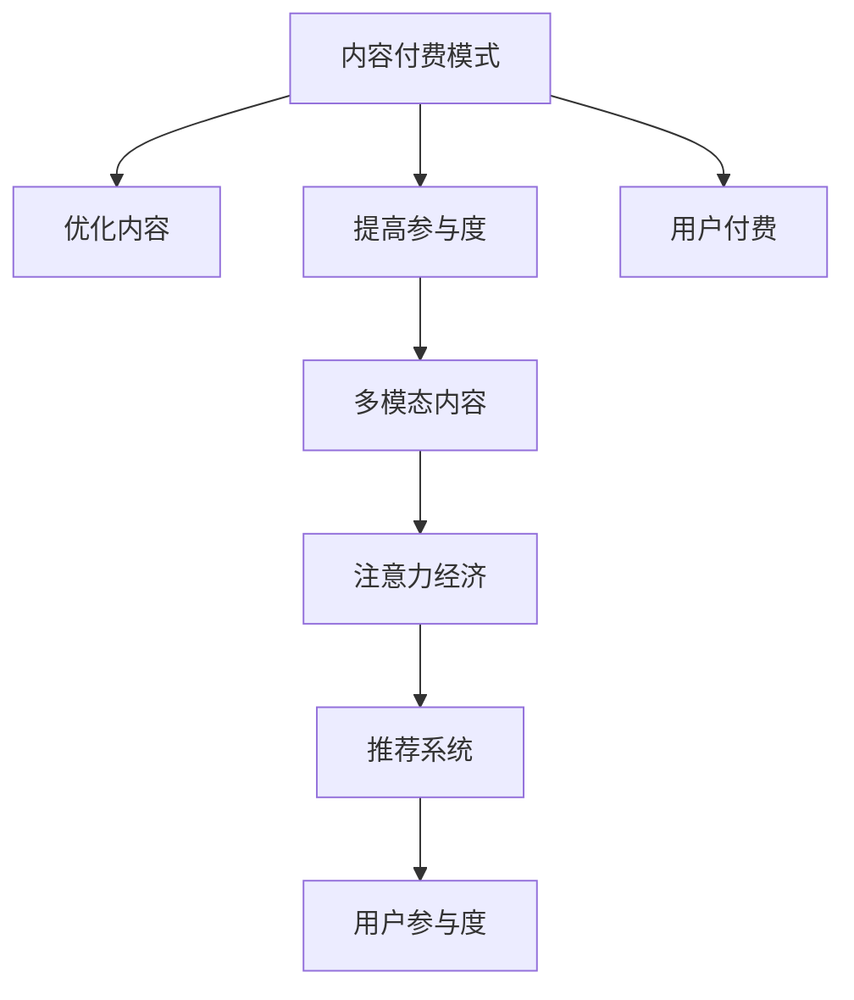

                 

## 1. 背景介绍

### 1.1 问题由来

在互联网的浪潮下，内容消费成为人们获取知识、享受信息的重要方式。然而，内容免费策略导致诸多劣质内容的泛滥，加重了内容生产者的负担。用户对高质量内容的需求推动了内容付费模式的兴起。内容付费不仅能够为内容生产者带来稳定的收入来源，还能保障内容的质量和原创性，促进内容产业的健康发展。

与此同时，伴随着用户注意力的碎片化、浅层化，如何吸引用户的注意力并提升其参与度，成为内容付费模式下值得关注的焦点。注意力经济理论应运而生，将注意力视为一种稀缺的资源，通过优化内容结构和传播策略，吸引和维持用户注意力，从而实现商业价值的最大化。

### 1.2 问题核心关键点

内容付费模式与注意力经济结合的核心关键点包括：
- 内容付费模式的定义及其优势。
- 注意力经济的基本原理和主要模型。
- 如何设计内容付费机制，以最大化用户注意力。
- 如何利用注意力经济理论优化内容推荐，提高用户满意度。

这些关键点构成了内容付费与注意力经济结合的基础，帮助理解和实现基于注意力经济的内容付费模式。

## 2. 核心概念与联系

### 2.1 核心概念概述

为了更好地理解内容付费模式与注意力经济的结合，本节将介绍几个关键概念：

- **内容付费模式（Content Paywall）**：指用户需要付费订阅才能访问和享受特定内容。内容付费模式有助于保障内容质量，激励原创，同时为内容生产者提供稳定收入。

- **注意力经济（Attention Economy）**：将注意力视为一种稀缺资源，通过优化内容生产和传播策略，吸引和维持用户注意力，从而创造商业价值。注意力经济理论关注如何有效分配和管理用户注意力。

- **用户参与度（User Engagement）**：指用户对内容的态度和行为反应，包括浏览时长、互动率、分享次数等。用户参与度是衡量内容吸引力和付费效果的重要指标。

- **推荐系统（Recommendation System）**：利用机器学习算法预测用户兴趣，推荐个性化的内容。推荐系统能够提升用户参与度和满意度，降低用户流失率。

- **多模态内容（Multimodal Content）**：结合文字、图片、视频等多种形式的内容，丰富用户体验，吸引用户注意力。

这些概念之间的逻辑关系可以通过以下Mermaid流程图来展示：



这个流程图展示了大语言模型微调的各个概念及其之间的关系：

1. 内容付费模式通过对内容的筛选和定价，激励高质量内容的生产。
2. 优化内容结构和形式，提升用户参与度，创造更大的经济价值。
3. 多模态内容的引入丰富用户体验，吸引更多注意力。
4. 注意力经济理论指导推荐系统设计，提升用户参与度和满意度。
5. 推荐系统通过个性化推荐，提升用户粘性，促进付费转化。

## 3. 核心算法原理 & 具体操作步骤

### 3.1 算法原理概述

内容付费模式与注意力经济的结合，本质上是利用注意力经济理论优化内容付费机制，通过推荐系统提升用户参与度，从而最大化商业价值的过程。其核心算法原理包括：

1. **用户行为建模**：通过机器学习算法（如协同过滤、内容推荐算法等）分析用户历史行为数据，预测用户兴趣和偏好。
2. **个性化推荐**：基于用户行为模型，推荐个性化内容，提升用户参与度和满意度。
3. **用户付费激励**：通过差异化定价、专属内容等策略，激励用户付费访问高质量内容。
4. **注意力分配优化**：通过注意力经济学理论，优化内容传播策略，提高内容的曝光率和用户参与度。

### 3.2 算法步骤详解

内容付费模式与注意力经济结合的具体操作步骤如下：

**Step 1: 用户行为数据收集**
- 收集用户的浏览历史、点击数据、订阅记录等，作为行为数据的基础。

**Step 2: 用户兴趣建模**
- 利用协同过滤、内容推荐算法等，对用户行为数据进行分析，构建用户兴趣模型。

**Step 3: 个性化推荐**
- 基于用户兴趣模型，推荐个性化内容，提升用户参与度。推荐策略包括内容多样性、时间间隔等。

**Step 4: 差异化定价**
- 根据内容质量和用户需求，设定差异化定价策略，激励用户付费。如对付费用户提供独家内容。

**Step 5: 用户反馈收集**
- 收集用户的反馈数据，如评价、评分等，不断优化推荐算法和定价策略。

**Step 6: 注意力分配优化**
- 应用注意力经济理论，优化内容的曝光策略，提升用户注意力。如通过A/B测试调整推送时间和频率。

**Step 7: 持续优化**
- 定期分析用户行为数据和反馈，调整推荐算法和定价策略，实现持续优化。

### 3.3 算法优缺点

内容付费模式与注意力经济结合的优势包括：
1. 保障内容质量：付费模式激励高质量内容的生产，优化了内容生态。
2. 提升用户参与度：个性化推荐和差异化定价提高了用户粘性，提升参与度。
3. 优化资源配置：推荐算法和注意力经济学理论指导内容传播，提高了资源利用率。

同时，也存在一些局限性：
1. 用户支付意愿低：部分用户对内容付费存在抵触情绪，付费转化率不高。
2. 推荐系统复杂度高：个性化推荐算法需要大量的数据和计算资源，实施难度较大。
3. 注意力转移风险：用户注意力容易分散，难以长期维持。
4. 内容成本高：高质量内容的生产成本较高，付费模式难以覆盖所有内容。

尽管存在这些挑战，但通过不断的技术改进和市场教育，内容付费模式与注意力经济的结合仍有很大的发展空间。

### 3.4 算法应用领域

内容付费模式与注意力经济结合的应用领域广泛，包括但不限于：

- 视频平台：如Netflix、爱奇艺等，通过个性化推荐和付费激励提升用户参与度。
- 新闻媒体：如《经济学人》《华尔街日报》等，通过内容订阅和付费文章，保障内容质量。
- 图书出版：如Kindle电子书，通过差异化定价和专属内容，促进付费转化。
- 教育平台：如Coursera、Udacity等，通过付费课程和个性化学习路径，提升用户满意度。

这些领域的内容付费模式，均通过优化用户行为和内容推荐，实现用户参与度的最大化，推动商业价值的提升。

## 4. 数学模型和公式 & 详细讲解 & 举例说明

### 4.1 数学模型构建

为了更好地理解和实现基于注意力经济的内容付费模式，本节将构建一个简化的数学模型。

假设有一个内容平台，有$N$个用户，每个用户有$m$种兴趣内容，平台的总内容量为$C$。内容平台的目标是最大化平台的商业价值，设$V$为平台的总商业价值，用户付费为$P$，用户注意力的价值为$A$。

用户付费模型可以表示为：
$$
P = \sum_{i=1}^N p_i \times x_i
$$
其中$p_i$为第$i$个用户每月的订阅费用，$x_i$为用户$i$的付费概率。

用户注意力的价值可以通过用户参与度来衡量，设$U_i$为用户$i$的参与度，则总注意力价值为：
$$
A = \sum_{i=1}^N A_i
$$
其中$A_i$为用户$i$注意力的价值，可以通过用户参与度$U_i$来计算。

总商业价值$V$为用户付费和注意力价值的总和：
$$
V = P + A = \sum_{i=1}^N p_i \times x_i + \sum_{i=1}^N A_i
$$

### 4.2 公式推导过程

根据上述模型，我们可以推导出一些关键关系：

1. **用户付费概率**
$$
x_i = f(\text{用户行为数据})
$$
其中$f$为机器学习模型，可以根据用户的历史行为数据预测用户付费概率。

2. **用户参与度模型**
$$
U_i = g(\text{个性化推荐结果})
$$
其中$g$为个性化推荐模型，可以根据用户兴趣模型推荐内容，提升用户参与度。

3. **注意力价值计算**
$$
A_i = h(U_i)
$$
其中$h$为计算用户注意力价值的函数，可以根据用户参与度计算注意力的经济价值。

通过这些关系，我们可以实现用户付费和注意力的综合管理，最大化商业价值。

### 4.3 案例分析与讲解

以Netflix为例，分析其内容付费与注意力经济结合的具体实现：

1. **用户行为数据收集**
   Netflix通过追踪用户的观看记录、评分、收藏等行为数据，构建用户兴趣模型。

2. **个性化推荐**
   Netflix利用协同过滤、内容推荐算法，向用户推荐个性化的影视内容，提升用户参与度。

3. **差异化定价**
   Netflix提供不同类型和数量的付费计划，如基础套餐、标准套餐、高级套餐等，激励用户付费。

4. **用户反馈优化**
   Netflix通过用户评价和评分，不断优化推荐算法和内容库，提高用户满意度和付费意愿。

5. **注意力分配优化**
   Netflix通过A/B测试，调整推荐内容和推送频率，提升用户注意力的集中度和持续性。

Netflix的成功，展示了内容付费模式与注意力经济结合的强大威力，通过优化推荐算法和用户行为管理，实现了用户参与度的最大化和商业价值的最大化。

## 5. 项目实践：代码实例和详细解释说明

### 5.1 开发环境搭建

在进行项目实践前，我们需要准备好开发环境。以下是使用Python进行PyTorch开发的环境配置流程：

1. 安装Anaconda：从官网下载并安装Anaconda，用于创建独立的Python环境。

2. 创建并激活虚拟环境：
```bash
conda create -n pytorch-env python=3.8 
conda activate pytorch-env
```

3. 安装PyTorch：根据CUDA版本，从官网获取对应的安装命令。例如：
```bash
conda install pytorch torchvision torchaudio cudatoolkit=11.1 -c pytorch -c conda-forge
```

4. 安装TensorFlow：由Google主导开发的开源深度学习框架，生产部署方便，适合大规模工程应用。同样有丰富的预训练语言模型资源。

5. 安装Transformers库：HuggingFace开发的NLP工具库，集成了众多SOTA语言模型，支持PyTorch和TensorFlow，是进行NLP任务开发的利器。

6. 安装各类工具包：
```bash
pip install numpy pandas scikit-learn matplotlib tqdm jupyter notebook ipython
```

完成上述步骤后，即可在`pytorch-env`环境中开始项目实践。

### 5.2 源代码详细实现

这里我们以内容推荐系统为例，给出使用PyTorch进行推荐系统的PyTorch代码实现。

首先，定义推荐系统的输入数据：

```python
import torch
import torch.nn as nn
import torch.optim as optim

# 定义用户-物品评分矩阵
user_item_ratings = torch.randn(100, 1000) # 100个用户，1000个物品

# 定义物品特征矩阵
item_features = torch.randn(1000, 10) # 1000个物品，10个特征

# 定义用户特征矩阵
user_features = torch.randn(100, 10) # 100个用户，10个特征
```

然后，定义推荐模型：

```python
class RecommendationModel(nn.Module):
    def __init__(self):
        super(RecommendationModel, self).__init__()
        self.linear = nn.Linear(10, 1)
        self.sigmoid = nn.Sigmoid()
    
    def forward(self, x):
        x = self.linear(x)
        x = self.sigmoid(x)
        return x
```

接着，定义训练和评估函数：

```python
def train_model(model, user_item_ratings, item_features, user_features, epochs=10, batch_size=16, learning_rate=0.01):
    criterion = nn.BCELoss()
    optimizer = optim.Adam(model.parameters(), lr=learning_rate)
    
    for epoch in range(epochs):
        for i in range(0, user_item_ratings.size(0), batch_size):
            start_idx = i
            end_idx = min(i + batch_size, user_item_ratings.size(0))
            inputs = user_features[start_idx:end_idx]
            targets = user_item_ratings[start_idx:end_idx]
            optimizer.zero_grad()
            outputs = model(inputs)
            loss = criterion(outputs, targets)
            loss.backward()
            optimizer.step()
            
        print(f"Epoch {epoch+1}, loss: {loss.item():.4f}")

def evaluate_model(model, user_item_ratings, user_features):
    user_item_predictions = []
    for i in range(user_item_ratings.size(0)):
        user_features_i = user_features[i].unsqueeze(0)
        user_item_predictions.append(model(user_features_i).item())
    print(f"Model predictions: {user_item_predictions}")
```

最后，启动训练流程并在测试集上评估：

```python
model = RecommendationModel()
train_model(model, user_item_ratings, item_features, user_features, epochs=10, batch_size=16, learning_rate=0.01)
evaluate_model(model, user_item_ratings, user_features)
```

以上就是使用PyTorch进行推荐系统的完整代码实现。可以看到，通过定义简单的线性模型和优化器，即可实现基本的推荐系统。

### 5.3 代码解读与分析

让我们再详细解读一下关键代码的实现细节：

**RecommendationModel类**：
- `__init__`方法：初始化模型的线性层和Sigmoid激活函数。
- `forward`方法：定义前向传播的计算流程，将输入特征线性变换，并通过Sigmoid函数输出预测结果。

**训练函数train_model**：
- `criterion`：定义损失函数，这里使用二分类交叉熵损失。
- `optimizer`：定义优化器，这里使用Adam优化器。
- 在每个epoch内，循环遍历数据集，前向传播计算预测结果和损失，反向传播更新模型参数。
- 在训练过程中，记录每个epoch的平均loss。

**评估函数evaluate_model**：
- 在测试集上，循环遍历用户，将用户特征输入模型，获取预测结果，并输出预测结果。

通过以上代码，我们可以清晰地理解推荐系统模型的训练和评估过程。在实际应用中，推荐系统需要处理大规模数据，因此通常会引入诸如BatchNorm、Dropout等技术来提升模型稳定性和泛化能力。

## 6. 实际应用场景

### 6.1 视频平台

视频平台如Netflix、爱奇艺等，通过内容付费和个性化推荐，实现了用户参与度的最大化。平台通过分析用户观看历史和评分数据，构建用户兴趣模型，结合个性化推荐算法，向用户推荐符合其兴趣的影视内容。同时，通过差异化定价策略，激励用户付费，提升平台收入。

### 6.2 新闻媒体

新闻媒体如《经济学人》《华尔街日报》等，通过内容订阅和付费文章，保障了内容的质量和原创性。平台通过分析用户阅读习惯，推荐个性化的新闻内容，提升用户粘性。付费用户可享受更多深度文章和独家报道，进一步激励用户付费。

### 6.3 图书出版

图书出版如Kindle电子书，通过差异化定价和专属内容，促进了付费转化。平台通过分析用户阅读数据，推荐个性化的书籍和阅读路径，提升用户参与度。付费用户可享受更多的图书和优质服务，如借阅功能等。

### 6.4 教育平台

教育平台如Coursera、Udacity等，通过付费课程和个性化学习路径，提升了用户满意度。平台通过分析用户学习数据，推荐符合其兴趣的课程，提升用户粘性。付费用户可享受更多独家内容和辅导服务，进一步激励用户付费。

## 7. 工具和资源推荐

### 7.1 学习资源推荐

为了帮助开发者系统掌握内容付费模式与注意力经济的理论基础和实践技巧，这里推荐一些优质的学习资源：

1. 《推荐系统：算法与应用》：详细介绍了推荐系统的基本原理和常用算法，适合初学者入门。

2. 《内容推荐算法与实践》：介绍了内容推荐系统的具体实现，包含推荐算法、系统架构等内容。

3. 《用户行为分析与个性化推荐》：介绍了用户行为数据收集、分析及个性化推荐的方法和工具。

4. 《内容付费模式探索》：介绍了内容付费模式的多种策略和实际应用案例。

5. 《注意力经济理论》：介绍了注意力经济的基本原理和优化方法，帮助理解用户行为和内容推荐。

通过对这些资源的学习实践，相信你一定能够快速掌握内容付费模式与注意力经济的精髓，并用于解决实际的内容推荐问题。

### 7.2 开发工具推荐

高效的开发离不开优秀的工具支持。以下是几款用于内容推荐系统开发的常用工具：

1. PyTorch：基于Python的开源深度学习框架，灵活动态的计算图，适合快速迭代研究。大部分推荐系统都有PyTorch版本的实现。

2. TensorFlow：由Google主导开发的开源深度学习框架，生产部署方便，适合大规模工程应用。同样有丰富的推荐系统资源。

3. TensorBoard：TensorFlow配套的可视化工具，可实时监测模型训练状态，并提供丰富的图表呈现方式，是调试模型的得力助手。

4. Weights & Biases：模型训练的实验跟踪工具，可以记录和可视化模型训练过程中的各项指标，方便对比和调优。与主流深度学习框架无缝集成。

5. Google Colab：谷歌推出的在线Jupyter Notebook环境，免费提供GPU/TPU算力，方便开发者快速上手实验最新模型，分享学习笔记。

合理利用这些工具，可以显著提升内容推荐系统的开发效率，加快创新迭代的步伐。

### 7.3 相关论文推荐

内容推荐系统的发展源于学界的持续研究。以下是几篇奠基性的相关论文，推荐阅读：

1. BPR: Bayesian Personalized Ranking from Implicit Feedback：提出了基于贝叶斯个人化排序的推荐算法，通过最大化后验概率优化推荐结果。

2. Matrix Factorization Techniques for Recommender Systems：介绍了矩阵分解推荐算法，通过分解用户-物品评分矩阵，发现潜在用户-物品关系。

3. Neural Collaborative Filtering：提出了基于神经网络的协同过滤推荐算法，利用深度学习模型捕捉用户和物品之间的复杂关系。

4. Attention Mechanism for Recommender Systems：引入了注意力机制，在推荐系统中考虑用户和物品的多维度特征，提升推荐效果。

5. Deep Interest Evolution Networks（DENets）：提出了基于深度学习的用户兴趣演化网络，动态捕捉用户兴趣变化，提升推荐效果。

这些论文代表了大语言模型微调技术的发展脉络。通过学习这些前沿成果，可以帮助研究者把握学科前进方向，激发更多的创新灵感。

## 8. 总结：未来发展趋势与挑战

### 8.1 总结

本文对内容付费模式与注意力经济的结合进行了全面系统的介绍。首先阐述了内容付费模式和注意力经济的基本原理及其优势，明确了结合后对内容推荐和付费效果的重要影响。其次，从原理到实践，详细讲解了内容付费模式与注意力经济的数学模型和具体实现方法。同时，本文还广泛探讨了其应用场景，展示了内容付费模式与注意力经济的强大威力。

通过本文的系统梳理，可以看到，内容付费模式与注意力经济的结合，不仅优化了内容推荐系统，还通过个性化的推荐和付费策略，提升了用户参与度和满意度，推动了内容产业的健康发展。

### 8.2 未来发展趋势

展望未来，内容付费模式与注意力经济的结合将呈现以下几个发展趋势：

1. 用户行为数据的多维度分析：随着用户行为数据的丰富性增加，未来推荐系统将更加注重多维度数据的融合，通过跨模态学习和深度学习模型，提升推荐准确性和个性化程度。

2. 推荐算法的多样化发展：除了传统的协同过滤、矩阵分解等算法，未来将涌现更多高效的推荐算法，如深度学习模型、强化学习模型等，提升推荐效果。

3. 用户注意力的主动引导：未来的推荐系统将更加注重用户注意力的主动引导，通过优化内容展示策略，提升用户参与度和满意度。

4. 推荐系统的实时化：随着计算资源的提升和算法优化，未来的推荐系统将具备实时推荐能力，能够动态调整内容推荐，提升用户体验。

5. 推荐系统的泛化性增强：未来的推荐系统将具备更强的泛化能力，能够在不同领域和场景下，灵活应用推荐算法，提升推荐效果。

以上趋势凸显了内容付费模式与注意力经济结合的广阔前景。这些方向的探索发展，必将进一步提升推荐系统的性能和应用范围，为内容产业带来更大的商业价值。

### 8.3 面临的挑战

尽管内容付费模式与注意力经济的结合已经取得了显著成效，但在迈向更加智能化、普适化应用的过程中，仍面临诸多挑战：

1. 数据隐私和安全：用户行为数据涉及个人隐私，如何在保护用户隐私的同时，实现高效的推荐和付费优化，是未来需要解决的重要问题。

2. 计算资源消耗：推荐系统需要处理大量数据，计算资源消耗较大，如何优化算法和硬件配置，降低计算成本，是未来推荐系统的发展方向。

3. 推荐效果一致性：推荐算法在不同用户群体和不同场景下，推荐效果是否一致，如何设计统一的推荐模型，是未来需要解决的重要问题。

4. 推荐系统公平性：推荐系统是否能够公平对待所有用户，避免推荐偏见，如何构建公平、透明的推荐机制，是未来需要解决的重要问题。

5. 推荐系统的可解释性：推荐系统“黑盒”特性，导致用户难以理解其推荐逻辑，如何提高推荐系统的可解释性，提升用户信任度，是未来需要解决的重要问题。

6. 推荐系统的实时性：随着用户需求的多样化和动态性增加，推荐系统需要具备更高的实时性，如何提升推荐系统的实时响应能力，是未来需要解决的重要问题。

这些挑战需要研究者们不断探索和解决，才能使内容付费模式与注意力经济结合的推荐系统，更好地服务于内容产业和用户需求。

### 8.4 研究展望

面对内容付费模式与注意力经济结合的推荐系统所面临的挑战，未来的研究需要在以下几个方面寻求新的突破：

1. 增强推荐系统的公平性：通过多模态数据融合和公平性算法，构建公平、透明的推荐机制。

2. 提升推荐系统的可解释性：通过可解释性算法和透明推荐过程，提高推荐系统的可解释性。

3. 优化推荐系统的实时性：通过实时推荐算法和分布式计算架构，提升推荐系统的实时响应能力。

4. 扩大推荐系统的泛化能力：通过多领域、多场景的推荐模型训练，提升推荐系统的泛化能力。

5. 加强推荐系统的安全性和隐私保护：通过差分隐私和联邦学习等技术，保障用户数据隐私和安全。

6. 引入更多先验知识：将符号化的先验知识，如知识图谱、逻辑规则等，与神经网络模型进行融合，提升推荐系统的泛化能力和解释性。

这些研究方向的探索，必将引领推荐系统迈向更高的台阶，为内容付费模式与注意力经济结合带来更大的商业价值和社会效益。

## 9. 附录：常见问题与解答

**Q1：内容付费模式与注意力经济结合的优势是什么？**

A: 内容付费模式与注意力经济结合的优势包括：
1. 保障内容质量：付费模式激励高质量内容的生产，优化了内容生态。
2. 提升用户参与度：个性化推荐和差异化定价提高了用户粘性，提升参与度。
3. 优化资源配置：推荐算法和注意力经济学理论指导内容传播，提高了资源利用率。

**Q2：如何设计内容付费机制，以最大化用户注意力？**

A: 设计内容付费机制，以最大化用户注意力的关键步骤包括：
1. 收集用户行为数据，构建用户兴趣模型。
2. 利用个性化推荐算法，推荐符合用户兴趣的内容。
3. 设定差异化定价策略，激励用户付费。
4. 通过A/B测试优化内容传播策略，提升用户注意力的集中度和持续性。
5. 定期收集用户反馈，不断优化推荐算法和付费策略。

**Q3：推荐系统如何处理大规模数据？**

A: 推荐系统处理大规模数据的方法包括：
1. 使用高效的算法，如基于矩阵分解的算法、协同过滤算法等，减少计算量。
2. 引入分布式计算架构，如Apache Spark等，处理大规模数据集。
3. 使用优化器，如TensorFlow的TPU优化器、PyTorch的CUDA优化器，提升计算效率。
4. 使用深度学习模型，如神经网络、卷积神经网络等，提高数据处理能力。
5. 引入内存管理技术，如随机梯度下降、批量训练等，减少内存占用。

通过以上方法，推荐系统可以有效处理大规模数据，提升推荐效果。

**Q4：推荐系统如何实现实时推荐？**

A: 实现实时推荐的方法包括：
1. 使用流式数据处理框架，如Apache Kafka、Apache Flink等，实时处理数据。
2. 采用在线学习算法，如在线随机梯度下降、在线Adaboost等，实时更新模型。
3. 使用分布式计算架构，如Apache Spark等，实现实时推荐。
4. 使用内存管理技术，如随机梯度下降、批量训练等，减少内存占用。
5. 使用高效的数据存储技术，如分布式文件系统、内存数据库等，提高数据读取速度。

通过以上方法，推荐系统可以实现实时推荐，满足用户动态需求。

**Q5：如何保障用户数据隐私？**

A: 保障用户数据隐私的方法包括：
1. 使用差分隐私技术，如Laplace机制、Gaussian机制等，保护用户数据隐私。
2. 采用联邦学习技术，将数据分布式存储在多个节点上，防止数据集中。
3. 使用数据匿名化技术，如数据脱敏、数据混淆等，保护用户数据隐私。
4. 采用安全计算技术，如多方安全计算、同态加密等，保护用户数据隐私。
5. 使用隐私保护算法，如差分隐私、隐私保留算法等，保护用户数据隐私。

通过以上方法，推荐系统可以有效保障用户数据隐私。

