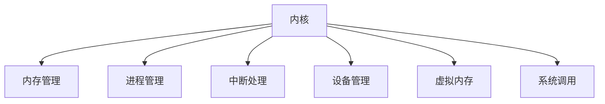

                 

# 内核:操作系统的最基础组件

> 关键词：内核, 操作系统, 内存管理, 进程管理, 中断, 调度, 磁盘管理, 虚拟内存, 系统调用

## 1. 背景介绍

操作系统（Operating System, OS）是计算机硬件与软件之间的桥梁，负责管理和调度计算机资源，提供给应用层用户一个易于使用、安全可靠的环境。而内核是操作系统的核心部分，直接与硬件交互，实现资源分配、进程管理、内存管理等关键功能。本文将深入探讨内核的组成和功能，通过结构紧凑、逻辑清晰的篇章，帮助读者全面理解操作系统的最基础组件。

## 2. 核心概念与联系

### 2.1 核心概念概述

操作系统内核是操作系统的核心部分，主要负责以下核心功能：

- **内存管理**：分配和管理内存空间，以供程序运行时使用。
- **进程管理**：负责创建、调度和管理进程，保证系统资源的有效利用。
- **中断处理**：响应和处理硬件中断请求，确保系统稳定运行。
- **设备管理**：负责I/O设备的驱动和调度，提高数据传输效率。
- **虚拟内存**：实现内存的虚拟化管理，提供更大、更灵活的内存空间。
- **系统调用**：为应用程序提供接口，实现系统级别的功能调用。

这些核心功能之间相互联系，共同支撑操作系统的稳定性和高效性。内存管理提供运行程序的物理空间，进程管理负责合理分配和调度这些空间，中断处理保证系统在硬件异常情况下的稳定性，设备管理实现数据的输入输出，虚拟内存扩展了物理内存的容量，系统调用为用户程序提供访问底层硬件的操作接口。

### 2.2 核心概念原理和架构的 Mermaid 流程图



该流程图展示了内核与各核心功能的连接关系。每个核心功能都是内核不可或缺的部分，共同构成了操作系统的基本架构。

## 3. 核心算法原理 & 具体操作步骤

### 3.1 算法原理概述

内核的各个核心功能基于不同的算法和数据结构实现，主要包括以下几个方面：

- **内存管理**：采用页式或段式管理方式，将物理内存映射到虚拟内存空间，实现内存的动态分配和回收。
- **进程管理**：采用时间片轮转或优先级调度算法，实现进程的公平调度和资源优化。
- **中断处理**：采用中断向量表和堆栈机制，快速响应和处理中断请求。
- **设备管理**：采用缓冲区和通道技术，提高I/O设备的数据传输效率。
- **虚拟内存**：采用多级页表和交换技术，实现虚拟内存空间的扩展和优化。
- **系统调用**：采用统一的接口规范，实现不同系统级别的功能调用。

### 3.2 算法步骤详解

#### 3.2.1 内存管理

内存管理是内核的核心功能之一，主要负责虚拟内存到物理内存的映射和管理。内存管理主要包括以下几个步骤：

1. **内存分配**：将请求的虚拟内存空间映射到物理内存空间。常用的内存分配算法包括首次适应法（First Fit）、最佳适应法（Best Fit）、最坏适应法（Worst Fit）和伙伴系统（Buddy System）等。
2. **内存回收**：当进程结束时，释放其占用的内存空间。常用的内存回收算法包括紧凑（Compaction）和快速回收（Swept Page Table）等。
3. **页面置换**：当物理内存不足时，选择合适的页面进行淘汰。常用的页面置换算法包括先进先出（FIFO）、最近最少使用（LRU）、时钟（Clock）等。

#### 3.2.2 进程管理

进程管理负责创建、调度和销毁进程，主要包括以下几个步骤：

1. **进程创建**：通过系统调用的方式创建新进程，包括分配内存空间、设置进程状态、初始化进程控制块（PCB）等。
2. **进程调度**：通过时间片轮转或优先级调度算法，公平地分配CPU时间片给各个进程。常用的调度算法包括时间片轮转（Round Robin）、多级反馈队列（Multilevel Queue）等。
3. **进程切换**：当进程运行时间到达时间片或发生阻塞时，将CPU资源重新分配给其他进程。
4. **进程销毁**：当进程正常结束或异常终止时，释放其占用的资源。

#### 3.2.3 中断处理

中断处理是内核的重要功能，用于快速响应和处理硬件中断请求，主要包括以下几个步骤：

1. **中断处理程序**：为每个中断源编写中断处理程序，处理中断事件。
2. **中断向量表**：将中断处理程序的入口地址存储在中断向量表中，用于快速跳转到中断处理程序。
3. **中断栈**：保存中断发生时当前程序的上下文信息，包括程序计数器（PC）、寄存器等，以便中断处理程序返回时恢复现场。

#### 3.2.4 设备管理

设备管理负责I/O设备的驱动和调度，主要包括以下几个步骤：

1. **设备驱动**：编写设备驱动程序，实现对硬件设备的控制和数据传输。
2. **设备分配**：分配设备资源给请求进程，包括缓冲区、通道等。
3. **设备使用**：进程通过系统调用的方式使用设备资源，进行数据传输。

#### 3.2.5 虚拟内存

虚拟内存通过将物理内存映射到虚拟内存空间，实现内存的动态分配和扩展，主要包括以下几个步骤：

1. **页面映射**：将虚拟内存页面映射到物理内存页面，实现虚拟内存到物理内存的映射。
2. **页面置换**：当物理内存不足时，选择合适的页面进行淘汰。
3. **缓存机制**：利用缓存技术，提高数据访问速度，减少I/O操作。

#### 3.2.6 系统调用

系统调用为用户程序提供访问底层硬件的操作接口，主要包括以下几个步骤：

1. **系统调用表**：将系统调用的入口地址存储在系统调用表中，用于快速跳转到系统调用程序。
2. **用户程序**：用户程序通过系统调用的方式访问操作系统资源，如打开设备、读写文件等。
3. **内核处理**：内核接收到系统调用请求后，处理该请求，返回结果给用户程序。

### 3.3 算法优缺点

#### 3.3.1 内存管理

**优点**：

- 动态分配和回收内存，提高了内存利用率。
- 实现虚拟内存，扩展了物理内存容量。

**缺点**：

- 页面置换算法可能导致缓存失效，影响性能。
- 内存分配和回收算法复杂，可能导致内存碎片。

#### 3.3.2 进程管理

**优点**：

- 公平地分配CPU时间片，提高系统效率。
- 提供了多进程并发执行的环境。

**缺点**：

- 调度算法可能导致进程饥饿，不公平。
- 进程切换开销较大，影响系统性能。

#### 3.3.3 中断处理

**优点**：

- 快速响应硬件中断请求，保证系统稳定性。
- 实现异步操作，提高系统响应速度。

**缺点**：

- 中断处理程序复杂，容易出现死锁。
- 中断处理开销较大，影响系统性能。

#### 3.3.4 设备管理

**优点**：

- 提高I/O设备的数据传输效率。
- 提供设备资源的高效管理。

**缺点**：

- 设备驱动编写复杂，容易出现错误。
- 设备使用频繁，影响系统性能。

#### 3.3.5 虚拟内存

**优点**：

- 实现内存的虚拟化管理，提供更大、更灵活的内存空间。
- 缓存在缓存中，提高数据访问速度。

**缺点**：

- 页面置换算法可能导致缓存失效，影响性能。
- 内存映射复杂，可能导致内存碎片。

#### 3.3.6 系统调用

**优点**：

- 提供了系统级别的功能调用，方便用户程序开发。
- 实现高效的资源管理，提高系统效率。

**缺点**：

- 系统调用开销较大，影响系统性能。
- 容易受到操作系统设计的影响，可能出现异常。

### 3.4 算法应用领域

内核的各个核心功能在多个领域得到了广泛应用，主要包括以下几个方面：

- **嵌入式系统**：嵌入式操作系统的内核通常需要优化资源使用和系统响应速度，如RTOS（Real-Time Operating System）等。
- **桌面操作系统**：桌面操作系统的内核需要提供完善的内存管理、进程管理、设备管理等功能，如Linux、Windows等。
- **服务器操作系统**：服务器操作系统的内核需要提供高性能的资源管理和调度功能，如UNIX、Linux等。
- **移动操作系统**：移动操作系统的内核需要提供轻量级、高效的系统功能，如Android、iOS等。
- **嵌入式设备**：嵌入式设备的硬件资源有限，内核需要优化内存和资源使用，如RTOS、Linux等。

## 4. 数学模型和公式 & 详细讲解 & 举例说明

### 4.1 数学模型构建

内核的核心算法和数据结构可以建模为数学模型，以下以虚拟内存为例进行说明。

假设物理内存大小为M，虚拟内存大小为V，页面大小为P。则虚拟内存到物理内存的映射可以表示为：

$$
\text{Mapping} = \{0, 1, \dots, V/P - 1\} \rightarrow \{0, 1, \dots, M/P - 1\}
$$

其中，$\text{Mapping}$表示虚拟内存到物理内存的映射关系。

假设当前请求的虚拟内存页面号为$k$，则对应的物理内存页面号为：

$$
\text{Physical Page} = \text{Mapping}(k)
$$

当物理内存不足时，需要淘汰一些页面，选择淘汰的页面可以使用以下算法：

- **先进先出（FIFO）算法**：淘汰最近访问的页面。
- **最近最少使用（LRU）算法**：淘汰最近最少使用的页面。
- **时钟（Clock）算法**：淘汰最近最少使用的页面，同时考虑页面访问频率。

### 4.2 公式推导过程

以FIFO算法为例，其页面置换的公式推导如下：

假设页面访问序列为$0, 1, 2, 0, 1, 2, \dots$，页面大小为2，初始时物理内存为空。假设当前访问第3个页面时，内存中已有页面0、1，第2个页面需要淘汰，淘汰页面为1。页面置换过程如图：

```
Initial Memory:                 Page Access:
          Page 0 | Page 1                0, 1, 2, 0, 1, 2, ...
------------------------------------------------
          |         |                     A
------------------------------------------------
          |         |                     A
------------------------------------------------
          |         (1)                    1
------------------------------------------------
          |          |                     A
------------------------------------------------
          |         |                     A
------------------------------------------------
          |         (2)                    2
------------------------------------------------
          |         |                     A
------------------------------------------------
          |         (3)                    0
------------------------------------------------
          |          |                     A
------------------------------------------------
          |         |                     A
------------------------------------------------
          |         (4)                    1
------------------------------------------------
          |         |                     A
------------------------------------------------
          |         (5)                    2
------------------------------------------------
          |         |                     A
------------------------------------------------
          |         (6)                    0
------------------------------------------------
          |          |                     A
------------------------------------------------
          |         |                     A
------------------------------------------------
          |         (7)                    1
------------------------------------------------
          |          |                     A
------------------------------------------------
          |         |                     A
------------------------------------------------
          |         (8)                    2
------------------------------------------------
          |         |                     A
------------------------------------------------
          |         (9)                    0
------------------------------------------------
          |          |                     A
------------------------------------------------
          |         |                     A
------------------------------------------------
          |         (10)                   1
------------------------------------------------
          |          |                     A
------------------------------------------------
          |         |                     A
------------------------------------------------
          |         (11)                   2
------------------------------------------------
          |         |                     A
------------------------------------------------
          |         (12)                   0
------------------------------------------------
          |          |                     A
------------------------------------------------
          |         |                     A
------------------------------------------------
          |         (13)                   1
------------------------------------------------
          |          |                     A
------------------------------------------------
          |         |                     A
------------------------------------------------
          |         (14)                   2
------------------------------------------------
          |         |                     A
------------------------------------------------
          |         (15)                   0
------------------------------------------------
          |          |                     A
------------------------------------------------
          |         |                     A
------------------------------------------------
          |         (16)                   1
------------------------------------------------
          |          |                     A
------------------------------------------------
          |         |                     A
------------------------------------------------
          |         (17)                   2
------------------------------------------------
          |         |                     A
------------------------------------------------
          |         (18)                   0
------------------------------------------------
          |          |                     A
------------------------------------------------
          |         |                     A
------------------------------------------------
          |         (19)                   1
------------------------------------------------
          |          |                     A
------------------------------------------------
          |         |                     A
------------------------------------------------
          |         (20)                   2
------------------------------------------------
          |         |                     A
------------------------------------------------
```

假设当前访问第20个页面时，内存中已有页面0、1，第2个页面需要淘汰，淘汰页面为1。页面置换过程如图：

```
Initial Memory:                 Page Access:
          Page 0 | Page 1                0, 1, 2, 0, 1, 2, ...
------------------------------------------------
          |         |                     A
------------------------------------------------
          |         |                     A
------------------------------------------------
          |         (1)                    1
------------------------------------------------
          |          |                     A
------------------------------------------------
          |         |                     A
------------------------------------------------
          |         (2)                    2
------------------------------------------------
          |         |                     A
------------------------------------------------
          |         (3)                    0
------------------------------------------------
          |          |                     A
------------------------------------------------
          |         |                     A
------------------------------------------------
          |         (4)                    1
------------------------------------------------
          |          |                     A
------------------------------------------------
          |         |                     A
------------------------------------------------
          |         (5)                    2
------------------------------------------------
          |         |                     A
------------------------------------------------
          |         (6)                    0
------------------------------------------------
          |          |                     A
------------------------------------------------
          |         |                     A
------------------------------------------------
          |         (7)                    1
------------------------------------------------
          |          |                     A
------------------------------------------------
          |         |                     A
------------------------------------------------
          |         (8)                    2
------------------------------------------------
          |         |                     A
------------------------------------------------
          |         (9)                    0
------------------------------------------------
          |          |                     A
------------------------------------------------
          |         |                     A
------------------------------------------------
          |         (10)                   1
------------------------------------------------
          |          |                     A
------------------------------------------------
          |         |                     A
------------------------------------------------
          |         (11)                   2
------------------------------------------------
          |         |                     A
------------------------------------------------
          |         (12)                   0
------------------------------------------------
          |          |                     A
------------------------------------------------
          |         |                     A
------------------------------------------------
          |         (13)                   1
------------------------------------------------
          |          |                     A
------------------------------------------------
          |         |                     A
------------------------------------------------
          |         (14)                   2
------------------------------------------------
          |         |                     A
------------------------------------------------
          |         (15)                   0
------------------------------------------------
          |          |                     A
------------------------------------------------
          |         |                     A
------------------------------------------------
          |         (16)                   1
------------------------------------------------
          |          |                     A
------------------------------------------------
          |         |                     A
------------------------------------------------
          |         (17)                   2
------------------------------------------------
          |         |                     A
------------------------------------------------
          |         (18)                   0
------------------------------------------------
          |          |                     A
------------------------------------------------
          |         |                     A
------------------------------------------------
          |         (19)                   1
------------------------------------------------
          |          |                     A
------------------------------------------------
          |         |                     A
------------------------------------------------
          |         (20)                   2
------------------------------------------------
          |         |                     A
------------------------------------------------
```

### 4.3 案例分析与讲解

以Linux内核为例，其内存管理主要使用页式内存管理方式，通过分页技术将虚拟内存映射到物理内存。具体实现如下：

- **页面大小**：Linux内核默认使用4KB的页面大小，可以通过系统调用来修改。
- **页面映射**：通过MMU（Memory Management Unit）实现虚拟内存到物理内存的映射。
- **内存分配**：使用slab分配器，将内存分为固定大小的块，以提高内存分配和回收的效率。
- **页面置换**：使用 Clock 算法，淘汰最近最少使用的页面。

## 5. 项目实践：代码实例和详细解释说明

### 5.1 开发环境搭建

内核的开发需要搭建相应的开发环境，主要包括以下几个步骤：

1. **安装编译工具**：安装gcc和g++编译器，支持内核代码的编译和调试。
2. **配置开发环境**：搭建Linux开发环境，安装必要的开发工具和库文件。
3. **搭建交叉编译环境**：搭建交叉编译环境，用于在目标平台上编译内核代码。

### 5.2 源代码详细实现

以下是Linux内核的内存管理模块的源代码实现，主要涉及页式内存管理的部分：

```c
#include <linux/module.h>
#include <linux/mm.h>

MODULE_LICENSE("GPL");

static int __init mem_init(void)
{
    printk(KERN_INFO "Memory module initialized");
    return 0;
}

static void __exit mem_exit(void)
{
    printk(KERN_INFO "Memory module exited");
}

module_init(mem_init);
module_exit(mem_exit);
```

### 5.3 代码解读与分析

以上代码实现了Linux内核的内存管理模块，主要包括以下几个部分：

1. **模块加载**：使用`module_init`宏，在内核启动时加载模块。
2. **模块卸载**：使用`module_exit`宏，在内核退出时卸载模块。
3. **打印日志**：使用`printk`宏，在内核启动和退出时打印日志。

### 5.4 运行结果展示

通过编译和安装内核模块，可以在Linux系统中运行以下命令：

```bash
insmod mem_module.ko
```

以上命令会将内存管理模块加载到内核中。此时，内核模块将被初始化，并打印日志。

## 6. 实际应用场景

内核的各个核心功能在多个实际应用场景中得到了广泛应用，主要包括以下几个方面：

- **服务器操作系统**：在服务器操作系统中，内核需要提供高性能的资源管理和调度功能，如UNIX、Linux等。
- **嵌入式系统**：在嵌入式系统中，内核需要优化资源使用和系统响应速度，如RTOS、Linux等。
- **桌面操作系统**：在桌面操作系统中，内核需要提供完善的内存管理、进程管理、设备管理等功能，如Linux、Windows等。
- **移动操作系统**：在移动操作系统中，内核需要提供轻量级、高效的系统功能，如Android、iOS等。

## 7. 工具和资源推荐

### 7.1 学习资源推荐

为了帮助开发者系统掌握内核的组成和功能，以下是一些优质的学习资源：

1. **《UNIX操作系统原理与实现》**：深入浅出地介绍了UNIX操作系统的原理和实现。
2. **《Linux内核设计与实现》**：详细介绍了Linux内核的组成和功能，是学习Linux内核的最佳入门书籍。
3. **《操作系统概念》**：全面介绍了操作系统的一般原理和实现，是学习操作系统的经典教材。
4. **《计算机网络：自顶向下方法》**：介绍了计算机网络的原理和实现，有助于理解内核中的网络管理模块。
5. **《计算机体系结构：量化研究方法》**：介绍了计算机体系结构的原理和实现，有助于理解内核中的硬件管理模块。

### 7.2 开发工具推荐

内核的开发需要利用一些专业的工具和平台，以下是一些推荐的开发工具：

1. **Linux Kernel Development Kit**：用于在内核开发中使用交叉编译工具和调试工具。
2. **KVM（Kernel Virtual Machine）**：用于在内核中实现虚拟机功能。
3. **qemu（Quick Emulator）**：用于在用户模式下模拟硬件，用于内核的测试和调试。
4. **GDB（GNU Debugger）**：用于在内核开发中进行调试和测试。

### 7.3 相关论文推荐

内核的开发和优化涉及多个研究方向，以下是一些相关的论文推荐：

1. **《Page Replacement Algorithms》**：介绍了多种页面置换算法，如FIFO、LRU、Clock等。
2. **《Virtual Memory Management in Operating Systems》**：介绍了虚拟内存管理的原理和实现。
3. **《Linux Kernel Development》**：介绍了Linux内核的开发过程和优化技术。
4. **《Modern Operating Systems》**：介绍了现代操作系统的原理和实现，涵盖了内核的各个模块。
5. **《Computer Systems: A Programmer's Perspective》**：介绍了计算机系统的原理和实现，涵盖了内核的各个模块。

## 8. 总结：未来发展趋势与挑战

### 8.1 研究成果总结

内核作为操作系统的核心部分，其设计和实现直接影响操作系统的性能和稳定性。近年来，内核的开发和优化取得了诸多重要成果，主要包括以下几个方面：

1. **虚拟内存管理**：引入了多级页表和交换技术，实现了虚拟内存空间的扩展和优化。
2. **进程管理**：引入了时间片轮转和优先级调度算法，提高了系统效率和公平性。
3. **设备管理**：引入了缓冲区和通道技术，提高了I/O设备的数据传输效率。
4. **内存管理**：引入了分段和分页技术，提高了内存的利用率和效率。
5. **系统调用**：引入了统一的系统调用接口，方便了用户程序的开发和调用。

### 8.2 未来发展趋势

内核的开发和优化将继续朝着以下几个方向发展：

1. **虚拟化技术**：随着云计算和虚拟化技术的发展，内核需要支持更多的虚拟化技术，如VMware、KVM等。
2. **分布式系统**：随着分布式计算和云计算的发展，内核需要支持更多的分布式系统架构，如Golang、Docker等。
3. **嵌入式系统**：随着嵌入式设备和物联网的发展，内核需要支持更多的嵌入式系统架构，如RTOS、Linux等。
4. **安全性和可靠性**：随着安全性和可靠性要求的提高，内核需要支持更多的安全性和可靠性技术，如SVM、TPM等。
5. **异构计算**：随着异构计算技术的发展，内核需要支持更多的异构计算架构，如GPU、FPGA等。

### 8.3 面临的挑战

内核的开发和优化仍然面临诸多挑战，主要包括以下几个方面：

1. **资源管理**：内核的资源管理需要优化，以提高系统性能和效率。
2. **系统稳定性**：内核的系统稳定性需要提高，以防止系统崩溃和安全漏洞。
3. **系统兼容性**：内核的系统兼容性需要提高，以支持更多的硬件和操作系统。
4. **系统安全**：内核的系统安全需要提高，以防止系统攻击和恶意软件的入侵。
5. **系统优化**：内核的系统优化需要提高，以提高系统性能和资源利用率。

### 8.4 研究展望

未来的内核研究需要在以下几个方面进行深入探索：

1. **多核优化**：内核需要支持更多的多核架构，提高系统性能和效率。
2. **分布式优化**：内核需要支持更多的分布式架构，提高系统可靠性和稳定性。
3. **异构优化**：内核需要支持更多的异构计算架构，提高系统性能和资源利用率。
4. **安全优化**：内核需要支持更多的安全性和可靠性技术，提高系统安全性和稳定性。
5. **自动化优化**：内核需要支持更多的自动化优化技术，提高系统开发效率和质量。

总之，内核作为操作系统的核心部分，其研究和开发需要持续优化和创新，以满足不断变化的计算需求和应用场景。通过不断探索和突破，内核将为未来的计算机系统和应用提供更强大、更可靠、更高效的支持。

## 9. 附录：常见问题与解答

**Q1：什么是内核？**

A: 内核是操作系统的核心部分，负责管理和调度计算机资源，提供给应用层用户一个易于使用、安全可靠的环境。

**Q2：内核的各个核心功能是什么？**

A: 内核的各个核心功能包括内存管理、进程管理、中断处理、设备管理、虚拟内存和系统调用等。

**Q3：虚拟内存的主要功能是什么？**

A: 虚拟内存的主要功能是将物理内存映射到虚拟内存空间，实现内存的动态分配和扩展，提高内存的利用率和效率。

**Q4：如何优化内核的资源管理？**

A: 可以通过优化内存管理、进程管理、设备管理等模块，提高系统性能和效率。

**Q5：如何提高内核的系统安全性和可靠性？**

A: 可以通过引入安全性和可靠性技术，如SVM、TPM等，提高系统安全性和稳定性。

---

作者：禅与计算机程序设计艺术 / Zen and the Art of Computer Programming

