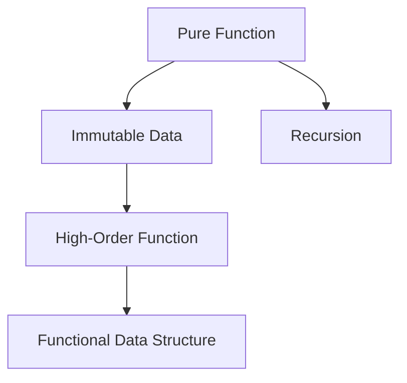

                 

# 函数式编程：在现代开发中的应用

## 1. 背景介绍

### 1.1 问题由来
在过去的几十年里，函数式编程（Functional Programming, FP）一直是一种神秘而又迷人的编程范式。与命令式编程不同，函数式编程以数据流和不可变性为核心原则，强调简洁性、纯函数性和不可变性，旨在构建出高度抽象、模块化和易于维护的代码。

尽管如此，函数式编程并非主流开发范式，很多人对其概念感到陌生。然而，随着云计算、大数据、人工智能等领域的飞速发展，函数式编程的理念和方法逐渐被纳入现代软件开发的主流范式中，特别是对微服务、分布式系统、并发编程等场景，函数式编程展现出了其独特的优势。

### 1.2 问题核心关键点
本文将围绕以下几个关键问题展开：

- 函数式编程的核心原则是什么？
- 函数式编程如何应用于现代开发？
- 函数式编程有哪些优势和挑战？
- 函数式编程在实际应用中遇到了哪些问题和解决方案？

回答这些问题，不仅能够帮助开发者理解函数式编程的精髓，还能够指导其在现代软件开发中的具体实践，推动技术的持续发展和进步。

## 2. 核心概念与联系

### 2.1 核心概念概述

为了更好地理解函数式编程的精髓，我们需要先明确几个核心概念：

- **纯函数**：一个函数只有在输入一定的情况下，才会产生相同的输出，且不会有外部依赖和副作用。纯函数可以并行执行，并且更容易进行测试和维护。

- **不可变性**：数据一旦创建，就不能被修改，所有的操作都是通过创建新的数据来实现。这种不可变性保证了数据的一致性和线程安全。

- **函数式数据结构**：诸如列表、树、图等数据结构，其内部操作都是通过创建新的数据结构来实现的。

- **高阶函数**：可以接受函数作为参数，也可以返回函数作为结果。

- **递归**：通过函数自身来调用自身，解决重复性的问题，能够提高代码的简洁性和可读性。

### 2.2 核心概念原理和架构的 Mermaid 流程图

以下是关于函数式编程核心概念原理和架构的 Mermaid 流程图：



这个图表展示了一个纯函数作用于不可变数据，并通过高阶函数和递归等特性，构建出功能强大且易于维护的函数式编程架构。

## 3. 核心算法原理 & 具体操作步骤
### 3.1 算法原理概述

函数式编程的核心算法原理主要包括以下几个方面：

- **函数组合**：通过将多个函数组合在一起，实现复杂的业务逻辑。这种组合可以按照顺序、并行、管道等方式进行。

- **模式匹配**：使用模式匹配来匹配输入数据，并执行相应的操作。这种技术能够提高代码的可读性和简洁性。

- **惰性求值**：只计算那些真正需要计算的值，避免不必要的计算，提高效率。

- **不可变性**：保证数据的不变性，减少并发编程中的数据竞争和错误。

- **一等函数**：将函数视为一等公民，可以像其他数据类型一样进行传递、组合和应用。

### 3.2 算法步骤详解

以下是函数式编程的典型算法步骤：

1. **数据抽象**：将复杂的数据结构通过函数式编程的方式进行抽象，如列表、树、图等数据结构。

2. **函数定义**：定义纯函数，确保函数的输入和输出具有确定性，没有外部依赖和副作用。

3. **模式匹配**：根据数据结构的特点，使用模式匹配技术，匹配输入数据，并执行相应的操作。

4. **惰性求值**：对于复杂的数据处理任务，通过惰性求值技术，只计算真正需要计算的值，提高代码的简洁性和效率。

5. **函数组合**：通过组合多个函数，实现复杂的业务逻辑，提高代码的模块化和可维护性。

6. **递归和尾递归优化**：使用递归处理重复性任务，通过尾递归优化提高代码的效率和可读性。

### 3.3 算法优缺点

函数式编程具有以下优点：

- **代码简洁**：通过函数组合和模式匹配，能够构建出简洁、可读性高的代码。

- **易于测试**：纯函数和不可变性保证了代码的独立性和可测试性。

- **高并发性能**：不可变性和惰性求值技术保证了并发编程的线程安全和高效性。

- **易于并发编程**：通过函数组合和不可变性，减少了并发编程中的数据竞争和错误。

然而，函数式编程也存在以下缺点：

- **学习曲线陡峭**：函数式编程的概念和语法比较抽象，初学者需要花费一定的时间进行理解和学习。

- **性能问题**：对于一些复杂的业务逻辑，函数式编程的性能可能不如命令式编程，尤其是在处理大规模数据时。

- **内存消耗**：函数式编程倾向于创建大量的中间数据结构，可能导致内存消耗较大。

### 3.4 算法应用领域

函数式编程在现代软件开发中广泛应用，特别是在以下几个领域：

- **微服务架构**：函数式编程的高并发性能和模块化特性，使得微服务架构能够更高效地处理分布式系统中的请求。

- **大数据处理**：函数式编程的数据抽象和惰性求值技术，能够更好地处理大数据集，减少内存消耗和计算资源的使用。

- **并发编程**：函数式编程的不可变性和惰性求值技术，能够保证并发编程的线程安全和高效性。

- **人工智能与机器学习**：函数式编程的不可变性和纯函数特性，使得数据处理和模型训练更加可靠和高效。

- **前端开发**：函数式编程的简洁性和易用性，使得前端开发能够构建出功能强大、易于维护的用户界面。

## 4. 数学模型和公式 & 详细讲解 & 举例说明

### 4.1 数学模型构建

函数式编程的数学模型通常使用数学逻辑函数（Mathematical Logic Functions）来表示。这些函数通常定义在λ演算（λ-calculus）中，用于描述函数的计算过程。

### 4.2 公式推导过程

在λ演算中，函数的定义和计算过程通常通过以下公式推导：

$$
f(x) = \lambda x.\ \text{[Body]}
$$

其中，$\lambda x.$ 表示函数的定义，Body 表示函数的计算过程。例如，一个简单的函数定义如下：

$$
add = \lambda x y.x + y
$$

这个函数用于计算两个数的和，其计算过程如下：

$$
add(2, 3) = 2 + 3 = 5
$$

### 4.3 案例分析与讲解

考虑一个复杂的业务逻辑，如计算一个对象的深度（Depth）：

```python
def depth(obj):
    if isinstance(obj, dict):
        return 1 + max(map(depth, obj.values()))
    elif isinstance(obj, list):
        return 1 + max(map(depth, obj))
    else:
        return 0
```

这段代码使用了递归和函数组合，能够计算出一个复杂对象（如嵌套字典或列表）的深度。通过函数组合和模式匹配，代码显得简洁明了，易于理解和维护。

## 5. 项目实践：代码实例和详细解释说明

### 5.1 开发环境搭建

为了进行函数式编程的实践，我们需要安装一些必要的工具和库：

1. 安装 Python：Python 是函数式编程的主要编程语言之一，需要安装最新版本。

2. 安装 PyPy：PyPy 是一个 Python 解释器，支持 JIT 编译和高级优化，性能较 Python 解释器更高。

3. 安装函数式编程相关的库：如 functools、itertools、operator 等，这些库提供了函数式编程相关的函数和工具。

4. 安装一些高级库：如 lodash、ramda 等，这些库提供了更多的函数式编程工具和功能。

### 5.2 源代码详细实现

下面是一个简单的函数式编程实践，用于计算一个列表的平均值：

```python
from functools import reduce

def average(lst):
    return reduce(lambda x, y: x + y, lst) / len(lst)
```

这个函数使用了 reduce 函数和 lambda 表达式，通过函数组合的方式计算了列表的平均值。

### 5.3 代码解读与分析

这段代码使用了 reduce 函数和 lambda 表达式，通过函数组合的方式计算了列表的平均值。reduce 函数用于对一个序列进行累积计算，而 lambda 表达式则用于定义计算过程。

## 6. 实际应用场景

### 6.1 微服务架构

函数式编程的高并发性能和模块化特性，使得微服务架构能够更高效地处理分布式系统中的请求。例如，在构建一个电商平台时，可以使用函数式编程的方式，将不同的服务模块（如用户管理、商品管理、订单管理等）分别封装成独立的函数或微服务，提高系统的可扩展性和可靠性。

### 6.2 大数据处理

函数式编程的数据抽象和惰性求值技术，能够更好地处理大数据集，减少内存消耗和计算资源的使用。例如，在处理大规模日志数据时，可以使用函数式编程的方式，通过惰性求值技术，只计算真正需要计算的值，避免不必要的计算，提高代码的简洁性和效率。

### 6.3 并发编程

函数式编程的不可变性和惰性求值技术，能够保证并发编程的线程安全和高效性。例如，在构建一个多线程数据处理系统时，可以使用函数式编程的方式，通过不可变性和惰性求值技术，避免数据竞争和错误，提高系统的并发性能。

### 6.4 未来应用展望

随着函数式编程的不断发展，其在现代软件开发中的应用前景将更加广阔。未来的函数式编程可能会与人工智能、机器学习等领域深度融合，推动这些技术的发展和应用。同时，函数式编程的简洁性和易用性，也将在前端开发、移动开发等领域得到更广泛的应用。

## 7. 工具和资源推荐

### 7.1 学习资源推荐

以下是一些推荐的函数式编程学习资源：

1. 《函数式编程：从零开始》：这是一本经典的函数式编程入门书籍，适合初学者阅读。

2. 《Eloquent JavaScript》：这本书不仅介绍了 JavaScript，还详细讲解了函数式编程的概念和实现方法。

3. 《Haskell 程序设计》：这是一本关于 Haskell 语言的书籍，适合想要深入学习函数式编程的读者。

4. Coursera 上的《Functional Programming in Scala》课程：这是一个关于 Scala 语言的函数式编程课程，适合想要学习 Scala 的开发者。

5. Functional Programming Patterns：这是一本关于函数式编程模式的书，适合想要深入理解函数式编程模式的开发者。

### 7.2 开发工具推荐

以下是一些推荐的函数式编程开发工具：

1. PyPy：Python 解释器，支持 JIT 编译和高级优化，性能较 Python 解释器更高。

2. JavaScript 的函数式编程库：如 Ramda、Lodash 等，这些库提供了更多的函数式编程工具和功能。

3. Haskell 编译器：如 GHC 等，用于编译 Haskell 代码。

4. Emacs：一个功能强大的编辑器，支持函数式编程和 Emacs Lisp 脚本。

5. VSCode：一个现代化的编辑器，支持多种编程语言和插件，能够提高开发效率。

### 7.3 相关论文推荐

以下是一些关于函数式编程的著名论文：

1. "Why Functional Programming Matters" by Aleksey Nikhov：这篇文章探讨了函数式编程的优势和挑战，适合初学者阅读。

2. "Functional Programming: Principles and Patterns" by Paul McJones：这是一本关于函数式编程的书籍，详细讲解了函数式编程的原则和模式。

3. "Eager, Lazy, and Functional" by Bob Ippolito：这篇文章探讨了函数式编程中的惰性求值和延迟求值，适合深入理解函数式编程的开发者。

4. "Unification and Logic Programming" by Richard S. Kowalski：这篇文章探讨了函数式编程与逻辑编程的关系，适合想要深入理解函数式编程的开发者。

## 8. 总结：未来发展趋势与挑战

### 8.1 研究成果总结

函数式编程作为一种重要的编程范式，已经广泛应用于现代软件开发中。其主要优势在于其简洁性、易用性和高并发性能。然而，函数式编程的学习曲线较陡峭，且在一些复杂的业务场景下，性能可能不如命令式编程。

### 8.2 未来发展趋势

未来的函数式编程将会与更多的领域深度融合，推动这些领域的技术进步。例如，函数式编程与人工智能、机器学习等领域的结合，将会带来更加高效和可靠的技术解决方案。同时，函数式编程的简洁性和易用性，将会在前端开发、移动开发等领域得到更广泛的应用。

### 8.3 面临的挑战

函数式编程在实际应用中仍然面临一些挑战，包括学习曲线陡峭、性能问题、内存消耗等。如何解决这些问题，提升函数式编程的应用范围和性能，将是未来的研究方向之一。

### 8.4 研究展望

未来的函数式编程研究将会在以下几个方向展开：

1. 函数式编程与人工智能的结合：通过函数式编程的不可变性和纯函数特性，推动人工智能和机器学习技术的发展和应用。

2. 函数式编程与并发编程的结合：通过函数式编程的不可变性和惰性求值技术，提升并发编程的效率和可靠性。

3. 函数式编程与大数据处理的结合：通过函数式编程的数据抽象和惰性求值技术，提升大数据处理的能力和效率。

4. 函数式编程与云计算的结合：通过函数式编程的模块化和可扩展性，推动云计算技术的发展和应用。

5. 函数式编程与前端开发的结合：通过函数式编程的简洁性和易用性，提升前端开发的效率和质量。

这些方向的研究和探索，将会推动函数式编程技术的持续发展和应用，为未来的软件开发提供更加强大和可靠的解决方案。

## 9. 附录：常见问题与解答

**Q1：函数式编程如何保证数据的一致性？**

A: 函数式编程通过不可变性和惰性求值技术，保证了数据的一致性和线程安全。数据一旦创建，就不能被修改，所有的操作都是通过创建新的数据来实现。这种不可变性保证了数据的一致性和线程安全。

**Q2：函数式编程的性能问题如何解决？**

A: 函数式编程的性能问题可以通过优化代码结构和使用高效的数据结构来解决。例如，使用惰性求值技术，只计算真正需要计算的值，避免不必要的计算。使用高效的数据结构，如不可变列表、集合等，减少内存消耗和计算资源的使用。

**Q3：函数式编程与命令式编程的区别是什么？**

A: 函数式编程和命令式编程的主要区别在于处理数据的方式和思想的差异。函数式编程以数据流和不可变性为核心原则，强调简洁性、纯函数性和不可变性；而命令式编程则强调顺序执行和变量的状态变化。

**Q4：函数式编程的优缺点是什么？**

A: 函数式编程的优点在于其简洁性、易用性和高并发性能。纯函数和不可变性保证了代码的独立性和可测试性。高并发性能和模块化特性使得函数式编程能够更好地处理分布式系统和并发编程中的问题。然而，函数式编程的学习曲线较陡峭，且在一些复杂的业务场景下，性能可能不如命令式编程。

**Q5：函数式编程与面向对象编程的区别是什么？**

A: 函数式编程和面向对象编程的主要区别在于处理数据的方式和思想的差异。函数式编程以数据流和不可变性为核心原则，强调简洁性、纯函数性和不可变性；而面向对象编程则强调封装、继承和多态性。函数式编程更适合处理函数式编程适用的场景，如大数据处理、并发编程等。面向对象编程则更适合处理面向对象编程适用的场景，如大型应用程序、企业级系统等。

通过本文的系统梳理，我们可以看到函数式编程在现代软件开发中的重要作用和优势。函数式编程不仅能够提高代码的简洁性和易用性，还能够提升系统的并发性能和可靠性。然而，函数式编程的学习曲线较陡峭，且在一些复杂的业务场景下，性能可能不如命令式编程。未来的函数式编程研究将会结合更多的领域，推动技术的发展和应用，为软件开发提供更加强大和可靠的解决方案。

---

作者：禅与计算机程序设计艺术 / Zen and the Art of Computer Programming

