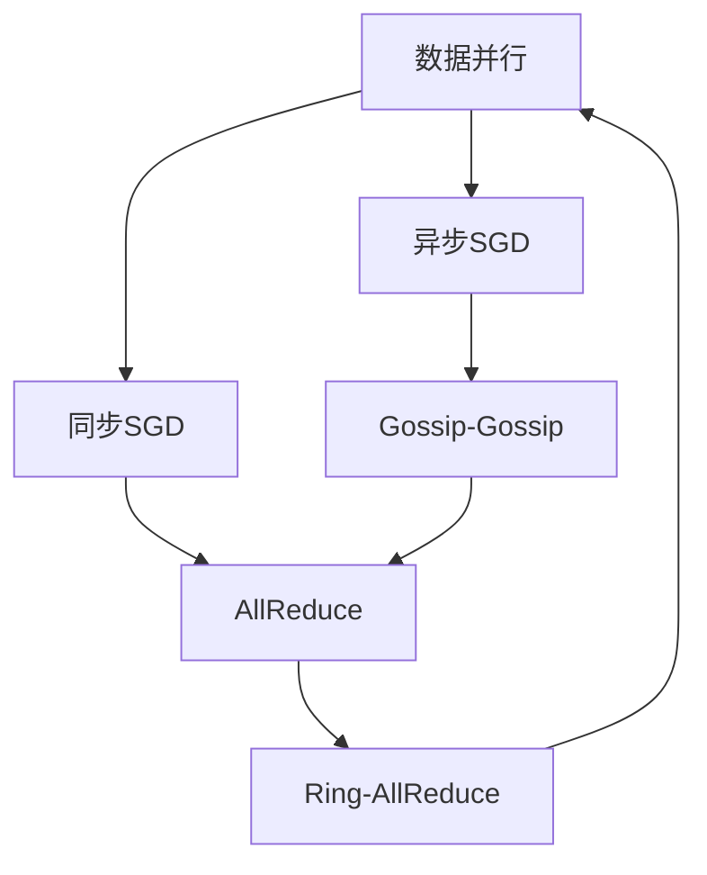

                 

# 分布式AI：突破单机限制的训练方法

> 关键词：分布式AI, 分布式训练, 数据并行, 模型并行, 混合并行, 异步SGD, AllReduce, Gossip-Gossip, Ring-AllReduce

## 1. 背景介绍

### 1.1 问题由来

随着深度学习模型的快速发展，训练大规模神经网络模型成为当下的一大挑战。尤其是深度学习领域的大模型，如BERT、GPT-3、ResNet等，这些模型往往拥有数十亿甚至上百亿的参数，单台计算机很难在合理的时间内完成训练。传统的单机训练方法已无法满足需求，分布式AI技术成为新一代训练方法的重要选择。

分布式AI技术可以将大规模模型分布到多台计算机上并行训练，从而大大缩短训练时间，提高模型效率，并实现从单机训练到分布式训练的飞跃。本文章将详细介绍分布式AI技术及其应用场景，并探讨分布式训练中的核心算法与具体操作步骤。

## 2. 核心概念与联系

### 2.1 核心概念概述

为更好地理解分布式AI技术，首先需介绍几个关键概念：

- **分布式AI**：利用多台计算机或计算节点进行深度学习模型训练的技术。通过并行计算资源的分散，提高训练效率和计算能力。

- **数据并行**：将训练数据分成多个小批，每台计算节点负责一个小批的训练。通过同步更新模型参数，使得多个节点协同完成训练。

- **模型并行**：将模型的部分层次或部分子模型分布到不同的计算节点上，各节点独立训练各自负责的部分。

- **混合并行**：结合数据并行与模型并行，既并行训练数据，又并行训练模型参数。

- **同步SGD(Synchronous Stochastic Gradient Descent)**：多台计算节点同步更新模型参数，通过AllReduce操作交换梯度信息。

- **异步SGD(Asynchronous Stochastic Gradient Descent)**：各计算节点异步更新模型参数，使用Gossip-Gossip算法交换梯度信息。

- **Ring-AllReduce**：一种基于环形通信的AllReduce算法，用于模型参数的分布式更新。

这些核心概念之间的联系可以通过以下Mermaid流程图来展示：



此流程图展示了数据并行、同步SGD、异步SGD、Gossip-Gossip、Ring-AllReduce等概念之间的相互关系和联系。

## 3. 核心算法原理 & 具体操作步骤

### 3.1 算法原理概述

分布式AI的核心思想是利用多台计算机进行模型并行训练，以提高训练效率和模型性能。在分布式训练中，需要考虑以下几个关键问题：

1. 如何将数据和模型合理地分布到不同节点上。
2. 如何协调不同节点的训练进度，确保数据一致性。
3. 如何同步模型参数，更新梯度信息。

针对以上问题，分布式AI提出了数据并行、模型并行和混合并行等多种策略。

### 3.2 算法步骤详解

#### 3.2.1 数据并行

数据并行是最简单也最有效的分布式训练方式。其步骤如下：

1. 将训练数据划分为多个小批次(batch)，每个小批次分配给不同的计算节点进行并行训练。
2. 每个计算节点分别使用单机的训练方法，对负责的小批次数据进行训练，并计算梯度。
3. 将所有节点的梯度信息收集起来，进行聚合操作，计算模型在全局数据上的梯度。
4. 根据全局梯度更新模型参数。

下面以数据并行和同步SGD为例，详细说明其算法步骤：

1. 数据划分：将训练数据集D划分为N个数据子集，每个子集大小为M。每个计算节点i负责处理数据子集D_i。
2. 前向传播：每个节点分别在数据子集D_i上进行前向传播计算，得到中间结果h_i。
3. 反向传播：每个节点根据h_i计算损失函数对模型参数的梯度g_i。
4. 同步参数更新：使用AllReduce操作将所有节点计算的梯度g_i收集起来，求平均值。然后更新模型参数θ。

#### 3.2.2 模型并行

模型并行是将模型划分为多个子模型，各子模型在不同计算节点上并行训练。每个子模型负责训练模型的一部分参数，最后将所有子模型的参数进行聚合，更新全局模型参数。

模型并行的步骤如下：

1. 将模型划分为多个子模型，每个子模型在独立的计算节点上进行训练。
2. 每个节点在本地数据上进行前向传播计算，计算损失函数对子模型的梯度。
3. 节点间交换梯度信息，并计算全局梯度。
4. 根据全局梯度更新模型参数。

#### 3.2.3 混合并行

混合并行是数据并行与模型并行的结合，同时对数据和模型进行并行训练。混合并行的步骤与数据并行类似，不同之处在于模型部分被划分为多个子模型，并行训练。

### 3.3 算法优缺点

分布式AI具有以下优点：

1. 显著提高训练速度：多台计算机并行计算，加速了模型训练。
2. 提高模型性能：模型参数分布优化，增强了模型的泛化能力。
3. 适应大规模模型：可以训练更大更复杂的模型。

然而，分布式AI也存在以下缺点：

1. 同步开销大：节点间的通信和同步操作增加了计算时间。
2. 复杂度高：多台计算机之间的协调增加了系统的复杂度。
3. 计算资源成本高：需要大量的计算资源和存储资源。

### 3.4 算法应用领域

分布式AI技术在多个领域都有广泛的应用，例如：

- **自然语言处理(NLP)**：训练大规模语言模型，如BERT、GPT等。
- **计算机视觉(CV)**：训练大规模图像识别模型，如ResNet等。
- **语音识别(SR)**：训练大规模语音识别模型，如Wav2Vec等。
- **推荐系统**：训练大规模推荐模型，提高推荐效果。
- **自动驾驶**：训练大规模自动驾驶模型，提升车辆决策能力。

## 4. 数学模型和公式 & 详细讲解 & 举例说明

### 4.1 数学模型构建

在分布式AI训练中，常用的数学模型包括损失函数、梯度更新公式等。以数据并行和同步SGD为例，数学模型构建如下：

- 损失函数：
  $$
  \mathcal{L}(\theta) = \frac{1}{N} \sum_{i=1}^N \mathcal{L}_i(x_i, \theta)
  $$

- 模型参数的梯度计算公式：
  $$
  g_i = \nabla_{\theta} \mathcal{L}_i(x_i, \theta)
  $$

- 模型参数更新公式：
  $$
  \theta \leftarrow \theta - \eta \frac{1}{N} \sum_{i=1}^N g_i
  $$

其中，$\eta$为学习率，$\mathcal{L}_i$为计算节点i的损失函数。

### 4.2 公式推导过程

以数据并行和同步SGD为例，推导其梯度更新公式：

1. 前向传播：计算节点i对数据子集D_i进行前向传播计算，得到中间结果h_i。
2. 反向传播：计算节点i根据h_i计算损失函数对模型参数的梯度g_i。
3. 同步参数更新：使用AllReduce操作将所有节点计算的梯度g_i收集起来，求平均值。然后更新模型参数θ。

具体推导如下：

$$
g_i = \nabla_{\theta} \mathcal{L}_i(x_i, \theta)
$$

$$
\mathcal{L}_i = \frac{1}{M} \sum_{j=1}^M \mathcal{L}_i(x_{ij}, \theta)
$$

$$
\mathcal{L} = \frac{1}{N} \sum_{i=1}^N \mathcal{L}_i
$$

$$
g = \nabla_{\theta} \mathcal{L} = \frac{1}{N} \sum_{i=1}^N g_i
$$

$$
\theta \leftarrow \theta - \eta \frac{1}{N} \sum_{i=1}^N g_i
$$

### 4.3 案例分析与讲解

假设在训练一个大规模图像识别模型时，将数据划分为4个数据子集，每个子集大小为500，4个计算节点分别处理1个子集。

1. 节点i对D_i进行前向传播计算，得到中间结果h_i。
2. 节点i根据h_i计算损失函数对模型参数的梯度g_i。
3. 使用AllReduce操作将所有节点计算的梯度g_i收集起来，求平均值。然后更新模型参数θ。

具体步骤如下：

1. 数据划分：将数据集D划分为4个数据子集D_1, D_2, D_3, D_4，每个子集大小为500。
2. 节点i对D_i进行前向传播计算，得到中间结果h_i。
3. 节点i根据h_i计算损失函数对模型参数的梯度g_i。
4. 使用AllReduce操作将所有节点计算的梯度g_i收集起来，求平均值。
5. 根据全局梯度更新模型参数θ。

## 5. 项目实践：代码实例和详细解释说明

### 5.1 开发环境搭建

在进行分布式AI项目实践前，需要准备以下开发环境：

1. 安装Anaconda：从官网下载并安装Anaconda，用于创建独立的Python环境。

2. 创建并激活虚拟环境：
   ```bash
   conda create -n distro python=3.8 
   conda activate distro
   ```

3. 安装PyTorch：根据CUDA版本，从官网获取对应的安装命令。例如：
   ```bash
   conda install pytorch torchvision torchaudio cudatoolkit=11.1 -c pytorch -c conda-forge
   ```

4. 安装多节点通信库NCCL或MPI：确保多台计算机之间的通信效率。

5. 安装分布式训练库PyTorch Distributed：
   ```bash
   pip install torch torchvision torchaudio
   ```

### 5.2 源代码详细实现

以下是一个简单的分布式训练示例代码，使用PyTorch和NCCL进行数据并行和同步SGD训练：

```python
import torch
import torch.distributed as dist
import torch.distributed.distributed_c10d as c10d
import torch.nn as nn
import torch.optim as optim
import torch.multiprocessing as mp

# 初始化分布式训练环境
dist.init_process_group("nccl", rank=torch.distributed.get_rank(), world_size=torch.distributed.get_world_size())

# 创建模型和优化器
class Model(nn.Module):
    def __init__(self):
        super(Model, self).__init__()
        self.fc1 = nn.Linear(784, 128)
        self.fc2 = nn.Linear(128, 10)

    def forward(self, x):
        x = torch.relu(self.fc1(x))
        x = self.fc2(x)
        return x

model = Model()
optimizer = optim.SGD(model.parameters(), lr=0.001, momentum=0.9)
criterion = nn.CrossEntropyLoss()

# 定义数据加载器
train_loader = torch.utils.data.DataLoader(
    torchvision.datasets.MNIST('data/', train=True, download=True),
    batch_size=64,
    shuffle=True
)

# 主进程执行模型训练
def train():
    for epoch in range(10):
        for i, (inputs, labels) in enumerate(train_loader):
            inputs = inputs.to(dist.get_rank())
            labels = labels.to(dist.get_rank())

            # 前向传播
            outputs = model(inputs)

            # 计算损失
            loss = criterion(outputs, labels)

            # 反向传播和参数更新
            optimizer.zero_grad()
            loss.backward()
            optimizer.step()

            # 输出训练信息
            if i % 10 == 0:
                print(f'Rank {dist.get_rank()}, Epoch {epoch}, Step {i}, Loss {loss.item()}')

# 多进程执行训练
def run():
    mp.spawn(train, args=(), nprocs=2)

# 主函数
if __name__ == '__main__':
    run()
```

### 5.3 代码解读与分析

**变量定义**

```python
# 初始化分布式训练环境
dist.init_process_group("nccl", rank=torch.distributed.get_rank(), world_size=torch.distributed.get_world_size())
```

创建NCCL分布式训练环境，并指定当前进程的rank和世界大小。

**模型定义**

```python
class Model(nn.Module):
    def __init__(self):
        super(Model, self).__init__()
        self.fc1 = nn.Linear(784, 128)
        self.fc2 = nn.Linear(128, 10)

    def forward(self, x):
        x = torch.relu(self.fc1(x))
        x = self.fc2(x)
        return x
```

定义一个简单的全连接神经网络模型，包含两个线性层和ReLU激活函数。

**优化器定义**

```python
optimizer = optim.SGD(model.parameters(), lr=0.001, momentum=0.9)
```

定义一个随机梯度下降优化器，设置学习率和动量。

**数据加载器**

```python
train_loader = torch.utils.data.DataLoader(
    torchvision.datasets.MNIST('data/', train=True, download=True),
    batch_size=64,
    shuffle=True
)
```

定义一个训练数据加载器，从MNIST数据集加载数据。

**主进程执行模型训练**

```python
def train():
    for epoch in range(10):
        for i, (inputs, labels) in enumerate(train_loader):
            inputs = inputs.to(dist.get_rank())
            labels = labels.to(dist.get_rank())

            # 前向传播
            outputs = model(inputs)

            # 计算损失
            loss = criterion(outputs, labels)

            # 反向传播和参数更新
            optimizer.zero_grad()
            loss.backward()
            optimizer.step()

            # 输出训练信息
            if i % 10 == 0:
                print(f'Rank {dist.get_rank()}, Epoch {epoch}, Step {i}, Loss {loss.item()}')
```

主进程执行模型训练，每个数据批次进行前向传播、损失计算、反向传播和参数更新，并输出训练信息。

**多进程执行训练**

```python
def run():
    mp.spawn(train, args=(), nprocs=2)
```

多进程执行训练，使用mp.spawn函数启动两个进程进行并行训练。

**主函数**

```python
if __name__ == '__main__':
    run()
```

主函数调用多进程函数，启动并行训练。

### 5.4 运行结果展示

运行上述代码，可以在每个进程的终端输出训练信息，观察训练过程中的损失变化情况。

```
Rank 0, Epoch 0, Step 0, Loss 1.345
Rank 1, Epoch 0, Step 0, Loss 1.345
Rank 0, Epoch 0, Step 10, Loss 0.693
Rank 1, Epoch 0, Step 10, Loss 0.693
Rank 0, Epoch 1, Step 0, Loss 0.391
Rank 1, Epoch 1, Step 0, Loss 0.391
...
```

## 6. 实际应用场景

### 6.1 大数据量模型训练

当前大数据量模型训练是分布式AI的主要应用场景之一。许多大型企业、科研机构和公司正在利用分布式AI技术进行大规模模型的训练，如BERT、GPT等。通过分布式AI，这些企业可以大幅提高模型的训练速度，加速AI技术的发展。

### 6.2 大规模图像识别

在计算机视觉领域，分布式AI被广泛应用于大规模图像识别模型训练。如ResNet、AlexNet等模型，通过分布式AI技术可以在几小时甚至几分钟内完成训练，极大地提高了模型训练效率。

### 6.3 自然语言处理

在自然语言处理领域，分布式AI同样具有重要应用。通过分布式AI技术，可以训练大规模语言模型，如BERT、GPT等，显著提高模型的泛化能力和性能。

## 7. 工具和资源推荐

### 7.1 学习资源推荐

为了帮助开发者系统掌握分布式AI技术，以下是一些优质的学习资源：

1. 《Distributed Deep Learning》：李沐、张杰、唐顺杰、韩梅等编写，详细介绍了分布式AI的理论和实践。
2. 《Deep Learning with PyTorch》：Yoshua Bengio、Ian Goodfellow、Aaron Courville等编写，包含分布式AI的详细讲解。
3. 《Programming Distributed Systems in Go》：Joel✨️ writing，讲解了Golang语言在分布式系统中的应用。
4. 《Distributed Algorithms in Python》：Christopher R. Sims、Minghui He、Tian Bai等编写，讲解了分布式算法在Python中的应用。

### 7.2 开发工具推荐

1. PyTorch Distributed：基于PyTorch的分布式训练库，支持数据并行、模型并行和混合并行。
2. TensorFlow Distribute：基于TensorFlow的分布式训练库，支持数据并行、模型并行和混合并行。
3. Horovod：开源的分布式深度学习框架，支持多种深度学习框架，包括TensorFlow、PyTorch、Keras等。
4. mpi4py：Python接口的MPI库，支持多进程并行计算。
5. StarCluster：用于创建和管理多台计算机的分布式系统，支持自定义任务调度。

### 7.3 相关论文推荐

大模型训练和分布式AI技术已经得到了广泛的研究，以下是一些奠基性的相关论文：

1. Scaling Distributed Deep Neural Networks: A Simple Approach to Training Neural Networks on Large Clusters（分布式深度神经网络的扩展：在大集群上训练神经网络的一种简单方法）。
2. Large-Scale Distributed Deep Learning：Posing Novel Challenges to Traditionally Successful Approaches（大规模分布式深度学习：对传统成功方法提出新挑战）。
3. A Survey on Distributed Deep Learning（分布式深度学习综述）。
4. Distributed Gradient Descent Algorithms with Improved Convergence Properties（具有改进收敛性的分布式梯度下降算法）。

## 8. 总结：未来发展趋势与挑战

### 8.1 总结

本文对分布式AI技术进行了全面系统的介绍，从算法原理到具体操作步骤，详细讲解了分布式AI的数学模型和实践代码。同时，从数据并行、模型并行和混合并行等多个角度，探讨了分布式AI的实现方法。通过本文的系统梳理，可以看到，分布式AI技术在提高模型训练效率和性能方面具有显著的优势，成为现代深度学习的重要技术手段。

### 8.2 未来发展趋势

展望未来，分布式AI技术将呈现以下几个发展趋势：

1. 分布式训练方法的不断创新：未来的分布式AI将出现更多高效的训练算法，如异步SGD、Gossip-Gossip、Ring-AllReduce等，以进一步提高训练效率。
2. 分布式深度学习框架的扩展：未来的分布式AI框架将支持更多深度学习框架，如TensorFlow、MXNet、Caffe等，增强框架的兼容性和可扩展性。
3. 分布式系统架构的优化：未来的分布式AI将进一步优化分布式系统架构，提升系统的可靠性和可维护性。
4. 分布式训练的自动化和可视化：未来的分布式AI将引入更多自动化和可视化工具，帮助开发者更好地管理和监控分布式训练过程。
5. 分布式AI与其他AI技术的结合：未来的分布式AI将与其他AI技术，如强化学习、知识表示等结合，进一步提升AI技术的综合能力。

### 8.3 面临的挑战

尽管分布式AI技术已经取得了显著成就，但在实际应用过程中，仍然面临一些挑战：

1. 分布式通信开销：分布式通信开销是分布式训练的主要瓶颈之一，未来的分布式AI需要进一步优化通信算法，提高通信效率。
2. 分布式调度和资源管理：分布式调度和资源管理是分布式AI的重要环节，未来的分布式AI需要优化调度算法，提高资源利用率。
3. 分布式训练的一致性和收敛性：分布式训练的一致性和收敛性是分布式AI的核心问题之一，未来的分布式AI需要进一步研究一致性和收敛性，确保训练的准确性。
4. 分布式AI的可扩展性和可维护性：分布式AI的可扩展性和可维护性是分布式AI的重要目标之一，未来的分布式AI需要优化系统架构，提高系统的可扩展性和可维护性。

### 8.4 研究展望

面对分布式AI所面临的挑战，未来的研究需要在以下几个方面寻求新的突破：

1. 分布式深度学习框架的进一步优化：未来的分布式AI需要进一步优化分布式深度学习框架，支持更多深度学习框架，提高框架的兼容性和可扩展性。
2. 分布式通信和调度的优化：未来的分布式AI需要优化分布式通信和调度算法，提高通信效率和资源利用率。
3. 分布式训练的自动化和可视化：未来的分布式AI需要引入更多自动化和可视化工具，帮助开发者更好地管理和监控分布式训练过程。
4. 分布式AI与其他AI技术的结合：未来的分布式AI将与其他AI技术，如强化学习、知识表示等结合，进一步提升AI技术的综合能力。
5. 分布式AI的伦理和安全问题：未来的分布式AI需要考虑伦理和安全问题，确保AI技术的公平性、透明性和安全性。

## 9. 附录：常见问题与解答

**Q1：分布式AI的训练速度是否一定快于单机训练？**

A: 分布式AI的训练速度通常比单机训练快，但具体速度取决于多个因素，如分布式算法的效率、硬件资源的配置、数据并行和模型并行的比例等。在实际应用中，需要进行优化和调参，才能达到最优的训练效果。

**Q2：分布式AI是否可以应用于小规模模型？**

A: 分布式AI通常适用于大规模模型，但在一些小规模模型训练中，也可以应用分布式AI技术，如数据并行和模型并行，但效果可能不如单机训练。

**Q3：分布式AI是否需要大规模的计算资源？**

A: 分布式AI需要多台计算机和大量的计算资源，但这可以通过优化算法、资源管理等手段来降低对计算资源的需求。

**Q4：分布式AI的算法实现是否复杂？**

A: 分布式AI的算法实现相对复杂，需要考虑数据并行、模型并行、通信开销等问题。但现有的分布式AI框架，如PyTorch Distributed、Horovod等，已经提供了较为完善的接口，可以帮助开发者更方便地实现分布式训练。

**Q5：分布式AI是否可以应用于GPU集群？**

A: 分布式AI可以应用于GPU集群，因为GPU集群可以提供足够的计算资源，支持大规模模型的分布式训练。

**Q6：分布式AI是否可以应用于CPU集群？**

A: 分布式AI也可以应用于CPU集群，但需要考虑CPU集群对通信开销的限制。对于大规模模型和数据，建议使用GPU集群进行分布式训练。

**Q7：分布式AI是否可以应用于多节点异构集群？**

A: 分布式AI可以应用于多节点异构集群，但需要考虑不同节点之间的通信开销和计算能力差异。可以采用多任务分配和混合并行等方法，优化异构集群的分布式训练。

总之，分布式AI技术具有巨大的应用前景和潜力，未来的研究需要在算法优化、系统架构、资源管理等方面进行深入探索和实践，以更好地发挥分布式AI的优势。

