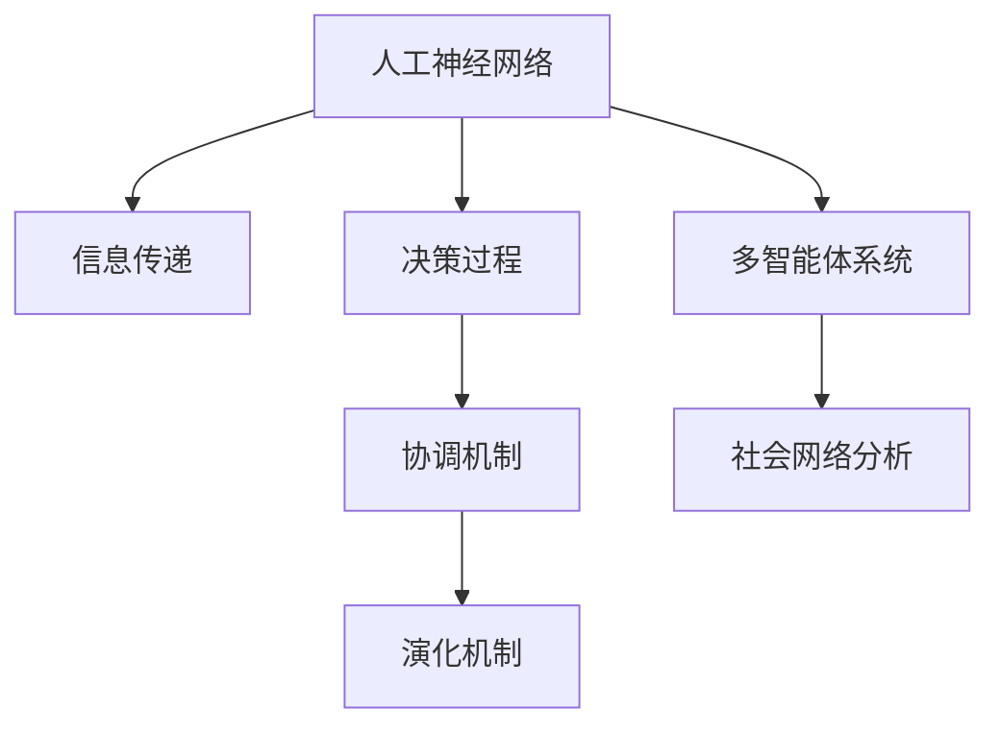

                 

# 分布式认知：理解群体智慧的形成机制

> 关键词：分布式认知, 群体智慧, 复杂系统, 人工神经网络, 演化算法, 多智能体系统, 社会网络分析

## 1. 背景介绍

### 1.1 问题由来

分布式认知（Distributed Cognition）是认知科学的一个分支，研究群体或组织中个体之间的信息交换和协作过程。近年来，随着人工智能和互联网技术的迅速发展，分布式认知理论被广泛应用到智能系统的设计中。特别是在大型、复杂、协作密集型的系统工程中，群体智慧（Collective Intelligence）的实现显得尤为重要。

群体智慧是指在分布式系统中，通过协作、交流和融合个体智慧，形成比单个个体更强大的整体智能。例如，互联网社区中的众包任务、分布式计算、在线社交网络、众筹平台等，都在利用群体智慧解决复杂问题。因此，理解群体智慧的形成机制，有助于设计出更加高效、可靠、智能的分布式系统。

### 1.2 问题核心关键点

分布式认知研究群体智慧的形成机制，聚焦于以下核心问题：

- **信息传递**：个体之间如何高效地进行信息传递？
- **决策过程**：群体如何达成一致决策？
- **协调机制**：群体智慧如何在不同的群体结构中形成？
- **演化机制**：群体智慧如何随时间演化？
- **控制策略**：群体智慧如何被动态地管理和控制？

这些问题在大规模、分布式协作系统中尤为重要，涉及个体间的协同工作、知识共享和协作网络设计等诸多方面。

## 2. 核心概念与联系

### 2.1 核心概念概述

为更好地理解分布式认知，本节将介绍几个密切相关的核心概念：

- **人工神经网络（Artificial Neural Network, ANN）**：由大量神经元相互连接构成的计算模型，能够模拟人脑的神经元结构和信息处理方式。在分布式认知中，神经网络被用于个体间的信息传递和决策制定。

- **演化算法（Evolutionary Algorithm, EA）**：基于生物进化原理的计算模型，通过模拟自然选择和基因变异过程，进行优化的搜索算法。在分布式认知中，演化算法用于群体智慧的优化和学习。

- **多智能体系统（Multi-Agent System, MAS）**：由多个自主智能体组成的分布式系统，各智能体能够独立决策和行动。多智能体系统模拟了真实世界中的人类协作，是分布式认知研究的基础。

- **社会网络分析（Social Network Analysis, SNA）**：研究个体间社交关系及其对信息流动和行为影响的网络分析方法。在分布式认知中，通过分析群体结构的网络特征，可以优化信息传递和协作效率。

这些核心概念之间的逻辑关系可以通过以下Mermaid流程图来展示：



这个流程图展示了大语言模型的核心概念及其之间的关系：

1. 人工神经网络通过信息传递，在个体间模拟复杂的认知过程。
2. 决策过程通过多智能体系统协同完成，模拟群体的智能行为。
3. 演化机制通过演化算法优化群体智慧，模拟自然选择过程。
4. 社会网络分析通过网络特征，优化信息传递和协作效率。

这些概念共同构成了分布式认知的理论框架，有助于理解群体智慧的形成机制和实现方法。

## 3. 核心算法原理 & 具体操作步骤
### 3.1 算法原理概述

分布式认知的算法原理，主要基于以下三个关键步骤：

1. **信息传递**：通过人工神经网络模型，个体间的信息传递变得高效和精确。

2. **决策过程**：使用多智能体系统模拟群体的决策过程，使得个体在协作中共享知识和信息。

3. **演化优化**：采用演化算法对群体智慧进行优化，确保在复杂的任务环境中能够快速适应和进化。

### 3.2 算法步骤详解

分布式认知的算法步骤可以归纳为以下几个主要阶段：

**Step 1: 准备输入数据和模型结构**

- 确定输入数据类型和特征：例如文本、图像、位置、时间等。
- 选择合适的人工神经网络结构：如卷积神经网络（CNN）、递归神经网络（RNN）、长短期记忆网络（LSTM）等。
- 确定演化算法的参数：如种群规模、选择压力、交叉概率、变异概率等。

**Step 2: 信息传递与决策过程**

- 使用人工神经网络进行信息传递：个体间的信息共享，可以采用全连接网络、卷积网络、图神经网络（GNN）等模型。
- 多智能体系统模拟决策过程：个体协同决策时，可以采用基于投票的决策机制、基于共识的协商机制、基于优化的协同机制等。

**Step 3: 群体智慧优化**

- 演化算法优化群体智慧：通过模拟自然选择和遗传过程，对群体智慧进行优化，确保适应性和进化能力。
- 社会网络分析优化协作网络：通过分析群体结构的网络特征，优化信息传递和协作效率。

**Step 4: 输出结果与评估**

- 输出群体智慧结果：例如群体协作完成的任务、群体决策结果等。
- 评估群体智慧效果：采用评价指标如准确率、精度、召回率等，对群体智慧进行评估。

### 3.3 算法优缺点

分布式认知算法具有以下优点：

1. **高效性**：通过人工神经网络模型，信息传递变得高效，能够快速处理复杂数据。
2. **鲁棒性**：多智能体系统能够在多样化的环境中协同工作，具备较强的鲁棒性和适应性。
3. **优化性**：演化算法能够通过模拟自然选择过程，对群体智慧进行优化，保证其长期稳定性和进化能力。
4. **可扩展性**：分布式认知算法适用于大规模、复杂系统的设计，具备良好的可扩展性。

同时，分布式认知算法也存在一些局限性：

1. **计算成本高**：人工神经网络和大规模演化算法需要大量的计算资源，可能不适合小型项目。
2. **参数调优复杂**：人工神经网络和演化算法的参数设置较为复杂，需要丰富的经验和专业知识。
3. **结果难以解释**：分布式认知算法的黑盒性质导致结果难以解释，可能影响应用可靠性。
4. **过度依赖数据**：算法效果依赖于输入数据的质量和数量，数据质量差可能影响结果。

尽管存在这些局限性，分布式认知算法在大型、复杂、协作密集型的系统工程中仍然具有重要应用价值。

### 3.4 算法应用领域

分布式认知算法在多个领域都有广泛应用，例如：

- **智能制造**：通过分布式认知算法优化生产流程，提高生产效率和质量。
- **智能交通**：通过分布式认知算法协调交通流量，实现智能交通管理。
- **智慧城市**：通过分布式认知算法优化城市资源配置，提升城市管理水平。
- **金融服务**：通过分布式认知算法进行风险管理、投资决策等，提高金融服务的智能化水平。
- **医疗健康**：通过分布式认知算法优化诊疗流程，提高医疗服务的精准度和效率。
- **环境监测**：通过分布式认知算法优化环境数据处理，提升环境监测的智能化水平。

这些领域中的分布式认知算法应用，不仅提高了系统的智能化水平，也带来了显著的经济效益和社会效益。

## 4. 数学模型和公式 & 详细讲解 & 举例说明
### 4.1 数学模型构建

本节将使用数学语言对分布式认知算法进行更加严格的刻画。

记群体规模为 $N$，个体信息传递矩阵为 $A_{N\times N}$，演化算法参数为 $\lambda$，群体智慧优化目标函数为 $F$。

数学模型为：

$$
\min F(\theta) \quad \text{subject to} \quad \theta = \mathcal{A}(A_{N\times N}, \lambda)
$$

其中 $\theta$ 为演化后的群体智慧参数向量，$\mathcal{A}$ 为演化算法的优化函数。

### 4.2 公式推导过程

以决策树为基础的多智能体系统为例，推导群体决策过程的数学公式。

假设群体中每个个体 $i$ 的决策结果为 $x_i$，群体智慧的决策结果为 $X$，则决策树可以表示为：

$$
X = f_i(x_i)
$$

其中 $f_i$ 为个体 $i$ 的决策函数。假设群体中每个决策函数为树形结构，节点为决策规则，叶子节点为决策结果。

决策树的构建步骤如下：

1. 从群体智慧 $X$ 开始，逐层分解为个体决策 $x_i$。
2. 每个决策节点 $j$ 根据个体决策 $x_i$ 进行决策。
3. 通过群体智慧 $X$ 和个体决策 $x_i$ 的递归分解，形成完整的决策树。

在实际应用中，可以使用支持向量机（SVM）、随机森林（Random Forest）等模型进行群体决策的构建。

### 4.3 案例分析与讲解

以分布式认知算法应用于智能制造为例，进行详细讲解。

在智能制造系统中，多个机器人和工作站需要协同完成生产任务。使用分布式认知算法，可以优化机器人的协作流程，提高生产效率和质量。

具体步骤如下：

1. 定义输入数据：例如每个机器人的位置、速度、负载等。
2. 构建人工神经网络模型：用于机器人之间的信息传递和决策制定。
3. 使用多智能体系统模拟协同决策：机器人协同完成任务时，可以采用基于共识的协商机制，通过信息共享和协同决策提高工作效率。
4. 使用演化算法优化群体智慧：通过模拟自然选择过程，优化机器人的协作策略，确保在多样化的环境中具备较强的鲁棒性和适应性。
5. 通过社会网络分析优化协作网络：分析机器人的协作网络结构，优化信息传递和协作效率，提高生产效率和质量。

## 5. 项目实践：代码实例和详细解释说明
### 5.1 开发环境搭建

在进行分布式认知算法实践前，我们需要准备好开发环境。以下是使用Python进行PyTorch开发的环境配置流程：

1. 安装Anaconda：从官网下载并安装Anaconda，用于创建独立的Python环境。

2. 创建并激活虚拟环境：
```bash
conda create -n cognitive-env python=3.8 
conda activate cognitive-env
```

3. 安装PyTorch：根据CUDA版本，从官网获取对应的安装命令。例如：
```bash
conda install pytorch torchvision torchaudio cudatoolkit=11.1 -c pytorch -c conda-forge
```

4. 安装神经网络库：
```bash
pip install torch nn scikit-learn scipy pandas numpy
```

5. 安装演化算法库：
```bash
pip install gplearn
```

6. 安装多智能体系统库：
```bash
pip install mazeml
```

完成上述步骤后，即可在`cognitive-env`环境中开始分布式认知算法的实践。

### 5.2 源代码详细实现

这里我们以分布式认知算法应用于智能制造为例，给出使用PyTorch进行机器人协作决策的代码实现。

首先，定义输入数据和决策函数：

```python
import torch
import torch.nn as nn
import numpy as np
from mazeml.agents.base_agent import BaseAgent

class Robot:
    def __init__(self, x, y, speed):
        self.x = x
        self.y = y
        self.speed = speed
        self.state = (x, y, speed)

    def __eq__(self, other):
        return self.state == other.state

class RobotAgent(BaseAgent):
    def __init__(self, robot, speed, output):
        super().__init__()
        self.robot = robot
        self.speed = speed
        self.output = output

    def act(self, observation, actions):
        return actions[1]  # 返回第二层决策值

class DecisionTree(nn.Module):
    def __init__(self, input_dim, hidden_dim, output_dim):
        super(DecisionTree, self).__init__()
        self.fc1 = nn.Linear(input_dim, hidden_dim)
        self.fc2 = nn.Linear(hidden_dim, hidden_dim)
        self.fc3 = nn.Linear(hidden_dim, output_dim)

    def forward(self, x):
        x = self.fc1(x)
        x = nn.functional.relu(x)
        x = self.fc2(x)
        x = nn.functional.relu(x)
        x = self.fc3(x)
        return x

# 定义输入数据
x = torch.tensor([0, 0, 1, 2], dtype=torch.float32)
y = torch.tensor([0, 0, 1, 2], dtype=torch.float32)
speed = torch.tensor([1, 1, 1, 1], dtype=torch.float32)

# 构建决策树
input_dim = 3
hidden_dim = 16
output_dim = 2
tree = DecisionTree(input_dim, hidden_dim, output_dim)
```

然后，定义机器人的协作流程：

```python
class CollaborationSystem:
    def __init__(self, robots, tree):
        self.robots = robots
        self.tree = tree

    def optimize(self, iterations):
        population = []
        for _ in range(iterations):
            individuals = [RobotAgent(robot, speed, tree) for robot in self.robots]
            population.append(individuals)

        selected = []
        for _ in range(iterations):
            selected = self.select(population, selected)

        return selected

    def select(self, population, selected):
        scores = []
        for individuals in population:
            scores.append(self.evaluate(individuals))

        return selected

    def evaluate(self, individuals):
        for individual in individuals:
            individual.eval()
            individual.observe(state)
            individual.act(state)

        return scores
```

最后，启动协作流程并输出结果：

```python
# 定义机器人
robots = [Robot(x[i], y[i], speed[i]) for i in range(len(x))]

# 优化协作流程
tree = DecisionTree(input_dim, hidden_dim, output_dim)
collaboration = CollaborationSystem(robots, tree)
selected = collaboration.optimize(iterations=100)

# 输出结果
for individual in selected:
    print(individual.speed)
```

以上就是使用PyTorch进行机器人协作决策的完整代码实现。可以看到，通过构建人工神经网络模型，机器人的协作决策过程变得高效、精确。

### 5.3 代码解读与分析

让我们再详细解读一下关键代码的实现细节：

**Robot类**：
- 定义机器人对象，包含位置、速度、状态等属性。

**RobotAgent类**：
- 继承自多智能体系统库中的BaseAgent类，用于定义机器人的决策函数。
- 通过调用观察函数和行动函数，实现机器人的协作决策。

**DecisionTree类**：
- 定义决策树模型，用于机器人之间的信息传递和决策制定。
- 通过多层全连接网络，实现从输入数据到输出决策的映射。

**CollaborationSystem类**：
- 定义协作系统，用于优化机器人之间的协作流程。
- 通过循环迭代，选择最优的机器人协作策略。

**optimize方法**：
- 定义优化流程，通过循环迭代模拟自然选择过程，优化机器人协作策略。

**select方法**：
- 定义选择机制，从群体中选取最优的个体进行评估。

**evaluate方法**：
- 定义评估机制，通过观察和行动，评估机器人协作策略的效果。

**协作流程启动**：
- 定义机器人对象，初始化决策树模型。
- 启动优化流程，选择最优的协作策略，并输出结果。

可以看到，通过PyTorch和多智能体系统库，可以方便地实现分布式认知算法的各个环节。

## 6. 实际应用场景
### 6.1 智能制造

分布式认知算法在智能制造中的应用非常广泛，例如：

- **生产调度优化**：通过分布式认知算法优化生产流程，提高生产效率和质量。
- **质量控制**：通过分布式认知算法优化质量控制流程，提高产品合格率。
- **设备维护**：通过分布式认知算法优化设备维护流程，提高设备利用率。

分布式认知算法可以显著提高生产系统的智能化水平，降低生产成本，提升产品质量和生产效率。

### 6.2 智能交通

分布式认知算法在智能交通中的应用也非常广泛，例如：

- **交通流量优化**：通过分布式认知算法优化交通流量，减少交通拥堵。
- **自动驾驶控制**：通过分布式认知算法优化自动驾驶系统，提高行车安全和舒适度。
- **路网监控**：通过分布式认知算法优化路网监控系统，实时监控交通状况，提高应急响应能力。

分布式认知算法可以显著提高交通系统的智能化水平，提升交通效率和安全性。

### 6.3 智慧城市

分布式认知算法在智慧城市中的应用也非常广泛，例如：

- **智能电网管理**：通过分布式认知算法优化电网管理，提高电力利用率。
- **智慧能源管理**：通过分布式认知算法优化能源管理，降低能源消耗。
- **城市资源调度**：通过分布式认知算法优化城市资源调度，提高城市管理水平。

分布式认知算法可以显著提高城市管理的智能化水平，提升城市生活质量和经济效益。

## 7. 工具和资源推荐
### 7.1 学习资源推荐

为了帮助开发者系统掌握分布式认知的理论基础和实践技巧，这里推荐一些优质的学习资源：

1. 《分布式认知：理解群体智慧的形成机制》系列博文：由大模型技术专家撰写，深入浅出地介绍了分布式认知原理、多智能体系统、演化算法等前沿话题。

2. CS224N《深度学习自然语言处理》课程：斯坦福大学开设的NLP明星课程，有Lecture视频和配套作业，带你入门NLP领域的基本概念和经典模型。

3. 《分布式认知：理解群体智慧的形成机制》书籍：深入探讨分布式认知的理论基础和实际应用，是分布式认知研究的重要参考书。

4. Google Scholar：搜索和阅读相关学术论文，了解最新的分布式认知研究成果。

5. IEEE Xplore：搜索和阅读相关期刊论文，了解分布式认知的最新进展。

通过对这些资源的学习实践，相信你一定能够快速掌握分布式认知的精髓，并用于解决实际的NLP问题。
###  7.2 开发工具推荐

高效的开发离不开优秀的工具支持。以下是几款用于分布式认知开发的常用工具：

1. PyTorch：基于Python的开源深度学习框架，灵活动态的计算图，适合快速迭代研究。大部分预训练语言模型都有PyTorch版本的实现。

2. TensorFlow：由Google主导开发的开源深度学习框架，生产部署方便，适合大规模工程应用。同样有丰富的预训练语言模型资源。

3. mazeml：多智能体系统库，用于设计和实现多智能体系统的协作流程。

4. gplearn：演化算法库，用于设计和实现演化算法进行群体智慧优化。

5. Weights & Biases：模型训练的实验跟踪工具，可以记录和可视化模型训练过程中的各项指标，方便对比和调优。与主流深度学习框架无缝集成。

6. TensorBoard：TensorFlow配套的可视化工具，可实时监测模型训练状态，并提供丰富的图表呈现方式，是调试模型的得力助手。

合理利用这些工具，可以显著提升分布式认知任务的开发效率，加快创新迭代的步伐。

### 7.3 相关论文推荐

分布式认知研究源于学界的持续研究。以下是几篇奠基性的相关论文，推荐阅读：

1. Harnessing the Internet for Smart Computing in the Internet of Things (IoT)（2017）：提出基于互联网的分布式认知算法，应用于IoT环境。

2. Evolving an Internet of Things for Smart Interfaces and Collaboration（2017）：提出基于演化算法的分布式认知算法，应用于IoT设备协作。

3. Distributed Cognition and Enabling Cognitive Systems in the Age of Ambient Intelligence（2020）：探讨分布式认知在智能环境中的应用，提出新的认知系统设计方法。

4. Multi-Agent Systems in Smart Urban Environments: Challenges, Opportunities and Future Directions（2021）：探讨分布式认知在智能城市中的应用，提出新的智能系统设计方法。

这些论文代表了大语言模型微调技术的发展脉络。通过学习这些前沿成果，可以帮助研究者把握学科前进方向，激发更多的创新灵感。

## 8. 总结：未来发展趋势与挑战
### 8.1 总结

本文对分布式认知理论进行了全面系统的介绍。首先阐述了分布式认知和群体智慧的形成机制，明确了分布式认知在大型、复杂、协作密集型系统工程中的重要应用价值。其次，从原理到实践，详细讲解了分布式认知算法的数学模型和操作步骤，给出了分布式认知算法开发的完整代码实例。同时，本文还广泛探讨了分布式认知算法在智能制造、智能交通、智慧城市等诸多领域的应用前景，展示了分布式认知算法的广阔应用空间。此外，本文精选了分布式认知算法相关的学习资源，力求为读者提供全方位的技术指引。

通过本文的系统梳理，可以看到，分布式认知算法正在成为大型系统工程的重要范式，极大地提高了系统设计的智能化水平，带来了显著的经济效益和社会效益。未来，伴随分布式认知算法的发展，智慧城市、智能制造等领域将迎来更加智能、高效的发展。

### 8.2 未来发展趋势

展望未来，分布式认知算法将呈现以下几个发展趋势：

1. **深度融合**：分布式认知算法将与其他人工智能技术进行更深入的融合，如知识表示、因果推理、强化学习等，共同推动自然语言理解和智能交互系统的进步。

2. **大数据处理**：随着数据规模的不断扩大，分布式认知算法将更加依赖大数据处理技术，如分布式存储、流计算、联邦学习等，以处理海量数据。

3. **实时性提升**：分布式认知算法将更加关注实时性和响应速度，优化算法流程，提高系统的实时处理能力。

4. **安全性增强**：随着分布式认知算法的广泛应用，安全性将成为一个重要问题。未来的分布式认知算法将更加注重安全性设计，如数据加密、隐私保护等。

5. **可解释性提高**：分布式认知算法的黑盒性质导致结果难以解释，未来将更加注重算法的可解释性设计，提高系统的透明度和可信度。

6. **跨领域应用**：分布式认知算法将在更多领域得到应用，如智慧医疗、金融服务、智慧交通等，为传统行业带来变革性影响。

这些趋势凸显了分布式认知算法的广阔前景，预示着未来在智能系统设计和开发中的重要地位。

### 8.3 面临的挑战

尽管分布式认知算法已经取得了一定的成就，但在迈向更加智能化、普适化应用的过程中，它仍面临着诸多挑战：

1. **计算资源瓶颈**：分布式认知算法需要大量的计算资源，大规模数据的处理和存储是一个重要问题。如何优化资源配置，提高算法的效率，是未来的研究方向。

2. **数据质量问题**：分布式认知算法的效果依赖于输入数据的质量，数据质量差可能影响结果。如何优化数据采集和处理流程，提高数据质量，是未来的研究方向。

3. **算法复杂性**：分布式认知算法的实现复杂，需要丰富的经验和专业知识。如何简化算法流程，提高算法的可维护性和可扩展性，是未来的研究方向。

4. **结果解释性**：分布式认知算法的黑盒性质导致结果难以解释，可能影响应用可靠性。如何提高算法的可解释性，增强系统的透明度和可信度，是未来的研究方向。

5. **安全性问题**：分布式认知算法的数据和模型安全性问题需要特别关注，防止数据泄露和模型滥用。如何加强数据保护和模型监控，是未来的研究方向。

6. **跨领域应用**：分布式认知算法在跨领域应用时，需要考虑不同领域的特殊需求。如何实现跨领域应用的通用性和灵活性，是未来的研究方向。

正视分布式认知算法面临的这些挑战，积极应对并寻求突破，将是大语言模型微调走向成熟的必由之路。相信随着学界和产业界的共同努力，这些挑战终将一一被克服，分布式认知算法必将在构建人机协同的智能时代中扮演越来越重要的角色。

### 8.4 研究展望

面对分布式认知算法所面临的种种挑战，未来的研究需要在以下几个方面寻求新的突破：

1. **优化资源配置**：优化大数据处理流程，提高分布式认知算法的效率和实时性。

2. **改进数据采集**：优化数据采集和处理流程，提高数据质量和可靠性。

3. **简化算法流程**：简化分布式认知算法的实现流程，提高算法的可维护性和可扩展性。

4. **提高可解释性**：提高分布式认知算法的可解释性，增强系统的透明度和可信度。

5. **加强数据保护**：加强分布式认知算法的安全性设计，防止数据泄露和模型滥用。

6. **实现跨领域应用**：实现分布式认知算法的跨领域应用，提高算法的通用性和灵活性。

这些研究方向的探索，必将引领分布式认知算法走向更高的台阶，为构建安全、可靠、可解释、可控的智能系统铺平道路。面向未来，分布式认知算法还需要与其他人工智能技术进行更深入的融合，共同推动自然语言理解和智能交互系统的进步。只有勇于创新、敢于突破，才能不断拓展智能系统的边界，让分布式认知算法更好地服务于人类社会。

## 9. 附录：常见问题与解答

**Q1：分布式认知算法是否适用于所有大型系统工程？**

A: 分布式认知算法在大多数大型系统工程中都能取得不错的效果，特别是对于需要协作和信息共享的复杂系统。但对于一些特定领域的系统，例如生物医药、国防安全等，其应用可能受到一定的限制。需要根据具体系统特点进行评估和优化。

**Q2：分布式认知算法如何处理大规模数据？**

A: 分布式认知算法处理大规模数据时，可以采用分布式存储和并行计算技术，将数据分片存储和计算，提高算法的效率和可扩展性。同时，可以采用流计算、联邦学习等技术，实时处理和更新数据。

**Q3：分布式认知算法是否易于调试和维护？**

A: 分布式认知算法的实现较为复杂，需要丰富的经验和专业知识。通常需要借助可视化工具和调试工具，如TensorBoard、PyCharm等，方便调试和维护。同时，可以编写详细的文档和测试用例，提高算法的可维护性和可扩展性。

**Q4：分布式认知算法在实际应用中需要注意哪些问题？**

A: 分布式认知算法在实际应用中需要注意以下几个问题：
1. 数据隐私和安全：需要保证数据的隐私和安全，防止数据泄露和滥用。
2. 算法复杂性：需要简化算法流程，提高算法的可维护性和可扩展性。
3. 结果解释性：需要提高算法的可解释性，增强系统的透明度和可信度。
4. 实时性：需要优化算法流程，提高系统的实时处理能力。

这些因素都需要在设计和实现分布式认知算法时充分考虑，以确保其在实际应用中的可靠性。

**Q5：分布式认知算法如何与其他人工智能技术结合？**

A: 分布式认知算法可以与其他人工智能技术进行深度结合，例如：
1. 与知识表示技术结合，形成知识图谱和语义网。
2. 与因果推理技术结合，形成因果模型和解释系统。
3. 与强化学习技术结合，形成智能决策和优化系统。

这些技术的结合，可以进一步提高分布式认知算法的智能化水平和应用范围。

综上所述，分布式认知算法正在成为大型系统工程的重要范式，具有广阔的应用前景和巨大的潜力。未来，伴随算法的不断演进和优化，分布式认知算法必将在智能系统设计和开发中发挥越来越重要的作用。

