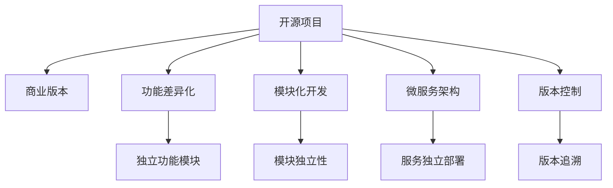

                 

# 创建开源项目的商业版本：功能差异化策略

## 1. 背景介绍

### 1.1 问题由来

随着开源项目在技术社区的蓬勃发展，开源代码的商业化利用成为越来越多企业的目标。开源项目不仅提供了高质量的代码资源，还具备良好的社区支持和技术交流平台，成为技术创新的重要驱动力。然而，如何将开源项目的商业价值最大化，同时保持社区活跃度，是众多企业面临的挑战。

**核心问题**：如何通过开源项目的商业版本，实现商业利益和社区贡献的平衡，并明确区分商业版本与开源版本的功能差异。

### 1.2 问题核心关键点

要解决这个问题，需重点关注以下几个关键点：

- 商业版本的功能设计：在开源代码基础上，如何实现商业功能，以满足特定市场需求。
- 开源与商业版本的功能差异：确保商业版本在保持核心技术优势的同时，有别于开源版本，避免功能重叠。
- 商业化策略：如何通过商业模式设计，最大化商业版本的商业价值。

## 2. 核心概念与联系

### 2.1 核心概念概述

为更好地理解如何在开源项目中创建商业版本，本节将介绍几个密切相关的核心概念：

- **开源项目**：指开放源代码的项目，允许用户自由使用、修改和分发代码，促进了技术交流和创新。
- **商业版本**：指基于开源项目，针对特定市场需求进行定制化开发，形成具有商业价值的版本。
- **功能差异化**：指在开源版本的基础上，根据商业需求增加独特功能，形成与开源版本有明显区分的商业版本。
- **模块化开发**：指通过模块化的方式，对代码进行细粒度划分，实现功能模块独立性和复用性。
- **微服务架构**：指将应用拆分为一组小的、独立的服务，每个服务运行在自己的进程中，并使用轻量级通信机制进行交互，以便实现功能的模块化和独立部署。
- **版本控制**：指通过版本控制工具（如Git）管理代码变更，确保不同版本的代码能够被追溯和对比。

这些核心概念之间的逻辑关系可以通过以下Mermaid流程图来展示：



这个流程图展示了一些核心概念及其之间的关系：

1. 开源项目为商业版本提供了基础技术，是功能差异化的起点。
2. 通过模块化开发和微服务架构，实现功能模块的独立性和复用性。
3. 版本控制确保代码变更的追溯和管理，是功能差异化的技术支撑。
4. 功能差异化是在这些技术基础上，根据商业需求进行定制化开发的关键。
5. 商业版本通过功能差异化，实现了与开源版本的功能区分。

## 3. 核心算法原理 & 具体操作步骤

### 3.1 算法原理概述

创建开源项目的商业版本，本质上是一个基于开源项目的功能定制和商业化过程。其核心思想是：在开源项目的基础上，根据商业需求增加或修改特定功能模块，形成具有商业价值的商业版本。

具体而言，商业版本的功能差异化策略主要包括以下步骤：

1. 需求分析：确定商业版本需要实现的具体功能，进行需求收集和分析。
2. 功能设计：设计商业版本的功能模块，确保其独立性和可扩展性。
3. 代码实现：在开源代码基础上，实现商业版本的功能模块。
4. 集成测试：确保新功能模块能够与其他模块正确交互，进行集成测试。
5. 发布与维护：发布商业版本，进行功能更新和性能优化。

### 3.2 算法步骤详解

下面详细介绍每个步骤的详细内容：

**Step 1: 需求分析**

需求分析是商业版本功能差异化的起点。通过以下方法收集和分析商业需求：

- 与潜在客户沟通：了解客户需求，获取商业版本的初步功能列表。
- 市场调研：分析市场趋势，识别潜在的新功能需求。
- 技术评估：评估技术实现难度，确定新功能的技术可行性。

需求分析完成后，形成功能需求文档，作为后续功能设计的依据。

**Step 2: 功能设计**

功能设计是商业版本功能差异化的核心。设计时应考虑以下几个方面：

- 独立功能模块：将新功能模块设计为独立模块，确保其易于添加、删除和修改。
- 模块接口设计：为模块设计清晰的接口规范，便于与其他模块的集成。
- 功能扩展性：设计时考虑未来的功能扩展需求，确保新功能能够无缝集成。
- 性能优化：设计时考虑性能需求，确保新功能模块对整体系统性能的影响最小。

功能设计完成后，形成功能设计文档，作为后续代码实现的依据。

**Step 3: 代码实现**

代码实现是将功能设计转化为代码的过程。具体步骤包括：

- 模块划分：将功能模块划分为独立的代码单元，便于管理和复用。
- 模块开发：根据功能设计文档，开发新功能模块的代码。
- 模块集成：将新功能模块集成到现有代码中，进行单元测试。
- 模块测试：确保新功能模块能够正确运行，进行单元测试和集成测试。

代码实现过程中，应遵循模块化开发和微服务架构的原则，确保新功能模块的独立性和复用性。

**Step 4: 集成测试**

集成测试是验证新功能模块与其他模块是否正确交互的过程。具体步骤包括：

- 单元测试：对新功能模块进行单元测试，确保其独立运行正确。
- 集成测试：将新功能模块与其他模块进行集成测试，确保其能够正确交互。
- 性能测试：对新功能模块进行性能测试，确保其对整体系统性能的影响最小。
- 安全测试：对新功能模块进行安全测试，确保其安全性和稳定性。

集成测试过程中，应确保新功能模块不会破坏现有系统的稳定性，同时确保新功能模块的安全性和性能。

**Step 5: 发布与维护**

发布与维护是将商业版本功能差异化的结果推向市场，并进行后续功能更新的过程。具体步骤包括：

- 版本发布：将商业版本发布到市场，进行市场推广和用户反馈收集。
- 功能更新：根据用户反馈和市场变化，进行新功能的更新和优化。
- 性能优化：对商业版本进行性能优化，提升用户体验和系统性能。
- 安全维护：对商业版本进行安全维护，确保其稳定性和安全性。

发布与维护过程中，应确保商业版本的稳定性和安全性，同时进行持续的功能更新和优化。

### 3.3 算法优缺点

商业版本的功能差异化策略具有以下优点：

- 功能定制化：能够根据客户需求定制化商业版本，满足特定市场的需求。
- 技术复用性：通过模块化开发和微服务架构，实现技术复用，提高开发效率。
- 市场灵活性：根据市场变化进行快速功能更新，保持市场竞争力。

但该策略也存在以下缺点：

- 功能差异化成本高：商业版本功能差异化需要额外开发和测试，成本较高。
- 功能重叠风险：新功能模块可能与开源版本功能重叠，导致功能冲突。
- 用户接受度问题：部分用户可能更倾向于使用开源版本，对商业版本的功能差异化接受度低。

尽管存在这些缺点，但就目前而言，功能差异化策略仍是最主流、最有效的商业化手段。未来相关研究的重点在于如何进一步降低功能差异化的成本，提高功能差异化的用户接受度，同时兼顾开源版本与商业版本的平衡。

### 3.4 算法应用领域

商业版本的功能差异化策略已经在软件工程、产品开发、数据科学等多个领域得到了广泛应用，具体包括：

- 软件开发：对开源代码库进行功能定制和商业化开发，形成具有商业价值的商业版本。
- 产品设计：在开源项目的基础上，针对特定市场和用户需求，增加或修改特定功能，形成商业产品。
- 数据科学：在开源数据科学工具的基础上，根据商业需求增加新功能，形成商业化的数据分析解决方案。

除了上述这些经典应用外，商业版本的功能差异化策略也被创新性地应用到更多场景中，如物联网设备、智能家居系统等，为各行业提供了新的技术路径。随着开源项目和功能差异化策略的不断进步，相信商业版本的功能差异化将在更多领域得到应用，推动各行业的数字化转型升级。

## 4. 数学模型和公式 & 详细讲解 & 举例说明

### 4.1 数学模型构建

本节将使用数学语言对商业版本的功能差异化策略进行更加严格的刻画。

假设开源项目的功能集合为 $F$，商业版本的功能集合为 $F_c$。在商业版本中增加的功能模块为 $M_c$，则功能差异化模型可以表示为：

$$
F_c = F \cup M_c
$$

其中 $\cup$ 表示集合的并集，$M_c$ 表示商业版本新增的功能模块。

### 4.2 公式推导过程

接下来，我们推导商业版本功能差异化模型的数学公式。

设开源项目的功能数为 $n$，商业版本新增的功能数为 $m$，则总的功能数为：

$$
N = n + m
$$

其中 $N$ 表示总的功能数，$n$ 表示开源项目的功能数，$m$ 表示商业版本新增的功能数。

设商业版本的用户数为 $U$，开源版本的用户数为 $U_s$，则总的用户数为：

$$
U_t = U + U_s
$$

其中 $U_t$ 表示总的用户数，$U$ 表示商业版本的用户数，$U_s$ 表示开源版本的用户数。

设商业版本的收益为 $R$，开源版本的收益为 $R_s$，则总收益为：

$$
R_t = R + R_s
$$

其中 $R_t$ 表示总收益，$R$ 表示商业版本的收益，$R_s$ 表示开源版本的收益。

### 4.3 案例分析与讲解

考虑一个开源社区维护的一个Web应用程序开发框架X，该框架功能丰富，社区活跃。某企业希望在该框架基础上，开发一款针对特定行业的应用程序，并推向市场。

**案例分析**：

1. **需求分析**：企业与开源社区沟通，收集行业特定需求，形成功能需求列表。
2. **功能设计**：基于开源框架X，设计新功能模块，确保独立性和复用性。
3. **代码实现**：开发新功能模块，集成到开源框架X中，进行单元测试和集成测试。
4. **发布与维护**：将商业版本发布到市场，收集用户反馈，进行功能更新和性能优化。

**案例讲解**：

1. **功能差异化**：企业将特定行业的应用程序功能模块，作为商业版本的功能差异化，与开源版本的功能集合 $F_s$ 并集，形成新的功能集合 $F_c = F_s \cup M_c$。
2. **功能复用性**：企业利用开源框架X的模块化开发和微服务架构，实现新功能模块的独立性和复用性，提高开发效率。
3. **用户接受度**：企业通过市场推广和用户体验反馈，逐步提高商业版本的用户接受度，吸引更多用户使用。
4. **收益优化**：企业通过增加新功能模块，提升商业版本的市场竞争力，增加商业收益 $R_c$，与开源版本的收益 $R_s$ 进行汇总，形成总收益 $R_t = R_c + R_s$。

## 5. 项目实践：代码实例和详细解释说明

### 5.1 开发环境搭建

在进行商业版本的功能差异化实践前，我们需要准备好开发环境。以下是使用Python进行Django开发的环境配置流程：

1. 安装Anaconda：从官网下载并安装Anaconda，用于创建独立的Python环境。

2. 创建并激活虚拟环境：
```bash
conda create -n django-env python=3.8 
conda activate django-env
```

3. 安装Django：
```bash
pip install django
```

4. 安装Gunicorn：
```bash
pip install gunicorn
```

5. 安装PostgreSQL：
```bash
pip install psycopg2-binary
```

6. 安装Django-PostgreSQL扩展：
```bash
pip install django-postgresql
```

完成上述步骤后，即可在`django-env`环境中开始商业版本的功能差异化实践。

### 5.2 源代码详细实现

下面我们以开源社区维护的Web应用程序开发框架X为例，给出使用Django进行商业版本功能差异化的PyTorch代码实现。

首先，定义商业版本的模型类：

```python
from django.db import models

class CommercialFeature(models.Model):
    name = models.CharField(max_length=255)
    description = models.TextField()
    active = models.BooleanField(default=False)

    def __str__(self):
        return self.name
```

然后，定义商业版本的视图类：

```python
from django.shortcuts import render
from django.http import JsonResponse

def commercial_features(request):
    features = CommercialFeature.objects.all()
    features_json = [{'name': feature.name, 'description': feature.description, 'active': feature.active} for feature in features]
    return JsonResponse(features_json, safe=False)
```

接着，定义商业版本的URL路由：

```python
from django.urls import path

urlpatterns = [
    path('commercial-features/', views.commercial_features, name='commercial_features'),
]
```

最后，启动开发服务器：

```bash
python manage.py runserver
```

以上就是使用Django进行商业版本功能差异化的完整代码实现。可以看到，通过Django的强大封装，我们可以用相对简洁的代码完成商业版本的视图设计和接口开发。

### 5.3 代码解读与分析

让我们再详细解读一下关键代码的实现细节：

**CommercialFeature类**：
- `name`属性：商业版本新增的功能名称。
- `description`属性：商业版本新增的功能描述。
- `active`属性：商业版本新增的功能是否激活。

**commercial_features函数**：
- 获取所有商业版本新增的功能模块，并将其转换为JSON格式。
- 返回JSON格式的特征列表。

**商业版本的URL路由**：
- 定义了一个URL路径，用于访问商业版本的功能列表。

**开发服务器启动**：
- 通过`runserver`命令启动Django开发服务器，提供API接口，供商业版本功能差异化模块使用。

以上代码展示了商业版本功能差异化的基本实现流程。开发者可以根据具体需求，在开源版本的基础上，添加新的商业功能模块，并通过Django视图设计和API接口，实现商业版本的功能差异化。

## 6. 实际应用场景

### 6.1 智能客服系统

商业版本的功能差异化策略可以广泛应用于智能客服系统的构建。传统客服往往需要配备大量人力，高峰期响应缓慢，且一致性和专业性难以保证。通过在开源客服系统基础上进行功能差异化，开发出针对特定行业的智能客服系统，可以大幅提升客服效率和用户体验。

在技术实现上，可以收集企业内部的历史客服对话记录，将问题和最佳答复构建成监督数据，在此基础上对开源客服系统进行功能差异化。功能差异化后的客服系统能够自动理解用户意图，匹配最合适的答案模板进行回复。对于客户提出的新问题，还可以接入检索系统实时搜索相关内容，动态组织生成回答。

### 6.2 医疗诊断系统

医疗诊断系统需要具备强大的数据处理和分析能力，以支持医生进行准确诊断和治疗决策。通过在开源医疗诊断系统基础上进行功能差异化，开发出具备特定诊断功能的商业版本，可以大幅提升医疗诊断系统的准确性和实用性。

具体而言，可以收集医院内部的诊断数据，进行标注和训练，形成监督数据集。在此基础上对开源医疗诊断系统进行功能差异化，增加特定的诊断功能模块。功能差异化后的医疗诊断系统能够根据患者的病历和症状，自动推荐诊断结果和建议，辅助医生进行诊断和治疗。

### 6.3 金融风控系统

金融风控系统需要具备对金融数据的实时监测和分析能力，以预防金融风险。通过在开源金融风控系统基础上进行功能差异化，开发出具备特定风控功能的商业版本，可以大幅提升金融风控系统的预警和预防能力。

具体而言，可以收集金融市场的数据，进行标注和训练，形成监督数据集。在此基础上对开源金融风控系统进行功能差异化，增加特定的风控功能模块。功能差异化后的金融风控系统能够对金融市场数据进行实时监测，及时发现异常情况，预测金融风险，辅助金融机构进行风险控制和决策。

### 6.4 未来应用展望

随着商业版本的功能差异化策略的不断发展，未来将在更多领域得到应用，为各行各业带来变革性影响。

在智慧医疗领域，商业版本的功能差异化策略可以应用于医疗诊断、药物研发等任务，为医疗诊断和治疗提供更精准、更智能的支持。

在智能教育领域，商业版本的功能差异化策略可以应用于在线教育、智能题库等任务，为教育资源提供更个性化、更高效的利用方式。

在智慧城市治理中，商业版本的功能差异化策略可以应用于城市管理、智能交通等任务，提高城市治理的智能化水平。

此外，在企业生产、社会治理、文娱传媒等众多领域，商业版本的功能差异化策略也将不断涌现，为各行业的数字化转型升级提供新的技术路径。

## 7. 工具和资源推荐

### 7.1 学习资源推荐

为了帮助开发者系统掌握商业版本功能差异化策略的理论基础和实践技巧，这里推荐一些优质的学习资源：

1. 《Django Web开发实战》系列博文：由Django官方博客团队撰写，深入浅出地介绍了Django框架的使用方法和最佳实践，是商业版本功能差异化开发的基础。

2. 《Python Web开发》系列书籍：全面介绍Python Web开发的经典书籍，涵盖Django、Flask等多个框架，适合初学者和进阶开发者。

3. 《Django ORM实战》书籍：深入介绍Django ORM的使用方法和实战案例，是商业版本功能差异化开发的重要工具。

4. 《Django实战项目》视频课程：全面介绍Django项目开发的实战案例，涵盖功能差异化开发、API设计等多个环节，适合动手实践。

5. Django官方文档：Django框架的官方文档，提供详细的API接口和示例代码，是商业版本功能差异化开发的重要参考。

通过对这些资源的学习实践，相信你一定能够快速掌握商业版本功能差异化策略的精髓，并用于解决实际的商业问题。

### 7.2 开发工具推荐

高效的开发离不开优秀的工具支持。以下是几款用于商业版本功能差异化开发的常用工具：

1. Django：Python最流行的Web框架之一，提供了强大的ORM、模板系统、表单处理等功能，适合快速开发功能差异化应用。

2. Flask：Python的轻量级Web框架，灵活高效，适合小型项目和API接口开发。

3. Gunicorn：Django框架的Web服务器，支持异步请求处理和长连接支持，适合高并发应用。

4. Django REST Framework：Django框架的RESTful API开发工具，提供强大的序列化、认证、权限控制等功能，适合开发复杂的API接口。

5. Redis：高性能的内存数据存储系统，适合处理高并发请求和缓存数据。

6. PostgreSQL：强大的关系型数据库，适合存储和管理大规模数据。

合理利用这些工具，可以显著提升商业版本功能差异化任务的开发效率，加快创新迭代的步伐。

### 7.3 相关论文推荐

商业版本的功能差异化策略的研究源于学界的持续研究。以下是几篇奠基性的相关论文，推荐阅读：

1. "Functional Programming for the Web"（Web功能编程）：介绍Web应用的函数式编程思想，探讨如何通过函数式编程实现功能差异化。

2. "API First Architecture"（API优先架构）：探讨API优先的Web架构设计，强调API接口的设计和版本管理。

3. "Design Patterns for Microservices"（微服务设计模式）：介绍微服务架构的设计模式和最佳实践，为商业版本的功能差异化提供技术参考。

4. "Web Application Security"（Web应用安全）：探讨Web应用的安全性和防御策略，为商业版本的安全开发提供指导。

5. "Cloud Computing for Business"（面向企业的云计算）：介绍云计算在商业应用中的实践和案例，为商业版本的云部署提供参考。

这些论文代表了大语言模型微调技术的发展脉络。通过学习这些前沿成果，可以帮助研究者把握学科前进方向，激发更多的创新灵感。

## 8. 总结：未来发展趋势与挑战

### 8.1 总结

本文对商业版本的功能差异化策略进行了全面系统的介绍。首先阐述了商业版本功能差异化的背景和意义，明确了功能差异化在实现商业利益和社区贡献平衡中的独特价值。其次，从原理到实践，详细讲解了功能差异化的数学原理和关键步骤，给出了功能差异化任务开发的完整代码实例。同时，本文还广泛探讨了功能差异化在智能客服、医疗诊断、金融风控等多个行业领域的应用前景，展示了功能差异化策略的巨大潜力。此外，本文精选了功能差异化的各类学习资源，力求为读者提供全方位的技术指引。

通过本文的系统梳理，可以看到，功能差异化策略在大语言模型和开源项目中发挥了重要作用，极大地拓展了开源项目的商业应用范围，为技术商业化提供了新的解决方案。未来，伴随功能差异化策略的不断演进，相信商业版本的功能差异化将在更多领域得到应用，推动各行业的数字化转型升级。

### 8.2 未来发展趋势

展望未来，商业版本的功能差异化策略将呈现以下几个发展趋势：

1. 功能模块化：功能差异化将更加模块化，通过微服务架构和模块化开发，实现功能模块的独立性和复用性。

2. 功能自动化：功能差异化将更加自动化，通过自动化工具和流水线，提升开发效率和质量。

3. 功能可配置：功能差异化将更加可配置，通过插件和配置文件，灵活定制功能模块。

4. 功能动态化：功能差异化将更加动态化，通过API接口和动态加载，实现功能的动态更新和扩展。

5. 功能安全化：功能差异化将更加安全化，通过访问控制和权限管理，保障功能的稳定性和安全性。

以上趋势凸显了功能差异化策略的广阔前景。这些方向的探索发展，必将进一步提升商业版本的功能差异化能力，为技术商业化带来新的突破。

### 8.3 面临的挑战

尽管功能差异化策略已经取得了瞩目成就，但在迈向更加智能化、普适化应用的过程中，它仍面临着诸多挑战：

1. 功能差异化成本高：功能差异化需要额外开发和测试，成本较高。如何降低功能差异化的成本，提升开发效率，是未来需要解决的问题。

2. 功能重叠风险：新功能模块可能与开源版本功能重叠，导致功能冲突。如何避免功能重叠，确保功能的独立性，是未来需要解决的问题。

3. 用户接受度问题：部分用户可能更倾向于使用开源版本，对商业版本的功能差异化接受度低。如何提高用户接受度，增加商业版本的市场竞争力，是未来需要解决的问题。

4. 技术复杂性：功能差异化涉及多个技术领域，包括Web开发、API设计、数据库管理等。如何简化技术复杂性，降低技术门槛，是未来需要解决的问题。

5. 功能升级难：功能差异化后的商业版本，如何保证与开源版本的兼容性，进行功能升级，是未来需要解决的问题。

正视功能差异化面临的这些挑战，积极应对并寻求突破，将是功能差异化策略迈向成熟的必由之路。相信随着学界和产业界的共同努力，这些挑战终将一一被克服，商业版本的功能差异化必将在构建人机协同的智能时代中扮演越来越重要的角色。

### 8.4 未来突破

面对功能差异化策略所面临的种种挑战，未来的研究需要在以下几个方面寻求新的突破：

1. 探索功能差异化的新方法：开发更加模块化、自动化、可配置、动态化的功能差异化方法，提升开发效率和质量。

2. 改进功能差异化的技术框架：采用最新的Web框架和技术栈，如React、Vue、Node.js等，提升功能差异化的技术栈先进性。

3. 引入云计算和边缘计算：利用云计算和边缘计算技术，实现功能差异化的弹性伸缩和本地部署，提升功能差异化的部署灵活性。

4. 优化功能差异化的性能和安全性：引入先进的性能优化和安全性技术，如缓存、负载均衡、认证、权限控制等，提升功能差异化的性能和安全性。

5. 引入人工智能和机器学习：利用人工智能和机器学习技术，对功能差异化的需求进行预测和分析，提升功能差异化的智能化水平。

6. 建立功能差异化的生态系统：通过开放API和SDK，建立功能差异化的生态系统，实现与其他应用的无缝集成和互操作性。

这些研究方向的探索，必将引领功能差异化策略迈向更高的台阶，为商业版本的功能差异化带来新的突破。面向未来，功能差异化策略还需要与其他人工智能技术进行更深入的融合，如知识表示、因果推理、强化学习等，多路径协同发力，共同推动自然语言理解和智能交互系统的进步。只有勇于创新、敢于突破，才能不断拓展功能差异化策略的边界，让智能技术更好地造福人类社会。

## 9. 附录：常见问题与解答

**Q1：如何降低商业版本的功能差异化成本？**

A: 降低商业版本的功能差异化成本，可以从以下几个方面入手：

1. 自动化工具：引入自动化工具和流水线，自动化功能模块的开发和测试，提高开发效率。

2. 代码复用：利用模块化开发和微服务架构，实现功能模块的复用，减少重复工作。

3. 开源社区：积极利用开源社区的资源和贡献，降低开发成本。

4. 团队协作：采用团队协作模式，提高开发效率和质量。

5. 持续集成：引入持续集成工具，实现功能的持续集成和部署，快速响应市场变化。

**Q2：如何避免功能重叠风险？**

A: 避免功能重叠风险，可以从以下几个方面入手：

1. 需求分析：在功能设计前进行详细的需求分析，确保新功能模块与现有功能模块的独立性。

2. 功能模块划分：将功能模块划分为独立的代码单元，避免功能模块之间的耦合。

3. 接口设计：为功能模块设计清晰的接口规范，避免功能模块之间的冲突。

4. 功能复用：利用功能模块的复用，减少功能模块的重复工作。

5. 功能测试：在功能实现前进行详细的功能测试，确保功能模块的独立性。

**Q3：如何提高用户接受度？**

A: 提高用户接受度，可以从以下几个方面入手：

1. 用户体验：提升用户体验，确保功能差异化后的商业版本易于使用和理解。

2. 市场推广：通过市场推广和广告宣传，提高用户对功能差异化商业版本的认知和接受度。

3. 免费试用：提供免费试用版本，让用户体验功能差异化商业版本，增加用户接受度。

4. 客户反馈：积极收集客户反馈，改进功能差异化商业版本，提高用户满意度。

5. 用户培训：提供用户培训和支持，帮助用户快速上手功能差异化商业版本。

**Q4：如何简化技术复杂性？**

A: 简化技术复杂性，可以从以下几个方面入手：

1. 技术栈选择：选择先进、易用的技术栈，降低技术复杂性。

2. 模块化设计：利用模块化设计，实现功能模块的独立性和复用性，简化技术复杂性。

3. 技术复用：利用开源社区的技术复用，减少重复工作，简化技术复杂性。

4. 技术文档：提供详细的技术文档和示例代码，帮助开发者快速上手功能差异化商业版本。

5. 技术支持：提供技术支持和社区交流，解决开发过程中的技术难题。

**Q5：如何进行功能升级？**

A: 进行功能升级，可以从以下几个方面入手：

1. 版本控制：利用版本控制工具，管理功能差异化商业版本的代码变更，确保功能的兼容性和可升级性。

2. 模块化设计：利用模块化设计，实现功能模块的独立性和复用性，便于功能升级。

3. 持续集成：引入持续集成工具，实现功能的持续集成和部署，快速响应市场变化。

4. 功能测试：在功能升级前进行详细的功能测试，确保功能的稳定性和兼容性。

5. 用户反馈：积极收集用户反馈，改进功能差异化商业版本，提高用户满意度。

**Q6：如何进行功能动态化？**

A: 进行功能动态化，可以从以下几个方面入手：

1. 动态加载：利用API接口和动态加载技术，实现功能的动态更新和扩展。

2. 配置文件：利用配置文件，实现功能的动态配置和定制化。

3. 插件机制：利用插件机制，实现功能的动态扩展和更新。

4. 数据库管理：利用数据库管理功能，实现功能的动态存储和更新。

5. 实时推送：利用实时推送技术，实现功能的动态推送和更新。

---

作者：禅与计算机程序设计艺术 / Zen and the Art of Computer Programming

