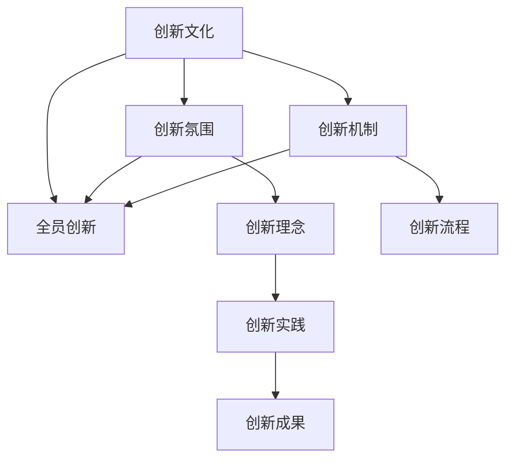

                 

# 创新文化建设：激发全员创新精神

## 1. 背景介绍

### 1.1 问题由来

创新是企业持续发展的原动力，也是企业竞争力的关键所在。然而，尽管许多企业认识到创新的重要性，但在实际工作中，创新精神的激发和创新文化的建设仍面临诸多挑战。企业往往缺乏系统性的创新管理机制，创新意识淡薄，创新活动难以持续，创新成果转化率不高。因此，建立一种能够激发全员创新精神的企业文化，显得尤为重要。

### 1.2 问题核心关键点

建设创新文化的核心关键点在于：

- **环境营造**：创造一个自由、开放的创新环境，鼓励员工提出新的想法和方法。
- **激励机制**：建立一套完善的激励机制，激发员工参与创新活动的积极性。
- **知识分享**：促进企业内部知识的共享和传播，促进不同部门、不同层次员工之间的交流与合作。
- **持续改进**：倡导持续改进的理念，鼓励员工在日常工作中不断创新，实现技术和流程的优化。

这些关键点共同构成了创新文化的建设基础，使企业能够营造一个有利于创新的生态系统，从而激发全员创新精神。

## 2. 核心概念与联系

### 2.1 核心概念概述

为更好地理解创新文化建设，本节将介绍几个密切相关的核心概念：

- **创新文化**：指企业内部形成的鼓励创新、尊重创新、支持创新的价值观和行为规范，包括创新理念、创新氛围、创新制度等。
- **全员创新**：指企业内部所有员工，从高层管理到一线员工，都积极参与创新活动，贡献创新成果。
- **创新氛围**：指企业内部形成的积极、活跃、开放的创新氛围，使员工能够自由地提出、讨论和实施创新想法。
- **创新机制**：指企业为促进创新活动开展而建立的一系列制度、流程和工具，如项目管理、知识产权保护、激励措施等。

这些概念之间的关系可以用以下Mermaid流程图来展示：



这个流程图展示了大语言模型的核心概念及其之间的关系：

1. 创新文化通过营造创新氛围和建立创新机制，为全员创新提供了良好的环境和制度支持。
2. 创新氛围促进员工提出和讨论创新想法，形成积极的创新氛围。
3. 创新机制通过项目管理、知识产权保护、激励措施等，保障创新活动的顺利进行和成果的落地转化。
4. 创新理念指导全员创新实践，推动创新成果的产生和应用。
5. 创新实践产生创新成果，促进企业技术进步和业务发展。

这些概念共同构成了创新文化的建设框架，使企业能够系统性地推动全员创新，实现持续发展。

## 3. 核心算法原理 & 具体操作步骤

### 3.1 算法原理概述

创新文化建设的算法原理可抽象为以下步骤：

1. **识别问题**：通过调查问卷、员工访谈等方式，识别企业当前创新文化的不足之处。
2. **设计方案**：基于问题识别结果，设计创新文化的建设方案，包括目标、措施、路径等。
3. **执行方案**：制定详细的执行计划，并按计划推进创新文化的建设。
4. **评估效果**：定期评估创新文化建设的效果，持续优化改进。

这些步骤构成了一个闭环的管理过程，确保企业创新文化的持续改进和完善。

### 3.2 算法步骤详解

以下是创新文化建设的具体操作步骤：

#### 步骤1：识别问题

1. **问卷调查**：设计一系列问题，涵盖企业创新文化各个方面，向全体员工发放问卷，收集员工对当前创新文化的看法和建议。
2. **员工访谈**：选择不同部门、不同岗位的员工进行深度访谈，了解他们的真实感受和具体需求。
3. **数据分析**：对问卷和访谈数据进行统计分析，识别出企业创新文化中存在的问题和改进方向。

#### 步骤2：设计方案

1. **确定目标**：根据问题识别结果，制定明确的创新文化建设目标，如提升创新氛围、加强创新激励、促进知识分享等。
2. **设计措施**：设计具体可行的创新文化建设措施，如设立创新基金、建立创新实验室、组织创新活动等。
3. **制定路径**：将创新文化建设目标和措施转化为具体的实施路径和时间表。

#### 步骤3：执行方案

1. **资源投入**：根据方案设计，投入相应的人力、财力和物力资源，建立创新文化建设的执行体系。
2. **组织实施**：按计划推进各项创新文化建设活动，确保执行效果。
3. **反馈优化**：定期收集员工对创新文化建设的反馈意见，及时调整优化方案。

#### 步骤4：评估效果

1. **效果评估**：通过问卷调查、员工访谈等方式，评估创新文化建设的效果。
2. **数据对比**：将评估结果与初始状态进行对比，分析创新文化建设的改进效果。
3. **持续改进**：根据评估结果，持续优化创新文化建设方案，推动创新文化不断完善。

### 3.3 算法优缺点

创新文化建设的算法具有以下优点：

- **系统性**：通过系统化的管理过程，确保创新文化建设的全面性和有效性。
- **持续性**：定期评估和优化，使创新文化建设成为一种长期机制。
- **广泛参与**：通过问卷调查、员工访谈等方式，广泛收集员工意见，确保创新文化建设符合企业实际需求。

同时，该方法也存在一定的局限性：

- **复杂度高**：创新文化建设涉及多方面因素，复杂度较高，需要跨部门、跨层次的协同合作。
- **资源投入大**：需要大量的资源投入，包括时间、人力、财力等。
- **效果难量化**：创新文化建设的效果难以量化评估，需要多维度、多层次的综合评价。

尽管存在这些局限性，但就目前而言，系统性的创新文化建设仍然是企业激发全员创新精神、推动技术进步和业务发展的重要手段。

### 3.4 算法应用领域

创新文化建设的算法广泛适用于各类企业，涵盖制造业、金融业、IT行业、服务业等多个领域。无论是大公司还是小企业，都可以通过构建创新文化，提升企业竞争力和市场响应能力。

在制造业中，创新文化建设可以推动产品创新和工艺改进，提升生产效率和产品质量。在金融业中，创新文化建设可以加速金融产品的创新和金融服务的优化，提升客户体验和企业收益。在IT行业中，创新文化建设可以驱动技术创新和业务创新，推动企业快速适应市场变化。在服务行业中，创新文化建设可以提升服务质量，增强客户粘性，提升企业品牌价值。

## 4. 数学模型和公式 & 详细讲解

### 4.1 数学模型构建

创新文化建设的数学模型可以抽象为以下形式：

设企业内部员工总数为 $N$，创新文化建设的满意度为 $S$，创新氛围的活跃度为 $A$，创新机制的完善度为 $M$，创新成果的数量为 $C$。则创新文化建设的综合评估公式为：

$$
E = \alpha S + \beta A + \gamma M + \delta C
$$

其中，$\alpha, \beta, \gamma, \delta$ 为各项指标的权重系数。

### 4.2 公式推导过程

以创新氛围活跃度 $A$ 为例，推导其量化评估公式。假设企业内部有 $n$ 个创新活动，每个活动的活跃度为 $a_i$，则创新氛围的活跃度 $A$ 可以表示为：

$$
A = \frac{1}{n} \sum_{i=1}^n a_i
$$

类似地，可以将创新文化建设的各个指标进行量化，并结合权重系数，构建综合评估模型。

### 4.3 案例分析与讲解

假设某企业通过问卷调查发现，当前员工对创新文化的满意度 $S=0.7$，创新氛围活跃度 $A=0.6$，创新机制完善度 $M=0.8$，创新成果数量 $C=50$。设各项指标的权重系数分别为 $\alpha=0.3, \beta=0.2, \gamma=0.4, \delta=0.1$。则企业创新文化建设的综合评估值为：

$$
E = 0.3 \times 0.7 + 0.2 \times 0.6 + 0.4 \times 0.8 + 0.1 \times 50 = 2.3
$$

根据评估结果，企业可以发现创新文化建设的薄弱环节，并制定相应的改进措施。例如，可以加强创新氛围的活跃度，通过举办更多的创新活动，提高员工参与度。

## 5. 项目实践：代码实例和详细解释说明

### 5.1 开发环境搭建

在进行创新文化建设的项目实践前，我们需要准备好开发环境。以下是使用Python进行数据分析和可视化环境配置流程：

1. 安装Anaconda：从官网下载并安装Anaconda，用于创建独立的Python环境。

2. 创建并激活虚拟环境：
```bash
conda create -n innovation-env python=3.8 
conda activate innovation-env
```

3. 安装必要的工具包：
```bash
conda install pandas numpy matplotlib seaborn jupyter notebook
```

完成上述步骤后，即可在`innovation-env`环境中开始创新文化建设的实践。

### 5.2 源代码详细实现

以下是一个使用Python进行创新文化建设数据分析的示例代码。

```python
import pandas as pd
import matplotlib.pyplot as plt

# 读取问卷调查数据
data = pd.read_csv('innovation_survey.csv')

# 统计员工满意度
satisfaction = data['satisfaction'].mean()

# 统计创新氛围活跃度
activity = data['activity'].mean()

# 统计创新机制完善度
mechanism = data['mechanism'].mean()

# 统计创新成果数量
results = data['results'].sum()

# 输出统计结果
print(f"满意度: {satisfaction:.2f}")
print(f"活跃度: {activity:.2f}")
print(f"完善度: {mechanism:.2f}")
print(f"成果数量: {results:.2f}")

# 绘制饼图
labels = ['satisfaction', 'activity', 'mechanism', 'results']
sizes = [satisfaction, activity, mechanism, results]
colors = ['#ff9999', '#66b3ff', '#99ff99', '#ffcc99']
plt.pie(sizes, labels=labels, colors=colors, autopct='%1.1f%%', startangle=90)
plt.axis('equal')
plt.show()
```

以上代码实现了对问卷调查数据的统计分析，并绘制了饼图展示各项指标的分布情况。

### 5.3 代码解读与分析

让我们再详细解读一下关键代码的实现细节：

**数据读取**：
- `pd.read_csv`方法用于读取问卷调查数据，返回一个Pandas DataFrame对象。

**统计分析**：
- `mean`方法用于计算满意度、活跃度、完善度和成果数量的平均值。
- `sum`方法用于计算成果数量的总和。

**绘图展示**：
- `matplotlib.pyplot`库用于绘制饼图，展示各项指标的占比。

**结果输出**：
- 使用`print`函数输出统计结果，方便查看。

**代码优化**：
- `autopct`参数用于在饼图上显示百分比，`startangle`参数用于指定饼图起始角度。

通过以上代码，可以直观地展示创新文化建设的各项指标分布情况，为后续改进措施提供数据支持。

## 6. 实际应用场景

### 6.1 创新文化建设在智慧城市中的应用

智慧城市建设离不开创新文化的支撑。通过建设创新文化，智慧城市可以吸引和培养高素质的创新人才，推动城市技术创新和业务创新，提升城市管理水平和居民生活质量。

具体而言，智慧城市可以通过以下方式推进创新文化建设：

- **政策支持**：制定有利于创新文化建设的政策，如创新基金、知识产权保护等，吸引企业、科研机构和人才入驻。
- **设施建设**：建设创新中心、孵化器、实验室等创新基础设施，提供创新活动所需的硬件和软件资源。
- **活动组织**：组织各类创新活动，如创新论坛、创新大赛、创新讲座等，促进创新交流和合作。
- **人才培养**：与高校、科研机构合作，培养高素质的创新人才，提升城市创新能力。

### 6.2 创新文化建设在智能制造中的应用

智能制造是制造业的未来发展方向，创新文化建设在智能制造中同样具有重要意义。通过建设创新文化，智能制造企业可以推动技术创新和工艺改进，提升生产效率和产品质量。

具体而言，智能制造企业可以通过以下方式推进创新文化建设：

- **技术创新**：鼓励员工提出新技术和新工艺，推动技术创新和产品创新。
- **流程优化**：通过流程再造和持续改进，提升生产效率和产品质量，降低生产成本。
- **管理创新**：引入先进的管理工具和方法，提升企业管理水平，推动企业可持续发展。
- **人才培训**：通过员工培训和技术交流，提升员工技能水平，增强企业创新能力。

### 6.3 创新文化建设在金融行业中的应用

金融行业对创新文化建设也有着迫切需求。通过建设创新文化，金融企业可以推动产品创新和业务创新，提升客户体验和企业收益。

具体而言，金融企业可以通过以下方式推进创新文化建设：

- **金融产品创新**：开发新的金融产品和服务，提升客户体验和企业收益。
- **金融服务优化**：通过流程再造和技术创新，优化金融服务，提升客户满意度。
- **金融技术应用**：引入先进的技术和工具，提升金融服务的效率和质量。
- **金融人才培养**：通过员工培训和人才引进，提升员工技能水平，增强企业创新能力。

### 6.4 创新文化建设在服务行业中的应用

服务行业对创新文化建设同样有着重要需求。通过建设创新文化，服务企业可以提升服务质量，增强客户粘性，提升企业品牌价值。

具体而言，服务企业可以通过以下方式推进创新文化建设：

- **服务创新**：通过创新服务模式和方式，提升服务质量，增强客户体验。
- **客户管理**：通过客户数据分析和客户画像构建，提升客户管理水平，增强客户粘性。
- **品牌建设**：通过品牌宣传和品牌管理，提升企业品牌价值，增强市场竞争力。
- **员工培训**：通过员工培训和激励机制，提升员工服务水平，增强企业创新能力。

## 7. 工具和资源推荐

### 7.1 学习资源推荐

为了帮助开发者系统掌握创新文化建设的理论基础和实践技巧，这里推荐一些优质的学习资源：

1. **《创新文化建设指南》系列博文**：由企业创新专家撰写，深入浅出地介绍了创新文化建设的理论基础和实践方法，涵盖创新文化识别、创新机制设计、创新活动组织等多个方面。

2. **《企业创新管理》课程**：哈佛商学院开设的创新管理课程，涵盖创新理念、创新流程、创新策略等多个内容，提供系统化的创新管理理论和方法。

3. **《创新文化建设案例分析》书籍**：收集了大量企业创新文化建设的成功案例，分析其成功经验和教训，为读者提供实战参考。

4. **《企业创新管理手册》工具书**：系统总结了企业创新管理的基本理论和最佳实践，提供了大量的工具和方法，帮助企业构建创新文化。

通过学习这些资源，相信你一定能够快速掌握创新文化建设的精髓，并将其应用到企业的创新实践中。

### 7.2 开发工具推荐

高效的开发离不开优秀的工具支持。以下是几款用于创新文化建设开发的常用工具：

1. **Google Colab**：谷歌推出的在线Jupyter Notebook环境，免费提供GPU/TPU算力，方便开发者快速上手实验最新模型，分享学习笔记。

2. **JIRA**：项目管理工具，用于管理创新项目的进度和任务，帮助企业高效推进创新活动。

3. **Slack**：团队协作工具，用于促进员工之间的交流和合作，增强团队协作效率。

4. **Trello**：项目管理工具，用于管理创新项目的进度和任务，提供可视化的任务管理界面。

5. **Zoom**：视频会议工具，用于组织远程会议和培训，促进员工之间的沟通和协作。

合理利用这些工具，可以显著提升创新文化建设的开发效率，加快创新项目的迭代和优化。

### 7.3 相关论文推荐

创新文化建设的研究始于学界的持续研究。以下是几篇奠基性的相关论文，推荐阅读：

1. **《建设创新型组织：一项系统管理方法》（建设和创新型组织：系统化方法）**：介绍了创新型组织的建设方法和步骤，为构建创新文化提供了理论基础。

2. **《企业创新文化的构建与提升》**：探讨了企业创新文化的构建路径和提升策略，为创新文化建设提供了实际参考。

3. **《创新文化建设案例分析》**：分析了多个企业创新文化建设的成功经验和教训，为读者提供实战参考。

4. **《创新文化的量化评估》**：介绍了创新文化的量化评估方法，提供了系统的评估框架和指标体系。

这些论文代表了大语言模型微调技术的发展脉络。通过学习这些前沿成果，可以帮助研究者把握学科前进方向，激发更多的创新灵感。

## 8. 总结：未来发展趋势与挑战

### 8.1 总结

本文对创新文化建设的理论基础和实践方法进行了全面系统的介绍。首先阐述了创新文化建设的背景和意义，明确了创新文化建设在激发全员创新精神、提升企业竞争力和市场响应能力方面的重要性。其次，从原理到实践，详细讲解了创新文化建设的数学模型和操作步骤，给出了创新文化建设项目的完整代码实例。同时，本文还广泛探讨了创新文化建设在智慧城市、智能制造、金融行业、服务行业等多个领域的应用前景，展示了创新文化建设的巨大潜力。此外，本文精选了创新文化建设的各类学习资源，力求为读者提供全方位的技术指引。

通过本文的系统梳理，可以看到，创新文化建设是一个复杂而系统的工程，需要跨部门、跨层次的协同合作。但通过系统化的管理过程，企业可以营造一个有利于创新的生态系统，从而激发全员创新精神，推动技术进步和业务发展。

### 8.2 未来发展趋势

展望未来，创新文化建设将呈现以下几个发展趋势：

1. **数字化转型**：随着数字化技术的普及，创新文化建设将更加依赖于数字化工具和方法，如数据分析、云计算、人工智能等。

2. **全球化融合**：在全球化的背景下，创新文化建设将跨越国界和地区，促进全球范围内的创新合作和交流。

3. **持续改进**：创新文化建设是一个持续改进的过程，企业需要不断优化创新机制和管理流程，适应不断变化的市场环境。

4. **跨领域融合**：创新文化建设将与各领域的业务需求和技术发展紧密结合，推动跨领域的创新和融合。

5. **多元包容**：创新文化建设将更加注重多元包容和多样性，鼓励不同背景、不同思维方式的人参与创新活动。

这些趋势凸显了创新文化建设的广阔前景，为企业创新能力的提升提供了新的方向和路径。

### 8.3 面临的挑战

尽管创新文化建设已经取得了一定的进展，但在迈向更加智能化、普适化应用的过程中，它仍面临诸多挑战：

1. **复杂度高**：创新文化建设涉及多方面因素，复杂度较高，需要跨部门、跨层次的协同合作。

2. **资源投入大**：需要大量的资源投入，包括时间、人力、财力等。

3. **效果难量化**：创新文化建设的效果难以量化评估，需要多维度、多层次的综合评价。

4. **文化差异**：不同企业的文化背景、组织结构和管理方式不同，创新文化建设需要根据具体情况进行调整。

5. **市场变化**：市场环境和竞争态势不断变化，创新文化建设需要持续优化和改进。

尽管存在这些挑战，但通过不断探索和创新，这些难题终将一一被克服，创新文化建设必将在构建人机协同的智能时代中扮演越来越重要的角色。

### 8.4 研究展望

面向未来，创新文化建设需要进一步研究以下方向：

1. **数字化工具的应用**：开发更多数字化工具和方法，提升创新文化建设的效率和效果。

2. **全球化融合**：促进全球范围内的创新合作和交流，推动跨国的创新文化建设。

3. **持续改进机制**：建立持续改进机制，定期评估和优化创新文化建设，推动创新能力提升。

4. **跨领域融合**：推动跨领域的创新融合，实现多元化的创新成果转化。

5. **文化差异管理**：针对不同企业的文化背景，制定个性化的创新文化建设方案。

6. **市场适应性**：增强创新文化建设的灵活性和适应性，适应市场环境的变化。

这些研究方向将进一步推动创新文化建设的深入发展，为企业创新能力的提升提供更广阔的空间。

## 9. 附录：常见问题与解答

**Q1：创新文化建设是否适用于所有企业？**

A: 创新文化建设对于大多数企业都是适用的，尤其是那些追求创新、重视技术发展的企业。但不同的企业有着不同的文化背景和组织结构，创新文化建设需要根据具体情况进行调整和优化。

**Q2：如何进行创新文化建设的评估和优化？**

A: 创新文化建设的评估和优化是一个持续的过程。可以通过问卷调查、员工访谈等方式，定期收集员工对创新文化的反馈意见，分析创新文化建设的薄弱环节，制定相应的改进措施。同时，可以引入第三方评估机构，提供专业的评估和咨询服务。

**Q3：创新文化建设需要哪些资源支持？**

A: 创新文化建设需要大量的资源支持，包括时间、人力、财力等。企业需要建立专门的创新文化建设团队，制定详细的实施计划，并提供必要的资源保障。

**Q4：创新文化建设是否需要高层管理层的支持？**

A: 创新文化建设需要高层管理层的支持和参与。高层管理层可以通过制定创新战略、提供创新资源、倡导创新文化等方式，推动企业创新文化建设。

**Q5：如何激发员工的创新积极性？**

A: 激发员工的创新积极性需要从多个方面入手。可以设立创新基金、设立创新奖项、组织创新活动等方式，激励员工参与创新活动。同时，可以营造开放、包容的创新氛围，使员工能够自由地提出和讨论创新想法。

这些问题的回答将帮助企业更好地理解创新文化建设的实践方法，从而构建一个有利于创新的生态系统，激发全员创新精神，推动技术进步和业务发展。

---

作者：禅与计算机程序设计艺术 / Zen and the Art of Computer Programming

