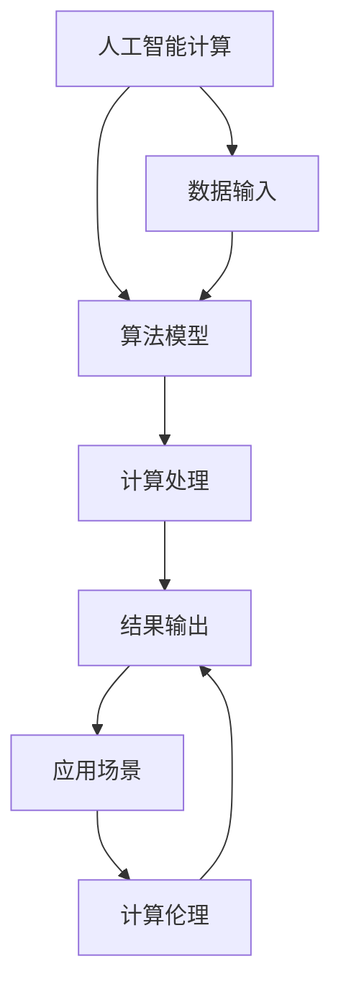

                 

# 创造更美好的明天：人类计算的积极作用

> 关键词：人工智能,计算伦理,计算机科学,人工智能伦理,智能时代

## 1. 背景介绍

在人类进入数字信息时代的今天，计算已经成为推动社会进步的核心动力。从算盘、计算器到超级计算机，每一次计算技术的突破，都带来了生产力的巨大飞跃和社会的深刻变革。然而，随着计算技术的发展，其带来的影响也愈发复杂和深远，尤其是在人工智能(AI)领域，其带来的伦理挑战和风险不容忽视。本文旨在深入探讨人类计算，特别是人工智能计算，对社会和个人生活的积极作用，同时揭示其中潜在的风险和挑战，为未来的技术发展提供参考。

## 2. 核心概念与联系

### 2.1 核心概念概述

人工智能计算（Artificial Intelligence Computation），指的是利用计算机算法和数学模型，模拟和扩展人类智能的一种计算过程。人工智能计算的核心在于通过数据、算法和计算，实现对复杂问题的智能理解和处理。与传统计算不同，人工智能计算不仅能够处理具体的数据和任务，还能通过学习和推理，理解和模拟人类思维，进行更高级的抽象和推理。

计算伦理（Computational Ethics），是指在计算和人工智能技术开发和应用过程中，遵循的伦理原则和规范，包括数据隐私、算法透明、责任归属等。计算伦理的目的是确保技术应用对社会和个人的影响是积极和有益的，避免可能带来的负面影响。

### 2.2 核心概念原理和架构的 Mermaid 流程图



上述 Mermaid 流程图展示了人工智能计算的核心架构及其与计算伦理的关系。数据输入是计算的起点，算法模型是计算的核心，计算处理是计算过程本身，结果输出是计算的终点，应用场景是计算的具体应用，而计算伦理则贯穿始终，确保计算过程和结果对社会的积极影响。

## 3. 核心算法原理 & 具体操作步骤

### 3.1 算法原理概述

人工智能计算的核心算法包括机器学习（Machine Learning, ML）、深度学习（Deep Learning, DL）、自然语言处理（Natural Language Processing, NLP）等。其中，机器学习算法通过统计和优化，实现对数据的建模和预测；深度学习算法通过多层神经网络，实现对复杂模式的学习和提取；自然语言处理算法则通过语言模型和序列建模，实现对文本和语言的理解和生成。

### 3.2 算法步骤详解

#### 3.2.1 数据预处理

数据预处理是人工智能计算的第一步，包括数据清洗、特征提取、数据标准化等。数据预处理的目标是提高数据质量和可用性，减少噪音和干扰，为后续计算提供可靠的输入。

#### 3.2.2 模型训练

模型训练是人工智能计算的核心环节，包括选择合适的算法模型、确定训练数据集、设定训练参数等。模型训练的目标是通过大量数据的迭代优化，找到最优的模型参数，实现对数据的拟合和预测。

#### 3.2.3 模型评估和优化

模型评估是人工智能计算的重要环节，通过测试集对模型进行评估，确定模型性能和泛化能力。模型优化则通过调整模型结构、参数和训练策略，提高模型精度和效率。

### 3.3 算法优缺点

#### 3.3.1 优点

1. **高效性**：人工智能计算能够快速处理大量数据，实现高效的信息提取和处理。
2. **普适性**：人工智能计算可以应用于各种领域，包括医疗、金融、交通等，具有广泛的适用性。
3. **创新性**：人工智能计算通过学习和推理，能够实现新的发现和突破，推动科技发展。

#### 3.3.2 缺点

1. **依赖数据**：人工智能计算依赖高质量的数据，数据质量差可能导致模型性能低下。
2. **黑箱问题**：人工智能计算的复杂性使得模型难以理解和解释，可能存在"黑箱"问题。
3. **伦理风险**：人工智能计算可能带来隐私泄露、算法偏见等伦理风险，需要谨慎对待。

### 3.4 算法应用领域

人工智能计算已经广泛应用于各个领域，包括但不限于：

1. **医疗健康**：通过医疗影像分析、基因组学研究等，提高医疗诊断和治疗的精准性和效率。
2. **金融科技**：通过风险预测、投资策略优化等，提升金融机构的决策能力和市场竞争力。
3. **智能交通**：通过交通数据分析、智能调度等，优化交通管理和出行体验。
4. **教育培训**：通过个性化推荐、智能评估等，提升教育效果和教学质量。
5. **制造业**：通过质量控制、设备维护等，提高制造业的智能化水平和效率。

## 4. 数学模型和公式 & 详细讲解 & 举例说明

### 4.1 数学模型构建

人工智能计算中的数学模型通常包括线性回归、逻辑回归、神经网络、支持向量机等。以下以神经网络模型为例，展示其数学模型构建过程。

#### 4.1.1 神经网络模型

神经网络模型由多个神经元（节点）和连接（权重）组成，通过前向传播和反向传播，实现对数据的处理和预测。神经网络模型的数学模型可以表示为：

$$
y = f(W \cdot x + b)
$$

其中，$y$为输出结果，$x$为输入向量，$W$为权重矩阵，$b$为偏置向量，$f$为激活函数。

### 4.2 公式推导过程

#### 4.2.1 前向传播

前向传播是指将输入数据通过神经网络模型，计算得到输出结果的过程。前向传播的公式可以表示为：

$$
z^{(l)} = W^{(l)} \cdot z^{(l-1)} + b^{(l)}
$$

$$
a^{(l)} = f(z^{(l)})
$$

其中，$z^{(l)}$为第$l$层节点激活前向量，$a^{(l)}$为第$l$层节点激活后向量，$W^{(l)}$为第$l$层权重矩阵，$b^{(l)}$为第$l$层偏置向量，$f$为激活函数。

#### 4.2.2 反向传播

反向传播是指通过计算输出结果与真实结果之间的误差，反向调整权重和偏置，优化模型参数的过程。反向传播的公式可以表示为：

$$
\frac{\partial L}{\partial z^{(l)}} = \frac{\partial L}{\partial a^{(l)}} \cdot \frac{\partial a^{(l)}}{\partial z^{(l)}}
$$

$$
\frac{\partial L}{\partial W^{(l)}} = \frac{\partial L}{\partial z^{(l)}} \cdot \frac{\partial z^{(l)}}{\partial W^{(l)}}
$$

$$
\frac{\partial L}{\partial b^{(l)}} = \frac{\partial L}{\partial z^{(l)}} \cdot \frac{\partial z^{(l)}}{\partial b^{(l)}}
$$

其中，$L$为损失函数，$\frac{\partial L}{\partial z^{(l)}}$为第$l$层节点误差的梯度，$\frac{\partial z^{(l)}}{\partial W^{(l)}}$和$\frac{\partial z^{(l)}}{\partial b^{(l)}}$为权重和偏置的梯度。

### 4.3 案例分析与讲解

#### 4.3.1 案例：图像分类

图像分类是人工智能计算中的经典任务之一，通过神经网络模型实现对图像的分类。以下以手写数字识别为例，展示其数学模型和算法步骤。

1. **数据准备**：准备手写数字图片和对应的标签数据。
2. **模型构建**：选择卷积神经网络（Convolutional Neural Network, CNN）模型，设计多个卷积层和全连接层。
3. **模型训练**：使用随机梯度下降（Stochastic Gradient Descent, SGD）算法，训练模型参数，最小化损失函数。
4. **模型评估**：使用测试集对模型进行评估，确定分类准确率和泛化能力。

## 5. 项目实践：代码实例和详细解释说明

### 5.1 开发环境搭建

在进行人工智能计算项目实践前，需要准备好开发环境。以下是使用Python进行TensorFlow开发的 environment setup流程：

1. 安装Anaconda：从官网下载并安装Anaconda，用于创建独立的Python环境。
2. 创建并激活虚拟环境：
```bash
conda create -n tf-env python=3.8 
conda activate tf-env
```
3. 安装TensorFlow：根据GPU版本，从官网获取对应的安装命令。例如：
```bash
conda install tensorflow -c conda-forge
```

4. 安装各类工具包：
```bash
pip install numpy pandas scikit-learn matplotlib tqdm jupyter notebook ipython
```

完成上述步骤后，即可在`tf-env`环境中开始项目开发。

### 5.2 源代码详细实现

#### 5.2.1 数据预处理

```python
import numpy as np
import tensorflow as tf
from tensorflow import keras

# 读取手写数字图片和标签数据
mnist = keras.datasets.mnist
(train_images, train_labels), (test_images, test_labels) = mnist.load_data()

# 数据归一化
train_images = train_images / 255.0
test_images = test_images / 255.0

# 数据标签转换
train_labels = keras.utils.to_categorical(train_labels, 10)
test_labels = keras.utils.to_categorical(test_labels, 10)
```

#### 5.2.2 模型构建

```python
# 定义模型结构
model = keras.Sequential([
    keras.layers.Flatten(input_shape=(28, 28)),
    keras.layers.Dense(128, activation='relu'),
    keras.layers.Dense(10, activation='softmax')
])
```

#### 5.2.3 模型训练

```python
# 编译模型
model.compile(optimizer='adam',
              loss='categorical_crossentropy',
              metrics=['accuracy'])

# 训练模型
model.fit(train_images, train_labels, epochs=10, validation_data=(test_images, test_labels))
```

#### 5.2.4 模型评估

```python
# 评估模型
test_loss, test_acc = model.evaluate(test_images, test_labels)
print('Test accuracy:', test_acc)
```

### 5.3 代码解读与分析

#### 5.3.1 代码解读

**数据预处理**：
- 使用TensorFlow的数据集模块加载手写数字图片和标签数据。
- 对数据进行归一化处理，将像素值缩放到0到1之间。
- 将标签数据转换为one-hot编码形式，方便模型训练。

**模型构建**：
- 使用TensorFlow的Sequential模型定义多层神经网络结构。
- 第一层为Flatten层，将二维图片数据展平为一维向量。
- 第二层为Dense层，使用ReLU激活函数。
- 第三层为输出层，使用Softmax激活函数。

**模型训练**：
- 使用Adam优化器编译模型，定义损失函数和评估指标。
- 使用fit方法训练模型，设置训练轮数和验证数据集。

**模型评估**：
- 使用evaluate方法评估模型性能，打印测试集准确率。

#### 5.3.2 分析

人工智能计算的核心在于模型训练和优化，上述代码展示了从数据预处理到模型训练和评估的完整流程。通过TensorFlow等框架，开发者可以轻松实现各种复杂的人工智能计算任务。

## 6. 实际应用场景

### 6.1 医疗健康

人工智能计算在医疗健康领域的应用已经初见成效。通过医学影像分析、基因组学研究等，人工智能计算能够提高医疗诊断和治疗的精准性和效率，减少误诊和误治，提升医疗水平和患者体验。例如，利用卷积神经网络（CNN）进行医学影像分割和病变检测，利用深度学习模型进行基因组学数据分析和疾病预测。

### 6.2 金融科技

金融科技领域的人工智能计算应用广泛，通过风险预测、投资策略优化等，提升金融机构的决策能力和市场竞争力。例如，利用神经网络模型进行股票价格预测、信用风险评估、欺诈检测等，通过大数据分析和机器学习模型进行量化投资和智能投顾。

### 6.3 智能交通

智能交通领域的人工智能计算应用多样，通过交通数据分析、智能调度等，优化交通管理和出行体验。例如，利用深度学习模型进行交通流量预测、路径规划和事故检测，利用强化学习模型进行智能交通管理。

### 6.4 未来应用展望

人工智能计算的未来应用前景广阔，将在更多领域得到广泛应用，为社会和个人生活带来深远影响。

1. **智慧城市**：通过人工智能计算，构建智能交通、智能安防、智能环境等系统，提升城市管理的自动化和智能化水平。
2. **智能制造**：通过人工智能计算，实现质量控制、设备维护、生产优化等，提高制造业的智能化水平和效率。
3. **智能教育**：通过人工智能计算，实现个性化推荐、智能评估、智能答疑等，提升教育效果和教学质量。
4. **智能家居**：通过人工智能计算，实现智能家电控制、环境监测、健康管理等，提升家居生活的智能化和便利性。

## 7. 工具和资源推荐

### 7.1 学习资源推荐

为了帮助开发者系统掌握人工智能计算的理论基础和实践技巧，这里推荐一些优质的学习资源：

1. **《深度学习》课程**：斯坦福大学开设的深度学习课程，涵盖深度学习基础、卷积神经网络、循环神经网络等内容，适合初学者和进阶者。
2. **TensorFlow官方文档**：TensorFlow官方文档，提供了丰富的API参考和开发指南，是使用TensorFlow进行开发的重要参考资料。
3. **《Python深度学习》书籍**：用Python实现深度学习算法的经典书籍，涵盖深度学习理论、实践和应用。
4. **Coursera深度学习专项课程**：由Andrew Ng教授主讲，涵盖深度学习理论、实践和应用，适合初学者和进阶者。
5. **Kaggle数据竞赛**：Kaggle平台提供各种数据竞赛和实战项目，可以帮助开发者提升实战能力。

通过对这些资源的学习实践，相信你一定能够快速掌握人工智能计算的精髓，并用于解决实际的AI问题。

### 7.2 开发工具推荐

高效的开发离不开优秀的工具支持。以下是几款用于人工智能计算开发的常用工具：

1. **TensorFlow**：由Google主导开发的深度学习框架，生产部署方便，适合大规模工程应用。
2. **PyTorch**：由Facebook主导开发的深度学习框架，灵活高效，适合研究与实践。
3. **Jupyter Notebook**：用于数据探索和模型开发的交互式开发环境，支持Python和R语言。
4. **Scikit-learn**：基于Python的机器学习库，提供丰富的机器学习算法和工具。
5. **Matplotlib**：Python的绘图库，支持多种数据可视化方式。

合理利用这些工具，可以显著提升人工智能计算任务的开发效率，加快创新迭代的步伐。

### 7.3 相关论文推荐

人工智能计算的研究涉及多个学科和领域，以下几篇论文代表了这个领域的研究方向，推荐阅读：

1. **《深度学习》书籍**：Ian Goodfellow、Yoshua Bengio和Aaron Courville合著的深度学习经典书籍，涵盖深度学习理论、实践和应用。
2. **《卷积神经网络》论文**：LeCun等人在1989年提出的卷积神经网络模型，开启了计算机视觉领域的革命性进步。
3. **《强化学习》书籍**：Richard S. Sutton和Andrew G. Barto合著的强化学习经典书籍，涵盖强化学习理论、实践和应用。
4. **《自然语言处理综述》论文**：Kvitka等人在2017年发表的自然语言处理综述论文，总结了NLP领域的研究进展和未来方向。

这些论文代表了人工智能计算的研究前沿，可以帮助研究者把握学科前进方向，激发更多的创新灵感。

## 8. 总结：未来发展趋势与挑战

### 8.1 总结

本文对人工智能计算的积极作用和潜在的伦理风险进行了全面系统的介绍。通过深入分析人工智能计算的核心概念、算法原理和实际应用，揭示了其对社会和个人生活的深远影响。同时，文章也指出了人工智能计算面临的挑战，包括数据依赖、模型复杂性、伦理风险等，为未来的技术发展提供了参考。

### 8.2 未来发展趋势

人工智能计算的未来发展趋势包括以下几个方面：

1. **更加智能化**：随着计算能力的提升和数据量的增加，人工智能计算将变得更加智能化，能够处理更复杂的问题和场景。
2. **更加普适化**：人工智能计算将应用于更多领域，包括医疗、金融、教育等，成为推动各行各业智能化的重要力量。
3. **更加人性化**：人工智能计算将更加关注用户体验和隐私保护，通过智能助手、智能推荐等方式提升生活质量。
4. **更加安全可靠**：人工智能计算将更加注重安全性、可解释性和透明性，保障系统稳定运行和数据安全。

### 8.3 面临的挑战

人工智能计算在发展的过程中，也面临诸多挑战：

1. **数据质量**：高质量的数据是人工智能计算的基石，但数据收集和处理需要大量资源和人力，存在数据获取难、数据质量差等问题。
2. **模型复杂性**：人工智能计算的复杂性使得模型难以理解和解释，存在"黑箱"问题，可能带来误导性、不公平的决策。
3. **伦理风险**：人工智能计算可能带来隐私泄露、算法偏见等问题，需要谨慎对待。
4. **资源消耗**：大规模人工智能计算任务需要大量的计算资源和存储空间，存在资源消耗大、成本高的问题。

### 8.4 研究展望

未来的人工智能计算研究需要在以下几个方面寻求新的突破：

1. **提升数据质量**：通过数据增强、数据清洗、数据标注等方式，提升数据质量和可用性，减少数据获取难、数据质量差等问题。
2. **优化模型结构**：通过模型压缩、模型剪枝、参数优化等方式，提升模型效率和可解释性，减少模型复杂性。
3. **保障伦理安全**：通过算法透明、数据匿名、隐私保护等方式，保障人工智能计算的伦理安全，减少伦理风险。
4. **优化资源使用**：通过分布式计算、云计算、边缘计算等方式，优化人工智能计算的资源使用，降低资源消耗和成本。

这些研究方向的探索，必将引领人工智能计算技术迈向更高的台阶，为构建安全、可靠、可解释、可控的智能系统铺平道路。面向未来，人工智能计算还需要与其他人工智能技术进行更深入的融合，如知识表示、因果推理、强化学习等，多路径协同发力，共同推动人工智能技术的发展和应用。

## 9. 附录：常见问题与解答

**Q1：人工智能计算对社会和个人生活有哪些积极作用？**

A: 人工智能计算在医疗、金融、交通等领域的应用，提高了工作效率和精准性，提升了生活质量和用户体验。例如，在医疗健康领域，通过医学影像分析和基因组学研究，提高了医疗诊断和治疗的精准性和效率，减少了误诊和误治；在金融科技领域，通过风险预测和投资策略优化，提升了金融机构的决策能力和市场竞争力；在智能交通领域，通过交通数据分析和智能调度，优化了交通管理和出行体验。

**Q2：人工智能计算面临哪些伦理风险？**

A: 人工智能计算可能带来隐私泄露、算法偏见等问题，需要谨慎对待。例如，在医疗健康领域，可能会涉及患者隐私数据，需要严格保护；在金融科技领域，可能会存在算法偏见，导致不公平的决策；在智能交通领域，可能会存在安全漏洞，威胁公共安全。

**Q3：如何提升人工智能计算的数据质量？**

A: 提升人工智能计算的数据质量，需要从数据收集、数据清洗、数据标注等方面入手。例如，在数据收集时，需要确保数据来源可靠，数据质量高；在数据清洗时，需要进行数据去重、数据补全、数据噪声过滤等；在数据标注时，需要确保标注人员的多样性和标注标准的一致性。

**Q4：如何优化人工智能计算的模型结构？**

A: 优化人工智能计算的模型结构，可以通过模型压缩、模型剪枝、参数优化等方式，提升模型效率和可解释性。例如，在模型压缩时，可以采用知识蒸馏、模型量化等方法，减少模型参数和计算量；在模型剪枝时，可以采用网络剪枝、权重裁剪等方法，减少模型复杂性；在参数优化时，可以采用稀疏化存储、混合精度训练等方法，减少存储和计算消耗。

**Q5：如何保障人工智能计算的伦理安全？**

A: 保障人工智能计算的伦理安全，需要从算法透明、数据匿名、隐私保护等方面入手。例如，在算法透明方面，需要确保算法的逻辑和决策过程可解释、可理解；在数据匿名方面，需要对数据进行匿名化处理，确保数据无法识别个人身份；在隐私保护方面，需要采取数据加密、数据脱敏等措施，保障数据安全。

通过上述对人工智能计算的介绍和分析，可以看出，人工智能计算具有广阔的应用前景和深远的社会影响。未来，随着技术的不断发展，人工智能计算将在更多领域得到应用，为人类社会带来更多福祉。同时，我们也需要关注其潜在的伦理风险，确保技术应用的安全性和可靠性。

