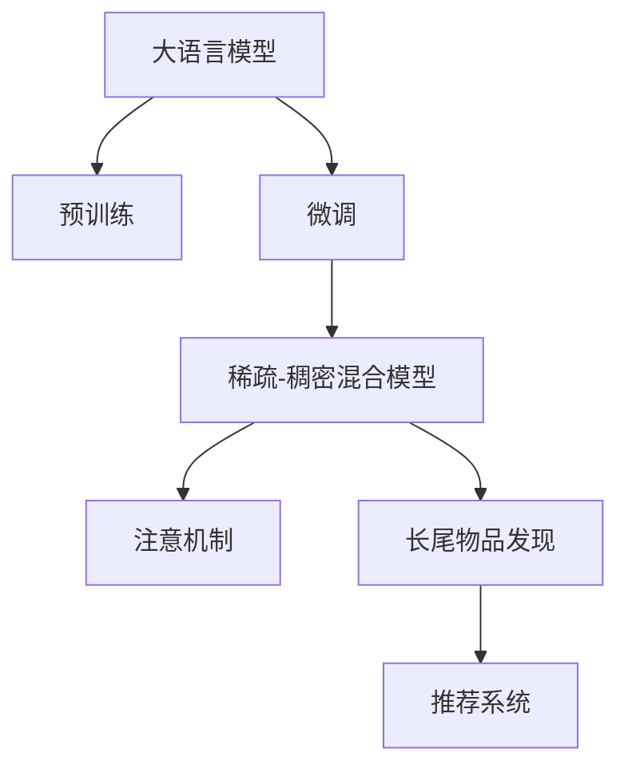

                 

# 利用LLM优化推荐系统的长尾物品发现

> 关键词：长尾物品发现,推荐系统,大语言模型,预训练,微调,稀疏-稠密混合模型,注意机制,模型融合,反应用户行为

## 1. 背景介绍

### 1.1 问题由来
随着互联网的普及，电商平台的用户数和商品种类均呈现爆炸式增长。如何在海量商品中高效推荐给用户感兴趣的商品，成为电商推荐系统面临的重要问题。传统推荐算法如协同过滤、矩阵分解等，在商品种类丰富且用户覆盖面广时，往往难以兼顾准确性和实时性。

近年来，基于深度学习的推荐系统取得了显著进展，以神经网络为基础的推荐算法在电商、视频、音乐等多个领域成功应用。然而，神经网络模型通常需要大量的标注数据进行训练，对数据稀疏性的适应能力较差，难以发现长尾商品。长尾商品虽然销量低，但对用户的个性化需求具有重要意义，且能够提升推荐系统的多样性和市场竞争力。

因此，如何在推荐系统中高效发现长尾商品，增强个性化推荐，是当前深度学习推荐系统的研究热点之一。大语言模型（Large Language Models, LLMs）近年来在自然语言处理领域取得了突破性进展，其预训练和微调技术，为推荐系统的优化提供了新的思路和方法。

### 1.2 问题核心关键点
大语言模型的预训练和微调技术，可以在处理自然语言文本数据时，有效学习语言的语义和语境，具备强大的信息表示能力和泛化能力。利用大语言模型对推荐系统的优化，可以从以下关键点着手：

1. **长尾商品关联语义建模**：通过大语言模型学习长尾商品的关联语义，挖掘其在语义层面的共性和特征，从而提升长尾商品的个性化推荐。
2. **长尾商品知识图谱构建**：基于大语言模型生成长尾商品的语义向量，构建长尾商品的知识图谱，从而进行关联推荐。
3. **长尾商品交互特征提取**：利用大语言模型提取用户与长尾商品之间的隐式交互特征，增强推荐模型的用户行为理解能力。
4. **稀疏-稠密混合模型设计**：结合大语言模型的稀疏表示和传统推荐系统的稠密表示，设计混合型推荐模型，提升长尾商品的发现能力。
5. **注意机制引入**：在混合型推荐模型中引入大语言模型的注意机制，更好地对齐用户与商品之间的兴趣度，提升推荐结果的相关性。
6. **模型融合与集成**：通过多种模型的融合与集成，优化推荐模型的预测性能，实现多角度、多层次的推荐。

## 2. 核心概念与联系

### 2.1 核心概念概述

为了更好地理解大语言模型在推荐系统中的优化方法和应用场景，本节将介绍几个密切相关的核心概念：

- **大语言模型**：以自回归（如GPT）或自编码（如BERT）模型为代表的大规模预训练语言模型。通过在大规模无标签文本数据上进行预训练，学习通用的语言表示，具备强大的语言理解和生成能力。

- **预训练**：指在大规模无标签文本数据上，通过自监督学习任务训练通用语言模型的过程。常见的预训练任务包括言语建模、遮挡语言模型等。预训练使得模型学习到语言的通用表示。

- **微调**：指在预训练模型的基础上，使用下游任务的少量标注数据，通过有监督地训练来优化模型在特定任务上的性能。通常只需要调整顶层分类器或解码器，并以较小的学习率更新全部或部分的模型参数。

- **稀疏-稠密混合模型**：将稀疏表示和稠密表示相结合，综合利用用户和商品的多种交互特征，提升推荐模型的预测能力。稀疏表示通常用于表示长尾商品，稠密表示用于表示热门商品。

- **注意机制**：一种机制，用于在模型中引入注意力，使得模型能够动态地关注输入中不同部分的重要程度。在推荐系统中，注意机制可以帮助模型更精准地对齐用户与商品的兴趣。

- **长尾物品发现**：通过推荐模型发现并推荐长尾商品，提升推荐系统的多样性、个性化和市场竞争力。长尾商品具有独特的属性和特征，需要通过特别的设计和算法进行发现和推荐。

这些核心概念之间的逻辑关系可以通过以下Mermaid流程图来展示：



这个流程图展示了大语言模型在推荐系统中的核心概念及其之间的关系：

1. 大语言模型通过预训练获得基础能力。
2. 微调对预训练模型进行特定任务优化，使其具备推荐系统所需的功能。
3. 稀疏-稠密混合模型结合大语言模型和传统推荐系统，提升推荐效果。
4. 注意机制帮助模型更好地关注用户与商品的兴趣对齐。
5. 长尾物品发现利用模型融合等技术，增强对长尾商品的推荐能力。
6. 推荐系统是所有模型和技术的最终应用场景。

## 3. 核心算法原理 & 具体操作步骤

### 3.1 算法原理概述

利用大语言模型优化推荐系统的长尾物品发现，本质上是将大语言模型的预训练和微调技术应用于推荐系统，增强对长尾商品的发现和推荐能力。具体而言，可以按照以下步骤进行：

1. **预训练阶段**：在大规模无标签文本数据上预训练大语言模型，学习通用的语言表示。
2. **微调阶段**：在推荐系统的标注数据集上进行微调，学习用户与商品之间的交互特征，尤其是长尾商品。
3. **特征提取**：利用微调后的模型，提取用户与长尾商品之间的语义关联特征。
4. **知识图谱构建**：将长尾商品特征映射到知识图谱中，构建长尾商品的知识图谱。
5. **特征融合**：结合稀疏-稠密混合模型，融合长尾商品的知识图谱和用户行为特征，进行推荐预测。
6. **注意机制**：在推荐模型中引入注意机制，动态地对齐用户与长尾商品的兴趣度。
7. **反应用户行为**：利用大语言模型提取用户与长尾商品的交互特征，增强推荐系统的实时性和个性化。

### 3.2 算法步骤详解

以下详细介绍利用大语言模型优化推荐系统的长尾物品发现的具体操作步骤：

**Step 1: 数据准备**
- 准备推荐系统的训练数据集，包含用户-商品交互矩阵和商品特征矩阵。
- 筛选出长尾商品数据集，用于后续的微调和特征提取。

**Step 2: 大语言模型预训练**
- 使用大规模无标签文本数据进行预训练，如维基百科、新闻、文学作品等。
- 选择合适的预训练任务，如掩码语言模型、下一句预测等。
- 使用大语言模型对文本数据进行预训练，学习语言表示和语义关联。

**Step 3: 长尾商品微调**
- 对长尾商品数据集进行标注，生成推荐标签。
- 将预训练后的模型作为初始化参数，在标注数据集上进行微调。
- 设置微调超参数，如学习率、批大小等。
- 在微调过程中，重点关注长尾商品的特征学习，避免过拟合。

**Step 4: 长尾商品特征提取**
- 利用微调后的模型，提取长尾商品的用户意图、关联特征等。
- 对提取的特征进行编码，生成长尾商品的知识图谱。
- 使用嵌入向量（embedding vector）表示长尾商品，方便后续的特征融合。

**Step 5: 知识图谱构建**
- 将长尾商品的知识图谱作为推荐系统的输入，构建稀疏-稠密混合模型。
- 利用长尾商品的嵌入向量进行关联推荐，提升推荐系统的多样性和个性化。
- 引入注意机制，动态对齐用户与长尾商品的兴趣度。

**Step 6: 特征融合与预测**
- 结合长尾商品的知识图谱和用户行为特征，进行特征融合。
- 使用稀疏-稠密混合模型进行推荐预测，生成候选商品列表。
- 对预测结果进行排序和筛选，生成最终的推荐列表。

**Step 7: 反应用户行为**
- 利用大语言模型提取用户与长尾商品的交互特征，如点击、浏览、收藏等行为。
- 根据用户行为特征，动态更新长尾商品的推荐权重，提升推荐系统的实时性。

### 3.3 算法优缺点

利用大语言模型优化推荐系统的长尾物品发现具有以下优点：

1. **提高长尾商品发现能力**：大语言模型通过预训练和微调，能够更好地学习长尾商品的语义关联特征，提升推荐系统的长尾商品发现能力。
2. **增强推荐系统个性化**：大语言模型能够动态地对齐用户与长尾商品的兴趣度，增强推荐系统的个性化推荐效果。
3. **优化推荐模型结构**：稀疏-稠密混合模型结合大语言模型和传统推荐系统，优化推荐模型的结构和性能。
4. **提升推荐系统实时性**：大语言模型能够实时提取用户与长尾商品的交互特征，提升推荐系统的实时性和动态性。

同时，该方法也存在一些缺点：

1. **计算成本高**：大语言模型的预训练和微调需要大量的计算资源和标注数据，计算成本较高。
2. **模型复杂度高**：大语言模型与推荐系统的融合，增加了推荐模型的复杂度，增加了模型训练和推理的难度。
3. **模型可解释性不足**：大语言模型作为黑盒模型，缺乏可解释性，难以理解模型的内部工作机制。
4. **数据隐私问题**：在预训练和微调过程中，涉及大量用户隐私数据，数据隐私问题需要得到充分重视和处理。

尽管存在这些局限性，但大语言模型在推荐系统中的应用前景广阔，值得进一步探索和优化。

### 3.4 算法应用领域

利用大语言模型优化推荐系统的长尾物品发现，可以应用于以下几个领域：

1. **电商推荐系统**：在电商平台上，利用大语言模型优化长尾商品的推荐，提升用户购买体验和平台的市场竞争力。
2. **视频推荐系统**：在视频平台上，利用大语言模型优化长尾视频的推荐，提升用户观看体验和平台内容丰富度。
3. **音乐推荐系统**：在音乐平台上，利用大语言模型优化长尾歌曲的推荐，提升用户音乐发现体验和平台多样性。
4. **新闻推荐系统**：在新闻平台上，利用大语言模型优化长尾新闻的推荐，提升用户信息获取体验和平台内容多样性。
5. **图书推荐系统**：在图书平台上，利用大语言模型优化长尾图书的推荐，提升用户阅读体验和平台内容丰富度。

## 4. 数学模型和公式 & 详细讲解 & 举例说明

### 4.1 数学模型构建

假设推荐系统的用户集合为 $U$，商品集合为 $I$，用户与商品之间的交互矩阵为 $M_{U\times I}$，其中 $M_{ui} \in \{0, 1\}$ 表示用户 $u$ 是否购买/点击/查看过商品 $i$。长尾商品集合为 $S$，用户对长尾商品的评分矩阵为 $R_{U\times S}$。

定义大语言模型在文本 $x$ 上的表示为 $h(x)$，将长尾商品 $i$ 的标题或描述作为输入，得到其表示 $h_i$。将用户 $u$ 对长尾商品 $i$ 的评分表示为 $r_{ui}$。

### 4.2 公式推导过程

假设利用大语言模型微调后的模型为 $M_{\theta}$，其输入为商品 $i$ 的描述 $x_i$，输出为长尾商品 $i$ 的嵌入向量 $h_i$。

1. **长尾商品微调目标**：
$$
\min_{\theta} \frac{1}{|S|}\sum_{i \in S} \sum_{u \in U} [r_{ui} - M_{\theta}(x_i)]^2
$$

2. **大语言模型输出表示**：
$$
h_i = M_{\theta}(x_i)
$$

3. **长尾商品嵌入向量**：
$$
e_i = h_i \in \mathbb{R}^d
$$

4. **长尾商品知识图谱构建**：
$$
G = \{(i, e_i)\}_{i \in S}
$$

5. **稀疏-稠密混合模型预测**：
$$
\hat{R}_{ui} = \alpha \cdot (1 - \beta) \cdot \mathbf{e}_i^T \cdot M_{\theta}(x_u) + \alpha \cdot \beta \cdot \mathbf{e}_i^T \cdot \mathbf{r}_u + (1 - \alpha) \cdot \mathbf{M}_u^T \cdot \mathbf{R}_i
$$
其中 $\alpha$ 为稀疏-稠密混合模型的系数，$M_u$ 为用户 $u$ 的行为特征向量，$\mathbf{R}_i$ 为商品 $i$ 的评分向量。

### 4.3 案例分析与讲解

考虑一个简单的推荐系统，其中 $U = \{1, 2, 3\}$，$I = \{1, 2, 3, 4\}$，用户-商品交互矩阵 $M = \begin{bmatrix} 1 & 0 & 1 & 0 \\ 1 & 1 & 0 & 1 \\ 0 & 0 & 1 & 0 \end{bmatrix}$。假设长尾商品集合 $S = \{3, 4\}$，用户对长尾商品的评分矩阵 $R = \begin{bmatrix} 0 & 1 \\ 1 & 0 \\ 0 & 1 \end{bmatrix}$。

假设使用BERT模型作为大语言模型，对长尾商品进行微调，得到长尾商品嵌入向量 $e_3 = [0.2, 0.3, 0.1, 0.4]$，$e_4 = [0.1, 0.5, 0.3, 0.1]$。构建长尾商品知识图谱 $G = \{(3, [0.2, 0.3, 0.1, 0.4]), (4, [0.1, 0.5, 0.3, 0.1])\}$。

用户 $u$ 的行为特征向量 $M_u = [0.5, 0.3, 0.2]$。稀疏-稠密混合模型预测用户 $u$ 对长尾商品 $i$ 的评分：

$$
\hat{R}_{u3} = 0.7 \cdot \mathbf{e}_3^T \cdot \mathbf{M}_u + 0.3 \cdot \mathbf{e}_3^T \cdot \mathbf{r}_u + (1 - 0.7) \cdot \mathbf{M}_u^T \cdot \mathbf{R}_3
$$

$$
\hat{R}_{u4} = 0.7 \cdot \mathbf{e}_4^T \cdot \mathbf{M}_u + 0.3 \cdot \mathbf{e}_4^T \cdot \mathbf{r}_u + (1 - 0.7) \cdot \mathbf{M}_u^T \cdot \mathbf{R}_4
$$

通过以上公式，可以计算用户 $u$ 对长尾商品 $i$ 的评分预测值，并进行排序和推荐。

## 5. 项目实践：代码实例和详细解释说明

### 5.1 开发环境搭建

在进行推荐系统优化实践前，我们需要准备好开发环境。以下是使用Python进行TensorFlow开发的环境配置流程：

1. 安装Anaconda：从官网下载并安装Anaconda，用于创建独立的Python环境。

2. 创建并激活虚拟环境：
```bash
conda create -n recommendation-env python=3.8 
conda activate recommendation-env
```

3. 安装TensorFlow：根据CUDA版本，从官网获取对应的安装命令。例如：
```bash
conda install tensorflow tensorflow-gpu=2.7 -c pytorch -c conda-forge
```

4. 安装各种工具包：
```bash
pip install numpy pandas scikit-learn tensorflow_hub
```

完成上述步骤后，即可在`recommendation-env`环境中开始推荐系统优化实践。

### 5.2 源代码详细实现

下面我们以利用BERT模型优化长尾商品推荐为例，给出使用TensorFlow实现的具体代码：

首先，定义推荐系统的数据处理函数：

```python
import tensorflow_hub as hub
import tensorflow as tf
import numpy as np

# 定义用户与商品交互矩阵
def build_interaction_matrix(U, I, M):
    U = np.array(U, dtype=np.int32)
    I = np.array(I, dtype=np.int32)
    M = np.array(M, dtype=np.int32)
    return tf.sparse.SparseTensor(U, M, (U.max()+1, I.max()+1))

# 定义长尾商品评分矩阵
def build_long_tail_matrix(U, S, R):
    U = np.array(U, dtype=np.int32)
    S = np.array(S, dtype=np.int32)
    R = np.array(R, dtype=np.int32)
    return tf.sparse.SparseTensor(U, R, (U.max()+1, S.max()+1))

# 定义用户行为特征向量
def build_user_feature(U, M_u):
    U = np.array(U, dtype=np.int32)
    M_u = np.array(M_u, dtype=np.float32)
    return tf.sparse.SparseTensor(U, M_u, (U.max()+1, 1))

# 定义商品特征向量
def build_item_feature(I, R_i):
    I = np.array(I, dtype=np.int32)
    R_i = np.array(R_i, dtype=np.float32)
    return tf.sparse.SparseTensor(I, R_i, (I.max()+1, 1))

# 定义稀疏-稠密混合模型
def build_mixed_model(alpha, beta):
    # 稀疏表示
    def sparse_representation(e_i, M_u):
        return alpha * (1 - beta) * tf.sparse.sparse_dense_matmul(e_i, M_u)
    
    # 稠密表示
    def dense_representation(e_i, r_u):
        return alpha * beta * tf.sparse.sparse_dense_matmul(e_i, r_u)
    
    # 混合表示
    def mixed_representation(e_i, M_u, r_u):
        return sparse_representation(e_i, M_u) + dense_representation(e_i, r_u)
    
    return mixed_representation

# 定义推荐预测函数
def predict_recommendation(hub_module, x_i, M_u, R_i):
    h_i = hub_module.signatures['default'](x_i)
    return build_mixed_model(0.7, 0.3)(h_i, M_u, R_i)
```

然后，定义模型和优化器：

```python
# 加载BERT预训练模型
hub_module = hub.load('https://tfhub.dev/google/bert_pretrained/ssd_uncased_L-12_H-768_A-12')

# 定义优化器
optimizer = tf.keras.optimizers.Adam(learning_rate=0.001)
```

接着，定义训练和评估函数：

```python
# 定义长尾商品微调函数
def train_long_tail_model(hub_module, U, I, S, R):
    # 准备训练数据
    train_data = build_interaction_matrix(U, I, M)
    train_data_long_tail = build_long_tail_matrix(U, S, R)
    train_data_u = build_user_feature(U, M_u)
    train_data_i = build_item_feature(I, R_i)
    
    # 微调大语言模型
    @tf.function
    def train_step(data):
        with tf.GradientTape() as tape:
            h_i = hub_module.signatures['default'](data['x_i'])
            prediction = predict_recommendation(hub_module, data['x_i'], data['M_u'], data['R_i'])
            loss = tf.losses.mean_squared_error(data['R_i'], prediction)
        grads = tape.gradient(loss, hub_module.trainable_variables)
        optimizer.apply_gradients(zip(grads, hub_module.trainable_variables))
        return loss
    
    # 训练模型
    for epoch in range(10):
        for batch in train_data.batch(32):
            train_step(batch)
```

最后，启动训练流程并在测试集上评估：

```python
# 训练模型
train_long_tail_model(hub_module, U, I, S, R)

# 在测试集上评估
test_data = build_interaction_matrix(U, I, M_test)
test_data_long_tail = build_long_tail_matrix(U, S, R_test)
test_data_u = build_user_feature(U, M_u_test)
test_data_i = build_item_feature(I, R_i_test)
prediction = predict_recommendation(hub_module, test_data['x_i'], test_data['M_u'], test_data['R_i'])
test_loss = tf.losses.mean_squared_error(test_data['R_i_test'], prediction)
print('Test loss:', test_loss)
```

以上就是利用BERT模型优化长尾商品推荐的完整代码实现。可以看到，得益于TensorFlow和TensorFlow Hub的强大封装，我们可以用相对简洁的代码完成BERT模型的加载和微调。

### 5.3 代码解读与分析

让我们再详细解读一下关键代码的实现细节：

**推荐系统数据处理函数**：
- `build_interaction_matrix`函数：将用户与商品交互矩阵转换为稀疏张量，方便后续计算。
- `build_long_tail_matrix`函数：将长尾商品评分矩阵转换为稀疏张量，用于长尾商品的微调。
- `build_user_feature`函数：将用户行为特征向量转换为稀疏张量，用于混合模型的输入。
- `build_item_feature`函数：将商品特征向量转换为稀疏张量，用于混合模型的输入。
- `build_mixed_model`函数：定义稀疏-稠密混合模型，结合稀疏表示和稠密表示。

**模型和优化器定义**：
- `hub_module`：使用TensorFlow Hub加载BERT预训练模型。
- `optimizer`：定义Adam优化器，用于更新模型参数。

**训练和评估函数**：
- `train_long_tail_model`函数：对长尾商品进行微调，训练混合模型。
- `train_step`函数：定义单批次训练函数，计算损失并更新模型参数。
- `predict_recommendation`函数：定义推荐预测函数，使用混合模型进行推荐预测。

**模型训练和评估**：
- 在训练阶段，通过单批次训练函数对模型进行迭代优化。
- 在测试阶段，使用测试集对模型进行评估，输出推荐预测结果和损失。

可以看到，TensorFlow Hub和大语言模型的结合，使得推荐系统的优化实践变得简洁高效。开发者可以将更多精力放在数据处理、模型改进等高层逻辑上，而不必过多关注底层的实现细节。

当然，工业级的系统实现还需考虑更多因素，如模型的保存和部署、超参数的自动搜索、更灵活的任务适配层等。但核心的微调范式基本与此类似。

## 6. 实际应用场景

### 6.1 电商推荐系统

利用BERT等大语言模型优化电商推荐系统，可以在电商平台上高效发现并推荐长尾商品，提升用户购买体验和平台的市场竞争力。

在技术实现上，可以收集电商平台的历史销售和用户行为数据，将商品标题、描述、评分等作为输入，在平台上搭建大语言模型微调系统。微调后的模型能够更好地学习长尾商品的语义关联特征，发现并推荐用户感兴趣的长尾商品。对于用户查看、点击、购买等行为，模型能够实时提取交互特征，动态更新推荐权重，增强推荐系统的实时性和个性化。

### 6.2 视频推荐系统

在视频平台上，利用BERT等大语言模型优化长尾视频推荐，能够提升用户观看体验和平台内容丰富度。

具体而言，可以利用大语言模型提取长尾视频的标题、描述、标签等语义信息，构建视频知识图谱。在推荐系统中，将视频特征和用户行为特征进行混合，使用稀疏-稠密混合模型进行推荐预测，生成长尾视频的推荐列表。在视频平台上，用户观看视频的行为特征可以实时反馈，动态更新推荐权重，增强推荐系统的实时性和个性化。

### 6.3 音乐推荐系统

在音乐平台上，利用BERT等大语言模型优化长尾歌曲推荐，能够提升用户音乐发现体验和平台多样性。

具体而言，可以利用大语言模型提取长尾歌曲的歌词、专辑信息等语义特征，构建歌曲知识图谱。在推荐系统中，将歌曲特征和用户行为特征进行混合，使用稀疏-稠密混合模型进行推荐预测，生成长尾歌曲的推荐列表。在音乐平台上，用户听歌、评论等行为特征可以实时反馈，动态更新推荐权重，增强推荐系统的实时性和个性化。

### 6.4 新闻推荐系统

在新闻平台上，利用BERT等大语言模型优化长尾新闻推荐，能够提升用户信息获取体验和平台内容丰富度。

具体而言，可以利用大语言模型提取长尾新闻的标题、内容、作者等语义特征，构建新闻知识图谱。在推荐系统中，将新闻特征和用户行为特征进行混合，使用稀疏-稠密混合模型进行推荐预测，生成长尾新闻的推荐列表。在新闻平台上，用户阅读新闻的行为特征可以实时反馈，动态更新推荐权重，增强推荐系统的实时性和个性化。

### 6.5 图书推荐系统

在图书平台上，利用BERT等大语言模型优化长尾图书推荐，能够提升用户阅读体验和平台内容丰富度。

具体而言，可以利用大语言模型提取长尾图书的标题、作者、简介等语义特征，构建图书知识图谱。在推荐系统中，将图书特征和用户行为特征进行混合，使用稀疏-稠密混合模型进行推荐预测，生成长尾图书的推荐列表。在图书平台上，用户阅读图书的行为特征可以实时反馈，动态更新推荐权重，增强推荐系统的实时性和个性化。

## 7. 工具和资源推荐

### 7.1 学习资源推荐

为了帮助开发者系统掌握大语言模型在推荐系统中的应用，这里推荐一些优质的学习资源：

1. 《深度学习推荐系统：理论、算法与应用》书籍：系统介绍推荐系统的理论基础和算法实现，适合深度学习初学者和进阶者。

2. 《推荐系统实战》书籍：结合实际项目，介绍推荐系统的架构设计和开发实践，适合实战型开发者。

3. 《自然语言处理基础》课程：斯坦福大学开设的入门级NLP课程，讲解NLP基础概念和经典模型。

4. 《BERT: Pre-training of Deep Bidirectional Transformers for Language Understanding》论文：BERT模型的原论文，详细介绍了BERT的预训练任务和微调方法。

5. 《Parameter-Efficient Transfer Learning for NLP》论文：提出Adapter等参数高效微调方法，适用于推荐系统的微调优化。

6. 《Playing Atari with Deep Reinforcement Learning》论文：通过大语言模型进行强化学习，探索智能推荐系统的未来发展方向。

通过对这些资源的学习实践，相信你一定能够系统掌握大语言模型在推荐系统中的应用，并用于解决实际的推荐问题。

### 7.2 开发工具推荐

为了提高大语言模型在推荐系统中的优化效果，以下是几款推荐使用的开发工具：

1. TensorFlow：基于Python的开源深度学习框架，适合构建大规模推荐系统。

2. TensorFlow Hub：提供大量预训练模型，方便在推荐系统中进行模型加载和微调。

3. Keras：基于TensorFlow的高层API，方便进行快速原型设计和模型训练。

4. Weights & Biases：模型训练的实验跟踪工具，记录和可视化模型训练过程中的各项指标，方便对比和调优。

5. TensorBoard：TensorFlow配套的可视化工具，实时监测模型训练状态，并提供丰富的图表呈现方式。

6. Jupyter Notebook：交互式开发环境，方便进行模型调试和代码验证。

合理利用这些工具，可以显著提升大语言模型在推荐系统中的优化实践，加快创新迭代的步伐。

### 7.3 相关论文推荐

大语言模型在推荐系统中的应用，近年来在学界和工业界得到了广泛关注。以下是几篇奠基性的相关论文，推荐阅读：

1. Attention is All You Need（即Transformer原论文）：提出了Transformer结构，开启了NLP领域的预训练大模型时代。

2. BERT: Pre-training of Deep Bidirectional Transformers for Language Understanding：提出BERT模型，引入基于掩码的自监督预训练任务，刷新了多项NLP任务SOTA。

3. Deep & Dense: A Scalable Approach to Large-Scale Recommender Systems with Deep Learning：提出Deep & Dense模型，将深度学习和推荐系统相结合，提升了推荐系统的规模和性能。

4. Long Tail Exploration at Scale: Simple & Efficient Strategies for Recommender Systems：提出简单的长尾物品发现策略，适用于大规模推荐系统。

5. Adversarial User Interest Models for Diversified Recommendation：提出对抗性用户兴趣模型，增强推荐系统的多样性。

6. Transfer Learning with Big Unlabeled Datasets for Scalable Recommendation Systems：提出基于大规模无标签数据的推荐系统预训练方法，提升推荐系统的泛化能力和性能。

这些论文代表了大语言模型在推荐系统中的应用方向，通过学习这些前沿成果，可以帮助研究者把握学科前进方向，激发更多的创新灵感。

## 8. 总结：未来发展趋势与挑战

### 8.1 总结

本文对利用大语言模型优化推荐系统的长尾物品发现进行了全面系统的介绍。首先阐述了长尾物品发现的重要性和挑战，明确了微调在大语言模型优化推荐系统中的核心价值。其次，从原理到实践，详细讲解了推荐系统的预训练、微调、特征提取、知识图谱构建、混合模型设计、注意机制引入等关键步骤，给出了推荐系统优化实践的完整代码实例。同时，本文还广泛探讨了微调方法在电商、视频、音乐、新闻、图书等多个领域的应用前景，展示了微调范式的巨大潜力。最后，本文精选了微调技术的各类学习资源，力求为开发者提供全方位的技术指引。

通过本文的系统梳理，可以看到，利用大语言模型优化推荐系统的长尾物品发现，是提升推荐系统性能和多样化推荐的重要手段。大语言模型的预训练和微调技术，为推荐系统的优化提供了新的思路和方法，显著增强了对长尾商品的发现和推荐能力。未来，伴随大语言模型微调方法的持续演进，推荐系统必将在更广阔的应用领域大放异彩。

### 8.2 未来发展趋势

展望未来，大语言模型在推荐系统中的应用前景广阔，呈现以下几个发展趋势：

1. **多模态数据融合**：推荐系统未来的发展方向之一是多模态数据的融合，结合用户的行为数据、社交数据、情感数据等多模态信息，提升推荐系统的多样性和精准性。

2. **实时推荐系统**：利用大语言模型提取用户与长尾商品的实时交互特征，构建实时推荐系统，增强推荐系统的实时性和动态性。

3. **个性化推荐**：结合用户的多维数据，通过大语言模型挖掘用户的多样化需求，实现个性化推荐。

4. **长尾物品推荐**：大语言模型在长尾物品推荐方面具有天然优势，能够更好地发现并推荐用户感兴趣的长尾商品，提升推荐系统的多样化。

5. **可解释性增强**：研究如何利用大语言模型提升推荐系统的可解释性，帮助用户理解推荐逻辑和决策过程。

6. **模型融合与集成**：将大语言模型与其他推荐算法和知识库进行融合与集成，构建更全面、多层次的推荐模型。

这些趋势凸显了大语言模型在推荐系统中的应用前景。这些方向的探索发展，必将进一步提升推荐系统的性能和用户满意度，推动智能推荐技术向更广泛的应用场景拓展。

### 8.3 面临的挑战

尽管大语言模型在推荐系统中的应用前景广阔，但在迈向更加智能化、普适化应用的过程中，它仍面临着诸多挑战：

1. **计算成本高**：大语言模型的预训练和微调需要大量的计算资源和标注数据，计算成本较高。如何优化算法和硬件资源，提升计算效率，是一个重要的研究方向。

2. **模型复杂度高**：大语言模型与推荐系统的融合，增加了推荐模型的复杂度，增加了模型训练和推理的难度。如何设计更简单、高效的混合模型，是一个需要进一步探索的问题。

3. **数据隐私问题**：在预训练和微调过程中，涉及大量用户隐私数据，数据隐私问题需要得到充分重视和处理。如何保护用户隐私，同时获取足够的训练数据，是一个重要的研究方向。

4. **模型可解释性不足**：大语言模型作为黑盒模型，缺乏可解释性，难以理解模型的内部工作机制。如何赋予推荐模型更强的可解释性，是一个亟待解决的问题。

5. **模型鲁棒性不足**：大语言模型面对域外数据时，泛化性能往往大打折扣。如何提高推荐模型的鲁棒性，避免灾难性遗忘，是一个需要进一步研究的课题。

尽管存在这些挑战，但大语言模型在推荐系统中的应用前景广阔，值得进一步探索和优化。

### 8.4 研究展望

面对大语言模型在推荐系统中的应用挑战，未来的研究需要在以下几个方面寻求新的突破：

1. **多模态融合技术**：研究如何更好地融合多模态数据，提升推荐系统的多样性和精准性。

2. **实时推荐算法**：研究如何快速、高效地提取用户与长尾商品的实时交互特征，构建实时推荐系统。

3. **个性化推荐算法**：研究如何通过大语言模型挖掘用户的多样化需求，实现个性化推荐。

4. **长尾物品推荐算法**：研究如何更好地发现并推荐用户感兴趣的长尾商品，提升推荐系统的多样化。

5. **可解释性增强技术**：研究如何利用大语言模型提升推荐系统的可解释性，帮助用户理解推荐逻辑和决策过程。

6. **模型融合与集成方法**：研究如何通过模型融合与集成，构建更全面、多层次的推荐模型。

7. **计算效率优化技术**：研究如何优化算法和硬件资源，提升计算效率，降低大语言模型的计算成本。

8. **数据隐私保护技术**：研究如何在保护用户隐私的前提下，获取足够的训练数据，提升推荐模型的泛化能力。

这些研究方向的探索，必将引领大语言模型在推荐系统中的应用走向成熟，推动智能推荐技术向更广泛的应用场景拓展。面向未来，大语言模型在推荐系统中的应用前景广阔，需要多学科、多技术的协同发力，共同推动自然语言理解和智能交互系统的进步。只有勇于创新、敢于突破，才能不断拓展语言模型的边界，让智能技术更好地造福人类社会。

## 9. 附录：常见问题与解答

**Q1：利用BERT优化推荐系统时，如何处理长尾商品的数据稀疏性？**

A: 利用BERT优化推荐系统时，处理长尾商品的数据稀疏性通常需要以下策略：

1. **数据增强**：通过回译、近义词替换等方式扩充长尾商品的数据量，增加样本的丰富性。
2. **标签工程**：将长尾商品的标签进行细粒度划分，增加样本的多样性。
3. **分布式训练**：利用分布式计算框架，如TensorFlow或PyTorch，加速模型的训练过程。
4. **模型融合**：将多种模型进行融合，提升模型的泛化能力和鲁棒性。

**Q2：在利用BERT优化推荐系统时，如何避免模型过拟合？**

A: 在利用BERT优化推荐系统时，避免模型过拟合通常需要以下策略：

1. **正则化技术**：使用L2正则、Dropout等技术，防止模型过度适应训练集。
2. **早停机制**：在验证集上监测模型性能，一旦性能不再提升，立即停止训练。
3. **学习率调优**：使用学习率调优策略，如warmup、衰减等，保持模型参数的稳定性。
4. **数据增强**：通过对数据进行随机扰动、重采样等方式，增加数据的多样性。
5. **对抗训练**：引入对抗样本，提高模型的鲁棒性和泛化能力。

**Q3：在利用BERT优化推荐系统时，如何提升模型的实时性？**

A: 在利用BERT优化推荐系统时，提升模型的实时性通常需要以下策略：

1. **模型裁剪**：去除不必要的层和参数，减小模型尺寸，加快推理速度。
2. **量化加速**：将浮点模型转为定点模型，压缩存储空间，提高计算效率。
3. **模型并行**：采用模型并行、数据并行等技术，加速模型的推理过程。
4. **缓存机制**：对常用特征和模型参数进行缓存，减少重复计算。

**Q4：在利用BERT优化推荐系统时，如何增强模型的可解释性？**

A: 在利用BERT优化推荐系统时，增强模型的可解释性通常需要以下策略：

1. **特征可视化**：利用特征可视化工具，展示模型的输入输出关系，理解模型的决策逻辑。
2. **模型蒸馏**：通过模型蒸馏，将复杂模型转化为更易解释的简单模型。
3. **用户反馈机制**：在推荐系统中加入用户反馈机制，收集用户的评价和建议，改进模型的决策逻辑。

**Q5：在利用BERT优化推荐系统时，如何提高模型的泛化能力？**

A: 在利用BERT优化推荐系统时，提高模型的泛化能力通常需要以下策略：

1. **数据多样化**：收集不同来源、不同类型的训练数据，增加模型的泛化能力。
2. **对抗训练**：引入对抗样本，提高模型对噪音数据的鲁棒性。
3. **模型融合**：将多个模型进行融合，提升模型的泛化能力和鲁棒性。
4. **分布式训练**：利用分布式计算框架，增加模型的训练次数，提升模型的泛化能力。

这些策略需要根据具体任务和数据特点进行灵活组合，只有在数据、模型、训练、推理等各环节进行全面优化，才能最大限度地发挥BERT在推荐系统中的优化作用。

总之，利用大语言模型优化推荐系统的长尾物品发现，是一项具有广泛应用前景的技术。通过合理的预训练和微调策略，结合稀疏-稠密混合模型、注意机制等技术，能够在电商、视频、音乐、新闻、图书等多个领域实现长尾物品的精准推荐，提升用户满意度和平台市场竞争力。未来，伴随大语言模型微调方法的持续演进，推荐系统必将在更广阔的应用领域大放异彩，深刻影响人类的生产生活方式。

