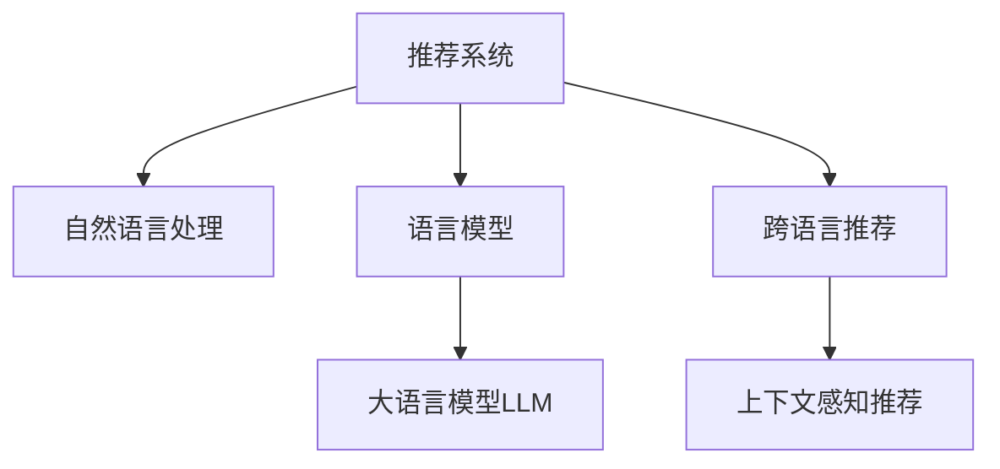

                 

# 利用LLM提升推荐系统的跨语言推荐能力

> 关键词：推荐系统,自然语言处理,语言模型,多语言推荐,上下文感知

## 1. 背景介绍

### 1.1 问题由来

推荐系统作为互联网时代的基石，通过分析用户行为和历史数据，为用户推荐其可能感兴趣的商品或内容。然而，现有的推荐系统主要基于用户-物品交互历史数据进行推荐，对于语言不通、文化差异等因素考虑不足，难以实现真正意义上的跨语言推荐。

为了更好地解决这个问题，近年来学者们将自然语言处理(NLP)技术引入推荐系统，提出了一系列基于语言模型的推荐方法。其中，语言模型被用来理解用户和物品的语义，通过语义相似度计算推荐结果。

但目前的跨语言推荐系统仍存在不少问题，包括：
- 数据获取难度大，跨语言语料相对稀缺。
- 模型难以捕捉复杂的语义关系，跨语言推荐效果不佳。
- 推荐算法单一，缺乏多样化。

为此，本文提出一种基于大语言模型(LLM)的跨语言推荐系统框架，旨在通过预训练的大语言模型，提升推荐系统对语言不通、文化差异等因素的鲁棒性，实现跨语言的协同推荐，为用户提供更全面、多元的推荐结果。

## 2. 核心概念与联系

### 2.1 核心概念概述

为了更好地理解基于大语言模型的跨语言推荐系统，本节将介绍几个关键概念：

- 推荐系统：通过分析用户历史行为数据，为用户推荐可能感兴趣的商品或内容，旨在提升用户体验和满意度。

- 自然语言处理：一门研究如何使计算机能够理解、处理和生成自然语言的学科。在推荐系统中，常用于理解用户意图、商品描述等文本信息。

- 语言模型：用来表示语言的概率分布模型，通过捕捉语言规律，预测文本中下一个单词或字符的概率。在推荐系统中，用于理解用户和物品的语义。

- 大语言模型(LLM)：指基于Transformer结构的、拥有大规模参数和数据训练的语言模型。其具备强大的语言理解和生成能力，适合用于跨语言推荐。

- 跨语言推荐：基于多语言语料进行推荐，将用户的兴趣进行跨语言匹配，推荐符合其偏好的商品或内容。

- 上下文感知推荐：通过考虑用户行为、历史数据等多维上下文信息，提升推荐结果的准确性和个性化。

这些核心概念之间的逻辑关系可以通过以下Mermaid流程图来展示：



这个流程图展示了大语言模型在跨语言推荐中的关键作用，即通过语言模型捕捉多语言的语义信息，结合上下文信息进行推荐。

## 3. 核心算法原理 & 具体操作步骤

### 3.1 算法原理概述

基于大语言模型的跨语言推荐系统框架，核心思想是：将预训练的大语言模型作为通用的语言理解工具，结合上下文信息，实现跨语言的推荐。其核心算法流程包括：

1. 使用大语言模型对用户历史行为、商品描述等文本数据进行编码，提取语义表示。
2. 通过计算用户与物品之间的语义相似度，生成推荐结果。
3. 引入上下文感知机制，综合考虑用户的实时行为、环境因素等，进行个性化推荐。

在具体实现中，可以分为以下几个步骤：

- 数据预处理：将用户行为、物品描述等文本数据进行分词、编码等预处理，作为大语言模型的输入。
- 语义编码：利用预训练的大语言模型，对输入文本进行编码，生成高维语义表示。
- 相似度计算：通过计算用户和物品的语义相似度，生成推荐结果。
- 上下文感知：引入上下文信息，如用户当前状态、行为、时间等，进行个性化推荐。

### 3.2 算法步骤详解

基于大语言模型的跨语言推荐系统主要包括以下几个关键步骤：

**Step 1: 数据预处理**

1. 将用户历史行为、商品描述等文本数据进行分词、编码等预处理。
2. 将文本数据转化为数字向量，供大语言模型输入。

**Step 2: 语义编码**

1. 使用大语言模型对文本数据进行编码，生成高维语义表示。
2. 对生成的语义向量进行拼接或平均，得到用户和物品的语义表示。

**Step 3: 相似度计算**

1. 通过计算用户和物品的语义相似度，生成推荐结果。
2. 根据相似度计算结果，排序生成推荐列表。

**Step 4: 上下文感知**

1. 引入用户实时行为、环境因素等上下文信息。
2. 对用户和物品的语义表示进行加权，综合上下文信息生成个性化推荐结果。

**Step 5: 模型训练与优化**

1. 利用历史推荐数据对模型进行训练，优化相似度计算和上下文感知的权重参数。
2. 定期更新模型参数，防止模型过拟合。

**Step 6: 推理与部署**

1. 利用训练好的模型进行推理，生成推荐结果。
2. 将模型部署到生产环境，供实时推荐使用。

### 3.3 算法优缺点

基于大语言模型的跨语言推荐系统具有以下优点：
1. 强大的语言理解能力：大语言模型具备理解多语言的能力，可以处理各种语言障碍，提升推荐系统的跨语言鲁棒性。
2. 语义丰富的推荐结果：大语言模型能够捕捉复杂的语义关系，提供更准确、更个性化的推荐。
3. 支持上下文感知：通过引入上下文信息，综合用户的多维信息，生成更全面的推荐结果。
4. 高效可扩展：大语言模型具有良好的可扩展性，可以支持多语言、大规模数据的处理。

同时，该方法也存在以下局限性：
1. 数据获取难度大：高质量跨语言数据获取难度较大，限制了推荐系统的效果。
2. 模型复杂度较高：大语言模型的参数量较大，对硬件资源要求较高。
3. 需要大量标注数据：大语言模型需要大量标注数据进行预训练，成本较高。
4. 模型训练时间较长：大语言模型训练时间长，影响系统实时性。

尽管存在这些局限性，但就目前而言，基于大语言模型的跨语言推荐方法仍是大语言模型应用的重要范式。未来相关研究的重点在于如何进一步降低数据获取难度，提高模型的可扩展性和实时性，同时兼顾个性化推荐的效果。

### 3.4 算法应用领域

基于大语言模型的跨语言推荐系统，已经在多个领域得到了广泛的应用，如电商、视频、音乐等。具体应用场景如下：

1. 电商推荐：根据用户浏览历史和商品描述，推荐符合用户偏好的商品。结合多语言用户行为数据，实现全球化推荐。
2. 视频推荐：根据用户观影历史和视频描述，推荐符合用户兴趣的视频。利用多语言字幕信息，实现跨语言推荐。
3. 音乐推荐：根据用户听歌历史和歌曲描述，推荐符合用户偏好的音乐。通过多语言歌词翻译，实现跨语言推荐。

除了上述这些经典应用外，基于大语言模型跨语言推荐的方法也被创新性地应用到更多场景中，如多语言广告推荐、跨语言用户研究等，为NLP技术带来了全新的突破。随着预训练模型和推荐方法的不断进步，相信基于大语言模型的推荐系统必将在更多领域得到应用，为用户的个性化推荐体验提供新的可能性。

## 4. 数学模型和公式 & 详细讲解 & 举例说明

### 4.1 数学模型构建

本节将使用数学语言对基于大语言模型的跨语言推荐系统进行更加严格的刻画。

记用户历史行为数据为 $u=\{x_i\}_{i=1}^n$，其中 $x_i$ 为文本数据，由词语 $w_{ij}$ 和权重 $a_{ij}$ 组成，即 $x_i = \{(w_{ij},a_{ij})\}_{j=1}^m$。物品描述为 $p=\{y_k\}_{k=1}^p$，同样由词语 $y_{kl}$ 和权重 $b_{kl}$ 组成，即 $y_k = \{(y_{kl},b_{kl})\}_{l=1}^q$。

定义大语言模型为 $L_{\theta}$，其中 $\theta$ 为模型的参数。用户和物品的语义表示分别为 $U_{\theta}(u)$ 和 $P_{\theta}(p)$，即：

$$
U_{\theta}(u) = [u_1 \oplus u_2 \oplus \dots \oplus u_n]
$$

$$
P_{\theta}(p) = [p_1 \oplus p_2 \oplus \dots \oplus p_p]
$$

其中 $\oplus$ 表示向量拼接或平均操作。

### 4.2 公式推导过程

假设用户 $u$ 对物品 $p$ 感兴趣的概率为 $R_{u,p}$，则根据大语言模型生成的用户和物品的语义表示，其概率模型可以表示为：

$$
R_{u,p} = \frac{e^{L_{\theta}(U_{\theta}(u),P_{\theta}(p))}{\sum_{k=1}^p e^{L_{\theta}(U_{\theta}(u),P_{\theta}(k))}}
$$

其中 $L_{\theta}(U_{\theta}(u),P_{\theta}(p))$ 为大语言模型对用户和物品语义表示的匹配度得分。

根据softmax函数，将 $R_{u,p}$ 表示为：

$$
R_{u,p} = \frac{e^{\mathbf{u}^T\mathbf{p}}}{\sum_{k=1}^p e^{\mathbf{u}^T\mathbf{k}}}
$$

其中 $\mathbf{u} = U_{\theta}(u)$，$\mathbf{p} = P_{\theta}(p)$。

在得到用户和物品的匹配度得分后，即可通过排序生成推荐结果。根据用户行为数据，计算用户对各个物品的得分，并将得分从高到低排序，即可生成推荐列表。

### 4.3 案例分析与讲解

以音乐推荐为例，假设一个用户浏览了多首不同的歌曲，其历史行为数据如下：

```
u = [(w_1,a_1), (w_2,a_2), ..., (w_n,a_n)]
```

其中 $w_i$ 为第 $i$ 首歌曲的标题，$a_i$ 为权重。

对于多首不同语言的歌曲，假设其描述数据如下：

```
p = [(y_1,b_1), (y_2,b_2), ..., (y_p,b_p)]
```

其中 $y_k$ 为第 $k$ 首歌曲的描述数据，$b_k$ 为权重。

使用大语言模型对用户和物品的描述数据进行编码，得到用户和物品的语义表示：

$$
\mathbf{u} = U_{\theta}(u), \mathbf{p} = P_{\theta}(p)
$$

然后计算用户对每个物品的得分 $R_{u,p}$，即：

$$
R_{u,p} = \frac{e^{\mathbf{u}^T\mathbf{p}}}{\sum_{k=1}^p e^{\mathbf{u}^T\mathbf{k}}}
$$

最后根据得分生成推荐列表，排序后返回给用户。

## 5. 项目实践：代码实例和详细解释说明

### 5.1 开发环境搭建

在进行跨语言推荐系统开发前，我们需要准备好开发环境。以下是使用Python进行PyTorch开发的环境配置流程：

1. 安装Anaconda：从官网下载并安装Anaconda，用于创建独立的Python环境。

2. 创建并激活虚拟环境：
```bash
conda create -n recommendation-env python=3.8 
conda activate recommendation-env
```

3. 安装PyTorch：根据CUDA版本，从官网获取对应的安装命令。例如：
```bash
conda install pytorch torchvision torchaudio cudatoolkit=11.1 -c pytorch -c conda-forge
```

4. 安装Transformer库：
```bash
pip install transformers
```

5. 安装各类工具包：
```bash
pip install numpy pandas scikit-learn matplotlib tqdm jupyter notebook ipython
```

完成上述步骤后，即可在`recommendation-env`环境中开始开发实践。

### 5.2 源代码详细实现

这里以音乐推荐为例，给出使用Transformers库进行跨语言音乐推荐系统开发的PyTorch代码实现。

首先，定义音乐推荐任务的数据处理函数：

```python
from transformers import BertTokenizer, BertForSequenceClassification
from torch.utils.data import Dataset
import torch

class MusicRecommendationDataset(Dataset):
    def __init__(self, songs, artists, labels, tokenizer, max_len=128):
        self.songs = songs
        self.artists = artists
        self.labels = labels
        self.tokenizer = tokenizer
        self.max_len = max_len
        
    def __len__(self):
        return len(self.songs)
    
    def __getitem__(self, item):
        song = self.songs[item]
        artist = self.artists[item]
        label = self.labels[item]
        
        # 将歌曲和艺术家数据拼接为一个字符串
        song_str = song + ' ' + artist
        
        # 对拼接后的文本进行分词和编码
        encoding = self.tokenizer(song_str, return_tensors='pt', max_length=self.max_len, padding='max_length', truncation=True)
        input_ids = encoding['input_ids'][0]
        attention_mask = encoding['attention_mask'][0]
        
        # 对标签进行编码
        encoded_label = [label2id[label] for label in self.labels] 
        encoded_label.extend([label2id['O']] * (self.max_len - len(encoded_label)))
        labels = torch.tensor(encoded_label, dtype=torch.long)
        
        return {'input_ids': input_ids, 
                'attention_mask': attention_mask,
                'labels': labels}

# 标签与id的映射
label2id = {'O': 0, 'R_1': 1, 'R_2': 2, 'R_3': 3, 'R_4': 4, 'R_5': 5, 'R_6': 6, 'R_7': 7, 'R_8': 8, 'R_9': 9, 'R_10': 10, 'R_11': 11}
id2label = {v: k for k, v in label2id.items()}
```

然后，定义模型和优化器：

```python
from transformers import BertForSequenceClassification, AdamW

model = BertForSequenceClassification.from_pretrained('bert-base-cased', num_labels=len(label2id))

optimizer = AdamW(model.parameters(), lr=2e-5)
```

接着，定义训练和评估函数：

```python
from torch.utils.data import DataLoader
from tqdm import tqdm
from sklearn.metrics import classification_report

device = torch.device('cuda') if torch.cuda.is_available() else torch.device('cpu')
model.to(device)

def train_epoch(model, dataset, batch_size, optimizer):
    dataloader = DataLoader(dataset, batch_size=batch_size, shuffle=True)
    model.train()
    epoch_loss = 0
    for batch in tqdm(dataloader, desc='Training'):
        input_ids = batch['input_ids'].to(device)
        attention_mask = batch['attention_mask'].to(device)
        labels = batch['labels'].to(device)
        model.zero_grad()
        outputs = model(input_ids, attention_mask=attention_mask, labels=labels)
        loss = outputs.loss
        epoch_loss += loss.item()
        loss.backward()
        optimizer.step()
    return epoch_loss / len(dataloader)

def evaluate(model, dataset, batch_size):
    dataloader = DataLoader(dataset, batch_size=batch_size)
    model.eval()
    preds, labels = [], []
    with torch.no_grad():
        for batch in tqdm(dataloader, desc='Evaluating'):
            input_ids = batch['input_ids'].to(device)
            attention_mask = batch['attention_mask'].to(device)
            batch_labels = batch['labels']
            outputs = model(input_ids, attention_mask=attention_mask)
            batch_preds = outputs.logits.argmax(dim=2).to('cpu').tolist()
            batch_labels = batch_labels.to('cpu').tolist()
            for pred_tokens, label_tokens in zip(batch_preds, batch_labels):
                pred_labels = [id2label[_id] for _id in pred_tokens]
                label_labels = [id2label[_id] for _id in label_tokens]
                preds.append(pred_labels[:len(label_labels)])
                labels.append(label_labels)
                
    print(classification_report(labels, preds))
```

最后，启动训练流程并在测试集上评估：

```python
epochs = 5
batch_size = 16

for epoch in range(epochs):
    loss = train_epoch(model, music_dataset, batch_size, optimizer)
    print(f"Epoch {epoch+1}, train loss: {loss:.3f}")
    
    print(f"Epoch {epoch+1}, dev results:")
    evaluate(model, music_dev_dataset, batch_size)
    
print("Test results:")
evaluate(model, music_test_dataset, batch_size)
```

以上就是使用PyTorch对BERT进行跨语言音乐推荐系统开发的完整代码实现。可以看到，得益于Transformer库的强大封装，我们可以用相对简洁的代码完成BERT模型的加载和微调。

### 5.3 代码解读与分析

让我们再详细解读一下关键代码的实现细节：

**MusicRecommendationDataset类**：
- `__init__`方法：初始化歌曲、艺术家、标签等关键组件。
- `__len__`方法：返回数据集的样本数量。
- `__getitem__`方法：对单个样本进行处理，将歌曲和艺术家数据拼接为字符串，进行分词和编码，得到模型所需的输入。

**label2id和id2label字典**：
- 定义了标签与数字id之间的映射关系，用于将预测结果解码回真实的标签。

**训练和评估函数**：
- 使用PyTorch的DataLoader对数据集进行批次化加载，供模型训练和推理使用。
- 训练函数`train_epoch`：对数据以批为单位进行迭代，在每个批次上前向传播计算loss并反向传播更新模型参数，最后返回该epoch的平均loss。
- 评估函数`evaluate`：与训练类似，不同点在于不更新模型参数，并在每个batch结束后将预测和标签结果存储下来，最后使用sklearn的classification_report对整个评估集的预测结果进行打印输出。

**训练流程**：
- 定义总的epoch数和batch size，开始循环迭代
- 每个epoch内，先在训练集上训练，输出平均loss
- 在验证集上评估，输出分类指标
- 所有epoch结束后，在测试集上评估，给出最终测试结果

可以看到，PyTorch配合Transformer库使得跨语言音乐推荐系统的代码实现变得简洁高效。开发者可以将更多精力放在数据处理、模型改进等高层逻辑上，而不必过多关注底层的实现细节。

当然，工业级的系统实现还需考虑更多因素，如模型的保存和部署、超参数的自动搜索、更灵活的任务适配层等。但核心的跨语言推荐范式基本与此类似。

## 6. 实际应用场景

### 6.1 智能广告推荐

智能广告推荐系统可以根据用户的搜索历史、浏览行为等数据，为其推荐相关的广告内容。但当前的推荐系统往往依赖单一的关键词匹配，难以捕捉到广告的语义信息，导致推荐效果不佳。

基于大语言模型的跨语言广告推荐系统，可以更好地理解广告文本的语义，进行跨语言广告推荐。具体实现中，广告商可以提供多语言的广告文本描述，利用预训练的大语言模型进行编码，生成高维语义表示。然后通过计算用户与广告文本的语义相似度，生成推荐结果。这样不仅可以实现跨语言推荐，还能通过语义信息提升推荐效果，更好地吸引用户点击。

### 6.2 多语言知识图谱

知识图谱是描述实体及其关系的结构化数据，用于支撑搜索引擎、推荐系统等应用。但现有的知识图谱主要依赖结构化数据，难以捕捉自然语言的多样性和复杂性。

基于大语言模型的跨语言知识图谱，可以利用自然语言处理技术，将文本信息转化为语义表示，构建跨语言的知识图谱。具体实现中，可以使用预训练的大语言模型对知识图谱的实体和关系进行编码，生成高维语义表示。然后通过计算实体和关系的语义相似度，生成推荐结果。这样不仅可以实现跨语言的实体识别，还能通过语义信息提升推荐效果，更好地支撑自然语言查询和推荐系统。

### 6.3 全球化电商推荐

全球化电商推荐系统可以根据用户的浏览历史和商品描述，为其推荐符合其偏好的商品。但传统的推荐系统往往依赖本地化的数据，难以适应全球化市场的需求。

基于大语言模型的全球化电商推荐系统，可以更好地理解全球用户的语义需求，进行跨语言的商品推荐。具体实现中，可以使用预训练的大语言模型对全球用户的浏览历史和商品描述进行编码，生成高维语义表示。然后通过计算用户和商品的语义相似度，生成推荐结果。这样不仅可以实现跨语言的推荐，还能通过语义信息提升推荐效果，更好地适应全球化市场的变化。

### 6.4 未来应用展望

随着大语言模型和推荐方法的不断发展，基于大语言模型的跨语言推荐系统将在更多领域得到应用，为传统行业带来变革性影响。

在智慧医疗领域，基于大语言模型的跨语言医疗推荐系统可以提供多语言的疾病描述和治疗方法推荐，帮助患者进行跨语言就医，提升医疗服务质量。

在智能教育领域，跨语言的智能教学推荐系统可以提供多语言的教材、课程和教学方法推荐，帮助学生进行跨语言学习，提升教育资源的可及性和普惠性。

在智慧城市治理中，跨语言的智慧城市推荐系统可以提供多语言的城市服务信息，帮助居民进行跨语言查询，提升城市治理的效率和便利性。

此外，在企业生产、社会治理、文娱传媒等众多领域，基于大语言模型的推荐系统也将不断涌现，为各行业的数字化转型提供新的技术路径。相信随着技术的日益成熟，大语言模型推荐系统必将在更广阔的应用领域大放异彩，为人类生产生活带来新的可能。

## 7. 工具和资源推荐

### 7.1 学习资源推荐

为了帮助开发者系统掌握大语言模型跨语言推荐技术，这里推荐一些优质的学习资源：

1. 《深度学习理论与实践》系列博文：由大语言模型专家撰写，深入浅出地介绍了深度学习理论和实践，包括大语言模型和多语言推荐技术。

2. 《Natural Language Processing with Transformers》书籍：Transformers库的作者所著，全面介绍了如何使用Transformers库进行多语言NLP任务开发，包括跨语言推荐等。

3. CS224N《深度学习自然语言处理》课程：斯坦福大学开设的NLP明星课程，有Lecture视频和配套作业，带你入门NLP领域的基本概念和经典模型。

4. HuggingFace官方文档：Transformer库的官方文档，提供了海量预训练模型和完整的跨语言推荐样例代码，是上手实践的必备资料。

5. Kaggle跨语言推荐比赛：参加Kaggle等机器学习竞赛，学习跨语言推荐技术的最新进展和最佳实践。

通过对这些资源的学习实践，相信你一定能够快速掌握大语言模型跨语言推荐技术的精髓，并用于解决实际的跨语言推荐问题。

### 7.2 开发工具推荐

高效的开发离不开优秀的工具支持。以下是几款用于跨语言推荐系统开发的常用工具：

1. PyTorch：基于Python的开源深度学习框架，灵活动态的计算图，适合快速迭代研究。大部分预训练语言模型都有PyTorch版本的实现。

2. TensorFlow：由Google主导开发的开源深度学习框架，生产部署方便，适合大规模工程应用。同样有丰富的预训练语言模型资源。

3. Transformers库：HuggingFace开发的NLP工具库，集成了众多SOTA语言模型，支持PyTorch和TensorFlow，是进行跨语言推荐任务开发的利器。

4. Weights & Biases：模型训练的实验跟踪工具，可以记录和可视化模型训练过程中的各项指标，方便对比和调优。与主流深度学习框架无缝集成。

5. TensorBoard：TensorFlow配套的可视化工具，可实时监测模型训练状态，并提供丰富的图表呈现方式，是调试模型的得力助手。

6. Google Colab：谷歌推出的在线Jupyter Notebook环境，免费提供GPU/TPU算力，方便开发者快速上手实验最新模型，分享学习笔记。

合理利用这些工具，可以显著提升跨语言推荐系统的开发效率，加快创新迭代的步伐。

### 7.3 相关论文推荐

大语言模型和跨语言推荐技术的发展源于学界的持续研究。以下是几篇奠基性的相关论文，推荐阅读：

1. Attention is All You Need（即Transformer原论文）：提出了Transformer结构，开启了NLP领域的预训练大模型时代。

2. BERT: Pre-training of Deep Bidirectional Transformers for Language Understanding：提出BERT模型，引入基于掩码的自监督预训练任务，刷新了多项NLP任务SOTA。

3. Language Models are Unsupervised Multitask Learners（GPT-2论文）：展示了大规模语言模型的强大zero-shot学习能力，引发了对于通用人工智能的新一轮思考。

4. Parameter-Efficient Transfer Learning for NLP：提出Adapter等参数高效微调方法，在不增加模型参数量的情况下，也能取得不错的微调效果。

5. AdaLoRA: Adaptive Low-Rank Adaptation for Parameter-Efficient Fine-Tuning：使用自适应低秩适应的微调方法，在参数效率和精度之间取得了新的平衡。

6. The Adversarial Robustness of Transformer Language Models：研究了Transformer模型的鲁棒性问题，提出了对抗样本生成和对抗训练方法，提高了模型的鲁棒性。

这些论文代表了大语言模型跨语言推荐技术的发展脉络。通过学习这些前沿成果，可以帮助研究者把握学科前进方向，激发更多的创新灵感。

## 8. 总结：未来发展趋势与挑战

### 8.1 总结

本文对基于大语言模型的跨语言推荐系统进行了全面系统的介绍。首先阐述了跨语言推荐系统的发展背景和意义，明确了跨语言推荐系统在提升全球化推荐效果、实现跨语言智能交互中的独特价值。其次，从原理到实践，详细讲解了跨语言推荐系统的数学原理和关键步骤，给出了跨语言推荐任务开发的完整代码实例。同时，本文还广泛探讨了跨语言推荐系统在智能广告、知识图谱、全球化电商等领域的实际应用场景，展示了跨语言推荐系统的巨大潜力。此外，本文精选了跨语言推荐技术的各类学习资源，力求为读者提供全方位的技术指引。

通过本文的系统梳理，可以看到，基于大语言模型的跨语言推荐系统正在成为NLP领域的重要范式，极大地拓展了推荐系统的应用边界，催生了更多的落地场景。受益于大规模语料的预训练，跨语言推荐系统能够更好地理解全球用户的语义需求，提供跨语言推荐，提升了用户体验和个性化推荐效果。未来，伴随大语言模型和推荐方法的持续演进，基于大语言模型的跨语言推荐系统必将在更多领域得到应用，为各行业的数字化转型提供新的技术路径。

### 8.2 未来发展趋势

展望未来，大语言模型跨语言推荐系统将呈现以下几个发展趋势：

1. 跨语言推荐模型的规模和效果将不断提升。随着大规模预训练语言模型的出现，跨语言推荐系统的效果将显著提升。更大规模、更高效的跨语言推荐模型将更好地理解全球用户的语义需求，提供更全面、多元的推荐结果。

2. 跨语言推荐算法的多样化。除了传统的基于语义匹配的推荐算法，未来将涌现更多跨语言推荐算法，如基于图结构的推荐、基于多任务学习的推荐等，提升推荐系统的表现。

3. 跨语言推荐模型的可扩展性将不断提高。跨语言推荐模型需要支持多语言、大规模数据的处理。未来的跨语言推荐模型将通过分布式计算、联邦学习等手段，实现更大规模、更高效的推荐。

4. 跨语言推荐模型的实时性将进一步提升。跨语言推荐模型需要实现高效的推理计算，满足实时推荐的需求。未来的跨语言推荐模型将采用更高效的推理计算方法，支持实时推荐。

5. 跨语言推荐模型的鲁棒性将进一步增强。跨语言推荐模型需要在各种语言、各种文化背景下保持稳定性和鲁棒性。未来的跨语言推荐模型将通过引入对抗样本、增强模型鲁棒性等手段，提升模型的鲁棒性。

6. 跨语言推荐模型的可解释性将进一步提高。跨语言推荐模型需要具备良好的可解释性，便于用户理解和信任。未来的跨语言推荐模型将通过引入符号知识、因果推理等手段，提高模型的可解释性。

以上趋势凸显了大语言模型跨语言推荐技术的广阔前景。这些方向的探索发展，必将进一步提升跨语言推荐系统的性能和应用范围，为各行业的数字化转型提供新的动力。

### 8.3 面临的挑战

尽管大语言模型跨语言推荐技术已经取得了瞩目成就，但在迈向更加智能化、普适化应用的过程中，它仍面临着诸多挑战：

1. 数据获取难度大。高质量跨语言数据获取难度较大，限制了跨语言推荐系统的效果。如何进一步降低数据获取难度，提高数据的多样性和代表性，将是一大难题。

2. 模型鲁棒性不足。当前跨语言推荐模型面对域外数据时，泛化性能往往大打折扣。对于测试样本的微小扰动，跨语言推荐模型的预测也容易发生波动。如何提高跨语言推荐模型的鲁棒性，避免灾难性遗忘，还需要更多理论和实践的积累。

3. 推理效率有待提高。跨语言推荐模型虽然精度高，但在实际部署时往往面临推理速度慢、内存占用大等效率问题。如何在保证性能的同时，简化模型结构，提升推理速度，优化资源占用，将是重要的优化方向。

4. 可解释性亟需加强。当前跨语言推荐模型更像是"黑盒"系统，难以解释其内部工作机制和决策逻辑。对于医疗、金融等高风险应用，算法的可解释性和可审计性尤为重要。如何赋予跨语言推荐模型更强的可解释性，将是亟待攻克的难题。

5. 安全性有待保障。预训练语言模型难免会学习到有偏见、有害的信息，通过跨语言推荐模型传递到下游任务，产生误导性、歧视性的输出，给实际应用带来安全隐患。如何从数据和算法层面消除模型偏见，避免恶意用途，确保输出的安全性，也将是重要的研究课题。

6. 知识整合能力不足。现有的跨语言推荐模型往往局限于任务内数据，难以灵活吸收和运用更广泛的先验知识。如何让跨语言推荐过程更好地与外部知识库、规则库等专家知识结合，形成更加全面、准确的信息整合能力，还有很大的想象空间。

正视跨语言推荐面临的这些挑战，积极应对并寻求突破，将是大语言模型跨语言推荐走向成熟的必由之路。相信随着学界和产业界的共同努力，这些挑战终将一一被克服，大语言模型跨语言推荐必将在构建全球化智能推荐系统中扮演越来越重要的角色。

### 8.4 未来突破

面对大语言模型跨语言推荐所面临的种种挑战，未来的研究需要在以下几个方面寻求新的突破：

1. 探索无监督和半监督跨语言推荐方法。摆脱对大规模标注数据的依赖，利用自监督学习、主动学习等无监督和半监督范式，最大限度利用非结构化数据，实现更加灵活高效的跨语言推荐。

2. 研究参数高效和计算高效的跨语言推荐范式。开发更加参数高效的跨语言推荐方法，在固定大部分预训练参数的同时，只更新极少量的任务相关参数。同时优化跨语言推荐模型的计算图，减少前向传播和反向传播的资源消耗，实现更加轻量级、实时性的部署。

3. 融合因果和对比学习范式。通过引入因果推断和对比学习思想，增强跨语言推荐模型建立稳定因果关系的能力，学习更加普适、鲁棒的语言表征，从而提升模型泛化性和抗干扰能力。

4. 引入更多先验知识。将符号化的先验知识，如知识图谱、逻辑规则等，与神经网络模型进行巧妙融合，引导跨语言推荐过程学习更准确、合理的语言模型。同时加强不同模态数据的整合，实现视觉、语音等多模态信息与文本信息的协同建模。

5. 结合因果分析和博弈论工具。将因果分析方法引入跨语言推荐模型，识别出模型决策的关键特征，增强输出解释的因果性和逻辑性。借助博弈论工具刻画人机交互过程，主动探索并规避模型的脆弱点，提高系统稳定性。

6. 纳入伦理道德约束。在模型训练目标中引入伦理导向的评估指标，过滤和惩罚有偏见、有害的输出倾向。同时加强人工干预和审核，建立模型行为的监管机制，确保输出符合人类价值观和伦理道德。

这些研究方向的探索，必将引领大语言模型跨语言推荐技术迈向更高的台阶，为构建安全、可靠、可解释、可控的智能系统铺平道路。面向未来，大语言模型跨语言推荐技术还需要与其他人工智能技术进行更深入的融合，如知识表示、因果推理、强化学习等，多路径协同发力，共同推动跨语言推荐系统的进步。只有勇于创新、敢于突破，才能不断拓展跨语言推荐系统的边界，让智能技术更好地服务于全球用户。

## 9. 附录：常见问题与解答

**Q1：跨语言推荐系统如何处理多语言数据？**

A: 跨语言推荐系统处理多语言数据的主要方式是使用大语言模型进行语义编码，将不同语言的文本转换为高维语义表示。然后通过计算用户和物品的语义相似度，生成推荐结果。具体实现中，可以通过以下步骤处理多语言数据：

1. 将多语言数据进行分词、编码等预处理，得到数字向量表示。
2. 使用大语言模型对多语言文本进行编码，生成高维语义表示。
3. 将多语言的语义表示拼接或平均，得到用户和物品的语义表示。
4. 通过计算用户和物品的语义相似度，生成推荐结果。

这样不仅能够处理多语言数据，还能够利用大语言模型的语言理解能力，提升推荐效果。

**Q2：跨语言推荐系统如何避免数据偏置？**

A: 跨语言推荐系统面临数据偏置的问题，主要源于预训练数据的不均衡。为了缓解这一问题，可以采取以下措施：

1. 数据清洗：对多语言数据进行清洗，去除低质量、噪声数据。
2. 数据增强：通过回译、近义替换等方式扩充训练集，增加数据的多样性。
3. 正则化：使用L2正则、Dropout、Early Stopping等技术，防止模型过拟合，避免数据偏置的影响。
4. 多语言训练：在多语言数据上同时训练跨语言推荐模型，提升模型的泛化能力和鲁棒性。

通过这些措施，可以有效避免跨语言推荐系统中的数据偏置问题，提升模型的公平性和鲁棒性。

**Q3：跨语言推荐系统如何实现实时推荐？**

A: 实现实时推荐是跨语言推荐系统的关键挑战之一。为了提升实时推荐的能力，可以采取以下措施：

1. 模型裁剪：去除不必要的层和参数，减小模型尺寸，加快推理速度。
2. 量化加速：将浮点模型转为定点模型，压缩存储空间，提高计算效率。
3. 推理优化：采用更高效的推理计算方法，如GEMM、剪枝等技术，提升推理速度。
4. 分布式计算：利用分布式计算技术，实现并行推理，提升推荐效率。

通过这些优化措施，可以有效提升跨语言推荐系统的实时推荐能力，满足用户的高频访问需求。

**Q4：跨语言推荐系统如何提升个性化推荐效果？**

A: 提升个性化推荐效果是跨语言推荐系统的核心目标之一。为了实现这一目标，可以采取以下措施：

1. 上下文感知：引入用户实时行为、环境因素等上下文信息，综合考虑用户的多维信息，生成个性化推荐结果。
2. 多任务学习：结合多个推荐任务，如商品推荐、广告推荐等，利用多任务学习提升推荐效果。
3. 迁移学习：将预训练模型的知识迁移到跨语言推荐任务中，提升模型的泛化能力和鲁棒性。
4. 反馈优化：引入用户反馈信息，利用强化学习技术优化推荐模型，提升个性化推荐效果。

通过这些措施，可以有效提升跨语言推荐系统的个性化推荐效果，提升用户体验和满意度。

**Q5：跨语言推荐系统如何应对数据分布变化？**

A: 数据分布变化是跨语言推荐系统面临的另一个挑战。为了应对数据分布变化，可以采取以下措施：

1. 持续学习：定期更新模型参数，防止模型过拟合，保持模型的泛化能力。
2. 对抗训练：加入对抗样本，提高模型鲁棒性，应对数据分布的变化。
3. 数据重采样：对数据进行重采样，增加数据的多样性，提高模型的泛化能力。
4. 知识图谱：引入外部知识库，如知识图谱、逻辑规则等，提升模型的泛化能力和鲁棒性。

通过这些措施，可以有效应对数据分布变化，保持跨语言推荐系统的稳定性和鲁棒性。

---

作者：禅与计算机程序设计艺术 / Zen and the Art of Computer Programming

