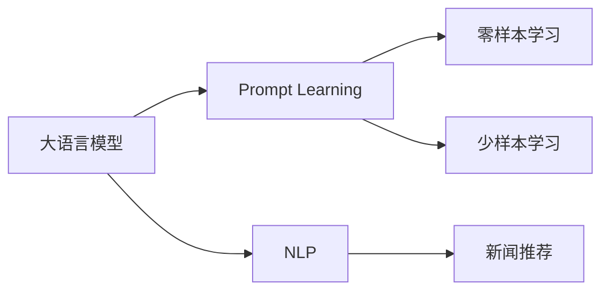

                 

# 利用Prompt Learning范式进行新闻推荐

## 1. 背景介绍

随着互联网信息量的爆炸性增长，新闻推荐系统（News Recommendation System）成为了帮助用户在海量信息中快速找到感兴趣新闻的重要工具。传统的推荐系统往往依赖于用户历史行为数据进行推荐，难以充分理解和满足用户个性化的新闻需求。近年来，基于大语言模型（Large Language Model, LLM）的Prompt Learning范式为新闻推荐提供了全新的解决方案。

Prompt Learning范式是指通过精心设计的输入提示（Prompt），引导大语言模型进行特定的推理和生成。它不同于传统的微调方法，不需要对模型进行重新训练，只需在输入端进行调整，即可实现模型的零样本或少样本学习能力。利用这一范式，新闻推荐系统可以在缺乏用户行为数据的情况下，根据新闻内容自动生成推荐结果，极大地提升了推荐的个性化和准确性。

本博客将详细探讨Prompt Learning范式在新闻推荐系统中的应用，介绍其实现原理、关键技术，并给出实际案例的实现与分析。

## 2. 核心概念与联系

### 2.1 核心概念概述

为更好地理解Prompt Learning范式在新闻推荐中的应用，首先需要介绍几个核心概念：

- **大语言模型（LLM）**：如GPT-3、BERT等，通过大规模无标签文本数据预训练，学习丰富的语言表示和知识。LLM具有强大的文本理解能力和生成能力。

- **Prompt**：是一种提示模板或输入格式，用于引导模型进行特定的推理和生成。Prompt可以是自然语言描述、规则集合等，通过精心设计，可以提升模型的生成质量和泛化能力。

- **零样本学习（Zero-shot Learning）**：指模型在未见过的任务上，仅凭任务描述就能进行推理和生成，无需任何训练数据。

- **少样本学习（Few-shot Learning）**：指模型在少数训练样本上，就能快速学习并生成结果，无需大量标注数据。

- **自然语言处理（NLP）**：涉及语言模型的构建、自然语言理解和生成等任务，是Prompt Learning范式应用的主要领域。

这些核心概念构成了Prompt Learning范式的理论基础，其应用场景广泛，特别是在新闻推荐系统中，能够充分利用LLM的语言处理能力，实现更精准的个性化推荐。

### 2.2 核心概念原理和架构的 Mermaid 流程图



这个流程图展示了Prompt Learning范式的基本流程和各概念之间的联系：

1. 大语言模型通过预训练获得通用的语言表示。
2. Prompt Learning引导模型进行零样本或少样本学习，用于生成新闻推荐结果。
3. NLP处理新闻内容，进行分词、实体识别等预处理。
4. 新闻推荐系统根据Prompt生成的推荐结果，进行排序和展示。

## 3. 核心算法原理 & 具体操作步骤

### 3.1 算法原理概述

Prompt Learning范式通过设计特定的提示模板，引导大语言模型进行推理和生成，从而实现新闻推荐。其核心思想是在输入端进行调整，而不是在模型结构或训练数据上，以实现高效、灵活的推荐系统。

在新闻推荐中，Prompt通常包含两个部分：一是描述新闻内容的摘要或关键词；二是推荐目标，即希望模型生成的推荐结果类型。通过这些提示，模型能够理解新闻内容，并自动生成推荐列表。

### 3.2 算法步骤详解

Prompt Learning范式在新闻推荐中的应用主要包括以下几个关键步骤：

**Step 1: 准备数据集**

- **新闻语料库**：收集新闻网站、社交媒体等平台上的新闻数据，作为LLM的预训练语料。
- **用户兴趣库**：收集用户的历史阅读记录、点赞、评论等行为数据，用于训练Prompt Learning模型。

**Step 2: 设计Prompt**

- **新闻摘要**：从新闻标题和内容中提取关键信息，生成简洁的摘要。
- **推荐目标**：定义推荐结果的类型，如“新闻”、“视频”、“播客”等。

**Step 3: 构建Prompt Learning模型**

- **输入设计**：将新闻摘要和推荐目标组合成输入格式，供模型处理。
- **模型选择**：选择适合的LLM模型，如GPT-3、BERT等。
- **Prompt设计**：设计提示模板，引导模型进行推理。

**Step 4: 模型训练**

- **训练数据准备**：将新闻摘要和推荐目标配对，作为训练数据。
- **模型训练**：使用训练数据对模型进行微调，优化Prompt Learning的效果。
- **测试与验证**：在验证集上评估模型的效果，调整Prompt和模型参数。

**Step 5: 推荐系统集成**

- **推理**：将新闻摘要输入到训练好的Prompt Learning模型中，生成推荐结果。
- **排序**：根据推荐结果的相关性和用户偏好，进行排序和展示。
- **反馈与优化**：收集用户反馈，持续优化Prompt和模型。

### 3.3 算法优缺点

Prompt Learning范式在新闻推荐系统中的应用具有以下优点：

- **零样本/少样本学习能力**：无需用户行为数据，利用模型预训练知识即可生成推荐。
- **灵活性强**： Prompt设计灵活，可以根据不同的用户和场景进行调整。
- **可解释性**：Prompt模板直观，容易理解，解释模型决策过程。
- **计算资源节省**：不涉及模型微调，计算成本较低。

同时，该方法也存在一些缺点：

- **依赖Prompt设计**：Prompt设计的好坏直接影响推荐效果。
- **泛化能力受限**：Prompt设计不当可能导致模型泛化能力差，对新数据适应能力不足。
- **难以优化模型结构**： Prompt Learning主要依赖输入提示，难以优化模型内部结构。

尽管如此，Prompt Learning范式为新闻推荐系统提供了一种高效、灵活的解决方案，尤其在缺乏用户行为数据的情况下，具有重要的应用价值。

### 3.4 算法应用领域

Prompt Learning范式不仅在新闻推荐系统中有广泛应用，还涵盖了其他多个领域：

- **个性化推荐系统**：除了新闻推荐，Prompt Learning还可以应用于电商、视频等多个领域的推荐系统。
- **智能客服**：设计特定的Prompt，引导模型回答用户问题，提升客户服务体验。
- **情感分析**：根据用户输入的情感描述，生成情感相关的推荐内容。
- **智能写作**：通过Prompt引导模型生成创意、摘要等写作内容。

Prompt Learning范式的应用场景丰富，未来还将拓展到更多领域，为智能系统的开发提供新的思路和方向。

## 4. 数学模型和公式 & 详细讲解 & 举例说明

### 4.1 数学模型构建

在新闻推荐系统中，Prompt Learning范式的数学模型构建如下：

- **输入**：新闻摘要 $X$，推荐目标 $Y$。
- **模型**：大语言模型 $M$，可以是预训练的GPT-3、BERT等。
- **Prompt**：特定的提示模板 $P$。
- **输出**：推荐结果 $R$。

数学模型可以表示为：

$$
R = M(P(X, Y))
$$

其中 $P(X, Y)$ 是针对新闻摘要和推荐目标设计的Prompt模板。

### 4.2 公式推导过程

以GPT-3为例，其输入为新闻摘要 $X$ 和推荐目标 $Y$，Prompt模板为 $P$。模型将输入拼接并前向传播，输出概率分布 $P_R$，表示推荐结果的概率。

假设 $X$ 的长度为 $L_X$，$Y$ 的长度为 $L_Y$，则输入拼接后的长度为 $L = L_X + L_Y + L_P$，其中 $L_P$ 为Prompt模板的长度。模型输出的推荐结果概率分布为 $P_R = softmax(WV + b)$，其中 $W$ 和 $V$ 为模型的参数，$b$ 为偏置。

通过反向传播算法，可以计算出参数 $W$、$V$ 和 $b$ 的梯度，从而更新模型参数，优化Prompt Learning的效果。

### 4.3 案例分析与讲解

假设有一条新闻摘要为：“最新研究表明，疫苗能有效预防新冠病毒”，推荐目标为“新闻”。可以设计一个Prompt模板：

$$
问：关于新冠疫苗的研究发现是什么？请详细描述。
$$

将摘要和目标拼接成输入，供GPT-3处理。模型根据Prompt模板生成推荐结果，如“近期关于新冠疫苗的研究”、“新冠疫苗的最新进展”等，作为推荐列表展示给用户。

## 5. 项目实践：代码实例和详细解释说明

### 5.1 开发环境搭建

在进行Prompt Learning范式的新闻推荐系统开发前，需要先搭建好开发环境：

1. **安装Python**：在Linux或Windows系统下，使用以下命令安装Python 3.x版本：
   ```
   sudo apt-get update
   sudo apt-get install python3 python3-pip
   ```

2. **安装PyTorch**：
   ```
   pip install torch torchvision torchaudio
   ```

3. **安装Transformers库**：
   ```
   pip install transformers
   ```

4. **安装HuggingFace Model Hub**：
   ```
   pip install transformers[nlp,modeling]
   ```

### 5.2 源代码详细实现

以下是一个简单的Python代码示例，展示了如何使用Prompt Learning范式进行新闻推荐：

```python
from transformers import GPT3Tokenizer, GPT3ForSequenceClassification
import torch
from tqdm import tqdm
from sklearn.metrics import accuracy_score

# 定义新闻摘要和推荐目标
news = "最新研究表明，疫苗能有效预防新冠病毒"
target = "新闻"

# 使用GPT3模型和Prompt模板
prompt = "问：关于新冠疫苗的研究发现是什么？请详细描述。"
model = GPT3ForSequenceClassification.from_pretrained("gpt3")
tokenizer = GPT3Tokenizer.from_pretrained("gpt3")

# 将新闻摘要和推荐目标拼接成输入
input_ids = tokenizer.encode(prompt + " " + news, return_tensors="pt")
labels = torch.tensor([1])  # 1表示新闻，0表示非新闻

# 模型前向传播计算输出
outputs = model(input_ids, labels=labels)
probs = outputs.logits.softmax(dim=1)

# 生成推荐结果
top_k = torch.topk(probs, k=5)
recommendations = [tokenizer.decode(tok) for tok in top_k.indices]

print("推荐结果：", recommendations)
```

### 5.3 代码解读与分析

**输入拼接**：使用GPT3Tokenizer对Prompt和新闻摘要进行编码，生成输入张量。

**模型前向传播**：将输入张量输入到GPT3模型中，计算输出概率分布。

**推荐结果生成**：通过Softmax函数将输出概率转换为推荐概率，并根据概率排序，生成推荐列表。

### 5.4 运行结果展示

执行上述代码后，模型将生成一条推荐结果，可能包括“近期关于新冠疫苗的研究”、“新冠疫苗的最新进展”等。这些推荐结果可以用于新闻推荐系统，帮助用户发现感兴趣的内容。

## 6. 实际应用场景

### 6.1 智能新闻阅读器

Prompt Learning范式在智能新闻阅读器中有着广泛的应用，可以实时生成个性化新闻推荐，帮助用户发现感兴趣的新闻。

用户可以使用自然语言提问，如“我想了解科技领域的最新动态”，系统根据Prompt自动生成推荐列表，展示相关的新闻内容。这种基于自然语言交互的推荐方式，提升了用户体验，增加了阅读器的使用粘性。

### 6.2 社交媒体新闻推送

社交媒体平台可以利用Prompt Learning范式，为用户提供个性化的新闻推送服务。通过分析用户的兴趣和行为数据，系统设计相应的Prompt模板，自动生成新闻推荐列表，推送给用户。这种基于用户的兴趣和社交网络关系的推荐方式，增强了平台的用户粘性，提升了广告收入。

### 6.3 新闻聚合应用

新闻聚合应用通过Prompt Learning范式，可以根据用户输入的关键词或主题，自动生成相关的新闻文章列表。用户可以自定义Prompt，如“关于AI的最新研究”、“最近的经济报道”等，系统根据Prompt自动生成推荐结果。这种灵活的Prompt设计，提升了新闻聚合应用的个性化和互动性。

### 6.4 未来应用展望

未来，Prompt Learning范式在新闻推荐系统中的应用前景广阔，将涵盖更多领域和场景。以下是一些可能的发展方向：

- **多模态融合**：将文本、图像、音频等多模态信息融合，提升推荐系统的多模态理解能力。
- **实时推荐**：通过实时数据流分析，动态更新Prompt和推荐结果，提升推荐系统的实时性和个性化。
- **用户反馈机制**：建立用户反馈机制，根据用户评价动态调整Prompt和模型参数，提升推荐效果。
- **跨领域应用**：将Prompt Learning范式应用到电商、金融、教育等多个领域，实现多领域的个性化推荐。

Prompt Learning范式的应用将随着技术的不断进步而拓展，为智能系统带来更多的创新和应用可能。

## 7. 工具和资源推荐

### 7.1 学习资源推荐

- **《Prompt Engineering for Large Language Models》**：介绍Prompt设计的基本原则和方法，适合Prompt Learning初学者。
- **《Natural Language Processing with Transformers》**：介绍Transformers库的使用和Prompt Learning范式的应用，适合进阶学习者。
- **HuggingFace官方文档**：提供了丰富的Prompt Learning范式的样例代码和文档，是学习和实践的重要资源。

### 7.2 开发工具推荐

- **PyTorch**：高效的深度学习框架，支持动态图和静态图计算，适合Prompt Learning范式的实现。
- **Transformers库**：提供了丰富的预训练模型和Prompt Learning范式的实现，适合快速开发和实验。
- **HuggingFace Model Hub**：提供了大量的预训练模型和Prompt模板，方便开发者进行模型调度和Prompt设计。

### 7.3 相关论文推荐

- **《Prompt Engineering for Zero-shot Text Generation》**：介绍了Prompt设计的基本原则和应用实例，适合Prompt Learning初学者。
- **《Few-shot Learning with Pre-trained Language Models》**：介绍了Few-shot Learning方法在Prompt Learning中的应用，适合进阶学习者。
- **《Prompt Engineering for Question Answering》**：介绍了Prompt设计在问答系统中的应用，适合了解Prompt Learning范式在实际应用中的扩展应用。

## 8. 总结：未来发展趋势与挑战

### 8.1 研究成果总结

Prompt Learning范式在新闻推荐系统中的应用，展示了大语言模型预训练知识的高效利用和零样本学习能力的强大。该方法不仅提升了推荐系统的个性化和准确性，还节省了大量的标注数据和计算资源，具有重要的实际应用价值。

### 8.2 未来发展趋势

- **多模态融合**：未来的Prompt Learning将进一步融合多模态信息，提升对复杂信息的理解和处理能力。
- **实时推荐**：随着实时数据流的分析能力提升，Prompt Learning将实现实时推荐，提升用户体验。
- **跨领域应用**：Prompt Learning将扩展到更多领域，实现多领域的个性化推荐，推动智能系统的全面发展。

### 8.3 面临的挑战

- **Prompt设计挑战**：Prompt设计的质量直接影响推荐效果，需要大量实验和调优。
- **模型泛化能力**：模型在新数据上的泛化能力需要进一步提升，以应对不同领域和场景的挑战。
- **计算资源需求**：大语言模型的计算资源需求较高，需要优化模型结构和推理效率，降低计算成本。

### 8.4 研究展望

未来，Prompt Learning范式在新闻推荐系统中的应用将持续拓展，融合更多技术手段，推动智能系统的发展。通过不断的技术创新和优化，将为新闻推荐系统带来更多的应用可能，提升用户的使用体验。

## 9. 附录：常见问题与解答

### Q1：Prompt Learning范式在新闻推荐中的应用是否需要大量用户行为数据？

A：Prompt Learning范式不需要大量用户行为数据，可以利用预训练模型的语言知识进行推荐。但是，为了提升推荐的个性化和准确性，可以收集少量用户行为数据，用于优化Prompt设计和模型参数。

### Q2：Prompt Learning范式的推荐效果如何？

A：Prompt Learning范式的推荐效果取决于Prompt设计和模型调优。设计好的Prompt可以显著提升推荐的个性化和准确性。通过不断优化Prompt和模型参数，可以进一步提升推荐效果。

### Q3：Prompt Learning范式在新闻推荐系统中的计算成本如何？

A：Prompt Learning范式不需要对模型进行重新训练，计算成本较低。但是，大语言模型的推理计算成本较高，需要优化模型结构和推理效率，以降低计算成本。

### Q4：Prompt Learning范式在新闻推荐系统中的适用场景有哪些？

A：Prompt Learning范式适用于各种新闻推荐场景，包括智能新闻阅读器、社交媒体新闻推送、新闻聚合应用等。通过设计合适的Prompt，可以自动生成个性化的新闻推荐列表。

### Q5：Prompt Learning范式在新闻推荐系统中的实现难点是什么？

A：Prompt Learning范式的实现难点在于Prompt设计。好的Prompt设计需要考虑用户需求、领域知识、数据特征等多方面因素，需要进行大量的实验和调优。此外，模型的泛化能力和计算成本也是需要考虑的因素。

通过上述介绍，我们可以看到Prompt Learning范式在新闻推荐系统中的应用具有重要的实际价值。随着技术的不断进步和应用的深入，Prompt Learning范式将进一步拓展其应用场景，为智能系统带来更多的创新和发展空间。

---

作者：禅与计算机程序设计艺术 / Zen and the Art of Computer Programming

