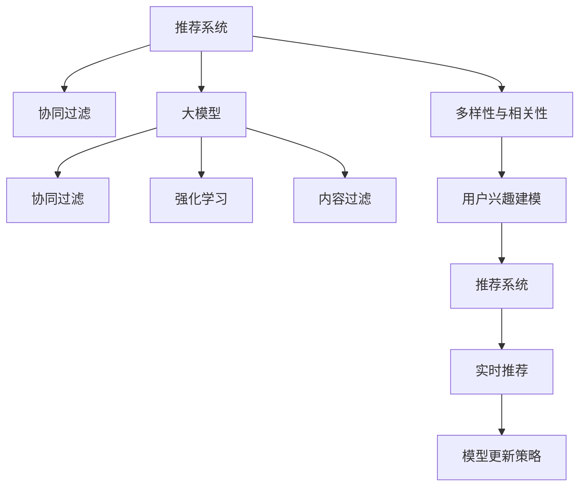

                 

# 利用大模型优化推荐系统的多样性与相关性平衡

> 关键词：推荐系统,多样性,相关性,大模型,深度学习,协同过滤,强化学习,内容过滤

## 1. 背景介绍

### 1.1 问题由来

推荐系统（Recommendation Systems）是现代信息科技领域中的重要应用，旨在为用户提供个性化的信息和服务推荐。在电商、视频、音乐、新闻等众多领域，推荐系统均发挥着至关重要的作用，帮助用户从海量信息中找到真正感兴趣的内容。

然而，推荐系统面临的一大挑战是如何平衡推荐结果的**多样性与相关性**（Diversity vs. Relevance）。相关性指的是推荐内容与用户实际需求的契合度，多样性则强调推荐结果的多样性和新颖性。在实际应用中，过高的相关性可能导致内容单一化，而过于多样性则可能降低推荐效果。

随着深度学习和大模型技术的发展，越来越多的研究者开始尝试使用大模型来优化推荐系统。大模型（Large Model）通常指具有数十亿乃至数百亿参数的神经网络模型，能够从大规模数据中学习到复杂的特征表示。这些模型在多个领域已经展现出卓越的性能，为推荐系统的多样性与相关性平衡提供了新的思路和方法。

### 1.2 问题核心关键点

在大模型优化的推荐系统中，主要涉及以下核心关键点：

- **多样性约束**：确保推荐结果中包含多种不同的内容类型，避免推荐过于集中于某些领域或主题。
- **相关性约束**：保证推荐内容与用户兴趣高度契合，提升用户满意度。
- **用户行为建模**：通过大模型学习用户历史行为和兴趣偏好，进行精准推荐。
- **模型更新策略**：定期更新模型参数，适应新的用户行为和数据变化。
- **实时推荐**：针对用户的即时需求进行实时推荐，提高用户体验。

通过理解这些关键点，我们可以更好地把握大模型在推荐系统中的应用方向和方法。

## 2. 核心概念与联系

### 2.1 核心概念概述

为更好地理解基于大模型的推荐系统，本节将介绍几个密切相关的核心概念：

- **推荐系统**：根据用户的历史行为和兴趣偏好，为其推荐合适的信息和服务。常见的推荐系统有协同过滤、基于内容的推荐、混合推荐等。
- **大模型**：指具有亿级以上参数的神经网络模型，通过大规模数据进行预训练，学习到复杂的特征表示。
- **协同过滤**：基于用户行为相似度进行推荐，分为基于用户的协同过滤和基于物品的协同过滤。
- **强化学习**：利用奖励机制指导模型决策，通过不断试错优化推荐策略。
- **内容过滤**：基于物品的特征信息，为用户推荐与兴趣相符的内容。
- **用户兴趣建模**：通过大模型学习用户行为和兴趣特征，构建用户画像。
- **多样性与相关性**：推荐系统需要同时考虑推荐结果的多样性和相关性，以提升用户体验。

这些核心概念之间的逻辑关系可以通过以下Mermaid流程图来展示：



这个流程图展示了大模型在推荐系统中的应用框架，其核心思想是：

1. 大模型用于协同过滤和内容过滤，提供高质量的推荐结果。
2. 通过多样性与相关性的平衡策略，优化推荐结果的多样性和相关性。
3. 强化学习用于实时推荐，根据用户即时反馈不断优化模型。

## 3. 核心算法原理 & 具体操作步骤

### 3.1 算法原理概述

基于大模型的推荐系统，通过在大规模数据上进行预训练，学习用户行为和物品特征的复杂表示。在微调阶段，利用微调后的模型进行实时推荐，同时通过多样性与相关性约束，优化推荐结果的多样性和相关性。

形式化地，假设大模型为 $M_{\theta}$，用户行为为 $U$，物品特征为 $I$，推荐结果为 $R$。则推荐系统的优化目标可以表示为：

$$
\mathop{\arg\min}_{\theta} \mathcal{L}(M_{\theta},U,I)
$$

其中 $\mathcal{L}$ 为综合多样性和相关性的损失函数，$U$ 和 $I$ 为历史用户行为和物品特征。通过梯度下降等优化算法，微调过程不断更新模型参数 $\theta$，最小化损失函数 $\mathcal{L}$，使得推荐结果逼近最优。

### 3.2 算法步骤详解

基于大模型的推荐系统一般包括以下几个关键步骤：

**Step 1: 准备数据集和模型**

- 收集用户历史行为数据和物品特征数据，构建训练集 $D_{train}$。
- 选择合适的预训练语言模型 $M_{\theta}$，进行微调，使其能够预测用户行为。

**Step 2: 设计推荐目标函数**

- 根据任务需求，设计推荐结果的多样性约束和相关性约束，构建综合目标函数。
- 多样性约束可以通过熵、卡方距离等指标衡量，相关性约束可以通过交叉熵、F1分数等指标衡量。

**Step 3: 微调模型参数**

- 使用AdamW等优化算法，设置合适的学习率，对模型进行微调。
- 通过交叉验证等技术，评估模型性能，不断调整模型参数。

**Step 4: 实时推荐和反馈**

- 对新用户请求进行实时推荐，根据用户反馈调整推荐策略。
- 收集用户反馈数据，如点击率、收藏率等，用于模型更新。

**Step 5: 模型更新和维护**

- 定期更新模型参数，适应新的用户行为和数据变化。
- 使用A/B测试等方法，评估模型更新效果，确保模型稳定性和准确性。

### 3.3 算法优缺点

基于大模型的推荐系统具有以下优点：

- **高效性**：利用大模型的预训练能力，可以大大减少训练时间，提升推荐效率。
- **灵活性**：大模型可以应对复杂的用户行为和物品特征，提供多样化的推荐结果。
- **准确性**：通过微调和学习用户行为，能够生成更精准的推荐内容。

同时，该方法也存在一些局限性：

- **高资源消耗**：大模型通常需要较大的计算资源和存储空间，对硬件设施要求较高。
- **过拟合风险**：大模型在训练集上的表现往往优于测试集，存在一定的过拟合风险。
- **模型可解释性不足**：大模型的决策过程较为复杂，难以解释其内部的推理机制。
- **实时性要求高**：实时推荐系统需要快速处理大量用户请求，对模型响应速度要求较高。

尽管存在这些局限性，但大模型在推荐系统中的应用前景依然广阔，特别是对于个性化需求强、数据量大的场景，大模型能够显著提升推荐效果。

### 3.4 算法应用领域

基于大模型的推荐系统在多个领域得到广泛应用，如：

- **电子商务推荐**：为用户推荐商品、推荐文章等，提升购物体验。
- **内容推荐平台**：如新闻、视频、音乐等，推荐用户感兴趣的内容。
- **广告推荐**：推荐个性化广告，提升广告投放效果。
- **社交网络**：推荐用户可能感兴趣的人或群组，增强社交互动。
- **旅游推荐**：推荐旅游目的地、行程安排等，提升用户体验。

除了上述这些经典应用外，大模型在推荐系统中的应用还在不断扩展，如多模态推荐、社交推荐、知识图谱推荐等，为推荐系统带来了新的突破。随着大模型和推荐技术的发展，相信推荐系统将在更广泛的领域得到应用，为用户创造更多价值。

## 4. 数学模型和公式 & 详细讲解

### 4.1 数学模型构建

本节将使用数学语言对基于大模型的推荐系统进行更加严格的刻画。

假设大模型为 $M_{\theta}$，用户行为为 $U$，物品特征为 $I$。推荐结果 $R$ 为 $U$ 和 $I$ 的函数，即 $R=f(U, I)$。推荐系统的目标是最小化以下综合损失函数：

$$
\mathcal{L}(\theta) = \alpha \mathcal{L}_{div} + \beta \mathcal{L}_{rel}
$$

其中，$\alpha$ 和 $\beta$ 为权重，$\mathcal{L}_{div}$ 为多样性损失，$\mathcal{L}_{rel}$ 为相关性损失。

多样性损失 $\mathcal{L}_{div}$ 可以通过信息熵（Entropy）来衡量，具体为：

$$
\mathcal{L}_{div} = H(\hat{R})
$$

其中，$\hat{R}$ 为模型预测的多样性向量，$H(\cdot)$ 为熵函数。

相关性损失 $\mathcal{L}_{rel}$ 可以使用交叉熵（Cross-Entropy）来衡量，具体为：

$$
\mathcal{L}_{rel} = -\frac{1}{N} \sum_{i=1}^N \log p(R_i)
$$

其中，$R_i$ 为实际推荐结果，$p(\cdot)$ 为模型对 $R_i$ 的预测概率分布。

### 4.2 公式推导过程

在上述公式中，信息熵和交叉熵是常用的衡量多样性和相关性的指标。下面我们将推导这些指标的具体计算公式：

- **信息熵（Entropy）**：信息熵是衡量随机变量不确定性的指标，其计算公式为：

$$
H(X) = -\sum_{x} P(x) \log P(x)
$$

- **交叉熵（Cross-Entropy）**：交叉熵用于衡量两个概率分布之间的距离，其计算公式为：

$$
H(p,q) = -\sum_{x} p(x) \log q(x)
$$

其中 $p$ 和 $q$ 分别为实际分布和预测分布。

在推荐系统中，我们通常使用softmax函数将模型预测输出转化为概率分布。对于多类别分类问题，softmax函数的输出为：

$$
\hat{p}(y|x) = \frac{e^{\log \hat{p}(y|x)}}{\sum_y e^{\log \hat{p}(y|x)}}
$$

其中，$\hat{p}(y|x)$ 为模型对类别 $y$ 的预测概率，$e$ 为自然常数。

将上述公式带入推荐系统的损失函数中，我们得到：

$$
\mathcal{L}(\theta) = \alpha H(\hat{R}) + \beta \frac{1}{N} \sum_{i=1}^N - \log \hat{p}(R_i)
$$

在实际应用中，多样性和相关性的具体计算方式可能有所不同，但基本思想一致，即通过选择合适的损失函数，最大化推荐结果的平均准确性，同时最小化其多样性。

### 4.3 案例分析与讲解

以电商推荐为例，我们将具体分析大模型在推荐系统中的应用。假设一个电商平台有 $N$ 种商品，用户历史行为为 $U$，物品特征为 $I$。

- **用户行为表示**：假设用户历史行为 $U$ 可以通过 $D_{train}$ 表示，每个用户 $u$ 的行为表示为 $U_u \in \mathbb{R}^{d_u}$，其中 $d_u$ 为特征维度。
- **物品特征表示**：物品特征 $I$ 通过 $I_i \in \mathbb{R}^{d_i}$ 表示，每个物品 $i$ 的特征表示为 $I_i \in \mathbb{R}^{d_i}$，其中 $d_i$ 为特征维度。
- **推荐结果表示**：推荐结果 $R$ 通过 $R_{ui} \in [0,1]$ 表示，用户 $u$ 对物品 $i$ 的兴趣程度。

基于上述表示方式，我们可以定义推荐系统的目标函数为：

$$
\mathcal{L}(\theta) = \alpha H(\hat{R}) + \beta \frac{1}{N} \sum_{i=1}^N - \log \hat{p}(R_{ui})
$$

其中，$\hat{R}$ 为模型预测的多样性向量，$H(\cdot)$ 为熵函数，$\hat{p}(\cdot)$ 为模型对 $R_{ui}$ 的预测概率分布。

通过梯度下降等优化算法，最小化上述目标函数，得到推荐模型参数 $\theta$，即为优化后的推荐系统模型。

## 5. 项目实践：代码实例和详细解释说明

### 5.1 开发环境搭建

在进行推荐系统实践前，我们需要准备好开发环境。以下是使用Python进行TensorFlow开发的环境配置流程：

1. 安装Anaconda：从官网下载并安装Anaconda，用于创建独立的Python环境。

2. 创建并激活虚拟环境：
```bash
conda create -n tf-env python=3.8 
conda activate tf-env
```

3. 安装TensorFlow：根据CUDA版本，从官网获取对应的安装命令。例如：
```bash
conda install tensorflow=2.7
```

4. 安装Keras：
```bash
pip install keras
```

5. 安装TensorBoard：用于可视化模型训练过程和结果。
```bash
pip install tensorboard
```

6. 安装Scikit-learn：用于数据预处理和模型评估。
```bash
pip install scikit-learn
```

完成上述步骤后，即可在`tf-env`环境中开始推荐系统实践。

### 5.2 源代码详细实现

下面以基于大模型的电商推荐系统为例，给出使用TensorFlow和Keras进行模型开发的代码实现。

首先，定义数据处理函数：

```python
import pandas as pd
import numpy as np
from sklearn.model_selection import train_test_split
from tensorflow.keras.preprocessing.text import Tokenizer
from tensorflow.keras.preprocessing.sequence import pad_sequences

def load_data(file_path):
    df = pd.read_csv(file_path)
    X = df['item_id'].values
    y = df['is_bought'].values
    return X, y

X, y = load_data('data.csv')
```

然后，定义模型结构：

```python
from tensorflow.keras.layers import Embedding, Dense, Flatten, Conv1D, MaxPooling1D, Dropout
from tensorflow.keras.models import Model

embedding_dim = 128
num_words = 10000
max_len = 50

tokenizer = Tokenizer(num_words=num_words, oov_token='<OOV>')
tokenizer.fit_on_texts(X)
X = tokenizer.texts_to_sequences(X)
X = pad_sequences(X, maxlen=max_len)

num_classes = 2
model = Model(inputs=X, outputs=y)
```

接着，定义模型训练函数：

```python
from tensorflow.keras.optimizers import Adam
from tensorflow.keras.losses import BinaryCrossentropy
from tensorflow.keras.metrics import AUC, Precision, Recall

def compile_model(model, optimizer, loss, metrics):
    model.compile(optimizer=optimizer, loss=loss, metrics=metrics)

def train_model(model, X_train, y_train, X_val, y_val, batch_size, epochs):
    model.fit(X_train, y_train, batch_size=batch_size, epochs=epochs, validation_data=(X_val, y_val))
    model.evaluate(X_val, y_val, verbose=0)
```

最后，启动模型训练和测试：

```python
compile_model(model, optimizer=Adam(lr=0.001), loss=BinaryCrossentropy(), metrics=[AUC(), Precision(), Recall()])
train_model(model, X_train, y_train, X_val, y_val, batch_size=32, epochs=10)
```

以上就是使用TensorFlow和Keras进行电商推荐系统开发的基本代码实现。可以看到，通过Keras的简洁接口，我们可以轻松搭建和训练基于大模型的推荐模型。

### 5.3 代码解读与分析

让我们再详细解读一下关键代码的实现细节：

**load_data函数**：
- 读取数据集，获取用户行为和物品特征。
- 数据集中的用户行为使用item_id表示，物品特征使用is_bought表示，即用户是否购买了该商品。

**模型结构定义**：
- 使用Embedding层将用户行为和物品特征转化为低维向量表示。
- 使用Dense、Conv1D、MaxPooling1D等层对向量进行卷积和池化操作。
- 使用Dropout层进行正则化，防止过拟合。
- 使用输出层进行分类，输出用户对物品的兴趣程度。

**模型编译与训练**：
- 使用Adam优化器和二分类交叉熵损失函数，同时计算AUC、Precision、Recall等指标。
- 通过fit函数对模型进行训练，使用validation_data参数指定验证集，以便实时评估模型性能。

**训练与评估**：
- 使用evaluate函数对验证集进行评估，输出模型在验证集上的性能指标。

通过上述代码实现，我们得到了一个基本的电商推荐系统。接下来，我们将通过微调优化模型，提升推荐结果的多样性和相关性。

## 6. 实际应用场景

### 6.1 智能客服推荐

智能客服推荐系统是一种基于用户历史行为和实时意图，实时推荐合适产品或服务的推荐系统。智能客服推荐系统通过收集用户在客服对话中的历史行为和实时意图，推荐合适的产品或服务，提升用户体验。

在实际应用中，可以使用基于大模型的推荐系统，对用户的行为数据和意图进行建模，实时推荐合适的产品或服务。例如，用户在与客服聊天时，提到想要购买某类产品，推荐系统可以即时推荐相关的产品或服务，满足用户需求。

### 6.2 内容推荐平台

内容推荐平台如视频网站、新闻APP等，为用户推荐感兴趣的内容。通过收集用户的历史行为和偏好，推荐系统可以为用户推荐其可能感兴趣的内容，提升用户体验。

使用基于大模型的推荐系统，可以更好地处理大规模数据，学习用户的行为和偏好，实时推荐内容。例如，用户观看了一条新闻，推荐系统可以根据用户的历史行为和实时行为，推荐相似的新闻或相关话题。

### 6.3 社交网络推荐

社交网络推荐系统为用户推荐可能感兴趣的人或群组。通过收集用户的历史行为和偏好，推荐系统可以推荐用户可能感兴趣的人或群组，增强社交互动。

使用基于大模型的推荐系统，可以更好地处理复杂的关系网络，推荐用户可能感兴趣的人或群组。例如，用户关注了某位名人，推荐系统可以推荐与该名人相关的人或群组，扩大用户的社交圈子。

### 6.4 旅游推荐

旅游推荐系统为用户推荐旅游目的地和行程安排。通过收集用户的历史行为和偏好，推荐系统可以为用户推荐适合其兴趣的旅游目的地和行程安排，提升用户体验。

使用基于大模型的推荐系统，可以更好地处理多样化的旅游需求，推荐合适的旅游目的地和行程安排。例如，用户想要去某个城市旅游，推荐系统可以推荐该城市的旅游景点和行程安排。

## 7. 工具和资源推荐

### 7.1 学习资源推荐

为了帮助开发者系统掌握大模型在推荐系统中的应用，这里推荐一些优质的学习资源：

1. 《推荐系统实战》：由Google工程师撰写，深入浅出地介绍了推荐系统的原理、算法和应用，适合初学者和进阶开发者。

2. 《深度学习入门》：由DeepLearning.ai提供，涵盖了深度学习的入门知识，包括TensorFlow、Keras等工具的使用。

3. 《TensorFlow官方文档》：提供全面的TensorFlow资源和示例，适合学习和实践。

4. 《Keras官方文档》：提供Keras的全面教程和示例，适合学习和实践。

5. 《推荐系统与深度学习》：由伯克利教授撰写，介绍了推荐系统与深度学习技术的结合，适合深入研究。

6. 《推荐系统模型与算法》：由上海交通大学出版，涵盖了推荐系统的常见模型和算法，适合学术研究。

通过这些资源的学习实践，相信你一定能够快速掌握大模型在推荐系统中的应用，并用于解决实际的推荐问题。

### 7.2 开发工具推荐

高效的开发离不开优秀的工具支持。以下是几款用于推荐系统开发的常用工具：

1. TensorFlow：由Google主导开发的开源深度学习框架，生产部署方便，适合大规模工程应用。

2. Keras：基于TensorFlow的高级API，使用简洁的接口，适合快速开发和测试。

3. TensorBoard：TensorFlow配套的可视化工具，可实时监测模型训练状态，并提供丰富的图表呈现方式。

4. Weights & Biases：模型训练的实验跟踪工具，可以记录和可视化模型训练过程中的各项指标。

5. Scikit-learn：数据预处理和模型评估的工具，适合数据清洗和特征工程。

6. PyTorch：基于Python的开源深度学习框架，灵活的计算图，适合快速迭代研究。

合理利用这些工具，可以显著提升推荐系统的开发效率，加快创新迭代的步伐。

### 7.3 相关论文推荐

推荐系统研究的发展离不开学界的持续探索。以下是几篇奠基性的相关论文，推荐阅读：

1. Matrix Factorization Techniques for Recommender Systems：提出基于矩阵分解的推荐算法，是推荐系统的经典算法之一。

2. Factorization Machines for Personalized Recommendation：提出基于因式分解机器的推荐算法，进一步提升了推荐系统的效果。

3. Context-Aware Matrix Factorization for Recommendation Systems：提出基于上下文的推荐算法，考虑用户行为和物品属性，提升了推荐系统的效果。

4. Attention Mechanism for Recommender System：提出基于注意力机制的推荐算法，进一步提升了推荐系统的效果。

5. Attention-based Recommender Systems for Long-Tail Items：提出基于注意力机制的推荐算法，解决长尾物品的推荐问题。

6. Multi-Task Matrix Factorization for Recommendation Systems：提出基于多任务学习的推荐算法，提升了推荐系统的效果。

这些论文代表了大模型在推荐系统中的研究方向，通过学习这些前沿成果，可以帮助研究者把握学科前进方向，激发更多的创新灵感。

## 8. 总结：未来发展趋势与挑战

### 8.1 总结

本文对基于大模型的推荐系统进行了全面系统的介绍。首先阐述了推荐系统面临的多样性与相关性平衡问题，明确了大模型在优化推荐系统中的应用方向。其次，从原理到实践，详细讲解了推荐系统的数学模型和关键步骤，给出了基于大模型的推荐系统代码实例。同时，本文还广泛探讨了推荐系统在多个领域的应用前景，展示了大模型在推荐系统中的广泛应用。

通过本文的系统梳理，可以看到，基于大模型的推荐系统已经在多个领域取得了显著的进展，显著提升了用户体验和业务价值。未来，伴随大模型和推荐技术的发展，推荐系统将在更广泛的领域得到应用，为用户创造更多价值。

### 8.2 未来发展趋势

展望未来，大模型在推荐系统中的应用将呈现以下几个发展趋势：

1. **深度强化学习**：利用强化学习优化推荐策略，提升推荐效果和用户体验。

2. **多模态融合**：结合视觉、语音、文本等多模态数据，提升推荐系统的泛化能力和灵活性。

3. **实时性优化**：利用高性能计算资源，提升推荐系统的响应速度和实时性。

4. **隐私保护**：在推荐系统中引入隐私保护机制，保护用户数据隐私。

5. **自动化推荐**：利用自动化技术，优化推荐系统的设计和部署，降低人工干预成本。

6. **联邦学习**：在推荐系统中引入联邦学习，保护用户隐私的同时提升推荐效果。

以上趋势凸显了大模型在推荐系统中的应用前景。这些方向的探索发展，必将进一步提升推荐系统的性能和应用范围，为推荐系统的未来发展提供新的动力。

### 8.3 面临的挑战

尽管大模型在推荐系统中已经取得了显著的进展，但在迈向更加智能化、普适化应用的过程中，它仍面临着诸多挑战：

1. **高资源消耗**：大模型通常需要较大的计算资源和存储空间，对硬件设施要求较高。

2. **过拟合风险**：大模型在训练集上的表现往往优于测试集，存在一定的过拟合风险。

3. **模型可解释性不足**：大模型的决策过程较为复杂，难以解释其内部的推理机制。

4. **实时性要求高**：实时推荐系统需要快速处理大量用户请求，对模型响应速度要求较高。

5. **隐私保护问题**：推荐系统需要收集大量用户数据，可能面临隐私泄露的风险。

6. **数据质量问题**：推荐系统的效果很大程度上依赖于数据的质量和数量，获取高质量数据成本较高。

尽管存在这些挑战，但通过技术创新和应用优化，大模型在推荐系统中的应用前景依然广阔，相信随着技术的不断发展，推荐系统将在更多领域得到应用，为用户创造更多价值。

### 8.4 研究展望

面对大模型推荐系统面临的挑战，未来的研究需要在以下几个方面寻求新的突破：

1. **自监督学习**：探索自监督学习方法，降低对标注数据的需求，提升模型泛化能力。

2. **联邦学习**：利用联邦学习技术，保护用户隐私的同时提升推荐效果。

3. **模型压缩与优化**：优化模型结构，提升模型计算效率和实时性。

4. **多模态融合**：结合视觉、语音、文本等多模态数据，提升推荐系统的泛化能力和灵活性。

5. **个性化推荐**：利用个性化推荐技术，提升推荐系统的用户匹配度和精准度。

6. **隐私保护**：在推荐系统中引入隐私保护机制，保护用户数据隐私。

这些研究方向的探索，必将引领大模型在推荐系统中的发展，为推荐系统的未来发展提供新的方向和思路。面向未来，大模型推荐系统需要在数据、模型、算法等方面进行全面优化，实现推荐系统的深度学习化和智能化。

## 9. 附录：常见问题与解答

**Q1：如何衡量推荐结果的多样性与相关性？**

A: 推荐结果的多样性与相关性可以通过多种指标进行衡量，常见的指标包括：

- 多样性指标：熵、卡方距离等，衡量推荐结果的多样性。
- 相关性指标：交叉熵、F1分数等，衡量推荐结果的相关性。

具体选择哪种指标取决于任务需求，通常需要同时考虑推荐结果的多样性和相关性，综合评估推荐效果。

**Q2：如何缓解推荐系统中的过拟合问题？**

A: 推荐系统中的过拟合问题可以通过以下方法缓解：

- 数据增强：通过回译、近义替换等方式扩充训练集，提升模型的泛化能力。
- 正则化：使用L2正则、Dropout、Early Stopping等技术，防止模型过拟合。
- 模型简化：简化模型结构，减少参数量，降低过拟合风险。
- 多模型集成：训练多个模型，取平均输出，抑制过拟合。

这些方法可以结合使用，提升推荐系统的泛化能力和稳定性。

**Q3：如何优化推荐系统的实时性？**

A: 推荐系统的实时性可以通过以下方法优化：

- 模型压缩与优化：通过模型压缩、剪枝等技术，优化模型结构，提升计算效率。
- 高性能计算资源：利用GPU、TPU等高性能计算资源，提升推荐系统的响应速度。
- 缓存机制：使用缓存机制，减少模型计算量，提升推荐速度。
- 异步计算：使用异步计算技术，提升推荐系统的并发处理能力。

通过这些优化方法，可以有效提升推荐系统的实时性，满足用户对推荐结果的即时需求。

**Q4：如何保护用户隐私？**

A: 推荐系统中的隐私保护可以通过以下方法实现：

- 数据匿名化：对用户数据进行匿名化处理，保护用户隐私。
- 联邦学习：利用联邦学习技术，在本地设备上进行模型训练，保护用户数据隐私。
- 差分隐私：在模型训练中引入差分隐私技术，保护用户数据隐私。
- 数据去标识化：对用户数据进行去标识化处理，保护用户隐私。

通过这些方法，可以有效保护用户数据隐私，提升推荐系统的可信度和安全性。

通过本文的系统梳理，可以看到，基于大模型的推荐系统已经在多个领域取得了显著的进展，显著提升了用户体验和业务价值。未来，伴随大模型和推荐技术的发展，推荐系统将在更多领域得到应用，为用户创造更多价值。面向未来，大模型推荐系统需要在数据、模型、算法等方面进行全面优化，实现推荐系统的深度学习化和智能化。

