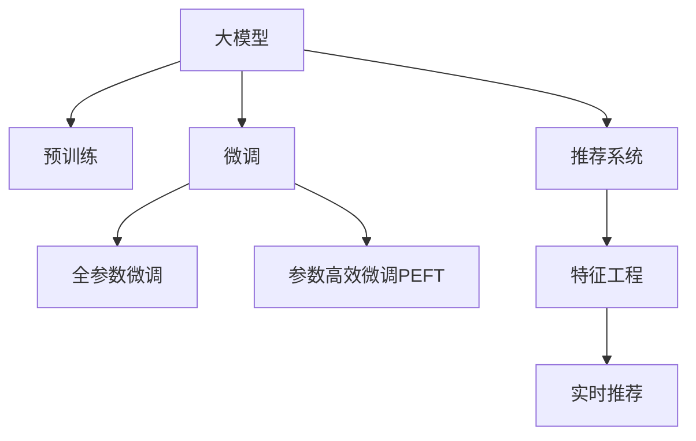

                 

# 利用大模型优化推荐系统的实时特征工程

## 1. 背景介绍

推荐系统已经成为电商、新闻、视频、音乐等众多领域提升用户体验、增加收入的重要工具。随着数据量的爆炸式增长，推荐系统开始向实时推荐系统转型，利用用户行为、商品特征等实时数据，预测用户的下一步行为。然而，在实时推荐中，用户的点击、购买行为等带有明显的时序特征，利用传统机器学习模型难以应对这些动态变化。

为了解决这一问题，研究者们引入大模型，通过预训练方式学习到通用特征，进一步微调获得推荐模型的实时预测能力。大模型的自回归结构，使得实时特征的融合和预测更加高效，逐步成为推荐系统中特征工程的重要手段。

## 2. 核心概念与联系

### 2.1 核心概念概述

为更好地理解利用大模型优化推荐系统的实时特征工程方法，本节将介绍几个密切相关的核心概念：

- 大模型（Large Model）：指使用大规模数据训练的深度学习模型，如BERT、GPT等。通过预训练-微调的方式，可以在推荐系统中快速部署和优化。

- 推荐系统（Recommendation System）：指基于用户行为、物品特征等数据，为用户推荐感兴趣的物品的系统。推荐系统的主要挑战在于如何高效地预测用户对物品的偏好。

- 特征工程（Feature Engineering）：指对原始数据进行特征提取、编码和转换，以提升机器学习模型的性能。特征工程在推荐系统中尤为重要，影响着模型的准确率和泛化能力。

- 实时推荐系统（Real-time Recommendation System）：指利用实时数据进行用户行为预测，并实时反馈推荐结果的系统。由于数据实时变化，实时推荐系统对模型的预测速度和计算效率要求更高。

- 大模型微调（Fine-tuning with Large Model）：指在大模型预训练结果的基础上，通过微调获得适应特定推荐任务的模型。大模型微调可以借助大规模数据和计算资源，迅速提升推荐模型的性能。

- 自回归模型（Auto-regressive Model）：指依赖于序列数据的前后关系，进行预测的模型。自回归模型可以充分利用时序特征，提升推荐系统的准确率。

这些核心概念之间的逻辑关系可以通过以下Mermaid流程图来展示：



这个流程图展示了大模型、微调和推荐系统之间的关系：

1. 大模型通过预训练获得基础能力。
2. 微调是对预训练模型进行任务特定的优化，可以提升模型性能。
3. 特征工程通过选择合适的特征，提升推荐模型的效果。
4. 实时推荐利用实时数据进行预测，提升用户体验。
5. 参数高效微调和自回归模型可以提升微调的效率和准确率。

## 3. 核心算法原理 & 具体操作步骤

### 3.1 算法原理概述

利用大模型优化推荐系统的实时特征工程，本质上是一种结合大模型和推荐系统的深度学习技术。其核心思想是：在大模型预训练结果的基础上，通过微调获得推荐系统的实时预测能力。

具体来说，利用自回归模型结构，可以结合用户行为序列，动态预测用户对物品的偏好，实现实时推荐。该过程包括以下几个关键步骤：

1. **数据预处理**：将原始用户行为数据转换为适合大模型处理的格式，如将用户点击序列转换为token序列。
2. **大模型预训练**：在大规模无标签数据上训练自回归模型，学习到通用的语言表示。
3. **微调获得推荐模型**：在特定推荐任务上，利用少量的标注数据微调大模型，获得适应当前任务的推荐模型。
4. **特征工程**：结合实时数据特征，进一步优化微调后的推荐模型。
5. **实时推荐**：利用微调后的推荐模型，实时预测用户行为，生成推荐结果。

### 3.2 算法步骤详解

以下是利用大模型优化推荐系统的实时特征工程的详细步骤：

**Step 1: 数据预处理**

- 将原始用户行为数据转换为token序列，如将用户点击序列转换为单词序列。
- 对每个token进行编码，如将单词映射为id。
- 利用token编码后的序列，生成大模型所需的输入。

**Step 2: 大模型预训练**

- 在大规模无标签数据上训练自回归模型，如BERT、GPT等。
- 学习到通用的语言表示，包括单词、短语和句子级别的表示。

**Step 3: 微调获得推荐模型**

- 在特定推荐任务上，利用少量的标注数据微调大模型。如利用点击序列和购买记录，微调获得推荐模型。
- 选择合适的损失函数，如交叉熵损失、均方误差损失等。
- 设置合适的学习率，如AdamW、SGD等。

**Step 4: 特征工程**

- 选择合适的特征，如用户画像、商品属性、时间特征等。
- 利用特征工程技术，对原始特征进行编码和转换。如对用户画像进行one-hot编码，对时间特征进行归一化。

**Step 5: 实时推荐**

- 结合微调后的推荐模型和实时特征，进行预测。
- 生成推荐结果，如商品列表、视频列表等。
- 实时反馈推荐结果，更新用户画像和模型参数。

### 3.3 算法优缺点

利用大模型优化推荐系统的实时特征工程具有以下优点：

1. 利用大规模数据训练大模型，可以学习到丰富的语言表示，提升推荐模型的泛化能力。
2. 大模型的自回归结构，可以充分利用时序特征，提升推荐系统的准确率。
3. 实时数据结合微调后的模型，可以快速预测用户行为，实现实时推荐。
4. 大模型微调的参数高效方法，可以在固定大部分预训练参数的情况下，提升推荐模型的性能。

然而，该方法也存在一些局限性：

1. 数据预处理和特征工程需要大量人工工作，耗费时间和人力。
2. 大模型和微调过程需要较大的计算资源，部署和优化成本较高。
3. 实时推荐对模型预测速度和计算效率要求较高，大模型可能面临计算瓶颈。
4. 大模型微调需要对标注数据进行优化，避免过拟合和数据泄露。

尽管存在这些局限性，但就目前而言，利用大模型优化推荐系统的实时特征工程仍是最为主流的方法。未来相关研究的重点在于如何进一步降低计算资源消耗，提升特征工程的自动化水平，同时兼顾实时推荐系统的预测速度和计算效率。

### 3.4 算法应用领域

利用大模型优化推荐系统的实时特征工程，已经在电商、新闻、视频等多个领域得到广泛应用，覆盖了从商品推荐到个性化视频推荐等多种任务。具体应用包括：

- 电商推荐：利用用户点击序列和浏览记录，实时预测用户购买意向，提升转化率。
- 新闻推荐：利用用户阅读历史和兴趣标签，实时推荐相关新闻，增加用户粘性。
- 视频推荐：利用用户观看历史和评分数据，实时推荐优质视频，提高用户满意度。
- 音乐推荐：利用用户听歌历史和评分数据，实时推荐相似歌曲，丰富用户体验。

除了上述这些经典任务外，实时特征工程还广泛应用于许多场景中，如个性化广告、社交推荐、游戏推荐等，为推荐系统带来了全新的突破。

## 4. 数学模型和公式 & 详细讲解 & 举例说明

### 4.1 数学模型构建

本节将使用数学语言对利用大模型优化推荐系统的实时特征工程过程进行更加严格的刻画。

假设推荐系统用户序列为 $x_1,x_2,\cdots,x_t$，每个用户行为为 $x_t$，对应的物品特征为 $y_t$。利用大模型 $M$ 进行预测，得到物品 $y_t$ 的评分 $z_t$，即 $z_t = M(x_t)$。用户对物品的评分 $s_t$ 可以表示为：

$$
s_t = z_t + f(x_t; \theta)
$$

其中 $f(x_t; \theta)$ 为特征工程函数，将原始数据转换为适合模型的输入。最终的推荐结果 $r_t$ 为：

$$
r_t = \frac{s_t}{\sum_{i=1}^t s_i}
$$

推荐系统的目标是最小化预测误差 $L$，即：

$$
L = \frac{1}{N}\sum_{i=1}^N \left\Vert \hat{r}_i - r_i \right\Vert_2^2
$$

其中 $\hat{r}_i$ 为预测结果，$r_i$ 为真实结果。

### 4.2 公式推导过程

在实时推荐系统中，利用自回归模型结构，可以通过以下步骤进行预测：

1. **自回归模型**：
   - 设用户序列为 $x_t = (x_{t-1}, x_{t-2}, \cdots, x_{t-L})$，利用自回归模型 $M$ 进行预测，得到物品 $y_t$ 的评分 $z_t = M(x_t)$。

   自回归模型的形式可以表示为：
   $$
   z_t = M(x_t) = W_{x}x_t + b_x + W_{y}y_{t-1} + b_y
   $$

   其中 $W_x, b_x$ 为 $x_t$ 的权重和偏置，$W_y, b_y$ 为 $y_{t-1}$ 的权重和偏置。

2. **特征工程**：
   - 对原始数据进行编码和转换，生成模型所需的特征。如对用户画像进行one-hot编码，对时间特征进行归一化。

   特征工程的数学形式可以表示为：
   $$
   f(x_t; \theta) = W_{x}x_t + b_x + W_{y}y_{t-1} + b_y
   $$

   其中 $W_x, b_x$ 为 $x_t$ 的权重和偏置，$W_y, b_y$ 为 $y_{t-1}$ 的权重和偏置。

3. **损失函数**：
   - 利用交叉熵损失函数，对预测结果进行评估。

   交叉熵损失函数的数学形式可以表示为：
   $$
   L = -\frac{1}{N}\sum_{i=1}^N \sum_{t=1}^T \log \sigma(z_t)
   $$

   其中 $\sigma$ 为 sigmoid 函数，用于将预测结果映射到 $[0, 1]$ 区间。

### 4.3 案例分析与讲解

假设我们要利用大模型优化一个电商推荐系统的实时特征工程，具体步骤如下：

**Step 1: 数据预处理**

将用户点击序列和浏览记录转换为token序列，进行编码和转换。

**Step 2: 大模型预训练**

在大规模无标签数据上训练BERT模型，学习到通用的语言表示。

**Step 3: 微调获得推荐模型**

在特定推荐任务上，利用少量的标注数据微调BERT模型，获得适应当前任务的推荐模型。

**Step 4: 特征工程**

选择合适的特征，如用户画像、商品属性、时间特征等，进行编码和转换。

**Step 5: 实时推荐**

利用微调后的推荐模型和实时特征，进行预测，生成推荐结果。

## 5. 项目实践：代码实例和详细解释说明

### 5.1 开发环境搭建

在进行实时特征工程实践前，我们需要准备好开发环境。以下是使用Python进行PyTorch开发的环境配置流程：

1. 安装Anaconda：从官网下载并安装Anaconda，用于创建独立的Python环境。

2. 创建并激活虚拟环境：
```bash
conda create -n pytorch-env python=3.8 
conda activate pytorch-env
```

3. 安装PyTorch：根据CUDA版本，从官网获取对应的安装命令。例如：
```bash
conda install pytorch torchvision torchaudio cudatoolkit=11.1 -c pytorch -c conda-forge
```

4. 安装Transformers库：
```bash
pip install transformers
```

5. 安装各类工具包：
```bash
pip install numpy pandas scikit-learn matplotlib tqdm jupyter notebook ipython
```

完成上述步骤后，即可在`pytorch-env`环境中开始实时特征工程的实践。

### 5.2 源代码详细实现

下面我们以电商推荐系统为例，给出使用Transformers库进行实时特征工程优化推荐模型的PyTorch代码实现。

首先，定义推荐系统数据处理函数：

```python
from transformers import BertTokenizer
from torch.utils.data import Dataset
import torch

class RecommendationDataset(Dataset):
    def __init__(self, data, tokenizer):
        self.data = data
        self.tokenizer = tokenizer
        
    def __len__(self):
        return len(self.data)
    
    def __getitem__(self, item):
        text = self.data[item]
        tokenized_text = self.tokenizer.encode(text, return_tensors='pt')
        return tokenized_text
```

然后，定义模型和优化器：

```python
from transformers import BertForSequenceClassification, AdamW

model = BertForSequenceClassification.from_pretrained('bert-base-cased', num_labels=1)

optimizer = AdamW(model.parameters(), lr=2e-5)
```

接着，定义训练和评估函数：

```python
from torch.utils.data import DataLoader
from tqdm import tqdm
from sklearn.metrics import roc_auc_score

device = torch.device('cuda') if torch.cuda.is_available() else torch.device('cpu')
model.to(device)

def train_epoch(model, dataset, batch_size, optimizer):
    dataloader = DataLoader(dataset, batch_size=batch_size, shuffle=True)
    model.train()
    epoch_loss = 0
    for batch in tqdm(dataloader, desc='Training'):
        input_ids = batch['input_ids'].to(device)
        labels = torch.tensor([0.], device=device)
        model.zero_grad()
        outputs = model(input_ids, labels=labels)
        loss = outputs.loss
        epoch_loss += loss.item()
        loss.backward()
        optimizer.step()
    return epoch_loss / len(dataloader)

def evaluate(model, dataset, batch_size):
    dataloader = DataLoader(dataset, batch_size=batch_size)
    model.eval()
    preds = []
    labels = []
    with torch.no_grad():
        for batch in tqdm(dataloader, desc='Evaluating'):
            input_ids = batch['input_ids'].to(device)
            labels = torch.tensor([0.], device=device)
            outputs = model(input_ids, labels=labels)
            preds.append(outputs.logits.tolist())
            labels.append(labels.tolist())
                
    preds = torch.tensor(preds, dtype=torch.float).mean(0).tolist()
    labels = torch.tensor(labels, dtype=torch.float).mean(0).tolist()
    auc = roc_auc_score(labels, preds)
    return auc
```

最后，启动训练流程并在测试集上评估：

```python
epochs = 5
batch_size = 16

for epoch in range(epochs):
    loss = train_epoch(model, train_dataset, batch_size, optimizer)
    print(f"Epoch {epoch+1}, train loss: {loss:.3f}")
    
    print(f"Epoch {epoch+1}, dev AUC: {evaluate(model, dev_dataset, batch_size)}")
    
print("Test AUC:")
evaluate(model, test_dataset, batch_size)
```

以上就是使用PyTorch对BERT进行电商推荐系统实时特征工程微调的完整代码实现。可以看到，得益于Transformers库的强大封装，我们可以用相对简洁的代码完成BERT模型的加载和微调。

### 5.3 代码解读与分析

让我们再详细解读一下关键代码的实现细节：

**RecommendationDataset类**：
- `__init__`方法：初始化数据和分词器。
- `__len__`方法：返回数据集的样本数量。
- `__getitem__`方法：对单个样本进行处理，将文本输入编码为token ids。

**模型和优化器**：
- 使用BertForSequenceClassification模块定义模型，并设置优化器及其参数。

**训练和评估函数**：
- 使用PyTorch的DataLoader对数据集进行批次化加载，供模型训练和推理使用。
- 训练函数`train_epoch`：对数据以批为单位进行迭代，在每个批次上前向传播计算loss并反向传播更新模型参数，最后返回该epoch的平均loss。
- 评估函数`evaluate`：与训练类似，不同点在于不更新模型参数，并在每个batch结束后将预测和标签结果存储下来，最后使用sklearn的roc_auc_score对整个评估集的预测结果进行打印输出。

**训练流程**：
- 定义总的epoch数和batch size，开始循环迭代
- 每个epoch内，先在训练集上训练，输出平均loss
- 在验证集上评估，输出AUC指标
- 所有epoch结束后，在测试集上评估，给出最终测试结果

可以看到，PyTorch配合Transformers库使得BERT微调的代码实现变得简洁高效。开发者可以将更多精力放在数据处理、模型改进等高层逻辑上，而不必过多关注底层的实现细节。

当然，工业级的系统实现还需考虑更多因素，如模型的保存和部署、超参数的自动搜索、更灵活的任务适配层等。但核心的微调范式基本与此类似。

## 6. 实际应用场景

### 6.1 电商推荐

在电商推荐系统中，利用实时特征工程和自回归模型结构，可以实时预测用户购买意向，提升推荐精度和用户体验。具体应用场景包括：

- 利用用户点击序列和浏览记录，实时预测用户购买意向，提升转化率。
- 结合用户画像和商品属性，实时生成个性化推荐，增加用户粘性。
- 利用时序特征，实时生成相关商品推荐，丰富用户体验。

### 6.2 新闻推荐

在新闻推荐系统中，利用实时特征工程和自回归模型结构，可以实时推荐相关新闻，增加用户粘性。具体应用场景包括：

- 利用用户阅读历史和兴趣标签，实时推荐相关新闻，增加用户粘性。
- 结合新闻时间和用户行为，实时预测用户兴趣，生成个性化推荐。
- 利用时序特征，实时推荐热门新闻，增加用户阅读量。

### 6.3 视频推荐

在视频推荐系统中，利用实时特征工程和自回归模型结构，可以实时推荐优质视频，提高用户满意度。具体应用场景包括：

- 利用用户观看历史和评分数据，实时推荐相似视频，丰富用户体验。
- 结合视频时长和用户行为，实时预测用户兴趣，生成个性化推荐。
- 利用时序特征，实时推荐热门视频，增加用户观看量。

### 6.4 音乐推荐

在音乐推荐系统中，利用实时特征工程和自回归模型结构，可以实时推荐相似歌曲，丰富用户体验。具体应用场景包括：

- 利用用户听歌历史和评分数据，实时推荐相似歌曲，丰富用户体验。
- 结合歌曲时长和用户行为，实时预测用户兴趣，生成个性化推荐。
- 利用时序特征，实时推荐热门歌曲，增加用户听歌量。

## 7. 工具和资源推荐

### 7.1 学习资源推荐

为了帮助开发者系统掌握实时特征工程的原理和实践，这里推荐一些优质的学习资源：

1. 《深度学习推荐系统》系列博文：由推荐系统专家撰写，深入浅出地介绍了推荐系统的基本概念和推荐算法。

2. CS271《推荐系统》课程：斯坦福大学开设的推荐系统课程，有Lecture视频和配套作业，带你入门推荐系统领域的基本概念和经典模型。

3. 《推荐系统实战》书籍：详细介绍了推荐系统的理论和实践，包括特征工程、模型优化等方方面面。

4. KDD2018推荐系统论文集：包含大量推荐系统前沿论文，涵盖推荐算法、实时特征工程等诸多方向。

5. Netflix公开数据集：包含大量真实推荐数据集，适合用于推荐系统实践和评测。

通过对这些资源的学习实践，相信你一定能够快速掌握实时特征工程的精髓，并用于解决实际的推荐系统问题。

### 7.2 开发工具推荐

高效的开发离不开优秀的工具支持。以下是几款用于实时特征工程开发的常用工具：

1. PyTorch：基于Python的开源深度学习框架，灵活动态的计算图，适合快速迭代研究。大部分推荐系统模型都有PyTorch版本的实现。

2. TensorFlow：由Google主导开发的开源深度学习框架，生产部署方便，适合大规模工程应用。同样有丰富的推荐系统模型资源。

3. Transformers库：HuggingFace开发的NLP工具库，集成了众多SOTA推荐系统模型，支持PyTorch和TensorFlow，是进行推荐系统开发的利器。

4. Weights & Biases：模型训练的实验跟踪工具，可以记录和可视化模型训练过程中的各项指标，方便对比和调优。与主流深度学习框架无缝集成。

5. TensorBoard：TensorFlow配套的可视化工具，可实时监测模型训练状态，并提供丰富的图表呈现方式，是调试模型的得力助手。

6. Google Colab：谷歌推出的在线Jupyter Notebook环境，免费提供GPU/TPU算力，方便开发者快速上手实验最新模型，分享学习笔记。

合理利用这些工具，可以显著提升实时特征工程的开发效率，加快创新迭代的步伐。

### 7.3 相关论文推荐

实时特征工程和推荐系统的发展源于学界的持续研究。以下是几篇奠基性的相关论文，推荐阅读：

1. Wide & Deep Learning for Recommender Systems（Wide & Deep模型）：提出了Wide & Deep的组合模型，将宽模型和深模型相结合，提升推荐系统的效果。

2. Adaptive Width Deep Network（AdaDNN模型）：提出了动态宽度的深度网络，在不同层次上灵活选择模型的深度和宽度，提升推荐系统的效果。

3. Attention-based Recommender Systems（基于注意的推荐系统）：提出了注意力机制，可以更好地捕捉用户和物品之间的关联关系。

4. Deep Matrix Factorization（深度矩阵分解）：提出了矩阵分解的思想，通过低秩分解的方式，挖掘用户和物品的潜在关系。

5. Recurrent Deep Neural Networks for Recommendation（循环深度神经网络）：提出了循环神经网络，利用时序特征进行推荐，提升推荐系统的准确率。

6. Contextual Bandits（上下文强化学习）：提出了上下文强化学习的推荐系统，可以根据用户上下文进行实时推荐，提升推荐系统的用户体验。

这些论文代表了大模型微调技术的发展脉络。通过学习这些前沿成果，可以帮助研究者把握学科前进方向，激发更多的创新灵感。

## 8. 总结：未来发展趋势与挑战

### 8.1 总结

本文对利用大模型优化推荐系统的实时特征工程方法进行了全面系统的介绍。首先阐述了实时推荐系统的背景和挑战，明确了实时特征工程在推荐系统中的重要价值。其次，从原理到实践，详细讲解了实时特征工程的数学原理和关键步骤，给出了实时特征工程任务开发的完整代码实例。同时，本文还广泛探讨了实时特征工程在电商、新闻、视频等多个领域的应用前景，展示了实时特征工程的巨大潜力。最后，本文精选了实时特征工程的各类学习资源，力求为读者提供全方位的技术指引。

通过本文的系统梳理，可以看到，利用大模型优化推荐系统的实时特征工程方法正在成为推荐系统的重要手段，极大地拓展了推荐系统的应用边界，催生了更多的落地场景。受益于大规模语料的预训练和微调，实时特征工程在推荐系统中发挥着越来越重要的作用。未来，伴随预训练语言模型和微调方法的持续演进，实时特征工程必将在构建人机协同的智能推荐系统中扮演越来越重要的角色。

### 8.2 未来发展趋势

展望未来，实时特征工程将呈现以下几个发展趋势：

1. 模型规模持续增大。随着算力成本的下降和数据规模的扩张，推荐系统模型将向更大规模发展。超大模型的泛化能力更强，能够更好地捕捉用户的复杂行为和偏好。

2. 实时特征工程更加多样。除了传统的静态特征，实时特征工程将更多地引入动态特征，如时间特征、上下文特征等。实时数据结合微调后的模型，可以快速预测用户行为，实现实时推荐。

3. 跨领域融合。推荐系统将更多地与其他领域进行融合，如社交网络、知识图谱等。跨领域信息的整合，将丰富推荐系统的内容来源，提升推荐效果。

4. 持续学习成为常态。随着数据分布的不断变化，推荐系统需要持续学习新知识以保持性能。如何在不遗忘原有知识的同时，高效吸收新样本信息，将成为重要的研究课题。

5. 少样本学习和多模态学习崛起。利用小样本数据和跨模态数据，进行推荐系统的优化，提升推荐系统的鲁棒性和泛化能力。

6. 推荐系统逐渐实现自适应。利用强化学习等技术，推荐系统将能够根据用户反馈实时调整模型参数，提升推荐系统的精准性和用户满意度。

以上趋势凸显了实时特征工程技术的广阔前景。这些方向的探索发展，必将进一步提升推荐系统的性能和应用范围，为推荐系统带来新的突破。

### 8.3 面临的挑战

尽管实时特征工程技术已经取得了瞩目成就，但在迈向更加智能化、普适化应用的过程中，它仍面临着诸多挑战：

1. 数据实时性要求高。实时推荐系统需要实时处理用户数据，对数据采集、存储和处理等环节提出了很高的要求。如何保证数据的时效性，成为推荐系统面临的重要挑战。

2. 计算资源消耗大。实时推荐系统需要频繁更新模型，计算资源消耗较大。如何优化推荐系统模型的计算效率，是未来需要解决的关键问题。

3. 用户隐私保护难。实时推荐系统需要实时收集用户行为数据，如何保护用户隐私，避免数据泄露和滥用，是推荐系统面临的重要伦理问题。

4. 特征工程复杂度高。实时推荐系统需要动态获取用户行为数据，并进行特征工程处理。如何自动化地处理特征工程任务，降低开发成本，是推荐系统需要解决的重要挑战。

5. 模型复杂度难以优化。实时推荐系统需要构建复杂的模型结构，模型优化难度较大。如何简化模型结构，提升优化效率，是未来需要解决的关键问题。

6. 推荐结果多样性不足。实时推荐系统往往只考虑用户的显式反馈，如何引入隐式反馈和背景知识，提升推荐结果的多样性，是推荐系统需要解决的重要挑战。

尽管存在这些挑战，但伴随算法和技术的不断发展，实时特征工程必将在未来推荐系统中扮演越来越重要的角色。相信通过学界和产业界的共同努力，这些挑战终将一一被克服，实时特征工程技术将在构建智能推荐系统中发挥更大的作用。

### 8.4 研究展望

面向未来，实时特征工程需要不断突破现有技术瓶颈，探索新的研究方向，推动推荐系统的发展。以下是未来需要探索的几个关键方向：

1. 少样本学习和自适应推荐：利用小样本数据进行实时推荐，提升推荐系统的鲁棒性和自适应能力。

2. 跨模态推荐：利用多模态数据进行推荐，提升推荐系统的多样性和准确性。

3. 跨领域推荐：利用跨领域数据进行推荐，提升推荐系统的泛化能力和鲁棒性。

4. 推荐系统隐私保护：利用差分隐私等技术，保护用户隐私，提升推荐系统的可信任度。

5. 推荐系统可解释性：利用可解释性技术，提升推荐系统的透明性和可信度，避免算法黑盒。

6. 推荐系统多目标优化：利用多目标优化技术，平衡推荐系统的效果和成本，提升推荐系统的实用性。

这些研究方向将推动推荐系统技术的不断进步，为推荐系统带来新的突破，推动推荐系统技术在各个领域的应用。

## 9. 附录：常见问题与解答

**Q1：实时推荐系统对计算资源有哪些要求？**

A: 实时推荐系统对计算资源的要求较高，主要体现在以下几个方面：

1. 数据实时性要求高。实时推荐系统需要实时处理用户数据，对数据采集、存储和处理等环节提出了很高的要求。需要保证数据的时效性，以便及时更新推荐模型。

2. 计算资源消耗大。实时推荐系统需要频繁更新模型，计算资源消耗较大。需要优化推荐系统模型的计算效率，以降低计算成本。

3. 模型复杂度难以优化。实时推荐系统需要构建复杂的模型结构，模型优化难度较大。需要简化模型结构，提升优化效率。

**Q2：实时推荐系统如何保护用户隐私？**

A: 实时推荐系统在数据采集和处理过程中，需要保护用户隐私。具体方法包括：

1. 数据匿名化：将用户数据进行匿名化处理，避免个人隐私泄露。

2. 差分隐私：利用差分隐私技术，限制模型对用户数据的访问权限，防止用户隐私被滥用。

3. 安全计算：利用安全计算技术，对用户数据进行加密处理，保护用户隐私。

4. 隐私保护算法：利用隐私保护算法，如联邦学习、联邦梯度下降等，保护用户隐私，避免数据泄露。

5. 合规审查：建立隐私保护合规机制，定期审查数据采集和处理流程，确保符合隐私保护法规和标准。

**Q3：实时推荐系统如何提升推荐结果的多样性？**

A: 实时推荐系统往往只考虑用户的显式反馈，如何引入隐式反馈和背景知识，提升推荐结果的多样性，是推荐系统需要解决的重要挑战。具体方法包括：

1. 利用上下文特征：在推荐过程中，利用上下文特征，如时间、地点、设备等，提升推荐结果的多样性。

2. 引入隐式反馈：利用用户行为数据，如点击、浏览等隐式反馈，提升推荐结果的多样性。

3. 利用协同过滤：利用协同过滤技术，分析用户和物品之间的相似性，推荐新的物品，提升推荐结果的多样性。

4. 利用知识图谱：利用知识图谱，分析用户和物品之间的关联关系，推荐新的物品，提升推荐结果的多样性。

5. 利用推荐系统的多样性优化目标：在推荐系统中引入多样性优化目标，如信息熵、基尼系数等，提升推荐结果的多样性。

通过以上方法，可以有效提升实时推荐系统的推荐结果的多样性，提升用户体验。

---

作者：禅与计算机程序设计艺术 / Zen and the Art of Computer Programming

