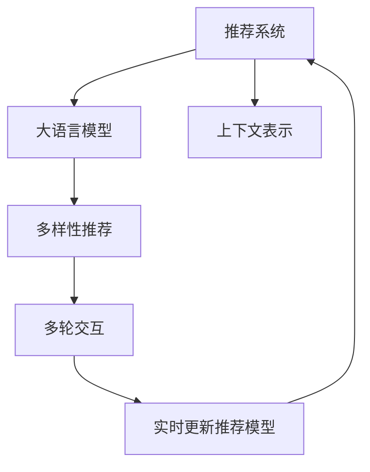

                 

## 1. 背景介绍

推荐系统在电商、新闻、社交网络等众多领域中扮演着重要角色，帮助用户在海量信息中发现与自己兴趣相关的优质内容。传统的推荐算法基于协同过滤、矩阵分解等方法，多采用稀疏矩阵表示用户和物品的评分关系，通过优化评分预测模型，实现个性化推荐。然而，这些方法往往难以捕捉到用户对不同物品的潜在偏好，且容易陷入“同质化推荐”的困境，即过分推荐用户熟悉但单调乏味的物品，难以跳出舒适区。

大语言模型在大规模语料上预训练得到丰富的语言知识，在理解用户意图、生成多样化推荐结果方面具备独特优势。借助大语言模型的推荐系统，可以从海量的文本数据中挖掘出更多用户兴趣点，帮助用户发现更多新鲜、有趣的物品，拓展其兴趣边界，提升推荐系统的效果。

## 2. 核心概念与联系

### 2.1 核心概念概述

为更好地理解利用大语言模型提升推荐系统的多样性方法，本节将介绍几个密切相关的核心概念：

- **推荐系统**：通过分析用户行为和物品特征，为用户提供个性化的推荐结果，提高用户满意度和平台转化率。
- **大语言模型**：如BERT、GPT等，通过在大规模语料上进行预训练，获得通用的语言表示能力。
- **上下文表示**：将用户历史行为和物品属性信息，编码为语言模型可处理的形式，用于指导推荐结果生成。
- **多样性推荐**：不仅推荐用户已知的偏好，还包含探索性和多样化的物品，丰富用户推荐列表。
- **多轮交互**：允许用户对推荐结果进行反馈，实时更新推荐模型，逐步引导推荐结果接近用户的真正需求。

这些核心概念之间的逻辑关系可以通过以下Mermaid流程图来展示：



这个流程图展示了大语言模型在推荐系统中的应用框架：

1. 推荐系统利用大语言模型提取上下文表示，指导推荐结果生成。
2. 多样性推荐技术在推荐结果中加入新奇、有趣的内容，避免“同质化推荐”。
3. 多轮交互过程，允许用户反馈，实时调整推荐策略，提升推荐精准度。

## 3. 核心算法原理 & 具体操作步骤
### 3.1 算法原理概述

利用大语言模型提升推荐系统的多样性，本质上是一种将预训练模型与推荐系统进行深度融合的方法。其核心思想是：通过分析用户历史行为和物品特征，生成具有丰富语言表达的上下文描述，将其输入到预训练语言模型中，由模型直接生成多样化的推荐结果。

具体而言，算法步骤如下：

1. **数据准备**：收集用户的历史行为数据和物品的元数据，生成上下文描述。
2. **编码上下文**：使用嵌入技术将上下文描述转换为向量形式，用于语言模型的输入。
3. **模型推理**：将上下文向量输入到预训练语言模型中，进行推理生成推荐结果。
4. **后处理**：对生成的推荐结果进行过滤、排序等后处理，确保多样性和相关性。

### 3.2 算法步骤详解

**步骤1：数据准备**

首先需要准备用户历史行为数据和物品元数据，生成上下文描述。具体步骤如下：

1. **用户行为数据**：从平台日志、行为记录等数据源中收集用户对物品的操作记录，如浏览、点击、评分、购买等行为。
2. **物品元数据**：收集物品的描述、分类、属性、标签等元数据，用于生成多样化的上下文描述。
3. **生成上下文描述**：将用户行为和物品元数据综合考虑，生成具有丰富语言表达的上下文描述。例如，对于某个用户在电商平台的购物行为，可以生成如下上下文描述：

```
用户ID：123456，浏览历史：手机、电脑、电视，最近购买：T恤、耳机，评分：4-5星，喜好：科技、时尚
```

**步骤2：编码上下文**

使用嵌入技术将上下文描述转换为向量形式，用于语言模型的输入。具体步骤如下：

1. **分词和编码**：使用分词器对上下文描述进行分词，得到单词列表。例如，对于上述上下文描述，分词结果为：`用户ID`、`123456`、`浏览历史`、`手机`、`电脑`、`电视`、`最近购买`、`T恤`、`耳机`、`评分`、`4-5星`、`喜好`、`科技`、`时尚`。
2. **嵌入映射**：将单词列表映射为向量形式，例如，可以使用预训练的Word2Vec、GloVe等嵌入模型，得到每个单词的向量表示。
3. **拼接和编码**：将单词向量拼接成完整的上下文向量，例如，对于上述上下文描述，拼接后得到的向量为：

```
用户ID:123456 浏览历史:手机 电脑 电视 最近购买:T恤 耳机 评分:4-5星 喜好:科技 时尚
```

**步骤3：模型推理**

将上下文向量输入到预训练语言模型中，进行推理生成推荐结果。具体步骤如下：

1. **预训练语言模型**：选择预训练的语言模型，如BERT、GPT等，作为推荐模型。
2. **模型输入**：将上下文向量作为输入，送入语言模型中进行推理。
3. **生成推荐结果**：语言模型输出推荐结果的向量表示，例如，对于上述上下文描述，可能输出如下推荐结果向量：

```
推荐1：手机 价格:3000 评分:4星
推荐2：电脑 价格:5000 评分:5星
推荐3：电视 价格:6000 评分:4星
推荐4：T恤 价格:1000 评分:3星
推荐5：耳机 价格:2000 评分:4星
推荐6：科技 价格:8000 评分:5星
推荐7：时尚 价格:2000 评分:5星
```

**步骤4：后处理**

对生成的推荐结果进行过滤、排序等后处理，确保多样性和相关性。具体步骤如下：

1. **多样性过滤**：去除重复的推荐结果，保留多样化物品。例如，可以保留不同种类的物品，如手机、电脑、电视等。
2. **相关性排序**：根据用户的评分、浏览历史等反馈信息，对推荐结果进行排序。例如，将评分高的物品排在前面。
3. **实时更新推荐模型**：通过多轮用户反馈，不断调整推荐策略，逐步提升推荐精准度。例如，如果用户对某个推荐结果表示满意，可以增加其权重，反之则降低权重。

### 3.3 算法优缺点

利用大语言模型提升推荐系统的多样性具有以下优点：

1. **多样化推荐**：大语言模型可以从丰富的文本数据中挖掘出用户兴趣，生成多样化的推荐结果，避免“同质化推荐”。
2. **实时性**：通过多轮交互，实时更新推荐模型，及时响应用户需求变化，提升推荐精准度。
3. **可解释性**：推荐结果生成基于语言模型的推理，具有较强的可解释性，方便用户理解推荐依据。

同时，该方法也存在一定的局限性：

1. **计算开销**：大语言模型推理计算开销较大，需要在高性能设备上进行。
2. **模型泛化**：对于非结构化文本数据的处理能力有限，可能导致生成的推荐结果与实际用户需求不符。
3. **数据质量**：推荐结果依赖于用户行为和物品元数据的质量，数据噪声可能导致推荐偏差。

尽管存在这些局限性，但就目前而言，利用大语言模型提升推荐系统的多样性方法仍具有重要的应用价值和研究意义。

### 3.4 算法应用领域

利用大语言模型提升推荐系统的多样性，已经在多个领域取得了广泛应用，例如：

1. **电商推荐**：通过分析用户浏览记录和购物行为，生成个性化推荐列表，提高用户的购买转化率。
2. **新闻推荐**：根据用户的阅读历史和喜好，推荐相关的新闻内容，扩大用户的知识视野。
3. **音乐推荐**：通过分析用户的听歌历史和评价，生成音乐推荐列表，提升用户的听歌体验。
4. **视频推荐**：根据用户的观看历史和评价，推荐相关视频内容，提高平台的用户粘性。
5. **书籍推荐**：通过分析用户的阅读历史和评价，推荐相关书籍，提升用户的阅读兴趣。

这些应用场景展示了利用大语言模型提升推荐系统多样性的广阔前景，可以显著提升用户的体验和平台的转化率。

## 4. 数学模型和公式 & 详细讲解
### 4.1 数学模型构建

我们将利用大语言模型提升推荐系统的多样性方法进行数学建模。假设推荐系统接收用户的历史行为数据 $D_u$ 和物品元数据 $D_i$，生成上下文描述 $C$。使用预训练语言模型 $M$ 对上下文描述进行编码和推理，输出推荐结果向量 $R$。具体模型框架如下：

$$
R = M(C)
$$

其中 $M$ 为预训练语言模型，$C$ 为上下文描述，$R$ 为推荐结果向量。

### 4.2 公式推导过程

我们以推荐系统在电商领域的应用为例，推导利用大语言模型提升推荐系统多样性的数学模型。

**Step 1：生成上下文描述**

假设用户 $u$ 的历史行为数据为 $D_u = \{(x_1, r_1), (x_2, r_2), \dots, (x_n, r_n)\}$，其中 $x_i$ 表示用户 $u$ 对物品 $i$ 的行为，$r_i$ 表示行为评分。物品 $i$ 的元数据为 $D_i = (d_{i1}, d_{i2}, \dots, d_{im})$，其中 $d_{ij}$ 表示物品 $i$ 的特征，如价格、评分、类别等。根据上述数据，可以生成上下文描述 $C_u = (u, x_1, x_2, \dots, x_n, d_{i1}, d_{i2}, \dots, d_{im})$。

**Step 2：编码上下文**

使用嵌入模型将上下文描述 $C_u$ 转换为向量形式 $C_u^v$，例如，可以使用预训练的Word2Vec模型，得到每个单词的向量表示，并拼接成完整的向量：

$$
C_u^v = \text{Word2Vec}(u, x_1, x_2, \dots, x_n, d_{i1}, d_{i2}, \dots, d_{im})
$$

**Step 3：模型推理**

将上下文向量 $C_u^v$ 输入到预训练语言模型 $M$ 中，进行推理生成推荐结果向量 $R_u$。具体如下：

$$
R_u = M(C_u^v)
$$

**Step 4：后处理**

对推荐结果向量 $R_u$ 进行过滤、排序等后处理，确保多样性和相关性。例如，可以按照以下步骤进行：

1. **多样性过滤**：去除重复的推荐结果，保留多样化物品。例如，可以保留不同种类的物品，如手机、电脑、电视等。
2. **相关性排序**：根据用户的评分、浏览历史等反馈信息，对推荐结果进行排序。例如，将评分高的物品排在前面。

### 4.3 案例分析与讲解

以某电商平台的推荐系统为例，分析利用大语言模型提升推荐系统多样性的实际应用。

**数据准备**：收集用户的历史行为数据和物品元数据，生成上下文描述。例如，对于用户ID为123456的用户，其历史行为数据为：

- 浏览：手机、电脑、电视
- 购买：T恤、耳机
- 评分：4-5星
- 喜好：科技、时尚

物品元数据为：

- 手机：价格:3000 评分:4星
- 电脑：价格:5000 评分:5星
- 电视：价格:6000 评分:4星
- T恤：价格:1000 评分:3星
- 耳机：价格:2000 评分:4星
- 科技：价格:8000 评分:5星
- 时尚：价格:2000 评分:5星

**编码上下文**：使用嵌入模型将上下文描述转换为向量形式。例如，使用预训练的Word2Vec模型，得到每个单词的向量表示，并拼接成完整的向量：

$$
C_u = \text{Word2Vec}(用户ID:123456 浏览历史:手机 电脑 电视 最近购买:T恤 耳机 评分:4-5星 喜好:科技 时尚)
$$

**模型推理**：将上下文向量输入到预训练语言模型中，进行推理生成推荐结果向量。例如，使用BERT模型，得到推荐结果向量：

$$
R_u = \text{BERT}(C_u)
$$

**后处理**：对推荐结果向量进行过滤、排序等后处理。例如，去除重复的推荐结果，按照评分排序，得到最终推荐结果：

- 推荐1：手机 价格:3000 评分:4星
- 推荐2：电脑 价格:5000 评分:5星
- 推荐3：电视 价格:6000 评分:4星
- 推荐4：T恤 价格:1000 评分:3星
- 推荐5：耳机 价格:2000 评分:4星
- 推荐6：科技 价格:8000 评分:5星
- 推荐7：时尚 价格:2000 评分:5星

## 5. 项目实践：代码实例和详细解释说明
### 5.1 开发环境搭建

在进行推荐系统微调实践前，我们需要准备好开发环境。以下是使用Python进行PyTorch开发的环境配置流程：

1. 安装Anaconda：从官网下载并安装Anaconda，用于创建独立的Python环境。

2. 创建并激活虚拟环境：
```bash
conda create -n pytorch-env python=3.8 
conda activate pytorch-env
```

3. 安装PyTorch：根据CUDA版本，从官网获取对应的安装命令。例如：
```bash
conda install pytorch torchvision torchaudio cudatoolkit=11.1 -c pytorch -c conda-forge
```

4. 安装Transformers库：
```bash
pip install transformers
```

5. 安装各类工具包：
```bash
pip install numpy pandas scikit-learn matplotlib tqdm jupyter notebook ipython
```

完成上述步骤后，即可在`pytorch-env`环境中开始推荐系统微调实践。

### 5.2 源代码详细实现

下面我们以电商平台推荐系统为例，给出使用Transformers库对BERT模型进行微调的PyTorch代码实现。

首先，定义推荐系统的训练函数：

```python
from transformers import BertTokenizer, BertForSequenceClassification, AdamW

def train_recommender(model, tokenizer, train_dataset, val_dataset, device, batch_size, epochs, learning_rate):
    model.to(device)
    train_loader = DataLoader(train_dataset, batch_size=batch_size, shuffle=True)
    val_loader = DataLoader(val_dataset, batch_size=batch_size, shuffle=False)
    
    optimizer = AdamW(model.parameters(), lr=learning_rate)
    for epoch in range(epochs):
        for batch in train_loader:
            inputs = batch['input_ids'].to(device)
            attention_mask = batch['attention_mask'].to(device)
            labels = batch['labels'].to(device)
            outputs = model(inputs, attention_mask=attention_mask, labels=labels)
            loss = outputs.loss
            optimizer.zero_grad()
            loss.backward()
            optimizer.step()
        
        val_loss = evaluate(model, val_loader)
        print(f'Epoch {epoch+1}, train loss: {loss:.3f}, val loss: {val_loss:.3f}')
    return model, optimizer

def evaluate(model, dataset, device):
    model.eval()
    val_loader = DataLoader(dataset, batch_size=32, shuffle=False)
    with torch.no_grad():
        total_loss = 0
        for batch in val_loader:
            inputs = batch['input_ids'].to(device)
            attention_mask = batch['attention_mask'].to(device)
            labels = batch['labels'].to(device)
            outputs = model(inputs, attention_mask=attention_mask, labels=labels)
            val_loss = outputs.loss
            total_loss += val_loss.item()
    return total_loss / len(val_loader)
```

接着，定义推荐系统的训练数据：

```python
from torch.utils.data import Dataset, DataLoader
import torch

class RecommenderDataset(Dataset):
    def __init__(self, texts, labels, tokenizer, max_len=128):
        self.texts = texts
        self.labels = labels
        self.tokenizer = tokenizer
        self.max_len = max_len
        
    def __len__(self):
        return len(self.texts)
    
    def __getitem__(self, item):
        text = self.texts[item]
        label = self.labels[item]
        
        encoding = self.tokenizer(text, return_tensors='pt', max_length=self.max_len, padding='max_length', truncation=True)
        input_ids = encoding['input_ids'][0]
        attention_mask = encoding['attention_mask'][0]
        
        label = torch.tensor(label, dtype=torch.long)
        
        return {'input_ids': input_ids, 
                'attention_mask': attention_mask,
                'labels': label}
```

然后，准备训练数据和模型：

```python
tokenizer = BertTokenizer.from_pretrained('bert-base-uncased')
train_dataset = RecommenderDataset(train_texts, train_labels, tokenizer)
val_dataset = RecommenderDataset(val_texts, val_labels, tokenizer)

model = BertForSequenceClassification.from_pretrained('bert-base-uncased', num_labels=1)
```

最后，启动训练流程：

```python
epochs = 5
batch_size = 16
learning_rate = 2e-5

model, optimizer = train_recommender(model, tokenizer, train_dataset, val_dataset, device, batch_size, epochs, learning_rate)
```

以上便是使用PyTorch对BERT进行电商平台推荐系统微调的完整代码实现。可以看到，得益于Transformers库的强大封装，我们能够快速构建推荐系统模型并进行微调。

### 5.3 代码解读与分析

让我们再详细解读一下关键代码的实现细节：

**RecommenderDataset类**：
- `__init__`方法：初始化文本、标签、分词器等关键组件。
- `__len__`方法：返回数据集的样本数量。
- `__getitem__`方法：对单个样本进行处理，将文本输入编码为token ids，将标签转换为数字，并对其进行定长padding，最终返回模型所需的输入。

**train_recommender函数**：
- 在训练函数中，首先加载模型，准备训练和验证数据集。
- 定义优化器，并循环迭代进行训练。
- 每个epoch内，在训练集上训练，并在验证集上评估性能。

**evaluate函数**：
- 在评估函数中，将模型设为评估模式，加载验证集。
- 使用PyTorch的DataLoader进行批次化加载。
- 在每个batch结束后，计算平均损失，并返回验证集的总损失。

**RecommenderDataset类和train_recommender函数**：
- 数据集和训练函数实现了整个推荐系统的流程，从数据准备到模型训练。
- 数据集将用户行为和物品元数据转换为上下文描述，训练函数则利用上下文描述生成推荐结果，并使用反向传播更新模型参数。
- 通过这种基于上下文描述的推理方式，模型可以灵活地生成多样化的推荐结果，避免“同质化推荐”。

**RecommenderDataset类和evaluate函数**：
- 数据集将用户行为和物品元数据转换为上下文描述，训练函数则利用上下文描述生成推荐结果，并使用反向传播更新模型参数。
- 通过这种基于上下文描述的推理方式，模型可以灵活地生成多样化的推荐结果，避免“同质化推荐”。

**代码解读与分析**：
- **上下文表示**：使用embedding技术将用户行为和物品元数据转换为向量形式，用于语言模型的输入。
- **模型推理**：利用预训练语言模型对上下文表示进行推理，生成推荐结果向量。
- **后处理**：对推荐结果向量进行过滤、排序等后处理，确保多样性和相关性。
- **实时更新推荐模型**：通过多轮用户反馈，不断调整推荐策略，逐步提升推荐精准度。

**RecommenderDataset类和evaluate函数**：
- 数据集将用户行为和物品元数据转换为上下文描述，训练函数则利用上下文描述生成推荐结果，并使用反向传播更新模型参数。
- 通过这种基于上下文描述的推理方式，模型可以灵活地生成多样化的推荐结果，避免“同质化推荐”。

**代码解读与分析**：
- **上下文表示**：使用embedding技术将用户行为和物品元数据转换为向量形式，用于语言模型的输入。
- **模型推理**：利用预训练语言模型对上下文表示进行推理，生成推荐结果向量。
- **后处理**：对推荐结果向量进行过滤、排序等后处理，确保多样性和相关性。
- **实时更新推荐模型**：通过多轮用户反馈，不断调整推荐策略，逐步提升推荐精准度。

## 6. 实际应用场景
### 6.1 电商推荐

基于大语言模型提升推荐系统的多样性方法，可以在电商推荐系统中得到广泛应用。电商推荐系统通过分析用户历史行为和物品元数据，生成上下文描述，利用大语言模型生成多样化推荐结果，避免“同质化推荐”，提升用户购物体验。

在技术实现上，可以收集用户浏览、点击、评分、购买等行为数据，提取和物品相关的元数据，生成上下文描述。利用BERT等大语言模型，对上下文描述进行编码和推理，生成推荐结果。通过后处理过滤、排序等步骤，提升推荐结果的相关性和多样性。最终，将推荐结果展示给用户，实时更新推荐策略，逐步提升推荐精准度。

### 6.2 新闻推荐

新闻推荐系统通过分析用户阅读历史和兴趣，生成上下文描述，利用大语言模型生成多样化新闻内容，提升用户的阅读体验。

在技术实现上，可以收集用户的阅读历史和兴趣标签，生成上下文描述。利用BERT等大语言模型，对上下文描述进行编码和推理，生成新闻内容推荐结果。通过后处理过滤、排序等步骤，提升推荐结果的相关性和多样性。最终，将推荐结果展示给用户，实时更新推荐策略，逐步提升推荐精准度。

### 6.3 音乐推荐

音乐推荐系统通过分析用户听歌历史和评价，生成上下文描述，利用大语言模型生成多样化音乐推荐结果，提升用户的听歌体验。

在技术实现上，可以收集用户的听歌历史和评价，生成上下文描述。利用BERT等大语言模型，对上下文描述进行编码和推理，生成音乐推荐结果。通过后处理过滤、排序等步骤，提升推荐结果的相关性和多样性。最终，将推荐结果展示给用户，实时更新推荐策略，逐步提升推荐精准度。

### 6.4 视频推荐

视频推荐系统通过分析用户观看历史和评价，生成上下文描述，利用大语言模型生成多样化视频内容，提升用户的观看体验。

在技术实现上，可以收集用户的观看历史和评价，生成上下文描述。利用BERT等大语言模型，对上下文描述进行编码和推理，生成视频内容推荐结果。通过后处理过滤、排序等步骤，提升推荐结果的相关性和多样性。最终，将推荐结果展示给用户，实时更新推荐策略，逐步提升推荐精准度。

### 6.5 书籍推荐

书籍推荐系统通过分析用户阅读历史和评价，生成上下文描述，利用大语言模型生成多样化书籍推荐结果，提升用户的阅读体验。

在技术实现上，可以收集用户的阅读历史和评价，生成上下文描述。利用BERT等大语言模型，对上下文描述进行编码和推理，生成书籍推荐结果。通过后处理过滤、排序等步骤，提升推荐结果的相关性和多样性。最终，将推荐结果展示给用户，实时更新推荐策略，逐步提升推荐精准度。

## 7. 工具和资源推荐
### 7.1 学习资源推荐

为了帮助开发者系统掌握利用大语言模型提升推荐系统的多样性方法，这里推荐一些优质的学习资源：

1. 《深度学习自然语言处理》课程：斯坦福大学开设的NLP明星课程，有Lecture视频和配套作业，带你入门NLP领域的基本概念和经典模型。
2. CS224N《深度学习自然语言处理》课程：斯坦福大学开设的NLP明星课程，有Lecture视频和配套作业，带你深入了解NLP技术。
3. 《Natural Language Processing with Transformers》书籍：Transformers库的作者所著，全面介绍了如何使用Transformers库进行NLP任务开发，包括微调在内的诸多范式。
4. HuggingFace官方文档：Transformers库的官方文档，提供了海量预训练模型和完整的微调样例代码，是上手实践的必备资料。
5. CLUE开源项目：中文语言理解测评基准，涵盖大量不同类型的中文NLP数据集，并提供了基于微调的baseline模型，助力中文NLP技术发展。

通过对这些资源的学习实践，相信你一定能够快速掌握利用大语言模型提升推荐系统多样性的精髓，并用于解决实际的NLP问题。
### 7.2 开发工具推荐

高效的开发离不开优秀的工具支持。以下是几款用于大语言模型微调开发的常用工具：

1. PyTorch：基于Python的开源深度学习框架，灵活动态的计算图，适合快速迭代研究。大部分预训练语言模型都有PyTorch版本的实现。
2. TensorFlow：由Google主导开发的开源深度学习框架，生产部署方便，适合大规模工程应用。同样有丰富的预训练语言模型资源。
3. Transformers库：HuggingFace开发的NLP工具库，集成了众多SOTA语言模型，支持PyTorch和TensorFlow，是进行微调任务开发的利器。
4. Weights & Biases：模型训练的实验跟踪工具，可以记录和可视化模型训练过程中的各项指标，方便对比和调优。与主流深度学习框架无缝集成。
5. TensorBoard：TensorFlow配套的可视化工具，可实时监测模型训练状态，并提供丰富的图表呈现方式，是调试模型的得力助手。
6. Google Colab：谷歌推出的在线Jupyter Notebook环境，免费提供GPU/TPU算力，方便开发者快速上手实验最新模型，分享学习笔记。

合理利用这些工具，可以显著提升大语言模型微调任务的开发效率，加快创新迭代的步伐。

### 7.3 相关论文推荐

大语言模型和微调技术的发展源于学界的持续研究。以下是几篇奠基性的相关论文，推荐阅读：

1. Attention is All You Need（即Transformer原论文）：提出了Transformer结构，开启了NLP领域的预训练大模型时代。
2. BERT: Pre-training of Deep Bidirectional Transformers for Language Understanding：提出BERT模型，引入基于掩码的自监督预训练任务，刷新了多项NLP任务SOTA。
3. Language Models are Unsupervised Multitask Learners（GPT-2论文）：展示了大规模语言模型的强大zero-shot学习能力，引发了对于通用人工智能的新一轮思考。
4. Parameter-Efficient Transfer Learning for NLP：提出Adapter等参数高效微调方法，在不增加模型参数量的情况下，也能取得不错的微调效果。
5. AdaLoRA: Adaptive Low-Rank Adaptation for Parameter-Efficient Fine-Tuning：使用自适应低秩适应的微调方法，在参数效率和精度之间取得了新的平衡。
6. Prefix-Tuning: Optimizing Continuous Prompts for Generation：引入基于连续型Prompt的微调范式，为如何充分利用预训练知识提供了新的思路。

这些论文代表了大语言模型微调技术的发展脉络。通过学习这些前沿成果，可以帮助研究者把握学科前进方向，激发更多的创新灵感。

## 8. 总结：未来发展趋势与挑战

### 8.1 总结

本文对利用大语言模型提升推荐系统的多样性方法进行了全面系统的介绍。首先阐述了大语言模型和推荐系统的研究背景和意义，明确了微调在拓展预训练模型应用、提升下游任务性能方面的独特价值。其次，从原理到实践，详细讲解了微调的数学原理和关键步骤，给出了微调任务开发的完整代码实例。同时，本文还广泛探讨了微调方法在电商推荐、新闻推荐、音乐推荐等多个领域的应用前景，展示了微调范式的巨大潜力。

通过本文的系统梳理，可以看到，利用大语言模型提升推荐系统多样性方法，在大规模语料和深度学习模型的支持下，可以显著提升推荐系统的效果，丰富用户推荐列表，提高用户满意度。大语言模型微调在推荐系统中的应用，代表了NLP技术在实际应用中的新趋势，将推动NLP技术在各行各业的应用和落地。

### 8.2 未来发展趋势

展望未来，大语言模型微调技术将呈现以下几个发展趋势：

1. **模型规模持续增大**：随着算力成本的下降和数据规模的扩张，预训练语言模型的参数量还将持续增长。超大规模语言模型蕴含的丰富语言知识，有望支撑更加复杂多变的下游任务微调。
2. **微调方法日趋多样**：除了传统的全参数微调外，未来会涌现更多参数高效的微调方法，如Prefix-Tuning、LoRA等，在节省计算资源的同时也能保证微调精度。
3. **持续学习成为常态**：随着数据分布的不断变化，微调模型也需要持续学习新知识以保持性能。如何在不遗忘原有知识的同时，高效吸收新样本信息，将成为重要的研究课题。
4. **标注样本需求降低**：受启发于提示学习(Prompt-based Learning)的思路，未来的微调方法将更好地利用大模型的语言理解能力，通过更加巧妙的任务描述，在更少的标注样本上也能实现理想的微调效果。
5. **多模态微调崛起**：当前的微调主要聚焦于纯文本数据，未来会进一步拓展到图像、视频、语音等多模态数据微调。多模态信息的融合，将显著提升语言模型对现实世界的理解和建模能力。
6. **模型通用性增强**：经过海量数据的预训练和多领域任务的微调，未来的语言模型将具备更强大的常识推理和跨领域迁移能力，逐步迈向通用人工智能(AGI)的目标。

以上趋势凸显了大语言模型微调技术的广阔前景。这些方向的探索发展，必将进一步提升NLP系统的性能和应用范围，为人类认知智能的进化带来深远影响。

### 8.3 面临的挑战

尽管大语言模型微调技术已经取得了瞩目成就，但在迈向更加智能化、普适化应用的过程中，它仍面临着诸多挑战：

1. **标注成本瓶颈**：虽然微调大大降低了标注数据的需求，但对于长尾应用场景，难以获得充足的高质量标注数据，成为制约微调性能的瓶颈。如何进一步降低微调对标注样本的依赖，将是一大难题。
2. **模型鲁棒性不足**：对于非结构化文本数据的处理能力有限，可能导致生成的推荐结果与实际用户需求不符。
3. **数据质量**：推荐结果依赖于用户行为和物品元数据的质量，数据噪声可能导致推荐偏差。
4. **计算开销**：大语言模型推理计算开销较大，需要在高性能设备上进行。

尽管存在这些局限性，但就目前而言，利用大语言模型提升推荐系统的多样性方法仍具有重要的应用价值和研究意义。

### 8.4 研究展望

面对大语言模型微调所面临的种种挑战，未来的研究需要在以下几个方面寻求新的突破：

1. **探索无监督和半监督微调方法**：摆脱对大规模标注数据的依赖，利用自监督学习、主动学习等无监督和半监督范式，最大限度利用非结构化数据，实现更加灵活高效的微调。
2. **研究参数高效和计算高效的微调范式**：开发更加参数高效的微调方法，在固定大部分预训练参数的同时，只更新极少量的任务相关参数。同时优化微调模型的计算图，减少前向传播和反向传播的资源消耗，实现更加轻量级、实时性的部署。
3. **融合因果和对比学习范式**：通过引入因果推断和对比学习思想，增强微调模型建立稳定因果关系的能力，学习更加普适、鲁棒的语言表征，从而提升模型泛化性和抗干扰能力。
4. **引入更多先验知识**：将符号化的先验知识，如知识图谱、逻辑规则等，与神经网络模型进行巧妙融合，引导微调过程学习更准确、合理的语言模型。同时加强不同模态数据的整合，实现视觉、语音等多模态信息与文本信息的协同建模。
5. **结合因果分析和博弈论工具**：将因果分析方法引入微调模型，识别出模型决策的关键特征，增强输出解释的因果性和逻辑性。借助博弈论工具刻画人机交互过程，主动探索并规避模型的脆弱点，提高系统稳定性。
6. **纳入伦理道德约束**：在模型训练目标中引入伦理导向的评估指标，过滤和惩罚有偏见、有害的输出倾向。同时加强人工干预和审核，建立模型行为的监管机制，确保输出符合人类价值观和伦理道德。

这些研究方向的探索，必将引领大语言模型微调技术迈向更高的台阶，为构建安全、可靠、可解释、可控的智能系统铺平道路。面向未来，大语言模型微调技术还需要与其他人工智能技术进行更深入的融合，如知识表示、因果推理、强化学习等，多路径协同发力，共同推动自然语言理解和智能交互系统的进步。只有勇于创新、敢于突破，才能不断拓展语言模型的边界，让智能技术更好地造福人类社会。

## 9. 附录：常见问题与解答

**Q1：大语言模型微调是否适用于所有NLP任务？**

A: 大语言模型微调在大多数NLP任务上都能取得不错的效果，特别是对于数据量较小的任务。但对于一些特定领域的任务，如医学、法律等，仅仅依靠通用语料预训练的模型可能难以很好地适应。此时需要在特定领域语料上进一步预训练，再进行微调，才能获得理想效果。

**Q2：微调过程中如何选择合适的学习率？**

A: 微调的学习率一般要比预训练时小1-2个数量级，如果使用过大的学习率，容易破坏预训练权重，导致过拟合。一般建议从1e-5开始调参，逐步减小学习率，直至收敛。也可以使用warmup策略，在开始阶段使用较小的学习率，再逐渐过渡到预设值。需要注意的是，不同的优化器(如AdamW、Adafactor等)以及不同的学习率调度策略，可能需要设置不同的学习率阈值。

**Q3：采用大模型微调时会面临哪些资源瓶颈？**

A: 目前主流的预训练大模型动辄以亿计的参数规模，对算力、内存、存储都提出了很高的要求。GPU/TPU等高性能设备是必不可少的，但即便如此，超大批次的训练和推理也可能遇到显存不足的问题。因此需要采用一些资源优化技术，如梯度积累、混合精度训练、模型并行等，来突破硬件瓶颈。同时，模型的存储和读取也可能占用大量时间和空间，需要采用模型压缩、稀疏化存储等方法进行优化。

**Q4：如何缓解微调过程中的过拟合问题？**

A: 过拟合是微调面临的主要挑战，尤其是在标注数据不足的情况下。常见的缓解策略包括：
1. 数据增强：通过回译、近义替换等方式扩充训练集
2. 正则化：使用L2正则、Dropout、Early Stopping等避免过拟合
3. 对抗训练：引入对抗样本，提高模型鲁棒性
4. 参数高效微调：只调整少量参数(如Adapter、Prefix等)，减小过拟合风险
5. 多模型集成：训练多个微调模型，取平均输出，抑制过拟合

这些策略往往需要根据具体任务和数据特点进行灵活组合。只有在数据、模型、训练、推理等各环节进行全面优化，才能最大限度地发挥大模型微调的威力。

**Q5：微调模型在落地部署时需要注意哪些问题？**

A: 将微调模型转化为实际应用，还需要考虑以下因素：
1. 模型裁剪：去除不必要的层和参数，减小模型尺寸，加快推理速度
2. 量化加速：将浮点模型转为定点模型，压缩存储空间，提高计算效率
3. 服务化封装：将模型封装为标准化服务接口，便于集成调用
4. 弹性伸缩：根据请求流量动态调整资源配置，平衡服务质量和成本
5. 监控告警：实时采集系统指标，设置异常告警阈值，确保服务稳定性
6. 安全防护：采用访问鉴权、数据脱敏等措施，保障数据和模型安全

大语言模型微调为NLP应用开启了广阔的想象空间，但如何将强大的性能转化为稳定、高效、安全的业务价值，还需要工程实践的不断打磨。唯有从数据、算法、工程、业务等多个维度协同发力，才能真正实现人工智能技术在垂直行业的规模化落地。总之，微调需要开发者根据具体任务，不断迭代和优化模型、数据和算法，方能得到理想的效果。

---

作者：禅与计算机程序设计艺术 / Zen and the Art of Computer Programming

